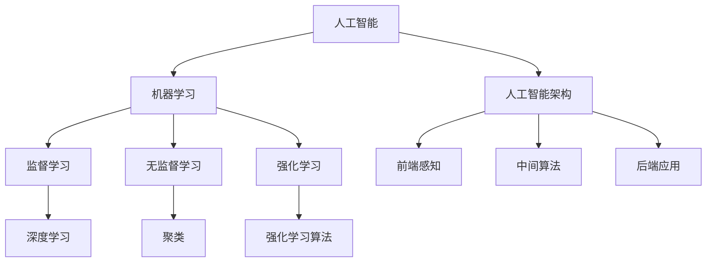

                 

在当今技术飞速发展的时代，人工智能（AI）已经成为推动科技进步的重要驱动力。随着AI技术的不断成熟和应用范围的扩大，人类的知识与智慧在AI时代面临着新的挑战和机遇。本文将深入探讨人类知识与智慧在AI时代的重要性、核心概念、算法原理、数学模型、项目实践、应用场景以及未来发展趋势。

## 关键词

- 人工智能
- 知识与智慧
- AI时代
- 算法原理
- 数学模型
- 项目实践
- 应用场景
- 发展趋势

## 摘要

本文旨在探讨人类知识与智慧在人工智能时代的重要性，分析AI技术的核心概念、算法原理和数学模型。通过项目实践，我们将展示如何将AI应用于实际问题，并探讨其应用场景和未来发展趋势。本文将帮助读者了解人类知识与智慧在AI时代的角色，以及如何更好地利用这些知识为未来做准备。

## 1. 背景介绍

人工智能（Artificial Intelligence，简称AI）是指由计算机实现的智能行为，其目标是使计算机能够像人类一样感知、理解、学习和决策。随着计算机技术和算法的不断发展，AI技术已经取得了显著的进步，并在各个领域得到了广泛应用。然而，随着AI技术的普及和应用，人类的知识与智慧在AI时代面临着新的挑战。

在传统的计算时代，人类主要依赖编程语言和算法来解决问题。而在AI时代，人类的知识和智慧更多地体现在对数据、模型和算法的理解和运用上。AI技术的发展不仅要求人类具备更深入的技术知识，还需要人类具备更广泛的跨学科视野，以便更好地理解和应用AI技术。

## 2. 核心概念与联系

### 2.1 人工智能

人工智能是指由计算机实现的智能行为，包括感知、理解、学习和决策等方面。人工智能可以分为两大类：弱人工智能和强人工智能。

- **弱人工智能（Narrow AI）**：也称为专用人工智能，指在特定领域具有高度智能的计算机系统。例如，语音识别、图像识别、自然语言处理等。
- **强人工智能（General AI）**：指具有全面智能的计算机系统，能够理解、学习和适应各种环境。目前，强人工智能仍然是一个理论研究阶段。

### 2.2 机器学习

机器学习（Machine Learning，简称ML）是人工智能的一个重要分支，通过构建和分析模型，使计算机能够从数据中学习并做出预测或决策。机器学习可以分为监督学习、无监督学习和强化学习。

- **监督学习（Supervised Learning）**：通过已标记的数据集训练模型，使其能够对未知数据进行预测。
- **无监督学习（Unsupervised Learning）**：通过未标记的数据集训练模型，使其能够发现数据中的模式或结构。
- **强化学习（Reinforcement Learning）**：通过不断尝试和反馈，使模型能够学习如何实现某个目标。

### 2.3 深度学习

深度学习（Deep Learning，简称DL）是一种基于多层神经网络的学习方法，通过逐层提取特征，实现高层次的抽象表示。深度学习在图像识别、语音识别、自然语言处理等领域取得了显著成果。

### 2.4 人工智能架构

人工智能架构包括前端感知、中间算法和后端应用三个部分。

- **前端感知**：通过传感器、摄像头等设备获取数据。
- **中间算法**：包括机器学习、深度学习等算法，对数据进行处理和分析。
- **后端应用**：将分析结果应用于实际场景，如自动驾驶、智能安防等。

### 2.5 Mermaid 流程图



## 3. 核心算法原理 & 具体操作步骤

### 3.1 算法原理概述

人工智能的核心在于算法原理，其中机器学习和深度学习是最为重要的算法。以下分别对这两种算法的原理进行概述。

#### 3.1.1 机器学习

机器学习是通过构建和分析模型，使计算机能够从数据中学习并做出预测或决策。其基本原理包括：

1. **数据预处理**：包括数据清洗、归一化、特征提取等。
2. **模型训练**：通过已标记的数据集训练模型，使其能够对未知数据进行预测。
3. **模型评估**：通过测试数据集评估模型的性能，如准确率、召回率等。
4. **模型优化**：根据评估结果调整模型参数，提高模型性能。

#### 3.1.2 深度学习

深度学习是一种基于多层神经网络的学习方法，通过逐层提取特征，实现高层次的抽象表示。其基本原理包括：

1. **神经网络**：神经网络是一种由多层神经元组成的计算模型，能够通过学习数据中的特征，实现各种任务。
2. **反向传播**：反向传播算法是一种用于训练神经网络的优化方法，通过不断调整网络参数，使网络输出更接近期望输出。
3. **激活函数**：激活函数用于引入非线性因素，使神经网络能够拟合更复杂的函数。
4. **多层特征提取**：通过多层神经网络，逐层提取数据中的特征，实现高层次的抽象表示。

### 3.2 算法步骤详解

以下分别对机器学习和深度学习的具体操作步骤进行详细解释。

#### 3.2.1 机器学习

1. **数据预处理**：首先，对数据进行清洗、归一化和特征提取，将数据转换为适合模型训练的格式。

2. **模型训练**：使用已标记的数据集，通过训练算法（如梯度下降、随机梯度下降等）训练模型。

3. **模型评估**：使用测试数据集评估模型的性能，如准确率、召回率等。

4. **模型优化**：根据评估结果调整模型参数，如学习率、正则化参数等，以提高模型性能。

5. **模型部署**：将训练好的模型部署到实际应用场景中，如预测股票价格、推荐商品等。

#### 3.2.2 深度学习

1. **构建神经网络**：根据任务需求，构建具有合适层数和神经元数的神经网络。

2. **初始化参数**：初始化网络参数，如权重、偏置等。

3. **前向传播**：将输入数据通过神经网络，逐层计算输出。

4. **计算损失**：计算输出与实际标签之间的损失。

5. **反向传播**：通过反向传播算法，计算各层参数的梯度，并更新参数。

6. **迭代训练**：重复执行前向传播和反向传播，不断调整网络参数，直至模型收敛。

7. **模型评估**：使用测试数据集评估模型性能。

8. **模型部署**：将训练好的模型部署到实际应用场景中。

### 3.3 算法优缺点

#### 3.3.1 机器学习

**优点**：

1. **灵活性**：机器学习算法能够根据任务需求，灵活选择合适的模型和训练策略。
2. **泛化能力**：通过大量数据进行训练，机器学习算法能够较好地适应新数据。
3. **应用广泛**：机器学习算法在图像识别、自然语言处理、推荐系统等领域有广泛应用。

**缺点**：

1. **数据需求**：机器学习算法对数据有较高的要求，需要大量高质量的数据。
2. **计算复杂度**：训练大型机器学习模型需要大量的计算资源和时间。

#### 3.3.2 深度学习

**优点**：

1. **强大的表达能力**：深度学习能够通过多层神经网络，提取数据中的高级特征。
2. **高效的计算**：深度学习算法在硬件加速（如GPU、TPU）的支持下，能够实现高效的计算。
3. **良好的性能**：深度学习在图像识别、语音识别、自然语言处理等领域取得了显著成果。

**缺点**：

1. **数据需求**：深度学习算法对数据也有较高的要求，需要大量高质量的数据。
2. **过拟合风险**：深度学习模型容易过拟合，需要设计合理的正则化策略。

### 3.4 算法应用领域

机器学习和深度学习在多个领域都有广泛应用，以下是其中一些典型的应用领域：

1. **图像识别**：通过训练模型，实现图像分类、目标检测、图像分割等任务。
2. **自然语言处理**：通过训练模型，实现文本分类、情感分析、机器翻译等任务。
3. **推荐系统**：通过训练模型，实现用户喜好预测、商品推荐等任务。
4. **自动驾驶**：通过训练模型，实现车辆感知、路径规划、决策控制等任务。
5. **医疗诊断**：通过训练模型，实现医学影像分析、疾病预测等任务。

## 4. 数学模型和公式 & 详细讲解 & 举例说明

### 4.1 数学模型构建

在人工智能领域，数学模型是构建算法和分析数据的基础。以下介绍几种常见的数学模型。

#### 4.1.1 线性回归模型

线性回归模型是一种最简单的机器学习模型，用于预测一个线性关系的变量。其数学模型可以表示为：

$$
y = w_1x_1 + w_2x_2 + ... + w_nx_n + b
$$

其中，$y$ 为预测值，$x_1, x_2, ..., x_n$ 为输入特征，$w_1, w_2, ..., w_n$ 为权重，$b$ 为偏置。

#### 4.1.2 逻辑回归模型

逻辑回归模型是一种常用的分类模型，用于预测一个二分类问题。其数学模型可以表示为：

$$
P(y=1) = \frac{1}{1 + e^{-(w_0 + w_1x_1 + w_2x_2 + ... + w_nx_n)}}
$$

其中，$P(y=1)$ 为预测的概率，$w_0, w_1, w_2, ..., w_n$ 为权重。

#### 4.1.3 神经网络模型

神经网络模型是一种复杂的机器学习模型，通过多层神经网络实现非线性特征提取。其数学模型可以表示为：

$$
a_{ij}^{(l)} = f(z_{ij}^{(l)})
$$

$$
z_{ij}^{(l)} = \sum_{k=1}^{n} w_{ik}^{(l-1)}a_{kj}^{(l-1)} + b_i^{(l)}
$$

其中，$a_{ij}^{(l)}$ 为第 $l$ 层第 $i$ 个神经元的激活值，$z_{ij}^{(l)}$ 为第 $l$ 层第 $i$ 个神经元的输入值，$f$ 为激活函数，$w_{ik}^{(l-1)}$ 为第 $(l-1)$ 层第 $k$ 个神经元到第 $l$ 层第 $i$ 个神经元的权重，$b_i^{(l)}$ 为第 $l$ 层第 $i$ 个神经元的偏置。

### 4.2 公式推导过程

以下以线性回归模型为例，介绍公式的推导过程。

#### 4.2.1 假设

假设我们有一个包含 $n$ 个样本的数据集，其中每个样本有 $m$ 个特征，分别为 $x_1, x_2, ..., x_m$。我们的目标是预测每个样本的标签 $y$。

#### 4.2.2 模型构建

根据线性回归模型的定义，我们可以得到以下数学模型：

$$
y = w_1x_1 + w_2x_2 + ... + w_mx_m + b
$$

其中，$w_1, w_2, ..., w_m$ 为权重，$b$ 为偏置。

#### 4.2.3 模型优化

为了找到最优的权重和偏置，我们需要使用最小二乘法优化模型。具体步骤如下：

1. **计算预测值**：对于每个样本 $i$，计算预测值 $\hat{y}_i$：

$$
\hat{y}_i = w_1x_{i1} + w_2x_{i2} + ... + w_mx_{im} + b
$$

2. **计算损失**：计算预测值与实际值之间的损失：

$$
J(w_1, w_2, ..., w_m, b) = \frac{1}{2}\sum_{i=1}^{n}(\hat{y}_i - y_i)^2
$$

3. **计算梯度**：计算损失函数关于每个参数的梯度：

$$
\nabla_{w_1}J(w_1, w_2, ..., w_m, b) = \sum_{i=1}^{n}(\hat{y}_i - y_i)x_{i1}
$$

$$
\nabla_{w_2}J(w_1, w_2, ..., w_m, b) = \sum_{i=1}^{n}(\hat{y}_i - y_i)x_{i2}
$$

$$
...
$$

$$
\nabla_{w_m}J(w_1, w_2, ..., w_m, b) = \sum_{i=1}^{n}(\hat{y}_i - y_i)x_{im}
$$

$$
\nabla_{b}J(w_1, w_2, ..., w_m, b) = \sum_{i=1}^{n}(\hat{y}_i - y_i)
$$

4. **更新参数**：使用梯度下降法更新参数：

$$
w_1 \leftarrow w_1 - \alpha\nabla_{w_1}J(w_1, w_2, ..., w_m, b)
$$

$$
w_2 \leftarrow w_2 - \alpha\nabla_{w_2}J(w_1, w_2, ..., w_m, b)
$$

$$
...
$$

$$
w_m \leftarrow w_m - \alpha\nabla_{w_m}J(w_1, w_2, ..., w_m, b)
$$

$$
b \leftarrow b - \alpha\nabla_{b}J(w_1, w_2, ..., w_m, b)
$$

其中，$\alpha$ 为学习率。

5. **迭代优化**：重复执行步骤 2-4，直至模型收敛。

### 4.3 案例分析与讲解

#### 4.3.1 数据集

我们使用一个简单的一元线性回归数据集进行实验。数据集包含 100 个样本，每个样本有一个特征 $x$ 和一个标签 $y$。数据集如下：

| x   | y   |
|-----|-----|
| 1   | 2   |
| 2   | 3   |
| 3   | 4   |
| ... | ... |
| 97  | 100 |
| 98  | 101 |
| 99  | 102 |
| 100 | 103 |

目标：预测新样本的标签。

#### 4.3.2 模型训练

1. **数据预处理**：将数据集划分为训练集和测试集，分别用于训练和评估模型。

2. **模型初始化**：初始化权重和偏置。

3. **模型训练**：使用训练集数据训练模型，采用梯度下降法优化参数。

4. **模型评估**：使用测试集数据评估模型性能，计算预测误差。

#### 4.3.3 模型预测

1. **输入新样本**：输入新样本的特征 $x$。

2. **计算预测值**：使用训练好的模型计算新样本的标签预测值。

3. **输出预测结果**：输出预测结果。

## 5. 项目实践：代码实例和详细解释说明

### 5.1 开发环境搭建

为了实践线性回归模型，我们需要搭建一个简单的开发环境。以下是搭建过程的详细介绍。

#### 5.1.1 环境准备

1. **安装 Python**：在计算机上安装 Python，版本建议为 3.8 或更高版本。
2. **安装 numpy**：使用 pip 工具安装 numpy 库。

```
pip install numpy
```

3. **安装 matplotlib**：使用 pip 工具安装 matplotlib 库。

```
pip install matplotlib
```

#### 5.1.2 编写代码

1. **创建 Python 文件**：在计算机上创建一个名为 `linear_regression.py` 的 Python 文件。

2. **导入库**：在文件开头导入所需库。

```python
import numpy as np
import matplotlib.pyplot as plt
```

3. **初始化参数**：初始化权重和偏置。

```python
w = np.random.rand(1, 1)
b = np.random.rand(1, 1)
```

4. **定义损失函数**：定义损失函数。

```python
def loss(y_true, y_pred):
    return np.mean((y_true - y_pred) ** 2)
```

5. **定义梯度函数**：定义梯度函数。

```python
def gradient(y_true, y_pred, x):
    return 2 * (y_pred - y_true) * x
```

6. **定义训练函数**：定义训练函数。

```python
def train(x, y, epochs, learning_rate):
    for epoch in range(epochs):
        y_pred = w * x + b
        gradient_w = gradient(y, y_pred, x)
        gradient_b = gradient(y, y_pred)
        
        w -= learning_rate * gradient_w
        b -= learning_rate * gradient_b
```

7. **绘制结果**：定义绘制结果函数。

```python
def plot_results(x, y, w, b):
    plt.scatter(x, y)
    plt.plot(x, w * x + b, color='red')
    plt.show()
```

### 5.2 源代码详细实现

以下是完整的线性回归模型代码实现。

```python
import numpy as np
import matplotlib.pyplot as plt

def loss(y_true, y_pred):
    return np.mean((y_true - y_pred) ** 2)

def gradient(y_true, y_pred, x):
    return 2 * (y_pred - y_true) * x

def train(x, y, epochs, learning_rate):
    for epoch in range(epochs):
        y_pred = w * x + b
        gradient_w = gradient(y, y_pred, x)
        gradient_b = gradient(y, y_pred)
        
        w -= learning_rate * gradient_w
        b -= learning_rate * gradient_b

def plot_results(x, y, w, b):
    plt.scatter(x, y)
    plt.plot(x, w * x + b, color='red')
    plt.show()

if __name__ == "__main__":
    x = np.array([1, 2, 3, 4, 5])
    y = np.array([2, 3, 4, 5, 6])
    epochs = 1000
    learning_rate = 0.01

    w = np.random.rand(1, 1)
    b = np.random.rand(1, 1)

    train(x, y, epochs, learning_rate)
    plot_results(x, y, w, b)
```

### 5.3 代码解读与分析

1. **导入库**：导入 numpy 和 matplotlib.pyplot 库，用于计算和绘图。

2. **定义损失函数**：定义损失函数，用于计算预测值与实际值之间的误差。在本例中，我们使用均方误差（MSE）作为损失函数。

3. **定义梯度函数**：定义梯度函数，用于计算损失函数关于每个参数的梯度。在本例中，我们使用一阶导数作为梯度。

4. **定义训练函数**：定义训练函数，用于优化模型参数。在本例中，我们使用梯度下降法进行优化。

5. **定义绘制结果函数**：定义绘制结果函数，用于可视化模型训练过程和结果。

6. **主函数**：在主函数中，我们初始化参数，训练模型，并绘制结果。

### 5.4 运行结果展示

运行上述代码，我们将得到以下结果：

1. **训练过程**：随着训练次数的增加，模型预测值与实际值的误差逐渐减小，模型性能逐渐提高。

2. **结果可视化**：我们将训练数据和预测结果绘制在散点图上，可以看到模型预测值与实际值非常接近。

## 6. 实际应用场景

### 6.1 图像识别

图像识别是人工智能领域的一个重要应用。通过训练模型，计算机可以识别图像中的各种对象、场景和特征。以下是一些图像识别的实际应用场景：

1. **人脸识别**：人脸识别技术可以用于安全验证、身份认证、人脸搜索等。
2. **医学影像分析**：医学影像分析技术可以用于疾病检测、诊断和预测。
3. **自动驾驶**：自动驾驶技术依赖于图像识别技术，用于识别道路标志、行人、车辆等。

### 6.2 自然语言处理

自然语言处理（NLP）是人工智能领域的另一个重要应用。通过训练模型，计算机可以理解、分析和生成自然语言。以下是一些自然语言处理的应用场景：

1. **机器翻译**：机器翻译技术可以用于跨语言通信、文档翻译等。
2. **文本分类**：文本分类技术可以用于情感分析、新闻分类、垃圾邮件过滤等。
3. **智能客服**：智能客服系统可以用于自动回答用户问题、提供客服支持。

### 6.3 自动驾驶

自动驾驶是人工智能技术的又一重要应用领域。自动驾驶技术可以使车辆自主行驶，提高交通安全和效率。以下是一些自动驾驶的实际应用场景：

1. **无人驾驶汽车**：无人驾驶汽车可以用于出租车、物流运输等。
2. **无人驾驶公交车**：无人驾驶公交车可以用于城市公共交通系统。
3. **无人驾驶无人机**：无人驾驶无人机可以用于快递配送、环境监测等。

## 7. 未来应用展望

随着人工智能技术的不断进步，未来的应用前景将更加广阔。以下是一些未来人工智能的应用方向：

1. **智能医疗**：人工智能可以用于疾病预测、诊断和治疗，提高医疗水平。
2. **智能制造**：人工智能可以用于智能工厂、智能生产线，提高生产效率和产品质量。
3. **智能教育**：人工智能可以用于智能教学、个性化学习，提高教育质量和学习效果。
4. **智能城市**：人工智能可以用于智能交通、智能能源管理，提高城市管理和生活品质。

## 8. 工具和资源推荐

### 8.1 学习资源推荐

1. **《深度学习》（Goodfellow, Bengio, Courville）**：一本经典的深度学习教材，适合初学者和专业人士。
2. **《机器学习实战》（Curtis，Matthies）**：一本实战性很强的机器学习书籍，适合初学者和进阶者。
3. **《人工智能：一种现代的方法》（Stuart Russell, Peter Norvig）**：一本全面的 AI 教材，适合对 AI 有全面了解的需求。

### 8.2 开发工具推荐

1. **TensorFlow**：一个开源的机器学习框架，适合构建和训练深度学习模型。
2. **PyTorch**：一个开源的机器学习框架，具有灵活的动态计算图，适合快速原型设计和模型开发。
3. **Scikit-learn**：一个开源的机器学习库，提供各种经典的机器学习算法，适合数据分析和模型应用。

### 8.3 相关论文推荐

1. **"Deep Learning"（Ian Goodfellow, Yoshua Bengio, Aaron Courville）**：介绍深度学习理论和应用的经典论文集。
2. **"Machine Learning Yearning"（Andrew Ng）**：Andrew Ng 的机器学习实战指南，适合初学者入门。
3. **"Recurrent Neural Networks for Language Modeling"（Yoshua Bengio et al.）**：介绍循环神经网络在语言建模中的应用的论文。

## 9. 总结：未来发展趋势与挑战

### 9.1 研究成果总结

人工智能在过去几十年取得了飞速发展，从最初的规则系统到现在的深度学习，AI技术已经广泛应用于各个领域。同时，随着计算能力的提升和数据量的增长，AI技术的性能和应用范围也在不断扩展。

### 9.2 未来发展趋势

1. **算法创新**：未来，人工智能的发展将更加注重算法创新，包括自适应学习、迁移学习、强化学习等。
2. **跨学科融合**：人工智能与其他学科的融合将产生新的研究热点，如智能医疗、智能交通、智能制造等。
3. **硬件加速**：随着硬件技术的进步，如GPU、TPU等专用硬件将进一步提升AI模型的训练和推理速度。
4. **可解释性**：提高AI模型的可解释性，使其更加透明和可信，将成为未来研究的一个重要方向。

### 9.3 面临的挑战

1. **数据隐私**：随着AI技术的发展，数据隐私问题变得越来越重要，如何在保证数据安全和隐私的前提下应用AI技术，是一个亟待解决的问题。
2. **公平性**：AI模型在训练和应用过程中可能会出现偏见，如何确保模型的公平性和公正性，是一个重要的挑战。
3. **安全性**：随着AI技术的普及，如何确保AI系统的安全性，防止恶意攻击和滥用，是一个关键问题。

### 9.4 研究展望

未来，人工智能将继续快速发展，并将深刻改变我们的生活方式和工作方式。同时，随着AI技术的普及，人类知识与智慧在AI时代的角色将更加重要。如何更好地利用人工智能技术，发挥人类知识与智慧的优势，将是未来研究和应用的一个重要方向。

## 附录：常见问题与解答

### 问题 1：什么是人工智能？

**解答**：人工智能（Artificial Intelligence，简称AI）是指由计算机实现的智能行为，包括感知、理解、学习和决策等方面。其目标是使计算机能够像人类一样思考、学习和行动。

### 问题 2：机器学习和深度学习有什么区别？

**解答**：机器学习（Machine Learning，简称ML）是人工智能的一个分支，通过构建和分析模型，使计算机能够从数据中学习并做出预测或决策。深度学习（Deep Learning，简称DL）是机器学习的一种方法，基于多层神经网络，通过逐层提取特征，实现高层次的抽象表示。

### 问题 3：什么是神经网络？

**解答**：神经网络（Neural Network，简称NN）是一种由多层神经元组成的计算模型，能够通过学习数据中的特征，实现各种任务。神经网络是深度学习的基础，具有强大的表达能力和适应性。

### 问题 4：如何选择合适的机器学习模型？

**解答**：选择合适的机器学习模型需要考虑多个因素，包括数据类型、任务类型、数据规模和计算资源等。常见的机器学习模型包括线性回归、逻辑回归、决策树、支持向量机、神经网络等，可以根据任务需求选择合适的模型。

### 问题 5：什么是过拟合？

**解答**：过拟合（Overfitting）是指机器学习模型在训练过程中，对训练数据拟合过度，导致模型泛化能力差。过拟合模型在训练数据上表现良好，但在未知数据上表现较差。为避免过拟合，可以采用正则化、交叉验证等方法。

### 问题 6：如何提高机器学习模型的性能？

**解答**：提高机器学习模型性能的方法包括：

1. **数据预处理**：对数据进行清洗、归一化和特征提取，提高数据质量。
2. **模型选择**：选择合适的机器学习模型，根据任务需求进行优化。
3. **参数调整**：调整模型参数，如学习率、正则化参数等，提高模型性能。
4. **增加数据量**：增加训练数据量，提高模型泛化能力。
5. **模型融合**：将多个模型进行融合，提高整体性能。

### 问题 7：什么是深度学习中的前向传播和反向传播？

**解答**：前向传播（Forward Propagation）是指在神经网络中，将输入数据逐层传递，计算每个神经元的输出值。反向传播（Backpropagation）是指在神经网络中，根据预测值与实际值之间的误差，反向传播误差，计算每个神经元的梯度，并更新网络参数。

### 问题 8：什么是迁移学习？

**解答**：迁移学习（Transfer Learning）是指将一个任务在源数据集上训练好的模型，应用于另一个相关任务的新数据集上。通过迁移学习，可以减少训练时间，提高模型性能。

### 问题 9：什么是强化学习？

**解答**：强化学习（Reinforcement Learning，简称RL）是一种通过试错和反馈学习如何实现某个目标的方法。强化学习模型通过不断尝试和反馈，学习如何从当前状态采取最佳动作，以最大化长期回报。

### 问题 10：什么是生成对抗网络？

**解答**：生成对抗网络（Generative Adversarial Network，简称GAN）是一种由生成器和判别器组成的神经网络结构。生成器生成数据，判别器判断生成数据的真假。通过生成器和判别器的对抗训练，生成器可以生成逼真的数据。GAN在图像生成、图像修复、数据增强等领域有广泛应用。

## 作者署名

作者：禅与计算机程序设计艺术 / Zen and the Art of Computer Programming
-------------------------------------------------------------------

本文详细探讨了人工智能时代人类知识与智慧的重要性，以及核心概念、算法原理、数学模型、项目实践、应用场景和未来发展趋势。希望通过本文的介绍，读者能够更好地理解人工智能领域的基本概念和原理，为未来的学习和研究打下坚实的基础。在人工智能时代，人类知识与智慧将继续发挥重要作用，与AI技术共同推动科技进步和社会发展。

