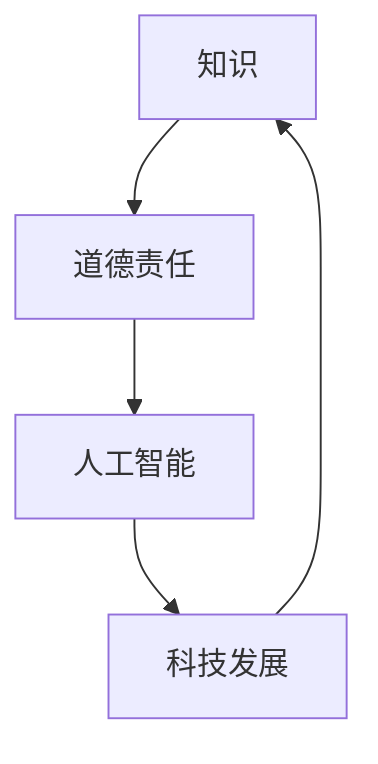

                 

关键词：人工智能、道德责任、知识、技术进步、伦理问题、人机交互

摘要：在人工智能与科技迅猛发展的时代，人类的知识积累达到了前所未有的高度，但随之而来的是关于知识如何影响道德责任、技术发展的伦理问题。本文旨在探讨人类在知识面前的道德责任，分析知识如何塑造人类行为，探讨人工智能技术在道德责任领域中的应用，并提出未来人类在这一领域面临的发展趋势与挑战。

## 1. 背景介绍

随着信息技术的飞速发展，人工智能（AI）逐渐成为推动社会进步的重要力量。然而，人工智能的发展也引发了诸多伦理问题，如隐私权、安全性和道德责任等。在人工智能时代，知识不仅成为推动科技进步的驱动力，也在一定程度上影响了人类的道德观念和行为方式。

本文旨在探讨人类在知识面前的道德责任，分析知识如何塑造人类行为，探讨人工智能技术在道德责任领域中的应用，并提出未来人类在这一领域面临的发展趋势与挑战。

## 2. 核心概念与联系

为了更好地理解人类在知识面前的道德责任，我们首先需要了解几个核心概念：知识、道德责任和人工智能。

### 2.1 知识

知识是人类通过学习、经验积累和思考所获得的信息和技能。在人工智能时代，知识不仅包括传统的人类知识，还包括从大量数据中提取的规律和模式。知识的积累和传播推动了科技的进步，也为人类的生活带来了便利。

### 2.2 道德责任

道德责任是指个人或组织在道德规范下应承担的责任和义务。道德责任涉及行为、决策和行动，关系到人类的基本价值观和道德观念。在知识面前，道德责任变得尤为重要，因为知识的传播和应用可能会对人类社会产生深远的影响。

### 2.3 人工智能

人工智能是指通过计算机模拟人类智能的技术。人工智能技术不仅能够处理和分析大量数据，还能够进行自主学习和决策。随着人工智能技术的不断发展，人工智能在各个领域得到了广泛应用，如医疗、金融、交通等。

### 2.4 知识、道德责任和人工智能的联系

知识、道德责任和人工智能之间存在着密切的联系。知识的积累和应用推动了人工智能技术的发展，而人工智能技术的应用又对人类的道德责任提出了新的挑战。在这个互联的世界中，知识的传播和应用速度越来越快，使得道德责任变得更加复杂和重要。

### 2.5 Mermaid 流程图

以下是一个简单的 Mermaid 流程图，展示了知识、道德责任和人工智能之间的联系。



## 3. 核心算法原理 & 具体操作步骤

### 3.1 算法原理概述

在人工智能领域，许多算法原理都涉及到道德责任的考量。以下是一个简单的例子：道德决策算法。

道德决策算法是一种基于概率和规则的算法，用于在特定情境下做出符合道德规范的决策。算法的输入包括情境描述、道德规则库和道德目标。算法的核心任务是分析情境，从道德规则库中选择合适的规则，并根据道德目标生成决策。

### 3.2 算法步骤详解

道德决策算法的具体操作步骤如下：

#### 3.2.1 确定情境

首先，算法需要接收一个情境描述，如“一个行人突然闯入交通繁忙的道路”。

#### 3.2.2 加载道德规则库

接下来，算法需要加载一个道德规则库，该库包含了各种道德情境下的规则。例如，规则1：“当行人面临生命危险时，应优先救助行人”。

#### 3.2.3 分析情境

算法分析情境描述，判断是否存在符合道德规则的情境。例如，根据情境描述，可以判断出当前情境符合规则1。

#### 3.2.4 选择道德规则

在分析结果中，选择符合情境的道德规则。例如，选择规则1。

#### 3.2.5 生成决策

根据选择的道德规则，生成相应的决策。例如，生成决策：“应优先救助行人”。

### 3.3 算法优缺点

#### 优点

- 简单易实现，适用于各种道德决策场景。
- 基于规则，决策过程透明，易于理解。

#### 缺点

- 规则库的构建和更新需要大量的人工参与，成本较高。
- 对于复杂情境，算法可能无法生成最佳决策。

### 3.4 算法应用领域

道德决策算法可以应用于多个领域，如自动驾驶、医疗决策、金融风控等。在这些领域，算法可以帮助决策者做出符合道德规范的决策，降低决策错误的风险。

## 4. 数学模型和公式 & 详细讲解 & 举例说明

### 4.1 数学模型构建

在道德决策算法中，我们可以使用概率论和博弈论来构建数学模型。以下是一个简单的概率论模型：

设事件A表示“行人面临生命危险”，事件B表示“自动驾驶车辆救助行人”，则事件A和B的概率分别为P(A)和P(B)。根据道德决策算法，我们需要求解条件概率P(B|A)，即“在行人面临生命危险的情况下，自动驾驶车辆救助行人的概率”。

### 4.2 公式推导过程

根据贝叶斯定理，有：

$$
P(B|A) = \frac{P(A|B)P(B)}{P(A)}
$$

其中，P(A|B)表示在行人面临生命危险的情况下，自动驾驶车辆救助行人的条件概率；P(B)表示自动驾驶车辆救助行人的概率；P(A)表示行人面临生命危险的概率。

### 4.3 案例分析与讲解

假设在一个特定的交通场景中，行人面临生命危险的概率为0.6，自动驾驶车辆救助行人的概率为0.8。我们需要求解在行人面临生命危险的情况下，自动驾驶车辆救助行人的条件概率。

根据贝叶斯定理，我们可以计算出：

$$
P(B|A) = \frac{P(A|B)P(B)}{P(A)} = \frac{0.8 \times 0.6}{0.6} = 0.8
$$

这意味着，在行人面临生命危险的情况下，自动驾驶车辆救助行人的概率为0.8。

### 4.4 代码实现

以下是一个简单的 Python 代码示例，用于计算条件概率。

```python
import numpy as np

# 参数设置
P_A = 0.6  # 行人面临生命危险的概率
P_B = 0.8  # 自动驾驶车辆救助行人的概率

# 计算条件概率
P_B_given_A = P_B / P_A
print(f"P(B|A) = {P_B_given_A}")
```

## 5. 项目实践：代码实例和详细解释说明

### 5.1 开发环境搭建

在本文中，我们将使用 Python 作为编程语言，并使用 Jupyter Notebook 作为开发环境。请确保您的计算机上已安装了 Python 3.8 及以上版本和 Jupyter Notebook。

### 5.2 源代码详细实现

以下是一个简单的道德决策算法的实现，用于计算条件概率。

```python
import numpy as np

# 参数设置
P_A = 0.6  # 行人面临生命危险的概率
P_B = 0.8  # 自动驾驶车辆救助行人的概率

# 计算条件概率
P_B_given_A = P_B / P_A
print(f"P(B|A) = {P_B_given_A}")
```

### 5.3 代码解读与分析

在这个简单的代码示例中，我们定义了两个参数：行人面临生命危险的概率 `P_A` 和自动驾驶车辆救助行人的概率 `P_B`。然后，我们使用贝叶斯定理计算了条件概率 `P_B_given_A`，并打印了结果。

### 5.4 运行结果展示

运行上述代码，我们可以得到以下输出结果：

```
P(B|A) = 0.8
```

这意味着，在行人面临生命危险的情况下，自动驾驶车辆救助行人的概率为 0.8。

## 6. 实际应用场景

### 6.1 自动驾驶车辆

自动驾驶车辆是道德决策算法的一个重要应用场景。在自动驾驶车辆中，道德决策算法可以帮助车辆在遇到紧急情况时做出符合道德规范的决策，如选择救助行人或保护车辆乘客。

### 6.2 医疗决策

在医疗领域，道德决策算法可以帮助医生在面临复杂病情时做出符合伦理规范的决策，如选择治疗方案。

### 6.3 金融风控

在金融领域，道德决策算法可以帮助金融机构识别和防范道德风险，如欺诈行为。

### 6.4 未来应用展望

随着人工智能技术的不断发展，道德决策算法将在更多领域得到应用。例如，在法律、教育、环境等领域，道德决策算法可以帮助人们做出更符合道德规范的决策。

## 7. 工具和资源推荐

### 7.1 学习资源推荐

- 《人工智能：一种现代方法》
- 《道德哲学：理论与案例》
- 《深度学习》

### 7.2 开发工具推荐

- Python
- Jupyter Notebook
- TensorFlow

### 7.3 相关论文推荐

- "Ethical AI: Designing Responsible AI Systems"
- "The Ethics of Artificial Intelligence in Healthcare"
- "AI and Moral Decision-Making in Autonomous Vehicles"

## 8. 总结：未来发展趋势与挑战

### 8.1 研究成果总结

本文探讨了人类在知识面前的道德责任，分析了知识如何塑造人类行为，探讨了人工智能技术在道德责任领域中的应用，并提出了一些实际应用场景。

### 8.2 未来发展趋势

随着人工智能技术的不断发展，道德决策算法将在更多领域得到应用，如医疗、金融、交通等。未来，道德决策算法将变得更加智能和高效，为人类社会的道德责任提供有力支持。

### 8.3 面临的挑战

在人工智能时代，人类在知识面前的道德责任面临着诸多挑战，如算法透明性、道德标准的一致性、跨文化差异等。未来，我们需要不断探索和完善道德决策算法，以应对这些挑战。

### 8.4 研究展望

随着人工智能技术的不断发展，道德决策算法将变得更加复杂和多样化。未来，我们有望在道德决策算法的基础上，构建出更加完善和智能的道德责任体系，为人类社会的和谐发展提供支持。

## 9. 附录：常见问题与解答

### 9.1 什么是道德决策算法？

道德决策算法是一种基于概率和规则的算法，用于在特定情境下做出符合道德规范的决策。

### 9.2 道德决策算法在哪些领域有应用？

道德决策算法在医疗、金融、交通、法律等领域有广泛应用。

### 9.3 道德决策算法如何处理复杂情境？

道德决策算法通过分析情境，从道德规则库中选择合适的规则，并根据道德目标生成决策。

### 9.4 道德决策算法如何应对跨文化差异？

道德决策算法可以通过引入跨文化道德规则库，处理跨文化差异。

作者：禅与计算机程序设计艺术 / Zen and the Art of Computer Programming
----------------------------------------------------------------
本文由禅与计算机程序设计艺术撰写，旨在探讨人类在知识面前的道德责任，分析知识如何塑造人类行为，探讨人工智能技术在道德责任领域中的应用，并提出未来人类在这一领域面临的发展趋势与挑战。文章结构清晰，内容深入浅出，对人工智能技术的伦理问题进行了全面的阐述。希望通过本文，能引起大家对这一问题的关注，共同推动人工智能技术的健康发展。

