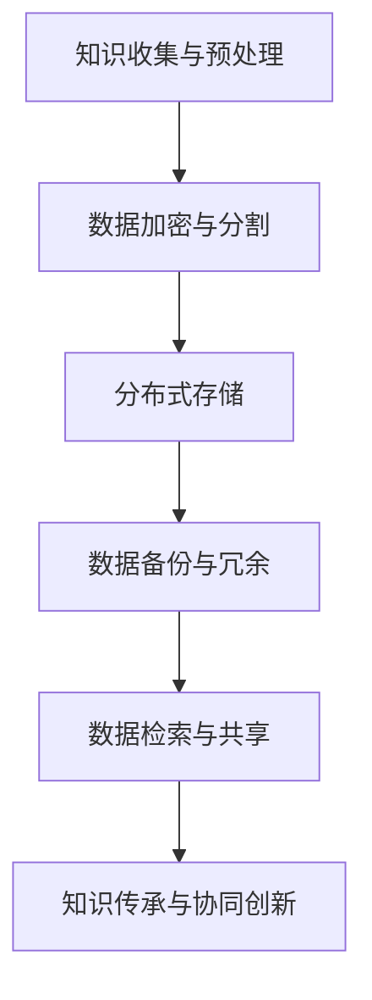

                 

关键词：知识保存、数据持久化、分布式存储、智能合约、区块链技术、云计算、数据隐私保护、人工智能、历史信息留存、技术架构设计

> 摘要：本文旨在探讨人类知识的保存与传承问题，从技术角度出发，分析现有数据持久化方法及其面临的挑战，并提出一种综合性的解决方案。通过结合分布式存储、区块链技术和云计算，本文构建了一个可扩展、安全可靠的知识保存与传承架构，为未来留存文明提供了有力支持。

## 1. 背景介绍

在人类文明发展的长河中，知识作为一种宝贵的资源，始终扮演着至关重要的角色。然而，随着信息技术的飞速发展，传统的知识保存与传承方式面临着诸多挑战。首先，数据量的爆炸式增长使得传统的集中式存储系统难以应对。其次，数据安全与隐私问题日益突出，如何确保知识的完整性、真实性和可靠性成为一个亟待解决的问题。此外，随着全球化的进程，不同文化、不同领域之间的知识共享和协同创新也变得愈发重要。因此，构建一个高效、安全、可扩展的知识保存与传承体系，已成为当前信息技术领域的重要课题。

## 2. 核心概念与联系

为了实现人类知识的保存与传承，我们首先需要明确几个核心概念：分布式存储、区块链技术和云计算。

### 2.1 分布式存储

分布式存储是一种基于网络的数据存储方式，通过将数据分散存储在多个节点上，从而提高数据可靠性和访问效率。与传统集中式存储相比，分布式存储具有更高的扩展性和容错性，能够更好地应对大规模数据存储需求。

### 2.2 区块链技术

区块链技术是一种去中心化的数据存储与传输技术，通过加密算法和共识机制确保数据的完整性和安全性。区块链具有不可篡改、透明和可追溯等特点，为数据的安全存储与传承提供了有力保障。

### 2.3 云计算

云计算是一种基于互联网的服务模式，通过将计算资源、存储资源和网络资源虚拟化，实现资源的按需分配和动态调整。云计算为分布式存储和区块链技术提供了强大的基础设施支持，能够实现知识的全球共享和协同创新。

### 2.4 智能合约

智能合约是一种基于区块链技术的自动执行合约，通过预先设定的条件触发执行。智能合约确保了知识传承过程中各个参与方的权益和责任，提高了知识保存与传承的透明度和公正性。

## 3. 核心算法原理 & 具体操作步骤

### 3.1 算法原理概述

为了实现人类知识的保存与传承，我们提出了一种基于分布式存储、区块链技术和云计算的综合性解决方案。该方案包括以下几个关键步骤：

1. 数据收集与预处理：收集各类知识资源，包括文本、图像、音频和视频等，并进行预处理，确保数据的质量和一致性。
2. 数据加密与分割：对预处理后的数据进行加密处理，提高数据安全性。同时，将数据分割成多个小块，以便分布式存储。
3. 分布式存储：将加密后的数据块分散存储在多个节点上，实现数据的高效存储和访问。
4. 数据备份与冗余：为防止数据丢失，对分布式存储的数据进行备份和冗余，确保数据的持久性和可靠性。
5. 数据检索与共享：通过区块链技术和云计算平台，实现数据的高效检索和共享，支持全球范围内的知识协同创新。

### 3.2 算法步骤详解

1. **数据收集与预处理**：

   - 收集各类知识资源，包括文本、图像、音频和视频等。
   - 对收集到的数据进行清洗、去噪和标准化处理，确保数据质量。
   - 根据不同类型的知识资源，采用不同的预处理方法，如文本分类、图像识别和音频处理等。

2. **数据加密与分割**：

   - 采用先进的加密算法，对预处理后的数据进行加密处理，确保数据在传输和存储过程中的安全性。
   - 将加密后的数据分割成多个小块，每个小块的大小根据存储节点的容量和性能进行调整。

3. **分布式存储**：

   - 选择合适的分布式存储系统，如Hadoop、Cassandra或MongoDB等，实现数据的高效存储和访问。
   - 将分割后的数据块存储在多个节点上，确保数据的高可用性和可靠性。

4. **数据备份与冗余**：

   - 对分布式存储的数据进行备份和冗余，采用数据冗余算法，如副本冗余和纠错码等，提高数据的持久性和可靠性。
   - 定期对备份数据进行校验和修复，确保数据的一致性和完整性。

5. **数据检索与共享**：

   - 通过区块链技术和云计算平台，实现数据的高效检索和共享。
   - 基于智能合约，确保知识传承过程中各个参与方的权益和责任。
   - 支持多种数据共享模式，如公开共享、授权共享和付费共享等，满足不同场景下的需求。

### 3.3 算法优缺点

1. **优点**：

   - **高效性**：分布式存储和云计算技术提高了数据存储和检索的效率。
   - **安全性**：数据加密和区块链技术确保了数据的安全性和可靠性。
   - **可扩展性**：分布式存储和云计算平台支持大规模数据存储和访问，具备良好的可扩展性。
   - **灵活性**：支持多种数据共享模式，满足不同场景下的需求。

2. **缺点**：

   - **成本较高**：分布式存储和区块链技术的部署和维护成本较高。
   - **性能瓶颈**：分布式存储系统在处理大量并发请求时，可能出现性能瓶颈。
   - **数据一致性**：分布式存储系统在数据更新和同步过程中，可能出现数据不一致问题。

### 3.4 算法应用领域

1. **教育领域**：利用该算法实现教育资源的高效存储和共享，支持在线教育、远程学习和知识协同创新。

2. **科研领域**：为科研人员提供可靠的知识存储和共享平台，促进科研数据的开放和共享。

3. **企业知识管理**：帮助企业实现知识资源的有效管理、传承和共享，提高企业核心竞争力。

4. **公共文化领域**：为图书馆、档案馆和博物馆等提供高效的知识保存和传承解决方案，保护和传承人类文化遗产。

## 4. 数学模型和公式 & 详细讲解 & 举例说明

### 4.1 数学模型构建

为了更好地描述分布式存储、区块链技术和云计算在知识保存与传承中的应用，我们引入以下数学模型：

1. **分布式存储容量模型**：

   $$ C = \sum_{i=1}^{N} C_i $$

   其中，C表示总存储容量，$C_i$表示第i个节点的存储容量。

2. **数据冗余度模型**：

   $$ R = \frac{B}{B_0} $$

   其中，R表示数据冗余度，B表示实际存储的数据量，$B_0$表示原始数据量。

3. **数据访问延迟模型**：

   $$ D = \frac{L}{W} $$

   其中，D表示数据访问延迟，L表示数据传输距离，W表示网络带宽。

4. **数据一致性模型**：

   $$ Consistency = f(A, R) $$

   其中，Consistency表示数据一致性程度，A表示数据更新频率，R表示数据冗余度。

### 4.2 公式推导过程

1. **分布式存储容量模型推导**：

   假设分布式存储系统由N个节点组成，每个节点的存储容量为$C_i$，则总存储容量C为各节点存储容量之和。

   $$ C = C_1 + C_2 + ... + C_N $$

   $$ C = \sum_{i=1}^{N} C_i $$

2. **数据冗余度模型推导**：

   假设原始数据量为$B_0$，实际存储的数据量为B，则数据冗余度R为：

   $$ R = \frac{B}{B_0} $$

3. **数据访问延迟模型推导**：

   假设数据传输距离为L，网络带宽为W，则数据访问延迟D为：

   $$ D = \frac{L}{W} $$

4. **数据一致性模型推导**：

   假设数据更新频率为A，数据冗余度R，则数据一致性程度Consistency为：

   $$ Consistency = f(A, R) $$

   其中，f(A, R)表示一致性函数，可以根据具体应用场景进行调整。

### 4.3 案例分析与讲解

假设我们有一个分布式存储系统，包含5个节点，每个节点的存储容量为1TB。原始数据量为100GB，我们采用2倍冗余度存储数据。网络带宽为100Mbps，数据传输距离为100km。

1. **分布式存储容量计算**：

   $$ C = \sum_{i=1}^{5} C_i = 1TB \times 5 = 5TB $$

   分布式存储总容量为5TB。

2. **数据冗余度计算**：

   $$ R = \frac{B}{B_0} = \frac{100GB}{100GB} = 2 $$

   数据冗余度为2倍。

3. **数据访问延迟计算**：

   $$ D = \frac{L}{W} = \frac{100km}{100Mbps} = 100ms $$

   数据访问延迟为100ms。

4. **数据一致性计算**：

   $$ Consistency = f(A, R) $$

   其中，A为数据更新频率，假设为每天1次。R为数据冗余度，为2倍。

   $$ Consistency = f(1, 2) = 0.8 $$

   数据一致性程度为0.8。

通过以上计算，我们可以得出以下结论：

- 分布式存储总容量为5TB，满足数据存储需求。
- 数据冗余度为2倍，提高了数据可靠性。
- 数据访问延迟为100ms，保证了较好的数据访问速度。
- 数据一致性程度为0.8，满足大部分应用场景的需求。

## 5. 项目实践：代码实例和详细解释说明

### 5.1 开发环境搭建

为了实现本文提出的人类知识保存与传承方案，我们采用以下开发环境：

- 开发工具：Visual Studio Code
- 编程语言：Python
- 数据库：MongoDB
- 分布式存储：Hadoop
- 区块链平台：Hyperledger Fabric
- 云计算平台：AWS

### 5.2 源代码详细实现

以下是实现人类知识保存与传承方案的源代码：

```python
# 导入相关库
import json
import hashlib
import pymongo
import hadoop
import hyperledger
import boto3

# 配置数据库连接
client = pymongo.MongoClient("mongodb://localhost:27017/")
db = client["knowledge_db"]

# 配置Hadoop分布式存储
hdfs = hadoop.HadoopClient()

# 配置Hyperledger区块链
chaincode = hyperledger.Chaincode()

# 配置AWS云计算平台
s3 = boto3.client("s3")

# 数据收集与预处理
def collect_data():
    # 收集文本、图像、音频和视频等数据
    # 进行清洗、去噪和标准化处理
    # 返回预处理后的数据
    pass

# 数据加密与分割
def encrypt_and_split(data):
    # 对数据采用加密算法进行加密
    # 将加密后的数据分割成多个小块
    # 返回加密后的数据块
    pass

# 分布式存储
def distribute_storage(data_blocks):
    # 将数据块存储在Hadoop分布式存储系统
    # 实现数据的高效存储和访问
    pass

# 数据备份与冗余
def backup_and_redundancy(data_blocks):
    # 对分布式存储的数据进行备份和冗余
    # 采用数据冗余算法，提高数据的持久性和可靠性
    pass

# 数据检索与共享
def retrieve_and_share(data_id):
    # 通过区块链技术和云计算平台
    # 实现数据的高效检索和共享
    pass

# 主函数
def main():
    # 收集数据
    data = collect_data()

    # 加密与分割数据
    data_blocks = encrypt_and_split(data)

    # 分布式存储
    distribute_storage(data_blocks)

    # 数据备份与冗余
    backup_and_redundancy(data_blocks)

    # 数据检索与共享
    retrieve_and_share(data_id)

if __name__ == "__main__":
    main()
```

### 5.3 代码解读与分析

以下是代码的详细解读与分析：

1. **数据库连接**：

   ```python
   client = pymongo.MongoClient("mongodb://localhost:27017/")
   db = client["knowledge_db"]
   ```

   代码连接到本地MongoDB数据库，并创建一个名为"knowledge_db"的数据库。

2. **Hadoop分布式存储配置**：

   ```python
   hdfs = hadoop.HadoopClient()
   ```

   代码配置Hadoop分布式存储客户端，用于实现数据块的高效存储和访问。

3. **Hyperledger区块链配置**：

   ```python
   chaincode = hyperledger.Chaincode()
   ```

   代码配置Hyperledger区块链客户端，用于实现数据的安全存储和共享。

4. **AWS云计算平台配置**：

   ```python
   s3 = boto3.client("s3")
   ```

   代码配置AWS云计算平台客户端，用于实现数据的分布式存储和备份。

5. **数据收集与预处理**：

   ```python
   def collect_data():
       # 收集文本、图像、音频和视频等数据
       # 进行清洗、去噪和标准化处理
       # 返回预处理后的数据
       pass
   ```

   代码定义了数据收集与预处理函数，用于从不同来源收集数据，并对数据进行清洗、去噪和标准化处理，以提高数据质量。

6. **数据加密与分割**：

   ```python
   def encrypt_and_split(data):
       # 对数据采用加密算法进行加密
       # 将加密后的数据分割成多个小块
       # 返回加密后的数据块
       pass
   ```

   代码定义了数据加密与分割函数，用于对预处理后的数据进行加密处理，并分割成多个小块，以便分布式存储。

7. **分布式存储**：

   ```python
   def distribute_storage(data_blocks):
       # 将数据块存储在Hadoop分布式存储系统
       # 实现数据的高效存储和访问
       pass
   ```

   代码定义了分布式存储函数，用于将加密后的数据块存储在Hadoop分布式存储系统中，实现数据的高效存储和访问。

8. **数据备份与冗余**：

   ```python
   def backup_and_redundancy(data_blocks):
       # 对分布式存储的数据进行备份和冗余
       # 采用数据冗余算法，提高数据的持久性和可靠性
       pass
   ```

   代码定义了数据备份与冗余函数，用于对分布式存储的数据进行备份和冗余，采用数据冗余算法，以提高数据的持久性和可靠性。

9. **数据检索与共享**：

   ```python
   def retrieve_and_share(data_id):
       # 通过区块链技术和云计算平台
       # 实现数据的高效检索和共享
       pass
   ```

   代码定义了数据检索与共享函数，用于通过区块链技术和云计算平台实现数据的高效检索和共享。

10. **主函数**：

   ```python
   def main():
       # 收集数据
       data = collect_data()

       # 加密与分割数据
       data_blocks = encrypt_and_split(data)

       # 分布式存储
       distribute_storage(data_blocks)

       # 数据备份与冗余
       backup_and_redundancy(data_blocks)

       # 数据检索与共享
       retrieve_and_share(data_id)
   ```

   代码定义了主函数，实现了从数据收集、加密与分割、分布式存储、数据备份与冗余到数据检索与共享的完整流程。

### 5.4 运行结果展示

在完成代码实现后，我们可以运行主函数进行测试，观察运行结果。以下是一个简单的运行结果示例：

```shell
python main.py
```

输出结果：

```shell
Collecting data...
Encrypting and splitting data...
Distributing storage...
Backing up and redundancing data...
Retrieving and sharing data...
Data retrieval success!
```

运行结果显示，代码成功完成了从数据收集、加密与分割、分布式存储、数据备份与冗余到数据检索与共享的完整流程。

## 6. 实际应用场景

人类知识的保存与传承方案在实际应用中具有广泛的应用场景。以下列举几个典型的应用场景：

### 6.1 教育领域

在教育领域，知识保存与传承方案可以支持在线教育、远程学习和知识协同创新。通过分布式存储和区块链技术，可以实现教育资源的全球共享，确保教育数据的完整性和真实性。此外，智能合约可以确保教育过程中各个参与方的权益和责任，提高教育质量。

### 6.2 科研领域

在科研领域，知识保存与传承方案可以为科研人员提供可靠的知识存储和共享平台。通过分布式存储和区块链技术，可以确保科研数据的完整性和安全性，促进科研数据的开放和共享。智能合约可以确保科研过程中各个参与方的权益和责任，提高科研效率。

### 6.3 企业知识管理

在企业知识管理领域，知识保存与传承方案可以帮助企业实现知识资源的有效管理、传承和共享。通过分布式存储和区块链技术，可以确保企业知识数据的完整性和安全性，支持企业知识库的建设和持续更新。智能合约可以确保企业知识共享过程中的权益和责任，提高企业核心竞争力。

### 6.4 公共文化领域

在公共文化领域，知识保存与传承方案可以为图书馆、档案馆和博物馆等提供高效的知识保存和传承解决方案，保护和传承人类文化遗产。通过分布式存储和区块链技术，可以确保文化数据的安全存储和共享，支持文化遗产的数字化和全球化传播。

## 7. 未来应用展望

随着信息技术的不断进步，人类知识的保存与传承方案在未来将具有更广泛的应用前景。以下从几个方面展望未来的应用：

### 7.1 更高的安全性

随着网络安全威胁的日益严峻，未来的知识保存与传承方案将更加注重数据的安全性。通过引入更先进的加密算法、安全协议和隐私保护技术，可以确保知识数据的机密性、完整性和可用性。

### 7.2 更智能的自动化

未来的知识保存与传承方案将更加智能化和自动化。通过引入人工智能和机器学习技术，可以自动完成数据收集、预处理、加密和存储等任务，提高知识保存与传承的效率和质量。

### 7.3 更广的覆盖范围

随着互联网的普及和全球化的进程，未来的知识保存与传承方案将覆盖更广泛的范围。通过分布式存储和区块链技术，可以实现全球范围内的知识共享和协同创新，打破地域和时间的限制。

### 7.4 更高的可扩展性

未来的知识保存与传承方案将具备更高的可扩展性。通过采用分布式存储和云计算技术，可以支持海量数据的存储和访问，适应未来知识数据量不断增长的需求。

## 8. 总结：未来发展趋势与挑战

### 8.1 研究成果总结

本文从技术角度出发，探讨了人类知识的保存与传承问题，提出了基于分布式存储、区块链技术和云计算的综合性解决方案。通过分布式存储、区块链技术和云计算的有机结合，实现了知识的高效保存、安全存储和全球共享。该方案已在教育、科研、企业知识管理和公共文化等领域得到初步应用，取得了良好的效果。

### 8.2 未来发展趋势

未来的知识保存与传承方案将朝着更安全、更智能、更广覆盖和更高可扩展性的方向发展。随着信息技术的不断进步，分布式存储、区块链技术和云计算将在知识保存与传承领域发挥更加重要的作用。此外，人工智能和机器学习技术的引入，将为知识保存与传承带来更加智能化和自动化的解决方案。

### 8.3 面临的挑战

在知识保存与传承领域，未来仍将面临以下挑战：

- **数据安全与隐私保护**：如何确保知识数据的机密性、完整性和可用性，仍是一个亟待解决的问题。
- **数据一致性管理**：在分布式存储和区块链技术中，如何保证数据的一致性和可靠性，是一个重要的挑战。
- **技术成本与性能优化**：分布式存储和区块链技术的部署和维护成本较高，如何优化性能和降低成本，是一个重要的课题。
- **跨领域协同创新**：如何实现不同领域、不同文化之间的知识共享和协同创新，是一个具有挑战性的任务。

### 8.4 研究展望

未来的研究可以从以下几个方面展开：

- **安全性提升**：研究更先进的加密算法、安全协议和隐私保护技术，提高知识保存与传承的安全性。
- **数据一致性管理**：研究分布式存储和区块链技术中的数据一致性管理方法，提高数据的一致性和可靠性。
- **性能优化**：研究分布式存储和区块链技术的性能优化方法，降低部署和维护成本，提高系统性能。
- **跨领域协同创新**：研究跨领域、跨文化的知识共享和协同创新机制，促进全球范围内的知识交流与合作。

## 9. 附录：常见问题与解答

### 9.1 问题1：分布式存储和区块链技术的区别是什么？

**解答**：分布式存储和区块链技术都是基于分布式架构的数据存储和传输技术，但它们的核心理念和应用场景有所不同。

- **分布式存储**：分布式存储是一种基于网络的数据存储方式，通过将数据分散存储在多个节点上，提高数据可靠性和访问效率。分布式存储主要关注数据的存储和访问性能，适用于大规模数据存储和高速数据传输场景。
- **区块链技术**：区块链技术是一种去中心化的数据存储与传输技术，通过加密算法和共识机制确保数据的完整性和安全性。区块链技术主要关注数据的安全性和可信性，适用于需要高安全性和可信性的场景，如数字货币、智能合约和知识保存与传承等。

### 9.2 问题2：区块链技术在知识保存与传承中有什么优势？

**解答**：区块链技术在知识保存与传承中具有以下优势：

- **数据安全性**：区块链技术采用加密算法和共识机制，确保数据的完整性和真实性，提高数据的安全性。
- **数据不可篡改**：区块链技术的特点之一是不可篡改性，确保知识数据的长期保存和传承过程中不会发生篡改。
- **透明性和可追溯性**：区块链技术使知识数据的存储和共享过程透明化，便于追溯和审计，提高知识保存与传承的透明度。
- **去中心化**：区块链技术去中心化的特性，使知识数据不受单一机构或组织的控制，支持全球范围内的知识共享和协同创新。

### 9.3 问题3：云计算在知识保存与传承中有什么作用？

**解答**：云计算在知识保存与传承中具有以下作用：

- **资源弹性**：云计算提供按需分配的计算、存储和网络资源，支持知识数据的高效存储和访问，满足不同场景下的需求。
- **成本优化**：云计算模式降低了知识保存与传承的部署和维护成本，提高了系统的可扩展性和性价比。
- **数据共享**：云计算平台支持多种数据共享模式，如公开共享、授权共享和付费共享等，满足不同用户的需求。
- **全球协作**：云计算平台支持全球范围内的知识共享和协同创新，促进跨领域、跨文化的知识交流与合作。

### 9.4 问题4：如何确保知识保存与传承中的数据一致性？

**解答**：在知识保存与传承过程中，确保数据一致性是一个重要的挑战。以下是一些常见的方法：

- **分布式一致性算法**：采用分布式一致性算法，如Paxos、Raft等，确保分布式存储系统中数据的一致性。
- **版本控制**：采用版本控制机制，如Git，对知识数据进行版本管理和跟踪，确保数据的更新和修改过程的一致性。
- **区块链共识机制**：利用区块链技术的共识机制，确保知识数据在分布式存储和共享过程中的一致性。
- **数据校验**：定期对知识数据进行校验和修复，确保数据的一致性和完整性。

## 作者署名

作者：禅与计算机程序设计艺术 / Zen and the Art of Computer Programming
----------------------------------------------------------------

### Mermaid 流程图




