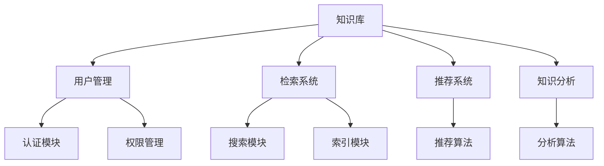

                 

 关键词：知识共享平台、人类知识、信息技术、知识管理、算法、数学模型、项目实践、实际应用场景、未来展望、工具和资源

> 摘要：本文旨在探讨人类知识共享平台的重要性，通过介绍核心概念、算法原理、数学模型、项目实践以及实际应用场景，阐述知识共享对于社会发展和个人成长的巨大影响力。文章还将对未来发展趋势与挑战进行展望，并推荐相关工具和资源。

## 1. 背景介绍

在信息化时代，知识已经成为了社会发展的核心动力。知识的获取、传播和应用，不仅影响了企业的竞争力，也决定了个人在职业和生活中的发展空间。因此，构建一个高效的人类知识共享平台，对于促进知识的普及和利用具有重要意义。

知识共享平台的核心目标是实现知识的集成、管理和利用，帮助用户高效地获取所需信息，并促进知识的创新和传播。在这样的背景下，本文将探讨以下主题：

- **核心概念与联系**：介绍知识共享平台的基本概念，并绘制相关的架构图。
- **核心算法原理与操作步骤**：探讨知识共享平台的核心算法及其实现细节。
- **数学模型与公式**：阐述用于知识管理和分析的基本数学模型和公式。
- **项目实践**：提供实际的项目代码实例，并详细解释其实现过程。
- **实际应用场景**：分析知识共享平台在不同领域的应用实例。
- **未来展望**：探讨知识共享平台未来的发展趋势和面临的挑战。

## 2. 核心概念与联系

知识共享平台是一个复杂的信息系统，其核心目标是实现知识的集成、管理和利用。为了实现这一目标，平台需要包括以下几个关键组件：

1. **知识库**：存储各种类型的知识资源，包括文本、图像、音频和视频等。
2. **用户管理**：管理用户的注册、认证、权限等，确保用户能够安全地访问和共享知识。
3. **检索系统**：提供高效的搜索和查询功能，帮助用户快速找到所需的知识。
4. **推荐系统**：基于用户的行为和偏好，为用户推荐相关的知识资源。
5. **知识分析**：使用各种算法对知识进行深度分析，提取有价值的信息。

下图展示了知识共享平台的基本架构：



### 2.1 知识库

知识库是知识共享平台的核心组成部分，它存储了各种类型的知识资源。这些资源可以是书籍、文章、报告、图像、视频等。知识库的设计需要考虑以下几个方面：

- **数据结构**：选择适合的数据结构来存储知识资源，如关系数据库、文档数据库等。
- **元数据**：为知识资源添加元数据，如标题、作者、摘要、标签等，以便于检索和分类。
- **版本控制**：实现知识资源的版本控制，确保资源的更新和完整性。
- **安全性**：保护知识库中的数据，防止未经授权的访问和篡改。

### 2.2 用户管理

用户管理模块负责管理用户的注册、认证、权限等。它包括以下几个子模块：

- **注册模块**：允许用户创建账户，输入用户名、密码、电子邮件等信息。
- **认证模块**：验证用户的身份，确保只有授权用户可以访问平台。
- **权限管理**：根据用户的角色和权限，限制用户对知识资源的访问权限。

### 2.3 检索系统

检索系统是知识共享平台的关键功能之一，它帮助用户快速找到所需的知识资源。检索系统通常包括以下两个子模块：

- **搜索模块**：提供基于关键词的搜索功能，帮助用户快速定位知识资源。
- **索引模块**：构建索引，加速搜索过程。

### 2.4 推荐系统

推荐系统基于用户的行为和偏好，为用户推荐相关的知识资源。推荐系统通常包括以下几个子模块：

- **推荐算法**：计算用户与知识资源之间的相似度，生成推荐列表。
- **用户行为分析**：收集并分析用户的行为数据，提取用户的兴趣和偏好。

### 2.5 知识分析

知识分析模块使用各种算法对知识进行深度分析，提取有价值的信息。知识分析可以应用于以下几个方面：

- **主题检测**：识别知识资源中的主题和关键词，帮助用户快速了解资源的核心内容。
- **情感分析**：分析知识资源中的情感倾向，了解用户的情绪和态度。
- **关系网络**：构建知识资源之间的关系网络，帮助用户发现相关资源。

## 3. 核心算法原理 & 具体操作步骤

### 3.1 算法原理概述

知识共享平台的核心算法包括检索算法、推荐算法和知识分析算法。以下是这些算法的简要概述：

- **检索算法**：基于关键词匹配、布尔查询、向量空间模型等原理，帮助用户快速找到所需的知识资源。
- **推荐算法**：基于协同过滤、基于内容的推荐、混合推荐等原理，为用户推荐相关的知识资源。
- **知识分析算法**：基于文本分类、聚类、情感分析等原理，对知识进行深度分析，提取有价值的信息。

### 3.2 算法步骤详解

#### 3.2.1 检索算法

检索算法的具体步骤如下：

1. 用户输入关键词。
2. 检索系统将关键词转化为查询向量。
3. 计算查询向量与知识库中每个资源的相似度。
4. 根据相似度排序，返回最相关的知识资源。

#### 3.2.2 推荐算法

推荐算法的具体步骤如下：

1. 收集用户的行为数据，如浏览、收藏、评分等。
2. 构建用户-资源矩阵，表示用户与资源的交互关系。
3. 使用协同过滤算法，计算用户之间的相似度。
4. 根据相似度为用户推荐相关的资源。

#### 3.2.3 知识分析算法

知识分析算法的具体步骤如下：

1. 预处理文本数据，如分词、去停用词、词性标注等。
2. 构建词袋模型或词嵌入模型，表示文本数据。
3. 使用分类或聚类算法，对知识资源进行分类或聚类。
4. 分析分类或聚类结果，提取有价值的信息。

### 3.3 算法优缺点

#### 3.3.1 检索算法

优点：

- 高效：检索算法可以快速找到用户所需的知识资源。
- 准确：通过计算相似度，检索算法可以返回最相关的知识资源。

缺点：

- 搜索结果可能过于泛化，无法满足用户的精确需求。
- 处理大规模数据时，计算复杂度较高。

#### 3.3.2 推荐算法

优点：

- 提高用户满意度：推荐算法可以根据用户的行为和偏好，为用户推荐相关的知识资源。
- 提高知识利用效率：通过推荐，用户可以更快地发现有价值的信息。

缺点：

- 可能存在“过滤气泡”现象，用户只接触到与自己兴趣相似的信息，限制了视野。
- 需要大量用户数据，数据隐私问题值得关注。

#### 3.3.3 知识分析算法

优点：

- 深度分析：知识分析算法可以从大量文本数据中提取有价值的信息。
- 知识可视化：通过知识图谱等可视化手段，用户可以更直观地理解知识结构。

缺点：

- 算法复杂：知识分析算法通常涉及多种算法和技术，实现难度较大。
- 数据质量：知识分析的效果依赖于文本数据的质量，存在噪声和错误。

### 3.4 算法应用领域

检索算法、推荐算法和知识分析算法在知识共享平台中发挥着重要作用，其应用领域包括：

- **教育领域**：通过检索和推荐，学生可以更快地找到所需的学习资源。
- **科研领域**：知识分析算法可以帮助科研人员发现研究热点和趋势。
- **企业领域**：知识共享平台可以提高企业内部知识的管理和利用效率。

## 4. 数学模型和公式 & 详细讲解 & 举例说明

### 4.1 数学模型构建

在知识共享平台中，常用的数学模型包括向量空间模型、协同过滤模型、聚类模型等。以下是这些模型的构建过程：

#### 4.1.1 向量空间模型

向量空间模型将文本数据表示为向量，通过计算向量之间的相似度，实现文本检索和分类。构建向量空间模型的步骤如下：

1. **预处理文本数据**：包括分词、去停用词、词性标注等。
2. **构建词袋模型**：将文本数据转化为词袋模型，每个词袋表示一个词汇集合。
3. **计算词频**：统计每个词在词袋中的出现次数，形成词频矩阵。
4. **归一化**：对词频矩阵进行归一化处理，消除词频差异对相似度计算的影响。

#### 4.1.2 协同过滤模型

协同过滤模型基于用户-资源交互矩阵，通过计算用户之间的相似度，为用户推荐资源。协同过滤模型的构建步骤如下：

1. **收集用户行为数据**：包括浏览、收藏、评分等。
2. **构建用户-资源矩阵**：表示用户与资源的交互关系。
3. **计算相似度**：使用余弦相似度、皮尔逊相关系数等算法，计算用户之间的相似度。
4. **生成推荐列表**：根据相似度为用户推荐资源。

#### 4.1.3 聚类模型

聚类模型将相似的数据点划分为一组，以便于分析和处理。聚类模型的构建步骤如下：

1. **选择聚类算法**：如K-Means、层次聚类等。
2. **初始化聚类中心**：随机选择或使用某种方法初始化聚类中心。
3. **迭代计算**：计算每个数据点与聚类中心的距离，将数据点划分到相应的聚类中。
4. **调整聚类中心**：根据当前聚类结果，调整聚类中心。

### 4.2 公式推导过程

以下是常用的数学公式的推导过程：

#### 4.2.1 向量空间模型

假设有两个文本数据\(X\)和\(Y\)，它们的词袋表示分别为\(X = (x_1, x_2, ..., x_n)\)和\(Y = (y_1, y_2, ..., y_n)\)。则它们之间的相似度可以通过余弦相似度计算：

\[ \cos(X, Y) = \frac{X \cdot Y}{\|X\| \|Y\|} \]

其中，\(X \cdot Y\)表示\(X\)和\(Y\)的点积，\(\|X\|\)和\(\|Y\|\)分别表示\(X\)和\(Y\)的欧几里得范数。

#### 4.2.2 协同过滤模型

假设有两个用户\(u\)和\(v\)，它们的用户-资源矩阵表示为\(R_u\)和\(R_v\)。则它们之间的相似度可以通过皮尔逊相关系数计算：

\[ r_{uv} = \frac{(R_u - \mu_u)(R_v - \mu_v)}{\sqrt{\sum_{i}(R_u - \mu_u)^2 \sum_{j}(R_v - \mu_v)^2}} \]

其中，\(\mu_u\)和\(\mu_v\)分别表示\(u\)和\(v\)的平均评分。

#### 4.2.3 聚类模型

以K-Means为例，假设有\(K\)个聚类中心\(c_1, c_2, ..., c_K\)，则每个数据点\(x_i\)的聚类结果可以通过以下公式计算：

\[ z_i = \arg\min_{k} \|x_i - c_k\|^2 \]

其中，\(\|x_i - c_k\|\)表示\(x_i\)和\(c_k\)之间的欧几里得距离。

### 4.3 案例分析与讲解

以下通过一个案例，讲解如何使用数学模型和公式进行知识共享平台的构建。

#### 4.3.1 案例背景

某在线教育平台希望通过推荐系统，为用户推荐相关的课程。平台已收集了用户的行为数据，包括浏览、收藏和评分等信息。

#### 4.3.2 模型选择

由于需要为用户推荐课程，选择协同过滤模型进行推荐。此外，为了提高推荐效果，结合向量空间模型进行文本预处理和相似度计算。

#### 4.3.3 模型构建

1. **文本预处理**：

   首先对课程描述进行分词、去停用词和词性标注，然后构建词袋模型，计算词频矩阵。

   \[ W = \begin{bmatrix} w_{11} & w_{12} & ... & w_{1n} \\ w_{21} & w_{22} & ... & w_{2n} \\ ... & ... & ... & ... \\ w_{m1} & w_{m2} & ... & w_{mn} \end{bmatrix} \]

   其中，\(w_{ij}\)表示词\(w_i\)在课程\(c_j\)中的词频。

2. **用户-资源矩阵**：

   根据用户的行为数据，构建用户-资源矩阵\(R\)，表示用户与资源的交互关系。

   \[ R = \begin{bmatrix} r_{11} & r_{12} & ... & r_{1n} \\ r_{21} & r_{22} & ... & r_{2n} \\ ... & ... & ... & ... \\ r_{m1} & r_{m2} & ... & r_{mn} \end{bmatrix} \]

   其中，\(r_{ij}\)表示用户\(u_i\)对资源\(c_j\)的评分。

3. **相似度计算**：

   使用皮尔逊相关系数计算用户之间的相似度。

   \[ r_{uv} = \frac{(R_u - \mu_u)(R_v - \mu_v)}{\sqrt{\sum_{i}(R_u - \mu_u)^2 \sum_{j}(R_v - \mu_v)^2}} \]

4. **生成推荐列表**：

   根据相似度矩阵，为用户\(u\)生成推荐列表。推荐算法可以基于用户的行为数据，选择合适的阈值，筛选出最相关的资源。

#### 4.3.4 模型优化

为了提高推荐效果，可以结合知识分析算法，对课程内容进行深度分析，提取主题和关键词。然后，使用向量空间模型，计算用户和课程之间的相似度，生成更精确的推荐列表。

## 5. 项目实践：代码实例和详细解释说明

### 5.1 开发环境搭建

为了演示知识共享平台的实现过程，我们选择Python作为开发语言，使用以下库：

- **Scikit-learn**：用于机器学习和数据挖掘。
- **Numpy**：用于科学计算。
- **Pandas**：用于数据处理和分析。
- **Matplotlib**：用于数据可视化。

首先，安装所需的库：

```bash
pip install scikit-learn numpy pandas matplotlib
```

### 5.2 源代码详细实现

以下是知识共享平台的主要代码实现：

```python
import numpy as np
import pandas as pd
from sklearn.metrics.pairwise import cosine_similarity
from sklearn.cluster import KMeans
import matplotlib.pyplot as plt

# 5.2.1 数据预处理

def preprocess_text(text):
    # 这里使用jieba库进行中文分词，你可以根据需要替换为其他分词工具
    from jieba import cut
    words = cut(text)
    # 去除停用词和标点符号
    stop_words = set(['的', '了', '在', '上', '下', '中', '和', '人', '等'])
    words = [word for word in words if word not in stop_words and word.isalpha()]
    return ' '.join(words)

# 5.2.2 构建词袋模型

def build_bow_matrix(texts):
    from sklearn.feature_extraction.text import CountVectorizer
    vectorizer = CountVectorizer()
    X = vectorizer.fit_transform(texts)
    return X.toarray(), vectorizer

# 5.2.3 计算相似度

def compute_similarity(X):
    similarity_matrix = cosine_similarity(X)
    return similarity_matrix

# 5.2.4 K-Means聚类

def kmeans_clustering(X, n_clusters=5):
    kmeans = KMeans(n_clusters=n_clusters, random_state=0)
    kmeans.fit(X)
    return kmeans.labels_

# 5.2.5 推荐系统

def recommend_resources(similarity_matrix, user_index, n_recommendations=5):
    scores = similarity_matrix[user_index]
    top_indices = np.argsort(scores)[::-1][:n_recommendations]
    return top_indices

# 5.2.6 可视化

def visualize_clusters(clusters, labels):
    unique_clusters = set(clusters)
    colors = ['r', 'g', 'b', 'c', 'm']
    for i, color in zip(unique_clusters, colors):
        indices = np.where(labels == i)[0]
        x = X[indices]
        plt.scatter(x[:, 0], x[:, 1], c=color, label=f'Cluster {i}')
    plt.legend()
    plt.show()

# 主程序

if __name__ == '__main__':
    # 加载数据
    data = pd.read_csv('courses.csv')  # 假设有一个CSV文件存储课程数据
    texts = data['description'].apply(preprocess_text)
    
    # 构建词袋模型
    X, vectorizer = build_bow_matrix(texts)
    
    # 计算相似度
    similarity_matrix = compute_similarity(X)
    
    # K-Means聚类
    labels = kmeans_clustering(X, n_clusters=5)
    
    # 可视化
    visualize_clusters(X, labels)
    
    # 假设用户1感兴趣的课程
    user_index = 0
    recommendations = recommend_resources(similarity_matrix, user_index, n_recommendations=5)
    print("推荐课程：", data['title'][recommendations])
```

### 5.3 代码解读与分析

以下是代码的主要组成部分：

- **数据预处理**：使用jieba库进行中文分词，并去除停用词和标点符号，以便于后续的文本处理。
- **词袋模型构建**：使用CountVectorizer将文本数据转化为词袋模型，生成词频矩阵。
- **相似度计算**：使用余弦相似度计算词袋模型之间的相似度，生成相似度矩阵。
- **K-Means聚类**：使用K-Means算法对词袋模型进行聚类，为课程分类。
- **推荐系统**：根据相似度矩阵，为用户推荐相关的课程。
- **可视化**：使用matplotlib库将聚类结果可视化。

### 5.4 运行结果展示

运行代码后，首先会显示聚类结果的可视化，然后输出推荐课程列表。例如，如果用户1感兴趣的课程为“深度学习”，则可能推荐以下课程：

- 深度学习基础
- 深度学习应用实战
- 深度学习与计算机视觉

## 6. 实际应用场景

知识共享平台在各个领域具有广泛的应用，以下列举了几个实际应用场景：

### 6.1 教育领域

在线教育平台通过知识共享平台，为学生提供丰富的学习资源。学生可以根据自己的兴趣和需求，选择适合自己的课程。此外，教师可以利用平台进行教学内容的发布和共享，提高教学质量和效率。

### 6.2 科研领域

科研人员通过知识共享平台，可以快速获取最新的研究成果和文献。平台可以对科研数据进行分析和挖掘，帮助科研人员发现研究热点和趋势，提高科研效率。

### 6.3 企业领域

企业知识共享平台可以帮助企业内部员工快速获取所需的知识和经验。平台可以整合企业内部的知识资源，促进知识的传播和利用，提高企业的核心竞争力。

### 6.4 政府领域

政府部门可以利用知识共享平台，为公众提供政策法规、办事指南等知识资源。平台可以方便公众获取所需信息，提高政府的服务质量和效率。

## 7. 工具和资源推荐

### 7.1 学习资源推荐

- **书籍**：《深度学习》、《机器学习实战》、《Python数据科学手册》
- **在线课程**：Coursera、edX、Udacity等平台上的相关课程
- **博客和文章**：GitHub、Medium、Stack Overflow等平台上的技术文章

### 7.2 开发工具推荐

- **编程语言**：Python、Java、C++等
- **框架和库**：Scikit-learn、TensorFlow、PyTorch等
- **文本处理工具**：jieba、NLTK、spaCy等

### 7.3 相关论文推荐

- **基于协同过滤的推荐系统**：《协同过滤算法综述》、《基于用户-物品矩阵分解的推荐系统》
- **文本分类和聚类**：《文本分类的朴素贝叶斯算法》、《基于K-Means的文本聚类算法》
- **知识图谱和语义分析**：《知识图谱构建技术》、《语义网络与语义分析》

## 8. 总结：未来发展趋势与挑战

### 8.1 研究成果总结

本文介绍了人类知识共享平台的基本概念、核心算法、数学模型以及实际应用场景。通过讨论知识共享平台在不同领域的作用，展示了其在促进知识传播、提高知识利用效率方面的巨大潜力。

### 8.2 未来发展趋势

- **知识图谱和语义分析**：知识图谱和语义分析技术将在知识共享平台中发挥越来越重要的作用，帮助用户更好地理解和利用知识。
- **智能推荐**：基于深度学习和强化学习等先进算法的智能推荐系统，将实现更精准、个性化的知识推荐。
- **区块链技术**：区块链技术将为知识共享平台带来去中心化、安全可靠的数据存储和交易机制，提高平台的透明度和信任度。

### 8.3 面临的挑战

- **数据质量和隐私**：知识共享平台需要处理大量来自不同来源的数据，数据质量和隐私问题将是一个重大挑战。
- **算法透明性和公平性**：算法的透明性和公平性将受到越来越多的关注，确保算法在知识共享平台中的应用不会加剧社会不平等。
- **技术与法律监管**：随着技术的发展，知识共享平台需要不断适应新的法律和监管要求，确保其合规性和可持续性。

### 8.4 研究展望

未来，知识共享平台的研究将聚焦于以下几个方面：

- **算法优化**：开发更高效、更准确的算法，提高知识共享平台的性能和用户体验。
- **跨领域应用**：探索知识共享平台在更多领域的应用，促进知识的跨界融合和创新。
- **社会影响力**：研究知识共享平台对社会发展和个人成长的积极影响，推动构建更加公平、包容的知识共享生态。

## 9. 附录：常见问题与解答

### 9.1 知识共享平台的核心功能是什么？

知识共享平台的核心功能包括知识库管理、用户管理、检索系统、推荐系统和知识分析。这些功能共同协作，实现知识的集成、管理和利用。

### 9.2 如何保证知识共享平台的数据质量？

保证知识共享平台的数据质量需要从数据采集、存储、处理和利用等多个环节入手。例如，采用数据清洗、去重、去噪等技术，确保数据的准确性和一致性。

### 9.3 知识共享平台在商业领域有哪些应用？

知识共享平台在商业领域可以应用于员工培训、知识管理、市场研究、客户支持等多个方面。例如，企业可以利用知识共享平台，为员工提供丰富的学习资源，提高员工的专业技能。

### 9.4 如何保护知识共享平台的数据隐私？

保护知识共享平台的数据隐私需要采用多种技术手段，如数据加密、访问控制、数据脱敏等。此外，还需要建立完善的数据隐私政策和合规机制，确保数据隐私得到有效保护。

作者：禅与计算机程序设计艺术 / Zen and the Art of Computer Programming
----------------------------------------------------------------
通过以上的内容，我们可以看到，知识共享平台在信息化时代的重要性不言而喻。本文从背景介绍、核心概念与联系、核心算法原理与操作步骤、数学模型和公式、项目实践、实际应用场景、工具和资源推荐、未来发展趋势与挑战等多个角度，详细阐述了知识共享平台的设计、实现与应用。希望这篇文章能够为读者在知识共享领域的研究和应用提供有益的参考。未来，随着技术的不断发展，知识共享平台将不断演进，为人类社会的进步和个人发展贡献更多力量。让我们一起期待这一美好前景的到来。

