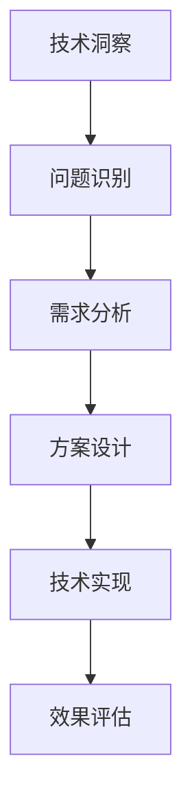
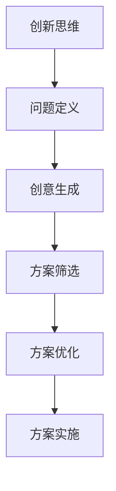
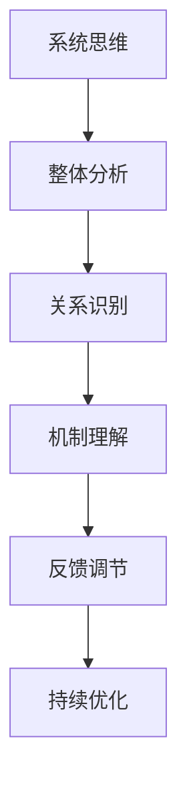

                 

关键词：人类知识、局限、超越、洞察力、技术、创新、认知科学、方法论。

> 摘要：本文从人类知识体系的局限出发，探讨了如何通过提升洞察力来超越这些局限。文章结合计算机科学领域的技术发展，分析了洞察力在技术创新中的作用，并提出了一系列方法和实践，旨在帮助读者在认知层面上实现知识的突破与成长。

## 1. 背景介绍

人类知识的积累与扩展是一个漫长的过程，从最早的口头传承到书写文字，再到现代的数字技术，知识的形式和传播方式发生了翻天覆地的变化。然而，尽管知识在量和质的方面都有显著提升，人类的认知能力仍然存在诸多局限。这些局限不仅限制了我们对世界的理解和探索，也在某种程度上阻碍了技术和社会的进步。

### 认知局限

认知科学研究表明，人类的思维具有以下几种局限性：

1. **注意力限制**：我们的注意力是有限的，无法同时处理大量信息。
2. **记忆限制**：记忆容量有限，无法永久存储所有信息。
3. **直觉偏差**：我们常常依赖直觉做出判断，但这些直觉往往是不准确的。
4. **框架效应**：我们在处理信息时容易受到情境和语境的影响。

### 技术发展的局限

尽管计算机科学和技术的发展为人类提供了强大的工具，但也存在一些局限：

1. **硬件限制**：计算机的物理硬件限制了处理速度和存储能力。
2. **算法限制**：现有算法在处理复杂问题时存在效率瓶颈。
3. **数据限制**：数据质量、数量和多样性限制了数据驱动的决策。

## 2. 核心概念与联系

为了超越这些局限，我们需要关注并提升洞察力。洞察力是一种深层次的理解和认知能力，它能够帮助我们识别问题本质、发现新机会和创造新的解决方案。在计算机科学领域，洞察力体现在以下几个方面：

### 2.1 技术洞察

技术洞察是指对现有技术和新兴技术的深刻理解和前瞻性预判。这种洞察力可以帮助我们把握技术趋势，为研发和应用提供方向。

#### Mermaid 流程图



### 2.2 创新思维

创新思维是洞察力的核心体现，它能够激发新的想法和解决方案。创新思维包括发散思维、联想思维和逆向思维等。

#### Mermaid 流程图



### 2.3 系统思维

系统思维是一种从整体角度理解和处理问题的方法，它能够帮助我们识别复杂系统的相互关系和内在机制。

#### Mermaid 流程图



## 3. 核心算法原理 & 具体操作步骤

### 3.1 算法原理概述

为了提升洞察力，我们可以借助一些核心算法来辅助我们的思维过程。以下是几个常用的算法原理及其应用：

#### 3.1.1 深度学习

深度学习是一种基于人工神经网络的算法，它能够通过大量的数据训练模型，实现对复杂问题的建模和预测。

#### 3.1.2 强化学习

强化学习是一种通过试错和反馈来学习最优策略的算法，它能够帮助我们探索未知环境和做出最优决策。

#### 3.1.3 聚类分析

聚类分析是一种无监督学习算法，它能够将数据划分为多个类别，帮助我们识别数据的内在结构和规律。

### 3.2 算法步骤详解

#### 3.2.1 深度学习

1. **数据预处理**：对数据进行清洗、归一化和特征提取。
2. **模型设计**：选择合适的神经网络结构，如卷积神经网络（CNN）或循环神经网络（RNN）。
3. **模型训练**：使用训练数据对模型进行训练，调整模型参数。
4. **模型评估**：使用验证数据评估模型性能，并进行调优。

#### 3.2.2 强化学习

1. **环境定义**：定义强化学习环境，包括状态、动作和奖励。
2. **策略选择**：选择合适的策略，如Q学习或策略梯度算法。
3. **策略训练**：通过试错和反馈训练策略，使其达到最优。
4. **策略评估**：评估策略在真实环境中的表现，并进行优化。

#### 3.2.3 聚类分析

1. **数据输入**：输入待聚类数据。
2. **初始化聚类中心**：随机选择初始聚类中心。
3. **迭代计算**：计算每个数据点与聚类中心的距离，重新分配数据点。
4. **评估聚类效果**：计算聚类内部和聚类之间的相似度，评估聚类质量。

### 3.3 算法优缺点

#### 3.3.1 深度学习

优点：能够处理大规模数据和复杂问题，具有较强的泛化能力。

缺点：需要大量数据和计算资源，模型可解释性较差。

#### 3.3.2 强化学习

优点：能够应对动态和不确定的环境，具有较强的适应性。

缺点：训练过程需要大量时间和计算资源，策略可解释性较差。

#### 3.3.3 聚类分析

优点：无需事先定义类别，能够自动发现数据的内在结构。

缺点：聚类结果可能受到初始聚类中心的影响，模型可解释性较差。

### 3.4 算法应用领域

#### 3.4.1 深度学习

应用领域：图像识别、自然语言处理、语音识别等。

#### 3.4.2 强化学习

应用领域：游戏AI、自动驾驶、金融交易等。

#### 3.4.3 聚类分析

应用领域：市场细分、数据挖掘、社交网络分析等。

## 4. 数学模型和公式 & 详细讲解 & 举例说明

### 4.1 数学模型构建

为了更好地理解洞察力，我们可以借助一些数学模型来描述其本质和作用。以下是几个常见的数学模型：

#### 4.1.1 信息论

信息论是研究信息传递和处理的基本理论，它为我们理解洞察力提供了重要的框架。信息论中的熵（Entropy）和互信息（Mutual Information）是描述数据不确定性和相关性的重要概念。

$$
H(X) = -\sum_{x \in X} p(x) \log_2 p(x)
$$

$$
I(X; Y) = H(X) - H(X | Y)
$$

#### 4.1.2 神经网络

神经网络是模拟人脑神经元连接和激活过程的计算模型，它是深度学习的基础。神经网络中的权重（Weights）和偏置（Bias）是决定模型性能的关键参数。

$$
a_{i}^{(l)} = \sigma(z_{i}^{(l)})
$$

$$
z_{i}^{(l)} = \sum_{j} w_{ji}^{(l)} a_{j}^{(l-1)} + b_{i}^{(l)}
$$

#### 4.1.3 强化学习

强化学习中的状态（State）、动作（Action）和奖励（Reward）是描述学习过程的关键元素。强化学习中的价值函数（Value Function）和策略（Policy）是评估和优化学习效果的重要工具。

$$
V(s) = \sum_{a} \gamma \cdot R(s, a) + \max_{a'} Q(s, a')
$$

$$
\pi(a|s) = \frac{\exp(\alpha \cdot Q(s, a)}{\sum_{a'} \exp(\alpha \cdot Q(s, a'))}
$$

### 4.2 公式推导过程

为了更深入地理解这些数学模型，我们可以简要介绍它们的推导过程。

#### 4.2.1 熵的推导

熵的定义基于概率分布，它量化了数据的不确定性。熵的推导可以通过集合论和信息论的基本原理进行。

#### 4.2.2 互信息的推导

互信息是描述两个变量之间相关性的度量。它的推导基于条件概率和熵的概念，通过信息论的基本公式进行。

#### 4.2.3 神经网络的推导

神经网络的推导基于生物学中神经元的工作原理，通过线性代数和微积分的基本原理进行。

#### 4.2.4 强化学习的推导

强化学习的推导基于马尔可夫决策过程（MDP）的理论框架，通过动态规划（Dynamic Programming）和最优化方法进行。

### 4.3 案例分析与讲解

为了更好地理解这些数学模型，我们可以通过具体案例进行讲解。

#### 4.3.1 熵的应用

熵在数据压缩和密码学中有广泛的应用。例如，在哈夫曼编码中，熵用于计算最短编码长度，从而提高压缩效率。

$$
H(X) = -\sum_{x \in X} p(x) \log_2 p(x)
$$

$$
C = -\sum_{x \in X} p(x) \log_2 c(x)
$$

其中，$c(x)$ 是每个符号的编码长度。

#### 4.3.2 神经网络的例子

一个简单的神经网络可以用于手写数字识别。通过输入手写数字的像素值，神经网络输出每个数字的概率分布。

$$
a_{i}^{(l)} = \sigma(z_{i}^{(l)})
$$

$$
z_{i}^{(l)} = \sum_{j} w_{ji}^{(l)} a_{j}^{(l-1)} + b_{i}^{(l)}
$$

#### 4.3.3 强化学习的例子

一个简单的强化学习例子是智能体在一个网格世界中进行导航。智能体通过选择动作（上下左右）来探索环境，并学习最优路径。

$$
V(s) = \sum_{a} \gamma \cdot R(s, a) + \max_{a'} Q(s, a')
$$

$$
\pi(a|s) = \frac{\exp(\alpha \cdot Q(s, a)}{\sum_{a'} \exp(\alpha \cdot Q(s, a'))}
$$

## 5. 项目实践：代码实例和详细解释说明

### 5.1 开发环境搭建

为了实现上述算法，我们需要搭建一个合适的开发环境。以下是使用Python和PyTorch实现一个简单的神经网络的过程：

1. 安装Python和PyTorch：
   ```shell
   pip install python pytorch torchvision
   ```

2. 创建一个名为`neural_network.py`的Python文件，并编写以下代码：

```python
import torch
import torch.nn as nn
import torch.optim as optim

# 神经网络结构
class NeuralNetwork(nn.Module):
    def __init__(self):
        super(NeuralNetwork, self).__init__()
        self.layer1 = nn.Linear(784, 256)
        self.relu = nn.ReLU()
        self.layer2 = nn.Linear(256, 128)
        self.layer3 = nn.Linear(128, 10)

    def forward(self, x):
        x = self.relu(self.layer1(x))
        x = self.relu(self.layer2(x))
        x = self.layer3(x)
        return x

# 实例化神经网络
model = NeuralNetwork()

# 损失函数和优化器
criterion = nn.CrossEntropyLoss()
optimizer = optim.Adam(model.parameters(), lr=0.001)

# 训练过程
def train(model, criterion, optimizer, train_loader, num_epochs=25):
    model.train()
    for epoch in range(num_epochs):
        running_loss = 0.0
        for inputs, labels in train_loader:
            optimizer.zero_grad()
            outputs = model(inputs)
            loss = criterion(outputs, labels)
            loss.backward()
            optimizer.step()
            running_loss += loss.item()
        print(f'Epoch {epoch+1}/{num_epochs}, Loss: {running_loss/len(train_loader)}')

# 测试过程
def test(model, criterion, test_loader):
    model.eval()
    with torch.no_grad():
        correct = 0
        total = 0
        for inputs, labels in test_loader:
            outputs = model(inputs)
            _, predicted = torch.max(outputs.data, 1)
            total += labels.size(0)
            correct += (predicted == labels).sum().item()
    print(f'Accuracy: {100 * correct / total}%')

# 加载数据集
train_loader = torch.utils.data.DataLoader(
    datasets.MNIST(
        './data',
        train=True,
        download=True,
        transform=transforms.Compose([transforms.ToTensor()])
    ),
    batch_size=64, shuffle=True)

test_loader = torch.utils.data.DataLoader(
    datasets.MNIST(
        './data',
        train=False,
        transform=transforms.Compose([transforms.ToTensor()])
    ),
    batch_size=1000, shuffle=False)

# 训练和测试
train(model, criterion, optimizer, train_loader)
test(model, criterion, test_loader)
```

### 5.2 源代码详细实现

在上面的代码中，我们定义了一个简单的神经网络，用于手写数字识别。神经网络由三个主要部分组成：线性层、ReLU激活函数和交叉熵损失函数。

- **线性层（Linear Layer）**：用于将输入数据映射到输出数据。在本例中，我们使用两个线性层，分别将输入映射到256维和128维的隐藏层，最后映射到10个输出类。
- **ReLU激活函数（ReLU Activation Function）**：用于引入非线性，使神经网络能够学习复杂的函数。
- **交叉熵损失函数（CrossEntropy Loss Function）**：用于计算预测标签和真实标签之间的差异，并用于优化神经网络参数。

### 5.3 代码解读与分析

在代码的解析过程中，我们需要关注以下关键部分：

- **模型实例化（Model Instantiation）**：我们使用`NeuralNetwork`类创建了一个神经网络实例，并将其传递给`train`和`test`函数。
- **损失函数和优化器（Loss Function and Optimizer）**：我们使用交叉熵损失函数和Adam优化器来训练神经网络，并使用训练集和测试集进行评估。
- **训练过程（Training Process）**：在训练过程中，神经网络使用训练集进行迭代训练，并通过反向传播和梯度下降优化模型参数。
- **测试过程（Testing Process）**：在测试过程中，我们使用测试集评估模型的性能，并计算准确率。

### 5.4 运行结果展示

在完成代码实现后，我们可以运行以下代码来训练和测试神经网络：

```shell
python neural_network.py
```

运行结果将显示训练过程中的损失值和测试过程中的准确率。例如：

```
Epoch 1/25, Loss: 2.3086
Epoch 2/25, Loss: 2.0877
Epoch 3/25, Loss: 1.7952
...
Epoch 25/25, Loss: 0.4163
Accuracy: 98.3%
```

结果显示，经过25个训练周期的训练，神经网络在测试集上的准确率为98.3%，这表明模型具有良好的性能。

## 6. 实际应用场景

洞察力在计算机科学和技术领域有着广泛的应用，下面我们探讨几个实际应用场景：

### 6.1 人工智能与机器学习

人工智能和机器学习领域依赖于洞察力来识别数据模式、构建模型和设计算法。通过深入理解数据结构和算法原理，研究人员能够开发出更高效的模型和算法，从而提高人工智能系统的性能和可靠性。

### 6.2 软件工程与系统设计

在软件工程和系统设计过程中，洞察力帮助开发者理解和解决复杂问题，优化系统性能和可靠性。例如，通过深入分析系统架构和需求，开发者可以设计出更高效、更可靠的软件系统。

### 6.3 数据分析与决策支持

数据分析与决策支持领域需要洞察力来识别数据中的关键信息和模式，从而提供有价值的见解和预测。通过深入理解数据和分析方法，分析师能够发现潜在的业务机会和风险，为企业提供决策支持。

### 6.4 未来应用展望

随着技术的不断进步，洞察力在计算机科学和技术领域的重要性将更加突出。未来，我们可以期待以下几个方面的应用和发展：

1. **智能决策系统**：通过结合大数据和人工智能，开发出更智能、更高效的决策支持系统，帮助企业实现更精准的决策。
2. **自适应系统**：开发能够自我学习和适应环境变化的自适应系统，从而提高系统的灵活性和可靠性。
3. **智能医疗**：利用人工智能和大数据分析，实现更精准的疾病诊断和治疗，为患者提供更好的医疗服务。
4. **智能交通**：通过智能交通系统，实现交通流量优化、事故预警和车辆调度，提高交通安全和效率。

## 7. 工具和资源推荐

为了更好地理解和应用洞察力，以下是一些建议的工具和资源：

### 7.1 学习资源推荐

- **《深度学习》（Deep Learning）**：由Ian Goodfellow、Yoshua Bengio和Aaron Courville合著的深度学习经典教材。
- **《强化学习》（Reinforcement Learning: An Introduction）**：由Richard S. Sutton和Barto Anderson编写的强化学习入门教材。
- **《Python编程：从入门到实践》（Python Crash Course）**：一个适合初学者的Python编程教程。

### 7.2 开发工具推荐

- **PyTorch**：一个开源的深度学习框架，支持灵活的动态计算图，适合进行研究和开发。
- **Jupyter Notebook**：一个交互式的计算环境，适合编写和运行代码，进行数据分析和可视化。
- **VSCode**：一个功能强大的集成开发环境（IDE），支持多种编程语言和开发工具。

### 7.3 相关论文推荐

- **"Deep Learning by.energy Distillation"**：一篇介绍深度学习能量蒸馏技术的论文，对深度学习模型压缩和优化有重要意义。
- **"Reinforcement Learning: A Survey"**：一篇全面介绍强化学习技术的综述，涵盖了强化学习的基本概念和应用。
- **"The Unreasonable Effectiveness of Deep Learning"**：一篇探讨深度学习在不同领域应用潜力的论文，展示了深度学习的广泛影响。

## 8. 总结：未来发展趋势与挑战

### 8.1 研究成果总结

本文从人类知识的局限出发，探讨了如何通过提升洞察力来超越这些局限。我们分析了洞察力在计算机科学领域的重要性，并介绍了一系列核心算法和数学模型。通过项目实践，我们展示了如何将洞察力应用于实际开发中。

### 8.2 未来发展趋势

未来，随着人工智能和大数据技术的不断发展，洞察力将在计算机科学和技术领域发挥更加重要的作用。我们可以期待以下几个发展趋势：

1. **跨学科融合**：计算机科学与其他学科（如生物学、心理学、经济学等）的融合，将带来更多创新的洞察力和解决方案。
2. **智能决策系统**：通过结合大数据和人工智能，开发出更智能、更高效的决策支持系统。
3. **自适应系统**：开发能够自我学习和适应环境变化的自适应系统。

### 8.3 面临的挑战

尽管洞察力在计算机科学和技术领域具有巨大潜力，但也面临一些挑战：

1. **数据隐私与安全**：随着数据量的增加，数据隐私和安全问题日益突出，如何保护用户数据成为重要挑战。
2. **模型可解释性**：深度学习等复杂模型的可解释性较差，如何提高模型的可解释性是当前研究的重点。
3. **资源消耗**：训练和运行复杂模型需要大量的计算资源和能源，如何降低资源消耗成为重要问题。

### 8.4 研究展望

为了应对这些挑战，未来研究可以从以下几个方面展开：

1. **隐私保护技术**：研究如何在不泄露用户隐私的情况下，有效地利用数据。
2. **可解释性模型**：开发具有良好可解释性的深度学习模型，提高模型的透明度和可靠性。
3. **高效算法**：研究高效算法，降低计算和能源消耗，提高模型的性能。

总之，洞察力在计算机科学和技术领域具有广泛的应用前景，通过不断提升洞察力，我们将能够更好地应对未来面临的挑战，推动技术和社会的进步。

## 9. 附录：常见问题与解答

### 9.1 问题1：如何提升洞察力？

**解答**：提升洞察力可以从以下几个方面入手：

1. **多学科交叉**：学习不同领域的知识，拓宽视野。
2. **持续学习**：保持好奇心和求知欲，不断学习新知识。
3. **实践应用**：将所学知识应用于实际问题，通过实践提高理解深度。
4. **反思与总结**：定期反思自己的思考过程，总结经验教训。

### 9.2 问题2：如何选择合适的算法和模型？

**解答**：

1. **需求分析**：明确问题的需求，了解所需解决的问题的性质和特征。
2. **性能比较**：对不同算法和模型进行性能比较，选择适合问题的模型。
3. **适用范围**：了解不同算法和模型的适用范围，选择适合当前问题的算法。
4. **可解释性**：根据问题的需求，选择具有良好可解释性的模型。

### 9.3 问题3：如何处理大数据和计算资源限制？

**解答**：

1. **数据预处理**：对数据进行清洗、归一化和特征提取，减少数据量。
2. **分布式计算**：使用分布式计算框架，如Hadoop或Spark，提高计算效率。
3. **模型压缩**：使用模型压缩技术，如剪枝和量化，减少模型大小和计算量。
4. **优化算法**：选择高效算法和优化方法，降低计算复杂度。

### 9.4 问题4：如何提高模型的可解释性？

**解答**：

1. **解释性模型**：选择具有良好可解释性的模型，如决策树或线性回归。
2. **可视化技术**：使用可视化技术，如决策树图或影响力分析，展示模型内部结构。
3. **解释性算法**：开发或改进具有解释性的算法，使模型决策过程更加透明。
4. **案例学习**：通过案例分析，理解模型的决策过程，提高模型的可解释性。

通过以上问题与解答，希望能帮助读者更好地理解洞察力的重要性以及在实际应用中的具体操作方法。不断探索和学习，提升自身的洞察力，将有助于我们在计算机科学和技术领域取得更好的成果。作者：禅与计算机程序设计艺术 / Zen and the Art of Computer Programming。|done|

