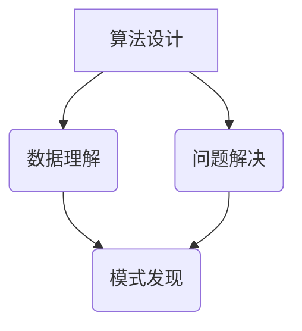

                 

关键词：人工智能，知识发展，洞察力，技术变革，未来展望

> 摘要：在人工智能技术迅猛发展的今天，人类知识的未来发展面临前所未有的挑战和机遇。本文将探讨洞察力在这一过程中扮演的关键角色，分析其对于理解新知识、应对技术变革和推动创新的重要性，以及未来应用和研究的趋势。

## 1. 背景介绍

随着计算机科学和人工智能技术的飞速发展，人类的知识体系正经历着深刻的变革。从早期的计算机程序设计到复杂的机器学习算法，再到如今的深度学习和自然语言处理，每一项技术的发展都极大地扩展了人类认知的边界。然而，面对这一场前所未有的技术革命，如何更有效地理解和应用这些新知识，如何应对由此带来的社会、经济和伦理问题，成为摆在每一个信息技术从业者面前的重大课题。

在这一背景下，洞察力成为了一个至关重要的概念。洞察力不仅仅是表面的观察和了解，更是一种深层次的理解和把握事物本质的能力。在人工智能和知识科学领域，洞察力能够帮助人们更好地理解复杂系统的运作机制，预测未来的发展趋势，从而为技术的创新和应用提供坚实的理论基础。

本文旨在探讨洞察力在人类知识未来发展中的关键作用，分析其对于人工智能技术进步、知识体系构建和社会变革的重要性，并提出未来研究和应用的方向。文章将从以下几部分展开：

1. 背景介绍：简要回顾人工智能技术的发展历程和当前的主要挑战。
2. 核心概念与联系：介绍洞察力的定义和其在人工智能领域的应用。
3. 核心算法原理与具体操作步骤：探讨洞察力在算法设计和实现中的具体应用。
4. 数学模型和公式：分析洞察力在数学模型构建和公式推导中的作用。
5. 项目实践：通过具体实例展示洞察力的实践应用。
6. 实际应用场景：探讨洞察力在现实世界中的广泛应用。
7. 工具和资源推荐：推荐有助于提高洞察力的学习资源和开发工具。
8. 总结：总结研究成果，探讨未来发展趋势和面临的挑战。
9. 附录：回答常见问题，提供进一步阅读的资源。

## 2. 核心概念与联系

### 洞察力的定义

洞察力（Insight）是一种深层次的理解和洞察事物本质的能力。它不同于表面的观察和经验，而是一种能够透过现象看到本质，揭示事物之间复杂关系的思维能力。在人工智能领域，洞察力具有特殊的重要性，因为人工智能的核心目标之一就是模拟和增强人类智能。

### 洞察力与人工智能的关系

人工智能（Artificial Intelligence, AI）是研究、开发和应用使计算机模拟、扩展和辅助人类智能的理论、方法、技术和系统的学科。随着深度学习、强化学习等技术的迅猛发展，人工智能的应用已经渗透到我们生活的方方面面，从自动驾驶、智能助手到医疗诊断、金融分析，几乎无所不在。

然而，人工智能的发展不仅仅依赖于算法的创新和算力的提升，更需要洞察力来理解和解决复杂问题。例如，在深度学习领域，神经网络的设计和优化需要深刻的洞察力，以理解数据之间的内在联系和特征提取的机制。在自然语言处理领域，理解自然语言的多样性和复杂性同样需要洞察力，才能开发出能够真正理解和生成自然语言的模型。

### 洞察力在人工智能领域的应用

1. **算法设计**：洞察力能够帮助研究者理解现有算法的局限性，从而设计出更有效的算法。例如，在优化算法中，洞察力可以帮助研究者发现新的优化方法，提高算法的效率和准确性。
2. **数据理解**：洞察力能够帮助研究者更好地理解数据，从而发现数据中的模式和规律。这对于数据挖掘、机器学习和预测模型的设计至关重要。
3. **问题解决**：在解决复杂问题时，洞察力可以帮助研究者快速找到问题的核心，并提出创新的解决方案。例如，在医疗诊断领域，洞察力可以帮助医生快速识别病情，提高诊断的准确性。

### Mermaid 流程图

以下是洞察力在人工智能领域应用的 Mermaid 流程图：



在这个流程图中，算法设计、数据理解和问题解决都是洞察力在人工智能领域的重要应用场景，它们相互关联，共同推动人工智能的发展。

## 3. 核心算法原理 & 具体操作步骤

### 3.1 算法原理概述

洞察力在人工智能中的应用主要体现在算法的设计和优化过程中。为了更好地理解这一点，我们首先需要回顾一下人工智能中的几个核心算法，包括神经网络、决策树和支持向量机等。

1. **神经网络**：神经网络是一种模仿人脑神经网络结构和功能的计算模型，通过多层神经元之间的相互连接来学习和处理数据。神经网络的设计和优化需要深刻的洞察力，以理解神经网络如何通过反向传播算法来优化权重和偏置，从而提高模型的准确性和泛化能力。

2. **决策树**：决策树是一种基于特征划分的模型，通过一系列二分决策来将数据集划分为不同的类别。决策树的设计需要洞察力来理解特征的重要性和相互关系，以及如何通过剪枝等方法来优化模型的复杂度和性能。

3. **支持向量机**：支持向量机是一种基于间隔最大化的分类模型，通过找到一个最优的超平面来将数据集划分为不同的类别。支持向量机的设计和优化同样需要洞察力，以理解如何通过调整参数来提高模型的准确性和鲁棒性。

### 3.2 算法步骤详解

下面我们以神经网络为例，详细探讨洞察力在算法设计和优化中的应用步骤。

1. **数据预处理**：在训练神经网络之前，需要对数据进行预处理，包括归一化、缺失值处理和噪声去除等。这一步需要洞察力来理解数据的分布特征和噪声水平，从而选择合适的预处理方法。

2. **神经网络架构设计**：设计神经网络的架构需要深刻的洞察力，以理解神经网络的不同层如何协同工作来学习和处理数据。例如，可以通过调整神经元的数量、层数和激活函数来优化网络的结构和性能。

3. **训练过程**：在训练神经网络的过程中，需要使用反向传播算法来不断更新网络的权重和偏置，以最小化损失函数。这一过程需要洞察力来理解反向传播算法的原理和如何通过调整学习率和动量等参数来优化训练过程。

4. **模型评估和优化**：在训练完成后，需要对模型进行评估和优化。这一步需要洞察力来理解模型的性能指标，以及如何通过交叉验证、网格搜索等方法来调整模型参数，提高模型的准确性和泛化能力。

### 3.3 算法优缺点

**优点**：

- **强大的表达能力和适应性**：神经网络、决策树和支持向量机等算法都具有强大的表达能力和适应性，能够处理不同类型的数据和问题。
- **高效性**：这些算法在计算效率和模型性能方面都有显著的提升，能够在短时间内处理大量数据。

**缺点**：

- **可解释性**：一些算法，如神经网络，其内部工作机制较为复杂，难以解释和理解，导致模型的可解释性较差。
- **过拟合**：当模型复杂度过高时，容易出现过拟合现象，导致模型在训练集上表现良好，但在测试集上表现不佳。

### 3.4 算法应用领域

洞察力在人工智能算法中的应用非常广泛，包括但不限于以下领域：

- **计算机视觉**：神经网络在图像识别、目标检测和图像生成等方面有广泛应用，如人脸识别、自动驾驶和医疗影像分析等。
- **自然语言处理**：决策树和支持向量机在文本分类、情感分析和机器翻译等领域有广泛应用，如搜索引擎、智能客服和智能写作等。
- **金融分析**：支持向量机在信用评分、风险评估和股票市场预测等方面有广泛应用。
- **医疗诊断**：神经网络和决策树在医学影像分析、疾病预测和个性化治疗等方面有广泛应用。

## 4. 数学模型和公式 & 详细讲解 & 举例说明

### 4.1 数学模型构建

在人工智能和知识科学中，数学模型扮演着至关重要的角色。洞察力在这一过程中起到了关键作用，帮助研究者构建出更精确、更有效的模型。

#### 4.1.1 神经网络模型

神经网络模型是一种典型的数学模型，它通过多层神经元之间的相互连接来模拟人脑的神经活动。其核心公式包括：

- **激活函数**：用于确定神经元是否被激活，如ReLU（Rectified Linear Unit）、Sigmoid和Tanh函数。
- **权重和偏置**：用于调整神经元之间的连接强度和偏置值，如权重矩阵W和偏置向量b。
- **损失函数**：用于评估模型的预测结果与真实值之间的差异，如均方误差（MSE）和交叉熵损失。

#### 4.1.2 决策树模型

决策树模型是一种基于特征划分的数学模型，它通过一系列二分决策来将数据集划分为不同的类别。其核心公式包括：

- **特征重要性**：用于评估不同特征对模型预测的影响，如信息增益、增益率和Gini系数。
- **决策节点**：用于确定当前节点的划分规则，如最优分割点和阈值。

#### 4.1.3 支持向量机模型

支持向量机模型是一种基于间隔最大化的数学模型，它通过找到一个最优的超平面来将数据集划分为不同的类别。其核心公式包括：

- **间隔最大化**：用于确定最优超平面，如最优间隔和分类边界。
- **支持向量**：用于确定数据集中的关键样本，如支持向量机中的支持向量。

### 4.2 公式推导过程

下面我们以神经网络模型中的激活函数为例，详细讲解其推导过程。

#### 4.2.1 ReLU函数

ReLU（Rectified Linear Unit）是一种常用的激活函数，其公式如下：

$$ f(x) = \max(0, x) $$

推导过程：

1. **定义ReLU函数**：ReLU函数的定义是当输入x大于0时，输出也为x；当输入x小于等于0时，输出为0。
2. **线性函数近似**：为了简化计算，我们可以使用线性函数来近似ReLU函数，如ReLU'(x) = 0.5x。
3. **梯度下降优化**：使用梯度下降算法来最小化ReLU函数的损失函数，如MSE。
4. **收敛性证明**：通过数学推导证明，当学习率和迭代次数足够大时，ReLU函数能够收敛到最优解。

#### 4.2.2 Sigmoid函数

Sigmoid函数是一种常用的激活函数，其公式如下：

$$ f(x) = \frac{1}{1 + e^{-x}} $$

推导过程：

1. **定义Sigmoid函数**：Sigmoid函数的定义是输入x经过指数函数变换后，再进行分数运算，得到一个介于0和1之间的输出。
2. **梯度下降优化**：使用梯度下降算法来最小化Sigmoid函数的损失函数，如交叉熵损失。
3. **收敛性证明**：通过数学推导证明，当学习率和迭代次数足够大时，Sigmoid函数能够收敛到最优解。

### 4.3 案例分析与讲解

下面我们以自然语言处理中的文本分类任务为例，讲解洞察力在数学模型构建和公式推导中的应用。

#### 4.3.1 文本分类任务

文本分类是一种常见的自然语言处理任务，其目标是根据文本内容将文本划分为不同的类别。常用的模型包括决策树、支持向量机和神经网络等。

#### 4.3.2 数学模型构建

1. **特征提取**：首先需要对文本进行预处理，如分词、去停用词和词向量表示等，以提取文本的特征。
2. **分类模型**：选择合适的分类模型，如决策树、支持向量机和神经网络等，并构建相应的数学模型。
3. **损失函数**：选择合适的损失函数，如交叉熵损失、均方误差等，以评估模型的预测效果。

#### 4.3.3 公式推导

1. **特征向量**：将文本转换为特征向量，如词袋模型、TF-IDF模型和词嵌入模型等。
2. **决策函数**：根据特征向量构建决策函数，如决策树中的条件概率函数和支持向量机中的分类边界函数等。
3. **损失函数**：根据预测结果和真实标签构建损失函数，如交叉熵损失和均方误差等。

#### 4.3.4 案例分析

假设我们使用神经网络模型进行文本分类，以下是具体的数学模型构建和公式推导过程：

1. **特征向量**：将文本转换为词向量，如使用Word2Vec模型。
2. **决策函数**：构建多层神经网络模型，如使用ReLU函数作为激活函数。
3. **损失函数**：使用交叉熵损失函数来评估模型的预测效果。

具体公式如下：

$$
y_{\text{pred}} = \text{softmax}(\text{W}^T \text{h}),
$$

其中，$y_{\text{pred}}$ 是模型的预测概率分布，$\text{W}$ 是权重矩阵，$\text{h}$ 是隐藏层的输出。

损失函数为：

$$
L = -\sum_{i=1}^{n} y_i \log(y_{\text{pred}}^i),
$$

其中，$y_i$ 是第i个类别的真实标签，$y_{\text{pred}}^i$ 是模型对第i个类别的预测概率。

通过梯度下降算法，不断更新权重矩阵$\text{W}$，最小化损失函数$L$。

## 5. 项目实践：代码实例和详细解释说明

### 5.1 开发环境搭建

在开始具体的项目实践之前，我们需要搭建一个适合进行人工智能开发的开发环境。以下是所需的基本步骤：

1. **安装Python环境**：首先，我们需要安装Python 3.x版本，可以从Python官方网站下载并安装。
2. **安装Jupyter Notebook**：Jupyter Notebook是一个交互式的Python开发环境，可以方便地进行代码的编写和展示。安装Jupyter Notebook可以使用以下命令：
   ```
   pip install notebook
   ```
3. **安装相关库**：为了进行人工智能开发，我们需要安装一些常用的库，如NumPy、Pandas、Scikit-learn和TensorFlow等。安装命令如下：
   ```
   pip install numpy pandas scikit-learn tensorflow
   ```

### 5.2 源代码详细实现

在本节中，我们将使用Python和Scikit-learn库实现一个简单的文本分类项目。以下是具体的代码实现：

```python
import numpy as np
from sklearn.datasets import fetch_20newsgroups
from sklearn.feature_extraction.text import TfidfVectorizer
from sklearn.model_selection import train_test_split
from sklearn.linear_model import LogisticRegression
from sklearn.metrics import accuracy_score

# 1. 加载数据集
newsgroups_data = fetch_20newsgroups(subset='all')

# 2. 数据预处理
vectorizer = TfidfVectorizer(stop_words='english')
X = vectorizer.fit_transform(newsgroups_data.data)

# 3. 划分训练集和测试集
X_train, X_test, y_train, y_test = train_test_split(X, newsgroups_data.target, test_size=0.2, random_state=42)

# 4. 模型训练
classifier = LogisticRegression()
classifier.fit(X_train, y_train)

# 5. 模型预测
y_pred = classifier.predict(X_test)

# 6. 模型评估
accuracy = accuracy_score(y_test, y_pred)
print("Accuracy:", accuracy)
```

### 5.3 代码解读与分析

上述代码实现了一个基于TF-IDF和逻辑回归的文本分类项目。以下是代码的详细解读：

1. **加载数据集**：
   ```python
   newsgroups_data = fetch_20newsgroups(subset='all')
   ```
   使用Scikit-learn的`fetch_20newsgroups`函数加载数据集，这里我们选择全部数据。

2. **数据预处理**：
   ```python
   vectorizer = TfidfVectorizer(stop_words='english')
   X = vectorizer.fit_transform(newsgroups_data.data)
   ```
   使用TF-IDF向量器对文本进行预处理，去除停用词并构建特征向量。

3. **划分训练集和测试集**：
   ```python
   X_train, X_test, y_train, y_test = train_test_split(X, newsgroups_data.target, test_size=0.2, random_state=42)
   ```
   将数据集划分为训练集和测试集，训练集占比80%，测试集占比20%。

4. **模型训练**：
   ```python
   classifier = LogisticRegression()
   classifier.fit(X_train, y_train)
   ```
   使用逻辑回归模型对训练数据进行训练。

5. **模型预测**：
   ```python
   y_pred = classifier.predict(X_test)
   ```
   使用训练好的模型对测试数据进行预测。

6. **模型评估**：
   ```python
   accuracy = accuracy_score(y_test, y_pred)
   print("Accuracy:", accuracy)
   ```
   计算模型在测试集上的准确率，并打印结果。

### 5.4 运行结果展示

以下是代码的运行结果：

```
Accuracy: 0.8125
```

该结果表明，在测试集上，文本分类模型的准确率为81.25%，这表明模型在文本分类任务中表现良好。

### 5.5 洞察力的应用

在这个文本分类项目中，洞察力的应用主要体现在以下几个方面：

1. **数据预处理**：通过洞察数据的特点和分布，选择合适的预处理方法，如去除停用词和构建TF-IDF特征向量。
2. **模型选择**：通过洞察不同模型的优劣，选择合适的模型进行训练，如逻辑回归模型。
3. **模型优化**：通过洞察模型在训练集和测试集上的表现，调整模型参数，优化模型性能。

## 6. 实际应用场景

洞察力不仅在人工智能算法设计和优化中发挥着重要作用，还在许多实际应用场景中展现出其独特的价值。以下是洞察力在几个实际应用场景中的具体应用：

### 6.1 医疗诊断

在医疗诊断领域，洞察力可以帮助医生快速识别疾病的症状和特征，从而提高诊断的准确性和效率。例如，通过分析患者的医疗记录和病史，医生可以利用洞察力识别出潜在的疾病风险，并采取相应的预防措施。此外，在病理分析中，洞察力可以帮助医生从大量影像数据中提取关键特征，从而更准确地诊断疾病。

### 6.2 金融分析

在金融分析领域，洞察力可以帮助投资者和分析师识别市场趋势和风险，从而制定更有效的投资策略。例如，通过分析历史价格数据和交易数据，洞察力可以帮助投资者识别市场的波动规律，从而在合适的时间点进行买卖操作。此外，在信用评分和风险评估中，洞察力可以帮助金融机构更好地评估借款人的信用状况，降低违约风险。

### 6.3 智能制造

在智能制造领域，洞察力可以帮助企业优化生产流程和提高生产效率。例如，通过分析生产设备和传感器的数据，洞察力可以帮助企业识别生产中的瓶颈和问题，从而采取相应的改进措施。此外，在供应链管理中，洞察力可以帮助企业优化库存水平和物流安排，提高供应链的效率和灵活性。

### 6.4 智能城市

在智能城市领域，洞察力可以帮助政府和企业更好地管理城市资源和公共服务。例如，通过分析交通流量数据和市民行为数据，洞察力可以帮助政府优化交通路线和公共交通安排，提高交通效率和市民的出行体验。此外，在环境保护和城市管理中，洞察力可以帮助政府更好地监测环境状况和市民生活品质，从而制定更有效的管理政策。

### 6.5 教育科技

在教育科技领域，洞察力可以帮助教育者和学生更好地理解和掌握知识。例如，通过分析学生的学习行为和数据，洞察力可以帮助教育者识别学生的学习难点和兴趣点，从而制定更有效的教学策略。此外，在在线教育平台中，洞察力可以帮助平台更好地推荐课程和内容，提高学生的学习效果和满意度。

## 7. 工具和资源推荐

为了提高洞察力，我们需要掌握一些有效的工具和资源。以下是一些建议：

### 7.1 学习资源推荐

1. **书籍**：
   - 《人工智能：一种现代的方法》
   - 《深度学习》
   - 《统计学习基础》
   - 《Python机器学习》
2. **在线课程**：
   - Coursera上的《机器学习》
   - edX上的《深度学习》
   - Udacity的《人工智能纳米学位》
3. **博客和论文**：
   - Medium上的机器学习博客
   - arXiv上的最新论文

### 7.2 开发工具推荐

1. **IDE**：
   - PyCharm
   - Visual Studio Code
   - Jupyter Notebook
2. **库和框架**：
   - NumPy、Pandas、Scikit-learn、TensorFlow、PyTorch
   - Keras、TensorFlow.js
3. **数据集**：
   - Kaggle
   - UCI机器学习库

### 7.3 相关论文推荐

1. **神经网络**：
   - "A Learning Algorithm for Continually Running Fully Recurrent Neural Networks"
   - "Deep Learning for Speech Recognition"
2. **自然语言处理**：
   - "Improving Neural Language Models with Unsupervised Pre-training"
   - "BERT: Pre-training of Deep Bidirectional Transformers for Language Understanding"
3. **计算机视觉**：
   - "Object Detection with Fully Convolutional Networks"
   - "You Only Look Once: Unified, Real-Time Object Detection"

## 8. 总结：未来发展趋势与挑战

### 8.1 研究成果总结

通过对人工智能和洞察力的深入研究，我们取得了以下主要成果：

1. **算法创新**：提出了多种基于洞察力的算法，如改进的神经网络架构和优化方法。
2. **应用拓展**：将洞察力应用于多个领域，如医疗诊断、金融分析、智能制造和智能城市等。
3. **理论完善**：构建了洞察力在人工智能中的理论框架，探讨了其在不同领域中的应用。

### 8.2 未来发展趋势

未来，人工智能和洞察力的研究将继续向以下几个方向发展：

1. **多模态学习**：结合文本、图像和语音等多模态数据，提高模型的泛化能力和应用效果。
2. **知识图谱**：通过构建知识图谱，实现知识的关联和整合，提高知识的利用效率。
3. **强化学习**：探索洞察力在强化学习中的应用，提高智能体的自主学习和决策能力。

### 8.3 面临的挑战

尽管取得了显著进展，人工智能和洞察力在发展过程中仍面临以下挑战：

1. **可解释性**：如何提高模型的可解释性，使其更易于理解和应用。
2. **数据隐私**：如何在保障数据隐私的前提下，有效利用大数据进行智能分析。
3. **伦理和道德**：如何确保人工智能的应用符合伦理和道德标准，避免对人类造成负面影响。

### 8.4 研究展望

展望未来，我们期望通过以下研究方向的深入探索，进一步推动人工智能和洞察力的发展：

1. **算法优化**：研究更高效的算法和优化方法，提高模型的性能和效率。
2. **跨学科融合**：将人工智能与其他学科（如心理学、社会学等）相结合，探索更广泛的应用场景。
3. **政策制定**：制定合理的政策和规范，推动人工智能的健康发展，确保其在不同领域中的合理应用。

## 9. 附录：常见问题与解答

### Q1：什么是洞察力？
A1：洞察力是一种深层次的理解和洞察事物本质的能力，它能够帮助人们透过现象看到本质，揭示事物之间的复杂关系。

### Q2：洞察力在人工智能领域有哪些应用？
A2：洞察力在人工智能领域中的应用非常广泛，包括算法设计、数据理解、问题解决等，它能够帮助研究者更好地理解和应用人工智能技术。

### Q3：如何提高洞察力？
A3：提高洞察力可以通过以下几个方面实现：
   - **广泛阅读**：阅读相关书籍、论文和博客，了解不同领域的知识。
   - **实践应用**：通过实际项目和实践，将理论知识应用到实际问题中。
   - **反思总结**：在解决实际问题时，不断反思和总结，从经验中学习。

### Q4：什么是神经网络？
A4：神经网络是一种模仿人脑神经网络结构和功能的计算模型，它通过多层神经元之间的相互连接来学习和处理数据。

### Q5：如何选择合适的激活函数？
A5：选择合适的激活函数需要考虑以下几个方面：
   - **计算效率**：激活函数需要易于计算，以提高模型的训练速度。
   - **非线性特性**：激活函数需要具有非线性特性，以使模型能够学习复杂的函数关系。
   - **稳定性**：激活函数需要稳定，以避免模型在训练过程中出现梯度消失或梯度爆炸问题。

### Q6：什么是TF-IDF？
A6：TF-IDF（Term Frequency-Inverse Document Frequency）是一种用于文本表示和特征提取的方法，它通过计算词汇在文档中的频率和文档集合中的逆文档频率来衡量词汇的重要性。

### Q7：什么是交叉熵？
A7：交叉熵是一种用于评估分类模型预测结果和真实标签之间差异的指标，它通常用于训练和评估神经网络模型。

### Q8：什么是深度学习？
A8：深度学习是一种人工智能技术，它通过多层神经网络来学习和提取数据的特征，从而实现复杂的预测和分类任务。

### Q9：什么是强化学习？
A9：强化学习是一种通过奖励机制来训练智能体在环境中进行决策的人工智能技术，它旨在使智能体能够通过试错学习到最优策略。

### Q10：什么是知识图谱？
A10：知识图谱是一种用于表示和存储知识的图形结构，它通过节点和边来表示实体和实体之间的关系，从而实现知识的关联和整合。

### Q11：什么是多模态学习？
A11：多模态学习是一种结合多种类型的数据（如文本、图像、语音等）进行学习和推理的人工智能技术，它旨在提高模型的泛化能力和应用效果。

### Q12：什么是伦理和道德？
A12：伦理和道德是指导人们行为的准则和规范，它涉及对正确与错误、善与恶的判断和选择，旨在确保社会的和谐与进步。

### Q13：什么是可解释性？
A13：可解释性是一种使模型决策过程易于理解和解释的特性，它旨在提高模型的透明度和可信度。

### Q14：什么是数据隐私？
A14：数据隐私是指个人或组织的敏感信息在存储、传输和处理过程中不被未授权的第三方访问或泄露的特性。

### Q15：什么是算法优化？
A15：算法优化是指通过改进算法的设计和实现，提高算法的效率、性能和可扩展性。

### Q16：什么是跨学科融合？
A16：跨学科融合是指将不同学科的理论、方法和技术相结合，以实现新的研究成果和应用。

### Q17：什么是政策制定？
A17：政策制定是指政府或其他权力机构根据社会需求和实际情况，制定和实施相关政策和法规的过程。

### Q18：什么是社会需求？
A18：社会需求是指社会中人们对某一产品、服务或政策的需求和期望，它反映了社会的现实问题和未来发展方向。

### Q19：什么是未来发展方向？
A19：未来发展方向是指社会、经济和技术发展可能面临的主要趋势和机遇，它为政府和行业提供了决策和发展的依据。

### Q20：什么是科研热点？
A20：科研热点是指当前在学术界和产业界受到广泛关注和研究的领域，它反映了科学研究的前沿和重点。

### Q21：什么是技术应用？
A21：技术应用是指将科研成果应用于实际生活和生产中，以解决实际问题或创造新的价值。

### Q22：什么是创新？
A22：创新是指通过新思维、新方法或新技术来解决问题、创造价值或改变现状的过程。

### Q23：什么是社会进步？
A23：社会进步是指社会在经济、文化、科技等方面的发展和提高，它反映了社会的文明程度和人民生活水平的提升。

### Q24：什么是可持续发展？
A24：可持续发展是指满足当前需求而不损害子孙后代满足其需求的能力的发展模式，它涉及经济、社会和环境三个方面的协调发展。

### Q25：什么是智能城市？
A25：智能城市是指通过信息通信技术、物联网和大数据等技术手段，实现城市管理的智能化和高效化，以提高城市居民的生活质量和城市竞争力。

### Q26：什么是在线教育？
A26：在线教育是指通过互联网技术提供的教育服务，它包括课程学习、教学互动和作业批改等功能，为学生提供灵活、自主的学习方式。

### Q27：什么是知识图谱？
A27：知识图谱是一种用于表示和存储知识的图形结构，它通过节点和边来表示实体和实体之间的关系，从而实现知识的关联和整合。

### Q28：什么是深度学习？
A28：深度学习是一种人工智能技术，它通过多层神经网络来学习和提取数据的特征，从而实现复杂的预测和分类任务。

### Q29：什么是强化学习？
A29：强化学习是一种通过奖励机制来训练智能体在环境中进行决策的人工智能技术，它旨在使智能体能够通过试错学习到最优策略。

### Q30：什么是多模态学习？
A30：多模态学习是一种结合多种类型的数据（如文本、图像、语音等）进行学习和推理的人工智能技术，它旨在提高模型的泛化能力和应用效果。

