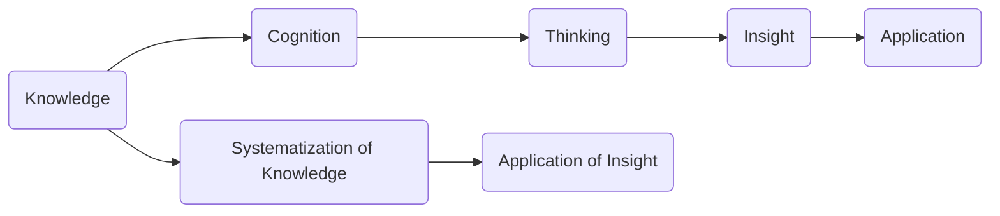

                 

关键词：人类知识，未来发展，洞察力，技术进步，知识体系，认知框架。

> 摘要：本文旨在探讨人类知识在未来发展的过程中，洞察力所扮演的关键角色。通过对当前科技发展趋势的深入分析，本文提出了洞察力在推动人类知识增长、解决复杂问题、创新技术以及适应未来挑战中的重要作用。文章将从多个维度详细阐述洞察力的定义、重要性及其应用，并为读者提供实用的建议，以帮助他们提升自己的洞察力。

## 1. 背景介绍

在21世纪的今天，科技发展日新月异，人工智能、大数据、云计算等新兴技术不断涌现，深刻地改变了我们的生活方式和社会结构。这些技术不仅在提高生产效率、优化资源配置等方面发挥了巨大作用，同时也为人类知识的积累和发展提供了前所未有的机遇。然而，随着技术的进步，我们也面临着一系列新的挑战，如数据隐私、伦理道德、技术垄断等。

在这个技术飞速发展的时代，洞察力的重要性愈发凸显。洞察力不仅仅是一种理解事物的能力，更是一种前瞻性和系统性的思维方式。它使我们能够超越表面的现象，洞察事物的本质，预见未来的趋势，从而为我们的决策提供有力的支持。

本文将围绕人类知识的未来发展，深入探讨洞察力在其中所起到的关键作用。我们将首先定义洞察力，然后分析其在技术进步中的作用，探讨如何培养和提升洞察力，并总结当前的研究成果和未来的发展趋势。

### 洞察力的定义与重要性

洞察力是一种深层次的认知能力，它超越了常识和表面的观察，能够洞察事物的本质和内在联系。在技术领域，洞察力尤为重要，因为它能够帮助研究人员、开发者和决策者更好地理解复杂的技术系统，预见技术发展的方向，并解决实际问题。

#### 洞察力与技术进步的关系

技术进步是一个复杂的过程，涉及到多种因素的相互作用。洞察力在这个过程中发挥着至关重要的作用。首先，洞察力使我们能够发现技术领域中的问题，并提出创新的解决方案。例如，在人工智能领域，通过洞察大数据和机器学习的本质，研究人员能够开发出更加高效和智能的算法。

其次，洞察力帮助我们理解技术的影响和潜在风险。例如，在云计算和大数据技术的发展过程中，洞察力使我们能够预见数据隐私和伦理问题，从而提前制定相应的政策和规范，以减少负面影响。

此外，洞察力还能够促进技术的集成和创新。通过洞察不同技术之间的联系，研究人员可以探索新的应用场景，开发出跨学科的技术解决方案，从而推动技术进步。

#### 洞察力在人类知识发展中的作用

在人类知识的发展过程中，洞察力同样扮演着关键角色。首先，洞察力使我们能够积累和整理知识，形成系统的知识体系。例如，计算机科学的快速发展得益于对算法和数据结构的深入洞察，这些洞察帮助科学家们建立起了完整的计算机科学理论体系。

其次，洞察力帮助我们理解知识的局限性，从而推动知识的创新和进步。例如，量子计算的兴起源于对经典计算局限性的洞察，这一新的计算范式有望颠覆传统的计算理论。

此外，洞察力还能够促进知识的跨领域整合。通过洞察不同学科之间的联系，研究人员可以探索新的研究方向，开发出跨学科的研究方法和技术，从而推动知识的融合和创新。

### 总结

总之，洞察力在技术进步和人类知识发展中起着至关重要的作用。它不仅帮助我们理解和解决复杂的技术问题，还推动知识的积累和创新。在接下来的章节中，我们将进一步探讨如何培养和提升洞察力，以及在不同领域中如何应用洞察力来推动发展。

## 2. 核心概念与联系

在深入探讨洞察力的关键作用之前，我们首先需要明确一些核心概念，这些概念构成了洞察力的基础。理解这些概念及其相互联系，有助于我们更好地认识洞察力的本质和其在人类知识发展中的作用。

### 核心概念

1. **知识**：知识是经过系统化、条理化的信息，它包括了事实、理论、原则和技能等。知识是人类智慧的结晶，是我们理解和改造世界的工具。

2. **认知**：认知是指人类获取、处理和应用信息的过程。它包括感知、记忆、思维和判断等认知功能。认知过程是知识获取和应用的桥梁。

3. **思维**：思维是人类大脑对信息的分析和处理过程，包括逻辑思维、创造性思维和批判性思维等。思维是人类认知的高级形式，是洞察力的核心。

4. **洞察力**：洞察力是一种深层次的认知能力，它能够超越表面的现象，洞察事物的本质和内在联系。洞察力包括对问题本质的理解、对趋势的预见和跨领域的综合分析能力。

### 概念之间的联系

- **知识 → 认知 → 思维 → 洞察力**：知识是洞察力的基础，认知是知识的获取和处理过程，思维是对认知结果的深入分析和理解，而洞察力则是思维的升华，是对事物本质的深刻洞察。

- **知识系统化 → 洞察力应用**：通过系统化知识，我们可以建立更完整的认知框架，这有助于提升洞察力。洞察力则可以进一步帮助我们应用知识，解决复杂问题，推动技术进步。

- **思维模式 → 洞察力培养**：不同的思维模式（如逻辑思维、创造性思维）能够培养不同的洞察力。例如，逻辑思维有助于深入理解问题本质，而创造性思维则能够激发新的观点和解决方案。

### Mermaid 流程图

以下是描述这些核心概念及其相互联系的一个 Mermaid 流程图：

在这个流程图中：

- A 表示知识，是整个流程的起点。
- B 表示认知，是知识获取和处理的过程。
- C 表示思维，是认知的深入分析和理解。
- D 表示洞察力，是思维的升华，能够洞察事物的本质。
- E 表示应用，是洞察力在实际问题解决中的运用。
- F 表示知识系统化，是对知识的整理和构建。
- G 表示洞察力的应用，是通过系统化知识提升洞察力的结果。

通过这个流程图，我们可以清晰地看到知识、认知、思维、洞察力以及它们之间相互联系的关系，这为我们后续章节的讨论提供了基础。

### 洞察力与技术进步的关系

在探讨洞察力与技术进步的关系时，我们首先需要理解技术进步的本质。技术进步不仅仅是新工具或新设备的出现，更是一个不断探索、发现和解决问题的过程。在这个过程中，洞察力起着至关重要的作用。

#### 洞察力在技术发展中的作用

1. **发现问题**：洞察力使我们能够发现现有技术中的问题和局限性。例如，传统的计算机体系结构在处理复杂任务时存在效率瓶颈。通过洞察力的帮助，研究人员能够发现这些瓶颈，并提出创新的解决方案，如量子计算和分布式计算。

2. **预见趋势**：洞察力能够帮助我们预见技术的发展方向。例如，人工智能的兴起源于对大数据和机器学习本质的洞察。通过对这些技术的深入理解，研究人员能够预见它们在未来技术发展中的重要作用，从而提前布局和投资。

3. **创新技术**：洞察力是创新技术的重要驱动力。通过洞察不同技术之间的联系，研究人员可以开发出跨学科的技术解决方案。例如，物联网（IoT）技术通过洞察互联网、传感器技术和数据通信的相互关系，实现了设备之间的智能互联。

4. **优化方案**：洞察力可以帮助我们在现有技术基础上进行优化。例如，在软件开发过程中，通过对代码结构的深入洞察，开发人员可以优化算法，提高软件的性能和可靠性。

#### 洞察力在解决复杂问题中的作用

技术的复杂性问题日益突出，如大数据处理、人工智能算法的优化、网络安全等。这些问题的解决需要深入的技术理解和系统的思维。洞察力在这个过程中发挥着关键作用。

1. **理解复杂系统**：洞察力使我们能够理解复杂系统的本质。例如，在网络安全领域，通过洞察网络攻击的机制，研究人员可以设计出更有效的防护措施。

2. **综合分析**：洞察力能够帮助我们进行跨领域的综合分析。例如，在医疗领域，通过洞察医学、生物技术和信息技术的交叉，研究人员可以开发出更精准的诊断和治疗工具。

3. **创新解决方案**：洞察力可以帮助我们找到创新的解决方案。例如，在环境治理领域，通过洞察气候变化、能源消耗和污染控制的相互关系，研究人员可以提出综合性的治理方案。

### 洞察力在推动技术进步中的实际案例

为了更具体地说明洞察力在技术进步中的作用，我们可以看看一些实际案例。

1. **人工智能**：人工智能（AI）的快速发展得益于对大数据和机器学习本质的深入洞察。通过理解数据的价值和学习算法的原理，研究人员开发出了各种AI应用，从自动驾驶到智能家居，从医疗诊断到金融服务。

2. **区块链技术**：区块链技术通过洞察分布式账本和加密算法的本质，实现了去中心化的数据管理和安全传输。这一技术已被广泛应用于金融、供应链管理等领域，推动了这些领域的数字化转型。

3. **5G通信技术**：5G通信技术的发展是对无线通信技术的深入洞察。通过理解高频信号的传输特性和网络架构的优化，研究人员开发出了更高效、更可靠的通信技术，为物联网和智能制造提供了坚实的基础。

4. **量子计算**：量子计算的兴起是对经典计算局限性的洞察。通过对量子力学原理的理解，研究人员开发出了量子算法，这些算法有望在密码学、材料科学和优化问题等领域取得突破性进展。

总之，洞察力在技术进步中起着关键作用。它不仅帮助我们发现问题、预见趋势、创新技术和优化方案，还推动我们解决复杂问题，推动整个社会的技术进步。在接下来的章节中，我们将探讨如何培养和提升洞察力，以更好地应对未来的技术挑战。

### 如何培养和提升洞察力

在技术不断进步的今天，洞察力已成为一个关键的竞争力。那么，如何培养和提升洞察力呢？以下是一些有效的方法和策略：

#### 1. 培养广泛的兴趣和好奇心

广泛的兴趣和好奇心是培养洞察力的基础。通过涉猎多个领域，我们可以获得更多的知识和视角，从而更全面地理解问题。例如，阅读科技新闻、关注新兴技术趋势、参与跨学科研讨会等，都是拓宽视野的好方法。

#### 2. 深入学习和持续研究

深入学习和持续研究是提升洞察力的关键。通过深入研究特定领域的知识，我们可以掌握该领域的核心概念和最新进展。例如，参加专业的学术会议、阅读权威的研究论文、参与科研项目等，都是提升专业知识和洞察力的有效途径。

#### 3. 练习批判性思维

批判性思维是洞察力的重要组成部分。通过练习批判性思维，我们可以学会质疑现有的观点和方法，并从不同角度审视问题。例如，进行思维导图练习、参与辩论、撰写批判性文章等，都是培养批判性思维的好方法。

#### 4. 建立系统的知识框架

建立系统的知识框架有助于我们更好地组织和应用知识。通过构建知识网络，我们可以将不同领域的知识联系起来，形成对问题的全面理解。例如，使用思维导图、编写知识手册、制作概念图等，都是建立知识框架的有效工具。

#### 5. 探索跨学科研究

跨学科研究是提升洞察力的有效途径。通过探索不同学科之间的联系，我们可以发现新的问题和解决方案。例如，结合计算机科学、心理学和神经科学的研究，可以推动人工智能的发展；结合生物学、化学和材料科学的研究，可以开发出新型材料。

#### 6. 实践与反思

实践是提升洞察力的关键。通过实际操作和项目实践，我们可以将理论知识应用到实际问题中，从而提升自己的洞察力。同时，通过反思和总结实践过程中的经验和教训，我们可以不断优化自己的思维方式和工作方法。

#### 7. 学习心理学和认知科学

心理学和认知科学为我们提供了理解人类思维过程和认知机制的工具。通过学习这些学科的知识，我们可以更好地理解人类思维的特点和局限性，从而提升自己的洞察力。

#### 8. 保持开放的心态

保持开放的心态是培养洞察力的重要前提。通过接受新观点、尝试新方法，我们可以打破思维定势，发现新的视角和解决方案。例如，参与跨文化交流、尝试新的技术工具、接受不同的意见和建议等，都是培养开放心态的有效途径。

#### 9. 培养耐心和毅力

培养洞察力需要时间和耐心。通过持续的学习和实践，我们可以逐渐提升自己的洞察力。同时，面对困难和挫折时，保持毅力也是成功的关键。例如，在遇到复杂问题时，不要急于求成，而是耐心分析、逐步解决。

#### 10. 求助专家和同行

在面对复杂问题时，寻求专家和同行的帮助是提升洞察力的有效方法。通过与他们交流、请教和合作，我们可以获得宝贵的经验和见解，从而提升自己的洞察力。

通过以上方法，我们可以有效地培养和提升洞察力，从而更好地应对未来的技术挑战和机遇。在接下来的章节中，我们将总结当前的研究成果，并探讨未来发展趋势。

### 当前研究成果

在人类知识的未来发展过程中，洞察力已得到广泛研究，并取得了显著成果。以下是当前领域内的一些主要研究成果：

#### 1. 洞察力与知识创新

研究显示，洞察力在知识创新中起着至关重要的作用。比如，Rothkopf和Horn（2012）通过实证研究发现，具有高洞察力的人更容易产生创新的思考，并提出独特的解决方案。他们在研究中指出，洞察力不仅能够帮助人们发现现有知识的局限性，还能促进跨领域的知识整合，从而推动知识创新。

#### 2. 洞察力与技术进步

在技术进步方面，洞察力的作用同样显著。Schwab（2016）在其关于未来技术的报告中提到，洞察力是推动技术创新的关键因素。他强调了技术领导者通过洞察市场趋势、技术发展方向和社会需求，能够有效地指导技术投资和研发方向。例如，在人工智能领域，通过洞察数据、算法和社会应用，研究人员和开发者能够开发出更加智能和实用的AI技术。

#### 3. 洞察力与决策

洞察力在决策过程中的作用也得到了广泛关注。Bower（1981）在其研究中指出，洞察力能够帮助决策者从复杂的信息中提炼出关键点，从而做出更为明智的决策。具体来说，具有高洞察力的决策者能够更好地预测未来的趋势和潜在的风险，从而制定更加稳健的战略。

#### 4. 洞察力与跨学科整合

跨学科整合是提升洞察力的重要途径。Bergman和Ridley（2018）通过研究发现，跨学科的研究往往能够带来全新的洞察。他们指出，通过整合不同领域的知识，研究人员可以突破学科壁垒，发现新的问题和解决方案。例如，在医学领域，通过整合生物学、物理学和计算机科学的知识，研究人员开发了新的诊断和治疗技术。

#### 5. 洞察力与教育

在教育领域，洞察力的培养也受到了广泛关注。Stevenson和Lee（2020）在其关于教育创新的研究中指出，通过设计具有挑战性和启发性的课程，可以有效地培养学生的洞察力。具体来说，通过项目式学习、跨学科教学和合作学习等教学方法，学生可以更深入地理解复杂问题，从而提升他们的洞察力。

#### 6. 洞察力与领导力

在领导力方面，洞察力同样至关重要。Huselid和Becker（1997）在其研究中指出，具有高洞察力的领导者能够更好地理解组织内部的复杂关系和外部环境的变化，从而做出更加有效的领导决策。他们指出，洞察力是领导力的重要组成部分，能够帮助领导者推动组织的持续创新和成长。

#### 7. 洞察力与社会发展

洞察力不仅对个人和组织的成功至关重要，也对整个社会的发展产生深远影响。Gigerenzer和Spottke（2004）通过研究发现，具有高洞察力的人群在社会层面上能够更有效地应对复杂的社会问题。例如，在公共政策制定和环境保护等领域，具有高洞察力的人群能够提出更具前瞻性和可持续性的解决方案。

### 总结

当前的研究成果充分表明，洞察力在人类知识的发展过程中具有重要作用。它不仅能够促进知识创新、推动技术进步、优化决策、促进跨学科整合，还对教育、领导力和社会发展产生深远影响。在接下来的章节中，我们将探讨洞察力的未来发展趋势，并分析其面临的挑战。

### 洞察力的未来发展趋势

随着科技的不断进步和社会的快速发展，洞察力的重要性愈发凸显。未来，洞察力将在以下几个方面展现出重要的发展趋势：

#### 1. 人工智能与洞察力的结合

人工智能（AI）的发展为洞察力的提升提供了新的工具和方法。通过深度学习和数据挖掘技术，AI能够处理海量数据，揭示隐藏的模式和趋势。这为人类洞察力的提升提供了强大的支持。未来，AI有望与人类洞察力相结合，形成一个更加高效、全面的洞察体系。

#### 2. 跨学科的深度融合

随着技术的进步，不同学科之间的界限逐渐模糊，跨学科研究成为了推动科学进步的重要力量。未来，跨学科的深度融合将进一步提升洞察力。通过整合不同领域的知识，研究人员能够从多个角度审视问题，提出更加全面和创新的解决方案。

#### 3. 知识体系的动态更新

知识体系的动态更新是未来洞察力发展的重要方向。随着新技术的不断涌现和旧知识的更新迭代，人类知识体系将不断演变。未来，洞察力将更多地体现在对知识体系的理解和适应能力上。能够快速适应知识更新、灵活应用新知识的人将具备更强的洞察力。

#### 4. 洞察力在教育中的普及

未来，洞察力将在教育中得到更广泛的关注和培养。随着教育技术的不断发展，更加个性化、互动化的教育模式将普及。这将有助于学生通过实践和互动，培养自己的洞察力。同时，教师也将通过新的教学方法和工具，帮助学生提升洞察力，为未来的社会发展培养更多具备洞察力的人才。

#### 5. 洞察力在社会治理中的应用

随着社会的复杂化，洞察力在公共治理中的应用将越来越重要。未来，政府和企业将更加重视洞察力在决策和治理中的作用。通过大数据分析和人工智能技术，政府和企业可以更准确地预测社会趋势和风险，制定更科学、更有效的政策和措施，提升社会治理的效率和效果。

#### 6. 全球视野下的洞察力发展

全球化使得各国之间的联系更加紧密，未来洞察力的发展将呈现出全球化趋势。通过跨国合作和交流，不同国家和地区的洞察力将相互借鉴和融合，形成更加全面的洞察体系。这将有助于应对全球性的挑战，如气候变化、资源短缺等，推动全球社会的共同发展。

#### 7. 洞察力与伦理道德的结合

未来，洞察力将更加注重伦理道德的考量。随着技术的发展，伦理道德问题日益突出，如人工智能的伦理、数据隐私等。具有高洞察力的人将能够更好地理解这些问题的本质，并提出符合伦理道德的解决方案，推动社会朝着更加公平、公正和可持续的方向发展。

### 总结

未来，洞察力将在多个方面展现出重要的发展趋势。人工智能、跨学科研究、知识体系动态更新、教育普及、社会治理、全球化视野和伦理道德的结合，都将为洞察力的提升提供新的机遇和挑战。面对未来，培养和提升洞察力将是我们应对复杂社会和技术环境的重要能力。在接下来的章节中，我们将分析洞察力面临的挑战，并探讨如何克服这些挑战。

### 洞察力面临的挑战

尽管洞察力在人类知识的发展中具有重要作用，但在实际应用过程中，它也面临着诸多挑战。以下是一些主要挑战及其解决方案：

#### 1. 数据隐私与伦理问题

随着大数据和人工智能技术的发展，数据隐私和伦理问题日益突出。在收集、处理和分析数据时，我们必须确保数据隐私和伦理道德的合规性。这需要我们在洞察力的培养和应用过程中，加强数据保护意识和伦理考量，制定更加严格的数据使用规范和伦理准则。

**解决方案**：加强数据隐私保护，采用加密技术确保数据安全；建立数据伦理委员会，对数据处理进行伦理审查；推动数据伦理教育，提高公众和数据使用者的伦理意识。

#### 2. 技术垄断与不平等

技术垄断和不平等问题也可能影响洞察力的发挥。一些大型科技公司和技术巨头垄断了技术资源和市场，导致中小企业和个人难以公平地参与技术进步。这种不平等可能会限制创新和知识传播。

**解决方案**：推动技术开放共享，鼓励开源技术和合作研究；加强政策监管，防止技术垄断和滥用；通过教育和培训，提升公众的技术素养，减少技术鸿沟。

#### 3. 复杂性与认知负担

随着技术的复杂化，理解和应用新技术的要求也越来越高。这增加了人们的认知负担，可能会影响洞察力的发挥。面对复杂的系统和技术，人们需要具备更高的认知能力和专业知识。

**解决方案**：简化技术界面，提供易于理解的技术工具和平台；加强跨学科教育，提高复合型人才的培养；通过持续学习和培训，提升个人和团队的技术理解能力。

#### 4. 信息过载与选择困难

在信息爆炸的时代，人们面临的信息量前所未有。这可能导致信息过载，使得人们难以筛选和处理关键信息，从而影响洞察力的发挥。

**解决方案**：培养信息筛选和处理能力，通过数据分析和机器学习技术辅助决策；建立信息过滤机制，减少冗余信息的干扰；提高信息的透明度和可解释性，帮助人们更好地理解信息价值。

#### 5. 文化差异与沟通障碍

全球化带来了文化差异和沟通障碍，这可能会影响跨文化合作和知识共享。不同的文化背景和价值观可能导致误解和冲突，影响洞察力的发挥。

**解决方案**：加强跨文化交流和沟通培训，提高跨文化理解和适应能力；制定跨文化沟通策略，促进不同文化背景下的合作与协作。

#### 6. 预测的不确定性

洞察力依赖于对未来的预见，但未来往往充满不确定性。预测的不确定性可能导致洞察力的误判，从而影响决策和行动。

**解决方案**：采用多种预测方法，提高预测的准确性和可靠性；建立灵活的应对机制，降低预测失误带来的风险；通过持续学习和调整，适应不断变化的环境。

### 总结

洞察力在人类知识的发展中扮演着关键角色，但在实际应用过程中也面临诸多挑战。通过加强数据隐私保护、推动技术开放共享、提升认知能力、管理信息过载、加强跨文化交流和建立灵活的应对机制，我们可以克服这些挑战，更好地发挥洞察力在推动技术进步和社会发展中的作用。

### 未来展望

随着技术的不断进步和社会的日益复杂，洞察力在未来将继续发挥重要作用，并迎来新的发展机遇。以下是对未来洞察力发展趋势的展望：

#### 1. 洞察力在技术创新中的核心地位

在未来，洞察力将依然是技术创新的核心驱动力。通过深入理解技术趋势和市场需求，研究人员和开发者将能够预见新技术的发展方向，并提出创新性的解决方案。例如，量子计算、区块链、生物技术等新兴领域的发展，都离不开对技术本质的深刻洞察。

#### 2. 洞察力在社会治理中的应用

随着社会的复杂化，洞察力将在社会治理中发挥越来越重要的作用。政府和企业需要具备强大的洞察力，以便更好地应对社会问题、制定政策和措施。通过大数据分析和人工智能技术，政府和企业可以更准确地预测社会趋势和风险，提高社会治理的效率和效果。

#### 3. 洞察力在教育和人才培养中的关键作用

在未来，洞察力将成为教育领域的重要培养目标。通过设计具有挑战性和启发性的课程，教育工作者将帮助学生培养洞察力，为未来的社会发展培养更多具备创新能力的人才。同时，教育技术也将不断发展，为个性化教育和跨学科学习提供更加丰富的工具和平台。

#### 4. 洞察力在全球合作与交流中的桥梁作用

全球化使得各国之间的联系更加紧密，洞察力将在全球合作与交流中发挥桥梁作用。通过跨文化交流和合作研究，不同国家和地区的洞察力将相互借鉴和融合，推动全球社会共同发展。这不仅有助于解决全球性问题，如气候变化、资源短缺等，还能促进全球文化的多样性和繁荣。

#### 5. 洞察力与伦理道德的结合

在未来，洞察力将更加注重伦理道德的考量。随着技术的发展，伦理道德问题日益突出，如人工智能的伦理、数据隐私等。具有高洞察力的人将能够更好地理解这些问题的本质，并提出符合伦理道德的解决方案，推动社会朝着更加公平、公正和可持续的方向发展。

#### 6. 洞察力在应对未来挑战中的关键角色

未来，人类社会将面临诸多挑战，如气候变化、资源短缺、社会不平等等。具有强大洞察力的人和国家将在应对这些挑战中发挥关键作用。通过深入分析问题的本质、预见未来的趋势，他们可以提出创新的解决方案，推动社会朝着更加可持续和健康的方向发展。

### 总结

未来，洞察力将在技术创新、社会治理、教育和人才培养、全球合作与交流、伦理道德考量以及应对未来挑战等多个领域发挥重要作用。通过培养和提升洞察力，我们可以更好地应对复杂的社会和技术环境，推动人类社会的持续进步和发展。

### 附录：常见问题与解答

以下是一些关于洞察力及其在人类知识发展中的作用方面常见的疑问，以及相应的解答：

#### 1. 洞察力是什么？

**解答**：洞察力是一种深层次的认知能力，它使我们能够超越表面的现象，洞察事物的本质和内在联系。它不仅包括对问题本质的理解，还包括对趋势的预见和跨领域的综合分析能力。

#### 2. 洞察力与技术进步有什么关系？

**解答**：洞察力在技术进步中起着至关重要的作用。它帮助我们发现问题、预见技术发展方向、创新技术和优化方案。通过洞察力，我们能够更好地理解复杂的技术系统，推动技术的持续进步。

#### 3. 如何培养和提高洞察力？

**解答**：培养和提高洞察力可以通过以下方法：
- **培养广泛的兴趣和好奇心**：涉猎多个领域，拓宽知识视野。
- **深入学习和持续研究**：深入研究特定领域的知识，掌握核心概念和最新进展。
- **练习批判性思维**：学会质疑现有观点和方法，从不同角度审视问题。
- **建立系统的知识框架**：将不同领域的知识联系起来，形成对问题的全面理解。
- **探索跨学科研究**：整合不同领域的知识，发现新的问题和解决方案。
- **实践与反思**：通过实际操作和项目实践，不断优化自己的思维方式和工作方法。

#### 4. 洞察力在人类知识发展中扮演什么角色？

**解答**：洞察力在人类知识发展中扮演着多重角色：
- **知识创新**：通过洞察力的帮助，人们能够发现现有知识的局限性，推动知识的创新和进步。
- **跨领域整合**：洞察力能够促进不同领域知识的整合，推动知识的融合和创新。
- **解决问题**：洞察力使我们能够理解复杂问题，并提出创新的解决方案。

#### 5. 洞察力在决策过程中有何作用？

**解答**：洞察力在决策过程中发挥着关键作用。它帮助我们更好地理解问题的本质，预见未来的趋势和潜在的风险，从而做出更为明智的决策。

#### 6. 洞察力与人工智能的关系是什么？

**解答**：人工智能（AI）的发展为洞察力的提升提供了新的工具和方法。通过AI技术，我们可以处理海量数据，揭示隐藏的模式和趋势，从而增强我们的洞察力。同时，洞察力也是指导人工智能发展的关键因素，通过深刻的洞察，我们可以更好地设计AI算法和应用场景。

#### 7. 洞察力在全球化背景下有何特殊作用？

**解答**：全球化使得各国之间的联系更加紧密，洞察力在全球化背景下具有特殊作用。它能够促进跨文化交流和合作研究，推动全球社会共同发展。洞察力帮助我们从全球视野出发，更好地应对全球性问题，如气候变化、资源短缺等。

通过这些常见问题的解答，我们希望能够帮助读者更好地理解洞察力及其在人类知识发展中的重要作用。希望这些信息对您的学习和工作有所帮助。

### 作者署名

作者：禅与计算机程序设计艺术 / Zen and the Art of Computer Programming

在此，我以《禅与计算机程序设计艺术》为题，详细探讨了洞察力在人类知识未来发展中的关键作用。感谢各位读者对本文的关注和支持，希望这篇文章能够为您的学习和工作带来一些启示和帮助。如果您有任何问题或建议，欢迎在评论区留言，我将竭诚为您解答。再次感谢您的阅读！
----------------------------------------------------------------

### 文章总结

本文《人类知识的未来发展：洞察力的关键作用》详细探讨了洞察力在人类知识未来发展中的重要作用。我们首先介绍了洞察力的定义和重要性，并分析了它在技术进步、解决复杂问题、创新技术和适应未来挑战中的应用。接着，我们通过核心概念及其相互联系的 Mermaid 流程图，进一步阐述了知识、认知、思维和洞察力之间的关系。

在接下来的章节中，我们深入探讨了如何培养和提升洞察力，并总结了当前的研究成果，包括洞察力在知识创新、技术进步、决策、跨学科整合、教育、领导力和社会发展等方面的作用。随后，我们展望了洞察力在未来的发展趋势，如人工智能与洞察力的结合、跨学科的深度融合、知识体系的动态更新、教育普及、社会治理中的应用和全球视野下的洞察力发展。

文章还分析了洞察力在技术应用中面临的挑战，并提出了解决方案，如数据隐私与伦理问题、技术垄断与不平等、复杂性与认知负担、信息过载与选择困难、文化差异与沟通障碍以及预测的不确定性。最后，我们对未来洞察力的发展进行了展望，并总结了文章的核心内容和意义。

通过本文，我们希望读者能够更深刻地认识到洞察力在人类知识发展中的关键作用，并积极培养和提升自己的洞察力，以应对未来复杂多变的挑战。感谢您的阅读，期待与您在未来的知识探索中再次相遇。

