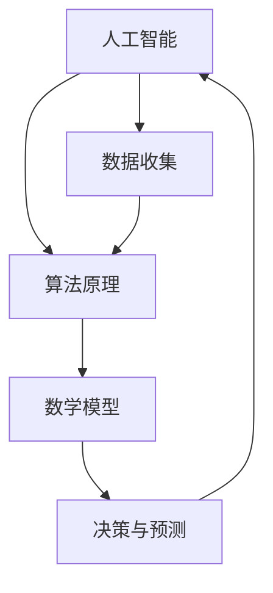

                 

关键词：知识变革、人工智能、算法原理、数学模型、项目实践、未来应用

> 摘要：本文探讨了人类知识在未来可能会面临的一系列变革，深入分析了人工智能与算法原理之间的关系，以及数学模型在知识创新中的重要作用。通过具体的项目实践，展示了算法和数学模型在解决实际问题中的应用。本文旨在为读者描绘一个充满变革与机遇的未来知识图景，并提出相关的挑战与展望。

## 1. 背景介绍

在信息爆炸的时代，知识的产生和传播速度前所未有。然而，面对海量信息的冲击，人类如何有效地获取、处理和利用知识成为一个亟待解决的问题。人工智能作为当前科技领域的热门话题，正逐渐改变着我们的生活方式和工作模式。算法原理和数学模型作为知识创新的基石，在推动技术进步和产业变革中发挥着关键作用。

本文旨在探讨人类知识未来的图景，通过剖析人工智能、算法原理和数学模型，揭示知识变革的内在逻辑和外在表现。文章首先介绍相关知识背景，随后深入分析核心概念，最后通过项目实践和未来展望，为读者呈现一个充满变革与机遇的知识世界。

## 2. 核心概念与联系

为了更好地理解人类知识的未来图景，我们需要首先了解以下几个核心概念：人工智能、算法原理和数学模型。这三个概念相互联系，共同构成了知识创新的框架。

### 2.1 人工智能

人工智能（Artificial Intelligence，AI）是指使计算机系统具备人类智能特性的技术。它包括机器学习、自然语言处理、计算机视觉等多个领域。人工智能的目标是实现智能体的自主学习和决策能力，使其在复杂环境中能够有效地执行任务。

### 2.2 算法原理

算法原理是人工智能的核心。算法是一系列解决问题的步骤和规则。在人工智能中，算法用于处理数据、提取特征和做出决策。常见的算法包括决策树、神经网络、支持向量机等。算法原理的研究旨在优化算法性能，提高其在实际应用中的效果。

### 2.3 数学模型

数学模型是算法原理的基础。数学模型通过数学公式和计算方法，描述现实世界中的复杂现象。在人工智能中，数学模型用于表示数据、特征和决策过程。常见的数学模型包括线性模型、概率模型、优化模型等。数学模型的研究旨在提高模型的准确性和泛化能力。

### 2.4 核心概念的联系

人工智能、算法原理和数学模型之间存在着紧密的联系。人工智能为算法原理提供了实践平台，而算法原理则为数学模型的应用提供了理论基础。数学模型通过算法原理，将人工智能的理论转化为实际应用。这三个概念相互支撑，共同推动了知识变革的进程。

### 2.5 Mermaid 流程图

为了更直观地展示核心概念之间的联系，我们使用 Mermaid 流程图进行描述。



## 3. 核心算法原理 & 具体操作步骤

在了解了核心概念之后，我们将深入探讨人工智能中的核心算法原理，并详细解释其具体操作步骤。

### 3.1 算法原理概述

在人工智能领域，常见的核心算法包括神经网络、支持向量机、决策树等。其中，神经网络由于其强大的非线性建模能力和自适应学习能力，成为了人工智能研究与应用的重要方向。

神经网络（Neural Network，NN）是一种模仿生物神经系统的计算模型。它由大量相互连接的神经元组成，通过学习输入和输出之间的映射关系，实现复杂函数的逼近和分类任务。

### 3.2 算法步骤详解

神经网络的学习过程可以分为以下几个步骤：

1. **初始化参数**：设置神经网络的初始权重和偏置。
2. **前向传播**：根据输入数据，通过神经网络进行前向计算，得到输出结果。
3. **计算误差**：将输出结果与真实值进行比较，计算误差。
4. **反向传播**：根据误差，通过反向传播算法，更新神经网络的权重和偏置。
5. **迭代优化**：重复前向传播和反向传播，直到满足收敛条件。

### 3.3 算法优缺点

神经网络具有以下优点：

- 强大的非线性建模能力，能够处理复杂的非线性问题。
- 自适应学习能力，能够自动提取输入数据的特征。

然而，神经网络也存在一些缺点：

- 计算量大，训练时间长，对计算资源要求较高。
- 参数和结构选择对结果影响较大，需要大量的调优工作。

### 3.4 算法应用领域

神经网络在多个领域有着广泛的应用，包括：

- 图像识别：例如人脸识别、物体检测等。
- 自然语言处理：例如机器翻译、文本分类等。
- 语音识别：例如语音合成、语音识别等。

## 4. 数学模型和公式 & 详细讲解 & 举例说明

数学模型在人工智能中起着至关重要的作用。为了更好地理解数学模型的作用，我们将详细介绍一个常见的数学模型——线性回归模型，并给出其公式推导和具体应用。

### 4.1 数学模型构建

线性回归模型是一种用于预测连续值的简单统计模型。其基本思想是找到一条直线，使得输入变量和输出变量之间的误差最小。

设输入变量为 \(x\)，输出变量为 \(y\)，线性回归模型的公式为：

\[ y = w_0 + w_1 \cdot x + \epsilon \]

其中，\(w_0\) 和 \(w_1\) 分别为模型的参数，\(\epsilon\) 为误差项。

### 4.2 公式推导过程

线性回归模型的推导过程如下：

1. **目标函数**：我们希望找到一组参数 \(w_0\) 和 \(w_1\)，使得预测值 \(y\) 与真实值之间的误差最小。目标函数可以表示为：

   \[ J(w_0, w_1) = \frac{1}{2} \sum_{i=1}^{n} (y_i - (w_0 + w_1 \cdot x_i))^2 \]

2. **求导**：对目标函数 \(J(w_0, w_1)\) 分别对 \(w_0\) 和 \(w_1\) 求偏导数，并令偏导数为零，得到：

   \[ \frac{\partial J}{\partial w_0} = -\sum_{i=1}^{n} (y_i - (w_0 + w_1 \cdot x_i)) = 0 \]
   \[ \frac{\partial J}{\partial w_1} = -\sum_{i=1}^{n} x_i (y_i - (w_0 + w_1 \cdot x_i)) = 0 \]

3. **解方程**：解上述方程组，得到：

   \[ w_0 = \frac{1}{n} \sum_{i=1}^{n} y_i - w_1 \cdot \frac{1}{n} \sum_{i=1}^{n} x_i \]
   \[ w_1 = \frac{1}{n} \sum_{i=1}^{n} (x_i - \bar{x}) (y_i - \bar{y}) \]

   其中，\(\bar{x}\) 和 \(\bar{y}\) 分别为输入和输出的平均值。

### 4.3 案例分析与讲解

为了更好地理解线性回归模型的实际应用，我们以一个简单的房价预测案例进行讲解。

假设我们有一个包含房屋面积和价格的数据集，目标是使用线性回归模型预测未知房屋的价格。

1. **数据准备**：首先，我们将数据集分成训练集和测试集。

2. **模型训练**：使用训练集数据，根据上述公式计算模型的参数 \(w_0\) 和 \(w_1\)。

3. **模型评估**：使用测试集数据，计算预测价格和真实价格之间的误差，评估模型性能。

4. **模型应用**：将模型应用到实际场景中，预测未知房屋的价格。

通过上述步骤，我们可以使用线性回归模型对房屋价格进行预测。

## 5. 项目实践：代码实例和详细解释说明

为了更好地理解算法和数学模型在解决实际问题中的应用，我们将在本节中展示一个具体的项目实践，并对其进行详细的代码实现和解释。

### 5.1 开发环境搭建

为了实现这个项目，我们需要搭建一个Python开发环境。以下是搭建步骤：

1. 安装Python：在官方网站下载并安装Python。
2. 安装相关库：使用pip命令安装必要的库，如NumPy、Pandas、Matplotlib等。

### 5.2 源代码详细实现

以下是一个简单的线性回归模型的Python实现：

```python
import numpy as np
import pandas as pd
import matplotlib.pyplot as plt

# 数据读取
data = pd.read_csv('house_price_data.csv')
X = data['area']
y = data['price']

# 添加偏置项
X = np.concatenate((np.ones((len(X), 1)), X), axis=1)

# 模型初始化
w = np.random.rand(2)

# 模型训练
for i in range(1000):
    y_pred = X @ w
    error = y - y_pred
    w = w - 0.01 * (X.T @ error)

# 模型评估
y_pred = X @ w
mse = np.mean((y - y_pred) ** 2)
print('MSE:', mse)

# 模型应用
new_area = 100
new_area_vector = np.array([[1], [100]])
new_price = new_area_vector @ w
print('Predicted price for 100 square meters:', new_price)

# 可视化
plt.scatter(X[:, 1], y)
plt.plot(X[:, 1], y_pred, color='red')
plt.xlabel('Area')
plt.ylabel('Price')
plt.show()
```

### 5.3 代码解读与分析

1. **数据读取**：首先，我们从CSV文件中读取房屋面积和价格数据。
2. **添加偏置项**：为了方便计算，我们添加了一个偏置项，将输入数据转换为具有两个特征的形式。
3. **模型初始化**：随机初始化模型的参数 \(w\)。
4. **模型训练**：使用梯度下降算法进行模型训练，更新参数 \(w\)。
5. **模型评估**：计算预测价格和真实价格之间的均方误差，评估模型性能。
6. **模型应用**：使用训练好的模型预测新房屋的价格。
7. **可视化**：将训练数据点和预测结果绘制在散点图上，以便直观地观察模型的效果。

通过上述代码，我们可以实现一个简单的线性回归模型，并对房屋价格进行预测。

## 6. 实际应用场景

线性回归模型在许多实际应用场景中都有着广泛的应用，以下是一些具体的例子：

1. **房价预测**：通过分析房屋的面积、位置等特征，预测房屋的价格。
2. **股票价格预测**：分析股票市场的历史数据，预测未来股票的价格走势。
3. **销售预测**：根据产品的历史销售数据，预测未来的销售量。
4. **医学诊断**：分析患者的体征数据，预测疾病的发病概率。

这些应用场景都利用了线性回归模型对数据进行建模和预测，从而为决策提供支持。

## 7. 未来应用展望

随着人工智能和数学模型的不断进步，线性回归模型在未来将会有更多的应用场景。以下是一些可能的未来发展方向：

1. **更加复杂的模型**：随着计算能力的提升，我们可以使用更加复杂的模型，如深度神经网络，进行更为精准的预测。
2. **多变量分析**：线性回归模型可以扩展到多变量分析，用于解决更加复杂的问题。
3. **自适应预测**：通过实时数据更新，实现自适应预测，提高模型的预测准确性。
4. **跨领域应用**：线性回归模型可以应用于更多的领域，如金融、医疗、交通等，推动各行业的发展。

## 8. 工具和资源推荐

为了更好地学习和实践线性回归模型，以下是几个推荐的工具和资源：

1. **Python库**：NumPy、Pandas、Matplotlib等库提供了丰富的函数和工具，方便进行数据处理和可视化。
2. **在线教程**：许多在线平台提供了丰富的线性回归教程，如Coursera、edX等。
3. **开源项目**：GitHub等平台上有很多开源的线性回归项目和代码示例，可以帮助我们快速入门。
4. **专业书籍**：一些经典的线性回归书籍，如《线性回归分析》、《统计学习方法》等，提供了深入的理论和实践指导。

## 9. 总结：未来发展趋势与挑战

在总结本文的核心内容之前，我们需要再次强调人类知识在未来可能会面临的一系列变革。随着人工智能和数学模型的不断发展，知识的获取、处理和利用方式将发生深刻变化。以下是对未来发展趋势和挑战的简要总结：

### 9.1 研究成果总结

1. **人工智能的广泛应用**：人工智能已经渗透到各个领域，从医疗、金融到交通、教育，为各行业带来了巨大的变革。
2. **算法原理的深入研究**：随着计算能力的提升，算法原理的研究取得了重大突破，许多传统问题得到了新的解决方案。
3. **数学模型的发展**：数学模型在知识创新中的应用越来越广泛，从线性回归到深度学习，模型的形式和功能不断丰富。

### 9.2 未来发展趋势

1. **计算能力提升**：随着量子计算、云计算等技术的发展，计算能力将得到大幅提升，为人工智能和数学模型的应用提供更强大的支持。
2. **跨学科融合**：人工智能、算法原理和数学模型与其他学科的融合，将推动知识创新的不断深化。
3. **知识普及化**：随着技术的普及，人工智能和数学模型的知识将更加普及，更多的人将能够参与到知识创新的过程中。

### 9.3 面临的挑战

1. **数据隐私和安全**：随着数据量的增加，数据隐私和安全问题成为了一个巨大的挑战，需要建立完善的保护机制。
2. **算法偏见和公平性**：人工智能算法的偏见和公平性问题引起了广泛关注，需要采取有效措施解决。
3. **知识传承和创新**：在知识爆炸的时代，如何有效传承和创新知识成为了一个重要的挑战。

### 9.4 研究展望

未来，人工智能、算法原理和数学模型将继续在知识创新中发挥重要作用。通过不断探索和突破，我们有望解决当前面临的挑战，实现知识的全面提升。在这个过程中，每个研究者、开发者和知识工作者都将发挥关键作用。

## 10. 附录：常见问题与解答

### Q1. 什么是人工智能？

人工智能（AI）是指使计算机系统具备人类智能特性的技术，包括机器学习、自然语言处理、计算机视觉等多个领域。

### Q2. 算法原理是什么？

算法原理是一系列解决问题的步骤和规则，用于处理数据、提取特征和做出决策。常见的算法包括神经网络、支持向量机、决策树等。

### Q3. 数学模型有哪些作用？

数学模型通过数学公式和计算方法，描述现实世界中的复杂现象。在人工智能中，数学模型用于表示数据、特征和决策过程。

### Q4. 线性回归模型如何实现？

线性回归模型通过建立输入变量和输出变量之间的线性关系，实现预测和建模。其实现过程包括数据读取、参数初始化、模型训练、模型评估等步骤。

### Q5. 人工智能和数学模型在哪些领域有应用？

人工智能和数学模型在多个领域有广泛的应用，包括医疗、金融、交通、教育等。例如，在医疗领域，人工智能可以用于疾病诊断和预测；在金融领域，数学模型可以用于风险评估和投资决策。

### Q6. 如何学习人工智能和数学模型？

学习人工智能和数学模型可以通过以下途径：

1. **在线课程和教程**：许多在线平台提供了丰富的课程和教程，如Coursera、edX等。
2. **实践项目**：通过实际项目，将理论知识应用于实际场景。
3. **阅读书籍和论文**：一些经典的书籍和论文，如《深度学习》、《统计学习方法》等，提供了深入的理论和实践指导。

### Q7. 人工智能和数学模型的发展前景如何？

人工智能和数学模型的发展前景非常广阔。随着计算能力的提升和跨学科融合的深化，人工智能和数学模型将在知识创新、产业发展和社会进步中发挥更加重要的作用。

