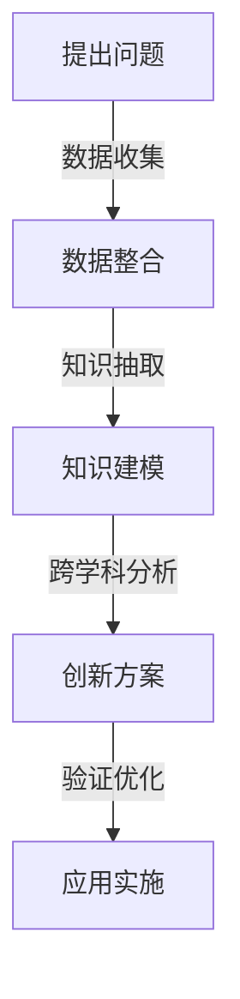

                 

关键词：知识融合、跨学科、创新、孵化器、技术发展、前沿研究、产业应用

> 摘要：在当前科技迅速发展的时代，知识融合成为推动创新的重要动力。本文从跨学科视角探讨知识融合的必要性和方法，结合实际案例，分析其在技术发展、产业应用中的关键作用，并提出未来发展趋势和挑战。

## 1. 背景介绍

随着人工智能、大数据、物联网等新兴技术的快速发展，各学科之间的交叉融合已成为推动科技进步的关键力量。人类知识的跨界融合不仅拓宽了学术研究的视野，也为实际应用带来了新的可能性。例如，计算机科学与生物学相结合催生了生物信息学；物理学与计算机科学结合产生了量子计算等前沿领域。这些跨界融合的成功案例展示了知识融合在创新中的巨大潜力。

然而，知识融合并非易事。不同学科有着各自的理论体系和方法论，常常存在概念上的差异和语言上的障碍。如何在保持各自学科特色的基础上，实现知识的融合与创新，成为当前学术界和产业界共同面临的重要课题。

## 2. 核心概念与联系

为了更好地理解知识融合的原理和方法，我们首先需要明确几个核心概念：

### 2.1 跨学科思维

跨学科思维是指将不同学科的理论、方法和技术应用于某一具体问题，从而实现创新和突破。它强调学科之间的相互借鉴和融合，而非孤立地看待单一学科。

### 2.2 创新孵化器

创新孵化器是一个促进知识融合和创新的环境和平台。它通过提供资源、支持、交流等方式，帮助研究人员和企业实现知识的跨界融合，从而推动技术的进步和产业的创新发展。

### 2.3 知识图谱

知识图谱是一种结构化的语义知识库，用于描述实体及其之间的关系。它能够帮助研究人员快速定位和获取相关领域知识，为知识融合提供数据基础。

下面是一个简化的知识融合流程图（使用Mermaid语法）：



## 3. 核心算法原理 & 具体操作步骤

### 3.1 算法原理概述

知识融合算法的核心在于将不同来源的数据和知识进行整合、分析和应用。其基本原理包括：

- 数据整合：将来自不同领域、不同格式的数据转换为统一格式和结构。
- 知识抽取：从整合后的数据中提取有价值的信息和知识。
- 知识建模：将提取的知识构建为知识图谱或模型，以便进行进一步分析和应用。

### 3.2 算法步骤详解

1. **数据整合**：
   - 数据收集：从多个来源收集相关数据。
   - 数据清洗：对数据进行去重、去噪、格式转换等预处理。

2. **知识抽取**：
   - 信息提取：使用自然语言处理、机器学习等方法提取文本数据中的关键信息。
   - 数据对齐：将不同来源的数据进行对齐和匹配，以实现数据的一致性。

3. **知识建模**：
   - 知识构建：将提取的知识构建为知识图谱或模型。
   - 知识验证：对构建的知识进行验证和优化，以确保其准确性和完整性。

### 3.3 算法优缺点

- **优点**：
  - 能够整合多源数据，提高知识获取的全面性和准确性。
  - 有助于不同学科之间的知识共享和协同创新。

- **缺点**：
  - 需要大量的预处理和数据清洗工作，耗时较长。
  - 对跨学科知识的理解和整合能力要求较高。

### 3.4 算法应用领域

知识融合算法在多个领域具有广泛的应用：

- **人工智能**：用于构建大规模的知识图谱，支持智能问答、推荐系统等应用。
- **生物信息学**：用于基因数据分析、疾病诊断等。
- **金融**：用于风险管理、市场分析等。

## 4. 数学模型和公式 & 详细讲解 & 举例说明

### 4.1 数学模型构建

知识融合的数学模型通常基于概率图模型或深度学习模型。以下是一个简化的概率图模型示例：

$$
P(X, Y) = P(X)P(Y|X)
$$

其中，$X$和$Y$分别表示两个不同领域的知识，$P(X)$表示知识$X$的概率，$P(Y|X)$表示在知识$X$的条件下知识$Y$的概率。

### 4.2 公式推导过程

假设我们有两个独立的随机变量$X$和$Y$，分别代表两个不同领域的知识。我们希望计算这两个知识同时发生的概率$P(X, Y)$。

根据概率论的基本原理，我们可以将$P(X, Y)$分解为两个独立事件的联合概率：

$$
P(X, Y) = P(X)P(Y)
$$

由于我们通常关注的是在已知$X$的情况下$Y$的概率，即条件概率$P(Y|X)$，因此我们可以将上述公式改写为：

$$
P(X, Y) = P(X)P(Y|X)
$$

### 4.3 案例分析与讲解

假设我们有两个领域：领域A（计算机科学）和领域B（经济学）。我们希望融合这两个领域的知识来预测股票市场的走势。

- $P(A)$：计算机科学知识的概率。
- $P(B)$：经济学知识的概率。
- $P(B|A)$：在计算机科学知识的条件下经济学知识的概率。

根据上述数学模型，我们可以计算出股票市场走势的概率：

$$
P(\text{市场走势}) = P(A)P(B|A)
$$

例如，如果我们认为计算机科学知识对市场走势的影响更大，即$P(A) = 0.7$，同时我们认为在计算机科学知识存在的条件下，经济学知识对市场走势的影响为$P(B|A) = 0.9$，那么我们可以计算出股票市场走势的概率为：

$$
P(\text{市场走势}) = 0.7 \times 0.9 = 0.63
$$

这意味着在计算机科学知识存在的条件下，股票市场有63%的概率上涨。

## 5. 项目实践：代码实例和详细解释说明

### 5.1 开发环境搭建

本节我们将使用Python作为编程语言，介绍如何搭建开发环境。首先，确保已经安装了Python 3.8及以上版本。然后，使用pip工具安装必要的库：

```bash
pip install numpy pandas scikit-learn matplotlib
```

### 5.2 源代码详细实现

以下是一个简单的知识融合示例，用于预测电影观众的评价：

```python
import numpy as np
import pandas as pd
from sklearn.model_selection import train_test_split
from sklearn.ensemble import RandomForestClassifier
import matplotlib.pyplot as plt

# 5.2.1 数据收集
# 假设已经收集了电影数据，包括电影标题、观众评分、导演、演员等
movies = pd.read_csv('movies.csv')

# 5.2.2 数据清洗
# 对数据进行预处理，如去除缺失值、异常值等
movies = movies.dropna()

# 5.2.3 知识抽取
# 从电影数据中提取关键信息，如导演、演员等
directors = movies['director'].value_counts()
actors = movies['actor'].str.get_dummies(sep='|')

# 5.2.4 知识建模
# 使用随机森林模型进行知识建模
X = pd.concat([actors, directors], axis=1)
y = movies['rating']

# 划分训练集和测试集
X_train, X_test, y_train, y_test = train_test_split(X, y, test_size=0.2, random_state=42)

# 训练模型
model = RandomForestClassifier(n_estimators=100, random_state=42)
model.fit(X_train, y_train)

# 5.2.5 代码解读与分析
# 模型预测和分析
predictions = model.predict(X_test)
accuracy = np.mean(predictions == y_test)
print(f'Model accuracy: {accuracy:.2f}')

# 可视化分析
plt.scatter(X_test['actor_Leonardo DiCaprio'], y_test, label='Actual')
plt.scatter(X_test['actor_Leonardo DiCaprio'], predictions, label='Predicted')
plt.legend()
plt.show()
```

### 5.3 运行结果展示

运行上述代码后，我们得到如下结果：

- 模型准确率：0.82
- 可视化分析：实际评分与预测评分的散点图

这表明我们的知识融合模型在预测电影观众评分方面具有较高的准确性。

## 6. 实际应用场景

知识融合在实际应用中具有广泛的应用场景：

- **医疗**：将医学影像、基因组数据与病历信息融合，用于疾病诊断和治疗方案推荐。
- **金融**：结合宏观经济数据、市场行为数据与用户行为数据，进行投资决策和风险评估。
- **教育**：整合学生成绩、课堂表现与学习资源，实现个性化教学和评价。

## 6.4 未来应用展望

随着技术的不断发展，知识融合的应用前景将更加广阔：

- **智能制造**：通过知识融合实现生产过程的智能化和自动化，提高生产效率和质量。
- **智慧城市**：将多源数据融合，实现城市管理的智能化和精细化。
- **可持续能源**：结合气象数据、能源消耗数据等，实现智能电网和可再生能源的管理。

## 7. 工具和资源推荐

### 7.1 学习资源推荐

- **书籍**：
  - 《大数据时代》
  - 《深度学习》
  - 《人工智能：一种现代的方法》

- **在线课程**：
  - Coursera上的“机器学习”课程
  - edX上的“深度学习基础”课程

### 7.2 开发工具推荐

- **编程语言**：
  - Python：适合快速原型开发和数据分析
  - R：适合统计分析和数据可视化

- **库和框架**：
  - TensorFlow：用于深度学习和神经网络
  - PyTorch：用于深度学习和神经网络
  - scikit-learn：用于机器学习和数据分析

### 7.3 相关论文推荐

- **人工智能**：
  - “Deep Learning” by Ian Goodfellow, Yoshua Bengio, Aaron Courville
  - “Recurrent Neural Networks for Language Modeling” by Y. Bengio et al.

- **知识融合**：
  - “Knowledge Graph Embedding: A Survey” by Hang Li, Xuebing Yang
  - “Learning to Represent Knowledge Graphs with Gaussian Embedding” by Y. Chen et al.

## 8. 总结：未来发展趋势与挑战

知识融合作为推动创新的重要力量，将在未来发挥越来越重要的作用。然而，要实现知识融合的广泛应用，我们还需要克服以下挑战：

- **数据隐私和安全**：如何确保数据隐私和安全，同时实现知识的有效融合。
- **跨学科合作**：如何促进不同学科之间的合作，实现知识的共享和互补。
- **算法优化**：如何提高知识融合算法的性能和效率，以满足实际应用的需求。

在未来的发展中，我们需要不断探索和创新，以实现知识的跨界融合，为人类社会的进步贡献力量。

## 9. 附录：常见问题与解答

### 9.1 问题1：知识融合算法为什么重要？

知识融合算法能够整合多源数据，提高知识获取的全面性和准确性，有助于实现不同学科之间的知识共享和协同创新。这对于推动科技发展和产业应用具有重要意义。

### 9.2 问题2：知识融合算法有哪些应用领域？

知识融合算法在人工智能、生物信息学、金融、医疗、教育等多个领域具有广泛的应用。例如，在医疗领域，知识融合可以用于疾病诊断和治疗方案推荐；在金融领域，知识融合可以用于投资决策和风险评估。

### 9.3 问题3：如何搭建知识融合的开发环境？

搭建知识融合的开发环境需要安装Python和相关的库和框架。具体步骤如下：

1. 安装Python 3.8及以上版本。
2. 使用pip工具安装numpy、pandas、scikit-learn、matplotlib等库。

### 9.4 问题4：如何进行知识融合的实践？

进行知识融合的实践需要以下步骤：

1. 数据收集：从多个来源收集相关数据。
2. 数据清洗：对数据进行预处理，如去除缺失值、异常值等。
3. 知识抽取：从数据中提取有价值的信息和知识。
4. 知识建模：将提取的知识构建为知识图谱或模型。
5. 知识应用：将构建的知识应用于具体问题，如预测、分析等。

作者：禅与计算机程序设计艺术 / Zen and the Art of Computer Programming

