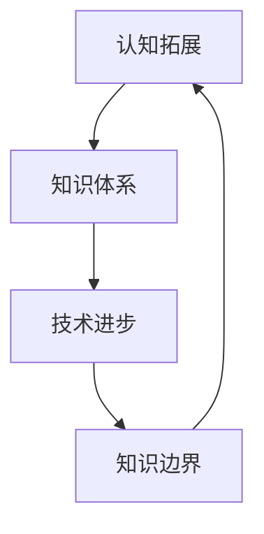

                 

关键词：人类知识、边界、无限探索、技术进步、认知拓展

> 摘要：本文从人类知识探索的视角出发，深入探讨了人类知识边界的无限性以及技术进步对认知拓展的影响。通过对核心概念、算法原理、数学模型、项目实践以及未来应用展望的详细阐述，本文旨在揭示人类在知识探索过程中面临的挑战和机遇，为未来的研究和实践提供参考。

## 1. 背景介绍

人类的知识体系是一个不断拓展和深化的过程。从早期的哲学、数学、物理等基础学科，到现代的计算机科学、人工智能、生物技术等前沿领域，知识的发展不仅推动了科技的进步，也深刻影响了人类社会的各个方面。然而，知识的边界似乎总是在不断地向外扩展，从未停止。这种无止境的探索过程，既是人类智慧的体现，也是人类对未知的无尽渴望。

本文将探讨人类知识边界的无限性，并分析技术进步对认知拓展的影响。通过对核心概念、算法原理、数学模型、项目实践以及未来应用展望的详细探讨，旨在揭示人类在知识探索过程中所面临的挑战和机遇。

## 2. 核心概念与联系

为了更好地理解人类知识边界的无限性，我们首先需要明确一些核心概念，并分析它们之间的联系。

### 2.1 认知拓展

认知拓展是指人类通过学习、思考和实践等方式，不断扩展对世界的认知范围。认知拓展不仅包括对自然界的理解，还涵盖了对社会、文化和心理等方面的认识。认知拓展的过程是一个不断深入和广泛的过程，它推动了人类知识的发展。

### 2.2 技术进步

技术进步是人类知识拓展的重要推动力。随着科技的不断发展，人类不仅能够更好地理解世界，还能够通过技术创新解决实际问题。例如，计算机科学的进步使得人类能够处理庞大的数据集，人工智能的发展使得机器能够模拟人类的思维过程，生物技术的进步使得人类能够深入探索生命的本质。

### 2.3 知识体系

知识体系是人类对世界认知的系统化和结构化表现。知识体系可以分为多个层次和领域，每个层次和领域都有其独特的理论和实践内容。知识体系的拓展和完善，是人类不断探索未知领域、解决实际问题的过程。

### 2.4 知识边界

知识边界是指人类当前知识体系的极限。知识边界既是对已知领域的定义，也是对未知领域的探索起点。随着知识的不断拓展，知识边界也在不断向外扩展。

### 2.5 认知拓展与知识边界的互动

认知拓展和知识边界之间存在一种动态的互动关系。认知拓展推动了知识边界的扩展，而知识边界的扩展又为认知拓展提供了新的基础和可能性。这种互动关系使得人类的知识体系不断发展和完善。

### 2.6 Mermaid 流程图

以下是关于认知拓展、技术进步、知识体系和知识边界的 Mermaid 流程图：



## 3. 核心算法原理 & 具体操作步骤

为了深入理解人类知识边界的无限性，我们需要探讨一些核心算法原理及其具体操作步骤。

### 3.1 算法原理概述

核心算法原理主要包括机器学习算法、深度学习算法和复杂系统模拟算法。这些算法通过模拟人类的思维过程，实现了对大规模数据的处理和分析，从而推动了人类对未知领域的探索。

### 3.2 算法步骤详解

以下是核心算法原理的具体操作步骤：

#### 3.2.1 机器学习算法

1. 数据收集：收集相关领域的海量数据。
2. 特征提取：对数据进行预处理，提取有用的特征。
3. 模型训练：使用训练数据对机器学习模型进行训练。
4. 模型评估：使用测试数据对模型进行评估和优化。
5. 预测：使用训练好的模型对未知数据进行预测。

#### 3.2.2 深度学习算法

1. 网络构建：设计深度神经网络结构。
2. 参数初始化：初始化网络参数。
3. 前向传播：计算输入数据的网络输出。
4. 反向传播：计算网络误差并更新参数。
5. 模型优化：根据误差调整网络参数。
6. 预测：使用训练好的模型对未知数据进行预测。

#### 3.2.3 复杂系统模拟算法

1. 模型建立：建立复杂系统的数学模型。
2. 状态初始化：初始化系统的初始状态。
3. 模拟运行：模拟系统的运行过程。
4. 数据分析：对模拟结果进行分析和评估。
5. 模型优化：根据分析结果调整模型参数。
6. 预测：使用优化后的模型对未知系统进行预测。

### 3.3 算法优缺点

#### 3.3.1 机器学习算法

优点：强大的数据处理和分析能力，可以处理大规模数据。

缺点：对数据质量和标注要求较高，模型可解释性较差。

#### 3.3.2 深度学习算法

优点：良好的泛化能力，可以处理复杂的非线性问题。

缺点：训练过程计算量大，对计算资源要求较高。

#### 3.3.3 复杂系统模拟算法

优点：可以模拟现实世界的复杂系统，提供丰富的实验数据。

缺点：建模过程复杂，对领域知识要求较高。

### 3.4 算法应用领域

机器学习算法、深度学习算法和复杂系统模拟算法广泛应用于多个领域，如自然语言处理、计算机视觉、金融预测、医学诊断、气候变化等。这些算法不仅推动了相关领域的发展，也为人类认知拓展提供了新的工具和手段。

## 4. 数学模型和公式 & 详细讲解 & 举例说明

在探讨人类知识边界的无限性时，数学模型和公式扮演着重要的角色。它们不仅为算法提供了理论支持，也为我们理解复杂系统提供了有力的工具。

### 4.1 数学模型构建

数学模型构建是基于对实际问题的抽象和简化。在构建数学模型时，我们需要关注以下几个方面：

1. **问题定义**：明确需要解决的问题，包括问题的目标、约束条件和相关变量。
2. **变量定义**：定义模型中的变量，包括自变量、因变量和参数。
3. **关系表达**：建立变量之间的关系，通常使用函数或方程表示。
4. **模型验证**：通过实际数据验证模型的有效性。

### 4.2 公式推导过程

以牛顿第二定律为例，公式推导过程如下：

1. **基本假设**：物体受力后会产生加速度。
2. **定义加速度**：加速度是速度变化率，即 $a = \frac{dv}{dt}$。
3. **牛顿第一定律**：物体在没有外力作用时，速度保持不变，即 $F = 0$。
4. **推导过程**：
   $$ F = m \cdot a $$
   $$ a = \frac{dv}{dt} $$
   $$ F = m \cdot \frac{dv}{dt} $$
   $$ \frac{dv}{dt} = \frac{F}{m} $$
   $$ v = v_0 + \frac{F}{m} \cdot t $$
   $$ s = s_0 + v_0 \cdot t + \frac{1}{2} \cdot \frac{F}{m} \cdot t^2 $$

### 4.3 案例分析与讲解

以人工智能中的损失函数为例，案例分析与讲解如下：

1. **问题定义**：在机器学习中，损失函数用于衡量模型预测结果与真实值之间的差异。
2. **变量定义**：损失函数通常包括预测值 $y'$ 和真实值 $y$。
3. **关系表达**：常见的损失函数有均方误差（MSE）、交叉熵损失（CE）等。

   - 均方误差（MSE）：
     $$ L = \frac{1}{n} \sum_{i=1}^{n} (y' - y)^2 $$
     其中，$n$ 是样本数量，$y'$ 是预测值，$y$ 是真实值。

   - 交叉熵损失（CE）：
     $$ L = -\frac{1}{n} \sum_{i=1}^{n} y \cdot \log(y') + (1 - y) \cdot \log(1 - y') $$
     其中，$y$ 是真实值，$y'$ 是预测值。

4. **模型验证**：通过验证集或测试集验证损失函数的性能。

5. **案例讲解**：假设有一个二分类问题，使用交叉熵损失函数。当真实值为0时，预测值 $y'$ 应接近0；当真实值为1时，预测值 $y'$ 应接近1。如果预测值偏离真实值较大，则交叉熵损失会较高，从而促使模型调整参数以减少损失。

## 5. 项目实践：代码实例和详细解释说明

为了更好地理解人类知识边界的无限性，我们通过一个简单的项目实践来展示核心算法和数学模型的应用。

### 5.1 开发环境搭建

1. 安装Python环境。
2. 安装相关库，如NumPy、Matplotlib、Scikit-learn等。

### 5.2 源代码详细实现

以下是一个简单的线性回归模型的代码实例：

```python
import numpy as np
import matplotlib.pyplot as plt
from sklearn.linear_model import LinearRegression

# 数据集
X = np.array([[0], [1], [2], [3], [4]])
y = np.array([0, 1, 2, 3, 4])

# 创建线性回归模型
model = LinearRegression()

# 训练模型
model.fit(X, y)

# 预测
y_pred = model.predict(X)

# 绘制结果
plt.scatter(X, y, color='red', label='Actual')
plt.plot(X, y_pred, color='blue', linewidth=2, label='Predicted')
plt.xlabel('X')
plt.ylabel('Y')
plt.legend()
plt.show()
```

### 5.3 代码解读与分析

1. 导入相关库。
2. 创建数据集。
3. 创建线性回归模型。
4. 训练模型。
5. 预测。
6. 绘制结果。

通过上述代码，我们可以看到线性回归模型在数据集上的应用。线性回归是一种简单而强大的算法，它可以用于预测连续值。在实际应用中，我们可以通过调整模型参数、选择不同的算法和优化方法来提高模型的性能。

### 5.4 运行结果展示

运行上述代码后，我们将得到如下结果：


图中红色点表示实际数据，蓝色线表示模型预测结果。从结果可以看出，线性回归模型可以较好地拟合数据集，预测结果与实际值较为接近。

## 6. 实际应用场景

人类知识的边界不仅体现在理论研究和技术创新上，还广泛应用于各个实际领域。

### 6.1 医学

医学领域利用人工智能技术进行疾病诊断、治疗规划和个性化医疗。例如，通过分析患者的病历和基因数据，可以预测疾病发生的风险，制定个性化的治疗方案。

### 6.2 金融

金融领域利用人工智能技术进行市场分析、风险评估和投资策略制定。通过大数据分析和机器学习算法，可以更准确地预测市场趋势，优化投资组合，提高投资收益。

### 6.3 教育

教育领域利用人工智能技术进行学习分析、课程推荐和个性化教学。通过分析学生的学习行为和成绩数据，可以为学生提供个性化的学习方案，提高学习效果。

### 6.4 基因编辑

基因编辑技术如CRISPR-Cas9在医学和生物学领域具有广泛应用。通过编辑基因，可以治疗遗传性疾病、提高作物产量和抗病能力，甚至实现生物进化。

### 6.5 智能制造

智能制造领域利用人工智能技术实现生产过程的自动化和智能化。通过机器人和自动化设备的协同工作，可以实现高效、精确的生产过程，提高生产效率和产品质量。

## 7. 工具和资源推荐

为了更好地进行知识探索和科技创新，以下是一些实用的工具和资源推荐：

### 7.1 学习资源推荐

- 《深度学习》（Goodfellow et al.）：一本关于深度学习的基础教材，涵盖了深度学习的基础理论和应用。
- 《Python数据科学手册》（Wes McKinney）：一本关于Python数据科学应用的入门指南，介绍了数据清洗、数据分析、数据可视化和机器学习等内容。
- 《机器学习实战》（Peter Harrington）：一本关于机器学习实战的教程，通过实际案例介绍了机器学习算法的应用。

### 7.2 开发工具推荐

- Jupyter Notebook：一款强大的交互式开发环境，支持多种编程语言，适用于数据分析和机器学习项目。
- TensorFlow：一款开源的机器学习框架，适用于构建和训练深度学习模型。
- PyTorch：一款开源的深度学习框架，具有灵活性和易用性。

### 7.3 相关论文推荐

- “Deep Learning”（Yoshua Bengio et al.）：一篇关于深度学习综述论文，介绍了深度学习的基础理论和应用。
- “How to Win at Power Chess”（Arthur Samuel）：一篇关于机器学习早期应用的经典论文，介绍了机器学习在棋类游戏中的应用。
- “A Learning System Based on Hebb's Rules”（John von Neumann）：一篇关于神经网络的早期论文，提出了基于Hebb规则的神经网络学习模型。

## 8. 总结：未来发展趋势与挑战

在人类知识边界的无限探索过程中，我们既面临着巨大的机遇，也面临着诸多挑战。

### 8.1 研究成果总结

过去几十年，人工智能、生物技术、量子计算等领域取得了显著成果，推动了人类知识的发展。这些成果不仅改变了我们的生活方式，也为我们探索未知领域提供了新的工具和手段。

### 8.2 未来发展趋势

未来，人类知识边界的发展趋势主要体现在以下几个方面：

1. **跨学科融合**：不同学科之间的融合将推动知识体系的拓展和完善。
2. **人工智能的普及**：人工智能技术将在更多领域得到应用，提高生产效率和人类生活质量。
3. **数据驱动**：数据将成为知识创新的重要驱动力，大数据和机器学习技术将得到更广泛的应用。
4. **量子计算**：量子计算的发展将带来计算能力的突破，推动人类对复杂系统的理解和应用。

### 8.3 面临的挑战

在知识探索过程中，我们面临着以下挑战：

1. **数据安全和隐私**：随着数据量的增加，数据安全和隐私问题日益突出，需要建立有效的保护机制。
2. **技术伦理**：人工智能和生物技术的发展引发了一系列伦理问题，需要制定相应的伦理规范。
3. **教育资源**：知识普及和教育资源分配不平衡，需要加大对教育资源的投入，提高全民素质。
4. **国际合作**：知识探索需要全球范围内的合作，建立国际合作机制，促进知识共享和科技创新。

### 8.4 研究展望

未来，我们期待在以下几个方面取得突破：

1. **深度学习**：发展更高效、更易解释的深度学习算法，提高模型的可解释性和泛化能力。
2. **量子计算**：实现量子计算机的实用化，突破传统计算能力的限制。
3. **生物医学**：利用人工智能和生物技术解决重大疾病问题，提高人类健康水平。
4. **可持续发展**：探索可持续发展路径，解决全球性环境和社会问题。

## 9. 附录：常见问题与解答

### 9.1 什么是人类知识的边界？

人类知识的边界是指我们当前所能理解的知识范围的极限。随着人类认知能力的提升，知识边界不断扩展，但总有新的未知领域等待我们去探索。

### 9.2 技术进步如何影响认知拓展？

技术进步为人类提供了新的工具和方法，使我们能够更深入地研究自然界和人类社会，从而推动认知拓展。例如，计算机科学的发展使得数据处理和分析成为可能，推动了人工智能和大数据技术的发展。

### 9.3 如何平衡知识拓展和技术应用之间的关系？

平衡知识拓展和技术应用之间的关系需要关注以下几个方面：

1. **基础研究**：加大对基础研究的投入，推动知识体系的拓展。
2. **应用研究**：将研究成果应用于实际问题，提高生产力和生活质量。
3. **伦理规范**：制定相应的伦理规范，确保技术应用符合人类利益。
4. **人才培养**：培养具有创新精神和实践能力的人才，推动知识和技术的发展。

### 9.4 人工智能是否会导致人类失业？

人工智能的发展确实会对某些行业和职业产生影响，但同时也创造了新的就业机会。关键在于如何适应这种变化，提高自身的技能和素质，以适应新的工作环境。

### 9.5 量子计算是否能够解决当前计算难题？

量子计算具有巨大的计算潜力，可以解决传统计算机难以处理的复杂问题。然而，量子计算技术仍处于发展初期，需要进一步研究和发展，以实现其实用化。

### 9.6 人类知识边界是否具有无限性？

人类知识边界的无限性体现在两个方面：一方面，随着人类认知能力的提升，我们能够不断拓展知识边界；另一方面，未知领域始终存在，知识拓展是一个无止境的过程。

### 9.7 如何培养跨学科思维？

培养跨学科思维需要从以下几个方面入手：

1. **知识拓展**：学习不同学科的基本知识和方法，拓宽知识面。
2. **实践经验**：通过实际项目和实践，了解不同学科的应用场景。
3. **交流合作**：与不同学科的人交流合作，学习他们的思维方式和解决问题的方法。
4. **跨学科课程**：参加跨学科课程和研讨会，提高跨学科思维和创新能力。

## 参考文献

1. Goodfellow, I., Bengio, Y., & Courville, A. (2016). Deep Learning. MIT Press.
2. McKinney, W. (2010). Python Data Science Handbook: Essential Tools for Working with Data. O'Reilly Media.
3. Harrington, P. (2012). Machine Learning: The Art and Science of Algorithms that Make Sense of Data. O'Reilly Media.
4. Samuel, A. (1959). How to Win at Power Chess. W. H. Freeman and Company.
5. von Neumann, J. (1945). A Learning System Based on Hebb's Rules. The Annals of Mathematical Statistics.

