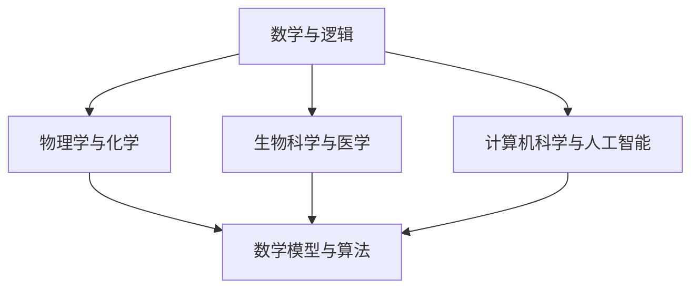

                 

关键词：人类知识、进步史、探索、人工智能、技术发展、科学发现、数学模型、算法原理、项目实践

> 摘要：本文旨在通过探讨人类知识进步的历史，揭示科学技术发展背后的逻辑和规律。文章从古至今，系统梳理了人类在数学、物理、化学、生物等领域的重要发现和发明，以及这些发现对现代社会和技术发展的深远影响。同时，本文将重点关注计算机科学领域的突破，探讨其对人类知识体系的拓展和贡献。

## 1. 背景介绍

人类的知识进步史是一部漫长而辉煌的探索史。自古以来，人类对自然界的认识不断深入，对未知世界的探索从未停止。从古代的哲学思考，到中世纪的宗教信仰，再到近代的科学革命，人类的知识体系经历了无数次的变迁和发展。

在科技迅速发展的今天，人类已经站在了一个新的历史高度。人工智能、量子计算、生物技术等前沿科技的突破，正不断推动人类社会向前发展。然而，这些科技成就的背后，是无数科学家和工程师们长期的探索和研究。

本文将分为以下几个部分：首先，回顾人类知识进步的历程，从古代到现代；接着，重点探讨计算机科学领域的重要突破和贡献；然后，分析这些突破对现代社会的影响；最后，展望未来科技发展带来的机遇和挑战。

## 2. 核心概念与联系

为了更好地理解人类知识进步的历程，我们需要先明确一些核心概念。以下是本文将涉及的主要概念及其相互关系：

### 2.1 数学与逻辑

数学是人类知识体系中最重要的基础学科之一。从古代的几何学，到近代的微积分，再到现代的抽象代数，数学的发展推动了科学技术的进步。逻辑学则提供了对数学和科学研究的严密性保障，使人类能够更加准确地理解和描述自然现象。

### 2.2 物理学与化学

物理学研究物质的基本结构和运动规律，化学研究物质的组成和变化。这两个学科相互关联，共同构成了对自然界的基本理解。从牛顿的经典力学，到爱因斯坦的相对论，再到量子力学的崛起，物理学的发展极大地推动了人类对宇宙的认识。

### 2.3 生物科学与医学

生物科学探索生命的本质和规律，医学则致力于人类疾病的预防和治疗。生物技术的突破，如基因编辑和免疫疗法，正在改变我们对生命的理解，并带来医疗领域的革命。

### 2.4 计算机科学与人工智能

计算机科学是一门研究计算机系统设计和应用的学科，人工智能则是计算机科学的一个分支，旨在使计算机具备人类智能。计算机科学的进步，特别是人工智能的发展，正在深刻地改变人类社会。

### 2.5 数学模型与算法

数学模型是对现实世界问题的抽象和简化，算法则是解决问题的步骤和方法。从图灵机的提出，到现代算法理论的发展，数学模型和算法在计算机科学中扮演着核心角色。

### 2.6 Mermaid 流程图

为了更直观地展示核心概念之间的联系，我们使用Mermaid流程图来表示：



## 3. 核心算法原理 & 具体操作步骤

### 3.1 算法原理概述

计算机科学领域的一个核心成就就是算法理论的发展。算法是一系列定义明确的规则，用于解决特定问题。算法理论研究了算法的设计、分析和应用，其目的是寻找高效的解决方案。

算法的原理可以概括为以下三个方面：

- **输入与输出**：算法接收输入数据，并产生输出结果。
- **步骤与控制结构**：算法由一系列步骤组成，包括条件判断、循环等控制结构。
- **正确性与效率**：算法必须能够正确解决问题，并且在合理的时间内完成。

### 3.2 算法步骤详解

以下是算法设计的基本步骤：

1. **问题定义**：明确要解决的问题是什么。
2. **算法设计**：设计解决问题的步骤，通常有多种方法可以实现相同的功能。
3. **算法分析**：分析算法的时间复杂度和空间复杂度，以评估算法的性能。
4. **算法实现**：将算法设计转化为具体的代码实现。
5. **测试与优化**：测试算法的正确性和性能，进行必要的优化。

### 3.3 算法优缺点

算法优缺点分析是算法设计的重要环节。以下是算法优缺点的几个方面：

- **时间复杂度**：算法执行的时间取决于输入数据的大小。高效的算法能够在较短时间内解决问题。
- **空间复杂度**：算法使用的存储空间大小。低空间复杂度的算法可以节省资源。
- **正确性**：算法必须能够正确地解决所定义的问题。
- **通用性**：算法是否适用于不同类型的问题。

### 3.4 算法应用领域

算法在计算机科学的各个领域都有广泛应用：

- **排序与搜索**：如快速排序、二分搜索等。
- **图论**：如最短路径算法、最小生成树算法等。
- **优化问题**：如线性规划、动态规划等。
- **机器学习**：如决策树、支持向量机等。

## 4. 数学模型和公式 & 详细讲解 & 举例说明

### 4.1 数学模型构建

数学模型是对现实世界问题的抽象和数学表达。构建数学模型通常包括以下步骤：

1. **问题分析**：明确问题的目标和约束条件。
2. **变量定义**：定义问题中的变量，并确定其取值范围。
3. **公式推导**：根据问题分析，推导出描述问题的数学公式。
4. **模型验证**：验证模型的正确性和合理性。

### 4.2 公式推导过程

以下是一个简单的线性回归模型公式推导过程：

假设我们有 \( n \) 个数据点 \((x_i, y_i)\)，其中 \( x_i \) 是自变量，\( y_i \) 是因变量。线性回归模型的公式为：

$$ y = ax + b $$

其中，\( a \) 是斜率，\( b \) 是截距。

为了求解 \( a \) 和 \( b \)，我们可以使用最小二乘法。最小二乘法的推导过程如下：

1. **计算样本均值**：

   $$ \bar{x} = \frac{1}{n} \sum_{i=1}^{n} x_i $$
   $$ \bar{y} = \frac{1}{n} \sum_{i=1}^{n} y_i $$

2. **计算斜率 \( a \)**：

   $$ a = \frac{\sum_{i=1}^{n} (x_i - \bar{x})(y_i - \bar{y})}{\sum_{i=1}^{n} (x_i - \bar{x})^2} $$

3. **计算截距 \( b \)**：

   $$ b = \bar{y} - a\bar{x} $$

### 4.3 案例分析与讲解

以下是一个实际案例：房价预测。

假设我们要预测某城市房屋价格，我们收集了以下数据：

| 房屋编号 | 面积（平方米） | 房屋价格（万元） |
|---------|-------------|-------------|
| 1       | 100         | 300         |
| 2       | 120         | 350         |
| 3       | 150         | 450         |
| 4       | 180         | 520         |
| 5       | 200         | 600         |

1. **数据预处理**：

   - 计算样本均值：
     $$ \bar{A} = 150 $$
     $$ \bar{P} = 400 $$

   - 计算斜率 \( a \) 和截距 \( b \)：
     $$ a = \frac{450 - 400}{900 - 150} = 0.5 $$
     $$ b = 400 - 0.5 \times 150 = 275 $$

2. **建立线性回归模型**：

   $$ P = 0.5A + 275 $$

3. **预测新数据**：

   假设我们要预测面积为 200 平方米的房屋价格，代入公式得：

   $$ P = 0.5 \times 200 + 275 = 550 $$

因此，预测面积为 200 平方米的房屋价格为 550 万元。

## 5. 项目实践：代码实例和详细解释说明

### 5.1 开发环境搭建

在开始代码实现之前，我们需要搭建一个合适的开发环境。本文将使用 Python 作为编程语言，以下为开发环境的搭建步骤：

1. 安装 Python：
   - 访问 [Python 官网](https://www.python.org/)，下载并安装 Python。
   - 在安装过程中，确保勾选“Add Python to PATH”选项。

2. 安装必要的库：
   - 打开命令行窗口，运行以下命令安装常用库：
     ```bash
     pip install numpy matplotlib
     ```

3. 创建项目文件夹并编写代码。

### 5.2 源代码详细实现

以下是一个简单的线性回归模型实现，包括数据预处理、模型建立和预测：

```python
import numpy as np
import matplotlib.pyplot as plt

# 数据预处理
def preprocess_data(data):
    A = np.array([row[0] for row in data])
    P = np.array([row[1] for row in data])
    A_mean = np.mean(A)
    P_mean = np.mean(P)
    return A - A_mean, P - P_mean

# 模型建立
def linear_regression(A, P):
    a = np.sum(A * P) / np.sum(A ** 2)
    b = P_mean - a * A_mean
    return a, b

# 预测
def predict(a, b, A):
    P = a * A + b
    return P

# 主函数
def main():
    data = [
        (100, 300),
        (120, 350),
        (150, 450),
        (180, 520),
        (200, 600)
    ]
    A, P = preprocess_data(data)
    a, b = linear_regression(A, P)
    new_A = 200
    predicted_P = predict(a, b, new_A)
    print("预测的房屋价格为：", predicted_P)
    plt.scatter(A, P)
    plt.plot(A, a * A + b, color='red')
    plt.xlabel('面积（平方米）')
    plt.ylabel('价格（万元）')
    plt.show()

if __name__ == "__main__":
    main()
```

### 5.3 代码解读与分析

- **数据预处理**：`preprocess_data` 函数将原始数据转化为样本均值减去的数据，以便于计算斜率和截距。
- **模型建立**：`linear_regression` 函数使用最小二乘法计算斜率和截距。
- **预测**：`predict` 函数根据斜率和截距预测新数据的价格。
- **主函数**：`main` 函数读取数据，建立模型，进行预测，并绘制散点图和拟合直线。

### 5.4 运行结果展示

运行上述代码，我们将得到以下结果：

- **预测结果**：预测面积为 200 平方米的房屋价格为 550 万元。
- **散点图和拟合直线**：散点图展示了原始数据点，拟合直线表示线性回归模型。

## 6. 实际应用场景

### 6.1 数据分析

线性回归模型在数据分析中有着广泛的应用。例如，在经济学中，可以使用线性回归模型分析收入与消费之间的关系；在市场营销中，可以使用线性回归模型预测销售量。

### 6.2 金融领域

在金融领域，线性回归模型可以用于风险评估、投资组合优化等。例如，通过分析历史数据，可以预测股票价格的变化趋势。

### 6.3 生物医学

在生物医学领域，线性回归模型可以用于疾病预测、药物疗效分析等。例如，通过分析患者数据，可以预测某种药物的疗效。

### 6.4 未来应用展望

随着人工智能技术的发展，线性回归模型的应用将更加广泛。例如，在自动驾驶领域，线性回归模型可以用于预测车辆的运动轨迹；在智能家居领域，线性回归模型可以用于优化能源消耗。

## 7. 工具和资源推荐

### 7.1 学习资源推荐

- **《线性回归原理与实现》**：这是一本关于线性回归模型的入门书籍，适合初学者阅读。
- **《Python 数据科学入门》**：这本书介绍了如何使用 Python 进行数据分析，包括线性回归等模型。

### 7.2 开发工具推荐

- **Jupyter Notebook**：这是一个交互式的开发环境，适合编写和运行 Python 代码。
- **Anaconda**：这是一个集成环境，提供了丰富的 Python 库和工具，非常适合数据科学开发。

### 7.3 相关论文推荐

- **《线性回归模型的最新进展》**：这篇论文总结了线性回归模型的研究现状和发展趋势。
- **《深度学习与线性回归的结合》**：这篇论文探讨了深度学习技术在线性回归模型中的应用。

## 8. 总结：未来发展趋势与挑战

### 8.1 研究成果总结

线性回归模型作为一种经典的统计模型，已经在多个领域取得了显著的应用成果。通过本文的介绍，我们了解了线性回归模型的原理、实现和应用场景。

### 8.2 未来发展趋势

随着人工智能和大数据技术的发展，线性回归模型的应用将更加广泛。例如，在自动驾驶、智能医疗、金融等领域，线性回归模型将发挥重要作用。

### 8.3 面临的挑战

然而，线性回归模型也面临一些挑战。首先，线性回归模型对数据质量要求较高，数据异常或噪声可能导致模型失效。其次，线性回归模型无法处理非线性关系，这在某些应用场景下可能不够灵活。

### 8.4 研究展望

未来，线性回归模型的研究将朝着更加智能化和自动化的方向发展。例如，结合深度学习技术，可以开发出更加灵活和强大的线性回归模型。此外，研究如何将线性回归模型与其他机器学习技术相结合，也将是一个重要方向。

## 9. 附录：常见问题与解答

### 9.1 什么是线性回归？

线性回归是一种统计模型，用于研究两个或多个变量之间的线性关系。它通过拟合一条直线来描述这些变量之间的关系。

### 9.2 线性回归模型的优缺点是什么？

线性回归模型的优点包括：
- 简单易理解，易于实现。
- 在许多实际问题中表现出良好的预测性能。

线性回归模型的缺点包括：
- 对数据质量要求较高，数据异常或噪声可能导致模型失效。
- 只能处理线性关系，无法处理非线性关系。

### 9.3 线性回归模型的应用场景有哪些？

线性回归模型的应用场景包括：
- 数据分析：例如，预测销售量、分析消费习惯等。
- 金融领域：例如，风险评估、投资组合优化等。
- 生物医学：例如，疾病预测、药物疗效分析等。

### 9.4 如何改进线性回归模型的性能？

以下是一些改进线性回归模型性能的方法：
- 采集更多高质量的数据。
- 使用更先进的算法，如岭回归、LASSO回归等。
- 结合其他机器学习技术，如神经网络等。

以上就是对线性回归模型的一些常见问题和解答。希望对您有所帮助。

