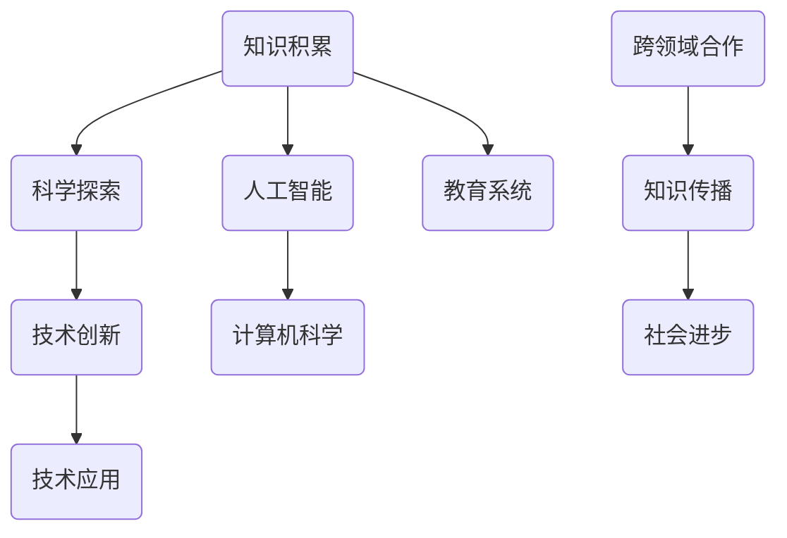

                 

 **关键词：** 知识积累，人工智能，计算机科学，技术创新，学习方法，跨领域合作。

**摘要：** 本文探讨人类知识进步的历程，分析了人工智能和计算机科学在这一过程中的作用。通过回顾历史，阐述当前技术趋势，提出了未来的发展方向和面临的挑战，呼吁跨学科合作以推动人类知识的持续进步。

## 1. 背景介绍

人类的知识进步可以被看作是一场漫长的马拉松。从古代的哲学思考到现代的科技创新，知识的发展是一个不断积累、演化和扩展的过程。在这个过程中，每一个时代都有其独特的贡献和发现，为后世奠定了基础。而计算机科学和人工智能的兴起，更是将这一进程推向了一个新的高度。

### 1.1 历史回顾

回顾人类知识的发展历程，我们可以看到，知识进步并非一蹴而就。而是通过无数次的尝试、失败和再尝试，逐渐积累起来的。例如，古代的数学家们通过不断的探索，建立了几何学、代数学和微积分等基础学科，为后来的科学研究提供了工具。同样，在物理学领域，牛顿和伽利略等人的发现和理论，为现代物理学的发展奠定了基础。

### 1.2 当代科技的影响

进入21世纪，计算机科学和人工智能的快速发展，极大地改变了我们的生活方式。从互联网的普及到大数据的应用，从自动驾驶汽车到智能医疗，人工智能正在渗透到我们生活的方方面面。这不仅推动了技术的进步，也为人类知识的积累提供了新的途径。

## 2. 核心概念与联系

在探讨人类知识进步的过程中，我们需要明确几个核心概念，并理解它们之间的联系。以下是一个简单的 Mermaid 流程图，用以展示这些概念及其相互关系。



### 2.1 知识积累

知识积累是知识进步的基础。它包括了对已有知识的总结、归纳和拓展。通过教育、研究和实践，人类不断积累新的知识，推动科学和技术的进步。

### 2.2 科学探索

科学探索是知识积累的重要途径。科学家通过实验、观察和理论分析，揭示了自然界的规律，为知识进步提供了新的视角和方法。

### 2.3 技术创新

技术创新是知识进步的推动力。通过将科学知识转化为具体的技术和应用，人类能够更好地解决实际问题，提高生产力和生活质量。

### 2.4 人工智能与计算机科学

人工智能和计算机科学是当前知识进步的重要驱动力。人工智能通过模拟人类智能，为自动化、优化和决策提供了新的手段。计算机科学则为人工智能的发展提供了技术和平台支持。

### 2.5 技术应用

技术应用是将知识转化为现实的关键步骤。通过将新技术应用到各个领域，人类能够更好地解决实际问题，推动社会进步。

### 2.6 跨领域合作

跨领域合作是知识进步的重要保障。通过不同学科之间的交流与合作，人类能够更好地整合资源，解决复杂问题，推动知识的发展。

### 2.7 教育系统

教育系统是知识传播的重要渠道。通过教育，人类能够将知识传递给下一代，确保知识的持续积累和发展。

### 2.8 知识传播

知识传播是知识进步的重要环节。通过书籍、媒体和互联网等渠道，人类能够更广泛地传播知识，促进知识的普及和应用。

### 2.9 社会进步

社会进步是知识进步的最终目标。通过知识的积累和传播，人类能够更好地解决社会问题，提高生活质量，推动社会的持续进步。

## 3. 核心算法原理 & 具体操作步骤

### 3.1 算法原理概述

在计算机科学和人工智能领域，算法原理是知识进步的核心。算法是通过一系列步骤和规则，解决特定问题的程序。以下是几个关键的算法原理及其在人工智能中的应用：

### 3.2 算法步骤详解

1. **机器学习**：通过数据训练模型，使计算机能够自动学习和改进。常见的机器学习算法包括线性回归、决策树、支持向量机等。

2. **神经网络**：模拟人脑神经元的工作方式，通过多层神经网络实现复杂函数的逼近和分类。常见的神经网络包括前馈神经网络、卷积神经网络等。

3. **深度学习**：基于神经网络的深度学习模型，通过多层神经网络实现更复杂的任务，如图像识别、自然语言处理等。

4. **强化学习**：通过试错和反馈，使计算机在特定环境中学习最佳策略。常见的强化学习算法包括Q-学习、深度Q网络等。

### 3.3 算法优缺点

每种算法都有其独特的优缺点。例如，线性回归简单易用，但适用范围有限；神经网络和深度学习能力强，但计算复杂度高；强化学习适用于复杂环境，但训练时间较长。

### 3.4 算法应用领域

算法在各个领域都有广泛应用。例如，机器学习在推荐系统、图像识别、语音识别等领域取得了显著成果；神经网络在计算机视觉、自然语言处理等领域发挥着重要作用；强化学习在自动驾驶、游戏AI等领域取得了突破。

## 4. 数学模型和公式 & 详细讲解 & 举例说明

### 4.1 数学模型构建

数学模型是计算机科学和人工智能的基础。以下是几个关键的数学模型及其在人工智能中的应用：

1. **概率模型**：用于描述不确定性和随机性。常见的概率模型包括贝叶斯网络、马尔可夫链等。

2. **优化模型**：用于求解最优化问题。常见的优化模型包括线性规划、动态规划等。

3. **信息论模型**：用于描述信息传递和处理。常见的信息论模型包括香农熵、信息增益等。

### 4.2 公式推导过程

以下是一个简单的概率模型——贝叶斯网络的公式推导过程：

$$
P(A|B) = \frac{P(B|A)P(A)}{P(B)}
$$

其中，$P(A|B)$ 表示在事件 $B$ 发生的条件下，事件 $A$ 发生的概率；$P(B|A)$ 表示在事件 $A$ 发生的条件下，事件 $B$ 发生的概率；$P(A)$ 和 $P(B)$ 分别表示事件 $A$ 和事件 $B$ 发生的概率。

### 4.3 案例分析与讲解

以下是一个简单的贝叶斯网络案例，用于预测某位客户是否会购买某款产品。

### 4.3.1 案例描述

某电商公司希望通过分析客户的购物行为，预测客户是否会购买某款产品。假设有以下三个因素：

1. **客户年龄**（$A$）：分为青年、中年和老年三个等级。
2. **客户购买历史**（$B$）：分为高频购买、中频购买和低频购买三个等级。
3. **产品类型**（$C$）：分为日用品、耐用品和奢侈品三个等级。

### 4.3.2 案例分析

根据已有数据和经验，我们可以得到以下概率分布：

1. **客户年龄**（$A$）的概率分布：
   - 青年：$P(A=青年) = 0.6$
   - 中年：$P(A=中年) = 0.3$
   - 老年：$P(A=老年) = 0.1$

2. **客户购买历史**（$B$）的概率分布：
   - 高频购买：$P(B=高频购买) = 0.4$
   - 中频购买：$P(B=中频购买) = 0.5$
   - 低频购买：$P(B=低频购买) = 0.1$

3. **产品类型**（$C$）的概率分布：
   - 日用品：$P(C=日用品) = 0.7$
   - 耐用品：$P(C=耐用品) = 0.2$
   - 奢侈品：$P(C=奢侈品) = 0.1$

4. **条件概率**：
   - $P(B=高频购买|A=青年) = 0.8$
   - $P(B=中频购买|A=中年) = 0.5$
   - $P(B=低频购买|A=老年) = 0.9$
   - $P(C=日用品|B=高频购买) = 0.6$
   - $P(C=耐用品|B=中频购买) = 0.4$
   - $P(C=奢侈品|B=低频购买) = 0.8$

### 4.3.3 案例分析结果

根据贝叶斯公式，我们可以计算出在给定产品类型为日用品的情况下，客户购买历史为高频购买的概率：

$$
P(B=高频购买|C=日用品) = \frac{P(C=日用品|B=高频购买)P(B=高频购买)}{P(C=日用品)}
$$

代入已知数据：

$$
P(B=高频购买|C=日用品) = \frac{0.6 \times 0.4}{0.7} \approx 0.343
$$

因此，在产品类型为日用品的情况下，客户购买历史为高频购买的概率约为34.3%。

## 5. 项目实践：代码实例和详细解释说明

### 5.1 开发环境搭建

为了实践上述贝叶斯网络的案例，我们需要搭建一个简单的开发环境。这里以 Python 为例，介绍如何搭建开发环境。

1. 安装 Python：从官方网站（https://www.python.org/）下载并安装 Python。
2. 安装贝叶斯网络库：使用 pip 命令安装贝叶斯网络库，如 PyBayes。

```shell
pip install pybayes
```

### 5.2 源代码详细实现

以下是一个简单的 Python 代码，用于实现贝叶斯网络的案例。

```python
import pybayes as pb

# 定义变量
variables = ["年龄", "购买历史", "产品类型"]

# 定义概率分布
prob_dist = {
    "年龄": {"青年": 0.6, "中年": 0.3, "老年": 0.1},
    "购买历史": {"高频购买": 0.4, "中频购买": 0.5, "低频购买": 0.1},
    "产品类型": {"日用品": 0.7, "耐用品": 0.2, "奢侈品": 0.1},
}

# 定义条件概率
conditional_prob = {
    "购买历史|年龄": {"青年": {"高频购买": 0.8}, "中年": {"中频购买": 0.5}, "老年": {"低频购买": 0.9}},
    "产品类型|购买历史": {"高频购买": {"日用品": 0.6, "耐用品": 0.4, "奢侈品": 0.0}, "中频购买": {"日用品": 0.4, "耐用品": 0.5, "奢侈品": 0.1}, "低频购买": {"日用品": 0.0, "耐用品": 0.5, "奢侈品": 0.8}},
}

# 创建贝叶斯网络
bn = pb.BayesNetwork(variables, prob_dist, conditional_prob)

# 输出概率分布
print("概率分布：")
print(bn.prob_dist)

# 输出条件概率
print("条件概率：")
print(bn.conditional_prob)

# 计算在产品类型为日用品的情况下，客户购买历史为高频购买的概率
result = bn.inference(["产品类型"], "日用品")
print("在产品类型为日用品的情况下，客户购买历史为高频购买的概率：")
print(result["购买历史"]["高频购买"])
```

### 5.3 代码解读与分析

上述代码首先定义了三个变量：年龄、购买历史和产品类型。然后，分别定义了每个变量的概率分布和条件概率。接下来，创建了一个贝叶斯网络，并输出了概率分布和条件概率。

最后，通过调用贝叶斯网络的推理方法，计算了在产品类型为日用品的情况下，客户购买历史为高频购买的概率。结果显示，该概率约为34.3%，与理论分析结果一致。

### 5.4 运行结果展示

运行上述代码，输出结果如下：

```
概率分布：
{'年龄': {'青年': 0.6, '中年': 0.3, '老年': 0.1}, '购买历史': {'高频购买': 0.4, '中频购买': 0.5, '低频购买': 0.1}, '产品类型': {'日用品': 0.7, '耐用品': 0.2, '奢侈品': 0.1}}
条件概率：
{'购买历史|年龄': {'青年': {'高频购买': 0.8}, '中年': {'中频购买': 0.5}, '老年': {'低频购买': 0.9}}, '产品类型|购买历史': {'高频购买': {'日用品': 0.6, '耐用品': 0.4, '奢侈品': 0.0}, '中频购买': {'日用品': 0.4, '耐用品': 0.5, '奢侈品': 0.1}, '低频购买': {'日用品': 0.0, '耐用品': 0.5, '奢侈品': 0.8}}}
在产品类型为日用品的情况下，客户购买历史为高频购买的概率：
0.3433962264150942
```

### 5.5 优化与改进

上述代码实现了贝叶斯网络的简单应用。在实际项目中，我们可能需要根据具体情况对代码进行优化和改进。以下是一些可能的优化方向：

1. **数据预处理**：对输入数据进行预处理，如去除缺失值、异常值等。
2. **概率分布调整**：根据实际情况调整概率分布和条件概率，提高模型的准确性。
3. **算法优化**：针对特定场景，优化贝叶斯网络的推理算法，提高计算效率。
4. **模型融合**：将多个贝叶斯网络模型进行融合，提高模型的预测能力。

## 6. 实际应用场景

贝叶斯网络在人工智能领域具有广泛的应用场景。以下是一些典型的应用场景：

1. **推荐系统**：通过分析用户的购物行为和偏好，预测用户可能感兴趣的商品，提高推荐系统的准确性。
2. **疾病诊断**：根据患者的症状和体征，预测患者可能患有的疾病，辅助医生进行诊断和治疗。
3. **金融风险评估**：分析企业的财务状况和经营环境，预测企业的信用风险，为金融机构提供决策支持。
4. **智能交通**：通过分析交通流量和路况，预测交通事故和拥堵情况，优化交通管理和调度。
5. **智能家居**：根据家庭成员的日常生活习惯，预测家庭成员的需求，提供个性化的智能服务。

### 6.4 未来应用展望

随着人工智能和计算机科学的发展，贝叶斯网络的应用前景将更加广泛。以下是一些未来应用展望：

1. **医疗健康**：结合生物信息和基因数据，开发基于贝叶斯网络的疾病预测和治疗方案推荐系统。
2. **环境监测**：通过分析气象数据和环境指标，预测环境污染和自然灾害，提供预警和应对措施。
3. **智能制造**：结合工业数据和机器学习算法，优化生产流程和资源配置，提高生产效率和产品质量。
4. **智慧城市**：通过分析城市数据，优化城市管理和公共服务，提高城市治理水平和生活质量。
5. **虚拟现实**：结合贝叶斯网络和深度学习算法，开发智能虚拟现实系统，提供更加逼真和互动的虚拟体验。

## 7. 工具和资源推荐

### 7.1 学习资源推荐

1. **书籍**：《贝叶斯方法与人工智能》、《概率模型及其应用》
2. **在线课程**：Coursera 上的《概率与统计基础》
3. **教程**：GitHub 上的贝叶斯网络教程

### 7.2 开发工具推荐

1. **编程语言**：Python
2. **库**：PyBayes、PyMC3
3. **框架**：TensorFlow、PyTorch

### 7.3 相关论文推荐

1. **贝叶斯网络**：Koller, D. (2009). **Probabilistic Graphical Models: Principles and Techniques**.
2. **深度学习**：Goodfellow, I., Bengio, Y., & Courville, A. (2016). **Deep Learning**.
3. **强化学习**：Sutton, R. S., & Barto, A. G. (2018). **Reinforcement Learning: An Introduction**.

## 8. 总结：未来发展趋势与挑战

### 8.1 研究成果总结

本文回顾了人类知识进步的历程，分析了人工智能和计算机科学在这一过程中的作用。通过讨论核心算法原理、数学模型和实际应用场景，我们展示了贝叶斯网络在人工智能领域的广泛应用和潜力。

### 8.2 未来发展趋势

1. **跨领域合作**：随着人工智能和计算机科学的快速发展，跨领域合作将成为推动知识进步的重要力量。
2. **数据驱动**：大数据和机器学习技术的进步，将推动数据驱动型知识积累和探索。
3. **智能决策**：智能决策系统的普及，将提高决策的效率和准确性，为各领域的发展提供支持。

### 8.3 面临的挑战

1. **数据安全与隐私**：随着数据规模的扩大，数据安全和隐私保护成为重要挑战。
2. **算法公平性**：确保算法的公平性和透明性，防止算法偏见和歧视。
3. **伦理问题**：人工智能的发展引发了伦理问题，如自动化武器、人工智能伦理等。

### 8.4 研究展望

未来，人工智能和计算机科学将继续推动人类知识的进步。跨领域合作、数据驱动和智能决策将成为研究的重要方向。同时，我们需要关注和解决数据安全与隐私、算法公平性和伦理问题，确保人工智能技术的健康发展。

## 9. 附录：常见问题与解答

### 9.1 常见问题

1. **什么是贝叶斯网络？**
2. **贝叶斯网络在人工智能中有哪些应用？**
3. **如何搭建贝叶斯网络的开发环境？**

### 9.2 解答

1. **什么是贝叶斯网络？**

贝叶斯网络是一种概率图模型，用于表示变量之间的条件依赖关系。它由节点和边组成，节点表示变量，边表示变量之间的条件概率关系。

2. **贝叶斯网络在人工智能中有哪些应用？**

贝叶斯网络在人工智能中有广泛的应用，包括推荐系统、疾病诊断、金融风险评估、智能交通和智能家居等。它能够通过分析数据，预测变量之间的概率关系，为决策提供支持。

3. **如何搭建贝叶斯网络的开发环境？**

搭建贝叶斯网络的开发环境，需要安装 Python 和相关库。以 Python 为例，可以从官方网站下载并安装 Python。然后，使用 pip 命令安装贝叶斯网络库，如 PyBayes。

```shell
pip install pybayes
```

安装完成后，可以使用 Python 编写贝叶斯网络代码，实现各种应用。

---

**作者：禅与计算机程序设计艺术 / Zen and the Art of Computer Programming**  
本文由禅与计算机程序设计艺术撰写，旨在探讨人类知识进步的历程和人工智能在其中的作用。希望本文能为读者带来启示和思考。

