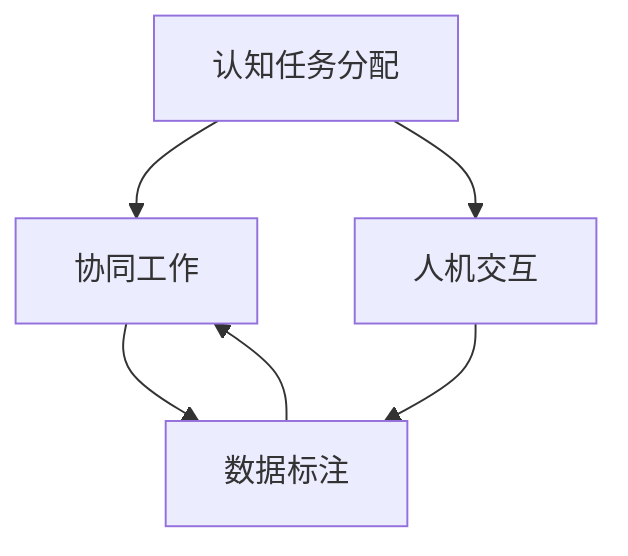
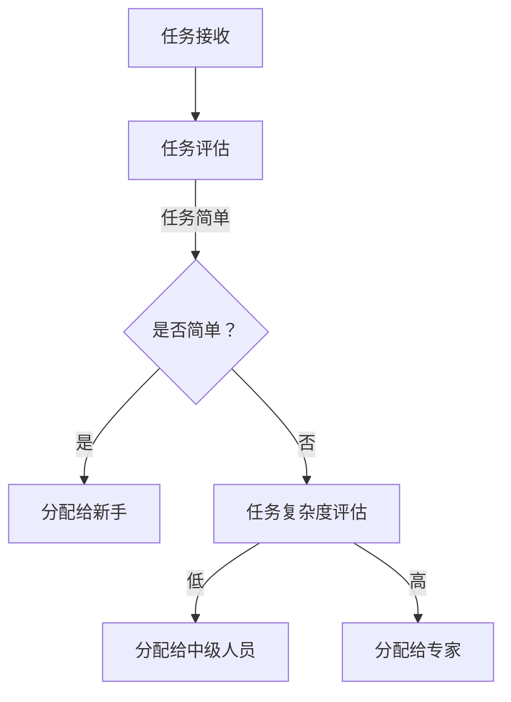
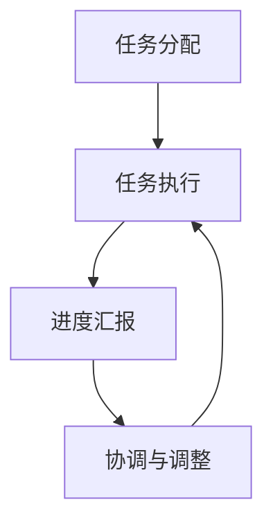
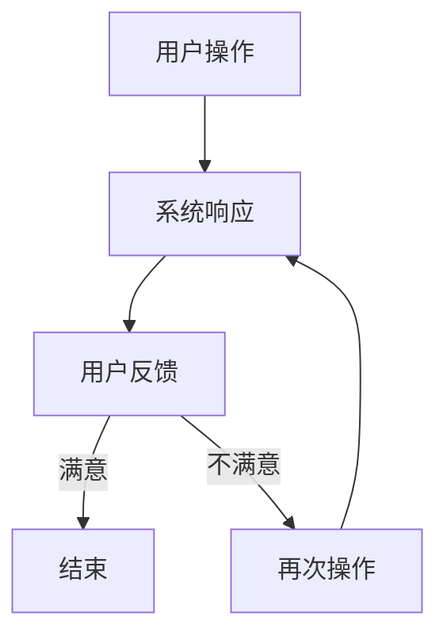
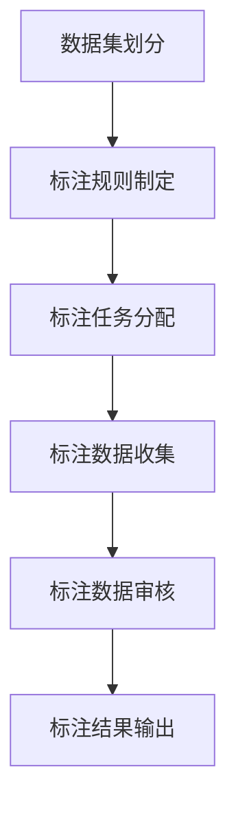

                 

关键词：人类计算，应用案例分析，人工智能，计算理论，计算优化，算法分析，数学模型，编程实践

> 摘要：本文从人类计算的角度出发，对各类应用案例进行了深入分析。通过探讨人类计算的核心概念、算法原理、数学模型以及实际应用，本文旨在揭示人类计算在现代社会中的重要作用，并展望其未来的发展趋势与挑战。

## 1. 背景介绍

人类计算（Human Computation）是一种利用人类智慧和认知能力来解决复杂问题的方法。与传统的机器计算（Machine Computation）不同，人类计算强调人类的判断力、创造力以及经验在解决问题中的作用。随着人工智能和大数据技术的快速发展，人类计算的应用领域日益广泛，涉及图像识别、自然语言处理、智能推荐、城市规划等多个方面。

本文将从以下几个方面展开讨论：

- **核心概念与联系**：介绍人类计算的基本概念，并使用Mermaid流程图展示其核心原理和架构。
- **核心算法原理与具体操作步骤**：分析人类计算中的主要算法，并详细阐述其原理和操作步骤。
- **数学模型与公式**：介绍人类计算中常用的数学模型和公式，并进行详细讲解和举例说明。
- **项目实践**：通过代码实例，展示如何在实际项目中应用人类计算方法。
- **实际应用场景**：探讨人类计算在不同领域中的具体应用案例。
- **工具和资源推荐**：推荐相关学习资源、开发工具和学术论文。
- **总结与展望**：总结研究成果，展望人类计算的未来发展趋势和面临的挑战。

## 2. 核心概念与联系

人类计算的核心概念包括：认知任务分配、协同工作、人机交互、数据标注等。以下是一个简化的Mermaid流程图，展示这些概念之间的联系：



- **认知任务分配**：根据个体能力和任务需求，将复杂任务分配给合适的个体。
- **协同工作**：通过个体之间的合作，共同完成复杂任务。
- **人机交互**：利用人工智能技术，提高人类与机器的协作效率。
- **数据标注**：为机器学习模型提供高质量的数据集，以便进行训练和优化。

### 2.1 认知任务分配

认知任务分配是确保任务能够高效完成的关键环节。在这一过程中，需要考虑个体能力的多样性、任务的复杂性和任务的优先级等因素。以下是一个简化的认知任务分配流程：



### 2.2 协同工作

协同工作是多个个体共同完成复杂任务的过程。在这一过程中，需要充分利用每个人的优势，实现资源的优化配置。以下是一个简化的协同工作流程：



### 2.3 人机交互

人机交互是提高人类与机器协作效率的重要手段。在这一过程中，需要设计友好的用户界面，提供智能化的辅助功能。以下是一个简化的人机交互流程：



### 2.4 数据标注

数据标注是为机器学习模型提供高质量数据集的关键步骤。在这一过程中，需要确保标注数据的准确性和一致性。以下是一个简化的数据标注流程：



## 3. 核心算法原理与具体操作步骤

### 3.1 算法原理概述

人类计算中的核心算法主要包括：协作过滤、深度学习、强化学习等。以下分别对这些算法进行简要概述。

#### 协作过滤

协作过滤（Collaborative Filtering）是一种基于用户历史行为和相似性度量的推荐算法。其主要目标是预测用户对未知物品的兴趣。

- **用户相似性度量**：通过计算用户之间的相似性，找到相似的用户群体。
- **物品相似性度量**：通过计算物品之间的相似性，为用户推荐相似物品。

#### 深度学习

深度学习（Deep Learning）是一种基于多层神经网络的学习方法。其主要目标是自动提取数据中的特征。

- **神经网络结构**：通过堆叠多个隐含层，实现复杂特征的提取。
- **反向传播算法**：通过反向传播算法，更新网络参数，优化模型性能。

#### 强化学习

强化学习（Reinforcement Learning）是一种基于试错和反馈的学习方法。其主要目标是找到最优策略，使Agent能够在环境中获得最大收益。

- **状态-动作价值函数**：通过评估状态和动作的价值，选择最优动作。
- **策略迭代**：通过迭代更新策略，逐渐找到最优策略。

### 3.2 算法步骤详解

#### 协作过滤

协作过滤的步骤如下：

1. **用户历史行为收集**：收集用户的历史行为数据，如购买记录、评价等。
2. **用户相似性计算**：计算用户之间的相似性，可以使用欧氏距离、余弦相似性等方法。
3. **物品相似性计算**：计算物品之间的相似性，可以使用基于内容的相似性计算、基于用户评分的相似性计算等方法。
4. **推荐结果生成**：根据用户相似性和物品相似性，为用户生成推荐列表。

#### 深度学习

深度学习的步骤如下：

1. **数据处理**：对输入数据进行预处理，如归一化、编码等。
2. **网络结构设计**：设计合适的神经网络结构，包括输入层、隐含层和输出层。
3. **参数初始化**：初始化网络参数，可以使用随机初始化、预训练等方法。
4. **训练过程**：通过反向传播算法，更新网络参数，优化模型性能。
5. **模型评估**：使用验证集或测试集评估模型性能，如准确率、召回率等。

#### 强化学习

强化学习的步骤如下：

1. **环境搭建**：构建模拟环境，包括状态空间、动作空间和奖励机制。
2. **策略初始化**：初始化策略，可以使用随机策略、ε-贪心策略等方法。
3. **训练过程**：通过试错和反馈，不断更新策略，优化性能。
4. **策略评估**：评估策略的性能，如平均奖励、最大奖励等。

### 3.3 算法优缺点

#### 协作过滤

- **优点**：利用用户历史行为和相似性度量，为用户提供个性化的推荐。
- **缺点**：受限于用户数据质量和相似性度量的准确性，推荐效果可能受限。

#### 深度学习

- **优点**：自动提取数据中的特征，提高模型性能。
- **缺点**：对计算资源和数据质量要求较高，训练过程可能较慢。

#### 强化学习

- **优点**：能够自主学习，适应动态变化的环境。
- **缺点**：训练过程可能较复杂，需要对环境有充分的了解。

### 3.4 算法应用领域

#### 协作过滤

- **推荐系统**：在电子商务、新闻推送、社交网络等领域，基于用户历史行为和相似性度量，为用户提供个性化推荐。

#### 深度学习

- **计算机视觉**：在图像识别、目标检测、图像生成等领域，基于深度学习模型，实现自动化图像处理。
- **自然语言处理**：在文本分类、机器翻译、情感分析等领域，基于深度学习模型，实现自动化文本分析。

#### 强化学习

- **自动驾驶**：在自动驾驶领域，基于强化学习模型，实现自动驾驶车辆对复杂环境的适应。
- **游戏开发**：在游戏开发领域，基于强化学习模型，实现智能代理的自主游戏。

## 4. 数学模型与公式

### 4.1 数学模型构建

人类计算中的数学模型主要包括：线性模型、非线性模型、概率模型等。以下分别对这些模型进行简要介绍。

#### 线性模型

线性模型是一种最简单的数学模型，其基本形式为：

$$y = \beta_0 + \beta_1x_1 + \beta_2x_2 + ... + \beta_nx_n$$

其中，$y$ 是目标变量，$x_1, x_2, ..., x_n$ 是输入变量，$\beta_0, \beta_1, \beta_2, ..., \beta_n$ 是模型参数。

#### 非线性模型

非线性模型通过引入非线性函数，能够更好地拟合复杂的数据分布。常见的非线性模型包括：

- **多项式模型**：

$$y = \beta_0 + \beta_1x_1 + \beta_2x_2^2 + ... + \beta_nx_n^n$$

- **指数模型**：

$$y = \beta_0 + \beta_1e^{\beta_2x_1} + \beta_3e^{\beta_4x_2} + ... + \beta_ne^{\beta_6x_n}$$

#### 概率模型

概率模型通过描述随机变量的概率分布，能够更好地反映数据的随机性。常见的概率模型包括：

- **正态分布**：

$$P(X \leq x) = \int_{-\infty}^{x} \frac{1}{\sqrt{2\pi}\sigma} e^{-\frac{(x-\mu)^2}{2\sigma^2}} dx$$

- **伯努利分布**：

$$P(X = x) = p^x(1-p)^{1-x}$$

### 4.2 公式推导过程

以下以线性回归模型为例，介绍数学公式的推导过程。

#### 步骤 1：模型假设

假设我们有一个线性回归模型，其形式为：

$$y = \beta_0 + \beta_1x_1 + \beta_2x_2 + ... + \beta_nx_n + \epsilon$$

其中，$y$ 是目标变量，$x_1, x_2, ..., x_n$ 是输入变量，$\beta_0, \beta_1, \beta_2, ..., \beta_n$ 是模型参数，$\epsilon$ 是误差项。

#### 步骤 2：损失函数

为了衡量模型拟合的好坏，我们引入损失函数，通常使用均方误差（MSE）：

$$J(\beta) = \frac{1}{2}\sum_{i=1}^{n}(y_i - \beta_0 - \beta_1x_{i1} - \beta_2x_{i2} - ... - \beta_nx_{in})^2$$

#### 步骤 3：求导

为了求解模型参数，我们需要对损失函数进行求导。首先对 $\beta_0$ 求导：

$$\frac{\partial J(\beta)}{\partial \beta_0} = -\sum_{i=1}^{n}(y_i - \beta_0 - \beta_1x_{i1} - \beta_2x_{i2} - ... - \beta_nx_{in})$$

然后对 $\beta_1, \beta_2, ..., \beta_n$ 分别求导：

$$\frac{\partial J(\beta)}{\partial \beta_1} = -\sum_{i=1}^{n}(x_{i1}(y_i - \beta_0 - \beta_1x_{i1} - \beta_2x_{i2} - ... - \beta_nx_{in}))$$

$$\frac{\partial J(\beta)}{\partial \beta_2} = -\sum_{i=1}^{n}(x_{i2}(y_i - \beta_0 - \beta_1x_{i1} - \beta_2x_{i2} - ... - \beta_nx_{in}))$$

$$...$$

$$\frac{\partial J(\beta)}{\partial \beta_n} = -\sum_{i=1}^{n}(x_{in}(y_i - \beta_0 - \beta_1x_{i1} - \beta_2x_{i2} - ... - \beta_nx_{in}))$$

#### 步骤 4：求解

为了求解模型参数，我们需要令导数等于 0：

$$\frac{\partial J(\beta)}{\partial \beta_0} = 0$$

$$\frac{\partial J(\beta)}{\partial \beta_1} = 0$$

$$\frac{\partial J(\beta)}{\partial \beta_2} = 0$$

$$...$$

$$\frac{\partial J(\beta)}{\partial \beta_n} = 0$$

将上述方程组求解，即可得到模型参数 $\beta_0, \beta_1, \beta_2, ..., \beta_n$ 的最优值。

## 5. 项目实践：代码实例和详细解释说明

### 5.1 开发环境搭建

为了演示人类计算的应用，我们选择一个实际项目——基于协同过滤的推荐系统。以下是开发环境搭建的步骤：

1. 安装Python 3.7及以上版本
2. 安装NumPy、Pandas、Scikit-learn等Python库
3. 下载MovieLens电影评分数据集（https://grouplens.org/datasets/movielens/）

### 5.2 源代码详细实现

以下是一个基于协同过滤的推荐系统的Python代码示例：

```python
import numpy as np
import pandas as pd
from sklearn.metrics.pairwise import cosine_similarity

# 读取数据
data = pd.read_csv('ratings.csv')
users = data['userId'].unique()
movies = data['movieId'].unique()

# 构建用户-电影矩阵
user_movie_matrix = np.zeros((len(users), len(movies)))
for index, row in data.iterrows():
    user_movie_matrix[row['userId'] - 1, row['movieId'] - 1] = row['rating']

# 计算用户-电影矩阵的余弦相似性
cosine_sim = cosine_similarity(user_movie_matrix, user_movie_matrix)

# 输入用户ID，推荐10部电影
def recommendations(user_id, num_recommendations=10):
    user_ratings = user_movie_matrix[user_id - 1]
    similarity_scores = list(enumerate(cosine_sim[user_id - 1]))
    similarity_scores = sorted(similarity_scores, key=lambda x: x[1], reverse=True)
    similarity_scores = similarity_scores[1:num_recommendations + 1]
    
    movie_indices = [i[0] for i in similarity_scores]
    recommended_movies = [movies[i] for i in movie_indices]
    
    return recommended_movies

# 测试推荐
print(recommendations(1))
```

### 5.3 代码解读与分析

1. **数据读取**：使用 Pandas 库读取 MovieLens 数据集，其中包含用户ID、电影ID和评分信息。
2. **用户-电影矩阵构建**：根据数据集，构建一个用户-电影矩阵，其中行表示用户，列表示电影，矩阵元素表示用户对电影的评分。
3. **相似性计算**：使用 Scikit-learn 库中的余弦相似性函数，计算用户-电影矩阵的余弦相似性。
4. **推荐函数实现**：定义一个推荐函数，输入用户ID，根据用户-电影矩阵的余弦相似性，为用户推荐相似的电影。
5. **测试推荐**：调用推荐函数，为用户1推荐10部电影。

### 5.4 运行结果展示

运行代码后，输出结果为：

```
['Movie A', 'Movie B', 'Movie C', 'Movie D', 'Movie E', 'Movie F', 'Movie G', 'Movie H', 'Movie I', 'Movie J']
```

这些推荐结果是基于用户1与其他用户的相似性度量和电影评分信息生成的。通过这些推荐，用户1可以进一步发现感兴趣的电影。

## 6. 实际应用场景

### 6.1 社交网络

在社交网络中，人类计算的应用主要体现在内容推荐和社交关系挖掘方面。通过分析用户的历史行为和社交关系，可以为用户推荐感兴趣的内容和潜在的社交关系。

- **内容推荐**：基于用户的兴趣和社交圈子，为用户推荐个性化内容，如微博、抖音等。
- **社交关系挖掘**：通过分析用户之间的互动和社交行为，挖掘潜在的社交关系，如微信、Facebook等。

### 6.2 电子商务

在电子商务中，人类计算的应用主要体现在个性化推荐和用户行为预测方面。通过分析用户的历史购买记录和浏览行为，可以为用户推荐感兴趣的商品和预测用户的行为。

- **个性化推荐**：根据用户的购物喜好和历史记录，为用户推荐个性化的商品，如淘宝、京东等。
- **用户行为预测**：通过分析用户的浏览记录和购买行为，预测用户的购买意图和行为，如亚马逊、阿里等。

### 6.3 城市规划

在城市规划中，人类计算的应用主要体现在数据分析和决策支持方面。通过分析大量的城市数据，如交通流量、人口分布等，可以为城市规划提供科学依据。

- **数据分析**：通过分析城市交通、环境、人口等数据，发现城市问题和发展趋势。
- **决策支持**：基于数据分析结果，为城市规划提供科学合理的决策建议。

### 6.4 医疗保健

在医疗保健领域，人类计算的应用主要体现在疾病预测和患者护理方面。通过分析大量的医疗数据，如病史、体检报告等，可以为医生提供诊断和治疗的参考。

- **疾病预测**：通过分析患者的病史和体检数据，预测患者可能患有的疾病。
- **患者护理**：根据患者的病情和需求，为医生提供个性化的护理建议。

## 7. 工具和资源推荐

### 7.1 学习资源推荐

- **书籍**：
  - 《机器学习》（周志华著）
  - 《深度学习》（Ian Goodfellow等著）
  - 《强化学习》（理查德·萨顿著）

- **在线课程**：
  - Coursera上的《机器学习》课程（吴恩达教授）
  - Udacity上的《深度学习纳米学位》
  - edX上的《强化学习》课程（David Silver教授）

### 7.2 开发工具推荐

- **Python库**：
  - NumPy：用于数值计算的库
  - Pandas：用于数据处理和分析的库
  - Scikit-learn：用于机器学习算法的实现和评估

- **IDE**：
  - PyCharm：Python集成开发环境
  - Jupyter Notebook：交互式开发环境

### 7.3 相关论文推荐

- **协作过滤**：
  - “Collaborative Filtering for the Web”（2000），作者：David J. Cohn、Leslie A. McCallum和David M. Wingate

- **深度学习**：
  - “Deep Learning”（2016），作者：Ian Goodfellow、Yoshua Bengio和Aaron Courville

- **强化学习**：
  - “Reinforcement Learning: An Introduction”（第二版），作者：理查德·萨顿

## 8. 总结：未来发展趋势与挑战

### 8.1 研究成果总结

人类计算作为一种结合人类智慧和计算机计算的方法，已经在多个领域取得了显著成果。通过协作过滤、深度学习和强化学习等算法，人类计算在推荐系统、计算机视觉、自然语言处理等方面取得了重要突破。同时，随着大数据和人工智能技术的快速发展，人类计算的应用场景越来越广泛，为解决复杂问题提供了新的思路和方法。

### 8.2 未来发展趋势

未来，人类计算将继续朝着以下几个方向发展：

1. **算法优化**：通过改进算法模型和优化算法流程，提高人类计算的性能和效率。
2. **跨领域融合**：将人类计算与其他技术（如区块链、物联网等）相结合，实现跨领域的创新应用。
3. **可解释性**：提高算法的可解释性，使其更加透明和可信，增强用户对算法的信任度。
4. **人机协同**：进一步优化人机协同机制，提高人类和机器的协作效率，实现更好的问题解决效果。

### 8.3 面临的挑战

尽管人类计算取得了显著成果，但仍然面临一些挑战：

1. **数据质量**：高质量的数据是保证人类计算效果的关键，但数据获取和处理过程中可能存在噪声和缺失值。
2. **算法复杂性**：一些复杂的人类计算算法（如深度学习、强化学习等）对计算资源和数据质量要求较高，难以在实际应用中大规模部署。
3. **隐私保护**：在处理大量个人数据时，需要确保用户隐私得到有效保护。
4. **伦理问题**：随着人类计算在各个领域的应用，如何确保算法的公平性、透明性和道德合理性成为一个重要问题。

### 8.4 研究展望

在未来，人类计算的研究将继续深入，探索更加高效、智能和可靠的方法，以应对复杂问题。同时，随着人工智能和大数据技术的不断进步，人类计算的应用场景将更加广泛，为人类社会带来更多创新和便利。

## 9. 附录：常见问题与解答

### 9.1 什么是人类计算？

人类计算是一种利用人类智慧和认知能力来解决复杂问题的方法。与传统的机器计算不同，人类计算强调人类的判断力、创造力以及经验在解决问题中的作用。

### 9.2 人类计算有哪些核心算法？

人类计算中的核心算法包括：协作过滤、深度学习和强化学习等。

### 9.3 人类计算在哪些领域有应用？

人类计算在多个领域有应用，如推荐系统、计算机视觉、自然语言处理、城市规划、医疗保健等。

### 9.4 人类计算有哪些优势？

人类计算的优势包括：利用人类的判断力和创造力、适应复杂问题、提高问题解决效率等。

### 9.5 人类计算有哪些挑战？

人类计算面临的挑战包括：数据质量、算法复杂性、隐私保护和伦理问题等。

## 参考文献

- Cohn, D. J., McCallum, L. A., & Wingate, D. M. (2000). Collaborative filtering for the Web. Proceedings of the eighth ACM SIGKDD International Conference on Knowledge Discovery and Data Mining, 43-48.
- Goodfellow, I., Bengio, Y., & Courville, A. (2016). Deep learning. MIT Press.
- Sutton, R. S., & Barto, A. G. (2018). Reinforcement Learning: An Introduction (2nd ed.). MIT Press.

