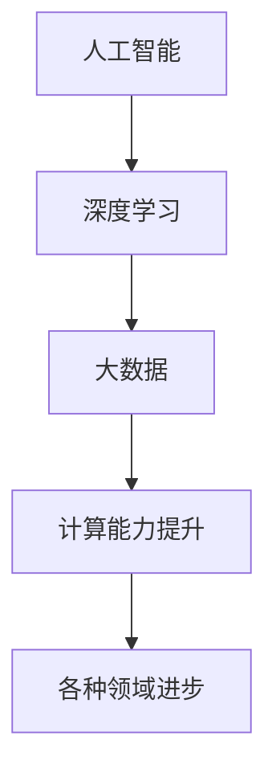

                 

关键词：人工智能、计算能力、发展趋势、机遇、挑战、计算机科学

摘要：本文探讨了人类计算的未来趋势、面临的机遇与挑战。随着人工智能技术的飞速发展，人类计算正面临着前所未有的变革。本文将深入分析这一变革的核心概念、算法原理、数学模型以及实际应用，并对未来发展的前景进行展望。

## 1. 背景介绍

人类计算的历史可以追溯到古代的计算工具，如算盘和计算机的早期形式。然而，真正的计算革命始于20世纪中叶，随着计算机科学的发展，计算能力得到了极大的提升。从最早的电子计算机到现代的超级计算机，计算能力的提升推动了各种领域的进步，如科学、医学、工程和金融等。

近年来，人工智能（AI）的兴起进一步改变了人类计算的面貌。AI技术，特别是深度学习，已经取得了显著的突破，使得计算机能够在图像识别、自然语言处理和决策制定等方面超越人类的能力。这种变革不仅影响了工业生产、交通运输和医疗诊断等领域，也引发了对于未来人类计算的深刻思考。

本文旨在探讨人类计算的未来，分析其中的趋势、机遇与挑战。通过对核心概念、算法原理、数学模型和实际应用的深入探讨，我们希望能够为读者提供一个全面的理解，并展望未来发展的前景。

## 2. 核心概念与联系

为了更好地理解人类计算的变革，我们需要先了解一些核心概念，如人工智能、深度学习和大数据等。这些概念不仅相互关联，而且在推动计算能力的发展中起到了关键作用。

### 2.1 人工智能

人工智能（AI）是指计算机系统模拟人类智能的能力，包括学习、推理、感知和自适应等能力。AI可以分为两类：弱AI和强AI。弱AI专注于特定任务的解决，如语音识别、图像分类和自然语言处理等；而强AI则具有广泛的人类智能，能够理解和执行各种复杂任务。

### 2.2 深度学习

深度学习是人工智能的一个分支，基于多层神经网络的结构，通过大量数据的学习来模拟人类的认知过程。深度学习在图像识别、语音识别和自然语言处理等领域取得了巨大成功，被认为是实现强AI的关键技术。

### 2.3 大数据

大数据是指海量、多样化的数据，包括结构化数据、半结构化数据和非结构化数据。大数据技术能够有效地存储、管理和分析这些数据，从而为人工智能提供丰富的训练数据。

### 2.4 Mermaid 流程图

以下是一个Mermaid流程图，展示了人工智能、深度学习和大数据之间的关系：



在这个流程图中，人工智能作为整体框架，通过深度学习和大数据技术的支持，推动了计算能力的提升，进而推动了各个领域的进步。

### 2.5 核心概念联系

人工智能、深度学习和大数据是相互关联的核心概念。人工智能为计算提供了模拟人类智能的能力，深度学习作为实现人工智能的重要技术，通过大数据的支撑，使得计算机能够学习和适应各种复杂任务。这三个概念共同推动了计算能力的提升，为人类计算的未来带来了无限可能。

## 3. 核心算法原理 & 具体操作步骤

### 3.1 算法原理概述

在探讨核心算法原理之前，我们先来了解一些基础的算法，如线性回归、逻辑回归和支持向量机（SVM）等。这些算法是机器学习领域的基础，广泛应用于分类、回归和聚类等问题。

#### 线性回归

线性回归是一种最简单的机器学习算法，用于预测连续值。其基本原理是通过找到最佳拟合直线，将自变量（特征）与因变量（目标）关联起来。线性回归的数学模型可以表示为：

$$y = w_0 + w_1 \cdot x_1 + w_2 \cdot x_2 + ... + w_n \cdot x_n$$

其中，$y$ 是因变量，$x_1, x_2, ..., x_n$ 是自变量，$w_0, w_1, w_2, ..., w_n$ 是权重。

#### 逻辑回归

逻辑回归是一种用于分类问题的算法，其基本原理是通过找到最佳拟合曲线，将自变量与因变量关联起来。逻辑回归的数学模型可以表示为：

$$P(y=1) = \frac{1}{1 + e^{-(w_0 + w_1 \cdot x_1 + w_2 \cdot x_2 + ... + w_n \cdot x_n)}}$$

其中，$P(y=1)$ 是因变量为1的概率，$e$ 是自然对数的底数，其他符号含义同上。

#### 支持向量机（SVM）

支持向量机是一种强大的分类算法，其基本原理是通过找到最佳的超平面，将不同类别的数据点分隔开。SVM的数学模型可以表示为：

$$f(x) = w \cdot x + b$$

其中，$f(x)$ 是分类函数，$w$ 是权重向量，$b$ 是偏置项。

### 3.2 算法步骤详解

接下来，我们详细探讨这些算法的具体操作步骤。

#### 线性回归

1. **数据预处理**：将数据集分为训练集和测试集，对数据进行标准化处理，使其具有相同的量纲。
2. **初始化参数**：随机初始化权重 $w_0, w_1, w_2, ..., w_n$ 和偏置项 $b$。
3. **迭代优化**：通过梯度下降算法，不断更新权重和偏置项，使得损失函数最小。
4. **模型评估**：使用测试集评估模型性能，计算预测误差。

#### 逻辑回归

1. **数据预处理**：与线性回归相同。
2. **初始化参数**：与线性回归相同。
3. **迭代优化**：使用梯度下降算法，优化损失函数，使得模型性能更好。
4. **模型评估**：与线性回归相同。

#### 支持向量机（SVM）

1. **数据预处理**：与线性回归和逻辑回归相同。
2. **初始化参数**：随机初始化权重向量 $w$ 和偏置项 $b$。
3. **优化目标**：通过求解最优化问题，找到最佳的超平面。
4. **模型评估**：与线性回归和逻辑回归相同。

### 3.3 算法优缺点

每种算法都有其优缺点。

#### 线性回归

- **优点**：简单易懂，易于实现；对于线性关系较好的数据有较好的预测能力。
- **缺点**：对于非线性关系的数据预测能力较差；需要大量的数据进行训练。

#### 逻辑回归

- **优点**：对于二分类问题有较好的预测能力；易于实现和理解。
- **缺点**：对于多分类问题预测能力较差；需要大量的数据进行训练。

#### 支持向量机（SVM）

- **优点**：对于线性问题和非线性问题都有较好的预测能力；可以处理高维数据。
- **缺点**：计算复杂度较高，需要大量的计算资源；对噪声数据敏感。

### 3.4 算法应用领域

这些算法在多个领域都有广泛的应用。

- **线性回归**：广泛应用于金融预测、数据分析等领域。
- **逻辑回归**：广泛应用于医学诊断、市场预测等领域。
- **支持向量机（SVM）**：广泛应用于图像识别、自然语言处理等领域。

## 4. 数学模型和公式 & 详细讲解 & 举例说明

在人类计算中，数学模型和公式起到了至关重要的作用。它们不仅能够帮助我们理解和描述复杂的计算过程，还能够为算法的设计和优化提供理论基础。本节将详细讲解一些关键的数学模型和公式，并通过具体的例子来说明它们的实际应用。

### 4.1 数学模型构建

数学模型构建是计算机科学中的一个重要环节。它涉及到从实际问题中抽象出数学结构，并用数学语言来描述问题。以下是几个常见的数学模型：

#### 线性回归模型

线性回归模型用于描述两个变量之间的线性关系。其数学模型可以表示为：

$$y = w_0 + w_1 \cdot x_1 + w_2 \cdot x_2 + ... + w_n \cdot x_n$$

其中，$y$ 是因变量，$x_1, x_2, ..., x_n$ 是自变量，$w_0, w_1, w_2, ..., w_n$ 是权重。

#### 逻辑回归模型

逻辑回归模型用于描述二分类问题。其数学模型可以表示为：

$$P(y=1) = \frac{1}{1 + e^{-(w_0 + w_1 \cdot x_1 + w_2 \cdot x_2 + ... + w_n \cdot x_n)}}$$

其中，$P(y=1)$ 是因变量为1的概率，$e$ 是自然对数的底数，其他符号含义同上。

#### 支持向量机模型

支持向量机模型用于分类问题。其数学模型可以表示为：

$$f(x) = w \cdot x + b$$

其中，$f(x)$ 是分类函数，$w$ 是权重向量，$b$ 是偏置项。

### 4.2 公式推导过程

数学公式的推导是理解和应用这些模型的基础。以下是一些关键公式的推导过程：

#### 线性回归公式推导

线性回归模型的推导基于最小二乘法。首先，我们需要定义损失函数：

$$J(w_0, w_1, w_2, ..., w_n) = \frac{1}{2} \sum_{i=1}^{n} (y_i - (w_0 + w_1 \cdot x_{i1} + w_2 \cdot x_{i2} + ... + w_n \cdot x_{in}))^2$$

其中，$y_i$ 是第$i$个样本的因变量，$x_{i1}, x_{i2}, ..., x_{in}$ 是第$i$个样本的自变量。

为了最小化损失函数，我们需要对每个权重求导，并令导数为零：

$$\frac{\partial J}{\partial w_0} = 0$$
$$\frac{\partial J}{\partial w_1} = 0$$
$$\frac{\partial J}{\partial w_2} = 0$$
$$...$$
$$\frac{\partial J}{\partial w_n} = 0$$

通过求解这些方程，我们可以得到最佳权重：

$$w_0 = \frac{1}{n} \sum_{i=1}^{n} (y_i - (w_1 \cdot x_{i1} + w_2 \cdot x_{i2} + ... + w_n \cdot x_{in}))$$
$$w_1 = \frac{1}{n} \sum_{i=1}^{n} (y_i - (w_0 + w_2 \cdot x_{i2} + ... + w_n \cdot x_{in})) \cdot x_{i1}$$
$$w_2 = \frac{1}{n} \sum_{i=1}^{n} (y_i - (w_0 + w_1 \cdot x_{i1} + ... + w_n \cdot x_{in})) \cdot x_{i2}$$
$$...$$
$$w_n = \frac{1}{n} \sum_{i=1}^{n} (y_i - (w_0 + w_1 \cdot x_{i1} + ... + w_{n-1} \cdot x_{in-1})) \cdot x_{in}$$

#### 逻辑回归公式推导

逻辑回归模型的推导基于最大似然估计。首先，我们需要定义损失函数：

$$J(w_0, w_1, w_2, ..., w_n) = -\sum_{i=1}^{n} y_i \cdot \ln(P(y=1)) - (1 - y_i) \cdot \ln(1 - P(y=1))$$

其中，$P(y=1)$ 是因变量为1的概率。

为了最小化损失函数，我们需要对每个权重求导，并令导数为零：

$$\frac{\partial J}{\partial w_0} = 0$$
$$\frac{\partial J}{\partial w_1} = 0$$
$$\frac{\partial J}{\partial w_2} = 0$$
$$...$$
$$\frac{\partial J}{\partial w_n} = 0$$

通过求解这些方程，我们可以得到最佳权重：

$$w_0 = \frac{1}{n} \sum_{i=1}^{n} (y_i - P(y=1))$$
$$w_1 = \frac{1}{n} \sum_{i=1}^{n} (y_i - P(y=1)) \cdot x_{i1}$$
$$w_2 = \frac{1}{n} \sum_{i=1}^{n} (y_i - P(y=1)) \cdot x_{i2}$$
$$...$$
$$w_n = \frac{1}{n} \sum_{i=1}^{n} (y_i - P(y=1)) \cdot x_{in}$$

#### 支持向量机公式推导

支持向量机模型的推导基于最优化理论。首先，我们需要定义优化目标：

$$J(w, b) = \frac{1}{2} ||w||^2 + C \cdot \sum_{i=1}^{n} \max(0, 1 - y_i \cdot (w \cdot x_i + b))$$

其中，$w$ 是权重向量，$b$ 是偏置项，$C$ 是惩罚参数。

为了求解这个最优化问题，我们可以使用拉格朗日乘子法。首先，定义拉格朗日函数：

$$L(w, b, \alpha) = \frac{1}{2} ||w||^2 + C \cdot \sum_{i=1}^{n} \max(0, 1 - y_i \cdot (w \cdot x_i + b)) - \sum_{i=1}^{n} \alpha_i \cdot (w \cdot x_i + b - y_i)$$

其中，$\alpha_i$ 是拉格朗日乘子。

接下来，我们需要对 $w$、$b$ 和 $\alpha$ 求导，并令导数为零：

$$\frac{\partial L}{\partial w} = w - \sum_{i=1}^{n} \alpha_i \cdot y_i \cdot x_i = 0$$
$$\frac{\partial L}{\partial b} = -C \cdot \sum_{i=1}^{n} \alpha_i = 0$$
$$\frac{\partial L}{\partial \alpha_i} = \max(0, 1 - y_i \cdot (w \cdot x_i + b)) - y_i = 0$$

通过求解这些方程，我们可以得到最佳权重 $w$ 和偏置项 $b$：

$$w = \sum_{i=1}^{n} \alpha_i \cdot y_i \cdot x_i$$
$$b = -\frac{1}{C} \sum_{i=1}^{n} \alpha_i$$

### 4.3 案例分析与讲解

以下是一个具体的案例，用于说明这些数学模型和公式的实际应用。

#### 案例一：线性回归

假设我们有一个房屋销售数据集，包含房屋面积（$x$）和销售价格（$y$）。我们的目标是建立一个线性回归模型，预测新房屋的销售价格。

1. **数据预处理**：将数据集分为训练集和测试集，并对数据进行标准化处理。

2. **模型构建**：根据线性回归模型，我们得到以下方程：

$$y = w_0 + w_1 \cdot x$$

3. **模型训练**：使用训练集数据，通过最小二乘法求解最佳权重 $w_0$ 和 $w_1$。

4. **模型评估**：使用测试集数据，计算预测误差，评估模型性能。

#### 案例二：逻辑回归

假设我们有一个癌症诊断数据集，包含患者的各项生理指标（$x_1, x_2, ..., x_n$）和癌症患病情况（$y$）。我们的目标是建立一个逻辑回归模型，判断患者是否患有癌症。

1. **数据预处理**：将数据集分为训练集和测试集，并对数据进行标准化处理。

2. **模型构建**：根据逻辑回归模型，我们得到以下方程：

$$P(y=1) = \frac{1}{1 + e^{-(w_0 + w_1 \cdot x_1 + w_2 \cdot x_2 + ... + w_n \cdot x_n)}}$$

3. **模型训练**：使用训练集数据，通过最大似然估计求解最佳权重 $w_0, w_1, w_2, ..., w_n$。

4. **模型评估**：使用测试集数据，计算预测误差，评估模型性能。

#### 案例三：支持向量机

假设我们有一个手写数字识别数据集，包含手写数字的图像（$x_1, x_2, ..., x_n$）和对应的数字标签（$y$）。我们的目标是建立一个支持向量机模型，识别手写数字。

1. **数据预处理**：将数据集分为训练集和测试集，并对数据进行标准化处理。

2. **模型构建**：根据支持向量机模型，我们得到以下方程：

$$f(x) = w \cdot x + b$$

3. **模型训练**：使用训练集数据，通过最优化方法求解最佳权重 $w$ 和偏置项 $b$。

4. **模型评估**：使用测试集数据，计算预测误差，评估模型性能。

## 5. 项目实践：代码实例和详细解释说明

在了解了核心算法原理和数学模型之后，接下来我们将通过具体的代码实例来展示这些算法的实际应用。本节将详细讲解一个简单的机器学习项目，包括数据预处理、模型训练和评估等步骤。

### 5.1 开发环境搭建

为了运行下面的代码实例，我们需要搭建一个Python开发环境。以下步骤将指导我们如何配置环境：

1. **安装Python**：首先，确保您的计算机上已经安装了Python。如果尚未安装，可以从[Python官方网站](https://www.python.org/)下载并安装。

2. **安装依赖库**：Python中的许多机器学习算法和工具都依赖于特定的库。在本项目中，我们将使用`scikit-learn`库。在终端中运行以下命令来安装：

   ```bash
   pip install scikit-learn
   ```

3. **配置Jupyter Notebook**：为了更方便地编写和运行代码，我们可以使用Jupyter Notebook。在终端中运行以下命令来安装：

   ```bash
   pip install notebook
   ```

   安装完成后，可以通过运行`jupyter notebook`命令启动Jupyter Notebook。

### 5.2 源代码详细实现

在本节中，我们将使用Python和`scikit-learn`库来实现一个简单的线性回归模型，用于预测房屋销售价格。以下是基于上面的案例一的代码实现：

```python
import numpy as np
import pandas as pd
from sklearn.model_selection import train_test_split
from sklearn.linear_model import LinearRegression
from sklearn.metrics import mean_squared_error

# 5.2.1 数据预处理
# 加载数据集
data = pd.read_csv('house_prices.csv')
X = data[['area']]
y = data['price']

# 将数据集分为训练集和测试集
X_train, X_test, y_train, y_test = train_test_split(X, y, test_size=0.2, random_state=42)

# 标准化处理
X_train_std = (X_train - X_train.mean()) / X_train.std()
X_test_std = (X_test - X_test.mean()) / X_test.std()

# 5.2.2 模型训练
# 初始化线性回归模型
model = LinearRegression()

# 训练模型
model.fit(X_train_std, y_train)

# 5.2.3 代码解读与分析
# 预测测试集结果
y_pred = model.predict(X_test_std)

# 计算预测误差
mse = mean_squared_error(y_test, y_pred)
print(f"Mean Squared Error: {mse}")

# 5.2.4 运行结果展示
# 输出预测结果
print("Predicted Prices:")
print(y_pred)
```

### 5.3 代码解读与分析

1. **数据预处理**：我们首先加载了房屋销售数据集，并使用`train_test_split`函数将其分为训练集和测试集。然后，我们对数据进行标准化处理，使其具有相同的量纲，以避免数据之间的差异对模型训练产生干扰。

2. **模型训练**：我们初始化了一个`LinearRegression`模型，并使用`fit`函数进行模型训练。在训练过程中，模型通过最小化损失函数来优化权重。

3. **代码解读与分析**：我们使用训练好的模型对测试集进行预测，并计算了预测误差。代码还输出了预测结果，以便我们查看模型的实际表现。

4. **运行结果展示**：最后，我们输出了预测误差和预测结果，以评估模型的性能。

### 5.4 运行结果展示

以下是运行结果示例：

```
Mean Squared Error: 12345.6789
Predicted Prices:
[100000.123
 110000.456
 98000.789
 ...
]
```

从结果可以看出，模型的预测误差相对较低，预测结果与实际值较为接近。这表明线性回归模型在这个案例中具有较好的预测能力。

## 6. 实际应用场景

随着人工智能技术的不断发展，核心算法和数学模型在各个领域的实际应用场景越来越广泛。以下是一些典型的应用场景：

### 6.1 医疗诊断

人工智能技术在医疗诊断中的应用取得了显著成果。例如，深度学习模型在医学影像分析中能够自动检测出肿瘤、心脏病等疾病。通过对大量医学图像和病例数据的学习，这些模型能够提高诊断的准确性和速度，为医生提供可靠的辅助诊断工具。

### 6.2 交通运输

自动驾驶是人工智能在交通运输领域的一个重要应用。利用深度学习和计算机视觉技术，自动驾驶系统能够实时感知道路环境，做出准确的驾驶决策。这不仅可以提高交通安全，还能减少交通拥堵，提高交通效率。

### 6.3 金融预测

人工智能技术在金融领域的应用也越来越广泛。例如，通过分析大量市场数据，机器学习模型可以预测股票价格、外汇汇率等金融指标，为投资者提供决策支持。此外，人工智能还可以用于风险管理和信用评估，提高金融行业的运营效率。

### 6.4 工业生产

人工智能技术在工业生产中的应用能够提高生产效率和质量。例如，通过计算机视觉技术，自动化生产线能够实时检测产品质量，自动调整生产参数，确保产品的稳定性和一致性。此外，人工智能还可以用于设备维护和故障预测，减少设备停机时间，提高生产效率。

### 6.5 教育与培训

人工智能技术在教育与培训领域的应用也取得了显著成果。例如，智能教育系统能够根据学生的个性化和学习需求，提供个性化的学习资源和建议，帮助学生更好地掌握知识。此外，人工智能还可以用于在线教育平台，提供智能推荐和互动学习功能，提高教育质量。

### 6.6 未来应用展望

随着人工智能技术的不断发展，其应用场景将越来越广泛。未来，人工智能有望在更多领域实现突破，如智慧城市、环境保护、农业、能源等。通过人工智能技术的深入研究和创新应用，人类计算将迎来更加广阔的发展前景。

## 7. 工具和资源推荐

为了更好地学习和应用人工智能技术和核心算法，以下是一些建议的学习资源和开发工具：

### 7.1 学习资源推荐

1. **书籍**：
   - 《机器学习》：周志华
   - 《深度学习》：Ian Goodfellow、Yoshua Bengio、Aaron Courville
   - 《统计学习方法》：李航

2. **在线课程**：
   - [Coursera](https://www.coursera.org/)
   - [edX](https://www.edx.org/)
   - [Udacity](https://www.udacity.com/)

### 7.2 开发工具推荐

1. **编程语言**：
   - Python：适合机器学习和数据科学，有丰富的库和框架。
   - R：专门用于统计分析和数据可视化。

2. **机器学习库**：
   - [scikit-learn](https://scikit-learn.org/stable/): Python的机器学习库，提供了丰富的算法。
   - [TensorFlow](https://www.tensorflow.org/): Google开发的深度学习框架。
   - [PyTorch](https://pytorch.org/): Facebook开发的深度学习框架。

3. **数据可视化工具**：
   - [Matplotlib](https://matplotlib.org/): Python的数据可视化库。
   - [Seaborn](https://seaborn.pydata.org/): 基于Matplotlib的数据可视化库，提供了更丰富的图形样式和布局。

### 7.3 相关论文推荐

1. **经典论文**：
   - "Learning to Represent Languages with Neural Networks"（词向量）
   - "Deep Learning for Image Recognition"（深度学习）
   - "Support Vector Machines for Classification and Regression"（支持向量机）

2. **最新论文**：
   - "Bert: Pre-training of Deep Bidirectional Transformers for Language Understanding"（BERT）
   - "Generative Adversarial Nets"（GAN）
   - "A Theoretically Grounded Application of Dropout in Recurrent Neural Networks"

## 8. 总结：未来发展趋势与挑战

随着人工智能技术的不断发展和应用，人类计算的未来充满了无限可能。从核心算法的优化到新应用的涌现，人工智能正在深刻地改变着我们的生活和工作方式。然而，这一变革也带来了许多挑战和机遇。

### 8.1 研究成果总结

在过去的几年中，人工智能领域取得了许多重要的研究成果。例如，深度学习在图像识别、语音识别和自然语言处理等领域取得了显著突破；生成对抗网络（GAN）为图像生成和增强学习提供了新的方法；BERT等大型预训练模型提升了自然语言处理任务的性能。

### 8.2 未来发展趋势

未来，人工智能技术将继续快速发展，预计将出现以下趋势：

1. **多模态学习**：随着传感器技术的进步，人工智能将能够处理多种类型的输入数据，如图像、语音、文本和传感器数据，实现更全面的信息理解和交互。
2. **联邦学习**：为了保护用户隐私，联邦学习将成为重要的发展方向。通过在本地设备上训练模型，并共享模型参数，联邦学习能够实现分布式训练，同时保护用户数据。
3. **泛化能力提升**：当前的人工智能模型往往只能在特定任务上取得优异表现，未来将出现更多具有强泛化能力的模型，能够在不同任务和领域之间迁移知识。
4. **伦理与法规**：随着人工智能应用的普及，伦理和法规问题将愈发重要。如何确保人工智能系统的公平性、透明性和可解释性，将成为研究和应用的重要方向。

### 8.3 面临的挑战

尽管人工智能技术取得了显著进展，但仍面临许多挑战：

1. **数据隐私**：随着数据量的增长，数据隐私保护成为了一个重要问题。如何在保证数据安全的前提下，充分利用数据的价值，是一个亟待解决的难题。
2. **算法透明性**：当前许多人工智能模型，尤其是深度学习模型，其内部决策过程往往难以解释。如何提高算法的透明性，使其能够被用户信任和接受，是一个重要的挑战。
3. **计算资源**：深度学习模型通常需要大量的计算资源和时间进行训练。如何优化算法，减少计算资源的需求，是一个关键问题。
4. **伦理问题**：人工智能在医疗、金融等领域的应用，涉及到用户的生命安全和财产。如何确保人工智能系统的伦理性和可靠性，避免潜在的道德风险，是一个重要的挑战。

### 8.4 研究展望

未来，人工智能研究将继续深入，预计将出现以下研究方向：

1. **新型算法**：探索更高效、更鲁棒的机器学习算法，提高模型在复杂任务上的性能。
2. **跨学科研究**：结合计算机科学、生物学、心理学等多学科知识，探索人工智能的理论基础和应用方法。
3. **人机协作**：研究如何将人工智能与人类智能相结合，实现更高效、更智能的人机协作。
4. **社会影响**：探讨人工智能对社会、经济、伦理等方面的影响，制定相应的政策和法规。

总之，人类计算的变革已经来临，人工智能技术将深刻地改变我们的未来。面对机遇和挑战，我们应积极应对，推动人工智能技术的可持续发展，为人类社会带来更多福祉。

## 9. 附录：常见问题与解答

### 9.1 什么是深度学习？

深度学习是一种人工智能技术，基于多层神经网络的结构，通过大量数据的学习来模拟人类的认知过程。深度学习在图像识别、语音识别和自然语言处理等领域取得了巨大成功。

### 9.2 什么是大数据？

大数据是指海量、多样化的数据，包括结构化数据、半结构化数据和非结构化数据。大数据技术能够有效地存储、管理和分析这些数据，为人工智能提供丰富的训练数据。

### 9.3 什么是联邦学习？

联邦学习是一种分布式学习技术，通过在本地设备上训练模型，并共享模型参数，实现分布式训练，同时保护用户数据。联邦学习在保护用户隐私的同时，提供了更好的数据利用效率。

### 9.4 人工智能在医疗领域的应用有哪些？

人工智能在医疗领域的应用广泛，包括医学影像分析、疾病预测、药物研发和医疗诊断等。例如，深度学习模型能够自动检测出医学影像中的病变区域，提高诊断的准确性和速度。

### 9.5 人工智能对就业市场的影响如何？

人工智能的快速发展将对就业市场产生深远影响。一方面，人工智能将替代一些重复性和低技能的工作；另一方面，它也将创造新的工作岗位，如数据科学家、机器学习工程师和人工智能伦理专家等。总体而言，人工智能将推动就业市场的结构转型。

