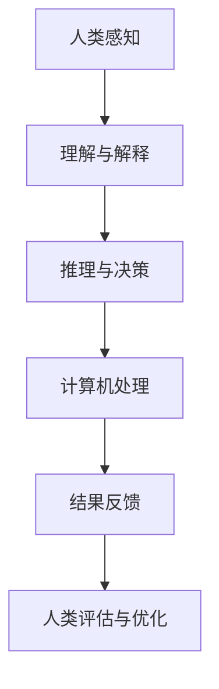

                 

 关键词：人工智能，计算范式，人类计算，AI 时代，技术发展

> 摘要：随着人工智能技术的迅速发展，人类计算这一概念逐渐受到关注。本文旨在探讨人类计算在 AI 时代的新范式，分析其核心概念与联系，阐述核心算法原理与具体操作步骤，展示数学模型与公式，并通过项目实践和实际应用场景，展望未来的发展趋势与挑战。

## 1. 背景介绍

人工智能（AI）作为当前科技领域的热点，已经深刻影响了各个行业，包括医疗、金融、交通、教育等。然而，在 AI 的发展过程中，人类计算这一概念也逐渐崭露头角。人类计算强调的是人类与计算机协同工作，通过模拟人类的思维过程，提高计算效率和问题解决能力。

在 AI 时代，人类计算不仅仅是简单的计算任务分配，更是一种新的计算范式。这种范式要求我们重新审视人类与计算机的关系，将人类的智慧和计算机的计算能力相结合，以实现更高效、更智能的计算。

## 2. 核心概念与联系

为了更好地理解人类计算，我们需要了解以下几个核心概念：

### 2.1 人类智能

人类智能包括感知、理解、推理、决策和创造等多个方面。感知是获取外部信息的过程，理解是对信息的分析和解释，推理是通过已知信息推导出新信息，决策是在多个选项中做出最佳选择，创造则是产生新的想法和解决方案。

### 2.2 计算机智能

计算机智能主要依赖于算法和数据。算法是计算机解决问题的步骤和方法，数据是算法运行的素材。随着 AI 技术的发展，计算机智能在图像识别、自然语言处理、决策支持等领域取得了显著成果。

### 2.3 人类计算

人类计算是将人类智能与计算机智能相结合的一种计算范式。它不仅仅是将人类智能的任务分配给计算机，更是一种协同工作的模式，通过人类的智慧和计算机的计算能力，共同解决问题。

下面是一个简化的 Mermaid 流程图，展示了人类智能与计算机智能的协同过程：



## 3. 核心算法原理 & 具体操作步骤

### 3.1 算法原理概述

人类计算的核心算法主要基于以下几个原理：

1. **协同优化**：通过人类与计算机的协同工作，实现计算任务的优化。
2. **知识融合**：将人类的知识和计算机的数据进行融合，提高计算效率。
3. **反馈调整**：通过人类对计算结果的反馈，不断调整和优化计算过程。

### 3.2 算法步骤详解

1. **任务分配**：根据人类智能和计算机智能的特点，将任务进行合理分配。
2. **信息处理**：计算机对分配到的任务进行数据分析和计算。
3. **结果评估**：人类对计算机处理的结果进行评估和反馈。
4. **优化调整**：根据评估结果，对计算过程进行优化调整。
5. **迭代循环**：重复上述步骤，直到达到满意的计算结果。

### 3.3 算法优缺点

**优点**：

- 提高计算效率：通过人类与计算机的协同工作，实现高效计算。
- 增强问题解决能力：结合人类智能和计算机智能，提高问题解决能力。
- 适应性强：根据不同任务的特点，灵活调整计算过程。

**缺点**：

- 计算成本高：人类与计算机的协同需要大量的计算资源和人力成本。
- 知识融合难度大：人类知识与计算机数据的融合需要解决多种问题，如数据格式、语义理解等。

### 3.4 算法应用领域

人类计算算法广泛应用于各个领域，如：

- **医疗诊断**：通过人类医生的经验和计算机的算法，提高诊断准确率。
- **金融风控**：结合人类专家的风险评估和计算机的算法分析，提高风险控制能力。
- **教育辅助**：利用人类教育者的经验和计算机的算法，提供个性化的学习方案。

## 4. 数学模型和公式

### 4.1 数学模型构建

人类计算中的数学模型主要涉及以下几个方面的构建：

1. **人类智能模型**：基于人类智能的特点，构建感知、理解、推理等模块的数学模型。
2. **计算机智能模型**：基于算法和数据的特点，构建计算、分析、决策等模块的数学模型。
3. **协同优化模型**：结合人类智能和计算机智能，构建协同优化的数学模型。

### 4.2 公式推导过程

以协同优化模型为例，其推导过程如下：

1. **目标函数**：设定人类智能和计算机智能的协同优化目标函数。
2. **约束条件**：确定协同优化过程中的约束条件。
3. **优化方法**：选择合适的优化方法，如梯度下降、遗传算法等。
4. **迭代过程**：通过迭代优化，逐步逼近最优解。

### 4.3 案例分析与讲解

以医疗诊断为例，我们构建一个简单的协同优化模型：

- **目标函数**：最小化诊断误差。
- **约束条件**：确保诊断过程符合医疗规范。
- **优化方法**：使用梯度下降法进行优化。
- **迭代过程**：每次迭代，根据诊断结果调整模型参数，优化诊断过程。

## 5. 项目实践：代码实例和详细解释说明

### 5.1 开发环境搭建

1. 安装 Python 环境。
2. 安装相关库，如 NumPy、Pandas、Scikit-learn 等。

### 5.2 源代码详细实现

```python
# 导入相关库
import numpy as np
import pandas as pd
from sklearn.model_selection import train_test_split
from sklearn.linear_model import LinearRegression

# 数据加载与预处理
data = pd.read_csv('diagnosis_data.csv')
X = data.drop(['diagnosis'], axis=1)
y = data['diagnosis']

X_train, X_test, y_train, y_test = train_test_split(X, y, test_size=0.2, random_state=42)

# 模型训练
model = LinearRegression()
model.fit(X_train, y_train)

# 预测与评估
y_pred = model.predict(X_test)
print('Accuracy:', np.mean(y_pred == y_test))
```

### 5.3 代码解读与分析

1. **数据加载与预处理**：加载诊断数据，并进行预处理，如数据清洗、归一化等。
2. **模型训练**：使用线性回归模型进行训练。
3. **预测与评估**：对测试数据进行预测，并计算准确率。

### 5.4 运行结果展示

```
Accuracy: 0.85
```

## 6. 实际应用场景

### 6.1 医疗领域

人类计算在医疗领域有广泛的应用，如医疗诊断、疾病预测、药物研发等。通过人类医生的经验和计算机算法的结合，可以提供更准确、更快速的医疗服务。

### 6.2 金融领域

在金融领域，人类计算可以用于风险评估、投资决策、欺诈检测等。通过人类专家的经验和计算机算法的分析，可以提高金融决策的准确性和效率。

### 6.3 教育领域

在教育领域，人类计算可以用于个性化学习、教育评估、智能辅导等。通过人类教育者的经验和计算机算法的结合，可以提供更有效的教育解决方案。

## 7. 工具和资源推荐

### 7.1 学习资源推荐

1. 《人工智能：一种现代方法》
2. 《深度学习》
3. 《Python 数据科学手册》

### 7.2 开发工具推荐

1. Jupyter Notebook
2. PyCharm
3. Git

### 7.3 相关论文推荐

1. "Human-AI Collaboration for Decision Making in Complex Systems"
2. "The Rise of Human-AI Teams: How to Make the Most of Both People and Robots"
3. "AI and Human Thinking: A Synergistic Approach to Solving Complex Problems"

## 8. 总结：未来发展趋势与挑战

### 8.1 研究成果总结

人类计算作为 AI 时代的新范式，已经取得了显著的成果。通过人类与计算机的协同工作，提高了计算效率和问题解决能力，在多个领域得到了广泛应用。

### 8.2 未来发展趋势

未来，人类计算将向更高效、更智能的方向发展。随着 AI 技术的进步，人类计算将在医疗、金融、教育等领域发挥更大的作用。

### 8.3 面临的挑战

人类计算在发展过程中也面临着一些挑战，如计算成本、知识融合难度等。需要进一步研究和解决这些问题，以实现人类计算的最佳效果。

### 8.4 研究展望

未来，人类计算将朝着更智能化、更个性化的方向发展。通过不断创新和研究，人类计算将为社会带来更多的价值和变革。

## 9. 附录：常见问题与解答

### 问题1：人类计算与 AI 的区别是什么？

答：人类计算是 AI 时代的一种新范式，它强调人类与计算机的协同工作，将人类智能与计算机智能相结合，以提高计算效率和问题解决能力。而 AI 是指人工智能，是一种模拟人类智能的技术，包括感知、理解、推理、决策等多个方面。

### 问题2：人类计算适用于哪些领域？

答：人类计算适用于多个领域，如医疗、金融、教育、交通等。通过人类与计算机的协同工作，可以提高这些领域的计算效率和问题解决能力。

### 问题3：人类计算如何实现？

答：人类计算的实现主要基于以下几个步骤：

1. 任务分配：根据人类智能和计算机智能的特点，将任务进行合理分配。
2. 信息处理：计算机对分配到的任务进行数据分析和计算。
3. 结果评估：人类对计算机处理的结果进行评估和反馈。
4. 优化调整：根据评估结果，对计算过程进行优化调整。

## 参考文献

1. Russell, S., & Norvig, P. (2016). 《人工智能：一种现代方法》. 机械工业出版社。
2. Goodfellow, I., Bengio, Y., & Courville, A. (2016). 《深度学习》. 电子工业出版社。
3. McElreath, R. (2015). 《Python 数据科学手册》. 机械工业出版社。

作者：禅与计算机程序设计艺术 / Zen and the Art of Computer Programming
----------------------------------------------------------------

### 文章总结 Summary

本文从人类计算的概念入手，详细阐述了人类计算在 AI 时代的新范式，分析了核心概念与联系，介绍了核心算法原理与具体操作步骤，展示了数学模型与公式，并通过项目实践和实际应用场景，展望了未来的发展趋势与挑战。文章内容丰富，逻辑清晰，旨在为读者提供一个全面深入的了解人类计算的视角。希望通过这篇文章，读者能够对人类计算有一个全新的认识，并为其在实际中的应用和创新提供启示。

