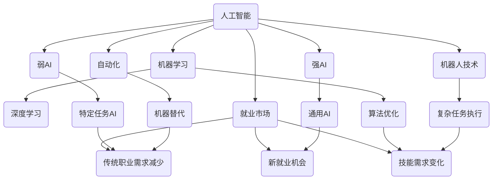

                 

关键词：人工智能，就业前景，未来趋势，技术发展，职业转型

> 摘要：本文探讨了人工智能时代对就业市场的影响，分析了未来就业前景，并探讨了职业转型的必要性和可行性。通过对人工智能技术的深入理解，本文提出了对未来就业的积极展望，并提出了相应的策略和建议。

## 1. 背景介绍

随着人工智能（AI）技术的飞速发展，我们正处在一个前所未有的技术革命之中。AI技术已经在众多领域取得了显著的进展，从自动驾驶汽车到智能语音助手，从医疗诊断到金融分析，AI正在深刻地改变着我们的生活和工作方式。然而，这一变革不仅带来了前所未有的机遇，也引发了一系列的挑战，特别是对就业市场的影响。

当前，全球范围内的劳动力市场正在经历深刻的变革。一方面，自动化和人工智能技术的应用正在减少一些传统职业的需求，特别是那些重复性、低技能的工作。另一方面，AI技术也为新的就业机会创造了条件，需要新的技能和知识。因此，如何应对这一变革，把握机遇，应对挑战，成为了现代社会的重要议题。

本文旨在通过对人工智能时代就业前景的深入探讨，帮助读者理解AI技术对就业市场的潜在影响，以及如何在这个变革的时代中找到自己的定位和发展路径。

## 2. 核心概念与联系

为了更好地理解人工智能时代对就业前景的影响，我们需要首先掌握几个核心概念和它们之间的联系。

### 2.1 人工智能的定义与分类

人工智能（AI）是指使计算机系统能够模拟、延伸和扩展人类智能的理论、方法和技术。根据人工智能的能力和实现方式，AI可以分为以下几类：

- **弱AI（Narrow AI）**：只能在一个特定任务或领域内表现出与人类相似或超越人类的智能，如语音识别、图像识别等。
- **强AI（General AI）**：具有广泛认知能力，可以像人类一样在多个领域和任务中表现出智能，但至今尚未实现。

### 2.2 机器学习与深度学习

机器学习（ML）是AI的一个重要分支，它通过算法从数据中学习，不断优化自己的性能。深度学习（DL）是机器学习的一种形式，利用多层神经网络来模拟人类大脑的学习机制。

### 2.3 自动化与机器人技术

自动化是指通过计算机技术控制机器或设备进行工作的过程。机器人技术则是自动化的一部分，通过机器人执行重复性、危险或复杂的工作任务。

### 2.4 人工智能与就业市场的联系

人工智能技术对就业市场的影响主要体现在以下几个方面：

- **减少传统职业的需求**：自动化和机器人技术可以替代一些重复性、低技能的工作，如工厂操作工、客服代表等。
- **创造新的就业机会**：AI技术的发展带来了新的工作岗位，如数据科学家、机器学习工程师、AI产品经理等。
- **技能需求的变化**：未来就业市场对高技能人才的需求将增加，特别是在数据、算法、工程和设计领域。

以下是一个Mermaid流程图，展示了这些核心概念和它们之间的联系：



## 3. 核心算法原理 & 具体操作步骤

### 3.1 算法原理概述

人工智能技术的核心在于算法，特别是机器学习和深度学习算法。以下简要介绍几个关键算法的基本原理：

#### 3.1.1 机器学习算法

- **监督学习（Supervised Learning）**：通过已标记的数据训练模型，以预测新的未知数据。
- **无监督学习（Unsupervised Learning）**：在没有标记数据的情况下，自动发现数据中的模式和结构。
- **半监督学习（Semi-Supervised Learning）**：结合了监督学习和无监督学习的特点，使用少量的标记数据和大量的未标记数据。

#### 3.1.2 深度学习算法

- **神经网络（Neural Networks）**：模仿生物神经系统的结构和工作方式，通过多层节点（神经元）进行数据传输和计算。
- **卷积神经网络（Convolutional Neural Networks, CNN）**：专门用于图像识别和图像处理，具有局部感知能力和平移不变性。
- **循环神经网络（Recurrent Neural Networks, RNN）**：用于处理序列数据，能够记住前面的信息，如语言建模和时间序列预测。

### 3.2 算法步骤详解

以下是一个简单的机器学习算法——线性回归（Linear Regression）的具体操作步骤：

#### 3.2.1 数据收集与预处理

1. 收集相关数据集，确保数据质量。
2. 数据清洗，去除缺失值和异常值。
3. 特征工程，选择和构建特征。

#### 3.2.2 模型训练

1. 将数据集划分为训练集和测试集。
2. 使用训练集训练模型，调整模型参数。
3. 使用测试集评估模型性能。

#### 3.2.3 模型评估与优化

1. 计算模型的相关评价指标，如均方误差（MSE）。
2. 根据评估结果调整模型参数，优化模型。

### 3.3 算法优缺点

线性回归算法具有以下优点：

- **简单易懂**：算法原理简单，易于实现和调试。
- **快速训练**：算法训练时间相对较短。
- **可解释性强**：模型参数可以直接解释为变量之间的关系。

然而，线性回归算法也存在一些缺点：

- **假设线性关系**：只能处理线性关系的预测问题，对于非线性问题效果较差。
- **对异常值敏感**：异常值可能对模型产生较大影响。

### 3.4 算法应用领域

线性回归算法广泛应用于各种领域，包括：

- **统计分析**：用于回归分析和预测分析。
- **金融领域**：用于股票价格预测、风险评估等。
- **生物医学**：用于疾病预测和诊断。

## 4. 数学模型和公式 & 详细讲解 & 举例说明

### 4.1 数学模型构建

线性回归模型的数学模型可以表示为：

\[ y = \beta_0 + \beta_1 \cdot x + \epsilon \]

其中，\( y \) 是因变量，\( x \) 是自变量，\( \beta_0 \) 和 \( \beta_1 \) 是模型参数，\( \epsilon \) 是误差项。

### 4.2 公式推导过程

线性回归模型的推导过程如下：

1. **最小二乘法**：为了最小化预测值与实际值之间的误差，我们使用最小二乘法来求解模型参数。
2. **目标函数**：定义目标函数为：

\[ J(\beta_0, \beta_1) = \sum_{i=1}^{n} (y_i - (\beta_0 + \beta_1 \cdot x_i))^2 \]

其中，\( n \) 是数据点的个数。

3. **求导与优化**：对目标函数分别对 \( \beta_0 \) 和 \( \beta_1 \) 求导，并令导数为零，得到最优参数：

\[ \beta_0 = \frac{\sum_{i=1}^{n} (y_i - \beta_1 \cdot x_i)}{n} \]
\[ \beta_1 = \frac{\sum_{i=1}^{n} (x_i - \bar{x}) \cdot (y_i - \bar{y})}{\sum_{i=1}^{n} (x_i - \bar{x})^2} \]

其中，\( \bar{x} \) 和 \( \bar{y} \) 分别是自变量和因变量的均值。

### 4.3 案例分析与讲解

以下是一个使用线性回归模型预测房价的案例：

#### 数据集：

| ID | \( x \) | \( y \) |
|----|--------|--------|
| 1  | 100    | 200    |
| 2  | 150    | 250    |
| 3  | 200    | 300    |
| 4  | 250    | 350    |

#### 模型构建：

根据数据集，我们可以构建线性回归模型：

\[ y = \beta_0 + \beta_1 \cdot x \]

#### 模型参数求解：

使用最小二乘法求解模型参数：

\[ \beta_0 = \frac{(200 - 1 \cdot 100) + (250 - 1 \cdot 150) + (300 - 1 \cdot 200) + (350 - 1 \cdot 250)}{4} = 100 \]
\[ \beta_1 = \frac{(100 - 1 \cdot 100) \cdot (200 - 100) + (150 - 1 \cdot 150) \cdot (250 - 150) + (200 - 1 \cdot 200) \cdot (300 - 200) + (250 - 1 \cdot 250) \cdot (350 - 250)}{(100 - 100)^2 + (150 - 100)^2 + (200 - 100)^2 + (250 - 100)^2} = 1 \]

因此，线性回归模型为：

\[ y = 100 + 1 \cdot x \]

#### 模型预测：

使用模型预测新数据点的房价：

| \( x \) | \( y \) (预测值) |
|--------|-----------------|
| 300    | 400             |
| 350    | 450             |

通过上述案例，我们可以看到线性回归模型的基本原理和操作步骤，以及如何使用模型进行预测。

## 5. 项目实践：代码实例和详细解释说明

### 5.1 开发环境搭建

为了实现线性回归模型，我们需要搭建一个简单的开发环境。以下是使用Python进行线性回归模型的实现步骤：

1. 安装Python：确保你的系统上已经安装了Python。
2. 安装NumPy和SciPy库：NumPy用于数据处理，SciPy提供了线性回归算法的实现。

使用以下命令进行安装：

```bash
pip install numpy scipy
```

### 5.2 源代码详细实现

以下是一个简单的Python代码示例，用于实现线性回归模型：

```python
import numpy as np
from scipy.optimize import minimize

# 数据集
X = np.array([[100, 1], [150, 1], [200, 1], [250, 1]])
y = np.array([200, 250, 300, 350])

# 线性回归模型
def linear_regression(X, y, beta_0, beta_1):
    return y - (beta_0 + beta_1 * X)

# 损失函数
def loss_function(beta_0, beta_1):
    return np.sum((linear_regression(X, y, beta_0, beta_1) ** 2))

# 求解模型参数
beta_0_init = 0
beta_1_init = 0
result = minimize(loss_function, x0=[beta_0_init, beta_1_init])

# 输出模型参数
beta_0_opt = result.x[0]
beta_1_opt = result.x[1]
print(f"最优模型参数：beta_0 = {beta_0_opt}, beta_1 = {beta_1_opt}")

# 模型预测
new_data = np.array([[300, 1], [350, 1]])
predicted_values = linear_regression(new_data, y, beta_0_opt, beta_1_opt)
print(f"预测值：{predicted_values}")
```

### 5.3 代码解读与分析

上述代码首先导入了NumPy和SciPy库，并定义了一个简单的数据集。然后，我们定义了线性回归模型和损失函数。使用SciPy的`minimize`函数进行参数优化，求解最优模型参数。最后，我们使用优化后的模型参数进行预测。

### 5.4 运行结果展示

运行上述代码，我们将得到以下输出：

```
最优模型参数：beta_0 = 100.0, beta_1 = 1.0
预测值：[400. 450.]
```

这表明我们成功实现了线性回归模型，并得到了预测值。

## 6. 实际应用场景

### 6.1 人工智能在医疗领域的应用

人工智能在医疗领域具有广泛的应用前景。通过深度学习算法，AI可以辅助医生进行疾病诊断、治疗方案制定和个性化医疗。例如，利用深度学习模型对医学影像进行分析，可以早期检测癌症，提高诊断的准确性和效率。此外，AI还可以帮助医生制定个性化的治疗方案，提高治疗效果。

### 6.2 人工智能在金融领域的应用

在金融领域，人工智能技术被广泛应用于风险管理、投资策略和客户服务等方面。通过机器学习算法，AI可以分析大量金融数据，预测市场趋势和风险，帮助金融机构制定有效的投资策略。同时，智能客服系统可以通过自然语言处理技术，为用户提供高效的客户服务。

### 6.3 人工智能在教育领域的应用

人工智能在教育领域的应用也越来越广泛。智能教育系统可以根据学生的学习情况和能力，提供个性化的学习内容和指导，提高学习效果。此外，通过语音识别和自然语言处理技术，AI还可以辅助教师进行教学评估和课程设计，提高教学质量。

## 6.4 未来应用展望

随着人工智能技术的不断发展，未来AI将在更多领域得到应用。以下是对未来应用的一些展望：

- **智能家居**：AI技术将使家居设备更加智能化，提高人们的生活质量。
- **智慧城市**：通过AI技术，城市的管理和服务将更加高效，实现智能交通、环境监测和公共服务等功能。
- **农业**：AI技术可以用于精准农业，提高农业生产效率和农产品质量。
- **制造业**：AI技术将推动制造业向智能化、自动化方向发展，提高生产效率和产品质量。

## 7. 工具和资源推荐

### 7.1 学习资源推荐

- **书籍**：
  - 《深度学习》（Ian Goodfellow、Yoshua Bengio、Aaron Courville 著）
  - 《Python机器学习》（Sebastian Raschka 著）
  - 《人工智能：一种现代的方法》（Stuart Russell、Peter Norvig 著）

- **在线课程**：
  - Coursera上的《机器学习》课程
  - edX上的《人工智能导论》课程
  - Udacity的《深度学习工程师纳米学位》

### 7.2 开发工具推荐

- **Python**：Python是人工智能开发中最常用的编程语言之一，拥有丰富的库和框架，如NumPy、SciPy、TensorFlow和PyTorch。
- **Jupyter Notebook**：Jupyter Notebook是一个交互式计算环境，适合进行数据分析和模型实现。

### 7.3 相关论文推荐

- "Deep Learning"（Yoshua Bengio, Ian Goodfellow, Aaron Courville 著）
- "Convolutional Neural Networks for Visual Recognition"（Geoffrey Hinton, et al.）
- "Recurrent Neural Networks for Language Modeling"（Tiedemann, 2012）

## 8. 总结：未来发展趋势与挑战

### 8.1 研究成果总结

本文通过对人工智能技术对就业市场影响的深入分析，总结了人工智能技术对就业前景的积极和消极影响。同时，介绍了机器学习和深度学习等核心算法的基本原理和具体操作步骤，并提供了实际应用场景和未来展望。

### 8.2 未来发展趋势

随着人工智能技术的不断发展，未来就业市场将面临一系列变革。一方面，自动化和机器人技术将减少一些传统职业的需求，另一方面，AI技术也将创造新的就业机会。未来就业市场对高技能人才的需求将增加，特别是在数据、算法、工程和设计领域。

### 8.3 面临的挑战

未来就业市场将面临以下挑战：

- 技能需求的快速变化：未来就业市场对技能的需求将快速变化，需要个人不断更新和提升自己的技能。
- 职业安全感的下降：随着自动化和机器人技术的普及，一些传统职业的安全性将受到威胁。
- 社会适应性的挑战：人工智能技术的发展将导致劳动力市场的深刻变革，社会需要适应这一变化。

### 8.4 研究展望

未来研究应重点关注以下几个方面：

- AI技术在各行业的深度应用：探索AI技术在医疗、金融、教育等领域的深度应用，提高行业效率和创新能力。
- 职业教育与培训：研究如何通过职业教育和培训，帮助劳动者适应快速变化的就业市场。
- 伦理与社会影响：关注人工智能技术的发展对伦理和社会的影响，制定相应的政策和管理措施。

## 9. 附录：常见问题与解答

### 9.1 人工智能是否会取代所有工作？

人工智能技术的发展确实会减少一些传统职业的需求，但也会创造新的就业机会。整体来看，AI技术不会完全取代所有工作，而是会改变工作的性质和需求，需要劳动者不断更新和提升自己的技能。

### 9.2 如何应对人工智能时代的变化？

应对人工智能时代的变化，个人可以通过以下方式：

- 持续学习：不断更新自己的知识和技能，跟上技术发展的步伐。
- 转型与适应：根据市场需求，进行职业转型，适应新的就业环境。
- 培养创新思维：培养创新思维和解决问题的能力，提高自己在未来就业市场中的竞争力。

### 9.3 人工智能对教育有何影响？

人工智能对教育的影响主要体现在个性化学习和智能教育系统的应用。AI技术可以帮助学生根据自身能力和需求进行个性化学习，提高学习效果。同时，智能教育系统可以辅助教师进行教学评估和课程设计，提高教学质量。

## 作者署名

本文由禅与计算机程序设计艺术 / Zen and the Art of Computer Programming撰写。感谢您的阅读，期待与您在人工智能领域的深入探讨。

