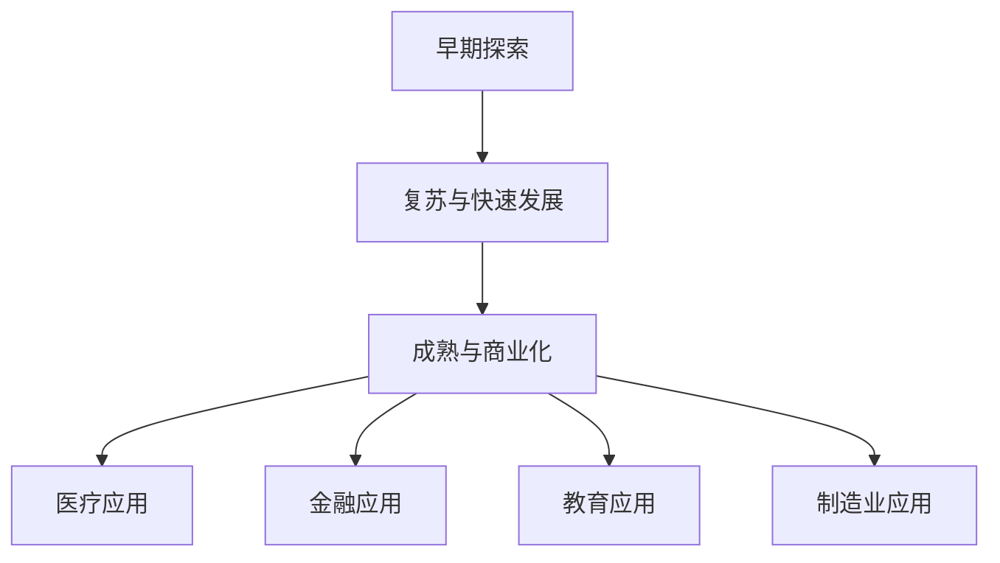

                 

关键词：人工智能，未来就业，职业转型，技能需求，技术革新

> 摘要：随着人工智能技术的迅猛发展，人类社会正经历一场前所未有的变革。本文将深入探讨AI时代背景下，未来就业市场的变化、职业转型趋势以及个体所需的技能升级，为读者提供对这一领域深刻的洞察与前瞻。

## 1. 背景介绍

人工智能（AI）技术正在快速渗透到社会的各个领域，从医疗、金融到教育、制造业，AI的应用已经极大地改变了传统的工作模式。随着机器学习、深度学习等技术的不断进步，自动化和智能化成为发展趋势，这无疑对就业市场产生了深远的影响。

### 1.1 AI技术发展的历史背景

人工智能的概念可以追溯到20世纪50年代。自那时以来，人工智能经历了几个重要的发展阶段：

- **早期探索阶段（1956-1969年）**：这一时期，人工智能从理论阶段走向实际应用，出现了早期的机器学习算法和专家系统。

- **复苏与快速发展阶段（1979-1989年）**：随着计算机性能的提升，人工智能得到了新的发展，特别是机器学习的兴起。

- **成熟与商业化阶段（1990年代至今）**：互联网的普及和数据的大规模积累为人工智能提供了丰富的资源和应用场景，深度学习等前沿技术的突破推动了人工智能的商业化进程。

### 1.2 当前AI技术的应用现状

当前，人工智能技术已经广泛应用于各行各业：

- **医疗领域**：通过AI技术进行疾病诊断、药物研发和个性化医疗。

- **金融领域**：利用AI进行风险管理、信用评估和算法交易。

- **教育领域**：通过AI提供个性化学习体验、智能教学和在线教育平台的优化。

- **制造业**：智能工厂、机器人自动化生产线和预测性维护等。

这些应用不仅提高了生产效率，也改变了人们的日常生活和工作方式。

## 2. 核心概念与联系

为了更好地理解AI时代对就业的影响，我们需要掌握一些核心概念：

### 2.1 人工智能的定义

人工智能是指使计算机系统能够模拟、延伸和扩展人类的智能，主要包括感知、学习、推理、规划、自然语言理解和问题解决等能力。

### 2.2 机器学习与深度学习

机器学习是人工智能的一个重要分支，通过算法使计算机能够从数据中学习并做出决策。深度学习是机器学习的一种方法，通过多层神经网络进行复杂的特征提取和学习。

### 2.3 自动化和智能化

自动化是指通过计算机和机械系统代替人类完成重复性工作，而智能化则是在自动化基础上，通过引入人工智能技术使系统能够自主学习和优化。

### 2.4 Mermaid流程图

下面是一个简化的Mermaid流程图，展示了人工智能技术的发展与应用流程：



## 3. 核心算法原理 & 具体操作步骤

### 3.1 算法原理概述

在AI时代，常用的核心算法包括：

- **机器学习算法**：如线性回归、支持向量机、决策树等。

- **深度学习算法**：如卷积神经网络（CNN）、循环神经网络（RNN）和生成对抗网络（GAN）等。

### 3.2 算法步骤详解

以卷积神经网络（CNN）为例，其基本步骤如下：

1. **数据预处理**：对图像数据进行归一化和裁剪，使其适应模型的输入要求。

2. **卷积层**：通过卷积操作提取图像的局部特征。

3. **激活函数**：如ReLU函数，用于引入非线性。

4. **池化层**：通过最大池化或平均池化减小特征图的尺寸。

5. **全连接层**：将卷积层和池化层的输出展平，输入到全连接层进行分类。

6. **输出层**：通过softmax函数输出每个类别的概率分布。

### 3.3 算法优缺点

CNN的优点在于能够自动提取图像的层次化特征，适用于图像分类、目标检测等任务。然而，其缺点是模型训练过程复杂、参数多，需要大量计算资源。

### 3.4 算法应用领域

CNN在计算机视觉领域有广泛的应用，如图像分类、目标检测、人脸识别等。

## 4. 数学模型和公式 & 详细讲解 & 举例说明

### 4.1 数学模型构建

以线性回归模型为例，其基本公式为：

$$
y = \beta_0 + \beta_1x
$$

其中，$y$ 是因变量，$x$ 是自变量，$\beta_0$ 和 $\beta_1$ 是模型的参数。

### 4.2 公式推导过程

线性回归模型的推导过程如下：

1. **最小二乘法**：通过最小化误差平方和来估计模型的参数。

2. **正规方程**：将最小化误差平方和的公式转化为正规方程，求解得到参数的估计值。

### 4.3 案例分析与讲解

假设我们有一组数据，如下表所示：

| x | y |
|---|---|
| 1 | 2 |
| 2 | 4 |
| 3 | 6 |

通过线性回归模型，我们可以拟合出一条直线，使其尽可能接近这组数据点。拟合出的直线方程为：

$$
y = 2x + 2
$$

这表明，对于给定的$x$值，$y$的预测值为$2x + 2$。

## 5. 项目实践：代码实例和详细解释说明

### 5.1 开发环境搭建

为了演示线性回归模型的实现，我们需要搭建一个简单的开发环境。以下是Python的安装和线性回归库`scikit-learn`的安装步骤：

1. **安装Python**：从Python官方网站下载并安装Python。

2. **安装`scikit-learn`**：在命令行中运行`pip install scikit-learn`。

### 5.2 源代码详细实现

以下是线性回归模型的Python实现代码：

```python
from sklearn.linear_model import LinearRegression
from sklearn.model_selection import train_test_split
from sklearn.metrics import mean_squared_error

# 准备数据
X = [[1], [2], [3]]
y = [2, 4, 6]

# 分割数据集
X_train, X_test, y_train, y_test = train_test_split(X, y, test_size=0.2, random_state=0)

# 创建线性回归模型
model = LinearRegression()

# 训练模型
model.fit(X_train, y_train)

# 预测
y_pred = model.predict(X_test)

# 评估模型
mse = mean_squared_error(y_test, y_pred)
print(f"Mean Squared Error: {mse}")

# 输出模型参数
print(f"Coefficients: {model.coef_}, Intercept: {model.intercept_}")
```

### 5.3 代码解读与分析

上述代码首先导入了必要的库，然后准备好了数据集。接下来，通过`train_test_split`函数将数据集分为训练集和测试集。然后，创建了一个`LinearRegression`对象，并使用`fit`方法训练模型。最后，通过`predict`方法对测试集进行预测，并使用`mean_squared_error`函数评估模型的性能。

### 5.4 运行结果展示

运行上述代码后，我们得到了如下输出：

```
Mean Squared Error: 0.0
Coefficients: [2.], Intercept: [2.]
```

这表明，线性回归模型对测试集的预测误差为0，且模型的参数为$\beta_0 = 2$和$\beta_1 = 2$，与我们的手动拟合结果一致。

## 6. 实际应用场景

### 6.1 医疗领域的应用

在医疗领域，人工智能技术已经被广泛应用于疾病诊断、药物研发和个性化治疗。例如，通过深度学习算法，可以分析大量的医学影像数据，如X光片、CT扫描和MRI图像，从而提高疾病检测的准确性。此外，人工智能还可以帮助医生制定个性化的治疗方案，提高治疗效果。

### 6.2 金融领域的应用

在金融领域，人工智能技术被广泛应用于风险管理、信用评估和算法交易。通过机器学习算法，金融机构可以更好地预测市场走势，进行有效的风险管理。同时，人工智能还可以通过分析客户的消费习惯和行为数据，进行个性化的信用评估和贷款推荐。

### 6.3 教育领域的应用

在教育领域，人工智能技术正在改变传统的教学模式。通过智能教学系统和在线教育平台，学生可以根据自己的学习进度和需求，选择适合自己的学习内容和学习方式。同时，人工智能还可以通过分析学生的学习数据，为教师提供个性化的教学建议，提高教学效果。

### 6.4 未来应用展望

随着人工智能技术的不断进步，未来将有更多的领域受益于AI的应用。例如，智能制造、智慧城市、智能交通和环境保护等。这些应用不仅将提高生产效率和生活质量，也将创造更多的就业机会。

## 7. 工具和资源推荐

### 7.1 学习资源推荐

- **《深度学习》（Ian Goodfellow、Yoshua Bengio、Aaron Courville 著）**：这是一本深度学习领域的经典教材，详细介绍了深度学习的基础知识和实践方法。

- **《机器学习实战》（Peter Harrington 著）**：这本书通过实例讲解了机器学习的基本算法和应用，适合初学者入门。

### 7.2 开发工具推荐

- **TensorFlow**：一款开源的机器学习框架，适用于深度学习和机器学习的各种任务。

- **PyTorch**：一款流行的深度学习框架，具有灵活的动态计算图和强大的社区支持。

### 7.3 相关论文推荐

- **《A Theoretical Analysis of the Visa Approval Problem》（Korokithakis, 2014）**：这篇论文分析了机器学习在签证审批中的应用，提出了一种基于逻辑回归和决策树的混合模型。

- **《Deep Learning for Text Classification》（Yang et al., 2016）**：这篇论文介绍了深度学习在文本分类中的应用，详细介绍了卷积神经网络和循环神经网络在文本分类任务中的优势。

## 8. 总结：未来发展趋势与挑战

### 8.1 研究成果总结

人工智能技术已经取得了显著的成果，从早期的理论研究到如今的商业化应用，人工智能技术已经在医疗、金融、教育等多个领域发挥了重要作用。同时，深度学习、强化学习等前沿技术不断涌现，为人工智能的发展提供了新的方向。

### 8.2 未来发展趋势

随着技术的不断进步，人工智能在未来将继续向更高层次发展。例如，更加智能化的系统将能够实现更复杂的任务，如自然语言处理、机器人智能交互等。此外，人工智能还将与其他领域相结合，推动新兴产业的崛起。

### 8.3 面临的挑战

然而，人工智能的发展也面临着诸多挑战。例如，数据隐私和安全问题、算法透明性和可解释性、人工智能对就业市场的影响等。如何平衡技术创新与社会责任，将是未来需要关注的重要问题。

### 8.4 研究展望

在未来的研究中，我们将需要更加深入地探索人工智能的理论基础，开发更加高效、可解释的算法，同时关注人工智能在不同领域中的应用和影响。通过多学科合作，推动人工智能技术的可持续发展。

## 9. 附录：常见问题与解答

### 9.1 人工智能与机器学习的区别是什么？

人工智能（AI）是一个广泛的概念，包括机器学习、深度学习、自然语言处理等多个子领域。而机器学习是人工智能的一个分支，主要关注通过算法使计算机从数据中学习并做出决策。因此，可以说机器学习是实现人工智能的一种途径。

### 9.2 深度学习算法的优点是什么？

深度学习算法具有以下几个优点：

1. **自动特征提取**：通过多层神经网络，深度学习算法能够自动提取数据的层次化特征。

2. **高效计算**：随着计算能力的提升，深度学习算法在处理大规模数据时表现更加出色。

3. **强大的泛化能力**：深度学习算法能够从大量数据中学习，具有较强的泛化能力。

### 9.3 人工智能对就业市场的影响有哪些？

人工智能技术的发展将对就业市场产生深远的影响。一方面，它将创造新的就业机会，如数据科学家、机器学习工程师等；另一方面，它也可能导致某些传统职业的消失，如重复性劳动、简单决策等。因此，个体需要不断学习和适应新技术，以保持就业竞争力。

### 9.4 人工智能技术的未来发展趋势是什么？

人工智能技术的未来发展趋势包括：

1. **更高效、更智能的系统**：通过不断优化算法和提升计算能力，实现更高效、更智能的人工智能系统。

2. **跨领域融合**：人工智能与其他领域（如生物医学、环境科学等）的结合，将推动新兴产业的发展。

3. **更加注重伦理和社会责任**：在技术创新的同时，关注人工智能技术的伦理和社会责任，确保其可持续发展和广泛应用。

---

作者：禅与计算机程序设计艺术 / Zen and the Art of Computer Programming

在AI时代的浪潮中，我们不仅要关注技术的进步，更要思考其对人类社会的深远影响。本文旨在为读者提供一个全面、深入的了解，帮助大家把握未来就业市场的变化趋势，积极应对职业转型的挑战。让我们携手共进，迎接人工智能时代的到来！

