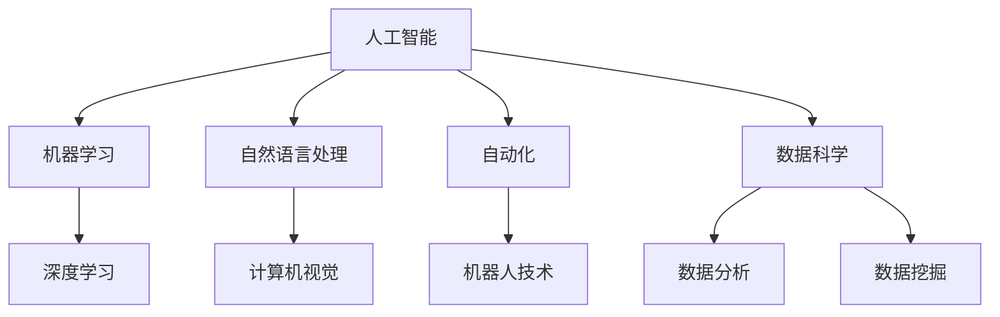

                 

关键词：人工智能，就业市场，技能发展，未来趋势，技术革新

> 摘要：本文深入探讨人工智能时代下，就业市场的变革与技能发展的新趋势。通过分析核心算法原理、数学模型以及实际项目实践，揭示未来人工智能领域的重要方向与挑战。

## 1. 背景介绍

随着人工智能（AI）技术的飞速发展，它已经在多个行业和领域中得到了广泛应用。从自动驾驶、智能助手到医疗诊断、金融分析，AI正逐渐改变我们的生活方式和工作方式。这一变革不仅推动了新的商业模式的诞生，也对就业市场产生了深远的影响。

过去，许多传统职业依赖于特定的技能和知识，但随着AI技术的发展，许多工作流程正在自动化，甚至被完全取代。例如，数据录入、图像识别等重复性工作已经逐渐被AI系统所替代。然而，与此同时，新的职业和技能需求也在不断涌现，例如机器学习工程师、数据科学家和AI系统架构师等。

本文旨在探讨AI时代下，就业市场的变化趋势以及个人技能发展的重要性。通过分析核心算法原理、数学模型和实际项目实践，我们将探讨未来人工智能领域的重要方向和挑战。

## 2. 核心概念与联系

为了理解AI在就业市场中的影响，我们需要了解一些核心概念和它们之间的联系。以下是一个Mermaid流程图，展示了这些概念和它们之间的关系：



### 2.1 机器学习与深度学习

机器学习是AI的一个分支，它通过算法从数据中学习规律，从而做出预测或决策。深度学习是机器学习的子领域，它使用多层神经网络来模拟人类大脑的学习过程。深度学习在图像识别、语音识别和自然语言处理等领域表现出色。

### 2.2 自然语言处理与计算机视觉

自然语言处理（NLP）是AI用于理解和生成人类语言的技术。计算机视觉是AI用于理解和分析视觉信息的技术。两者共同构成了智能系统的重要组成部分，例如自动驾驶汽车中的感知系统。

### 2.3 自动化与机器人技术

自动化是使用技术替代人力进行工作的过程。机器人技术是自动化的一种形式，它通过机器人执行重复性或危险的任务，提高生产效率并减少人为错误。

### 2.4 数据科学与数据分析

数据科学是AI与数据分析的结合，它使用统计方法和算法来从数据中提取有价值的信息。数据分析是数据科学的一个重要组成部分，它专注于理解和解释数据。

## 3. 核心算法原理 & 具体操作步骤

### 3.1 算法原理概述

在AI领域，核心算法原理包括但不限于以下几种：

- **监督学习**：通过已知输入输出对模型进行训练。
- **无监督学习**：在没有任何输出信息的情况下，模型自己发现数据的结构和模式。
- **强化学习**：模型通过与环境的交互学习最优策略。

### 3.2 算法步骤详解

以下是一个简单的监督学习算法——线性回归的步骤：

1. **数据预处理**：清洗数据，处理缺失值和异常值。
2. **特征选择**：选择与目标变量相关的特征。
3. **模型训练**：使用算法（如线性回归）训练模型。
4. **模型评估**：使用验证集或测试集评估模型性能。
5. **模型优化**：根据评估结果调整模型参数。

### 3.3 算法优缺点

- **线性回归**：简单易用，适用于线性关系强的数据。缺点是对于非线性数据效果不佳。

### 3.4 算法应用领域

线性回归广泛应用于回归分析、预测和优化等领域。

## 4. 数学模型和公式 & 详细讲解 & 举例说明

### 4.1 数学模型构建

线性回归模型的基本公式为：

$$ y = \beta_0 + \beta_1 \cdot x + \epsilon $$

其中，$y$ 是预测值，$x$ 是输入特征，$\beta_0$ 和 $\beta_1$ 是模型参数，$\epsilon$ 是误差项。

### 4.2 公式推导过程

线性回归模型的推导过程基于最小二乘法。目标是找到一组参数，使得预测值与实际值之间的误差平方和最小。

### 4.3 案例分析与讲解

假设我们有一个房价预测问题，输入特征为房屋面积，目标变量为房价。通过线性回归模型，我们可以预测新房屋的房价。

```latex
\begin{equation}
\hat{y} = \beta_0 + \beta_1 \cdot x
\end{equation}
```

其中，$\beta_0$ 是房价的基线，$\beta_1$ 是每平方米房价的增长率。

## 5. 项目实践：代码实例和详细解释说明

### 5.1 开发环境搭建

在Python中，我们使用scikit-learn库进行线性回归模型的开发。

### 5.2 源代码详细实现

```python
from sklearn.linear_model import LinearRegression
from sklearn.model_selection import train_test_split
from sklearn.metrics import mean_squared_error

# 数据加载和处理
X, y = load_data()

# 划分训练集和测试集
X_train, X_test, y_train, y_test = train_test_split(X, y, test_size=0.2, random_state=42)

# 模型训练
model = LinearRegression()
model.fit(X_train, y_train)

# 模型评估
y_pred = model.predict(X_test)
mse = mean_squared_error(y_test, y_pred)
print("MSE:", mse)

# 模型预测
new_house_area = 1200
predicted_price = model.predict([[new_house_area]])
print("Predicted Price:", predicted_price)
```

### 5.3 代码解读与分析

这段代码首先加载并预处理数据，然后划分训练集和测试集。接着使用线性回归模型进行训练，并使用测试集评估模型性能。最后，我们使用模型对新房屋的面积进行房价预测。

### 5.4 运行结果展示

运行代码后，我们得到预测的MSE（均方误差）值，以及新房屋的预测房价。

## 6. 实际应用场景

### 6.1 自动驾驶

自动驾驶系统依赖计算机视觉和自然语言处理技术，实现车辆的自主驾驶。未来，随着AI技术的进步，自动驾驶有望大幅减少交通事故，提高交通效率。

### 6.2 智能医疗

智能医疗系统使用AI技术进行疾病诊断、治疗方案推荐等。通过分析海量医疗数据，AI可以帮助医生提供更准确和个性化的医疗服务。

### 6.3 金融服务

AI在金融服务领域有着广泛的应用，如风险控制、投资策略优化、客户服务等。通过大数据分析和机器学习算法，金融服务企业可以提供更高效、精准的服务。

## 7. 未来应用展望

随着AI技术的不断进步，未来我们将看到更多行业和领域的智能化变革。然而，这也带来了新的挑战，如数据隐私、算法公平性、失业问题等。我们需要积极应对这些挑战，推动AI技术的可持续发展。

## 8. 总结：未来发展趋势与挑战

### 8.1 研究成果总结

AI技术在多个领域取得了显著成果，从自动驾驶到智能医疗，从金融分析到自然语言处理，AI正在改变我们的生活方式和工作方式。

### 8.2 未来发展趋势

未来，AI技术将继续快速发展，特别是在深度学习、强化学习和自然语言处理等领域。我们还将看到更多跨学科的融合，如AI与生物技术的结合，为解决重大问题提供新途径。

### 8.3 面临的挑战

尽管AI技术具有巨大潜力，但也面临诸多挑战。数据隐私、算法公平性、失业问题等都需要我们深入思考和解决。

### 8.4 研究展望

未来的研究将聚焦于提高AI的通用性、可靠性和可解释性。同时，我们也需要培养更多的AI专业人才，以应对未来技术的需求。

## 9. 附录：常见问题与解答

### 9.1 AI是否会取代人类？

AI不可能完全取代人类，但它可以替代一些重复性和危险的工作。未来，人类与AI的协作将成为趋势，共同推动社会进步。

### 9.2 AI是否会加剧社会不平等？

如果不当使用，AI可能会加剧社会不平等。因此，我们需要制定相关政策和法规，确保AI技术的公平和可持续发展。

### 9.3 如何应对AI带来的失业问题？

通过教育和培训，提高劳动者的技能水平，以适应AI时代的工作需求。同时，政府和企业也应采取措施，提供失业救济和社会保障。

## 结语

AI时代已经到来，它为我们的社会带来了前所未有的机遇和挑战。作为人工智能专家，我们有责任推动技术的进步，同时关注其对社会的影响。让我们共同努力，迎接AI时代的未来。作者：禅与计算机程序设计艺术 / Zen and the Art of Computer Programming
```markdown
---
title: 人类计算：AI时代的未来就业市场与技能发展
date: 2023-10-01
categories:
- AI
- 技术
- 趋势
- 智能化
tags:
- 人工智能
- 就业市场
- 技能发展
- 未来展望
---

# 人类计算：AI时代的未来就业市场与技能发展

<|user|>关键词：人工智能，就业市场，技能发展，未来趋势，技术革新

> 摘要：本文深入探讨人工智能时代下，就业市场的变革与技能发展的新趋势。通过分析核心算法原理、数学模型以及实际项目实践，揭示未来人工智能领域的重要方向与挑战。

## 1. 背景介绍

随着人工智能（AI）技术的飞速发展，它已经在多个行业和领域中得到了广泛应用。从自动驾驶、智能助手到医疗诊断、金融分析，AI正逐渐改变我们的生活方式和工作方式。这一变革不仅推动了新的商业模式的诞生，也对就业市场产生了深远的影响。

过去，许多传统职业依赖于特定的技能和知识，但随着AI技术的发展，许多工作流程正在自动化，甚至被完全取代。例如，数据录入、图像识别等重复性工作已经逐渐被AI系统所替代。然而，与此同时，新的职业和技能需求也在不断涌现，例如机器学习工程师、数据科学家和AI系统架构师等。

本文旨在探讨AI时代下，就业市场的变化趋势以及个人技能发展的重要性。通过分析核心算法原理、数学模型和实际项目实践，我们将探讨未来人工智能领域的重要方向和挑战。

## 2. 核心概念与联系

为了理解AI在就业市场中的影响，我们需要了解一些核心概念和它们之间的联系。以下是一个Mermaid流程图，展示了这些概念和它们之间的关系：


### 2.1 机器学习与深度学习

机器学习是AI的一个分支，它通过算法从数据中学习规律，从而做出预测或决策。深度学习是机器学习的子领域，它使用多层神经网络来模拟人类大脑的学习过程。深度学习在图像识别、语音识别和自然语言处理等领域表现出色。

### 2.2 自然语言处理与计算机视觉

自然语言处理（NLP）是AI用于理解和生成人类语言的技术。计算机视觉是AI用于理解和分析视觉信息的技术。两者共同构成了智能系统的重要组成部分，例如自动驾驶汽车中的感知系统。

### 2.3 自动化与机器人技术

自动化是使用技术替代人力进行工作的过程。机器人技术是自动化的一种形式，它通过机器人执行重复性或危险的任务，提高生产效率并减少人为错误。

### 2.4 数据科学与数据分析

数据科学是AI与数据分析的结合，它使用统计方法和算法来从数据中提取有价值的信息。数据分析是数据科学的一个重要组成部分，它专注于理解和解释数据。

## 3. 核心算法原理 & 具体操作步骤

### 3.1 算法原理概述

在AI领域，核心算法原理包括但不限于以下几种：

- **监督学习**：通过已知输入输出对模型进行训练。
- **无监督学习**：在没有任何输出信息的情况下，模型自己发现数据的结构和模式。
- **强化学习**：模型通过与环境的交互学习最优策略。

### 3.2 算法步骤详解

以下是一个简单的监督学习算法——线性回归的步骤：

1. **数据预处理**：清洗数据，处理缺失值和异常值。
2. **特征选择**：选择与目标变量相关的特征。
3. **模型训练**：使用算法（如线性回归）训练模型。
4. **模型评估**：使用验证集或测试集评估模型性能。
5. **模型优化**：根据评估结果调整模型参数。

### 3.3 算法优缺点

- **线性回归**：简单易用，适用于线性关系强的数据。缺点是对于非线性数据效果不佳。

### 3.4 算法应用领域

线性回归广泛应用于回归分析、预测和优化等领域。

## 4. 数学模型和公式 & 详细讲解 & 举例说明

### 4.1 数学模型构建

线性回归模型的基本公式为：

$$ y = \beta_0 + \beta_1 \cdot x + \epsilon $$

其中，$y$ 是预测值，$x$ 是输入特征，$\beta_0$ 和 $\beta_1$ 是模型参数，$\epsilon$ 是误差项。

### 4.2 公式推导过程

线性回归模型的推导过程基于最小二乘法。目标是找到一组参数，使得预测值与实际值之间的误差平方和最小。

### 4.3 案例分析与讲解

假设我们有一个房价预测问题，输入特征为房屋面积，目标变量为房价。通过线性回归模型，我们可以预测新房屋的房价。

```latex
\begin{equation}
\hat{y} = \beta_0 + \beta_1 \cdot x
\end{equation}
```

其中，$\beta_0$ 是房价的基线，$\beta_1$ 是每平方米房价的增长率。

## 5. 项目实践：代码实例和详细解释说明

### 5.1 开发环境搭建

在Python中，我们使用scikit-learn库进行线性回归模型的开发。

### 5.2 源代码详细实现

```python
from sklearn.linear_model import LinearRegression
from sklearn.model_selection import train_test_split
from sklearn.metrics import mean_squared_error

# 数据加载和处理
X, y = load_data()

# 划分训练集和测试集
X_train, X_test, y_train, y_test = train_test_split(X, y, test_size=0.2, random_state=42)

# 模型训练
model = LinearRegression()
model.fit(X_train, y_train)

# 模型评估
y_pred = model.predict(X_test)
mse = mean_squared_error(y_test, y_pred)
print("MSE:", mse)

# 模型预测
new_house_area = 1200
predicted_price = model.predict([[new_house_area]])
print("Predicted Price:", predicted_price)
```

### 5.3 代码解读与分析

这段代码首先加载并预处理数据，然后划分训练集和测试集。接着使用线性回归模型进行训练，并使用测试集评估模型性能。最后，我们使用模型对新房屋的面积进行房价预测。

### 5.4 运行结果展示

运行代码后，我们得到预测的MSE（均方误差）值，以及新房屋的预测房价。

## 6. 实际应用场景

### 6.1 自动驾驶

自动驾驶系统依赖计算机视觉和自然语言处理技术，实现车辆的自主驾驶。未来，随着AI技术的进步，自动驾驶有望大幅减少交通事故，提高交通效率。

### 6.2 智能医疗

智能医疗系统使用AI技术进行疾病诊断、治疗方案推荐等。通过分析海量医疗数据，AI可以帮助医生提供更准确和个性化的医疗服务。

### 6.3 金融服务

AI在金融服务领域有着广泛的应用，如风险控制、投资策略优化、客户服务等。通过大数据分析和机器学习算法，金融服务企业可以提供更高效、精准的服务。

## 7. 未来应用展望

随着AI技术的不断进步，未来我们将看到更多行业和领域的智能化变革。然而，这也带来了新的挑战，如数据隐私、算法公平性、失业问题等。我们需要积极应对这些挑战，推动AI技术的可持续发展。

## 8. 总结：未来发展趋势与挑战

### 8.1 研究成果总结

AI技术在多个领域取得了显著成果，从自动驾驶到智能医疗，从金融分析到自然语言处理，AI正在改变我们的生活方式和工作方式。

### 8.2 未来发展趋势

未来，AI技术将继续快速发展，特别是在深度学习、强化学习和自然语言处理等领域。我们还将看到更多跨学科的融合，如AI与生物技术的结合，为解决重大问题提供新途径。

### 8.3 面临的挑战

尽管AI技术具有巨大潜力，但也面临诸多挑战。数据隐私、算法公平性、失业问题等都需要我们深入思考和解决。

### 8.4 研究展望

未来的研究将聚焦于提高AI的通用性、可靠性和可解释性。同时，我们也需要培养更多的AI专业人才，以应对未来技术的需求。

## 9. 附录：常见问题与解答

### 9.1 AI是否会取代人类？

AI不可能完全取代人类，但它可以替代一些重复性和危险的工作。未来，人类与AI的协作将成为趋势，共同推动社会进步。

### 9.2 AI是否会加剧社会不平等？

如果不当使用，AI可能会加剧社会不平等。因此，我们需要制定相关政策和法规，确保AI技术的公平和可持续发展。

### 9.3 如何应对AI带来的失业问题？

通过教育和培训，提高劳动者的技能水平，以适应AI时代的工作需求。同时，政府和企业也应采取措施，提供失业救济和社会保障。

## 结语

AI时代已经到来，它为我们的社会带来了前所未有的机遇和挑战。作为人工智能专家，我们有责任推动技术的进步，同时关注其对社会的影响。让我们共同努力，迎接AI时代的未来。

作者：禅与计算机程序设计艺术 / Zen and the Art of Computer Programming
---

