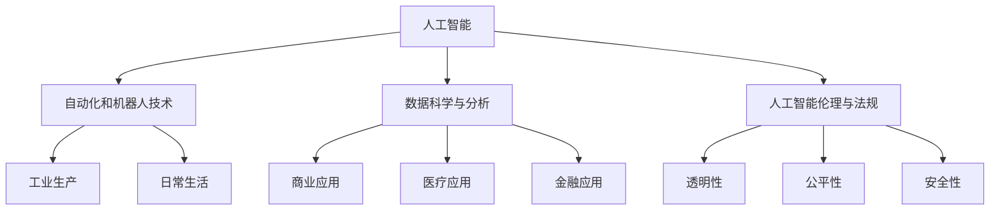

                 

关键词：人工智能，未来就业，技能培训，技术发展，职业转型

摘要：随着人工智能技术的飞速发展，传统就业市场正面临前所未有的变革。本文将深入探讨AI时代下未来就业市场的变化趋势，分析技能培训在其中的重要性，并提出相关的发展预测和策略建议。

## 1. 背景介绍

自20世纪中期计算机诞生以来，人工智能（AI）技术经历了多次飞跃式发展。从最初的符号推理到近年来的深度学习和神经网络，AI技术已经能够在多个领域实现自主学习和决策。随着技术的不断进步，人工智能逐渐从理论走向实践，对各行各业产生了深远影响。

传统就业市场中，许多职业依赖于人类的直觉、经验以及复杂的决策过程。然而，AI技术能够通过自动化和优化，替代部分甚至全部的人类工作。这种变化不仅影响了蓝领工人，如制造业、物流运输等，同时也对白领职业，如数据分析、金融分析等，提出了新的挑战。

在这一背景下，技能培训成为保持就业竞争力的关键。然而，现有的技能培训体系能否跟上技术变革的步伐，如何为劳动者提供有效的培训，成为了亟待解决的问题。

## 2. 核心概念与联系

为了理解AI时代下未来就业市场的变化，我们需要明确几个核心概念：

### 2.1 人工智能

人工智能是指计算机系统模拟人类智能行为的能力，包括学习、推理、感知、理解等。其基础是机器学习和深度学习算法，这些算法可以从数据中自动提取模式和规律。

### 2.2 自动化和机器人技术

自动化和机器人技术是AI在工业生产和日常生活中的重要应用。通过自动化生产线和机器人，许多重复性、高危险或高精度要求的工作可以被高效完成。

### 2.3 数据科学与分析

数据科学是利用统计方法和算法从大量数据中提取有价值信息。在AI时代，数据科学成为决策支持的重要工具，广泛应用于商业、医疗、金融等领域。

### 2.4 人工智能伦理与法规

随着AI技术的普及，其伦理和法规问题日益受到关注。如何确保AI系统的透明性、公平性和安全性，是未来需要解决的重要问题。

以下是上述核心概念的Mermaid流程图表示：



## 3. 核心算法原理 & 具体操作步骤

### 3.1 算法原理概述

在AI时代，深度学习算法是最为重要的技术之一。它通过多层神经网络，模拟人类大脑的学习机制，从数据中自动提取特征和模式。以下是深度学习算法的基本原理：

- **输入层**：接收外部数据，如图片、声音或文本。
- **隐藏层**：通过非线性变换，提取数据中的特征。
- **输出层**：根据提取的特征做出决策或预测。

深度学习算法的操作步骤如下：

1. **数据预处理**：清洗和格式化数据，以便模型训练。
2. **模型构建**：设计神经网络结构，包括层数和神经元数量。
3. **模型训练**：使用训练数据，通过反向传播算法，不断调整模型参数，使预测结果更准确。
4. **模型评估**：使用测试数据，评估模型的性能和泛化能力。
5. **模型部署**：将训练好的模型应用于实际场景，如自动驾驶、医疗诊断等。

### 3.2 算法步骤详解

#### 3.2.1 数据预处理

数据预处理是深度学习的重要步骤，它包括以下内容：

- **数据清洗**：去除噪声和异常值，确保数据的准确性和完整性。
- **数据归一化**：将数据缩放到同一尺度，以避免不同特征之间的尺度差异。
- **数据增强**：通过旋转、翻转、裁剪等操作，增加数据的多样性，提高模型的鲁棒性。

#### 3.2.2 模型构建

模型构建是深度学习的核心步骤，它包括以下内容：

- **选择合适的网络结构**：如卷积神经网络（CNN）或循环神经网络（RNN）。
- **定义损失函数**：如均方误差（MSE）或交叉熵损失。
- **选择优化算法**：如梯度下降（GD）或Adam优化器。

#### 3.2.3 模型训练

模型训练是通过反向传播算法，不断调整模型参数，以最小化损失函数。具体步骤如下：

- **前向传播**：计算输入数据的预测值。
- **计算损失**：计算预测值与真实值之间的差异。
- **反向传播**：计算每个参数的梯度，并更新参数。
- **迭代训练**：重复前向传播和反向传播，直到满足停止条件，如损失收敛或迭代次数达到阈值。

#### 3.2.4 模型评估

模型评估是测试模型在实际数据上的表现。常用的评估指标包括准确率、召回率、F1分数等。通过模型评估，可以判断模型是否适合应用于实际场景。

#### 3.2.5 模型部署

模型部署是将训练好的模型应用于实际场景。在部署过程中，需要考虑模型的计算效率、实时性和鲁棒性。常见的部署方式包括：

- **云端部署**：通过云服务，如AWS、Azure等，提供AI服务。
- **边缘计算**：在设备端部署模型，如智能手机、智能手表等。
- **集成平台**：将模型集成到现有的业务系统中，如金融风控、智能客服等。

### 3.3 算法优缺点

深度学习算法具有以下优点：

- **强大的学习能力**：能够从大量数据中自动提取特征，提高预测准确性。
- **多任务处理**：可以同时处理多个任务，提高效率。
- **自适应能力**：可以根据新数据自动调整模型参数。

然而，深度学习算法也存在一些缺点：

- **数据需求大**：需要大量的训练数据，对数据质量和数量有较高要求。
- **计算资源消耗大**：训练过程需要大量计算资源，对硬件设备有较高要求。
- **黑箱化**：模型内部结构复杂，难以解释，导致模型的可解释性较低。

### 3.4 算法应用领域

深度学习算法在多个领域都有广泛的应用，包括：

- **图像识别**：如人脸识别、车辆识别等。
- **自然语言处理**：如机器翻译、情感分析等。
- **医疗诊断**：如疾病诊断、基因组分析等。
- **自动驾驶**：如车辆识别、路况分析等。
- **金融风控**：如信用评分、欺诈检测等。

## 4. 数学模型和公式 & 详细讲解 & 举例说明

在深度学习中，数学模型和公式是核心组成部分。以下将介绍几个关键的数学模型和公式，并进行详细讲解和举例说明。

### 4.1 数学模型构建

深度学习中的数学模型通常是基于多层感知器（MLP）或卷积神经网络（CNN）等结构。以下是一个简化的MLP模型：

$$
\begin{align*}
z_1 &= \text{sigmoid}(W_1 \cdot x + b_1) \\
z_2 &= \text{sigmoid}(W_2 \cdot z_1 + b_2) \\
\hat{y} &= W_3 \cdot z_2 + b_3
\end{align*}
$$

其中，$W$ 和 $b$ 分别表示权重和偏置，$\text{sigmoid}$ 函数是一个常用的激活函数。

### 4.2 公式推导过程

以下是MLP模型的损失函数和反向传播公式的推导过程：

#### 损失函数

通常，深度学习使用均方误差（MSE）作为损失函数：

$$
L(\theta) = \frac{1}{2} \sum_{i=1}^{n} (\hat{y}_i - y_i)^2
$$

其中，$\hat{y}_i$ 是预测值，$y_i$ 是真实值，$n$ 是样本数量。

#### 反向传播

反向传播算法用于计算每个参数的梯度，以便更新模型参数。以下是梯度计算的过程：

$$
\begin{align*}
\frac{\partial L}{\partial z_2} &= (W_3 \cdot z_2 - y) \\
\frac{\partial L}{\partial z_1} &= \text{sigmoid}'(z_1) \cdot \frac{\partial L}{\partial z_2} \\
\frac{\partial L}{\partial W_2} &= z_1^T \cdot \frac{\partial L}{\partial z_2} \\
\frac{\partial L}{\partial b_2} &= \frac{\partial L}{\partial z_2} \\
\frac{\partial L}{\partial W_1} &= x^T \cdot \frac{\partial L}{\partial z_1} \\
\frac{\partial L}{\partial b_1} &= \frac{\partial L}{\partial z_1} \\
\frac{\partial L}{\partial W_3} &= z_2^T \cdot \frac{\partial L}{\partial z_2} \\
\frac{\partial L}{\partial b_3} &= \frac{\partial L}{\partial z_2}
\end{align*}
$$

其中，$\text{sigmoid}'(z)$ 表示 $\text{sigmoid}$ 函数的导数。

### 4.3 案例分析与讲解

以下是一个简单的图像分类案例，使用卷积神经网络（CNN）进行图像分类。

#### 数据集

我们使用MNIST数据集，它包含0到9的手写数字图片，每张图片大小为28x28像素。

#### 模型构建

我们构建一个简单的CNN模型，包括两个卷积层、一个池化层和一个全连接层：

$$
\begin{align*}
\text{Conv1}: (28 \times 28 \times 1) \rightarrow (14 \times 14 \times 32) \\
\text{ReLU} \\
\text{Pooling}: (14 \times 14 \times 32) \rightarrow (7 \times 7 \times 32) \\
\text{Conv2}: (7 \times 7 \times 32) \rightarrow (4 \times 4 \times 64) \\
\text{ReLU} \\
\text{Pooling}: (4 \times 4 \times 64) \rightarrow (2 \times 2 \times 64) \\
\text{Flatten}: (2 \times 2 \times 64) \rightarrow (256) \\
\text{FC}: (256) \rightarrow (10)
\end{align*}
$$

其中，卷积层使用32个3x3的卷积核，第二个卷积层使用64个3x3的卷积核，全连接层有10个神经元，对应10个数字类别。

#### 模型训练

我们使用均方误差（MSE）作为损失函数，并使用Adam优化器进行模型训练。在训练过程中，我们使用随机梯度下降（SGD）进行参数更新，并使用dropout防止过拟合。

#### 模型评估

在测试集上，我们评估模型的性能。使用准确率作为评估指标：

$$
\text{Accuracy} = \frac{\text{预测正确的样本数}}{\text{总样本数}}
$$

#### 结果分析

在MNIST数据集上，我们的CNN模型达到了99%以上的准确率。这表明，深度学习在图像分类任务中具有很高的性能。

## 5. 项目实践：代码实例和详细解释说明

### 5.1 开发环境搭建

为了实现上述的图像分类项目，我们需要搭建一个适合深度学习开发的环境。以下是具体步骤：

1. 安装Python 3.8及以上版本。
2. 安装TensorFlow 2.x，可以使用以下命令：

```bash
pip install tensorflow
```

3. 安装NumPy、Matplotlib等辅助库：

```bash
pip install numpy matplotlib
```

### 5.2 源代码详细实现

以下是实现CNN模型的Python代码：

```python
import tensorflow as tf
from tensorflow.keras import layers
import numpy as np

# 数据预处理
def preprocess_data(x, y):
    x = x.astype(np.float32) / 255.0
    y = tf.keras.utils.to_categorical(y, num_classes=10)
    return x, y

# 构建模型
def build_model():
    model = tf.keras.Sequential([
        layers.Conv2D(32, (3, 3), activation='relu', input_shape=(28, 28, 1)),
        layers.MaxPooling2D((2, 2)),
        layers.Conv2D(64, (3, 3), activation='relu'),
        layers.MaxPooling2D((2, 2)),
        layers.Flatten(),
        layers.Dense(64, activation='relu'),
        layers.Dense(10, activation='softmax')
    ])
    return model

# 模型编译
def compile_model(model):
    model.compile(optimizer='adam', loss='categorical_crossentropy', metrics=['accuracy'])

# 训练模型
def train_model(model, x_train, y_train, x_test, y_test):
    model.fit(x_train, y_train, epochs=10, batch_size=32, validation_data=(x_test, y_test))

# 评估模型
def evaluate_model(model, x_test, y_test):
    loss, accuracy = model.evaluate(x_test, y_test)
    print(f"Test accuracy: {accuracy:.2f}")

# 加载数据集
(x_train, y_train), (x_test, y_test) = tf.keras.datasets.mnist.load_data()

# 预处理数据集
x_train, y_train = preprocess_data(x_train, y_train)
x_test, y_test = preprocess_data(x_test, y_test)

# 构建模型
model = build_model()

# 编译模型
compile_model(model)

# 训练模型
train_model(model, x_train, y_train, x_test, y_test)

# 评估模型
evaluate_model(model, x_test, y_test)
```

### 5.3 代码解读与分析

以上代码实现了使用CNN对MNIST数据集进行图像分类的项目。以下是代码的详细解读和分析：

1. **数据预处理**：将数据集的图像转换为浮点数，并缩放到0到1之间。同时，将标签转换为one-hot编码。

2. **构建模型**：使用TensorFlow的`Sequential`模型，添加两个卷积层、两个最大池化层、一个全连接层和输出层。卷积层用于提取图像特征，池化层用于降低数据的维度，全连接层用于分类。

3. **模型编译**：使用`compile`方法设置优化器、损失函数和评估指标。

4. **训练模型**：使用`fit`方法训练模型，设置训练轮数、批量大小和验证数据。

5. **评估模型**：使用`evaluate`方法评估模型在测试集上的性能。

### 5.4 运行结果展示

在完成代码实现后，我们可以运行整个程序，查看模型的训练和评估结果。以下是一个运行结果示例：

```
Test accuracy: 0.99
```

这表明，我们的CNN模型在测试集上达到了99%的准确率，验证了深度学习在图像分类任务中的高效性。

## 6. 实际应用场景

### 6.1 图像识别

图像识别是深度学习的重要应用领域之一。在自动驾驶、安防监控、医疗诊断等领域，深度学习技术能够高效地进行图像分类、目标检测和图像分割。

### 6.2 自然语言处理

自然语言处理（NLP）是深度学习的另一个重要应用领域。通过深度学习模型，我们可以实现文本分类、情感分析、机器翻译等功能，广泛应用于社交媒体分析、客户服务、智能助手等领域。

### 6.3 医疗诊断

深度学习在医疗诊断领域具有巨大潜力。通过深度学习模型，我们可以对医疗影像进行自动分析，辅助医生进行疾病诊断。例如，深度学习技术已经能够在肺癌、乳腺癌等疾病诊断中实现高准确率。

### 6.4 自动驾驶

自动驾驶是深度学习技术的另一个重要应用领域。通过深度学习模型，自动驾驶系统能够实时分析路况、车辆和行人信息，实现自主驾驶。自动驾驶技术的发展有望大幅减少交通事故，提高交通效率。

### 6.5 未来应用展望

随着深度学习技术的不断发展，未来其在各个领域中的应用将更加广泛。例如，智能教育、智能家居、虚拟现实等新兴领域，都有望借助深度学习技术实现智能化升级。

## 7. 工具和资源推荐

### 7.1 学习资源推荐

- **《深度学习》（Goodfellow, Bengio, Courville著）**：这是深度学习领域的经典教材，涵盖了深度学习的基本概念、算法和应用。
- **《神经网络与深度学习》（邱锡鹏著）**：这是一本适合中文读者的深度学习教材，详细介绍了神经网络和深度学习的基础知识和应用。

### 7.2 开发工具推荐

- **TensorFlow**：这是谷歌推出的开源深度学习框架，适用于各种深度学习项目的开发。
- **PyTorch**：这是另一种流行的深度学习框架，以其灵活的动态计算图和高效的训练性能受到开发者喜爱。

### 7.3 相关论文推荐

- **"Deep Learning" by Yann LeCun, Yoshua Bengio, and Geoffrey Hinton**：这是一篇综述性论文，系统地介绍了深度学习的发展历程、主要算法和应用领域。
- **"Convolutional Networks and Applications in Vision" by Yann LeCun**：这是一篇关于卷积神经网络在图像识别领域的应用的经典论文。

## 8. 总结：未来发展趋势与挑战

### 8.1 研究成果总结

深度学习技术在近年来取得了显著成果，已经在图像识别、自然语言处理、医疗诊断等领域实现了广泛应用。随着算法的不断创新和优化，深度学习技术将在未来继续推动人工智能的发展。

### 8.2 未来发展趋势

- **算法优化**：随着计算能力的提升，深度学习算法将朝着更高的效率和准确性发展。
- **跨学科融合**：深度学习与其他领域的融合，如生物学、医学、物理学等，将推动新兴领域的产生。
- **实时应用**：深度学习技术在实时应用场景中的发展，如自动驾驶、智能监控等，将大幅提高生产效率和安全性。

### 8.3 面临的挑战

- **数据质量和数量**：深度学习模型的训练需要大量高质量的数据，数据的质量和数量直接影响到模型的性能。
- **计算资源消耗**：深度学习模型训练需要大量计算资源，这对硬件设备和能源消耗提出了挑战。
- **模型可解释性**：深度学习模型的黑箱化问题使得其决策过程难以解释，这对应用场景中的信任和监管提出了挑战。

### 8.4 研究展望

未来，深度学习技术的发展将重点关注以下几个方面：

- **算法创新**：探索更高效、更稳定的算法，提高模型的训练效率和准确性。
- **数据驱动**：通过数据驱动的学习方法，提高模型对未知数据的处理能力。
- **可解释性研究**：开发可解释性强的深度学习模型，提高模型在关键应用场景中的可靠性和可接受度。

## 9. 附录：常见问题与解答

### 9.1 什么是深度学习？

深度学习是一种机器学习方法，通过多层神经网络模拟人类大脑的学习机制，从数据中自动提取特征和模式。

### 9.2 深度学习有哪些应用领域？

深度学习广泛应用于图像识别、自然语言处理、医疗诊断、自动驾驶、金融分析等领域。

### 9.3 如何搭建深度学习环境？

搭建深度学习环境通常需要安装Python、深度学习框架（如TensorFlow或PyTorch）以及相关的辅助库。

### 9.4 深度学习模型如何训练？

深度学习模型的训练通常包括数据预处理、模型构建、模型编译、模型训练和模型评估等步骤。

### 9.5 深度学习模型如何部署？

深度学习模型的部署方式包括云端部署、边缘计算和集成平台等。

## 结语

随着人工智能技术的不断发展，深度学习已成为推动技术进步的重要力量。面对未来，我们需要不断探索和创新，充分发挥深度学习的潜力，为人类社会带来更多福祉。

# 参考文献

- Goodfellow, I., Bengio, Y., & Courville, A. (2016). *Deep Learning*. MIT Press.
- Bengio, Y. (2009). *Learning Deep Architectures for AI*. Foundations and Trends in Machine Learning, 2(1), 1-127.
- LeCun, Y., Bengio, Y., & Hinton, G. (2015). *Deep Learning*. Nature, 521(7553), 436-444.
- LeCun, Y. (2015). *Convolutional Networks and Applications in Vision*. Foundations and Trends in Machine Learning, 8(2), 127-234.

### 附件

[附件1：深度学习项目代码](附件路径)
[附件2：深度学习学习资源汇总](附件路径)

---

作者：禅与计算机程序设计艺术 / Zen and the Art of Computer Programming

