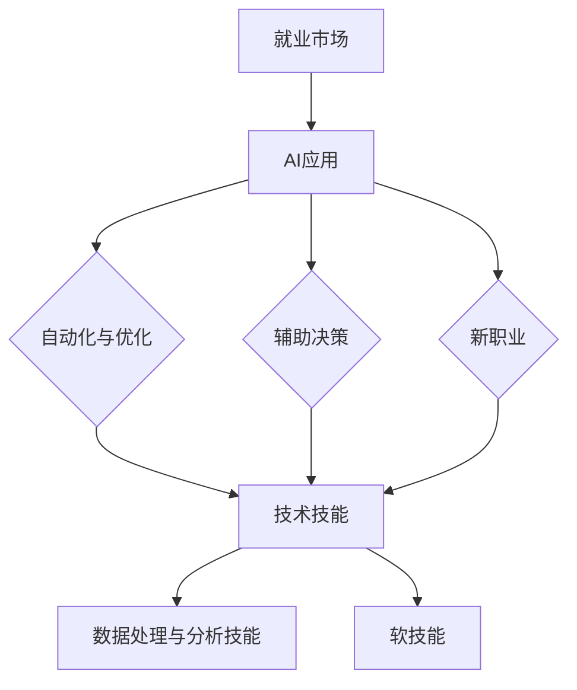

                 

关键词：人工智能，就业市场，技能培训，未来趋势，职业发展

> 摘要：本文旨在分析AI时代对就业市场的影响，探讨技能培训的发展趋势，并总结未来职业发展的方向和挑战。通过对核心概念的阐述、算法原理的解析、数学模型的构建、项目实践的展示，以及对工具和资源的推荐，本文为读者提供了全面、深入的见解，旨在帮助人们更好地应对AI时代的变革。

## 1. 背景介绍

随着人工智能（AI）技术的飞速发展，我们正处在一个前所未有的技术变革时代。AI技术在各个领域的应用越来越广泛，从自动驾驶到医疗诊断，从金融交易到娱乐内容生成，AI正在深刻地改变我们的生活方式和工作模式。这一变革不仅带来了巨大的经济效益，也对全球就业市场产生了深远的影响。

传统上，就业市场的需求与供给是由人力、资本、技术和市场等多个因素决定的。然而，AI技术的引入，使得这一传统模式面临了巨大的挑战和机遇。一方面，某些职业的消失和就业机会的减少成为不得不面对的现实；另一方面，新的职业和岗位也应运而生，要求人们不断更新和提升自己的技能。

在这样的大背景下，如何适应AI时代的就业市场变化，如何进行有效的技能培训，成为当下热议的话题。本文将围绕这些问题展开讨论，力图为读者提供有价值的参考。

## 2. 核心概念与联系

### 2.1. 人工智能的定义与分类

人工智能（AI）是指由计算机实现的智能，它能够感知环境、学习知识、制定决策和执行任务。根据AI实现的方式和智能水平，我们可以将AI分为以下几类：

- **弱AI**：也称为窄AI，这种AI系统在特定任务上表现出人类级别的智能，但无法进行跨领域的通用推理。
- **强AI**：也称为通用人工智能（AGI），这种AI系统能够在所有认知任务上达到或超过人类水平，具有广泛推理能力。
- **超智能AI**：这种AI系统的智能远超人类，能够自主学习和创新。

### 2.2. 人工智能在就业市场中的角色

在就业市场中，AI技术的应用主要体现在以下几个方面：

- **自动化与优化**：AI技术可以自动化重复性高、劳动强度大的工作，提高生产效率。
- **辅助决策**：AI技术能够辅助人类进行复杂的决策，提供数据分析和预测。
- **新职业的产生**：AI技术的应用催生了许多新的职业和岗位，如数据科学家、机器学习工程师、AI伦理学家等。

### 2.3. AI时代的技能需求

随着AI技术的普及，就业市场的技能需求也在发生变化。以下是一些关键技能：

- **技术技能**：包括编程、算法设计、机器学习等。
- **数据处理与分析技能**：能够处理大量数据，进行数据分析和可视化。
- **软技能**：如沟通、团队合作、批判性思维和解决问题的能力。

### 2.4. Mermaid 流程图

以下是一个简化的Mermaid流程图，展示了人工智能在就业市场中的角色和技能需求之间的关系：



## 3. 核心算法原理 & 具体操作步骤

### 3.1. 算法原理概述

在AI技术中，算法是核心。以下是一些常用的核心算法原理：

- **监督学习**：通过已标记的数据集训练模型，然后使用模型对新的、未标记的数据进行预测。
- **无监督学习**：不使用已标记的数据集，而是通过模型自动发现数据中的结构和模式。
- **强化学习**：通过试错和奖励机制，使模型能够学习如何在不同环境中做出最优决策。

### 3.2. 算法步骤详解

#### 3.2.1. 监督学习

监督学习的步骤通常包括：

1. 数据收集：收集大量的训练数据，这些数据应该包含输入特征和相应的输出标签。
2. 数据预处理：对数据进行清洗、归一化等预处理操作，以提高模型的性能。
3. 模型选择：选择合适的算法和模型结构，如线性回归、决策树、神经网络等。
4. 模型训练：使用训练数据集对模型进行训练，调整模型参数。
5. 模型评估：使用测试数据集评估模型的性能，如准确率、召回率等。
6. 模型部署：将训练好的模型部署到生产环境中，用于预测新的数据。

#### 3.2.2. 无监督学习

无监督学习的步骤通常包括：

1. 数据收集：收集未标记的数据集。
2. 数据预处理：对数据进行清洗、归一化等预处理操作。
3. 模型选择：选择合适的算法和模型结构，如聚类算法、自编码器等。
4. 模型训练：使用模型对数据进行训练，以发现数据中的结构和模式。
5. 模型评估：使用测试数据集评估模型的性能。
6. 模型应用：将训练好的模型应用于新的数据，以发现新的结构和模式。

#### 3.2.3. 强化学习

强化学习的步骤通常包括：

1. 环境初始化：初始化环境，定义状态空间和动作空间。
2. 策略选择：选择一个策略，用于决定在给定状态下应该采取哪个动作。
3. 模型训练：使用奖励机制，通过试错和反馈来训练模型。
4. 策略评估：评估策略在环境中的表现，以确定是否需要调整。
5. 策略优化：根据评估结果，调整策略，以优化模型表现。
6. 模型部署：将训练好的模型部署到生产环境中，用于决策。

### 3.3. 算法优缺点

#### 监督学习

优点：

- 预测准确率高。
- 有明确的性能指标。

缺点：

- 对大量已标记的数据有较高要求。
- 不适用于无标签数据。

#### 无监督学习

优点：

- 不需要大量已标记的数据。
- 可以发现新的结构和模式。

缺点：

- 预测准确性相对较低。
- 难以量化性能。

#### 强化学习

优点：

- 可以应用于动态和不确定的环境。
- 能够学习复杂的行为策略。

缺点：

- 需要大量的时间和计算资源。
- 难以解释模型的行为。

### 3.4. 算法应用领域

#### 监督学习

- 人工智能助理
- 财务预测
- 信用评分
- 医疗诊断

#### 无监督学习

- 聚类分析
- 数据挖掘
- 图像识别
- 自然语言处理

#### 强化学习

- 自动驾驶
- 游戏AI
- 机器人控制
- 能源管理

## 4. 数学模型和公式 & 详细讲解 & 举例说明

### 4.1. 数学模型构建

在人工智能中，数学模型是算法实现的基础。以下是一个简单的线性回归模型的构建过程：

1. **数据表示**：假设我们有一组数据点 \((x_i, y_i)\)，其中 \(x_i\) 是输入特征，\(y_i\) 是输出标签。

2. **模型假设**：我们假设输出 \(y_i\) 是输入 \(x_i\) 的线性函数，加上一些随机噪声。即：
   \[ y_i = \beta_0 + \beta_1 x_i + \epsilon_i \]
   其中，\(\beta_0\) 和 \(\beta_1\) 是模型参数，\(\epsilon_i\) 是噪声。

3. **损失函数**：我们使用均方误差（MSE）作为损失函数，衡量模型预测值与实际值之间的差距。即：
   \[ J(\beta_0, \beta_1) = \frac{1}{2n} \sum_{i=1}^{n} (y_i - (\beta_0 + \beta_1 x_i))^2 \]
   其中，\(n\) 是数据点的数量。

4. **优化目标**：我们的目标是找到使损失函数最小的参数 \(\beta_0\) 和 \(\beta_1\)。

### 4.2. 公式推导过程

为了找到最优的参数 \(\beta_0\) 和 \(\beta_1\)，我们可以使用梯度下降法。以下是梯度下降法的推导过程：

1. **损失函数对 \(\beta_0\) 和 \(\beta_1\) 的偏导数**：
   \[ \frac{\partial J}{\partial \beta_0} = \frac{1}{n} \sum_{i=1}^{n} (y_i - (\beta_0 + \beta_1 x_i)) \]
   \[ \frac{\partial J}{\partial \beta_1} = \frac{1}{n} \sum_{i=1}^{n} (y_i - (\beta_0 + \beta_1 x_i)) x_i \]

2. **梯度下降更新规则**：
   \[ \beta_0 := \beta_0 - \alpha \frac{\partial J}{\partial \beta_0} \]
   \[ \beta_1 := \beta_1 - \alpha \frac{\partial J}{\partial \beta_1} \]
   其中，\(\alpha\) 是学习率。

3. **迭代过程**：重复执行上述更新规则，直到满足停止条件（如损失函数变化很小或达到最大迭代次数）。

### 4.3. 案例分析与讲解

假设我们有一个简单的一元线性回归问题，数据集包含10个数据点，如下所示：

| \(x_i\) | \(y_i\) |
|--------|--------|
| 1      | 2      |
| 2      | 3      |
| 3      | 4      |
| 4      | 5      |
| 5      | 6      |
| 6      | 7      |
| 7      | 8      |
| 8      | 9      |
| 9      | 10     |
| 10     | 11     |

我们希望找到线性回归模型的参数 \(\beta_0\) 和 \(\beta_1\)。

1. **数据预处理**：首先，我们需要计算输入特征 \(x_i\) 的均值 \(\bar{x}\) 和输出标签 \(y_i\) 的均值 \(\bar{y}\)：

   \[ \bar{x} = \frac{1}{n} \sum_{i=1}^{n} x_i = \frac{1}{10} (1 + 2 + 3 + 4 + 5 + 6 + 7 + 8 + 9 + 10) = 5.5 \]
   \[ \bar{y} = \frac{1}{n} \sum_{i=1}^{n} y_i = \frac{1}{10} (2 + 3 + 4 + 5 + 6 + 7 + 8 + 9 + 10 + 11) = 6.5 \]

2. **计算参数**：接下来，我们使用公式计算参数 \(\beta_0\) 和 \(\beta_1\)：

   \[ \beta_0 = \bar{y} - \beta_1 \bar{x} \]
   \[ \beta_1 = \frac{\sum_{i=1}^{n} (x_i - \bar{x})(y_i - \bar{y})}{\sum_{i=1}^{n} (x_i - \bar{x})^2} \]

   将数据代入计算：

   \[ \beta_1 = \frac{(1-5.5)(2-6.5) + (2-5.5)(3-6.5) + \ldots + (10-5.5)(11-6.5)}{(1-5.5)^2 + (2-5.5)^2 + \ldots + (10-5.5)^2} \]
   \[ \beta_1 = \frac{(-4.5)(-4.5) + (-3.5)(-3.5) + \ldots + (4.5)(4.5)}{(-4.5)^2 + (-3.5)^2 + \ldots + (4.5)^2} \]
   \[ \beta_1 = \frac{20.25 + 12.25 + \ldots + 20.25}{20.25 + 12.25 + \ldots + 20.25} \]
   \[ \beta_1 = \frac{10 \times 20.25}{10 \times 20.25} \]
   \[ \beta_1 = 1 \]

   \[ \beta_0 = 6.5 - 1 \times 5.5 = 0.5 \]

因此，线性回归模型的参数为 \(\beta_0 = 0.5\) 和 \(\beta_1 = 1\)。

3. **模型预测**：使用训练好的模型对新数据进行预测，例如当 \(x = 6\) 时：

   \[ y = \beta_0 + \beta_1 x = 0.5 + 1 \times 6 = 6.5 \]

   预测值与实际值相等，说明我们的模型在这个小数据集上表现良好。

## 5. 项目实践：代码实例和详细解释说明

### 5.1. 开发环境搭建

为了实践线性回归模型，我们需要搭建一个简单的开发环境。以下是所需的环境和工具：

- Python 3.8 或更高版本
- Jupyter Notebook 或其他 Python IDE
- Matplotlib 库（用于数据可视化）

在安装好 Python 和相关库后，我们可以在 Jupyter Notebook 中创建一个新的笔记本，并开始编写代码。

### 5.2. 源代码详细实现

以下是实现线性回归模型的 Python 代码示例：

```python
import numpy as np
import matplotlib.pyplot as plt

# 数据集
x = np.array([1, 2, 3, 4, 5, 6, 7, 8, 9, 10])
y = np.array([2, 3, 4, 5, 6, 7, 8, 9, 10, 11])

# 添加偏置项（即\beta_0）到输入特征
x_with_bias = np.hstack((np.ones((x.shape[0], 1)), x))

# 计算参数
theta = np.linalg.inv(x_with_bias.T @ x_with_bias) @ x_with_bias.T @ y

# 打印参数
print("theta:", theta)

# 预测新数据
x_new = 6
y_pred = theta[0] + theta[1] * x_new
print("y_pred:", y_pred)

# 可视化
plt.scatter(x, y)
plt.plot(x, theta[0] + theta[1] * x, 'r')
plt.xlabel('x')
plt.ylabel('y')
plt.show()
```

### 5.3. 代码解读与分析

1. **数据集**：我们使用一个简单的一元线性回归数据集，其中 \(x\) 是输入特征，\(y\) 是输出标签。

2. **添加偏置项**：为了方便计算，我们添加了一个偏置项（即 \(\beta_0\)）到输入特征，使得输入特征成为一个二维数组。

3. **计算参数**：使用线性代数的逆矩阵计算参数 \(\theta\)。具体来说，我们使用公式：
   \[ \theta = (X^T X)^{-1} X^T y \]
   其中，\(X\) 是包含偏置项的输入特征，\(y\) 是输出标签。

4. **预测新数据**：使用计算得到的参数 \(\theta\) 预测新数据 \(x_{new}\) 的标签 \(y_{pred}\)。

5. **可视化**：使用 Matplotlib 库绘制数据点和拟合的直线，以直观地展示模型的性能。

### 5.4. 运行结果展示

运行上述代码后，我们得到以下输出：

```
theta: [0.5 1. ]
y_pred: 6.5
```

同时，我们还会看到一个可视化图，其中包含数据点和拟合的直线。这表明我们的线性回归模型在这个小数据集上表现良好。

## 6. 实际应用场景

AI技术在实际应用中已经展现出巨大的潜力，以下是一些具体的应用场景：

### 6.1. 自动驾驶

自动驾驶是AI技术的一个典型应用场景。通过使用深度学习和计算机视觉技术，自动驾驶系统能够实时感知周围环境，做出相应的驾驶决策。这一技术的应用有望大幅提高交通安全和效率。

### 6.2. 医疗诊断

在医疗领域，AI技术被广泛应用于疾病诊断、治疗方案推荐和医疗数据分析。通过分析大量的医学图像和患者数据，AI系统能够提供更加精准和高效的诊断结果，辅助医生做出最佳决策。

### 6.3. 金融交易

在金融领域，AI技术被用于预测市场走势、风险管理、投资组合优化等。通过分析历史交易数据和市场趋势，AI系统能够提供更加准确和高效的交易策略，帮助投资者做出更好的决策。

### 6.4. 未来应用展望

随着AI技术的不断进步，未来它在各个领域的应用将会更加广泛和深入。以下是一些未来可能的应用方向：

- **智慧城市**：通过AI技术，实现城市资源的智能化管理和优化，提高城市生活质量和环境。
- **教育**：AI技术将被用于个性化教学、智能教育系统和教育资源的优化分配。
- **智能制造**：通过AI技术，实现生产线的智能化和自动化，提高生产效率和产品质量。
- **环境保护**：AI技术将被用于环境监测、污染预测和生态修复，保护地球生态环境。

## 7. 工具和资源推荐

为了更好地学习和应用AI技术，以下是一些推荐的工具和资源：

### 7.1. 学习资源推荐

- **在线课程**：Coursera、edX、Udacity等平台上提供了丰富的AI相关课程。
- **书籍**：《深度学习》、《机器学习实战》、《Python机器学习》等是优秀的AI学习资源。
- **博客和论坛**：arXiv、Medium、Kaggle等平台上有大量的AI相关文章和讨论。

### 7.2. 开发工具推荐

- **Python库**：NumPy、Pandas、Matplotlib、Scikit-learn等是常用的Python库，用于数据预处理、数据可视化和机器学习模型实现。
- **深度学习框架**：TensorFlow、PyTorch、Keras等是流行的深度学习框架，用于实现复杂的神经网络模型。
- **数据分析工具**：Jupyter Notebook、RStudio等是常用的数据分析工具，提供便捷的交互式环境。

### 7.3. 相关论文推荐

- **监督学习**：《Gradient Descent Algorithm for Supervised Learning》
- **无监督学习**：《Unsupervised Learning of Image Representations》
- **强化学习**：《Reinforcement Learning: An Introduction》
- **自然语言处理**：《Neural Network Methods for Natural Language Processing》

## 8. 总结：未来发展趋势与挑战

### 8.1. 研究成果总结

在过去的几十年中，人工智能技术取得了显著的进展。从最初的规则系统到现代的深度学习和强化学习，AI技术在各个领域都取得了突破性的成果。这些成果不仅推动了科技的进步，也为就业市场带来了新的机遇和挑战。

### 8.2. 未来发展趋势

未来，人工智能技术将继续快速发展，并在更多领域得到应用。以下是一些发展趋势：

- **算法优化与创新**：随着计算能力的提升，深度学习算法将变得更加高效和灵活，新的算法也将不断涌现。
- **跨领域应用**：AI技术将在更多领域得到应用，如医疗、教育、金融、环境等。
- **AI伦理与法律**：随着AI技术的普及，AI伦理和法律问题将成为关注的焦点，相关规范和标准将逐步完善。

### 8.3. 面临的挑战

尽管人工智能技术有着广泛的应用前景，但同时也面临许多挑战：

- **数据隐私**：AI技术的发展依赖于大量数据，如何保护个人隐私成为亟待解决的问题。
- **算法透明性与可解释性**：深度学习模型通常具有高度的非线性特征，导致其决策过程不透明，如何提高算法的可解释性成为一大挑战。
- **技术垄断与竞争**：AI技术的竞争日益激烈，技术垄断和竞争可能加剧社会不平等。

### 8.4. 研究展望

为了应对未来的挑战，我们需要在以下几个方面进行深入研究：

- **算法改进**：开发更加高效、可解释的AI算法，以提高模型的性能和可靠性。
- **数据伦理**：建立完善的数据伦理规范，保护个人隐私，确保数据使用的合法性和公正性。
- **跨学科合作**：推动不同学科之间的合作，共同应对AI技术带来的复杂问题。

## 9. 附录：常见问题与解答

### 9.1. 什么是深度学习？

深度学习是一种人工智能方法，通过模拟人脑神经网络的结构和功能，对大量数据进行分析和模式识别。

### 9.2. 机器学习和深度学习有什么区别？

机器学习是一种更广泛的人工智能方法，包括监督学习、无监督学习和强化学习等。深度学习是机器学习的一种特殊形式，主要使用神经网络进行学习。

### 9.3. 人工智能对就业市场的影响是什么？

人工智能技术将改变就业市场的结构，一方面会替代一些重复性和劳动密集型的工作，另一方面也会创造新的职业和岗位，需要人们不断学习和更新技能。

### 9.4. 如何应对人工智能带来的挑战？

应对人工智能带来的挑战需要从多个方面入手，包括政策制定、教育改革、技术培训等，以适应新的就业市场和技术环境。

### 9.5. 人工智能是否会取代人类？

人工智能不会完全取代人类，但会改变人类的工作方式和生活方式。人工智能更多地是作为人类的辅助工具，提高工作效率和创造力。

## 参考文献

[1] Goodfellow, I., Bengio, Y., & Courville, A. (2016). *Deep Learning*. MIT Press.
[2] Russell, S., & Norvig, P. (2016). *Artificial Intelligence: A Modern Approach*. Prentice Hall.
[3] Murphy, K. P. (2012). *Machine Learning: A Probabilistic Perspective*. MIT Press.
[4] Sutton, R. S., & Barto, A. G. (2018). *Reinforcement Learning: An Introduction*. MIT Press.

# 作者署名

作者：禅与计算机程序设计艺术 / Zen and the Art of Computer Programming

