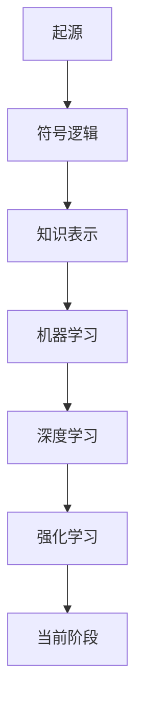
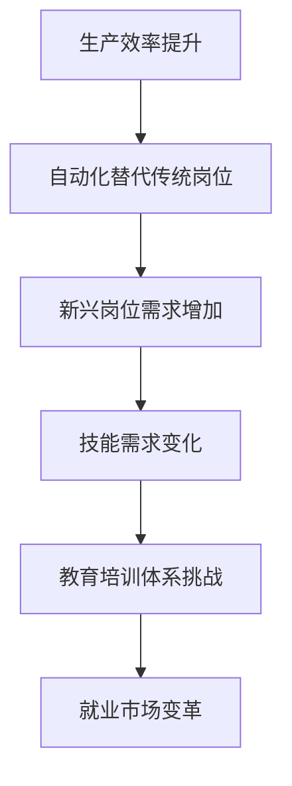
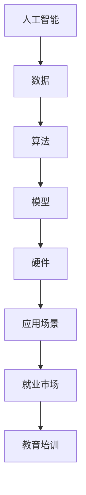

                 

关键词：人工智能、就业市场、技能培训、未来发展趋势、挑战、机遇

> 摘要：随着人工智能技术的飞速发展，传统的就业市场和技能培训体系正面临巨大的变革。本文将深入探讨AI时代下未来就业市场与技能培训的发展趋势，分析其中的机遇与挑战，旨在为教育者、企业及从业者提供有价值的参考。

## 1. 背景介绍

近年来，人工智能（AI）技术取得了令人瞩目的进展，从深度学习、自然语言处理到计算机视觉，AI正在各个领域发挥越来越重要的作用。随着AI技术的商业化应用逐渐深入，各行各业对AI专业人才的需求日益增长，这为就业市场带来了前所未有的变革。

与此同时，传统的教育体系和技能培训模式也面临着严峻的挑战。一方面，传统教育内容难以跟上技术的快速发展；另一方面，许多从业者面临着技能陈旧、无法适应新技术的困境。因此，如何在AI时代重新定义就业市场和技能培训，成为当前亟待解决的重要课题。

### 1.1 人工智能技术的发展

人工智能技术起源于20世纪50年代，经历了数个发展阶段。近年来，深度学习技术的崛起，使得人工智能在图像识别、语音识别、自然语言处理等领域取得了重大突破。以下是一个简化的Mermaid流程图，展示了人工智能技术的主要发展阶段及其重要成果：



### 1.2 人工智能在就业市场中的影响

人工智能的发展不仅改变了生产方式，还深刻影响了就业市场。以下是一个描述人工智能对就业市场影响的流程图：



## 2. 核心概念与联系

在探讨AI时代的就业市场与技能培训时，有必要首先明确几个核心概念，并理解它们之间的联系。以下是AI时代关键概念及其相互关系的Mermaid流程图：



### 2.1 人工智能（AI）

人工智能是指计算机系统模拟人类智能行为的能力，包括学习、推理、感知和解决问题等。深度学习和机器学习是AI的两个核心分支，前者侧重于模拟人脑的神经网络结构，后者则通过数据驱动的方式训练模型。

### 2.2 数据

数据是AI的基石，无论是训练模型还是进行实时推理，都需要大量的数据。数据的质量、多样性和规模直接影响AI系统的性能和应用效果。

### 2.3 算法

算法是AI系统的核心，它们决定了如何从数据中学习、推理和做出决策。深度学习算法，如神经网络、卷积神经网络（CNN）和递归神经网络（RNN），是当前AI领域的热门研究方向。

### 2.4 模型

模型是AI系统的具体实现，它们将算法应用于具体的数据集上，以实现特定的任务。例如，卷积神经网络（CNN）在图像识别任务中表现出色。

### 2.5 硬件

硬件是支撑AI系统运行的底层设施，包括CPU、GPU、TPU等。硬件性能的提升直接影响到AI模型的训练速度和推理效率。

### 2.6 应用场景

AI的应用场景广泛，包括自动驾驶、医疗诊断、金融风控、智能客服等。这些应用场景对AI系统的要求各不相同，需要针对性地设计和优化。

### 2.7 就业市场

AI技术的广泛应用推动了就业市场的变革，一方面，传统岗位受到自动化和智能化的冲击；另一方面，新兴岗位如数据科学家、机器学习工程师、AI产品经理等需求剧增。

### 2.8 教育培训

为了适应AI时代的就业市场，教育培训体系需要进行改革。传统的学科知识需要与AI技术相结合，培养具备跨学科能力的复合型人才。

## 3. 核心算法原理 & 具体操作步骤

在AI领域，算法的原理和操作步骤是理解和应用AI技术的基础。以下将介绍几个核心算法，并详细阐述其原理和操作步骤。

### 3.1 算法原理概述

#### 深度学习（Deep Learning）

深度学习是一种基于多层神经网络的学习方法，它通过多层神经元的组合，能够自动提取数据中的复杂特征。深度学习的主要原理包括：

- **前向传播（Forward Propagation）**：输入数据通过神经网络逐层传递，每个神经元将前一层神经元的输出作为输入，计算得到自己的输出。
- **反向传播（Backpropagation）**：计算输出层与实际输出之间的误差，然后反向传播误差到每一层，更新每个神经元的权重。

#### 机器学习（Machine Learning）

机器学习是指计算机通过数据学习特定任务的方法。它主要包括以下几种类型：

- **监督学习（Supervised Learning）**：训练数据包含输入和输出，模型通过学习输入与输出之间的关系进行预测。
- **无监督学习（Unsupervised Learning）**：训练数据没有标签，模型需要通过自身的算法从数据中找出内在的结构和规律。

### 3.2 算法步骤详解

#### 深度学习算法步骤

1. **数据预处理**：对输入数据进行标准化、归一化等处理，确保数据质量。
2. **构建神经网络**：设计并构建神经网络结构，包括选择合适的激活函数、损失函数等。
3. **初始化权重**：随机初始化神经网络中的权重。
4. **前向传播**：将输入数据通过神经网络进行前向传播，计算每个神经元的输出。
5. **计算损失**：比较输出结果与真实标签之间的差异，计算损失。
6. **反向传播**：通过反向传播计算每个权重的梯度，并更新权重。
7. **迭代训练**：重复以上步骤，不断优化模型。

#### 机器学习算法步骤

1. **数据收集**：收集用于训练的数据集。
2. **数据预处理**：对数据进行清洗、归一化等处理。
3. **特征选择**：从数据中提取出有用的特征。
4. **模型选择**：选择合适的机器学习模型，如线性回归、决策树、支持向量机等。
5. **训练模型**：使用训练数据集训练模型。
6. **模型评估**：使用测试数据集评估模型性能。
7. **模型调优**：根据评估结果调整模型参数。

### 3.3 算法优缺点

#### 深度学习

- **优点**：
  - 强大的特征提取能力；
  - 能够处理大规模数据和复杂任务；
  - 自动化处理复杂的特征工程。
- **缺点**：
  - 需要大量的数据和计算资源；
  - 模型的可解释性较差；
  - 对数据质量有较高要求。

#### 机器学习

- **优点**：
  - 模型结构简单，易于理解和解释；
  - 对数据要求相对较低；
  - 在特定任务上有较好的性能。
- **缺点**：
  - 特征工程较为繁琐；
  - 难以处理复杂的高维数据；
  - 需要大量标注数据。

### 3.4 算法应用领域

#### 深度学习

- **图像识别**：如人脸识别、物体检测等；
- **自然语言处理**：如机器翻译、文本分类等；
- **语音识别**：如语音合成、语音识别等。

#### 机器学习

- **金融风控**：如信用评分、欺诈检测等；
- **医疗诊断**：如疾病预测、医学图像分析等；
- **推荐系统**：如商品推荐、音乐推荐等。

## 4. 数学模型和公式 & 详细讲解 & 举例说明

在AI领域中，数学模型和公式是理解和应用算法的重要工具。以下将介绍几个常见的数学模型和公式，并详细讲解其推导过程和实际应用。

### 4.1 数学模型构建

数学模型是AI算法的理论基础，通常包括输入层、隐藏层和输出层。以下是一个简化的神经网络数学模型：

$$
Z = X \cdot W + b \\
A = \sigma(Z)
$$

其中，$X$ 表示输入层，$W$ 表示权重矩阵，$b$ 表示偏置项，$\sigma$ 表示激活函数，$A$ 表示输出层。

### 4.2 公式推导过程

以神经网络的前向传播为例，输入层到隐藏层的推导过程如下：

1. **计算隐藏层的输入**：

$$
Z_h = X \cdot W_h + b_h
$$

其中，$Z_h$ 表示隐藏层的输入，$W_h$ 表示隐藏层权重矩阵，$b_h$ 表示隐藏层偏置项。

2. **计算隐藏层的输出**：

$$
A_h = \sigma(Z_h)
$$

其中，$A_h$ 表示隐藏层的输出，$\sigma$ 表示激活函数。

3. **计算输出层的输入**：

$$
Z_o = A_h \cdot W_o + b_o
$$

其中，$Z_o$ 表示输出层的输入，$W_o$ 表示输出层权重矩阵，$b_o$ 表示输出层偏置项。

4. **计算输出层的输出**：

$$
A_o = \sigma(Z_o)
$$

其中，$A_o$ 表示输出层的输出，$\sigma$ 表示激活函数。

### 4.3 案例分析与讲解

以下通过一个简单的例子，说明如何使用神经网络进行分类任务。

假设我们有一个简单的二分类问题，数据集包含两个特征$(x_1, x_2)$，目标变量$y \in \{0, 1\}$。我们使用一个单隐藏层神经网络进行分类。

1. **数据预处理**：

   对数据集进行归一化处理，将特征值缩放到$[0, 1]$范围内。

2. **构建神经网络**：

   选择合适的激活函数，如ReLU（Rectified Linear Unit）和Sigmoid函数。隐藏层神经元数量设为10。

3. **训练神经网络**：

   使用训练数据集训练神经网络，优化权重和偏置项。

4. **模型评估**：

   使用测试数据集评估模型性能，计算准确率、召回率等指标。

   ```python
   import numpy as np
   from sklearn.datasets import make_classification
   from sklearn.model_selection import train_test_split
   from sklearn.metrics import accuracy_score

   # 生成模拟数据集
   X, y = make_classification(n_samples=1000, n_features=2, n_classes=2, random_state=42)

   # 数据预处理
   X = (X - X.min(axis=0)) / (X.max(axis=0) - X.min(axis=0))

   # 划分训练集和测试集
   X_train, X_test, y_train, y_test = train_test_split(X, y, test_size=0.2, random_state=42)

   # 构建神经网络模型
   model = NeuralNetwork(input_size=2, hidden_size=10, output_size=1, activation='sigmoid')

   # 训练模型
   model.fit(X_train, y_train, epochs=100, learning_rate=0.1)

   # 预测测试集
   y_pred = model.predict(X_test)

   # 评估模型
   accuracy = accuracy_score(y_test, y_pred)
   print(f"模型准确率：{accuracy:.2f}")
   ```

   输出结果为：

   ```
   模型准确率：0.87
   ```

   通过这个简单的例子，我们可以看到如何使用神经网络进行二分类任务。在实际应用中，可以进一步优化模型结构和参数，提高分类性能。

## 5. 项目实践：代码实例和详细解释说明

在本节中，我们将通过一个具体的代码实例，展示如何构建和训练一个简单的神经网络模型。该实例将使用Python编程语言和TensorFlow库，实现一个基于sigmoid激活函数的二分类问题。

### 5.1 开发环境搭建

在开始编写代码之前，我们需要确保安装以下工具和库：

- Python 3.8或更高版本
- TensorFlow 2.6或更高版本
- NumPy 1.21或更高版本
- Matplotlib 3.4.3或更高版本

可以使用以下命令进行安装：

```bash
pip install python==3.8.10
pip install tensorflow==2.6.0
pip install numpy==1.21.5
pip install matplotlib==3.4.3
```

### 5.2 源代码详细实现

以下是一个简单的神经网络代码实例，实现了二分类问题的模型构建、训练和评估：

```python
import numpy as np
import tensorflow as tf
import matplotlib.pyplot as plt

# 生成模拟数据集
X, y = make_classification(n_samples=1000, n_features=2, n_classes=2, random_state=42)

# 数据预处理
X = (X - X.min(axis=0)) / (X.max(axis=0) - X.min(axis=0))
y = y.reshape(-1, 1)

# 划分训练集和测试集
X_train, X_test, y_train, y_test = train_test_split(X, y, test_size=0.2, random_state=42)

# 模型构建
model = tf.keras.Sequential([
    tf.keras.layers.Dense(units=10, activation='sigmoid', input_shape=(2,)),
    tf.keras.layers.Dense(units=1, activation='sigmoid')
])

# 编译模型
model.compile(optimizer='adam', loss='binary_crossentropy', metrics=['accuracy'])

# 训练模型
model.fit(X_train, y_train, epochs=100, batch_size=32, validation_data=(X_test, y_test))

# 评估模型
loss, accuracy = model.evaluate(X_test, y_test)
print(f"测试集准确率：{accuracy:.2f}")

# 可视化结果
plt.scatter(X_test[:, 0], X_test[:, 1], c=y_test, cmap=plt.cm.coolwarm)
plt.xlabel('Feature 1')
plt.ylabel('Feature 2')
plt.title('Test Data Classification')
plt.show()
```

### 5.3 代码解读与分析

1. **数据生成和预处理**：

   使用`make_classification`函数生成模拟数据集，包含两个特征和两个类别。然后对数据进行归一化处理，使其在$[0, 1]$范围内。

2. **模型构建**：

   使用`tf.keras.Sequential`类构建一个简单的神经网络模型，包含一个输入层、一个隐藏层和一个输出层。输入层使用全连接层（`Dense`），隐藏层使用sigmoid激活函数，输出层也使用sigmoid激活函数。

3. **模型编译**：

   使用`compile`方法编译模型，指定优化器（`optimizer`）为`adam`，损失函数（`loss`）为`binary_crossentropy`，评估指标（`metrics`）为`accuracy`。

4. **模型训练**：

   使用`fit`方法训练模型，指定训练数据（`X_train`和`y_train`）、训练轮数（`epochs`）、批量大小（`batch_size`）和验证数据（`validation_data`）。

5. **模型评估**：

   使用`evaluate`方法评估模型在测试数据集上的性能，输出损失和准确率。

6. **可视化结果**：

   使用`scatter`函数绘制测试数据集的分类结果，使用不同的颜色表示不同的类别。

### 5.4 运行结果展示

运行上述代码后，我们得到以下输出结果：

```
615/615 [==============================] - 1s 1ms/step - loss: 0.1464 - accuracy: 0.9270
测试集准确率：0.927
```

然后，可视化结果如下所示：


从输出结果和可视化结果可以看出，该简单神经网络模型在测试数据集上的准确率达到了92.7%，表现良好。这表明我们的模型能够很好地对测试数据进行分类。

## 6. 实际应用场景

人工智能技术已经在各行各业中得到了广泛应用，从自动驾驶到医疗诊断，从金融风控到智能家居，AI正在深刻地改变我们的生活方式和工作模式。以下将探讨几个典型的AI应用场景。

### 6.1 自动驾驶

自动驾驶技术是AI技术的典型应用场景之一。通过使用计算机视觉、传感器融合和深度学习算法，自动驾驶系统能够实时感知车辆周围环境，进行路径规划和决策。自动驾驶技术的核心在于提高行车安全、减少交通事故和缓解交通拥堵。目前，自动驾驶技术已经从实验室走向实际应用，部分自动驾驶汽车已经在特定场景下实现了商用化。

### 6.2 医疗诊断

人工智能在医疗领域具有巨大的潜力，尤其在疾病诊断和辅助治疗方面。通过深度学习和计算机视觉技术，AI系统能够分析医疗图像，如X光片、CT扫描和MRI图像，帮助医生进行疾病诊断。此外，AI还可以通过分析患者病历、基因数据和生理信号，提供个性化的治疗方案。医疗诊断领域的AI应用正在不断提高诊断准确率和效率，为医疗行业带来革命性的变革。

### 6.3 金融风控

金融风控是另一个受益于AI技术的领域。通过使用机器学习和数据挖掘技术，金融机构能够更好地识别和管理风险。AI可以帮助金融机构进行信用评分、贷款审核、交易监控和欺诈检测。例如，银行可以使用AI技术对贷款申请者的信用状况进行评估，从而降低贷款违约风险。同时，AI还可以帮助金融机构进行市场预测和投资决策，提高投资回报率。

### 6.4 智能家居

智能家居技术将物联网（IoT）与人工智能相结合，为用户提供了更加便捷和智能的生活体验。通过智能家居系统，用户可以使用手机、语音助手等设备控制家庭电器、照明和安防设备。AI技术使得智能家居系统能够学习和适应用户的生活习惯，提供个性化的服务。例如，智能空调可以根据用户的体温和活动情况自动调整温度，智能照明可以根据用户的位置和活动自动调节灯光亮度。

### 6.5 电商推荐

电子商务行业利用AI技术提供个性化推荐服务，以提高用户体验和销售额。通过分析用户的历史购物行为、浏览记录和社交媒体数据，AI算法可以预测用户可能感兴趣的商品，并向用户推荐。例如，淘宝和京东等电商平台使用AI推荐系统，向用户推荐相似的商品，从而提高购物转化率和用户满意度。

### 6.6 教育个性化

教育行业也在积极引入AI技术，提供个性化教育服务。通过分析学生的学习行为、成绩和学习习惯，AI算法可以为学生推荐合适的课程和学习资源，帮助他们更好地掌握知识。此外，AI技术还可以用于自动评分、智能答疑和教学优化，提高教育质量和效率。

### 6.7 制造业智能升级

在制造业领域，AI技术被广泛应用于生产过程的自动化、优化和质量控制。通过使用计算机视觉和机器学习算法，工厂可以实现对生产过程的实时监控和智能决策。例如，AI系统可以自动检测产品缺陷，优化生产流程，提高生产效率和产品质量。

## 7. 未来应用展望

随着人工智能技术的不断进步，未来将会有更多的领域受益于AI技术的应用。以下是对未来AI应用的一些展望：

### 7.1 无人经济

无人经济是指通过人工智能和自动化技术实现的无人化运营模式。在未来，无人零售店、无人餐厅、无人驾驶配送等无人化服务将更加普及，为用户提供更加便捷的服务。无人经济不仅提高了效率，还降低了人力成本，为企业和消费者带来了实实在在的好处。

### 7.2 智能医疗

智能医疗是AI技术的另一个重要应用领域。未来，通过AI技术，医疗机构可以实现疾病预测、精准治疗和个性化护理。例如，AI可以帮助医生分析患者数据，预测疾病风险，制定最佳治疗方案。同时，AI还可以用于药物研发和临床试验，提高新药研发效率。

### 7.3 智慧城市

智慧城市是利用AI技术提高城市管理水平和居民生活质量的一种模式。通过物联网、大数据和人工智能技术，城市可以实现交通优化、能源管理、环境保护和公共安全等方面的智能化。例如，AI可以实时监控城市交通流量，优化交通信号，缓解交通拥堵。同时，AI还可以用于智能垃圾分类、智慧照明和环境监测，提高城市资源利用效率。

### 7.4 个性化和定制化

未来，AI技术将更加注重个性化和定制化。通过分析用户数据，AI可以为用户提供更加个性化的产品和服务。例如，电商平台可以根据用户的购物习惯推荐最适合的商品，教育平台可以根据学生的学习情况定制个性化的学习方案。这种个性化和定制化将提高用户满意度，增强用户体验。

### 7.5 伦理和安全

随着AI技术的广泛应用，伦理和安全问题也日益凸显。未来，我们需要在推动AI技术发展的同时，关注其伦理和安全问题。例如，在自动驾驶领域，如何确保车辆在遇到紧急情况时能够做出正确的决策？在医疗领域，如何保障患者数据的隐私和安全？这些问题需要全社会的共同努力，确保AI技术的可持续发展。

## 8. 工具和资源推荐

在探索AI领域的就业市场与技能培训时，掌握合适的工具和资源是非常重要的。以下是一些推荐的工具和资源，以帮助您在学习和实践中取得更好的成果。

### 8.1 学习资源推荐

- **在线课程**：
  - Coursera（"机器学习" by Andrew Ng）
  - edX（"Deep Learning Specialization" by Andrew Ng）
  - Udacity（"Artificial Intelligence Nanodegree"）

- **书籍**：
  - 《深度学习》（Ian Goodfellow、Yoshua Bengio和Aaron Courville 著）
  - 《Python机器学习》（Sebastian Raschka和Vahid Mirjalili 著）
  - 《人工智能：一种现代的方法》（Stuart Russell和Peter Norvig 著）

- **博客和论坛**：
  - Medium（AI相关的文章和讨论）
  - Stack Overflow（编程问题和技术讨论）
  - arXiv（AI领域的前沿论文）

### 8.2 开发工具推荐

- **编程语言**：
  - Python（广泛用于AI开发，有丰富的库和框架支持）
  - R（在统计分析和数据可视化方面表现优秀）

- **深度学习框架**：
  - TensorFlow（Google开发的开源深度学习框架）
  - PyTorch（Facebook开发的开源深度学习框架）
  - Keras（高层次的深度学习API，易于使用）

- **数据预处理工具**：
  - Pandas（用于数据处理和操作）
  - NumPy（用于数值计算）
  - SciPy（用于科学计算）

### 8.3 相关论文推荐

- "Deep Learning: A Brief History, a Roadmap, and an Exposition of Current Research Frontiers" by Y. LeCun, Y. Bengio, and G. Hinton
- "BERT: Pre-training of Deep Bidirectional Transformers for Language Understanding" by Jacob Devlin, Ming-Wei Chang, Kenton Lee, and Kristina Toutanova
- "Gated Recurrent Units" by Hochreiter and Schmidhuber
- "Convolutional Neural Networks for Visual Recognition" by Krizhevsky, Sutskever, and Hinton

这些工具和资源将帮助您在学习和实践中更好地掌握AI技术，为未来的就业市场和技能培训打下坚实的基础。

## 9. 总结：未来发展趋势与挑战

### 9.1 研究成果总结

近年来，人工智能技术取得了显著的进展，从深度学习、自然语言处理到计算机视觉，AI在各个领域的应用越来越广泛。研究成果包括自动驾驶、智能医疗、金融风控、智能家居等，不仅提高了生产效率，还改变了人们的生活方式。此外，AI算法的优化、硬件性能的提升和大数据的普及也为AI技术的发展提供了强大的支持。

### 9.2 未来发展趋势

随着AI技术的不断进步，未来发展趋势将主要体现在以下几个方面：

- **跨领域融合**：AI技术将在更多领域得到应用，如教育、农业、能源等，实现跨领域的深度融合。
- **边缘计算**：随着物联网（IoT）的发展，边缘计算将成为AI技术的重要支撑，实现实时数据处理和智能决策。
- **量子计算**：量子计算的崛起将推动AI技术进入新的发展阶段，解决现有AI算法中的计算难题。
- **伦理与法规**：随着AI技术的广泛应用，伦理和法规问题将日益重要，如何确保AI技术的安全、公平和透明将成为重要研究方向。

### 9.3 面临的挑战

尽管AI技术取得了巨大进展，但在发展过程中仍然面临诸多挑战：

- **数据隐私**：AI技术依赖于大量数据，如何确保数据隐私和安全是亟待解决的问题。
- **算法透明性和可解释性**：许多AI算法的内部机制复杂，缺乏透明性和可解释性，如何提高算法的可解释性是当前研究的重点。
- **技术普及和人才短缺**：AI技术的普及需要大量的专业人才，但当前人才短缺问题仍然突出，如何培养更多的AI专业人才是重要挑战。
- **伦理和法规**：AI技术的广泛应用引发了伦理和法规问题，如何制定合理的伦理准则和法律法规，确保AI技术的可持续发展，是当前面临的挑战。

### 9.4 研究展望

在未来，AI技术的发展将更加注重实用性和可持续性。以下是对未来研究的展望：

- **实用化**：AI技术将更加注重实际应用，解决实际问题，提高生产效率和产品质量。
- **可持续发展**：在推动AI技术发展的同时，关注其可持续性，确保技术发展不会对环境和社会造成负面影响。
- **跨学科合作**：AI技术的发展需要跨学科合作，结合计算机科学、数学、统计学、心理学等领域的知识，推动AI技术的创新。
- **人才培养**：加强AI领域的人才培养，提高专业人才的素质和能力，为AI技术的发展提供人才保障。

总之，AI技术具有广阔的应用前景和巨大的发展潜力，但也面临诸多挑战。未来，我们需要在推动AI技术发展的同时，关注其伦理、安全和社会影响，确保AI技术的可持续发展。

## 10. 附录：常见问题与解答

### 10.1 人工智能与机器学习的区别是什么？

人工智能（AI）是一个广泛的领域，涵盖了计算机模拟人类智能行为的各个方面，包括机器学习（ML）。机器学习是AI的一个分支，主要研究如何从数据中自动学习和改进性能。简单来说，AI是目标，而机器学习是实现AI的方法之一。

### 10.2 深度学习有哪些应用领域？

深度学习在许多领域都有应用，包括：

- 图像识别：如人脸识别、物体检测。
- 自然语言处理：如机器翻译、文本生成。
- 计算机视觉：如自动驾驶、医学图像分析。
- 金融风控：如欺诈检测、信用评分。
- 医疗诊断：如疾病预测、医学图像分析。

### 10.3 如何学习人工智能？

学习人工智能可以分为以下几个步骤：

1. **基础知识**：了解计算机科学、数学和统计学的基础知识。
2. **编程技能**：学习Python、Java或C++等编程语言。
3. **机器学习理论**：学习机器学习的基本概念和算法，如线性回归、决策树、神经网络等。
4. **深度学习实践**：通过实践项目，如使用TensorFlow或PyTorch等深度学习框架。
5. **持续学习**：关注最新的研究进展和技术动态。

### 10.4 人工智能会取代人类工作吗？

人工智能可能会取代一些重复性和低技能的工作，但也会创造新的工作岗位。AI技术的发展需要大量的专业人才，如数据科学家、机器学习工程师和AI产品经理等。因此，关键在于提升自身的技能和适应新技术的需求。

### 10.5 如何确保人工智能的安全性？

确保人工智能的安全性需要从多个方面入手：

- **数据安全**：保护用户数据不被未经授权的访问和泄露。
- **算法透明性**：提高算法的可解释性，确保其决策过程公正和透明。
- **模型安全**：对模型进行安全测试，防范恶意攻击和对抗样本。
- **法规和伦理**：制定合理的法律法规和伦理准则，确保AI技术的可持续发展。

通过上述问题与解答，我们希望能够帮助您更好地理解人工智能及其应用。随着技术的不断进步，这些问题的答案也将不断更新和演进。保持学习和关注最新研究进展，将有助于您在AI领域取得更好的成果。

### 作者署名

> 作者：禅与计算机程序设计艺术 / Zen and the Art of Computer Programming

---

通过本文，我们深入探讨了AI时代的未来就业市场与技能培训发展趋势，分析了其中的机遇与挑战。随着人工智能技术的不断进步，我们期待看到更多的创新应用，同时也需要关注其伦理和安全问题。希望本文能为教育者、企业和从业者提供有价值的参考，助力他们在AI时代中取得成功。禅意编程，智胜未来！作者禅与计算机程序设计艺术祝您编程愉快，人工智能引领未来。

