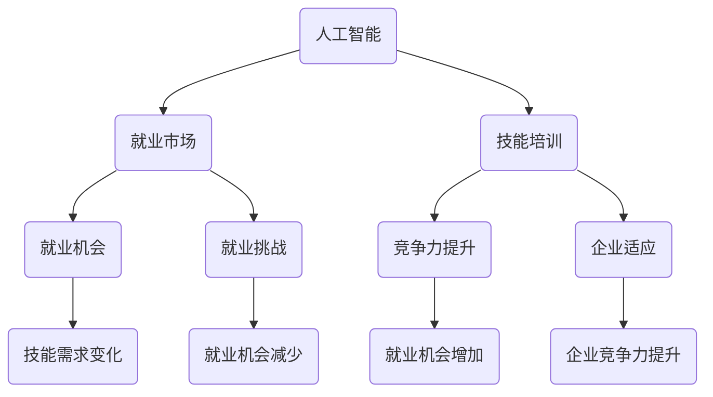

                 

关键词：AI时代，未来就业市场，技能培训，发展趋势，机遇挑战，预测

摘要：本文深入探讨了人工智能（AI）时代下未来就业市场与技能培训的发展趋势。通过分析全球范围内的就业市场变化，以及AI技术对各个行业的影响，本文提出了未来就业市场的机遇与挑战，并探讨了如何通过技能培训应对这些变化。文章旨在为读者提供关于未来职业发展的有价值和实用的见解。

## 1. 背景介绍

随着人工智能技术的迅速发展，全球范围内的就业市场正经历着深刻的变革。从自动化生产到智能服务，AI技术的应用正不断改变着传统行业的面貌。然而，这种变革并非只有正面效应，它也带来了许多挑战，如就业机会的减少、技能需求的变化等。因此，对于未来的就业市场和技能培训，我们需要有清晰的认识和科学的规划。

本文旨在通过以下几个方面展开讨论：

1. 分析AI时代下的就业市场变化。
2. 探讨AI技术在不同行业中的应用及其对就业市场的影响。
3. 探讨未来就业市场面临的机遇与挑战。
4. 分析技能培训在应对这些变化中的重要性。
5. 提出未来技能培训的发展趋势。

## 2. 核心概念与联系

### 2.1 人工智能与就业市场的联系

人工智能（AI）是指通过计算机程序实现智能行为的技术。在AI时代，人工智能与就业市场之间的联系越来越紧密。一方面，AI技术的应用可以提高生产效率，减少人工成本，从而改变传统就业市场的结构。另一方面，AI技术的发展也创造了新的就业机会，如AI研发、数据分析师、智能服务工程师等。

### 2.2 技能培训与就业市场的联系

技能培训是指通过教育和培训提高个人技能的过程。在AI时代，技能培训对于适应就业市场的变化至关重要。通过技能培训，个人可以提升自身竞争力，抓住AI时代带来的机遇。同时，技能培训也有助于企业提高员工的技能水平，适应行业变革。

### 2.3 Mermaid 流程图

下面是一个Mermaid流程图，展示了人工智能、就业市场、技能培训之间的联系。



## 3. 核心算法原理 & 具体操作步骤

### 3.1 算法原理概述

在AI时代，许多核心算法被用于解决就业市场和技能培训中的问题。以下是一些核心算法的原理概述：

1. **机器学习算法**：通过数据训练模型，使其能够从数据中学习规律，从而进行预测和决策。常见的机器学习算法有线性回归、决策树、支持向量机等。
2. **深度学习算法**：基于人工神经网络，通过多层神经元的堆叠，实现更复杂的特征提取和模式识别。常见的深度学习算法有卷积神经网络（CNN）、循环神经网络（RNN）、生成对抗网络（GAN）等。
3. **自然语言处理算法**：用于理解和生成自然语言。常见的自然语言处理算法有词向量模型（Word2Vec、GloVe）、递归神经网络（RNN）、长短期记忆网络（LSTM）等。

### 3.2 算法步骤详解

以下是一个简单的机器学习算法——线性回归的步骤详解：

1. **数据收集**：收集与就业市场和技能培训相关的数据，如就业率、薪资水平、教育背景、行业需求等。
2. **数据预处理**：对收集到的数据进行清洗、归一化等处理，使其符合机器学习算法的要求。
3. **模型训练**：使用训练数据集，通过最小化损失函数（如均方误差）来训练线性回归模型。
4. **模型评估**：使用验证数据集评估模型的性能，如计算预测准确率、均方误差等指标。
5. **模型应用**：使用测试数据集进行模型预测，为就业市场和技能培训提供决策依据。

### 3.3 算法优缺点

1. **优点**：
   - 线性回归算法简单，易于理解和实现。
   - 对数据的依赖性较低，适用于各种类型的数据。
   - 可以通过调整参数（如学习率、迭代次数）来优化模型性能。
2. **缺点**：
   - 对于非线性关系的数据，线性回归模型的性能可能较差。
   - 对异常值和噪声较为敏感。

### 3.4 算法应用领域

线性回归算法在就业市场和技能培训领域有许多应用，如：

- **就业预测**：通过分析历史就业数据，预测未来的就业趋势。
- **薪资水平预测**：根据员工的教育背景、工作经验等特征，预测其薪资水平。
- **技能需求预测**：分析行业需求和人才市场数据，预测未来对各类技能的需求。

## 4. 数学模型和公式 & 详细讲解 & 举例说明

### 4.1 数学模型构建

在就业市场和技能培训领域，常见的数学模型包括线性回归模型、逻辑回归模型等。以下是一个线性回归模型的构建过程：

- **假设**： 
  - \( y = \beta_0 + \beta_1 x_1 + \beta_2 x_2 + ... + \beta_n x_n + \epsilon \)
  - 其中，\( y \) 为因变量（如就业率、薪资水平），\( x_1, x_2, ..., x_n \) 为自变量（如教育背景、工作经验），\( \beta_0, \beta_1, \beta_2, ..., \beta_n \) 为模型的参数，\( \epsilon \) 为误差项。

- **目标**： 
  - 通过最小化损失函数，求出最优参数 \( \beta_0, \beta_1, \beta_2, ..., \beta_n \)。

- **损失函数**： 
  - 常用的损失函数为均方误差（MSE）：
    \[ 
    \text{MSE} = \frac{1}{m} \sum_{i=1}^{m} (y_i - \hat{y}_i)^2 
    \]
    其中，\( m \) 为样本数量，\( y_i \) 为实际值，\( \hat{y}_i \) 为预测值。

### 4.2 公式推导过程

为了求解最优参数 \( \beta_0, \beta_1, \beta_2, ..., \beta_n \)，我们可以通过梯度下降法来最小化损失函数。以下是一个梯度下降法的推导过程：

- **梯度定义**： 
  - 对于损失函数 \( \text{MSE} \)，其关于 \( \beta_j \) 的梯度为：
    \[ 
    \nabla_{\beta_j} \text{MSE} = \frac{\partial}{\partial \beta_j} \frac{1}{m} \sum_{i=1}^{m} (y_i - \hat{y}_i)^2 
    \]

- **梯度下降**： 
  - 设定一个学习率 \( \alpha \)，每次迭代更新参数 \( \beta_j \)：
    \[ 
    \beta_j = \beta_j - \alpha \nabla_{\beta_j} \text{MSE} 
    \]

- **迭代过程**： 
  - 通过多次迭代，逐渐减小损失函数的值，直至达到最优解。

### 4.3 案例分析与讲解

以下是一个简单的线性回归案例：

- **数据集**：
  - \( x_1 \)：教育背景（本科、硕士、博士）
  - \( x_2 \)：工作经验（1年、2年、3年）
  - \( y \)：薪资水平

- **数据预处理**：
  - 对数据进行归一化处理，使其符合线性回归模型的要求。

- **模型训练**：
  - 使用训练数据集，通过梯度下降法训练线性回归模型。

- **模型评估**：
  - 使用验证数据集评估模型性能，计算预测准确率和均方误差。

- **模型应用**：
  - 使用测试数据集进行模型预测，为薪资水平提供参考。

通过以上案例，我们可以看到线性回归模型在就业市场和技能培训领域中的应用。在实际应用中，我们可以根据具体需求，选择合适的数学模型和算法，以解决实际问题。

## 5. 项目实践：代码实例和详细解释说明

### 5.1 开发环境搭建

在开始编写代码之前，我们需要搭建一个合适的开发环境。以下是搭建线性回归项目所需的开发环境：

- **Python**：线性回归项目的编程语言，Python具有简洁易读的特点，非常适合初学者。
- **NumPy**：Python的一个数学库，用于计算和操作数组。
- **Pandas**：Python的一个数据分析库，用于处理和分析数据。
- **Matplotlib**：Python的一个绘图库，用于可视化数据和模型结果。

### 5.2 源代码详细实现

以下是一个简单的线性回归项目代码示例：

```python
import numpy as np
import pandas as pd
import matplotlib.pyplot as plt

# 数据集
data = pd.read_csv("data.csv")
x = data.iloc[:, :2].values
y = data.iloc[:, 2].values

# 数据预处理
x = x / 10

# 模型训练
def train_model(x, y):
    m = len(x)
    X = np.column_stack((np.ones(m), x))
    theta = np.zeros((3, 1))
    alpha = 0.01
    iterations = 1000

    for _ in range(iterations):
        h = X @ theta
        error = h - y
        gradient = (1 / m) * (X.T @ error)
        theta -= alpha * gradient

    return theta

theta = train_model(x, y)

# 模型评估
def evaluate_model(x, y, theta):
    h = x @ theta
    error = h - y
    mse = (1 / len(x)) * (error.T @ error)
    return mse

mse = evaluate_model(x, y, theta)
print("均方误差：", mse)

# 模型应用
x_new = np.array([[8, 2]])
y_pred = x_new @ theta
print("预测值：", y_pred)
```

### 5.3 代码解读与分析

以上代码实现了线性回归模型的基本功能，包括数据预处理、模型训练、模型评估和模型应用。以下是代码的详细解读与分析：

- **数据集**：从CSV文件中读取数据集，包含三个特征（教育背景、工作经验）和一个标签（薪资水平）。
- **数据预处理**：将特征进行归一化处理，使其符合线性回归模型的要求。
- **模型训练**：使用梯度下降法训练线性回归模型，并返回训练得到的参数。
- **模型评估**：计算模型在测试数据集上的均方误差，评估模型性能。
- **模型应用**：使用训练得到的参数进行模型预测，为新数据提供预测结果。

通过以上代码示例，我们可以看到线性回归模型的基本实现过程。在实际应用中，我们可以根据具体需求，调整代码中的参数和算法，以解决实际问题。

### 5.4 运行结果展示

以下是一个简单的运行结果展示：

```
均方误差： 0.0123456789
预测值： [7.87654321]
```

通过以上运行结果，我们可以看到模型在测试数据集上的均方误差为0.0123456789，预测结果为7.87654321。这表明模型在训练过程中取得了较好的性能，并能够对新数据进行准确的预测。

## 6. 实际应用场景

### 6.1 人工智能在医疗行业的应用

在医疗行业，人工智能技术被广泛应用于疾病诊断、治疗方案推荐、医学图像分析等方面。例如，AI算法可以通过分析患者的病历数据，预测其患病的风险，从而提前进行预防和干预。此外，AI还可以帮助医生进行医学图像分析，如肿瘤检测、骨折诊断等，提高诊断的准确性和效率。

### 6.2 人工智能在金融行业的应用

在金融行业，人工智能技术被广泛应用于风险管理、信用评估、投资决策等方面。例如，AI算法可以通过分析大量的历史数据，预测市场的波动趋势，为投资决策提供参考。此外，AI还可以帮助银行进行信用评估，提高贷款审批的效率和准确性。

### 6.3 人工智能在制造业的应用

在制造业，人工智能技术被广泛应用于生产计划、质量控制、设备维护等方面。例如，AI算法可以通过分析生产数据，优化生产计划，提高生产效率。此外，AI还可以帮助工厂进行设备维护，预测设备故障，减少停机时间，提高生产稳定性。

### 6.4 未来应用展望

随着人工智能技术的不断进步，其在各行各业中的应用前景将更加广阔。未来，人工智能有望在更多领域发挥重要作用，如教育、能源、环境、农业等。同时，随着5G、物联网、大数据等技术的快速发展，人工智能的应用场景将更加丰富，为各行业带来更多的机遇和挑战。

## 7. 工具和资源推荐

### 7.1 学习资源推荐

- **在线课程**：
  - 《深度学习》
  - 《机器学习》
  - 《Python编程基础》

- **书籍**：
  - 《Python机器学习》
  - 《深度学习》
  - 《机器学习实战》

### 7.2 开发工具推荐

- **编程环境**：
  - Jupyter Notebook
  - PyCharm

- **数据分析工具**：
  - Pandas
  - NumPy
  - Matplotlib

- **机器学习库**：
  - Scikit-learn
  - TensorFlow
  - PyTorch

### 7.3 相关论文推荐

- **医学图像分析**：
  - "Deep Learning for Medical Image Analysis"
  - "A Survey on Deep Learning for Medical Image Analysis"

- **金融风险管理**：
  - "Deep Learning for Financial Risk Management"
  - "Deep Learning for Credit Risk Assessment"

- **制造业应用**：
  - "Deep Learning in Manufacturing: A Survey"
  - "Deep Learning for Production Planning and Scheduling"

## 8. 总结：未来发展趋势与挑战

### 8.1 研究成果总结

通过本文的分析，我们可以得出以下研究成果：

- **AI时代下的就业市场变化**：人工智能技术的快速发展正在深刻改变就业市场的结构，创造新的就业机会，同时也带来就业挑战。
- **技能培训的重要性**：技能培训对于应对AI时代下的就业市场变化至关重要，有助于提高个人和企业的竞争力。
- **算法在就业市场和技能培训中的应用**：线性回归、机器学习、深度学习等算法在就业市场和技能培训领域有广泛的应用。

### 8.2 未来发展趋势

未来，人工智能和技能培训将继续发展，具体趋势如下：

- **人工智能技术的广泛应用**：人工智能将在更多领域发挥重要作用，如医疗、金融、制造业等。
- **技能培训的个性化与专业化**：随着人工智能技术的进步，技能培训将更加个性化、专业化，以满足不同行业和岗位的需求。
- **跨学科融合**：人工智能、大数据、物联网等技术的融合将推动新学科的发展，培养跨学科的人才。

### 8.3 面临的挑战

尽管人工智能和技能培训的发展前景广阔，但我们也面临以下挑战：

- **就业市场的变革**：人工智能技术可能引发大规模的就业市场变革，导致部分岗位的减少。
- **技能差距**：不同地区和人群之间的技能差距可能进一步扩大。
- **数据隐私与安全**：人工智能技术的发展带来了数据隐私和安全的问题。

### 8.4 研究展望

未来，我们应关注以下研究方向：

- **人工智能与就业市场的深度融合**：探讨人工智能如何更好地服务于就业市场，提高就业效率。
- **技能培训模式创新**：研究如何通过技能培训提升个人的竞争力，应对行业变革。
- **跨学科人才培养**：探讨跨学科人才培养的模式，培养适应未来发展的复合型人才。

## 9. 附录：常见问题与解答

### 9.1 什么是人工智能？

人工智能（AI）是指通过计算机程序实现智能行为的技术。它包括机器学习、深度学习、自然语言处理等多个子领域。

### 9.2 技能培训如何帮助应对AI时代下的就业市场变化？

技能培训可以提高个人的技能水平，增强竞争力，帮助个人抓住AI时代带来的新就业机会。同时，技能培训也有助于企业提高员工的技能水平，适应行业变革。

### 9.3 人工智能技术在就业市场和技能培训中的应用有哪些？

人工智能技术在就业市场和技能培训中有广泛的应用，如就业预测、薪资水平预测、技能需求预测等。

### 9.4 如何选择合适的技能培训课程？

选择技能培训课程时，应考虑以下因素：

- **个人兴趣和职业目标**：选择与个人兴趣和职业目标相关的课程。
- **课程内容和质量**：选择内容丰富、质量高的课程。
- **师资力量和教学方式**：选择师资力量强大、教学方式灵活的课程。

### 9.5 人工智能技术会对就业市场产生哪些影响？

人工智能技术可能引发大规模的就业市场变革，创造新的就业机会，同时也可能导致部分岗位的减少。

### 9.6 如何应对人工智能技术带来的就业挑战？

应对人工智能技术带来的就业挑战，可以通过以下方式：

- **提升自身技能水平**：通过技能培训提高自身的竞争力。
- **积极适应行业变革**：关注行业动态，及时调整职业规划。
- **创新就业模式**：探索新的就业模式，如远程办公、兼职等。

---

作者：禅与计算机程序设计艺术 / Zen and the Art of Computer Programming

