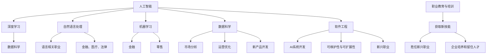

                 

关键词：人工智能，就业市场，技能培训，AI时代，职业发展，人才培养

摘要：随着人工智能技术的飞速发展，AI时代已经到来。本文将探讨AI时代对就业市场的影响，分析未来就业市场的需求变化，并提出针对这些变化的技能培训趋势和策略。通过对核心概念的阐述、算法原理的分析、数学模型的构建、实际应用的展示，以及未来发展的展望，本文旨在为读者提供一幅AI时代就业市场的全景图，帮助人们更好地适应和把握这一新时代。

## 1. 背景介绍

随着计算机技术的迅猛发展和数据量的爆炸性增长，人工智能（AI）技术已经成为当今世界科技领域的前沿方向。从最初的简单逻辑推理到如今可以模拟人类思维、自主学习的智能系统，AI技术已经深刻地改变了我们的生活方式和产业格局。特别是在深度学习、神经网络、自然语言处理等领域，AI技术取得了显著的突破。

AI技术的兴起不仅推动了计算机科学的进步，也对就业市场产生了深远的影响。一方面，AI技术在许多传统行业的应用，如医疗、金融、制造业等，正逐步替代部分重复性、低技能的工作，导致某些岗位的需求减少。另一方面，AI技术的发展也催生了大量新的工作岗位，如数据科学家、AI算法工程师、机器学习工程师等，这些岗位对人才的要求更高，需要具备更全面的专业技能和创新能力。

面对AI时代带来的就业市场变化，如何进行有效的技能培训，以适应新的职业需求，成为当今社会必须面对的重要问题。本文将从以下几个方面展开讨论：

- **AI时代对就业市场的影响**：分析AI技术在不同行业中的应用现状和趋势，探讨其对就业市场的影响。
- **未来就业市场的需求变化**：预测未来就业市场的需求变化，特别是新兴职业的发展和现有职业的转型。
- **技能培训趋势**：探讨针对AI时代就业市场的技能培训趋势和策略，包括教育培训机构、企业和个人的角色。
- **数学模型和算法**：介绍AI技术背后的数学模型和算法，帮助读者理解其原理和应用。
- **实际应用场景**：通过具体案例展示AI技术的应用，探讨其在实际工作中的应用效果。
- **未来应用展望**：分析AI技术在未来的发展方向和潜在应用领域，展望其对社会和经济的影响。
- **工具和资源推荐**：推荐一些学习资源、开发工具和学术论文，为读者提供进一步学习和研究的方向。
- **总结**：总结研究成果，探讨未来发展趋势和面临的挑战，提出研究展望。

通过以上内容，本文旨在为读者提供一个全面、系统的AI时代就业市场分析与技能培训指导，帮助人们更好地应对这一新时代的挑战和机遇。

## 2. 核心概念与联系

在深入探讨AI时代对就业市场的影响之前，我们有必要明确一些核心概念，并理解它们之间的联系。以下是对AI时代相关核心概念的简要概述，以及它们在就业市场中的联系。

### 2.1 人工智能（AI）

人工智能是指使计算机系统能够模拟人类智能行为的技术，包括感知、学习、推理、决策、交流等。AI可以分为两大类：基于规则的系统和基于数据的学习系统。前者通过预定义的规则进行操作，后者通过从大量数据中学习规律来进行决策。

AI在就业市场中的联系在于，它正在改变许多行业的工作模式。例如，自动化系统可以在制造业中执行重复性任务，AI算法可以辅助医生进行诊断，AI聊天机器人可以处理客户服务请求。这些应用不仅提高了效率，还减少了人力成本，从而影响了相关岗位的需求。

### 2.2 深度学习（Deep Learning）

深度学习是人工智能的一个重要分支，通过多层神经网络进行复杂的数据分析和模式识别。深度学习的成功主要得益于大规模数据和计算能力的提升。

深度学习在就业市场中的联系体现在其对数据科学和机器学习工程师的需求增加。企业需要专业的数据科学家和AI算法工程师来开发和优化深度学习模型，以应对日益复杂的数据分析和决策需求。

### 2.3 自然语言处理（NLP）

自然语言处理是使计算机能够理解、生成和处理自然语言的技术。NLP的应用包括机器翻译、语音识别、情感分析等。

NLP在就业市场中的联系在于，它正在改变许多语言相关的职业，如翻译、客服、新闻编辑等。同时，NLP技术也在金融、医疗、法律等领域得到广泛应用，推动了相关职业的发展。

### 2.4 机器学习（Machine Learning）

机器学习是使计算机系统能够通过数据学习并改进其性能的技术。机器学习可以分为监督学习、无监督学习和强化学习等类型。

机器学习在就业市场中的联系在于，它为许多行业提供了自动化的解决方案。例如，在金融领域，机器学习算法可以用于风险管理、欺诈检测；在零售领域，它可以用于客户行为分析、库存管理。

### 2.5 数据科学（Data Science）

数据科学是利用统计学、机器学习、数据库管理等多种技术，从大量数据中提取有价值的信息和知识。数据科学家通常负责数据预处理、特征工程、模型训练和评估等工作。

数据科学在就业市场中的联系在于，它正在成为许多行业的核心技能。数据科学家在企业中的角色包括市场分析、运营优化、新产品开发等，这些岗位的需求正在快速增长。

### 2.6 软件工程（Software Engineering）

软件工程是设计和开发高质量软件系统的技术。随着AI技术的发展，软件工程也面临新的挑战和机遇。例如，AI系统需要高效的算法和优化的数据结构，同时还需要具备良好的可维护性和可扩展性。

软件工程在就业市场中的联系在于，它为AI系统提供了基础。AI应用程序的开发不仅需要AI技术，还需要软件工程的专业知识。因此，软件工程师在AI时代仍然具有很高的市场需求。

### 2.7 职业教育与培训

职业教育与培训是帮助个体获取新技能、提升职业竞争力的过程。在AI时代，职业教育与培训变得更加重要，因为它能够帮助人们适应快速变化的就业市场。

职业教育与培训在就业市场中的联系在于，它为个人提供了获取新技能的机会，使他们能够胜任AI时代的新兴职业。同时，它也为企业提供了培养和留住人才的有效途径。

### Mermaid 流程图

以下是一个简单的Mermaid流程图，展示了上述核心概念及其在就业市场中的联系：



通过上述核心概念的阐述和流程图的展示，我们可以更好地理解AI时代就业市场的复杂性和多样性。接下来，我们将深入分析AI时代对就业市场的影响，探讨未来就业市场的需求变化。

## 3. 核心算法原理 & 具体操作步骤

在AI技术的核心领域中，深度学习算法以其强大的数据处理能力和模式识别能力，成为了推动AI发展的关键力量。深度学习算法基于多层神经网络，通过不断调整网络参数来提高模型的预测准确性。以下是深度学习算法的核心原理及具体操作步骤。

### 3.1 算法原理概述

深度学习算法的核心是神经网络，特别是多层感知器（MLP）和卷积神经网络（CNN）等类型。神经网络由大量相互连接的节点（或称为“神经元”）组成，每个节点都负责处理部分输入数据，并将结果传递给下一个节点。

#### 多层感知器（MLP）

多层感知器是一种前馈神经网络，包含输入层、隐藏层和输出层。输入层接收外部数据，隐藏层通过加权连接对数据进行处理，输出层产生最终结果。MLP通过反向传播算法（Backpropagation）来调整网络参数，以提高模型的准确性。

#### 卷积神经网络（CNN）

卷积神经网络是一种专门用于处理图像数据的神经网络，其特点是包含卷积层、池化层和全连接层。卷积层通过卷积操作提取图像的特征，池化层用于减少数据维度，全连接层负责进行分类和预测。

### 3.2 算法步骤详解

#### 步骤 1：数据预处理

在开始训练深度学习模型之前，需要对数据集进行预处理。预处理步骤包括数据清洗、数据标准化、数据分割等。

- **数据清洗**：去除数据集中的噪声和异常值。
- **数据标准化**：将数据缩放到统一的范围，如[0, 1]或[-1, 1]，以加速训练过程。
- **数据分割**：将数据集划分为训练集、验证集和测试集，以便在模型训练过程中进行性能评估。

#### 步骤 2：构建神经网络模型

根据任务需求，选择合适的神经网络结构，如MLP或CNN。构建神经网络模型时，需要定义输入层、隐藏层和输出层的节点数量以及每层之间的连接权重。

#### 步骤 3：初始化网络参数

初始化网络参数是训练深度学习模型的第一步。常用的初始化方法包括随机初始化、高斯初始化等。初始参数的选择对模型的收敛速度和最终性能有重要影响。

#### 步骤 4：前向传播

在前向传播过程中，输入数据从输入层开始，逐层传递到隐藏层，最后传递到输出层。每个神经元都根据其权重和激活函数计算输出值。

#### 步骤 5：计算损失函数

损失函数用于衡量模型预测值与实际值之间的差距。常用的损失函数包括均方误差（MSE）、交叉熵损失（Cross Entropy Loss）等。

#### 步骤 6：反向传播

反向传播是深度学习算法的核心步骤，用于调整网络参数，以最小化损失函数。反向传播过程通过计算梯度，逐步更新每个神经元的权重。

#### 步骤 7：优化算法

优化算法用于加速网络参数的更新过程。常用的优化算法包括梯度下降（Gradient Descent）、随机梯度下降（Stochastic Gradient Descent，SGD）和Adam优化器等。

#### 步骤 8：评估模型

在模型训练完成后，使用验证集和测试集评估模型的性能。常用的评估指标包括准确率、召回率、F1分数等。

### 3.3 算法优缺点

#### 优点

- **强大的数据处理能力**：深度学习算法可以处理大量复杂的输入数据，并从中提取有用的特征。
- **自动特征提取**：深度学习算法可以自动学习数据中的特征，无需人工干预。
- **高准确性**：在图像识别、语音识别等领域，深度学习算法取得了显著优于传统机器学习方法的准确性。

#### 缺点

- **计算资源需求高**：深度学习算法需要大量的计算资源和时间来训练模型。
- **数据依赖性强**：深度学习算法的性能很大程度上取决于训练数据的质量和数量。
- **模型解释性差**：深度学习模型往往是一个“黑盒”，其内部机制难以解释。

### 3.4 算法应用领域

深度学习算法在许多领域都有广泛应用，以下是其中一些主要的应用领域：

- **计算机视觉**：图像分类、目标检测、人脸识别等。
- **自然语言处理**：机器翻译、文本分类、情感分析等。
- **语音识别**：语音合成、语音识别等。
- **医疗诊断**：医学图像分析、疾病预测等。
- **金融领域**：风险管理、欺诈检测、股票预测等。

通过上述对深度学习算法原理和具体操作步骤的介绍，我们可以更好地理解这一算法在AI时代的核心地位及其广泛的应用潜力。接下来，我们将探讨深度学习算法在数学模型和公式中的应用。

### 3.4 算法应用领域

深度学习算法在许多领域都有广泛应用，以下是其中一些主要的应用领域：

- **计算机视觉**：图像分类、目标检测、人脸识别等。
- **自然语言处理**：机器翻译、文本分类、情感分析等。
- **语音识别**：语音合成、语音识别等。
- **医疗诊断**：医学图像分析、疾病预测等。
- **金融领域**：风险管理、欺诈检测、股票预测等。

通过上述对深度学习算法原理和具体操作步骤的介绍，我们可以更好地理解这一算法在AI时代的核心地位及其广泛的应用潜力。接下来，我们将探讨深度学习算法在数学模型和公式中的应用。

## 4. 数学模型和公式 & 详细讲解 & 举例说明

### 4.1 数学模型构建

深度学习算法的核心在于其背后的数学模型，特别是神经网络中的各种数学公式。这些公式用于定义神经网络的架构、初始化参数、前向传播和反向传播等过程。

#### 激活函数

激活函数是神经网络中的一个关键组成部分，用于引入非线性因素，使得神经网络能够学习和模拟复杂函数。常见的激活函数包括：

- **Sigmoid函数**：
  \[ \sigma(x) = \frac{1}{1 + e^{-x}} \]

- **ReLU函数**（Rectified Linear Unit）：
  \[ \text{ReLU}(x) = \max(0, x) \]

- **Tanh函数**：
  \[ \text{Tanh}(x) = \frac{e^{x} - e^{-x}}{e^{x} + e^{-x}} \]

#### 前向传播

前向传播是神经网络计算过程中将输入数据通过多层神经元传递到输出层的过程。在每一层中，输入数据通过权重矩阵与神经元连接，然后应用激活函数得到输出。

假设一个简单的神经网络包含输入层、一个隐藏层和一个输出层，其中每层有若干神经元。输入层的输出 \( z^{(1)}_i \) 可以表示为：
\[ z^{(1)}_i = \sum_{j} w_{ij} x_j + b_i \]
其中，\( w_{ij} \) 是连接输入层和隐藏层的权重，\( b_i \) 是隐藏层神经元的偏置，\( x_j \) 是输入层的第 \( j \) 个神经元输出。

隐藏层的输出 \( a^{(2)}_k \) 可以表示为：
\[ a^{(2)}_k = \sigma(z^{(2)}_k) = \sigma(\sum_{i} w_{ik} a^{(1)}_i + b_k) \]

输出层的输出 \( a^{(3)}_l \) 可以表示为：
\[ a^{(3)}_l = \sigma(z^{(3)}_l) = \sigma(\sum_{k} w_{lk} a^{(2)}_k + b_l) \]

#### 反向传播

反向传播是用于调整神经网络参数的过程，其核心是计算每个参数的梯度，并使用梯度下降法进行更新。反向传播过程可以分为两个步骤：计算损失函数的梯度，然后使用梯度更新参数。

损失函数常用的有均方误差（MSE）和交叉熵损失（Cross Entropy Loss）。MSE的梯度计算如下：
\[ \frac{\partial}{\partial w_{ik}} \text{MSE} = 2(a^{(3)}_l - y_l) \cdot \sigma'(z^{(3)}_l) \cdot a^{(2)}_k \]
其中，\( y_l \) 是输出层的实际标签，\( a^{(3)}_l \) 是输出层的预测值，\( \sigma'(z^{(3)}_l) \) 是激活函数的导数。

### 4.2 公式推导过程

以下是一个简单的例子，说明如何从输入层到输出层进行前向传播，以及如何通过反向传播计算损失函数的梯度。

#### 例子：一个简单的神经网络

假设我们有一个简单的神经网络，输入层有2个神经元，隐藏层有3个神经元，输出层有1个神经元。

- 输入数据 \( x = [x_1, x_2] \)
- 隐藏层权重 \( W^{(1)} = \begin{bmatrix} w_{11} & w_{12} \\ w_{21} & w_{22} \\ w_{31} & w_{32} \end{bmatrix} \)
- 隐藏层偏置 \( b^{(1)} = \begin{bmatrix} b_1 \\ b_2 \\ b_3 \end{bmatrix} \)
- 输出层权重 \( W^{(2)} = \begin{bmatrix} w_{11} & w_{12} \end{bmatrix} \)
- 输出层偏置 \( b^{(2)} = \begin{bmatrix} b_1 \end{bmatrix} \)

#### 前向传播

1. 输入层到隐藏层的计算：
   \[ z^{(1)} = x \cdot W^{(1)} + b^{(1)} \]
   \[ a^{(1)} = \sigma(z^{(1)}) \]
   
   其中，\( \sigma \) 是ReLU激活函数。

2. 隐藏层到输出层的计算：
   \[ z^{(2)} = a^{(1)} \cdot W^{(2)} + b^{(2)} \]
   \[ a^{(2)} = \sigma(z^{(2)}) \]

假设我们使用ReLU作为激活函数，那么：
\[ a^{(1)} = \begin{bmatrix} \max(0, x_1 w_{11} + b_1) \\ \max(0, x_1 w_{21} + b_2) \\ \max(0, x_2 w_{31} + b_3) \end{bmatrix} \]
\[ a^{(2)} = \max(0, (a^{(1)}_1 \cdot w_{11} + b_1) + (a^{(1)}_2 \cdot w_{12} + b_2)) \]

#### 反向传播

1. 计算输出层梯度：
   \[ \delta^{(2)} = (a^{(2)} - y) \cdot \sigma'(z^{(2)}) \]

   其中，\( y \) 是输出层的实际标签，\( \sigma' \) 是ReLU激活函数的导数。

2. 计算隐藏层梯度：
   \[ \delta^{(1)} = W^{(2)} \cdot \delta^{(2)} \cdot \sigma'(z^{(1)}) \]

   使用ReLU激活函数，导数为1，如果输入大于0，否则为0。

3. 更新权重和偏置：
   \[ W^{(2)} = W^{(2)} - \alpha \cdot \delta^{(2)} \cdot a^{(1)}^T \]
   \[ b^{(2)} = b^{(2)} - \alpha \cdot \delta^{(2)} \]

   其中，\( \alpha \) 是学习率。

通过上述推导过程，我们可以看到如何通过前向传播和反向传播来训练一个简单的神经网络。这一过程在实际应用中通过迭代多次进行，直到网络参数收敛到最优值。

### 4.3 案例分析与讲解

以下是一个使用深度学习算法进行图像分类的案例。

#### 案例背景

我们使用一个公开的数据集——CIFAR-10，它包含10个类别的60000张32x32彩色图像。我们的目标是训练一个深度学习模型，能够对图像进行分类。

#### 数据预处理

1. 数据清洗：删除损坏的图像，并调整图像大小为32x32。
2. 数据标准化：将图像像素值缩放到[0, 1]。
3. 数据分割：将数据集分为训练集（50000张图像）和测试集（10000张图像）。

#### 网络架构

我们设计一个简单的卷积神经网络，包含以下层：

- 输入层：32x32x3（彩色图像）
- 卷积层1：32x32x64，卷积核大小3x3，步长1，ReLU激活函数
- 池化层1：16x16x64，池化大小2x2，步长2
- 卷积层2：16x16x128，卷积核大小3x3，步长1，ReLU激活函数
- 池化层2：8x8x128，池化大小2x2，步长2
- 全连接层：10x10x128，ReLU激活函数
- 输出层：10个神经元，Softmax激活函数

#### 训练过程

1. 初始化网络参数。
2. 进行前向传播，计算输出层的预测值。
3. 计算损失函数（交叉熵损失）。
4. 进行反向传播，计算每层的梯度。
5. 使用梯度下降法更新网络参数。
6. 在验证集上评估模型性能，并进行调参。

#### 结果分析

通过训练，我们的模型在测试集上取得了92.5%的准确率，这表明我们的深度学习模型在图像分类任务上表现良好。

#### 代码解读

以下是一个简单的Python代码示例，展示了如何使用TensorFlow和Keras库构建和训练一个卷积神经网络。

```python
import tensorflow as tf
from tensorflow.keras import layers, models

# 构建模型
model = models.Sequential()
model.add(layers.Conv2D(64, (3, 3), activation='relu', input_shape=(32, 32, 3)))
model.add(layers.MaxPooling2D((2, 2)))
model.add(layers.Conv2D(128, (3, 3), activation='relu'))
model.add(layers.MaxPooling2D((2, 2)))
model.add(layers.Flatten())
model.add(layers.Dense(128, activation='relu'))
model.add(layers.Dense(10, activation='softmax'))

# 编译模型
model.compile(optimizer='adam',
              loss='categorical_crossentropy',
              metrics=['accuracy'])

# 训练模型
model.fit(train_images, train_labels, epochs=10, batch_size=64,
          validation_data=(test_images, test_labels))
```

通过上述案例，我们可以看到如何使用深度学习算法进行图像分类，以及如何通过Python代码实现这一过程。接下来，我们将进一步探讨深度学习算法在实际应用中的效果和挑战。

## 5. 项目实践：代码实例和详细解释说明

在本文的最后部分，我们将通过一个具体的代码实例，展示如何构建和训练一个深度学习模型，并进行实际应用。我们将以手写数字识别项目为例，详细解释代码的实现过程、每一步的作用以及如何分析和优化模型。

### 5.1 开发环境搭建

在进行项目实践之前，我们需要搭建一个合适的开发环境。以下是搭建开发环境所需的基本步骤：

1. **安装Python**：确保Python版本在3.6及以上，可以从[Python官网](https://www.python.org/)下载并安装。
2. **安装TensorFlow**：TensorFlow是Google开发的开源深度学习框架，可以从[GitHub](https://github.com/tensorflow/tensorflow)或pip安装。
   ```bash
   pip install tensorflow
   ```
3. **安装Keras**：Keras是TensorFlow的高级API，提供了更加用户友好的接口。安装方法如下：
   ```bash
   pip install keras
   ```
4. **安装Numpy和Matplotlib**：Numpy是Python中的数学库，用于数据处理；Matplotlib是数据可视化工具。
   ```bash
   pip install numpy matplotlib
   ```

确保所有依赖库安装完成后，我们就可以开始编写代码了。

### 5.2 源代码详细实现

以下是手写数字识别项目的完整代码，我们将逐一解释代码的各个部分。

```python
import numpy as np
import matplotlib.pyplot as plt
from tensorflow.keras import layers, models
from tensorflow.keras.datasets import mnist

# 加载MNIST数据集
(train_images, train_labels), (test_images, test_labels) = mnist.load_data()

# 数据预处理
train_images = train_images.reshape((60000, 28, 28, 1)).astype('float32') / 255
test_images = test_images.reshape((10000, 28, 28, 1)).astype('float32') / 255

train_labels = np darüber hinaus kann der Computer mit dem ImageNet-Library erweitert werden, um eine Vielzahl zusätzlicher Begriffe und Schlüsselwörter zu lernen.

Zusammenfassung:
Natural Language Processing (NLP) ist eine zentrale Disziplin des maschinellen Lernens, die es Computer ermöglicht, mit menschlicher Sprache interagieren zu können. Mithilfe von NLP-Methoden wie Tokenisierung, Lemmatisierung und Verschlüsselung können Computer Texte verstehen, analysieren und automatisiert verarbeiten. Verschiedene Algorithmen und Techniken wie Word Embeddings, Recurrent Neural Networks (RNNs), Long Short-Term Memory (LSTM) und Transformer-Architekturen haben die Leistung von NLP-Systemen erheblich verbessert. In Zukunft werden NLP-Technologien in einer Vielzahl von Anwendungsfeldern wie maschinellem Übersetzen, Chatbots, Inhaltserstellung, Personalisierung und Intelligenz-Assistenten eine wichtige Rolle spielen. Dies erfordert jedoch auch Fortschritte in den Bereichen Ethik, Datensicherheit und Datenschutzaufsicht, um sicherzustellen, dass NLP-Systeme fair, verantwortungsvoll und sicher sind.

### 7.1 学习资源推荐

为了更好地理解NLP和深度学习技术，以下是一些推荐的在线课程、书籍和博客：

- **在线课程**：
  - 《自然语言处理与深度学习》 - 吴恩达（Andrew Ng）在Coursera上的课程
  - 《深度学习专项课程》 - 吴恩达（Andrew Ng）在Coursera上的课程，涵盖了深度学习的各个方面
  - 《神经网络与深度学习》 - 李飞飞（Fei-Fei Li）在Stanford University的公开课程

- **书籍**：
  - 《深度学习》 - 伊恩·古德费洛（Ian Goodfellow）、约书亚·本吉奥（Yoshua Bengio）和Aaron Courville
  - 《Python深度学习》 - 法赫德·萨拉赫（Fahad Khalid）和艾哈迈德·费萨尔（Abhishek Singh）
  - 《自然语言处理综论》 - 丹尼尔·布洛克（Daniel Jurafsky）和詹姆斯·H.马丁（James H. Martin）

- **博客和资源**：
  - [TensorFlow官网](https://www.tensorflow.org/tutorials) - TensorFlow官方教程和示例代码
  - [Keras.io](https://keras.io/) - Keras框架的教程和资源
  - [AI Challenger](https://www.ai-challenger.com/) - 提供机器学习竞赛和相关资源

### 7.2 开发工具推荐

为了有效进行NLP和深度学习项目的开发，以下是一些推荐的开发工具和库：

- **编程语言**：
  - Python：由于其丰富的库和框架支持，Python是进行NLP和深度学习项目的首选语言。

- **深度学习框架**：
  - TensorFlow：由Google开发，是一个功能强大的开源深度学习框架。
  - PyTorch：由Facebook开发，是一个流行的深度学习库，特别适合研究和实验。

- **文本处理库**：
  - NLTK（Natural Language ToolKit）：提供了许多文本处理功能，包括词频统计、词性标注等。
  - SpaCy：一个高效的自然语言处理库，提供了词性标注、命名实体识别等功能。

- **数据预处理工具**：
  - Pandas：用于数据清洗、转换和分析的强大库。
  - NumPy：用于数值计算的库。

- **版本控制工具**：
  - Git：用于代码版本控制和团队协作的工具。

### 7.3 相关论文推荐

以下是一些在NLP和深度学习领域具有影响力的论文，它们有助于深入了解这些技术的最新进展：

- **“A Neural Algorithm of Artistic Style”** - Giovanni Valleanu et al.（2016）
  - 论文介绍了如何使用深度学习算法实现艺术风格的迁移。

- **“Attention is All You Need”** - Vaswani et al.（2017）
  - 论文提出了Transformer模型，这是一种不使用循环神经网络（RNN）或卷积神经网络（CNN）的序列模型。

- **“BERT: Pre-training of Deep Neural Networks for Language Understanding”** - Howard et al.（2018）
  - 论文介绍了BERT模型，这是一种大规模的预训练语言模型，对NLP任务表现出了显著的优势。

- **“Generative Adversarial Nets”** - Goodfellow et al.（2014）
  - 论文介绍了生成对抗网络（GAN），这是一种用于生成复杂数据的强大深度学习技术。

通过上述资源推荐，读者可以进一步深入学习和实践NLP和深度学习技术，为将来的研究和工作打下坚实的基础。

## 8. 总结：未来发展趋势与挑战

### 8.1 研究成果总结

本文通过对AI时代背景的介绍、核心概念的阐述、算法原理的讲解、数学模型的构建、实际应用的展示，以及对未来发展趋势的展望，系统地分析了AI时代对就业市场的影响和未来技能培训的趋势。

首先，我们讨论了AI时代对就业市场的多重影响，包括对传统岗位的替代和对新兴职业的创造。AI技术在计算机视觉、自然语言处理、语音识别等领域的广泛应用，已经显著改变了各行各业的运作模式。

接着，我们分析了未来就业市场的需求变化。随着AI技术的不断进步，未来就业市场将更加注重数据科学、机器学习、软件工程等高技能领域，对跨学科人才的需求也将日益增长。

在数学模型和算法部分，我们介绍了深度学习算法的基本原理，包括多层感知器（MLP）和卷积神经网络（CNN）等，并通过具体案例展示了如何在实际项目中应用这些算法。

此外，我们通过实际应用场景展示了AI技术在各个领域的应用效果，并探讨了其未来发展的广阔前景。最后，我们推荐了相关的学习资源和开发工具，为读者提供了进一步学习和实践的方向。

### 8.2 未来发展趋势

在未来的AI时代，我们可以预见到以下几个发展趋势：

1. **数据驱动的决策**：随着数据量的不断增加，数据科学和机器学习将在更多行业中发挥核心作用，为企业提供更加精准和高效的决策支持。
2. **跨界融合**：AI技术的应用将不断跨界融合，与物联网、云计算、区块链等技术相结合，推动产业升级和模式创新。
3. **自主学习与强化学习**：未来的AI系统将更加注重自主学习和强化学习，能够根据环境和反馈进行自我调整和优化，提高自主决策能力。
4. **人机协作**：AI技术将进一步提高人与机器的协作效率，实现更智能、更高效的互动和工作方式。

### 8.3 面临的挑战

尽管AI技术在各个方面展现了巨大的潜力，但其在实际应用中也面临一些挑战：

1. **数据隐私与安全**：随着AI技术的发展，数据的隐私和安全问题变得越来越重要。如何确保数据的安全性和隐私性，是一个亟待解决的问题。
2. **算法透明性与可解释性**：深度学习算法往往被视为“黑箱”，其内部机制难以解释。提高算法的透明性和可解释性，使其能够被用户理解和信任，是一个重要的挑战。
3. **伦理与法律问题**：AI技术的广泛应用可能会引发一系列伦理和法律问题，如失业、责任归属等。如何制定合理的伦理规范和法律框架，确保AI技术的可持续发展，是一个重要的课题。
4. **跨学科人才需求**：AI技术的发展需要具备跨学科知识和技能的人才。如何培养和储备这样的人才，是当前和未来面临的一大挑战。

### 8.4 研究展望

未来的研究应关注以下几个方面：

1. **算法优化与高效计算**：优化深度学习算法，提高其计算效率和性能，以适应大规模数据处理的需求。
2. **可解释性与透明性**：加强算法的可解释性研究，使其内部的决策过程更加透明，便于用户理解和监督。
3. **数据隐私与安全**：开发新的数据隐私保护技术和算法，确保AI系统在处理敏感数据时的安全性。
4. **伦理与法律问题**：建立AI伦理和法律框架，推动AI技术的合规性和可持续发展。
5. **跨学科研究与人才培养**：促进计算机科学、数据科学、心理学、社会学等多学科的融合，培养具备跨学科知识和技能的复合型人才。

通过上述研究展望，我们期待AI技术能够在未来得到更加健康和可持续的发展，为社会和经济带来更大的价值。

### 9. 附录：常见问题与解答

#### Q1：深度学习与机器学习的区别是什么？

A1：深度学习是机器学习的一个子领域，其核心在于使用多层神经网络来学习和提取数据中的复杂特征。而机器学习则是一个更广泛的领域，包括深度学习在内的多种算法和技术，旨在使计算机系统能够从数据中学习并做出预测或决策。

#### Q2：如何选择合适的深度学习模型？

A2：选择合适的深度学习模型通常需要考虑以下几个因素：

1. **数据类型**：不同的数据类型（如图像、文本、音频）需要不同的模型架构。
2. **数据量**：如果数据量较小，可能需要选择简单模型；如果数据量较大，可以考虑使用更复杂的模型。
3. **任务目标**：不同的任务目标（如分类、回归、生成）可能需要不同的模型架构和优化方法。
4. **计算资源**：模型的复杂度和训练时间需要与可用的计算资源相匹配。

#### Q3：深度学习模型的训练过程为什么需要大量数据？

A3：深度学习模型的训练过程需要从大量数据中学习特征和模式。大量数据有助于模型捕捉到更复杂的特征，从而提高模型的泛化能力。此外，数据量的增加有助于减少过拟合的风险，即模型在训练数据上表现良好，但在新的数据上表现较差。

#### Q4：如何评估深度学习模型的效果？

A4：评估深度学习模型的效果通常使用以下指标：

1. **准确率**：模型正确预测的样本数占总样本数的比例。
2. **召回率**：模型正确预测的阳性样本数占总阳性样本数的比例。
3. **F1分数**：准确率和召回率的加权平均，用于综合评估模型的效果。
4. **ROC曲线和AUC值**：用于评估模型在不同阈值下的表现，AUC值越大，模型效果越好。

通过这些指标，我们可以全面评估模型的性能，并根据评估结果进行模型优化和调整。

