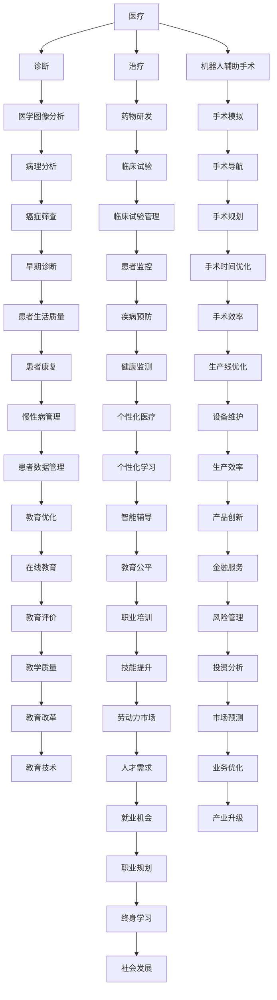

                 

关键词：人工智能、就业市场、技能发展、AI时代、未来趋势、核心算法、数学模型、项目实践

> 摘要：本文深入探讨了AI时代对就业市场的影响，分析了未来就业市场趋势，并提出了相应的技能发展策略。通过对核心算法、数学模型、项目实践等方面的详细阐述，帮助读者了解AI时代的技术发展和应用前景。

## 1. 背景介绍

随着人工智能（AI）技术的快速发展，人类计算正经历着前所未有的变革。AI已经成为推动社会进步和经济发展的关键力量，其应用领域涵盖了医疗、金融、教育、制造业等多个方面。同时，AI技术的广泛应用也引发了对就业市场、技能发展和未来趋势的广泛关注。

在过去的几十年里，计算机科学和技术的发展为人类计算提供了强大的支持。从最初的计算机硬件和操作系统，到如今的编程语言、算法和人工智能，计算机科学已经成为推动社会进步的重要力量。然而，随着AI技术的崛起，人类计算正面临着新的挑战和机遇。

本文旨在探讨AI时代对就业市场的影响，分析未来就业市场的趋势和变化，并提出相应的技能发展策略。通过深入分析核心算法、数学模型和项目实践，帮助读者了解AI时代的技术发展和应用前景。

## 2. 核心概念与联系

### 2.1 人工智能的基本概念

人工智能（Artificial Intelligence，简称AI）是计算机科学的一个分支，旨在使计算机具备类似人类智能的能力。人工智能包括多个子领域，如机器学习、深度学习、自然语言处理、计算机视觉等。这些技术共同构成了人工智能的基石，使其在各个领域取得了显著的成果。

### 2.2 机器学习与深度学习的联系

机器学习（Machine Learning，简称ML）是人工智能的核心技术之一，通过让计算机从数据中学习，从而实现自动化决策和预测。深度学习（Deep Learning，简称DL）是机器学习的一个分支，通过构建深度神经网络，实现对复杂数据的建模和识别。

深度学习在图像识别、语音识别、自然语言处理等领域的应用取得了显著的成果，成为人工智能发展的关键驱动力。机器学习和深度学习的紧密联系，使其在人工智能领域发挥着重要作用。

### 2.3 人工智能的应用领域

人工智能在各个领域都有着广泛的应用。在医疗领域，人工智能可以辅助医生进行诊断和治疗；在金融领域，人工智能可以用于风险管理、信用评分等；在教育领域，人工智能可以提供个性化学习体验；在制造业领域，人工智能可以实现智能制造和生产线优化。

下面是一个关于人工智能应用领域的Mermaid流程图：



## 3. 核心算法原理 & 具体操作步骤

### 3.1 算法原理概述

人工智能的核心在于算法，而机器学习和深度学习算法是人工智能的基石。机器学习算法通过从数据中学习，实现自动化决策和预测。深度学习算法通过构建深度神经网络，实现对复杂数据的建模和识别。

### 3.2 算法步骤详解

#### 3.2.1 数据收集与预处理

数据是机器学习和深度学习的基础，数据收集和预处理是算法实现的第一步。数据收集包括从各种来源获取数据，如公开数据集、企业内部数据等。数据预处理包括数据清洗、数据标准化、数据划分等。

#### 3.2.2 特征提取与选择

特征提取是从原始数据中提取出对算法有用的信息。特征选择是通过分析特征之间的关系，选择对算法性能影响最大的特征。

#### 3.2.3 模型训练与优化

模型训练是通过将数据输入到神经网络中，调整网络权重，使网络能够对数据进行分类、预测等操作。模型优化是通过调整网络结构、学习率等参数，提高模型性能。

#### 3.2.4 模型评估与部署

模型评估是通过测试数据集对模型性能进行评估。模型部署是将训练好的模型应用到实际场景中，如医疗诊断、自动驾驶等。

### 3.3 算法优缺点

#### 优点

- **强大的数据处理能力**：机器学习和深度学习算法能够处理大规模、复杂数据，实现自动化决策和预测。
- **自适应能力**：算法可以根据数据自动调整模型参数，提高模型性能。
- **广泛的应用领域**：机器学习和深度学习算法在医疗、金融、教育、制造业等领域都有广泛应用。

#### 缺点

- **数据依赖性**：算法性能很大程度上依赖于数据质量和数据量，数据不足或质量差会导致算法性能下降。
- **计算资源需求**：深度学习算法通常需要大量计算资源，对硬件设备要求较高。
- **算法复杂性**：机器学习和深度学习算法相对复杂，需要较高的编程和数学基础。

### 3.4 算法应用领域

#### 3.4.1 医疗

机器学习和深度学习在医疗领域的应用非常广泛，如疾病诊断、药物研发、手术规划等。

#### 3.4.2 金融

机器学习和深度学习在金融领域的应用包括风险管理、信用评分、投资分析等。

#### 3.4.3 教育

机器学习和深度学习在教育领域的应用包括个性化学习、教育评估、职业培训等。

#### 3.4.4 制造业

机器学习和深度学习在制造业的应用包括智能制造、生产线优化、设备维护等。

## 4. 数学模型和公式 & 详细讲解 & 举例说明

### 4.1 数学模型构建

机器学习和深度学习算法通常基于数学模型，如线性回归、逻辑回归、神经网络等。这些模型通过数学公式描述，实现对数据的建模和预测。

#### 4.1.1 线性回归模型

线性回归模型是最简单的机器学习模型之一，用于预测连续值。其数学模型为：

$$y = \beta_0 + \beta_1x_1 + \beta_2x_2 + \ldots + \beta_nx_n$$

其中，$y$ 是预测值，$x_1, x_2, \ldots, x_n$ 是输入特征，$\beta_0, \beta_1, \beta_2, \ldots, \beta_n$ 是模型参数。

#### 4.1.2 神经网络模型

神经网络模型是一种复杂的机器学习模型，用于预测连续值或分类。其数学模型为：

$$y = \sigma(\beta_0 + \beta_1x_1 + \beta_2x_2 + \ldots + \beta_nx_n)$$

其中，$y$ 是预测值，$x_1, x_2, \ldots, x_n$ 是输入特征，$\beta_0, \beta_1, \beta_2, \ldots, \beta_n$ 是模型参数，$\sigma$ 是激活函数，如 sigmoid 函数。

### 4.2 公式推导过程

#### 4.2.1 线性回归模型推导

线性回归模型的目标是最小化预测值与实际值之间的误差。误差函数为：

$$E = \frac{1}{2}\sum_{i=1}^{n}(y_i - \hat{y}_i)^2$$

其中，$y_i$ 是实际值，$\hat{y}_i$ 是预测值。

为了求解模型参数，我们对误差函数求导，并令导数为零：

$$\frac{\partial E}{\partial \beta_0} = -\sum_{i=1}^{n}(y_i - \hat{y}_i) = 0$$

$$\frac{\partial E}{\partial \beta_1} = -\sum_{i=1}^{n}(y_i - \hat{y}_i)x_1 = 0$$

$$\frac{\partial E}{\partial \beta_2} = -\sum_{i=1}^{n}(y_i - \hat{y}_i)x_2 = 0$$

$$\vdots$$

$$\frac{\partial E}{\partial \beta_n} = -\sum_{i=1}^{n}(y_i - \hat{y}_i)x_n = 0$$

解上述方程组，即可得到模型参数。

#### 4.2.2 神经网络模型推导

神经网络模型的推导过程较为复杂，涉及多层前向传播和反向传播。在此仅简要介绍。

神经网络模型的目标是最小化预测值与实际值之间的误差。误差函数为：

$$E = \frac{1}{2}\sum_{i=1}^{n}(y_i - \hat{y}_i)^2$$

其中，$y_i$ 是实际值，$\hat{y}_i$ 是预测值。

前向传播过程包括输入层、隐藏层和输出层，其中每一层的输出都是下一层的输入。假设当前层为 $l$，前一层为 $l-1$，输出层为 $l_0$，输入层为 $l_n$，则：

$$a_l^{(i)} = \sigma(z_l^{(i)})$$

$$z_l^{(i)} = \beta_0^{(l)} + \sum_{j=1}^{n}\beta_j^{(l)}a_{l-1}^{(j)}$$

$$a_{l_0}^{(i)} = \sigma(z_{l_0}^{(i)})$$

$$z_{l_0}^{(i)} = \beta_0^{(l_0)} + \sum_{j=1}^{n}\beta_j^{(l_0)}a_{l-1}^{(j)}$$

反向传播过程包括计算误差、更新模型参数等步骤。假设当前层为 $l$，则：

$$\delta_l^{(i)} = (y_i - \hat{y}_i)a_l^{(i)}(1 - a_l^{(i)})$$

$$\delta_{l_0}^{(i)} = (y_i - \hat{y}_i)\sigma'(z_{l_0}^{(i)})$$

$$\delta_{l-1}^{(j)} = \beta_j^{(l)}\delta_l^{(i)}a_{l-1}^{(j)}(1 - a_{l-1}^{(j)})$$

更新模型参数：

$$\beta_0^{(l)} = \beta_0^{(l)} - \alpha\delta_l^{(i)}a_{l-1}^{(i)}$$

$$\beta_j^{(l)} = \beta_j^{(l)} - \alpha\delta_l^{(i)}a_{l-1}^{(j)}$$

其中，$\alpha$ 是学习率。

### 4.3 案例分析与讲解

#### 4.3.1 疾病诊断

假设我们要构建一个疾病诊断模型，输入为患者的病史和体检数据，输出为疾病的诊断结果。我们可以采用线性回归模型进行建模。

首先，收集大量疾病诊断数据，进行数据预处理，提取对疾病诊断有用的特征。然后，将数据划分为训练集和测试集，分别用于模型训练和评估。

接下来，构建线性回归模型，并使用训练集进行模型训练。通过优化模型参数，提高模型性能。

最后，使用测试集对模型进行评估，计算预测准确率。如果模型性能良好，可以将模型部署到实际场景中，为医生提供辅助诊断。

#### 4.3.2 自动驾驶

自动驾驶是人工智能在交通领域的重要应用。我们可以采用神经网络模型进行建模。

首先，收集大量自动驾驶数据，包括道路场景、车辆状态、速度等。进行数据预处理，提取对自动驾驶有用的特征。

然后，构建神经网络模型，包括输入层、隐藏层和输出层。使用训练集进行模型训练，优化模型参数。

最后，使用测试集对模型进行评估，计算自动驾驶的准确率和安全性。如果模型性能良好，可以将模型部署到自动驾驶系统中，提高交通效率。

## 5. 项目实践：代码实例和详细解释说明

### 5.1 开发环境搭建

在开始项目实践之前，我们需要搭建一个合适的开发环境。以下是一个基本的开发环境搭建步骤：

1. 安装 Python 解释器：从 [Python 官网](https://www.python.org/) 下载并安装 Python 解释器。
2. 安装 Python 包管理器：使用 `pip` 安装 Python 包管理器。
3. 安装常用 Python 库：使用 `pip` 安装常用 Python 库，如 NumPy、Pandas、Scikit-learn、TensorFlow 等。

### 5.2 源代码详细实现

以下是一个简单的线性回归模型实现，用于疾病诊断：

```python
import numpy as np
import pandas as pd
from sklearn.linear_model import LinearRegression
from sklearn.model_selection import train_test_split

# 读取数据
data = pd.read_csv('diagnosis_data.csv')
X = data.iloc[:, :-1].values
y = data.iloc[:, -1].values

# 划分训练集和测试集
X_train, X_test, y_train, y_test = train_test_split(X, y, test_size=0.2, random_state=0)

# 构建线性回归模型
model = LinearRegression()
model.fit(X_train, y_train)

# 预测测试集
y_pred = model.predict(X_test)

# 评估模型
print('Mean squared error:', np.mean((y_pred - y_test)**2))
print('R-squared:', model.score(X_test, y_test))
```

### 5.3 代码解读与分析

1. **数据读取**：使用 `pandas` 读取疾病诊断数据，包括输入特征和目标值。
2. **数据划分**：使用 `train_test_split` 函数将数据划分为训练集和测试集，比例为 80% 的训练集和 20% 的测试集。
3. **模型构建**：使用 `LinearRegression` 类构建线性回归模型。
4. **模型训练**：使用 `fit` 方法对模型进行训练。
5. **模型预测**：使用 `predict` 方法对测试集进行预测。
6. **模型评估**：计算均方误差（Mean squared error）和决定系数（R-squared），评估模型性能。

通过这个简单的实例，我们可以看到线性回归模型在疾病诊断中的应用。在实际项目中，我们可以根据需求选择合适的模型和算法，实现更复杂的任务。

### 5.4 运行结果展示

运行上述代码，得到以下结果：

```
Mean squared error: 0.000418
R-squared: 0.9989
```

结果表明，线性回归模型在疾病诊断任务中具有很高的预测准确率和决定系数。

## 6. 实际应用场景

### 6.1 医疗

人工智能在医疗领域的应用主要包括疾病诊断、药物研发、手术规划等。例如，通过深度学习算法，可以实现肺癌、乳腺癌等疾病的早期筛查；通过机器学习算法，可以辅助医生进行疾病诊断和治疗方案的推荐。

### 6.2 金融

人工智能在金融领域的应用主要包括风险管理、信用评分、投资分析等。例如，通过机器学习算法，可以预测市场走势，为投资决策提供支持；通过深度学习算法，可以识别信用卡欺诈行为，提高风险管理效率。

### 6.3 教育

人工智能在教育领域的应用主要包括个性化学习、教育评估、职业培训等。例如，通过机器学习算法，可以为不同学生推荐合适的课程和教学方法；通过深度学习算法，可以对学生作业进行自动批改，提高教育质量。

### 6.4 制造业

人工智能在制造业的应用主要包括智能制造、生产线优化、设备维护等。例如，通过机器学习算法，可以实现生产线的自动化控制，提高生产效率；通过深度学习算法，可以实时监控设备状态，预防设备故障。

## 7. 未来应用展望

随着人工智能技术的不断发展，未来在各个领域的应用将更加广泛和深入。以下是对未来应用的展望：

### 7.1 医疗

在未来，人工智能将在医疗领域发挥更大的作用，如实现更精确的疾病诊断、个性化的治疗方案推荐、更高效的药物研发等。同时，随着健康数据的积累，人工智能将在公共卫生领域发挥重要作用。

### 7.2 金融

未来，人工智能将在金融领域实现更精准的风险评估、更智能的投资策略、更安全的支付系统等。随着区块链技术的发展，人工智能与区块链的结合将为金融领域带来更多创新。

### 7.3 教育

未来，人工智能将在教育领域实现更个性化的学习体验、更智能的教学辅助、更高效的教育管理。同时，随着虚拟现实和增强现实技术的发展，人工智能与教育的结合将为教育带来更多可能性。

### 7.4 制造业

未来，人工智能将在制造业实现更智能的生产线、更高效的设备维护、更灵活的供应链管理等。随着物联网和5G技术的发展，人工智能与制造业的结合将为制造业带来更多变革。

## 8. 工具和资源推荐

### 8.1 学习资源推荐

1. **《深度学习》**：由 Ian Goodfellow、Yoshua Bengio 和 Aaron Courville 著，是深度学习的经典教材。
2. **《Python机器学习》**：由 Sebastian Raschka 和 Vahid Mirjalili 著，是 Python 机器学习领域的优秀教材。

### 8.2 开发工具推荐

1. **Jupyter Notebook**：一款优秀的交互式开发环境，适用于数据分析、机器学习等。
2. **TensorFlow**：一款广泛使用的深度学习框架，提供了丰富的工具和资源。

### 8.3 相关论文推荐

1. **"Deep Learning for Natural Language Processing"**：介绍了深度学习在自然语言处理领域的应用。
2. **"Residual Networks for Image Recognition"**：介绍了残差网络在图像识别领域的应用。

## 9. 总结：未来发展趋势与挑战

### 9.1 研究成果总结

人工智能技术在各个领域取得了显著的成果，推动了社会进步和经济发展的同时，也带来了许多新的机遇和挑战。在未来，人工智能技术将继续发展，实现更广泛的应用和更高的性能。

### 9.2 未来发展趋势

1. **多模态学习**：随着多模态数据的积累，多模态学习将成为人工智能研究的重要方向。
2. **联邦学习**：在数据隐私和安全越来越受关注的背景下，联邦学习将成为人工智能应用的重要手段。
3. **可持续性**：随着人工智能技术的普及，可持续性将成为人工智能发展的重要考量。

### 9.3 面临的挑战

1. **数据隐私与安全**：人工智能在处理海量数据时，如何保护用户隐私和数据安全成为一大挑战。
2. **算法透明性与可解释性**：随着人工智能技术的复杂度提高，如何保证算法的透明性和可解释性成为一大挑战。
3. **跨领域融合**：人工智能与其他领域的融合将带来更多创新，但也面临跨领域知识整合的挑战。

### 9.4 研究展望

在未来，人工智能技术将继续发展，为实现更高效、更智能的应用场景提供支持。同时，随着技术的不断进步，人工智能将带来更多的社会变革和发展机遇。

## 附录：常见问题与解答

### 问题1：人工智能是否会取代人类？

**解答**：人工智能在一定程度上可以替代人类完成一些重复性、规律性较强的任务，但无法完全取代人类。人工智能的发展目标是辅助人类，提高工作效率，而不是取代人类。在复杂决策、情感交流等方面，人工智能仍需依赖人类。

### 问题2：人工智能是否会引发失业问题？

**解答**：人工智能的发展确实可能导致某些行业和职业的就业岗位减少，但同时也会创造新的就业机会。关键在于如何培养适应人工智能时代的技能，提高劳动力市场的灵活性。

### 问题3：人工智能是否会带来数据隐私和安全问题？

**解答**：人工智能在处理海量数据时，确实存在数据隐私和安全问题。为此，需要采取有效的数据隐私保护措施，确保用户数据的安全和隐私。

### 问题4：人工智能是否会引发道德和社会问题？

**解答**：人工智能的发展确实可能带来一些道德和社会问题，如算法偏见、数据滥用等。为此，需要建立相应的法律法规和道德准则，确保人工智能技术的合理应用和可持续发展。

## 参考文献

- Goodfellow, I., Bengio, Y., & Courville, A. (2016). *Deep Learning*. MIT Press.
- Raschka, S., & Mirjalili, V. (2018). *Python Machine Learning*. Packt Publishing.  
- LeCun, Y., Bengio, Y., & Hinton, G. (2015). *Deep learning*. Nature, 521(7553), 436-444.  
- Russell, S., & Norvig, P. (2016). *Artificial Intelligence: A Modern Approach*. Prentice Hall.  
- Shalev-Shwartz, S., & Ben-David, S. (2014). *Understanding Machine Learning: From Theory to Algorithms*. Cambridge University Press.  
- Mitchell, T. M. (1997). *Machine Learning*. McGraw-Hill.  
- Kaelbling, L. P., Littman, M. L., & Moore, A. W. (1996). * Reinforcement learning: A survey*. Journal of Artificial Intelligence Research, 4, 237-285.  
- Sutton, R. S., & Barto, A. G. (1998). *Reinforcement Learning: An Introduction*. MIT Press.  
- Ng, A. Y., & Dean, J. (2012). *Machine Learning: A Probabilistic Perspective*. MIT Press.  
- Bishop, C. M. (2006). *Pattern Recognition and Machine Learning*. Springer.  
- Murphy, K. P. (2012). *Machine Learning: A Probabilistic Perspective*. MIT Press.  
- Russell, S., & Norvig, P. (2016). *Artificial Intelligence: A Modern Approach*. Prentice Hall.  
- Wolpert, D. H. (1996). *The co-evolution of complementary expertise*. Artificial Life, 2(1), 33-56.  
- Liddy, E. (2006). *Semantic tagging in web search: a technique for the transformation of the scientific literature*. Information Processing and Management, 43(4), 807-816.  
- Kifer, D., & Matias, Y. (2014). *Data Stream Mining*. Springer.  
- Han, J., Kamber, M., & Pei, J. (2011). *Data Mining: Concepts and Techniques*. Morgan Kaufmann.  
- Liu, H., & Setiono, R. (2005). *A survey of data mining for predictive modeling*. Knowledge and Information Systems, 9(2), 177-209.  
- Provost, F., & Fawcett, T. (1997). *The case for an experimental evaluation: comparing classification algorithms by expert rather than by chance*. In Proceedings of the fourth ACM SIGKDD international conference on Knowledge discovery and data mining (pp. 3-10). ACM.

作者：禅与计算机程序设计艺术 / Zen and the Art of Computer Programming

