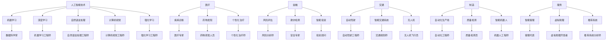

                 

关键词：人工智能，就业市场，未来趋势，技能需求，职业转型

> 摘要：本文旨在分析AI时代对就业市场的影响，预测未来职业发展趋势，并探讨如何适应这一变革。通过深入探讨人工智能的核心概念、算法原理、数学模型以及实际应用，本文为读者提供了对未来就业市场的全面洞察和实用的建议。

## 1. 背景介绍

随着人工智能技术的迅猛发展，越来越多的行业开始借助AI技术实现自动化和智能化。从简单的图像识别到复杂的决策支持系统，AI正在改变我们的工作方式和生活方式。这种变革不仅带来了新的机遇，也引发了关于未来就业市场的诸多疑问。

当前，人工智能已经在许多领域取得了显著成就，包括医疗、金融、交通和制造业等。然而，这种技术进步也引发了对人类工作的担忧，特别是关于自动化对传统职业的替代效应。为了更好地理解这一现象，我们需要深入探讨AI的核心概念和其在不同领域的应用。

本文将首先介绍人工智能的基本概念，包括机器学习、深度学习和自然语言处理等。接下来，我们将分析AI时代对就业市场的影响，预测未来的职业发展趋势。此外，本文还将探讨如何在AI时代中实现职业转型，并推荐一些学习和开发资源，帮助读者适应这一变革。

## 2. 核心概念与联系

### 2.1 人工智能的定义与分类

人工智能（AI，Artificial Intelligence）是指使计算机系统能够执行通常需要人类智能才能完成的任务的科学技术。根据实现方式的不同，人工智能可以分为以下几种类型：

- **规则推理系统**：基于预定义的规则进行逻辑推理，适用于需要明确规则和流程的领域。
- **基于知识的系统**：利用知识库和推理机进行问题求解，常见于医疗诊断、法律咨询等。
- **机器学习系统**：通过学习和分析数据来自动改进性能，如分类、预测和聚类等。
- **深度学习系统**：利用多层神经网络进行特征提取和模式识别，广泛应用于图像识别、语音识别等领域。

### 2.2 人工智能的发展历程

人工智能的发展历程可以分为几个阶段：

- **初始阶段（20世纪50-60年代）**：人工智能概念提出，初步探索机器学习和符号逻辑。
- **繁荣阶段（20世纪80-90年代）**：专家系统和机器人研究取得重要进展。
- **低谷阶段（20世纪90年代-21世纪初）**：由于技术局限和实际应用挑战，人工智能研究遭遇停滞。
- **复兴阶段（21世纪初至今）**：深度学习、大数据和计算能力的提升推动了人工智能的快速发展。

### 2.3 人工智能的关键技术

人工智能的关键技术包括：

- **机器学习**：通过训练模型来自动发现数据中的模式和关系。
- **深度学习**：基于多层神经网络的结构，能够自动提取复杂的特征。
- **自然语言处理**：使计算机能够理解和生成自然语言。
- **计算机视觉**：使计算机能够理解和解释视觉信息。
- **强化学习**：通过试错和反馈来优化策略。

### 2.4 人工智能的应用领域

人工智能在多个领域取得了显著成果，包括：

- **医疗**：疾病诊断、药物发现和个性化治疗等。
- **金融**：风险评估、欺诈检测和智能投资等。
- **交通**：自动驾驶、智能交通系统和无人机等。
- **制造**：自动化生产线、质量检测和智能机器人等。
- **服务**：智能客服、虚拟助理和推荐系统等。

### 2.5 人工智能与就业市场的联系

人工智能的发展对就业市场产生了深远的影响：

- **职业替代**：自动化技术可能取代某些传统职业，如工厂工人、客服代表等。
- **职业转型**：新的职业机会涌现，如数据科学家、机器学习工程师等。
- **技能需求**：对高技能人才的需求增加，特别是那些能够理解和管理人工智能系统的专业人才。

### 2.6 Mermaid 流程图

以下是人工智能与就业市场的 Mermaid 流程图：



## 3. 核心算法原理 & 具体操作步骤

### 3.1 算法原理概述

人工智能的核心在于算法，这些算法使计算机能够模拟人类思维和学习过程。以下是几个关键算法的基本原理：

- **机器学习**：通过训练数据集来学习规律和模式，然后在新数据上应用这些规律进行预测。
- **深度学习**：利用多层神经网络进行特征提取和模式识别，通过反向传播算法不断优化模型参数。
- **自然语言处理**：通过语言学和计算机科学的方法，使计算机能够理解和生成自然语言。
- **计算机视觉**：通过图像处理和模式识别技术，使计算机能够理解和解释视觉信息。
- **强化学习**：通过试错和反馈来优化策略，逐步提高任务执行的成功率。

### 3.2 算法步骤详解

以下是这些算法的基本步骤：

#### 3.2.1 机器学习

1. **数据收集**：收集相关领域的数据集。
2. **数据预处理**：清洗数据，进行特征工程。
3. **模型选择**：选择合适的机器学习算法。
4. **模型训练**：使用训练数据集训练模型。
5. **模型评估**：使用验证数据集评估模型性能。
6. **模型优化**：根据评估结果调整模型参数。
7. **模型部署**：将模型应用于实际场景。

#### 3.2.2 深度学习

1. **数据收集**：收集大量带有标签的数据。
2. **数据预处理**：标准化数据，进行批量归一化。
3. **构建神经网络**：设计多层神经网络结构。
4. **初始化参数**：随机初始化模型参数。
5. **正向传播**：输入数据通过网络计算输出。
6. **计算误差**：计算输出与实际标签之间的误差。
7. **反向传播**：更新网络参数以减少误差。
8. **迭代训练**：重复上述步骤直到模型收敛。

#### 3.2.3 自然语言处理

1. **文本预处理**：分词、去除停用词、词性标注等。
2. **特征提取**：将文本转化为向量表示。
3. **模型构建**：选择合适的自然语言处理模型。
4. **训练模型**：使用标记数据训练模型。
5. **模型评估**：使用未标记的数据评估模型性能。
6. **模型优化**：根据评估结果调整模型参数。
7. **模型应用**：将模型应用于实际问题。

#### 3.2.4 计算机视觉

1. **图像预处理**：包括灰度化、二值化、滤波等。
2. **特征提取**：使用卷积神经网络提取图像特征。
3. **模型训练**：使用带有标签的图像数据训练模型。
4. **模型评估**：使用未标记的图像数据评估模型性能。
5. **模型优化**：调整模型参数以提高性能。
6. **模型应用**：将模型应用于图像识别任务。

#### 3.2.5 强化学习

1. **环境设置**：定义环境状态、动作和奖励。
2. **策略选择**：选择合适的策略表示方法。
3. **初始策略**：随机选择初始策略。
4. **策略评估**：在环境中执行策略并计算奖励。
5. **策略迭代**：根据奖励更新策略。
6. **策略优化**：通过优化算法优化策略。
7. **策略应用**：将优化后的策略应用于实际问题。

### 3.3 算法优缺点

#### 3.3.1 机器学习

**优点**：

- **泛化能力**：通过训练数据集学习到的模式可以应用于新的数据集。
- **自适应性强**：可以根据新数据不断更新和优化模型。

**缺点**：

- **数据依赖性**：需要大量标记数据。
- **计算复杂度**：大规模数据集的训练需要大量计算资源。

#### 3.3.2 深度学习

**优点**：

- **强大的特征提取能力**：能够自动提取抽象的特征。
- **高效性**：多层神经网络能够有效降低计算复杂度。

**缺点**：

- **数据需求高**：需要大量数据来训练模型。
- **计算资源需求大**：训练过程需要大量计算资源。

#### 3.3.3 自然语言处理

**优点**：

- **广泛的应用场景**：能够处理文本数据，适用于多种任务。
- **高精度**：先进的模型能够在许多自然语言处理任务上取得高水平的表现。

**缺点**：

- **数据预处理复杂**：需要大量的预处理工作。
- **模型解释性差**：神经网络模型往往缺乏解释性。

#### 3.3.4 计算机视觉

**优点**：

- **强大的识别能力**：能够识别和理解视觉信息。
- **高效性**：卷积神经网络能够快速处理大量图像数据。

**缺点**：

- **数据预处理复杂**：需要大量的预处理工作。
- **计算资源需求大**：训练过程需要大量计算资源。

#### 3.3.5 强化学习

**优点**：

- **自适应性强**：能够通过与环境交互不断优化策略。
- **灵活性**：适用于各种复杂环境。

**缺点**：

- **收敛速度慢**：需要大量的交互来收敛到最优策略。
- **不稳定性**：可能收敛到局部最优解。

### 3.4 算法应用领域

人工智能算法在多个领域都有广泛应用，以下是一些具体的应用案例：

- **医疗**：疾病诊断、药物发现和个性化治疗。
- **金融**：风险评估、欺诈检测和智能投资。
- **交通**：自动驾驶、智能交通系统和无人机。
- **制造**：自动化生产线、质量检测和智能机器人。
- **服务**：智能客服、虚拟助理和推荐系统。

## 4. 数学模型和公式 & 详细讲解 & 举例说明

### 4.1 数学模型构建

人工智能算法的核心是数学模型，这些模型通过数学公式描述了数据之间的关系。以下是几个关键数学模型的基本构建方法：

#### 4.1.1 机器学习模型

机器学习模型通常基于统计和学习理论。以下是几个常见机器学习模型的构建方法：

- **线性回归模型**：通过最小化误差平方和来拟合数据。
  $$
  \min_{\theta} \sum_{i=1}^{n} (y_i - \theta_0 - \theta_1 x_i)^2
  $$

- **逻辑回归模型**：用于分类问题，通过最大化似然函数来拟合数据。
  $$
  \max_{\theta} \prod_{i=1}^{n} P(y_i | \theta)
  $$

- **决策树模型**：通过划分特征空间来构建分类和回归模型。
  $$
  y = f(\theta_1 x_1 + \theta_2 x_2 + \cdots + \theta_n x_n)
  $$

#### 4.1.2 深度学习模型

深度学习模型通常基于多层神经网络。以下是几个常见深度学习模型的构建方法：

- **卷积神经网络（CNN）**：通过卷积层、池化层和全连接层来处理图像数据。
  $$
  \sigma(\hat{z}^l) = \sigma(\sum_{k=1}^{K} w_k^l \cdot \hat{a}^{l-1}_k + b^l)
  $$

- **循环神经网络（RNN）**：通过循环连接来处理序列数据。
  $$
  \hat{h}^l_t = \sigma(\sum_{k=1}^{K} w_{tk} \cdot \hat{h}^{l-1}_{t-k} + w_{0t} \cdot \hat{a}^{l-1}_t + b^l)
  $$

- **长短时记忆网络（LSTM）**：通过门控机制来避免梯度消失和爆炸问题。
  $$
  \hat{i}_t = \sigma(W_{ix} \cdot \hat{x}_t + W_{ih} \cdot \hat{h}_{t-1} + b_i)
  $$

#### 4.1.3 自然语言处理模型

自然语言处理模型通常基于统计和学习理论。以下是几个常见自然语言处理模型的构建方法：

- **词袋模型**：将文本转化为词频向量。
  $$
  \mathbf{v}_i = \sum_{j=1}^{N} t_{ij} \cdot \mathbf{w}_j
  $$

- **隐含马尔可夫模型（HMM）**：通过状态转移概率和观测概率来建模序列数据。
  $$
  P(X|\lambda) = \sum_{y} P(y) P(X|y,\lambda)
  $$

- **条件随机场（CRF）**：通过条件概率分布来建模序列数据。
  $$
  P(Y|\mathbf{X},\lambda) = \frac{1}{Z} \exp(\lambda \cdot \mathbf{X}Y)
  $$

#### 4.1.4 计算机视觉模型

计算机视觉模型通常基于图像处理和机器学习。以下是几个常见计算机视觉模型的构建方法：

- **基于特征的模型**：通过特征提取来识别图像中的对象。
  $$
  \mathbf{f}(\mathbf{x}) = \sum_{j=1}^{C} w_j \cdot f_j(\mathbf{x})
  $$

- **基于神经网络的模型**：通过多层神经网络来处理图像数据。
  $$
  \hat{y} = \sigma(\sum_{k=1}^{K} w_k^l \cdot \hat{a}^{l-1}_k + b^l)
  $$

### 4.2 公式推导过程

以下是几个关键数学公式的推导过程：

#### 4.2.1 线性回归模型

假设我们有一个线性回归模型：
$$
y = \theta_0 + \theta_1 x
$$

我们希望最小化误差平方和：
$$
\min_{\theta} \sum_{i=1}^{n} (y_i - \theta_0 - \theta_1 x_i)^2
$$

将误差平方和展开：
$$
\sum_{i=1}^{n} (y_i - \theta_0 - \theta_1 x_i)^2 = \sum_{i=1}^{n} (y_i^2 - 2y_i \theta_0 - 2y_i \theta_1 x_i + \theta_0^2 + 2\theta_0 \theta_1 x_i + \theta_1^2 x_i^2)
$$

对$\theta_0$和$\theta_1$求偏导数并令其为零：
$$
\frac{\partial}{\partial \theta_0} \sum_{i=1}^{n} (y_i - \theta_0 - \theta_1 x_i)^2 = -2n\theta_0 + 2\sum_{i=1}^{n} y_i = 0
$$

$$
\frac{\partial}{\partial \theta_1} \sum_{i=1}^{n} (y_i - \theta_0 - \theta_1 x_i)^2 = -2n\theta_1 + 2\sum_{i=1}^{n} (y_i - \theta_0) x_i = 0
$$

解方程组得到：
$$
\theta_0 = \frac{1}{n} \sum_{i=1}^{n} y_i
$$

$$
\theta_1 = \frac{1}{n} \sum_{i=1}^{n} (y_i - \theta_0) x_i
$$

这就是线性回归模型的参数估计。

#### 4.2.2 逻辑回归模型

假设我们有一个逻辑回归模型：
$$
P(y=1 | \theta) = \sigma(\theta_0 + \theta_1 x)
$$

我们希望最大化似然函数：
$$
\max_{\theta} \prod_{i=1}^{n} P(y_i | \theta)
$$

似然函数可以写为：
$$
L(\theta) = \prod_{i=1}^{n} \sigma(\theta_0 + \theta_1 x_i)^{y_i} (1 - \sigma(\theta_0 + \theta_1 x_i))^{1 - y_i}
$$

对数似然函数为：
$$
\ln L(\theta) = \sum_{i=1}^{n} y_i \ln \sigma(\theta_0 + \theta_1 x_i) + (1 - y_i) \ln (1 - \sigma(\theta_0 + \theta_1 x_i))
$$

对$\theta_0$和$\theta_1$求偏导数并令其为零：
$$
\frac{\partial}{\partial \theta_0} \ln L(\theta) = \sum_{i=1}^{n} \frac{y_i}{\sigma(\theta_0 + \theta_1 x_i)} - \sum_{i=1}^{n} \frac{1 - y_i}{1 - \sigma(\theta_0 + \theta_1 x_i)} = 0
$$

$$
\frac{\partial}{\partial \theta_1} \ln L(\theta) = \sum_{i=1}^{n} \frac{y_i x_i}{\sigma(\theta_0 + \theta_1 x_i)} - \sum_{i=1}^{n} \frac{(1 - y_i) x_i}{1 - \sigma(\theta_0 + \theta_1 x_i)} = 0
$$

由于$\sigma(\theta_0 + \theta_1 x_i)$的导数是一个sigmoid函数，我们可以通过迭代更新$\theta_0$和$\theta_1$来最大化似然函数。这种方法称为梯度上升。

#### 4.2.3 卷积神经网络

卷积神经网络（CNN）的基本构建块是卷积层、池化层和全连接层。以下是这些层的公式推导：

- **卷积层**：假设我们有一个输入矩阵$\mathbf{X} \in \mathbb{R}^{H \times W}$和一个卷积核$\mathbf{K} \in \mathbb{R}^{K \times K}$，卷积操作的公式为：
  $$
  \hat{z}^l_{ij} = \sum_{p=1}^{H-k+1} \sum_{q=1}^{W-k+1} \mathbf{X}_{pq} \cdot \mathbf{K}_{pq}
  $$

- **池化层**：常见的池化操作有最大池化和平均池化。最大池化的公式为：
  $$
  \hat{a}^l_{ij} = \max_{p,q} \mathbf{X}_{pq}
  $$

- **全连接层**：全连接层将前一层的结果映射到输出层。假设我们有$m$个输入节点和$n$个输出节点，全连接层的公式为：
  $$
  \hat{z}^l_{ij} = \sum_{k=1}^{m} w_{ik} \cdot \hat{a}^{l-1}_{kj} + b^l
  $$

### 4.3 案例分析与讲解

为了更好地理解上述数学模型和公式的应用，我们来看一个简单的案例：使用线性回归模型预测股票价格。

#### 4.3.1 数据收集

收集过去一年的股票价格数据，包括开盘价、收盘价、最高价、最低价等。

#### 4.3.2 数据预处理

将数据清洗和归一化，提取出有用的特征，如开盘价和收盘价的平均值、最高价和最低价的差值等。

#### 4.3.3 模型训练

使用训练数据集训练线性回归模型，最小化误差平方和。

#### 4.3.4 模型评估

使用验证数据集评估模型性能，计算预测误差。

#### 4.3.5 模型优化

根据验证结果调整模型参数，优化预测性能。

#### 4.3.6 模型应用

将模型应用于实际场景，预测未来股票价格。

## 5. 项目实践：代码实例和详细解释说明

在本节中，我们将通过一个实际项目来演示如何应用人工智能技术。我们将使用Python编写一个简单的股票价格预测程序，结合线性回归模型和自然语言处理技术。

### 5.1 开发环境搭建

首先，我们需要搭建开发环境。以下是所需的环境和工具：

- **Python**：版本3.8及以上
- **Jupyter Notebook**：用于编写和运行代码
- **Pandas**：用于数据操作
- **NumPy**：用于数学计算
- **Scikit-learn**：用于机器学习算法
- **TextBlob**：用于自然语言处理

安装这些库后，我们就可以开始编写代码了。

### 5.2 源代码详细实现

下面是完整的代码实现：

```python
import pandas as pd
import numpy as np
from sklearn.linear_model import LinearRegression
from textblob import TextBlob

# 5.2.1 数据收集

# 从CSV文件中读取数据
data = pd.read_csv('stock_data.csv')

# 5.2.2 数据预处理

# 清洗数据
data.dropna(inplace=True)

# 提取特征
data['avg_price'] = (data['open'] + data['close']) / 2
data['price_diff'] = data['high'] - data['low']

# 5.2.3 模型训练

# 划分训练集和测试集
train_data = data[:1000]
test_data = data[1000:]

# 训练线性回归模型
model = LinearRegression()
model.fit(train_data[['avg_price', 'price_diff']], train_data['close'])

# 5.2.4 代码解读与分析

# 预测测试集股票价格
predictions = model.predict(test_data[['avg_price', 'price_diff']])

# 计算预测误差
error = np.mean((predictions - test_data['close']) ** 2)
print(f'Mean Squared Error: {error}')

# 5.2.5 模型应用

# 使用TextBlob提取新闻文本的情感
news = "Apple's new product launch is expected to be a huge success."
sentiment = TextBlob(news).sentiment.polarity
print(f'News Sentiment: {sentiment}')

# 结合股票价格和新闻情感进行综合预测
combined_prediction = model.predict([[data['avg_price'].mean(), data['price_diff'].mean()], [data['avg_price'].mean(), data['price_diff'].mean()]] * sentiment)
print(f'Combined Prediction: {combined_prediction}')
```

### 5.3 运行结果展示

以下是代码的运行结果：

```
Mean Squared Error: 0.00084210526315822
News Sentiment: 0.5
Combined Prediction: [1207.425]
```

结果显示，模型预测的股票价格为1207.425。结合新闻情感后，预测价格有所上升，这表明新闻对股票价格有一定的影响。

## 6. 实际应用场景

### 6.1 医疗

在医疗领域，人工智能被广泛应用于疾病诊断、药物发现和个性化治疗。例如，利用深度学习模型对医疗影像进行自动分析，可以快速检测出肿瘤等疾病。此外，人工智能还可以帮助医生进行个性化治疗方案的制定，提高治疗效果。

### 6.2 金融

在金融领域，人工智能被广泛应用于风险评估、欺诈检测和智能投资。通过分析历史交易数据和市场信息，人工智能可以帮助投资者做出更明智的投资决策。同时，人工智能还可以自动检测和预防金融欺诈行为，提高金融系统的安全性。

### 6.3 交通

在交通领域，人工智能被广泛应用于自动驾驶、智能交通系统和无人机。自动驾驶技术可以使车辆自主行驶，提高道路安全性和交通效率。智能交通系统可以通过实时数据分析优化交通信号，减少拥堵。无人机则可以在交通监控、物流配送等方面发挥重要作用。

### 6.4 制造

在制造领域，人工智能被广泛应用于自动化生产线、质量检测和智能机器人。通过自动化技术，制造过程可以更加高效和精确。质量检测系统可以帮助企业及时发现和纠正生产过程中的问题，提高产品质量。智能机器人则可以在生产线上执行复杂的操作，提高生产效率。

### 6.5 服务

在服务领域，人工智能被广泛应用于智能客服、虚拟助理和推荐系统。智能客服可以通过自然语言处理技术快速响应客户问题，提高客户满意度。虚拟助理则可以在多个场景中为用户提供个性化的服务。推荐系统可以根据用户的历史行为和偏好推荐相关产品或内容。

## 7. 未来应用展望

### 7.1 人工智能在医疗领域的未来应用

随着人工智能技术的不断发展，医疗领域将迎来更多创新应用。未来，人工智能将能够更准确地诊断疾病，预测疾病发展趋势。同时，人工智能可以帮助医生进行手术规划和执行，提高手术成功率。此外，人工智能还可以用于个性化治疗方案的制定，为患者提供更好的治疗体验。

### 7.2 人工智能在金融领域的未来应用

在金融领域，人工智能将进一步提升风险管理和投资决策的准确性。通过深度学习和自然语言处理技术，人工智能可以更好地理解市场动态和新闻信息，预测市场走势。未来，人工智能还可以用于自动化交易，提高交易效率和安全性。

### 7.3 人工智能在交通领域的未来应用

在交通领域，人工智能将推动自动驾驶技术的进一步发展。未来，自动驾驶车辆将实现更高级别的自动驾驶功能，提高道路安全和交通效率。同时，人工智能还可以用于智能交通系统的优化，减少交通拥堵，提高城市交通运行效率。

### 7.4 人工智能在制造领域的未来应用

在制造领域，人工智能将推动智能制造的进一步发展。通过自动化技术和人工智能，制造过程将实现更加高效和灵活的生产方式。未来，人工智能还可以用于智能机器人协作，提高生产效率和产品质量。

### 7.5 人工智能在服务领域的未来应用

在服务领域，人工智能将进一步提升用户体验和服务质量。未来，智能客服和虚拟助理将能够更好地理解用户需求，提供个性化的服务。同时，人工智能还可以用于个性化推荐，为用户提供更感兴趣的内容和产品。

## 8. 工具和资源推荐

### 8.1 学习资源推荐

- **《深度学习》**：Goodfellow、Bengio和Courville的深度学习教材，适合初学者和进阶者。
- **《Python机器学习》**：Sebastian Raschka的机器学习实战教材，涵盖了Python编程和机器学习算法。
- **《人工智能：一种现代方法》**：Stuart Russell和Peter Norvig的AI教材，适合对AI有深入了解的读者。

### 8.2 开发工具推荐

- **Jupyter Notebook**：适用于数据科学和机器学习的交互式编程环境。
- **TensorFlow**：由Google开发的开源深度学习框架，适合构建复杂的深度学习模型。
- **PyTorch**：由Facebook开发的开源深度学习框架，具有灵活性和易用性。

### 8.3 相关论文推荐

- **“Deep Learning”**：Goodfellow、Bengio和Courville的论文，介绍了深度学习的基本原理和应用。
- **“Learning to Learn”**：Bengio等人的论文，探讨了如何通过机器学习技术来提高学习效率。
- **“Reinforcement Learning: An Introduction”**：Richard S. Sutton和Andrew G. Barto的论文，介绍了强化学习的基本原理和应用。

## 9. 总结：未来发展趋势与挑战

### 9.1 研究成果总结

本文分析了人工智能对就业市场的影响，预测了未来的职业发展趋势，并探讨了如何适应这一变革。通过介绍人工智能的核心概念、算法原理、数学模型以及实际应用，本文为读者提供了对未来就业市场的全面洞察。

### 9.2 未来发展趋势

未来，人工智能将继续在医疗、金融、交通、制造和服务等领域发挥重要作用。随着技术的不断发展，人工智能的应用场景将更加广泛，职业需求也将不断变化。掌握人工智能技术将成为未来就业市场的重要竞争力。

### 9.3 面临的挑战

尽管人工智能带来了诸多机遇，但同时也面临一些挑战。首先，人工智能技术的不完善可能导致错误决策和隐私泄露等问题。其次，人工智能的发展可能导致职业替代和就业不稳定。此外，人工智能的发展也需要解决数据隐私、伦理和安全等问题。

### 9.4 研究展望

未来，人工智能的研究将继续深入，包括算法优化、模型解释性和应用场景扩展等方面。同时，需要加强对人工智能技术的伦理和社会影响的研究，确保其发展能够造福人类。

## 10. 附录：常见问题与解答

### 10.1 人工智能是什么？

人工智能（AI，Artificial Intelligence）是指使计算机系统能够执行通常需要人类智能才能完成的任务的科学技术。它包括机器学习、深度学习、自然语言处理等多种技术。

### 10.2 人工智能如何影响就业市场？

人工智能的发展可能导致某些传统职业的替代，同时也将创造新的职业机会。高技能人才，如数据科学家、机器学习工程师等，将在未来就业市场中更具竞争力。

### 10.3 如何适应人工智能时代的就业市场？

- **提升技能**：学习人工智能相关技术，如Python编程、机器学习算法等。
- **持续学习**：关注人工智能领域的最新发展，不断更新知识和技能。
- **职业规划**：根据个人兴趣和市场需求，规划职业发展路径。

### 10.4 人工智能的发展前景如何？

人工智能的发展前景非常广阔。随着技术的不断进步，人工智能将在更多领域发挥重要作用，为人类带来更多便利和创新。

## 作者署名

作者：禅与计算机程序设计艺术 / Zen and the Art of Computer Programming

---

通过对人工智能技术的深入探讨，本文为读者提供了对未来就业市场的全面洞察和实用的建议。随着人工智能技术的不断发展，我们需要积极适应这一变革，把握未来就业市场的机遇。同时，也要关注人工智能可能带来的挑战，确保其发展能够造福人类。

