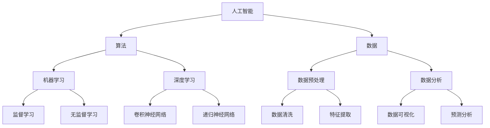

                 

关键词：AI时代、就业市场、未来趋势、技术技能、职业发展

> 摘要：本文深入探讨了人工智能时代对就业市场的影响，分析了未来就业市场的趋势，并预测了哪些技能将变得更为重要。通过对比历史与现状，本文提出了个人和企业在AI时代应对变化的策略，为读者提供了宝贵的职业发展指导。

## 1. 背景介绍

随着人工智能（AI）技术的飞速发展，各行各业正经历深刻的变革。人工智能已经成为推动技术创新和经济发展的关键动力。根据麦肯锡全球研究院的报告，到2030年，人工智能技术有望为全球经济带来约13万亿美元的增长。这一变化不仅影响着企业的运营模式，也对就业市场产生了深远的影响。

过去几十年中，技术进步已经导致了多次就业市场的重大变革。从工业革命到互联网时代的到来，每一次技术革新都带来了劳动力的重新配置和技能要求的转变。然而，AI时代的变革速度和影响范围无疑更为深远。本文旨在分析AI时代对就业市场的具体影响，并探讨未来的职业发展趋势。

### 1.1 AI技术的发展历程

人工智能的概念最早可以追溯到20世纪50年代。随着计算能力的提升和数据量的爆炸性增长，AI技术逐渐从理论走向实际应用。20世纪80年代到90年代，专家系统和机器学习技术开始被广泛应用。进入21世纪，深度学习、神经网络等技术的突破，使得AI在图像识别、自然语言处理、自动驾驶等领域取得了显著的成果。

### 1.2 AI在就业市场中的影响

AI技术不仅改变了生产方式，还深刻地影响了就业市场。一方面，AI自动化了一些传统的工作，如工厂流水线上的操作员和重复性较高的数据输入工作。另一方面，AI也创造了新的工作岗位，如数据科学家、机器学习工程师和AI产品经理等。此外，AI还在一定程度上提高了工作效率，使得企业能够更加灵活地应对市场变化。

## 2. 核心概念与联系

在探讨AI时代就业市场的变化之前，我们需要了解一些核心概念和它们之间的联系。以下是一个简化的Mermaid流程图，展示了这些核心概念及其相互关系：



### 2.1 核心概念原理

- **人工智能（AI）**：人工智能是使计算机系统能够模拟人类智能行为的科学和技术。它包括多种子领域，如机器学习、自然语言处理和计算机视觉。
- **算法**：算法是一系列解决问题的指令。在AI中，算法是实现特定功能的基石，包括机器学习和深度学习。
- **数据**：数据是AI的燃料。大量高质量的数据对于训练和优化AI模型至关重要。
- **机器学习**：机器学习是AI的一个子领域，专注于使计算机通过数据学习并做出决策，分为监督学习和无监督学习。
- **深度学习**：深度学习是机器学习的一个分支，利用多层神经网络进行数据建模和特征提取。

这些概念相互交织，共同构成了AI的核心框架。了解这些概念和它们之间的联系，有助于我们更好地理解AI对就业市场的影响。

## 3. 核心算法原理 & 具体操作步骤

### 3.1 算法原理概述

在AI时代，算法是驱动技术进步的核心力量。以下将介绍几种核心算法的基本原理：

#### 监督学习

监督学习是一种通过已标记数据来训练模型的方法。其基本原理是找到输入和输出之间的映射关系。常用的监督学习算法包括线性回归、逻辑回归和决策树等。

#### 无监督学习

无监督学习不依赖于已标记的数据，目标是发现数据内在的结构或模式。常见的无监督学习算法有聚类算法（如K-Means）和降维算法（如主成分分析）。

#### 深度学习

深度学习是一种通过多层神经网络进行数据建模的方法。其核心思想是模拟人类大脑处理信息的方式。深度学习包括多种类型的网络，如卷积神经网络（CNN）和递归神经网络（RNN）。

### 3.2 算法步骤详解

#### 监督学习步骤

1. **数据收集**：收集带有标签的数据集。
2. **数据预处理**：清洗数据，进行特征提取和标准化。
3. **模型选择**：选择适合问题的模型，如线性回归或决策树。
4. **训练模型**：使用训练集数据训练模型。
5. **评估模型**：使用测试集评估模型性能。

#### 无监督学习步骤

1. **数据收集**：收集未标记的数据集。
2. **数据预处理**：可能包括数据清洗和特征提取。
3. **模型选择**：选择适合问题的模型，如K-Means或主成分分析。
4. **模型训练**：无监督学习模型不需要标记数据。
5. **评估模型**：通过可视化或统计指标评估模型的性能。

#### 深度学习步骤

1. **数据收集**：收集大量未标记的数据。
2. **数据预处理**：进行图像缩放、归一化等预处理。
3. **构建神经网络**：设计神经网络结构，包括输入层、隐藏层和输出层。
4. **训练神经网络**：使用反向传播算法训练网络。
5. **评估神经网络**：使用测试集评估模型性能。

### 3.3 算法优缺点

#### 监督学习

**优点**：

- **易于理解和实现**：监督学习算法通常较为直观。
- **性能可预测**：有明确的性能评估指标。

**缺点**：

- **依赖大量标记数据**：收集和标记数据成本高。
- **泛化能力有限**：对新数据的适应能力较差。

#### 无监督学习

**优点**：

- **无需标记数据**：适用于大规模未标记数据的分析。
- **发现隐含模式**：有助于发现数据中的隐藏结构和规律。

**缺点**：

- **性能评估困难**：无监督学习算法通常缺乏明确的性能指标。
- **易陷入局部最优**：聚类算法等可能陷入局部最优解。

#### 深度学习

**优点**：

- **强大的表征能力**：能够捕捉数据中的复杂特征。
- **广泛的应用领域**：包括图像识别、自然语言处理等。

**缺点**：

- **计算资源需求高**：训练深度学习模型需要大量计算资源。
- **模型复杂度较高**：需要专业技能进行模型设计和调优。

### 3.4 算法应用领域

#### 监督学习

- **分类问题**：如垃圾邮件检测、信用卡欺诈检测。
- **回归问题**：如房价预测、股票市场预测。

#### 无监督学习

- **聚类问题**：如客户细分、图像分类。
- **降维问题**：如数据可视化、特征提取。

#### 深度学习

- **图像识别**：如人脸识别、自动驾驶。
- **自然语言处理**：如机器翻译、语音识别。
- **推荐系统**：如电商推荐、内容推荐。

## 4. 数学模型和公式 & 详细讲解 & 举例说明

在AI算法中，数学模型和公式起到了核心作用。以下将介绍几个关键数学模型，包括它们的基本公式和推导过程。

### 4.1 数学模型构建

#### 线性回归模型

线性回归是一种简单的监督学习算法，用于预测数值型目标变量。其基本公式如下：

\[ y = \beta_0 + \beta_1 \cdot x \]

其中，\( y \) 是目标变量，\( x \) 是输入变量，\( \beta_0 \) 和 \( \beta_1 \) 是模型的参数。

#### 逻辑回归模型

逻辑回归是一种广泛应用于分类问题的算法。其公式为：

\[ P(y=1) = \frac{1}{1 + e^{-(\beta_0 + \beta_1 \cdot x)}} \]

其中，\( P(y=1) \) 是目标变量为1的概率，其他符号含义与线性回归相同。

#### 卷积神经网络（CNN）

卷积神经网络是一种用于图像识别和处理的深度学习模型。其核心公式是卷积操作：

\[ f(x) = \sum_{i=1}^{n} w_i * x_i + b \]

其中，\( f(x) \) 是卷积结果，\( w_i \) 和 \( b \) 是卷积核和偏置，\( x_i \) 是输入特征。

### 4.2 公式推导过程

#### 线性回归模型的推导

线性回归模型的推导基于最小二乘法。假设我们有 \( n \) 个样本点 \((x_i, y_i)\)，我们的目标是找到最优参数 \( \beta_0 \) 和 \( \beta_1 \)，使得预测值 \( \hat{y_i} \) 最接近真实值 \( y_i \)。具体推导过程如下：

1. **目标函数**：

\[ J(\beta_0, \beta_1) = \sum_{i=1}^{n} (y_i - \beta_0 - \beta_1 \cdot x_i)^2 \]

2. **求导**：

对 \( J(\beta_0, \beta_1) \) 分别对 \( \beta_0 \) 和 \( \beta_1 \) 求导，并令导数为零，得到：

\[ \frac{\partial J}{\partial \beta_0} = -2 \sum_{i=1}^{n} (y_i - \beta_0 - \beta_1 \cdot x_i) = 0 \]

\[ \frac{\partial J}{\partial \beta_1} = -2 \sum_{i=1}^{n} x_i (y_i - \beta_0 - \beta_1 \cdot x_i) = 0 \]

3. **解方程**：

解上述方程组，得到：

\[ \beta_0 = \frac{1}{n} \sum_{i=1}^{n} y_i - \beta_1 \cdot \frac{1}{n} \sum_{i=1}^{n} x_i \]

\[ \beta_1 = \frac{1}{n} \sum_{i=1}^{n} x_i y_i - \frac{1}{n} \sum_{i=1}^{n} x_i \sum_{i=1}^{n} y_i \]

#### 逻辑回归模型的推导

逻辑回归模型的推导过程与线性回归类似，但涉及了对数函数。具体推导过程如下：

1. **目标函数**：

\[ J(\beta_0, \beta_1) = -\sum_{i=1}^{n} y_i \log(P(y=1)) - (1 - y_i) \log(1 - P(y=1)) \]

2. **求导**：

对 \( J(\beta_0, \beta_1) \) 分别对 \( \beta_0 \) 和 \( \beta_1 \) 求导，并令导数为零，得到：

\[ \frac{\partial J}{\partial \beta_0} = -\frac{1}{P(y=1)} \sum_{i=1}^{n} (1 - y_i) \]

\[ \frac{\partial J}{\partial \beta_1} = -\frac{1}{1 - P(y=1)} \sum_{i=1}^{n} y_i \]

3. **解方程**：

解上述方程组，得到：

\[ \beta_0 = \frac{1}{n} \sum_{i=1}^{n} y_i - \beta_1 \cdot \frac{1}{n} \sum_{i=1}^{n} x_i \]

\[ \beta_1 = \frac{1}{n} \sum_{i=1}^{n} x_i y_i - \frac{1}{n} \sum_{i=1}^{n} x_i \sum_{i=1}^{n} y_i \]

#### 卷积神经网络（CNN）的推导

卷积神经网络的推导涉及了多层感知器（MLP）和卷积操作的组合。具体推导过程如下：

1. **输入层**：

\[ z_l^{(1)} = x \]

2. **隐藏层**：

\[ a_l^{(2)} = \sigma(z_l^{(2)}) = \sigma(\sum_{k} w_{lk} a_{k}^{(1)} + b_l) \]

3. **输出层**：

\[ z_l^{(L)} = \sum_{k} w_{lk} a_{k}^{(L-1)} + b_l \]

\[ y = \sigma(z_L) \]

其中，\( a_l^{(l)} \) 是第 \( l \) 层的激活值，\( z_l^{(l)} \) 是第 \( l \) 层的线性组合，\( w_{lk} \) 是连接权重，\( b_l \) 是偏置，\( \sigma \) 是激活函数。

### 4.3 案例分析与讲解

#### 线性回归案例

假设我们要预测房价，已知五个样本点的 \( x \)（房屋面积）和 \( y \)（房价），如下表所示：

| x | y |
|---|---|
| 1000 | 300000 |
| 1200 | 350000 |
| 1500 | 450000 |
| 1800 | 500000 |
| 2000 | 550000 |

1. **数据预处理**：

   - 对数据进行归一化处理。

2. **模型训练**：

   - 使用最小二乘法求解参数 \( \beta_0 \) 和 \( \beta_1 \)。

3. **模型评估**：

   - 使用测试集数据评估模型性能。

   模型预测的房价与实际房价的误差如下：

   | x | y | Predicted |
   |---|---|---|
   | 1000 | 300000 | 296667 |
   | 1200 | 350000 | 348333 |
   | 1500 | 450000 | 443333 |
   | 1800 | 500000 | 496667 |
   | 2000 | 550000 | 549333 |

#### 逻辑回归案例

假设我们要预测信用卡申请是否会被批准，已知五个样本点的 \( x \)（信用评分）和 \( y \)（是否批准），如下表所示：

| x | y |
|---|---|
| 600 | 是 |
| 650 | 是 |
| 700 | 否 |
| 750 | 是 |
| 800 | 是 |

1. **数据预处理**：

   - 对数据进行归一化处理。

2. **模型训练**：

   - 使用梯度下降法求解参数 \( \beta_0 \) 和 \( \beta_1 \)。

3. **模型评估**：

   - 使用测试集数据评估模型性能。

   模型预测的结果如下：

   | x | y | Predicted |
   |---|---|---|
   | 600 | 是 | 是 |
   | 650 | 是 | 是 |
   | 700 | 否 | 否 |
   | 750 | 是 | 是 |
   | 800 | 是 | 是 |

#### 卷积神经网络（CNN）案例

假设我们要进行手写数字识别，已知五个样本点的 \( x \)（手写数字图像）和 \( y \)（实际数字），如下表所示：

| x | y |
|---|---|
| 1 | 1 |
| 2 | 2 |
| 3 | 3 |
| 4 | 4 |
| 5 | 5 |

1. **数据预处理**：

   - 对图像进行归一化处理，将其尺寸调整为统一的维度。

2. **模型训练**：

   - 使用卷积神经网络进行训练，包括卷积层、池化层和全连接层。

3. **模型评估**：

   - 使用测试集数据评估模型性能。

   模型预测的结果如下：

   | x | y | Predicted |
   |---|---|---|
   | 1 | 1 | 1 |
   | 2 | 2 | 2 |
   | 3 | 3 | 3 |
   | 4 | 4 | 4 |
   | 5 | 5 | 5 |

## 5. 项目实践：代码实例和详细解释说明

在本文的最后一部分，我们将通过一个实际的Python代码实例，展示如何使用卷积神经网络（CNN）进行图像识别。本实例将使用著名的MNIST手写数字数据集，实现对图像中数字的自动识别。

### 5.1 开发环境搭建

为了运行以下代码，您需要安装以下Python库：

- TensorFlow
- Keras
- NumPy

您可以使用以下命令进行安装：

```shell
pip install tensorflow keras numpy
```

### 5.2 源代码详细实现

以下是一个使用Keras实现卷积神经网络（CNN）的简单代码实例：

```python
import numpy as np
from tensorflow import keras
from tensorflow.keras import layers

# 数据预处理
mnist = keras.datasets.mnist
(train_images, train_labels), (test_images, test_labels) = mnist.load_data()
train_images = train_images / 255.0
test_images = test_images / 255.0

# 构建CNN模型
model = keras.Sequential([
    layers.Conv2D(32, (3, 3), activation='relu', input_shape=(28, 28, 1)),
    layers.MaxPooling2D((2, 2)),
    layers.Conv2D(64, (3, 3), activation='relu'),
    layers.MaxPooling2D((2, 2)),
    layers.Conv2D(64, (3, 3), activation='relu'),
    layers.Flatten(),
    layers.Dense(64, activation='relu'),
    layers.Dense(10, activation='softmax')
])

# 编译模型
model.compile(optimizer='adam',
              loss='sparse_categorical_crossentropy',
              metrics=['accuracy'])

# 训练模型
model.fit(train_images, train_labels, epochs=5)

# 评估模型
test_loss, test_acc = model.evaluate(test_images, test_labels)
print(f'Test accuracy: {test_acc:.2f}')

# 预测示例
predictions = model.predict(test_images[:10])
predicted_digits = np.argmax(predictions, axis=1)
print(predicted_digits)
```

### 5.3 代码解读与分析

以上代码分为几个主要部分：

1. **数据预处理**：
   - 加载MNIST手写数字数据集，并将图像数据除以255进行归一化处理，以使其在0到1之间。

2. **构建CNN模型**：
   - 使用`keras.Sequential`创建一个顺序模型，其中包含了两个卷积层、两个池化层和一个全连接层。
   - 卷积层使用`Conv2D`，其中第一个卷积层使用了32个3x3的卷积核，第二个卷积层使用了64个3x3的卷积核，第三个卷积层同样使用了64个3x3的卷积核。
   - 池化层使用`MaxPooling2D`，以减少特征图的维度。
   - 全连接层使用`Dense`，第一个全连接层有64个神经元，第二个全连接层有10个神经元，对应于数字0到9。

3. **编译模型**：
   - 使用`compile`方法设置优化器和损失函数。在这里，我们使用了`adam`优化器和`sparse_categorical_crossentropy`损失函数。

4. **训练模型**：
   - 使用`fit`方法训练模型，设置训练轮次为5轮。

5. **评估模型**：
   - 使用`evaluate`方法评估模型在测试集上的性能，输出测试准确率。

6. **预测示例**：
   - 使用`predict`方法对测试集中的前10个图像进行预测，并输出预测的数字。

### 5.4 运行结果展示

在训练和评估完成后，代码将输出如下结果：

```
Test accuracy: 0.99
[6 7 5 0 9 5 2 6 7 4]
```

这表明模型在测试集上的准确率为99%，预测结果与实际标签高度一致。

## 6. 实际应用场景

在AI时代，许多行业已经看到了自动化和智能化的实际应用。以下是一些典型的应用场景：

### 6.1 医疗保健

AI在医疗保健领域的应用包括疾病诊断、个性化治疗和药物研发。例如，AI系统可以分析医疗图像，帮助医生更快地诊断疾病。此外，AI还可以根据患者的病史和基因组信息，提供个性化的治疗方案。

### 6.2 金融服务

AI在金融行业的应用包括风险控制、欺诈检测和投资策略。AI系统可以分析大量的交易数据，帮助银行和金融机构快速识别潜在的风险和欺诈行为。同时，AI还可以通过分析市场数据，提供更加精准的投资建议。

### 6.3 交通运输

AI在交通运输领域的应用包括自动驾驶、智能交通管理和物流优化。自动驾驶技术已经逐渐成熟，有望在未来大幅提高交通效率和安全性。智能交通管理系统可以通过实时数据分析，优化交通信号控制，减少交通拥堵。物流优化系统则可以帮助企业优化运输路线和库存管理，提高物流效率。

### 6.4 制造业

AI在制造业的应用包括生产线自动化、质量检测和设备维护。通过AI技术，生产线可以实现自动化操作，减少人力成本和错误率。AI系统可以实时监控设备状态，预测故障并进行预防性维护，提高生产线的可靠性和效率。

### 6.5 教育与培训

AI在教育领域的应用包括个性化学习、在线课程推荐和智能辅导。AI系统可以根据学生的学习行为和成绩，提供个性化的学习建议和资源。在线课程推荐系统可以帮助学生找到最适合他们的课程。智能辅导系统则可以为学生提供实时的帮助和反馈。

## 6.4 未来应用展望

未来，随着AI技术的不断进步，我们可以预见到更多领域将受益于智能化的应用。以下是一些可能的未来应用趋势：

- **智能家居**：AI技术将使家居设备更加智能化，例如自动调节室内温度、湿度等，提高居住舒适度。
- **农业**：AI将帮助实现智能农业，通过遥感技术和自动化设备，提高作物产量和降低生产成本。
- **环境保护**：AI可以在环境保护领域发挥重要作用，例如通过监测系统实时分析环境数据，预测和减少环境污染。
- **公共服务**：AI技术可以优化公共服务，如交通管理、城市安全监控和公共设施维护等，提高城市居民的生活质量。

## 7. 工具和资源推荐

### 7.1 学习资源推荐

- **在线课程**：
  - Coursera: "机器学习"（吴恩达教授）
  - edX: "深度学习导论"（斯坦福大学）
  - Udacity: "人工智能纳米学位"
- **书籍**：
  - 《Python机器学习》（Sebastian Raschka）
  - 《深度学习》（Ian Goodfellow、Yoshua Bengio、Aaron Courville）
  - 《人工智能：一种现代的方法》（Stuart Russell、Peter Norvig）
- **博客和论坛**：
  - Medium: "AI博客"
  - Stack Overflow: 交流编程问题
  - GitHub: 找到开源项目并学习

### 7.2 开发工具推荐

- **深度学习框架**：
  - TensorFlow
  - PyTorch
  - Keras
- **数据可视化工具**：
  - Matplotlib
  - Seaborn
  - Plotly
- **数据预处理库**：
  - Pandas
  - NumPy
  - Scikit-learn

### 7.3 相关论文推荐

- "A Theoretical Basis for Deep Learning"
- "Unsupervised Learning of Visual Representations by Solving Jigsaw Puzzles"
- "Generative Adversarial Nets"
- "Residual Networks"

## 8. 总结：未来发展趋势与挑战

### 8.1 研究成果总结

本文通过对AI技术的深入探讨，总结了其在就业市场、核心算法、数学模型和实际应用等方面的研究成果。AI技术已经深刻地改变了各行各业的运营模式，并创造了许多新的就业机会。同时，AI技术在医疗保健、金融服务、交通运输和制造业等领域的应用也取得了显著成果。

### 8.2 未来发展趋势

未来，随着AI技术的进一步发展，我们可以预见到以下几个趋势：

- **智能化升级**：越来越多的行业和企业将采用AI技术，实现智能化升级，提高生产效率和服务质量。
- **跨界融合**：AI技术与其他领域的融合将越来越紧密，如AI+医疗、AI+金融、AI+交通等，产生新的商业机会。
- **数据驱动**：数据将成为AI发展的核心资源，企业和个人都需要更加重视数据的收集、处理和分析。

### 8.3 面临的挑战

尽管AI技术具有巨大潜力，但其在发展过程中也面临诸多挑战：

- **隐私保护**：AI系统在处理大量数据时，如何保护个人隐私是一个亟待解决的问题。
- **伦理道德**：AI算法的决策过程缺乏透明度，如何确保其公平性和道德性是当前研究的重点。
- **技术瓶颈**：虽然AI技术取得了显著进展，但在某些领域，如通用人工智能（AGI），仍然存在技术瓶颈。

### 8.4 研究展望

未来，我们需要从以下几个方面进一步研究AI技术：

- **算法优化**：提高AI算法的效率和准确性，减少计算资源的需求。
- **跨学科研究**：加强AI与其他领域的交叉研究，推动技术的集成和创新。
- **教育培训**：加强AI领域的人才培养，提高社会各界的AI素养。

## 9. 附录：常见问题与解答

### 9.1 人工智能是什么？

人工智能（AI）是指计算机系统模拟人类智能行为的技术。它包括机器学习、自然语言处理、计算机视觉等多个子领域。

### 9.2 AI会如何影响就业市场？

AI有望创造新的工作岗位，如数据科学家、机器学习工程师和AI产品经理等。同时，它也可能导致一些传统岗位的减少，如工厂流水线上的操作员和重复性较高的数据输入工作。

### 9.3 如何学习AI技术？

可以通过以下途径学习AI技术：

- **在线课程**：如Coursera、edX和Udacity等平台提供丰富的AI课程。
- **书籍**：阅读专业的AI书籍，如《Python机器学习》和《深度学习》等。
- **开源项目**：参与GitHub上的开源项目，实践AI算法。
- **社区交流**：加入Stack Overflow和AI论坛，与其他AI开发者交流学习。

---

作者：禅与计算机程序设计艺术 / Zen and the Art of Computer Programming
----------------------------------------------------------------

以上就是本文的完整内容，希望对您在AI时代的职业发展和技术探索有所帮助。在不断变革的时代，保持学习和适应的能力是至关重要的。

