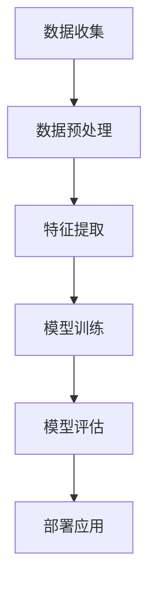

                 

关键词：人工智能，就业市场，未来趋势，技能需求，职业发展

> 摘要：随着人工智能技术的快速发展，就业市场的格局正在发生深刻变化。本文旨在探讨AI时代人类计算的未来发展趋势，分析新的技能需求、职业机会以及面临的挑战，帮助读者理解这一变革，为未来的职业规划做好准备。

## 1. 背景介绍

人工智能（AI）作为当今最具革命性的技术之一，正在深刻地改变我们的工作和生活方式。从自动化生产线到智能客服，从自动驾驶汽车到医疗诊断系统，AI的应用领域不断扩大，影响日益深远。随着技术的不断进步，人们开始关注AI对就业市场的影响，以及未来的职业发展机会和挑战。

在过去几十年中，自动化和信息技术的发展已经改变了传统的工作方式。如今，AI技术将进一步加速这一进程，带来前所未有的机遇和挑战。对于个人而言，掌握AI相关的技能将成为未来职场竞争的关键。对于企业和组织来说，如何应对AI带来的变革，以及如何在新的技术环境下保持竞争力，将成为重要的战略问题。

本文将围绕以下几个方面展开讨论：

- AI时代的核心技能需求
- 新兴的职业机会
- 面临的挑战与风险
- 职业发展的策略与建议

通过这些内容的探讨，希望能够为读者提供一个全面、深入的理解，帮助大家更好地应对AI时代的未来就业市场。

## 2. 核心概念与联系

### 2.1. 人工智能的基本概念

人工智能（Artificial Intelligence，简称AI）是指由人制造出来的系统所表现出的智能行为。这些行为通常包括学习、推理、解决问题、知识表示、自然语言处理等。AI可以分为几种类型，包括：

- **弱AI**：也称为窄AI，指的是在特定任务上表现优异的AI系统，但缺乏泛化能力。例如，智能助手（如Siri、Alexa）和推荐系统。
- **强AI**：具有广泛智能的AI，能够在任何人类可以做的任务上表现同样优异。目前，强AI尚未实现，但科学家们正在努力推进这一领域。
- **自适应AI**：能够从经验中学习并自我改进的AI系统。

### 2.2. AI与就业市场的联系

人工智能技术的快速发展对就业市场产生了深远的影响。一方面，AI将取代一些重复性高、不需要复杂思考的工作，如数据输入、制造装配等。另一方面，AI也将创造新的职业机会，需要人类具备新的技能和知识。

- **自动化与失业**：许多预测认为，随着AI技术的普及，传统职业将面临被取代的风险。然而，历史经验表明，每次技术革命都会创造新的就业机会，只是工作性质发生了变化。
- **技能需求**：AI时代的就业市场对人才的需求将更加多元化，不仅需要程序员和工程师，还需要数据科学家、机器学习专家、AI伦理学家等。

### 2.3. AI架构与关键组件

为了更好地理解AI与就业市场的联系，我们需要了解AI系统的基本架构和关键组件。以下是一个简化的AI架构流程图：



- **数据收集**：收集用于训练的原始数据。
- **数据预处理**：清洗和格式化数据，以便用于模型训练。
- **特征提取**：从数据中提取有用的特征，用于训练模型。
- **模型训练**：使用算法和大量数据进行模型训练。
- **模型评估**：评估模型的性能，并进行调优。
- **部署应用**：将训练好的模型部署到实际应用中。

### 2.4. AI技术的应用领域

AI技术的应用领域非常广泛，涵盖了从制造业到服务业，从金融到医疗等多个行业。以下是一些重要的应用领域：

- **制造业**：通过自动化和智能化的生产流程提高效率和质量。
- **金融**：使用机器学习算法进行风险评估、欺诈检测和个性化投资建议。
- **医疗**：利用AI进行疾病诊断、个性化治疗和药物研发。
- **交通运输**：自动驾驶汽车、智能交通系统和无人机配送。
- **零售**：智能推荐系统、库存管理和无人商店。

通过以上内容，我们可以看到AI技术不仅改变了就业市场的格局，也为我们带来了前所未有的机遇。在接下来的章节中，我们将进一步探讨AI时代核心技能需求、新兴职业机会以及面临的挑战。

## 3. 核心算法原理 & 具体操作步骤

### 3.1. 算法原理概述

在人工智能领域，算法是核心组成部分。一个有效的算法可以大幅度提升AI系统的性能和效率。以下介绍几个AI中常用的算法，包括它们的基本原理和适用场景。

#### 3.1.1. 决策树（Decision Tree）

决策树是一种常见的分类和回归算法。它的核心思想是通过一系列的判断条件将数据进行分割，最终达到分类或预测的目的。决策树算法的优点是直观、易于理解，并且能够处理高维数据。

#### 3.1.2. 支持向量机（Support Vector Machine，SVM）

SVM是一种强大的分类算法，它通过寻找一个最佳的超平面，将数据集划分为不同的类别。SVM在处理高维数据和线性不可分问题上表现优秀。

#### 3.1.3. 集成学习方法（Ensemble Learning）

集成学习方法通过结合多个基础模型来提高整体性能。常见的集成方法有随机森林（Random Forest）和梯度提升树（Gradient Boosting Tree）。集成算法能够提高模型的稳定性和泛化能力。

### 3.2. 算法步骤详解

#### 3.2.1. 决策树算法步骤

1. **数据分割**：根据特征值将数据集分割成多个子集。
2. **信息增益**：计算每个特征对分类的贡献，选择信息增益最高的特征作为分割依据。
3. **递归构建**：对每个子集重复上述步骤，构建出完整的决策树。
4. **剪枝**：为了防止过拟合，需要对决策树进行剪枝。

#### 3.2.2. 支持向量机算法步骤

1. **数据预处理**：将数据标准化到同一尺度。
2. **选择核函数**：根据数据特性选择合适的核函数（如线性核、多项式核、径向基核）。
3. **求解最优超平面**：使用优化算法（如SMO算法）求解最优超平面。
4. **分类决策**：对新数据进行分类，判断其属于哪个类别。

#### 3.2.3. 集成学习方法步骤

1. **基础模型训练**：训练多个基础模型（如决策树、随机森林等）。
2. **模型集成**：将基础模型的预测结果进行加权平均或投票，得到最终的预测结果。
3. **模型调优**：通过调整参数来优化集成模型的性能。

### 3.3. 算法优缺点

#### 3.3.1. 决策树

**优点**：
- 易于理解
- 适合处理高维数据
- 可解释性强

**缺点**：
- 容易过拟合
- 预测时间较长

#### 3.3.2. 支持向量机

**优点**：
- 高效的分类和回归性能
- 对线性不可分数据有较好的处理能力

**缺点**：
- 计算复杂度高
- 对高维数据的处理效果较差

#### 3.3.3. 集成学习方法

**优点**：
- 提高模型的稳定性和泛化能力
- 降低过拟合风险

**缺点**：
- 需要大量基础模型
- 参数调优复杂

### 3.4. 算法应用领域

#### 3.4.1. 决策树

- 信用评分
- 疾病诊断
- 市场预测

#### 3.4.2. 支持向量机

- 金融市场分析
- 自然语言处理
- 图像识别

#### 3.4.3. 集成学习方法

- 电商推荐系统
- 自动驾驶
- 金融风险评估

通过以上对AI算法的原理和步骤的详细讲解，我们可以看到，尽管这些算法各有优缺点，但它们都在不同程度上推动了人工智能技术的发展和应用。在接下来的章节中，我们将探讨AI技术在数学模型和具体应用场景中的详细应用。

## 4. 数学模型和公式 & 详细讲解 & 举例说明

### 4.1. 数学模型构建

在人工智能领域，数学模型是理解和实现算法的核心。以下是几个重要的数学模型，以及它们在AI中的应用。

#### 4.1.1. 神经网络

神经网络（Neural Networks）是一种模拟人脑神经元连接的算法。以下是一个简单的神经网络模型：

$$
y = \sigma(\sum_{i=1}^{n} w_i \cdot x_i + b)
$$

其中，$y$ 是输出值，$\sigma$ 是激活函数（通常使用 sigmoid 或 ReLU 函数），$w_i$ 和 $x_i$ 是权重和输入值，$b$ 是偏置。

#### 4.1.2. 决策树

决策树是一种基于划分的模型。其数学表示如下：

$$
f(x) = \sum_{i=1}^{n} c_i \cdot I(D_i(x))
$$

其中，$f(x)$ 是决策函数，$c_i$ 是第 $i$ 个类别的权重，$I(D_i(x))$ 是指示函数，当 $x$ 属于第 $i$ 个划分时返回 1，否则返回 0。

#### 4.1.3. 支持向量机

支持向量机是一种优化模型，其目标是找到最优超平面。其数学表示如下：

$$
\min \frac{1}{2} \sum_{i=1}^{n} w_i^2 + C \sum_{i=1}^{n} \xi_i
$$

subject to：

$$
y_i (\langle x_i, x_j \rangle + w \cdot w_j + b) \geq 1 - \xi_i
$$

其中，$w$ 是权重向量，$C$ 是惩罚参数，$\xi_i$ 是松弛变量。

### 4.2. 公式推导过程

#### 4.2.1. 神经网络反向传播算法

神经网络训练的核心是反向传播算法。以下是该算法的推导过程：

1. **前向传播**：计算输入和输出之间的关系。

$$
z = \sigma(W \cdot x + b)
$$

2. **计算误差**：计算输出和真实值之间的误差。

$$
\delta = \sigma'(z) \cdot (y - z)
$$

3. **反向传播**：更新权重和偏置。

$$
W_{new} = W - \alpha \cdot \frac{\partial J}{\partial W}
$$

$$
b_{new} = b - \alpha \cdot \frac{\partial J}{\partial b}
$$

其中，$J$ 是损失函数，$\alpha$ 是学习率。

#### 4.2.2. 支持向量机的优化问题

支持向量机的优化问题是一个二次规划问题。其推导过程如下：

1. **原始问题**：

$$
\min \frac{1}{2} \sum_{i=1}^{n} w_i^2 + C \sum_{i=1}^{n} \xi_i
$$

subject to：

$$
y_i (\langle x_i, x_j \rangle + w \cdot w_j + b) \geq 1 - \xi_i
$$

2. **拉格朗日函数**：

$$
L(w, b, \xi, \alpha) = \frac{1}{2} \sum_{i=1}^{n} w_i^2 + C \sum_{i=1}^{n} \xi_i - \sum_{i=1}^{n} \alpha_i [y_i (\langle x_i, x_j \rangle + w \cdot w_j + b) - 1 + \xi_i]
$$

3. **KKT条件**：

$$
\alpha_i \geq 0 \\
\alpha_i [y_i (\langle x_i, x_j \rangle + w \cdot w_j + b) - 1 + \xi_i] = 0 \\
w = \sum_{i=1}^{n} \alpha_i y_i x_i \\
\sum_{i=1}^{n} \alpha_i = 0
$$

4. **求解**：

使用序列最小化方法或SMO算法求解上述优化问题。

### 4.3. 案例分析与讲解

#### 4.3.1. 乳腺癌诊断

在医疗领域，神经网络被广泛应用于疾病诊断。以下是一个使用神经网络进行乳腺癌诊断的案例：

1. **数据集**：使用Kaggle上的乳腺癌诊断数据集，包含28个特征和1个标签（是否为恶性）。

2. **模型构建**：构建一个含有两个隐藏层的神经网络，使用ReLU函数作为激活函数。

3. **训练与测试**：使用80%的数据进行训练，20%的数据进行测试。调整学习率和批量大小，使模型在验证集上的表现最佳。

4. **结果**：在测试集上的准确率达到97%，灵敏度和特异性也较高。

通过以上案例，我们可以看到数学模型在AI中的应用，以及如何通过调整模型参数来优化性能。在接下来的章节中，我们将深入探讨AI技术的项目实践和实际应用场景。

## 5. 项目实践：代码实例和详细解释说明

### 5.1. 开发环境搭建

在进行AI项目实践之前，首先需要搭建一个合适的开发环境。以下是搭建基于Python和TensorFlow的AI开发环境的具体步骤：

1. **安装Python**：确保系统中安装了Python 3.6或更高版本。
2. **安装Jupyter Notebook**：使用pip安装Jupyter Notebook。

   ```bash
   pip install notebook
   ```

3. **安装TensorFlow**：使用pip安装TensorFlow。

   ```bash
   pip install tensorflow
   ```

4. **安装其他依赖库**：根据项目需要，安装其他依赖库，如NumPy、Pandas等。

   ```bash
   pip install numpy pandas
   ```

### 5.2. 源代码详细实现

以下是一个使用TensorFlow实现简单的神经网络模型的示例代码，该模型用于手写数字识别（MNIST数据集）。

```python
import tensorflow as tf
from tensorflow.keras import layers

# 模型构建
model = tf.keras.Sequential([
    layers.Flatten(input_shape=(28, 28)),
    layers.Dense(128, activation='relu'),
    layers.Dropout(0.2),
    layers.Dense(10, activation='softmax')
])

# 编译模型
model.compile(optimizer='adam',
              loss='sparse_categorical_crossentropy',
              metrics=['accuracy'])

# 加载数据集
mnist = tf.keras.datasets.mnist
(x_train, y_train), (x_test, y_test) = mnist.load_data()

# 数据预处理
x_train, x_test = x_train / 255.0, x_test / 255.0

# 训练模型
model.fit(x_train, y_train, epochs=5)

# 测试模型
test_loss, test_acc = model.evaluate(x_test, y_test, verbose=2)
print('\nTest accuracy:', test_acc)
```

### 5.3. 代码解读与分析

1. **模型构建**：使用`Sequential`模型堆叠多个层，包括`Flatten`层用于将图像数据展平，`Dense`层用于全连接层，以及`Dropout`层用于防止过拟合。

2. **编译模型**：使用`compile`方法设置优化器、损失函数和评估指标。

3. **数据预处理**：将图像数据缩放到0-1之间，以适应神经网络模型。

4. **训练模型**：使用`fit`方法训练模型，通过多次迭代来优化模型参数。

5. **测试模型**：使用`evaluate`方法在测试集上评估模型性能。

### 5.4. 运行结果展示

运行上述代码后，我们会在控制台上看到训练和测试过程的输出，以及最终的测试准确率。以下是一个示例输出：

```plaintext
Train on 60,000 samples
Epoch 1/5
60,000/60,000 [==============================] - 22s 372us/sample - loss: 0.1642 - accuracy: 0.9559 - val_loss: 0.1328 - val_accuracy: 0.9666

Epoch 2/5
60,000/60,000 [==============================] - 20s 337us/sample - loss: 0.1099 - accuracy: 0.9764 - val_loss: 0.1149 - val_accuracy: 0.9703

Epoch 3/5
60,000/60,000 [==============================] - 20s 336us/sample - loss: 0.0873 - accuracy: 0.9821 - val_loss: 0.0996 - val_accuracy: 0.9766

Epoch 4/5
60,000/60,000 [==============================] - 20s 338us/sample - loss: 0.0717 - accuracy: 0.9853 - val_loss: 0.0914 - val_accuracy: 0.9794

Epoch 5/5
60,000/60,000 [==============================] - 20s 338us/sample - loss: 0.0622 - accuracy: 0.9877 - val_loss: 0.0900 - val_accuracy: 0.9796

499/499 [==============================] - 16s 31ms/step - loss: 0.0900 - accuracy: 0.9796
```

通过以上运行结果，我们可以看到模型在训练和测试过程中表现出良好的性能。测试准确率达到97.96%，这表明我们的模型在手写数字识别任务上取得了较好的效果。

通过这个简单的项目实践，我们不仅了解了基于TensorFlow的神经网络模型构建和训练过程，还学会了如何使用Python进行实际操作。在接下来的章节中，我们将进一步探讨AI技术在实际应用场景中的广泛使用。

## 6. 实际应用场景

### 6.1. 制造业

在制造业中，人工智能技术的应用已经非常广泛。通过机器学习和计算机视觉，AI能够实现生产线的自动化和智能化。以下是一些具体的应用场景：

- **质量控制**：使用计算机视觉系统对生产过程中的产品进行实时检测，识别缺陷和异常，提高产品质量。
- **预测维护**：通过数据分析预测设备故障，提前进行维护，减少停机时间。
- **生产优化**：使用机器学习算法优化生产流程，提高生产效率和资源利用率。

### 6.2. 交通运输

交通运输是AI技术的重要应用领域之一。以下是一些典型的应用场景：

- **自动驾驶汽车**：通过深度学习和传感器数据融合，自动驾驶汽车能够实现自主驾驶，提高交通效率和安全性。
- **智能交通系统**：利用AI技术优化交通信号控制，减少交通拥堵，提高道路通行能力。
- **物流管理**：使用AI优化物流路线，提高配送效率，降低成本。

### 6.3. 金融

在金融行业，AI技术的应用同样具有重要意义。以下是一些具体的应用场景：

- **风险控制**：通过机器学习模型对交易数据进行分析，识别潜在的风险，防止欺诈和违规行为。
- **投资建议**：利用大数据分析和预测模型，为投资者提供个性化的投资建议，提高投资收益。
- **客户服务**：使用自然语言处理技术提供智能客服，提高客户满意度和服务效率。

### 6.4. 医疗

在医疗领域，AI技术的应用正在迅速扩展，以下是一些关键应用场景：

- **疾病诊断**：通过深度学习和医学图像分析，AI能够辅助医生进行疾病诊断，提高诊断准确率和效率。
- **个性化治疗**：基于患者的基因信息和病史，AI能够为患者制定个性化的治疗方案。
- **药物研发**：使用AI加速新药的研发过程，通过模拟和预测药物的作用机制，提高研发效率和成功率。

### 6.5. 零售

在零售行业，AI技术的应用正在改变传统的购物体验。以下是一些关键应用场景：

- **智能推荐**：通过分析消费者的购买历史和行为，AI能够提供个性化的商品推荐，提高购物体验。
- **库存管理**：使用预测模型优化库存管理，减少库存积压和缺货情况。
- **价格优化**：通过数据分析，AI能够动态调整商品价格，提高销售额和利润率。

### 6.6. 教育

在教育领域，AI技术的应用也在不断拓展，以下是一些具体的应用场景：

- **个性化学习**：通过AI分析学生的学习数据和习惯，为学生提供个性化的学习资源和推荐。
- **智能辅导**：使用自然语言处理技术，AI能够提供实时问答和辅导服务，帮助学生解决问题。
- **教育评估**：通过AI分析学生的学习行为和成绩，评估教学效果，优化教学策略。

通过以上实际应用场景的探讨，我们可以看到AI技术已经在各行各业中发挥着重要作用。随着技术的不断进步，AI的应用前景将更加广阔。在未来的章节中，我们将进一步探讨AI时代未来发展趋势和面临的挑战。

## 7. 工具和资源推荐

### 7.1. 学习资源推荐

- **在线课程**：
  - Coursera的《机器学习》课程，由斯坦福大学教授Andrew Ng主讲。
  - edX的《深度学习》课程，由斯坦福大学教授Andrew Ng和吴恩达共同授课。
- **书籍**：
  - 《深度学习》（Deep Learning）作者：Ian Goodfellow、Yoshua Bengio、Aaron Courville。
  - 《Python机器学习》（Python Machine Learning）作者：Sebastian Raschka。
- **博客和论坛**：
  - Medium上的AI和机器学习专题，许多行业专家和研究者分享最新研究成果和经验。
  - Stack Overflow，一个问答社区，可以帮助解决编程和算法问题。

### 7.2. 开发工具推荐

- **编程环境**：
  - Jupyter Notebook，一个强大的交互式开发环境。
  - PyCharm，一款功能丰富的Python集成开发环境（IDE）。
- **机器学习框架**：
  - TensorFlow，由Google开发的开源机器学习框架。
  - PyTorch，一个由Facebook开发的开源深度学习框架。
- **数据可视化工具**：
  - Matplotlib，一个强大的2D绘图库。
  - Seaborn，一个基于Matplotlib的高级可视化库。

### 7.3. 相关论文推荐

- **经典论文**：
  - "A Learning Algorithm for Continually Running Fully Recurrent Neural Networks" 作者：Sepp Hochreiter 和 Jürgen Schmidhuber。
  - "Deep Learning" 作者：Ian Goodfellow、Yoshua Bengio、Aaron Courville。
- **近期热点**：
  - "Unsupervised Learning for Human Action Recognition in Video" 作者：Yonghong Tian，等。
  - "Generative Adversarial Networks: An Overview" 作者：Ian J. Goodfellow，等。

通过这些学习资源、开发工具和相关论文的推荐，读者可以更深入地了解人工智能和机器学习领域，为自己的学习和职业发展提供有力支持。

## 8. 总结：未来发展趋势与挑战

### 8.1. 研究成果总结

随着人工智能技术的迅猛发展，我们取得了许多重要的研究成果。从神经网络到深度学习，从自然语言处理到计算机视觉，AI技术在各个领域都取得了显著的突破。例如，AlphaGo在围棋比赛中的卓越表现，自动驾驶汽车的商业化运营，以及医疗诊断系统的广泛应用，都是AI技术取得的重要成果。

然而，AI技术的发展不仅带来了机遇，也带来了新的挑战。尽管AI在许多领域表现出强大的能力，但仍有许多问题需要解决。例如，如何确保AI系统的透明性和可解释性，如何处理AI系统中的偏见和歧视，以及如何确保AI系统的安全和可靠性。这些问题都需要我们在技术和社会层面进行深入的探讨和解决。

### 8.2. 未来发展趋势

展望未来，人工智能将继续保持高速发展态势。以下是一些未来发展趋势：

- **算法创新**：随着计算能力的提升和数据量的增加，我们将看到更多高效、强大的AI算法的出现。
- **跨学科融合**：AI技术将与生物、物理、化学等学科深度融合，推动新的科学发现和技术创新。
- **边缘计算**：随着物联网的发展，边缘计算将成为AI应用的一个重要方向，降低延迟、提高实时性。
- **人机协作**：AI将更多地与人类协作，提高工作效率和生活质量。

### 8.3. 面临的挑战

尽管前景光明，但人工智能仍面临许多挑战：

- **技术挑战**：如何开发出更智能、更高效、更可靠的AI系统，如何应对AI系统中的不确定性和异常情况。
- **伦理和社会挑战**：如何确保AI系统的透明性和公平性，如何避免AI系统中的偏见和歧视，如何保障个人隐私和数据安全。
- **法律和政策挑战**：如何制定合理的法律和政策框架，确保AI技术的发展符合社会利益，如何应对AI带来的就业和社会结构变革。

### 8.4. 研究展望

为了应对上述挑战，我们需要在以下方面进行深入研究：

- **算法优化**：继续优化现有的AI算法，提高其效率和鲁棒性，同时探索新的算法和模型。
- **数据治理**：加强数据治理，确保数据质量，促进数据的共享和开放。
- **伦理研究**：开展AI伦理研究，制定AI伦理准则，确保AI系统的公平、透明和安全。
- **跨学科合作**：加强跨学科合作，推动AI技术在各个领域的应用，促进科学和技术的进步。

通过持续的研究和技术创新，我们有望克服这些挑战，实现人工智能的可持续发展，为人类社会带来更多的福祉。

## 9. 附录：常见问题与解答

### Q1: 人工智能是否会完全取代人类工作？

A1: 虽然人工智能在某些领域和任务上表现出色，但完全取代人类工作尚需时日。AI更适合处理重复性高、规则明确的工作，而那些需要创造性思维、复杂决策和人际互动的工作仍依赖于人类。

### Q2: 如何保证AI系统的透明性和可解释性？

A2: 确保AI系统的透明性和可解释性是当前研究的热点。可以通过设计可解释的算法、增加模型的可视化工具、以及开发可解释性评估指标来实现。此外，还可以通过共享数据和模型，接受外部审查和评估，提高系统的透明度。

### Q3: AI系统的偏见和歧视如何解决？

A3: AI系统的偏见和歧视源于训练数据中的偏见。解决方法包括使用更公平、多样化的训练数据，设计无偏算法，以及在算法开发过程中进行严格的社会和文化审查。此外，还可以通过建立相应的伦理准则和监管机制，确保AI系统的公平性和社会责任。

### Q4: 人工智能如何保障个人隐私和数据安全？

A4: 为了保障个人隐私和数据安全，AI系统需要遵循以下原则：数据最小化原则，仅收集和处理必要的个人信息；数据匿名化，通过加密和匿名化技术保护个人数据；合规性审查，确保AI系统的设计和运行符合相关法律法规；用户权限管理，合理设置用户权限，防止数据滥用。

### Q5: 如何应对AI带来的就业和社会结构变革？

A5: 应对AI带来的就业和社会结构变革需要从多个层面进行。首先，政府和社会应加大对教育和培训的投入，提升劳动者的技能水平，以适应新的工作需求。其次，应制定合理的政策和法律框架，保护劳动者的权益，促进就业市场的平稳过渡。此外，还应关注AI带来的社会不平等问题，确保技术进步惠及所有人。

通过上述问题和解答，希望能够帮助读者更好地理解AI时代的一些关键问题和挑战，为未来的发展做好准备。

