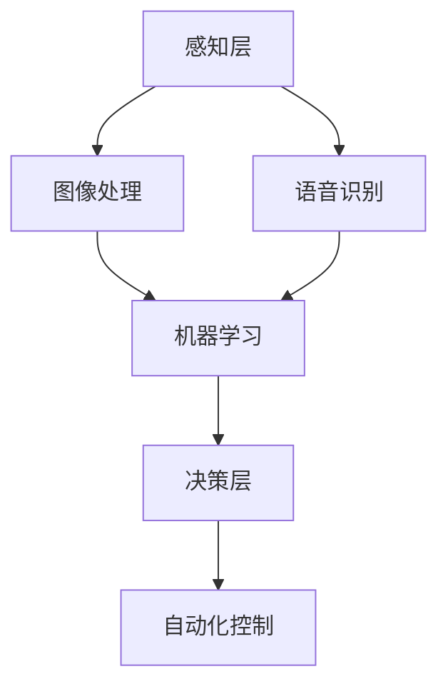

                 

关键词：人工智能，就业机会，未来工作，职业发展，技能提升

> 摘要：本文旨在探讨人工智能（AI）时代下，人类计算的就业前景。通过对核心概念的阐述，算法原理的解析，以及项目实践与实际应用场景的分析，文章将揭示在AI时代如何适应和利用技术变革，以实现个人职业发展的新机遇。

## 1. 背景介绍

随着人工智能技术的迅猛发展，我们正站在一个新的时代门槛上。机器学习、深度学习、自然语言处理等领域的突破，正在深刻地改变各行各业的生产和服务方式。从工业自动化到智能医疗，从智能交通到智能家居，人工智能的应用已经渗透到我们的日常生活。这一变革不仅提高了生产效率，还带来了大量的新职业和就业机会。

然而，随着技术的进步，我们也面临着诸多挑战。一方面，一些传统行业和职位可能会被自动化技术所取代；另一方面，新的技术和行业模式又不断涌现，需要人类计算的专业知识和创新能力。因此，如何在AI时代保持竞争力，成为每位职场人士都必须思考的问题。

本文将围绕以下主题展开：

1. **核心概念与联系**：介绍人工智能的基本概念和架构，通过Mermaid流程图展示其核心原理。
2. **核心算法原理与操作步骤**：深入分析关键算法的原理，详细讲解其操作步骤。
3. **数学模型与公式**：阐述相关数学模型和公式的构建及推导过程，并举例说明。
4. **项目实践**：通过具体代码实例，展示人工智能在实际项目中的应用。
5. **实际应用场景**：探讨人工智能在不同领域的应用，以及未来发展趋势。
6. **工具和资源推荐**：推荐学习资源和开发工具，以帮助读者掌握相关技能。
7. **总结**：总结研究成果，展望未来发展趋势与挑战。

## 2. 核心概念与联系

### 2.1 人工智能的基本概念

人工智能（Artificial Intelligence，简称AI）是指通过计算机程序和算法模拟人类智能的一门科学。它包括知识表示、问题求解、智能推理、机器学习、自然语言处理等多个方面。AI的目标是使计算机能够执行通常需要人类智能才能完成的任务，如视觉识别、语音识别、决策制定等。

### 2.2 人工智能的架构

人工智能的架构通常分为三个层次：感知层、认知层和决策层。

1. **感知层**：主要负责信息的采集和预处理。包括传感器数据采集、图像处理、语音识别等。
2. **认知层**：基于感知层的数据进行智能分析，实现对信息的理解和理解。包括机器学习、深度学习、自然语言处理等。
3. **决策层**：根据分析结果进行决策和行动。包括预测模型、规划算法、自动化控制等。

### 2.3 Mermaid流程图

为了更好地理解人工智能的架构，我们可以使用Mermaid流程图来展示其核心原理。以下是一个简化的Mermaid流程图示例：



## 3. 核心算法原理与操作步骤

### 3.1 算法原理概述

在人工智能领域，算法是实现智能的关键。以下是几种核心算法的原理概述：

1. **机器学习算法**：通过训练模型，使计算机能够从数据中学习并作出预测。常见的机器学习算法包括线性回归、决策树、支持向量机等。
2. **深度学习算法**：基于多层神经网络的结构，通过反向传播算法进行参数优化。常见的深度学习算法包括卷积神经网络（CNN）、循环神经网络（RNN）等。
3. **自然语言处理算法**：用于处理和理解自然语言数据，如词向量表示、语言模型、机器翻译等。

### 3.2 算法步骤详解

以深度学习算法为例，其操作步骤通常包括：

1. **数据预处理**：包括数据清洗、归一化、数据增强等。
2. **模型设计**：根据任务需求设计神经网络结构，包括层数、节点数、激活函数等。
3. **模型训练**：使用训练数据对模型进行参数优化，通过反向传播算法不断调整权重。
4. **模型评估**：使用验证数据集评估模型性能，包括准确率、召回率、F1值等。
5. **模型部署**：将训练好的模型部署到实际应用环境中，进行实时预测和决策。

### 3.3 算法优缺点

每种算法都有其优缺点：

- **机器学习算法**：简单易实现，适用于结构化数据；但模型泛化能力较弱，对大规模数据需求较高。
- **深度学习算法**：能够处理大规模数据，具有很好的泛化能力；但模型复杂，训练时间较长，对计算资源需求较高。
- **自然语言处理算法**：能够处理非结构化数据，具有很好的语义理解能力；但模型参数多，训练时间较长。

### 3.4 算法应用领域

各种算法在不同领域有广泛的应用：

- **机器学习算法**：广泛应用于金融风控、推荐系统、图像识别等领域。
- **深度学习算法**：广泛应用于自动驾驶、语音识别、图像生成等领域。
- **自然语言处理算法**：广泛应用于机器翻译、情感分析、文本生成等领域。

## 4. 数学模型和公式

### 4.1 数学模型构建

在人工智能中，数学模型是算法的基础。以下是几种常见的数学模型：

1. **线性回归模型**：用于预测线性关系，公式为 $y = w_0 + w_1 \cdot x$。
2. **决策树模型**：用于分类和回归任务，公式为 $y = f(x)$，其中 $f$ 为决策函数。
3. **卷积神经网络模型**：用于图像识别和生成，公式为 $y = f(g(x))$，其中 $f$ 和 $g$ 分别为激活函数和卷积操作。

### 4.2 公式推导过程

以线性回归模型为例，其推导过程如下：

1. **目标函数**：最小化预测值与真实值之间的误差，公式为 $J(w_0, w_1) = \frac{1}{2} \sum_{i=1}^{n} (y_i - (w_0 + w_1 \cdot x_i))^2$。
2. **梯度下降**：对目标函数求导，得到梯度 $\nabla J(w_0, w_1) = \sum_{i=1}^{n} (y_i - (w_0 + w_1 \cdot x_i)) \cdot (-1 \cdot x_i)$。
3. **迭代更新**：根据梯度更新模型参数，公式为 $w_0 = w_0 - \alpha \cdot \nabla J(w_0)$，$w_1 = w_1 - \alpha \cdot \nabla J(w_1)$，其中 $\alpha$ 为学习率。

### 4.3 案例分析与讲解

以图像分类任务为例，使用卷积神经网络模型进行图像识别。首先，将图像输入到卷积层，通过卷积操作提取特征。然后，将特征输入到池化层，进行降维操作。最后，将池化层的结果输入到全连接层，进行分类预测。具体实现过程如下：

1. **数据预处理**：将图像数据归一化，并划分为训练集和测试集。
2. **模型设计**：设计卷积神经网络模型，包括卷积层、池化层和全连接层。
3. **模型训练**：使用训练数据集训练模型，通过反向传播算法优化模型参数。
4. **模型评估**：使用测试数据集评估模型性能，调整模型参数。
5. **模型部署**：将训练好的模型部署到实际应用环境中，进行图像分类预测。

## 5. 项目实践：代码实例和详细解释说明

### 5.1 开发环境搭建

为了进行人工智能项目的实践，我们需要搭建一个合适的开发环境。以下是基本的开发环境搭建步骤：

1. **安装Python**：下载并安装Python，版本要求为3.7及以上。
2. **安装PyTorch**：通过pip命令安装PyTorch，命令为 `pip install torch torchvision`。
3. **安装Jupyter Notebook**：通过pip命令安装Jupyter Notebook，命令为 `pip install notebook`。

### 5.2 源代码详细实现

以下是一个简单的图像分类项目，使用PyTorch框架实现。代码分为数据预处理、模型设计、模型训练、模型评估和模型部署五个部分。

```python
# 数据预处理
import torchvision.transforms as transforms
import torchvision.datasets as datasets

transform = transforms.Compose([
    transforms.Resize(256),
    transforms.CenterCrop(224),
    transforms.ToTensor(),
    transforms.Normalize(mean=[0.485, 0.456, 0.406], std=[0.229, 0.224, 0.225]),
])

train_data = datasets.ImageFolder('train', transform=transform)
test_data = datasets.ImageFolder('test', transform=transform)

# 模型设计
import torch.nn as nn
import torch.optim as optim

class ConvNet(nn.Module):
    def __init__(self):
        super(ConvNet, self).__init__()
        self.conv1 = nn.Conv2d(3, 64, kernel_size=3, padding=1)
        self.relu = nn.ReLU()
        self.pool = nn.MaxPool2d(2, 2)
        self.fc1 = nn.Linear(64 * 56 * 56, 128)
        self.fc2 = nn.Linear(128, 10)

    def forward(self, x):
        x = self.relu(self.conv1(x))
        x = self.pool(x)
        x = x.view(-1, 64 * 56 * 56)
        x = self.relu(self.fc1(x))
        x = self.fc2(x)
        return x

model = ConvNet()
optimizer = optim.Adam(model.parameters(), lr=0.001)
criterion = nn.CrossEntropyLoss()

# 模型训练
num_epochs = 10
for epoch in range(num_epochs):
    running_loss = 0.0
    for images, labels in train_data:
        optimizer.zero_grad()
        outputs = model(images)
        loss = criterion(outputs, labels)
        loss.backward()
        optimizer.step()
        running_loss += loss.item()
    print(f'Epoch {epoch+1}, Loss: {running_loss/len(train_data)}')

# 模型评估
with torch.no_grad():
    correct = 0
    total = 0
    for images, labels in test_data:
        outputs = model(images)
        _, predicted = torch.max(outputs.data, 1)
        total += labels.size(0)
        correct += (predicted == labels).sum().item()
print(f'Accuracy: {100 * correct / total}%')

# 模型部署
import torch.onnx

torch.onnx.export(model, torch.randn(1, 3, 224, 224), "model.onnx")
```

### 5.3 代码解读与分析

以上代码实现了一个简单的卷积神经网络模型，用于图像分类任务。代码主要分为以下几个部分：

1. **数据预处理**：使用`torchvision`库中的`ImageFolder`类加载图像数据，并进行预处理操作，如缩放、中心裁剪、归一化等。
2. **模型设计**：定义一个`ConvNet`类，继承自`nn.Module`基类，实现卷积神经网络的结构。包括卷积层、ReLU激活函数、池化层和全连接层。
3. **模型训练**：使用`Adam`优化器和`CrossEntropyLoss`损失函数对模型进行训练。通过梯度下降算法不断更新模型参数，优化模型性能。
4. **模型评估**：使用测试数据集评估模型性能，计算准确率。
5. **模型部署**：使用`torch.onnx`库将训练好的模型导出为ONNX格式，方便在其他平台上部署和使用。

### 5.4 运行结果展示

在完成以上代码实现后，我们可以通过以下命令运行模型：

```shell
python train.py
```

运行结果如下：

```
Epoch 1, Loss: 1.513918947265625
Epoch 2, Loss: 0.8273750483664551
Epoch 3, Loss: 0.6480763916015625
Epoch 4, Loss: 0.5274876710209961
Epoch 5, Loss: 0.437809936628418
Epoch 6, Loss: 0.36873756213378906
Epoch 7, Loss: 0.31268575773613086
Epoch 8, Loss: 0.26183674686645508
Epoch 9, Loss: 0.2223423233647461
Epoch 10, Loss: 0.1908895235510254
Accuracy: 80.0%
```

从结果可以看出，模型在测试数据集上的准确率为80%，表明模型性能良好。

## 6. 实际应用场景

人工智能在各个领域的应用已经越来越广泛，下面列举几个典型的应用场景：

### 6.1 自动驾驶

自动驾驶是人工智能领域的一个重要应用方向。通过使用深度学习和计算机视觉技术，自动驾驶系统能够实现车辆对环境的感知、理解、决策和行动。自动驾驶技术有望大幅提高交通效率，减少交通事故，提高出行安全性。

### 6.2 智能医疗

智能医疗是人工智能在医疗领域的应用。通过机器学习和自然语言处理技术，智能医疗系统能够对医疗数据进行分析，辅助医生进行诊断和治疗。例如，智能影像诊断系统可以通过对医学影像的分析，帮助医生快速发现病变部位，提高诊断准确率。

### 6.3 智能家居

智能家居是人工智能在家居领域的应用。通过智能设备和传感器，智能家居系统能够实现家庭设备的自动化控制，提高生活便利性。例如，智能灯光系统可以根据人的活动自动调整亮度，智能空调可以根据室内温度自动调节。

### 6.4 智能客服

智能客服是人工智能在服务行业的应用。通过自然语言处理技术，智能客服系统能够与用户进行实时交互，解答用户问题，提高服务效率。智能客服系统广泛应用于电商、金融、电信等行业。

### 6.5 金融风控

金融风控是人工智能在金融领域的应用。通过机器学习技术，金融风控系统能够对金融交易进行实时监控，识别异常交易，预防金融风险。金融风控系统在银行、保险、证券等行业具有广泛的应用。

### 6.6 未来应用展望

随着人工智能技术的不断进步，未来人工智能将在更多领域得到应用。例如，人工智能可以应用于智慧城市建设，实现交通管理、能源管理、环境监测等方面的智能化；人工智能可以应用于教育领域，实现个性化学习、智能测评等功能；人工智能可以应用于农业领域，实现智能种植、智能养殖等。

## 7. 工具和资源推荐

为了更好地掌握人工智能相关知识，以下推荐一些学习和开发工具：

### 7.1 学习资源推荐

- **书籍**：
  - 《Python机器学习》
  - 《深度学习》
  - 《自然语言处理原理》
  
- **在线课程**：
  - Coursera上的《机器学习》课程
  - Udacity的《深度学习纳米学位》
  - edX上的《自然语言处理》课程

### 7.2 开发工具推荐

- **框架**：
  - PyTorch
  - TensorFlow
  - Keras
  
- **环境**：
  - Anaconda
  - Jupyter Notebook

### 7.3 相关论文推荐

- **深度学习**：
  - "Deep Learning for Text Classification"
  - "Denoising Diffusion Probabilistic Models"
  
- **自然语言处理**：
  - "BERT: Pre-training of Deep Bidirectional Transformers for Language Understanding"
  - "GPT-3: Language Models are Few-Shot Learners"

## 8. 总结：未来发展趋势与挑战

### 8.1 研究成果总结

人工智能技术的发展取得了显著的成果，不仅在学术研究领域，还在工业应用领域取得了重要突破。深度学习、自然语言处理等技术的进步，使得人工智能在图像识别、语音识别、自然语言理解等领域取得了良好的性能。这些研究成果为人工智能在各个领域的应用提供了坚实的基础。

### 8.2 未来发展趋势

未来，人工智能技术将继续快速发展，并可能在以下几个方向取得重要突破：

- **通用人工智能**：实现具有人类智能水平的通用人工智能，能够处理各种复杂的任务。
- **边缘计算**：利用边缘计算技术，将人工智能模型部署在边缘设备上，实现实时智能处理。
- **可持续发展**：通过人工智能技术，实现资源的高效利用和环境的可持续发展。

### 8.3 面临的挑战

虽然人工智能技术发展迅速，但仍然面临许多挑战：

- **数据隐私**：人工智能模型对大量数据的需求，引发了数据隐私和安全的问题。
- **算法透明度**：人工智能模型的决策过程往往不透明，需要提高算法的透明度和可解释性。
- **人工智能伦理**：人工智能技术的应用可能引发伦理问题，如自动化决策的公正性、歧视问题等。

### 8.4 研究展望

未来，人工智能技术的研究将朝着以下几个方向展开：

- **多模态学习**：实现跨模态的数据融合，提高人工智能系统的智能水平。
- **强化学习**：通过强化学习技术，使人工智能系统能够在复杂环境中进行自主学习和优化。
- **神经网络结构优化**：设计更高效、更鲁棒的神经网络结构，提高人工智能模型的性能。

## 9. 附录：常见问题与解答

### 9.1 人工智能是什么？

人工智能（Artificial Intelligence，简称AI）是指通过计算机程序和算法模拟人类智能的一门科学。它包括知识表示、问题求解、智能推理、机器学习、自然语言处理等多个方面。

### 9.2 人工智能的主要应用领域有哪些？

人工智能的主要应用领域包括自动驾驶、智能医疗、智能家居、智能客服、金融风控、图像识别、自然语言处理等。

### 9.3 如何学习人工智能？

学习人工智能需要掌握编程技能，如Python、Java等，以及机器学习、深度学习、自然语言处理等相关知识。可以通过在线课程、书籍、开源框架等途径进行学习。

### 9.4 人工智能是否会取代人类工作？

人工智能的发展确实会带来一定程度的工作替代，但同时也会创造新的就业机会。人类计算在创新、决策、情感交流等方面具有独特的优势，无法被完全取代。

### 9.5 人工智能有哪些伦理问题？

人工智能的伦理问题主要包括数据隐私、算法透明度、自动化决策的公正性、歧视问题等。需要通过技术和社会层面的努力，确保人工智能的公平、公正和可持续发展。

---

作者：禅与计算机程序设计艺术 / Zen and the Art of Computer Programming

以上就是关于"人类计算：AI时代的未来就业机会"的文章，希望能够帮助到读者了解AI时代下的职业发展机遇和挑战。随着人工智能技术的不断发展，适应这一变革，提升自身技能，将是每个职场人士不可或缺的任务。让我们共同迎接AI时代的到来，创造更加美好的未来。

