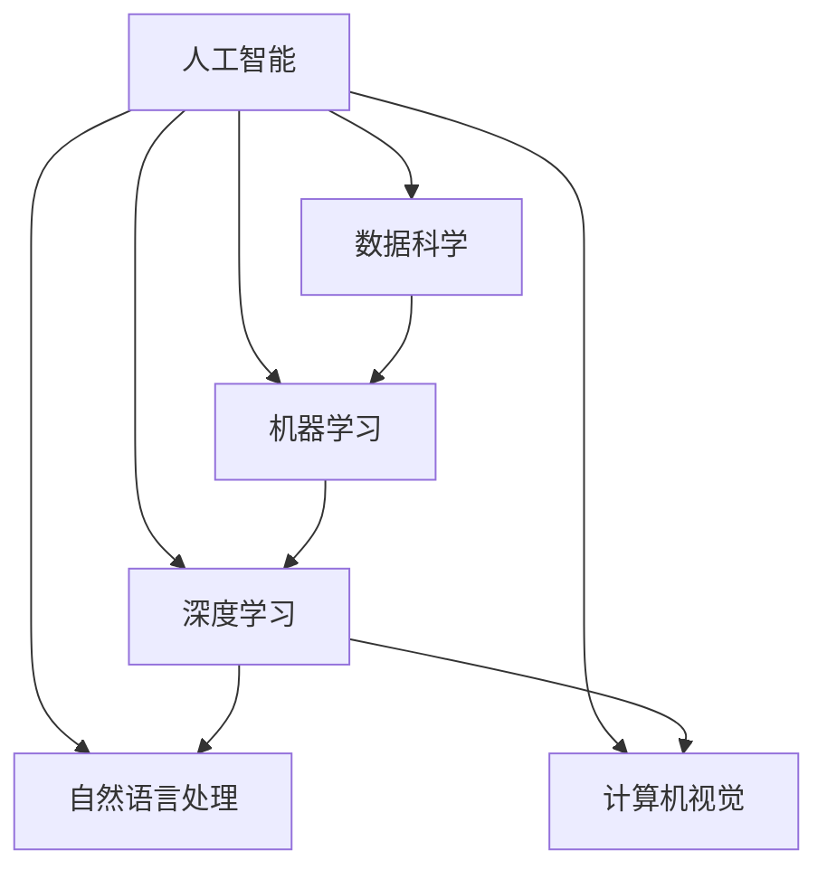

                 

关键词：人工智能，就业机会，技能需求，未来工作，职业发展

摘要：随着人工智能技术的飞速发展，人类计算领域正面临着前所未有的变革。本文旨在探讨AI时代下，未来就业机会的演变趋势以及从业人员所需的技能需求，为读者提供对未来职业发展的深度思考和实用指南。

## 1. 背景介绍

### 1.1 人工智能的发展历程

人工智能（AI）作为计算机科学的一个重要分支，其历史可以追溯到20世纪50年代。从最初的逻辑推理和规则系统，到20世纪80年代的专家系统，再到21世纪初的深度学习和神经网络，人工智能技术经历了多次重要的飞跃。如今，随着大数据、云计算、量子计算等技术的融合与发展，人工智能已经渗透到我们生活的方方面面，从智能家居、自动驾驶到医疗诊断、金融分析，都离不开人工智能的助力。

### 1.2 人工智能的就业市场现状

随着人工智能技术的普及，相关领域的就业市场也在迅速扩大。据统计，全球人工智能领域的人才需求在过去的五年内增长了近两倍。与此同时，高薪和广阔的职业发展前景使得人工智能成为众多求职者青睐的职业方向。然而，随着技术的快速发展，人工智能领域的竞争也日益激烈，从业人员需要不断提升自己的技能以适应市场的需求。

## 2. 核心概念与联系

为了更好地理解人工智能时代下的就业机会和技能需求，我们需要明确一些核心概念，并展示它们之间的联系。以下是一个使用Mermaid绘制的流程图：



### 2.1 人工智能

人工智能是模拟人类智能行为的技术，它包括机器学习、深度学习、自然语言处理和计算机视觉等多个子领域。

### 2.2 数据科学

数据科学是运用统计和计算方法来分析数据，提取有价值信息的一门科学。它是人工智能的基础，为机器学习和深度学习提供数据支持。

### 2.3 机器学习

机器学习是人工智能的一个重要分支，它通过算法使计算机能够从数据中学习并做出决策。

### 2.4 深度学习

深度学习是机器学习的一种方法，它模仿人脑的神经网络结构，通过多层神经网络来提取数据中的特征。

### 2.5 自然语言处理

自然语言处理是使计算机能够理解、生成和处理人类语言的技术，它是人工智能与人类沟通的重要桥梁。

### 2.6 计算机视觉

计算机视觉是使计算机能够“看”和理解现实世界的一门技术，它在自动驾驶、安防监控等领域有广泛应用。

## 3. 核心算法原理 & 具体操作步骤

### 3.1 算法原理概述

人工智能的核心算法包括机器学习算法、深度学习算法和强化学习算法等。这些算法的基本原理是通过学习数据中的规律，使计算机能够做出智能决策。

### 3.2 算法步骤详解

1. **数据收集与预处理**：收集相关数据，并进行清洗、归一化等预处理操作。
2. **特征提取与选择**：从数据中提取有价值的特征，并选择对模型性能有显著影响的特征。
3. **模型训练与优化**：选择合适的模型，并使用训练数据对其进行训练，调整模型参数以优化性能。
4. **模型评估与测试**：使用测试数据评估模型性能，并根据评估结果调整模型。

### 3.3 算法优缺点

- **优点**：人工智能算法能够自动化决策，提高工作效率，降低人力成本。
- **缺点**：算法的准确性依赖于数据质量和特征提取，且可能存在数据偏差和过拟合等问题。

### 3.4 算法应用领域

人工智能算法在众多领域都有广泛应用，如金融、医疗、制造、零售等。以金融领域为例，人工智能技术被用于风险控制、信用评估、投资组合优化等。

## 4. 数学模型和公式 & 详细讲解 & 举例说明

### 4.1 数学模型构建

在人工智能中，常用的数学模型包括线性模型、非线性模型和概率模型等。

### 4.2 公式推导过程

以线性模型为例，其基本公式为：

$$ y = \beta_0 + \beta_1 \cdot x $$

其中，$y$ 为因变量，$x$ 为自变量，$\beta_0$ 和 $\beta_1$ 为模型参数。

### 4.3 案例分析与讲解

假设我们要预测一家公司的股票价格，我们可以使用线性回归模型来构建预测模型。首先，收集历史股票价格数据，然后使用线性回归算法进行训练，最后使用训练好的模型进行预测。

## 5. 项目实践：代码实例和详细解释说明

### 5.1 开发环境搭建

在Python中，我们可以使用Scikit-learn库来实现线性回归模型。首先，需要安装Scikit-learn库，可以使用以下命令：

```bash
pip install scikit-learn
```

### 5.2 源代码详细实现

```python
import numpy as np
import matplotlib.pyplot as plt
from sklearn.linear_model import LinearRegression

# 数据收集与预处理
# 假设我们已经收集了历史股票价格数据，并进行了预处理
x = np.array([[1], [2], [3], [4], [5]])
y = np.array([2, 4, 5, 4, 5])

# 模型训练与优化
model = LinearRegression()
model.fit(x, y)

# 模型评估与测试
print("Coefficients:", model.coef_)
print("Intercept:", model.intercept_)

# 预测
x_new = np.array([[6]])
y_pred = model.predict(x_new)
print("Prediction:", y_pred)

# 画图展示
plt.scatter(x, y, color='red', label='Actual Data')
plt.plot(x, model.predict(x), color='blue', label='Predicted Data')
plt.xlabel('x')
plt.ylabel('y')
plt.legend()
plt.show()
```

### 5.3 代码解读与分析

- 首先，我们导入必要的库和模块。
- 然后，收集和处理历史股票价格数据。
- 接着，使用LinearRegression类创建模型对象，并使用fit方法进行模型训练。
- 最后，使用predict方法进行预测，并使用matplotlib库绘制预测结果。

## 6. 实际应用场景

人工智能在金融领域的应用非常广泛，如股票预测、信用评估、风险管理等。以股票预测为例，我们可以使用线性回归模型来预测未来股票价格，从而为投资决策提供参考。

### 6.4 未来应用展望

随着人工智能技术的不断进步，我们可以预见，人工智能将在更多领域得到应用，如医疗、教育、能源等。未来，人工智能将成为推动社会进步的重要力量。

## 7. 工具和资源推荐

### 7.1 学习资源推荐

- 《Python机器学习》（作者：塞巴斯蒂安·拉斯泰尔斯）
- 《深度学习》（作者：伊恩·古德费洛、约书亚·本吉奥、亚伦·库维尔）
- Coursera、edX等在线课程平台

### 7.2 开发工具推荐

- Jupyter Notebook
- PyCharm
- Google Colab

### 7.3 相关论文推荐

- "Deep Learning"（作者：伊恩·古德费洛、约书亚·本吉奥、亚伦·库维尔）
- "Recurrent Neural Network Based Language Model"（作者：Yoshua Bengio等）

## 8. 总结：未来发展趋势与挑战

### 8.1 研究成果总结

人工智能技术在过去的几十年中取得了巨大的进展，从最初的规则系统到现在的深度学习，人工智能已经渗透到我们生活的方方面面。

### 8.2 未来发展趋势

未来，人工智能将继续向更复杂、更智能的方向发展，如通用人工智能（AGI）和量子计算等。

### 8.3 面临的挑战

尽管人工智能有着广阔的应用前景，但同时也面临着一些挑战，如数据隐私、伦理道德等问题。

### 8.4 研究展望

在未来的研究中，我们需要关注如何提高人工智能的透明度、公平性和可解释性，以更好地服务于人类。

## 9. 附录：常见问题与解答

### 9.1 人工智能与机器学习的区别是什么？

人工智能是模拟人类智能的技术，包括机器学习、深度学习、自然语言处理等子领域。而机器学习是人工智能的一个分支，主要研究如何让计算机从数据中学习并做出决策。

### 9.2 人工智能的安全性和隐私性如何保障？

人工智能的安全性和隐私性是一个重要的问题。在开发和应用人工智能技术时，我们需要关注数据隐私、算法透明性、公平性等方面，确保人工智能系统的安全和隐私。

### 9.3 人工智能的未来发展方向是什么？

人工智能的未来发展方向包括通用人工智能（AGI）、量子计算、边缘计算等。同时，人工智能将继续向更多领域渗透，如医疗、教育、能源等，推动社会进步。

作者：禅与计算机程序设计艺术 / Zen and the Art of Computer Programming
----------------------------------------------------------------

