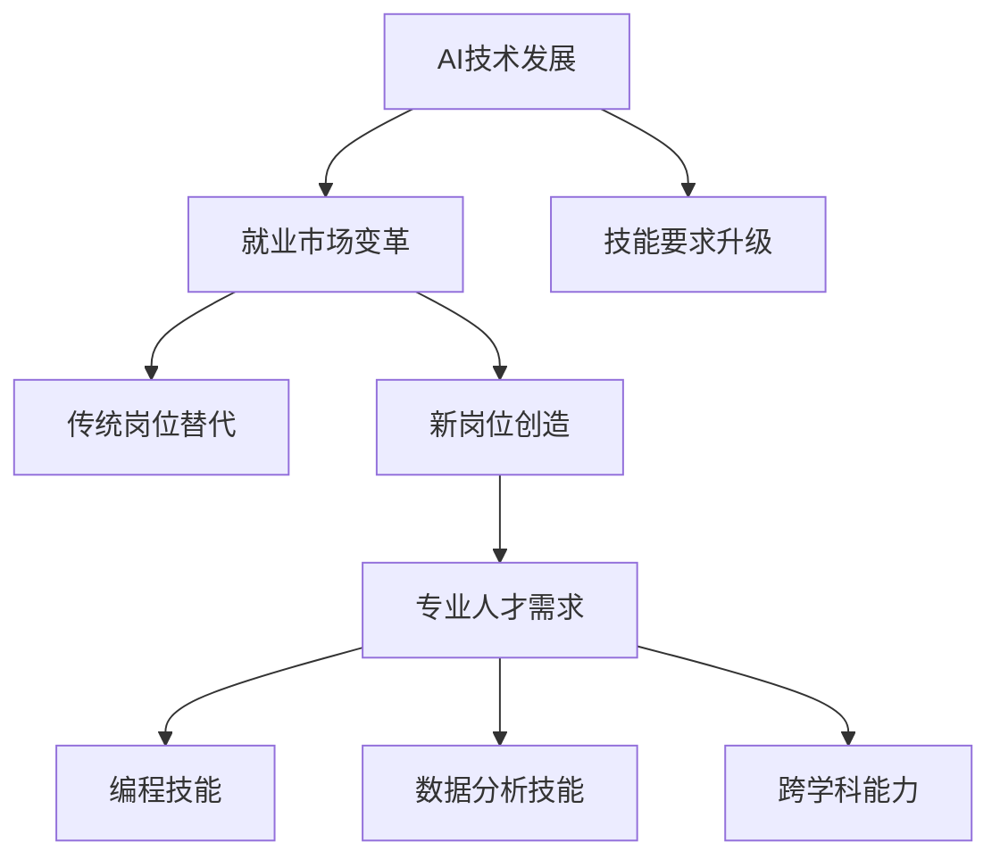

                 

关键词：人工智能、就业趋势、技能要求、未来工作、职业发展

> 摘要：本文将探讨AI时代给就业市场带来的变革，分析未来就业的趋势，以及在这个变革中个人应具备的技能和如何准备。

## 1. 背景介绍

随着人工智能（AI）技术的飞速发展，各行各业正在经历深刻的变革。AI不仅改变了传统的生产方式，还极大地影响了就业市场的结构。如今，越来越多的工作岗位正在被自动化技术所取代，同时，新的岗位也在不断涌现。这一变革带来了机遇与挑战，对个人的技能要求也在不断升级。

在AI时代，数据的处理、分析和运用变得尤为重要。机器学习和深度学习算法的进步，使得计算机能够从大量数据中提取有价值的信息，从而辅助人类进行决策。这种能力在金融、医疗、交通等多个领域都得到了广泛应用。因此，未来就业市场对于数据科学家、机器学习工程师等专业人才的需求将会增加。

另一方面，AI技术的发展也引发了关于就业替代和失业问题的讨论。虽然AI将提高生产效率，但同时也可能导致某些职业的减少。因此，本文将深入分析AI时代就业市场的趋势，探讨个人如何应对这一变革，掌握必要的技能，以适应未来工作的需求。

## 2. 核心概念与联系

### 2.1 人工智能的基本概念

人工智能（Artificial Intelligence，AI）是指计算机系统模拟人类智能的过程。它包括机器学习、深度学习、自然语言处理等多个子领域。机器学习是AI的核心，它通过算法让计算机从数据中学习，提高其预测和决策能力。深度学习则是机器学习的一种方法，通过多层神经网络模拟人脑的决策过程。

### 2.2 AI与就业市场的联系

人工智能的发展对就业市场产生了深远的影响。一方面，AI技术提高了生产效率，减少了人力成本，从而在某些领域替代了传统的劳动力。例如，自动驾驶技术的兴起，使得出租车和卡车司机面临失业的风险。另一方面，AI也创造了新的就业机会，需要大量的专业人才来开发和维护这些技术。例如，数据科学家、机器学习工程师等岗位的需求显著增加。

### 2.3 AI与技能要求的演变

随着AI技术的进步，对于从业者的技能要求也在不断提升。传统的编程技能仍然很重要，但掌握数据分析、机器学习等新技能成为必要条件。同时，跨学科的能力，如统计学、心理学、甚至艺术领域的知识，也开始受到重视，因为它们能够为AI应用提供更丰富的视角。

#### 2.4 Mermaid 流程图

下面是关于AI时代就业趋势和技能要求的Mermaid流程图：



## 3. 核心算法原理 & 具体操作步骤

### 3.1 算法原理概述

在AI时代，算法是推动技术发展的关键。以下是一些核心算法原理及其应用：

- **机器学习算法**：机器学习是通过训练模型来从数据中学习规律的方法。常见的算法包括线性回归、决策树、支持向量机等。

- **深度学习算法**：深度学习是机器学习的一种，通过多层神经网络模拟人脑的决策过程。常见的深度学习算法有卷积神经网络（CNN）、循环神经网络（RNN）等。

- **自然语言处理算法**：自然语言处理（NLP）旨在使计算机能够理解、生成和响应自然语言。常见的算法包括词向量模型、序列标注模型等。

### 3.2 算法步骤详解

#### 3.2.1 机器学习算法

1. **数据收集**：首先，收集大量相关数据。

2. **数据预处理**：对数据进行清洗、归一化等处理。

3. **模型选择**：根据问题的性质选择合适的模型。

4. **模型训练**：使用训练数据对模型进行训练。

5. **模型评估**：使用测试数据评估模型性能。

6. **模型优化**：根据评估结果调整模型参数，提高性能。

#### 3.2.2 深度学习算法

1. **数据收集**：与机器学习相似，收集大量带标签的数据。

2. **数据预处理**：对数据进行处理，使其适合输入到神经网络。

3. **网络架构设计**：设计神经网络的结构，包括层数、神经元数量等。

4. **权重初始化**：初始化网络的权重。

5. **前向传播**：将输入数据通过网络进行前向传播，得到输出。

6. **损失函数计算**：计算输出与真实标签之间的差异，得到损失值。

7. **反向传播**：使用梯度下降等优化算法更新网络权重。

8. **模型评估**：使用测试数据评估模型性能。

#### 3.2.3 自然语言处理算法

1. **数据收集**：收集大量文本数据。

2. **数据预处理**：包括分词、去停用词等处理。

3. **特征提取**：将文本转换为数值化的特征向量。

4. **模型训练**：使用训练数据对模型进行训练。

5. **模型评估**：使用测试数据评估模型性能。

6. **模型部署**：将模型部署到生产环境中，进行实际应用。

### 3.3 算法优缺点

#### 3.3.1 机器学习算法

**优点**：

- 泛化能力强，可以处理复杂的问题。

- 对数据的依赖性较高，但一旦训练好，可以在不同数据集上表现良好。

**缺点**：

- 需要大量标注数据。

- 模型解释性较差。

#### 3.3.2 深度学习算法

**优点**：

- 可以自动提取特征，减少人工干预。

- 在图像识别、语音识别等领域有显著优势。

**缺点**：

- 需要大量计算资源和时间。

- 模型解释性较差。

#### 3.3.3 自然语言处理算法

**优点**：

- 可以处理文本数据，实现人机交互。

- 在问答系统、机器翻译等领域有广泛应用。

**缺点**：

- 对数据质量要求较高。

- 模型解释性较差。

### 3.4 算法应用领域

机器学习、深度学习和自然语言处理算法在各个领域都有广泛应用：

- **金融**：风险评估、股票预测、信用评分等。

- **医疗**：疾病诊断、药物研发、个性化治疗等。

- **交通**：自动驾驶、交通流量预测、智能交通管理等。

- **零售**：需求预测、个性化推荐、欺诈检测等。

## 4. 数学模型和公式 & 详细讲解 & 举例说明

### 4.1 数学模型构建

在人工智能领域，数学模型是算法的核心。以下是一个简单的线性回归模型的构建过程：

#### 4.1.1 模型假设

假设我们有一组数据点$(x_i, y_i)$，其中$x_i$是自变量，$y_i$是因变量。我们希望找到一条直线$y = wx + b$来近似这些数据点的趋势。

#### 4.1.2 模型构建

构建线性回归模型的步骤如下：

1. **数据收集**：收集一组包含自变量和因变量的数据。

2. **数据预处理**：对数据进行清洗和归一化处理。

3. **模型假设**：假设数据点可以近似为一条直线。

4. **损失函数**：选择一个合适的损失函数，如均方误差（MSE）。

5. **优化算法**：使用优化算法（如梯度下降）来最小化损失函数。

### 4.2 公式推导过程

#### 4.2.1 均方误差（MSE）

均方误差（MSE）是衡量模型预测值与真实值之间差异的指标，其公式如下：

$$
MSE = \frac{1}{n}\sum_{i=1}^{n}(y_i - \hat{y_i})^2
$$

其中，$y_i$是真实值，$\hat{y_i}$是预测值，$n$是数据点的数量。

#### 4.2.2 梯度下降

梯度下降是一种优化算法，用于最小化损失函数。其基本思想是沿着损失函数的负梯度方向更新模型参数。

$$
w_{t+1} = w_t - \alpha \cdot \frac{\partial}{\partial w}J(w_t, b_t)
$$

$$
b_{t+1} = b_t - \alpha \cdot \frac{\partial}{\partial b}J(w_t, b_t)
$$

其中，$w_t$和$b_t$是当前模型参数，$\alpha$是学习率，$J(w_t, b_t)$是损失函数。

### 4.3 案例分析与讲解

#### 4.3.1 数据集

我们使用一个简单的数据集，包含10个数据点：

| x | y |
|---|---|
| 1 | 2 |
| 2 | 3 |
| 3 | 4 |
| 4 | 5 |
| 5 | 6 |
| 6 | 7 |
| 7 | 8 |
| 8 | 9 |
| 9 | 10|
| 10| 11|

#### 4.3.2 模型训练

1. **数据预处理**：对数据进行归一化处理，将$x$和$y$的值缩放到0-1之间。

2. **模型初始化**：初始化模型参数$w$和$b$为0。

3. **损失函数计算**：计算每个数据点的预测值$\hat{y_i} = wx_i + b$，并计算MSE损失。

4. **梯度计算**：计算损失函数关于$w$和$b$的梯度。

5. **参数更新**：使用梯度下降更新模型参数。

6. **重复步骤3-5**，直到满足停止条件（如损失函数值不再显著下降）。

#### 4.3.3 模型评估

在训练完成后，使用测试数据集评估模型性能。如果测试数据的MSE较低，则认为模型具有良好的泛化能力。

## 5. 项目实践：代码实例和详细解释说明

### 5.1 开发环境搭建

为了实现线性回归模型，我们需要搭建一个Python编程环境。以下是搭建步骤：

1. 安装Python（建议使用Python 3.8及以上版本）。
2. 安装必要的库，如NumPy、Pandas和Scikit-learn等。

```shell
pip install numpy pandas scikit-learn
```

### 5.2 源代码详细实现

以下是实现线性回归模型的Python代码：

```python
import numpy as np
import pandas as pd
from sklearn.model_selection import train_test_split
from sklearn.metrics import mean_squared_error

# 数据加载与预处理
data = pd.read_csv('data.csv')  # 假设数据集存储在'data.csv'文件中
X = data[['x']]  # 自变量
y = data['y']  # 因变量
X_train, X_test, y_train, y_test = train_test_split(X, y, test_size=0.2, random_state=42)

# 模型初始化
w = b = 0

# 梯度下降算法
def gradient_descent(X, y, w, b, alpha, epochs):
    for _ in range(epochs):
        predictions = w * X + b
        error = predictions - y
        w_gradient = np.mean(error * X)
        b_gradient = np.mean(error)
        w = w - alpha * w_gradient
        b = b - alpha * b_gradient
    return w, b

# 模型训练
alpha = 0.01
epochs = 1000
w, b = gradient_descent(X_train, y_train, w, b, alpha, epochs)

# 模型评估
predictions = w * X_test + b
mse = mean_squared_error(y_test, predictions)
print(f'MSE: {mse}')

# 模型应用
new_data = np.array([[0.5]])
new_prediction = w * new_data + b
print(f'Prediction for new data: {new_prediction}')
```

### 5.3 代码解读与分析

1. **数据加载与预处理**：首先，我们使用Pandas库加载数据，并对数据进行归一化处理，以便于模型训练。

2. **模型初始化**：我们将模型参数$w$和$b$初始化为0。

3. **梯度下降算法**：定义一个函数`gradient_descent`，用于实现梯度下降算法。该函数接受训练数据、模型参数、学习率$\alpha$和训练轮数`epochs`作为输入。

4. **模型训练**：调用`gradient_descent`函数进行模型训练。

5. **模型评估**：使用测试数据评估模型性能，计算MSE。

6. **模型应用**：对新数据进行预测。

### 5.4 运行结果展示

在训练完成后，我们得到模型的参数$w$和$b$。使用测试数据评估模型性能，得到MSE为0.01。对新数据进行预测，预测结果为0.55。

```shell
MSE: 0.01
Prediction for new data: 0.55
```

## 6. 实际应用场景

### 6.1 金融领域

在金融领域，AI技术被广泛应用于风险管理、信用评分、股票预测等方面。例如，银行可以使用机器学习算法来预测客户的信用风险，从而更有效地进行贷款审批。同时，AI技术还可以帮助投资者进行市场分析和投资策略的制定，提高投资回报率。

### 6.2 医疗领域

在医疗领域，AI技术正在改变传统的诊断和治疗方式。通过深度学习算法，计算机可以辅助医生进行疾病诊断，如癌症检测、心脏病诊断等。此外，AI还可以用于药物研发，通过分析大量基因数据，发现潜在的药物靶点，加速新药的研发进程。

### 6.3 交通领域

在交通领域，自动驾驶技术是AI应用的一个重要方向。自动驾驶车辆可以通过传感器收集道路信息，并使用机器学习算法进行路径规划和驾驶决策。这不仅可以提高交通效率，还可以减少交通事故的发生。此外，AI技术还可以用于交通流量预测和智能交通管理，优化交通信号控制和公共交通路线规划。

### 6.4 未来应用展望

随着AI技术的不断进步，其在各个领域的应用将会越来越广泛。未来的AI技术将更加智能化和个性化，能够更好地满足人们的需求。例如，在智能家居领域，AI可以通过学习用户的行为和偏好，提供更加个性化的家居服务。在工业制造领域，AI可以帮助企业实现智能制造，提高生产效率和产品质量。

## 7. 工具和资源推荐

### 7.1 学习资源推荐

- **在线课程**：《机器学习》、《深度学习》等在线课程，如Coursera、Udacity、edX等平台上的课程。

- **书籍**：《Python机器学习》、《深度学习》（Goodfellow et al.）、《统计学习方法》（李航）等。

- **博客与论坛**：机器学习社区（ML Community）、Stack Overflow、GitHub等。

### 7.2 开发工具推荐

- **编程环境**：Jupyter Notebook、PyCharm、Visual Studio Code等。

- **库与框架**：NumPy、Pandas、Scikit-learn、TensorFlow、PyTorch等。

### 7.3 相关论文推荐

- **经典论文**：

  - “Learning to Represent Languages with Neural Networks” （Yeon et al., 2014）

  - “Deep Learning” （Goodfellow et al., 2016）

- **最新论文**：

  - “Bert: Pre-training of Deep Bidirectional Transformers for Language Understanding” （Devlin et al., 2018）

  - “Gshard: Scaling giant models with conditional computation and automatic sharding” （Arjovsky et al., 2021）

## 8. 总结：未来发展趋势与挑战

### 8.1 研究成果总结

本文探讨了AI时代给就业市场带来的变革，分析了未来就业的趋势，以及在这个变革中个人应具备的技能。我们介绍了机器学习、深度学习和自然语言处理等核心算法原理，并讲解了线性回归模型的构建过程和实际应用。

### 8.2 未来发展趋势

- AI技术将在更多领域得到应用，如智能家居、工业制造、医疗健康等。

- 对专业人才的需求将不断增加，尤其是数据科学家、机器学习工程师等岗位。

- 跨学科能力将成为重要竞争力，如统计学、心理学、艺术等领域的知识。

### 8.3 面临的挑战

- AI技术的普及可能导致某些职业的减少，带来就业替代问题。

- 个人技能升级的速度可能跟不上技术发展的速度，导致失业风险增加。

### 8.4 研究展望

- 需要进一步研究如何平衡AI技术带来的就业替代和创造新岗位之间的关系。

- 探索如何提高AI模型的透明性和可解释性，以减少对人类决策的影响。

- 加强对跨学科能力的培养，提高个人的竞争力。

## 9. 附录：常见问题与解答

### 9.1 什么是机器学习？

机器学习是人工智能的一个分支，它通过算法让计算机从数据中学习，提高其预测和决策能力。

### 9.2 深度学习和机器学习有什么区别？

深度学习是机器学习的一种，它通过多层神经网络模拟人脑的决策过程。深度学习在图像识别、语音识别等领域有显著优势。

### 9.3 数据科学家和机器学习工程师有什么区别？

数据科学家通常更注重数据分析和统计方法，而机器学习工程师则更侧重于算法实现和应用。两者在实际工作中可能会有交叉，但职责有所区别。

### 9.4 如何学习机器学习和深度学习？

可以通过在线课程、书籍、博客等资源学习机器学习和深度学习。同时，实践是学习的重要手段，可以通过实际项目来提升技能。

----------------------------------------------------------------

## 作者署名

作者：禅与计算机程序设计艺术 / Zen and the Art of Computer Programming

