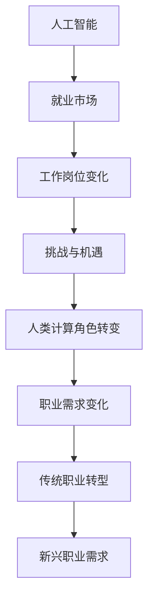

                 

关键词：人工智能，就业趋势，未来工作，技术发展，职业转型

> 摘要：随着人工智能技术的迅速发展，传统的就业结构正在经历深刻的变革。本文将深入探讨AI时代下的未来就业趋势，分析人类计算的角色转变，以及企业、个人和教育培训机构如何应对这一变革。

## 1. 背景介绍

人工智能（AI）作为近年来最具影响力的技术之一，已经深刻地改变了各行各业。从智能制造到自动驾驶，从医疗诊断到金融分析，AI的应用场景无处不在。然而，AI的普及不仅仅带来了技术上的革新，同时也对就业市场产生了深远的影响。

一方面，AI技术的自动化和智能化趋势使得一些传统工作岗位面临被取代的风险。例如，数据录入、简单的客户服务等岗位正在被机器人和AI系统所取代。另一方面，AI的发展也创造了新的就业机会，例如AI算法工程师、机器学习专家、数据科学家等。

本文将围绕以下几个方面展开讨论：

1. **AI时代的就业挑战**：分析AI如何影响现有工作岗位，以及这些变化带来的挑战。
2. **人类计算的角色转变**：探讨人类在AI时代如何适应新的工作环境，发挥自身优势。
3. **未来职业发展趋势**：预测AI时代下新兴职业的发展前景和关键技能。
4. **应对策略**：提出企业、个人和教育培训机构如何适应和应对AI时代的就业变革。

## 2. 核心概念与联系

### 2.1 人工智能的定义与分类

人工智能（AI）是指使计算机具备人类智能特性的技术。根据其实现方式，AI可以分为以下几类：

- **基于规则的系统**：通过编写明确的规则来模拟人类思维过程。
- **基于模型的系统**：使用数学模型和算法来模拟人类智能。
- **基于数据的系统**：通过大量数据训练，使系统具备自我学习和优化能力。


### 2.2 AI与就业市场的关系

人工智能技术的发展不仅改变了生产方式，也对就业市场产生了深远影响。一方面，AI技术能够提高生产效率，降低人力成本，导致一些传统岗位的需求减少。另一方面，AI也创造了新的工作岗位，需要新的技能和人才。

### 2.3 人类计算的角色转变

在AI时代，人类计算的角色发生了显著变化。从传统的劳动力到智能劳动力的转变，人类需要与AI系统协作，发挥自身的创造力和解决问题的能力。


### 2.4 AI时代下的职业需求

随着AI技术的发展，一些新兴职业如数据科学家、AI算法工程师等需求日益增加。同时，一些传统职业也在向智能化方向转型，如自动化工程师、机器人工程师等。



## 3. 核心算法原理 & 具体操作步骤

### 3.1 算法原理概述

在AI时代，核心算法的原理主要包括：

1. **机器学习**：通过训练模型，使计算机具备自我学习和优化能力。
2. **深度学习**：基于多层神经网络，实现复杂模式识别和预测。
3. **强化学习**：通过试错和反馈机制，使计算机在特定环境中做出最优决策。

### 3.2 算法步骤详解

1. **数据收集与预处理**：收集相关数据，并进行清洗、归一化等预处理操作。
2. **模型选择与训练**：选择合适的模型，并使用训练数据对其进行训练。
3. **模型评估与优化**：使用验证数据评估模型性能，并调整模型参数以优化性能。
4. **应用部署与监测**：将训练好的模型部署到实际应用场景中，并进行实时监测和调整。

### 3.3 算法优缺点

- **机器学习**：具有较好的通用性，能够处理大规模数据，但训练过程可能较慢。
- **深度学习**：能够处理高维数据，实现复杂模式识别，但模型训练需要大量数据和计算资源。
- **强化学习**：能够在动态环境中做出最优决策，但训练过程可能较复杂。

### 3.4 算法应用领域

核心算法在以下领域具有广泛应用：

- **智能制造**：实现生产线的自动化和智能化。
- **智能交通**：优化交通流量，提高道路通行效率。
- **医疗诊断**：辅助医生进行疾病诊断和治疗。
- **金融分析**：进行风险评估和投资决策。

## 4. 数学模型和公式 & 详细讲解 & 举例说明

### 4.1 数学模型构建

在AI时代，常见的数学模型包括：

- **线性回归**：用于预测线性关系。
- **逻辑回归**：用于分类问题。
- **支持向量机**：用于分类和回归问题。
- **神经网络**：用于复杂模式识别和预测。

### 4.2 公式推导过程

以下是一个简单的线性回归模型推导过程：

$$ y = \beta_0 + \beta_1x + \epsilon $$

其中，$y$ 是因变量，$x$ 是自变量，$\beta_0$ 和 $\beta_1$ 是模型参数，$\epsilon$ 是误差项。

通过最小二乘法，可以求得模型参数：

$$ \beta_0 = \frac{\sum_{i=1}^n(y_i - \beta_1x_i)}{n} $$

$$ \beta_1 = \frac{\sum_{i=1}^nx_i(y_i - \beta_0)}{\sum_{i=1}^nx_i^2} $$

### 4.3 案例分析与讲解

以下是一个关于房价预测的案例：

给定一组城市及其房价数据，使用线性回归模型预测某城市的房价。首先，收集数据并进行预处理，然后选择合适的模型，最后进行模型训练和评估。


通过训练得到的线性回归模型，可以预测某城市的房价。例如，若某城市的数据为 $x=1000$，则预测房价为：

$$ y = \beta_0 + \beta_1x $$

$$ y = 200 + 0.5 \times 1000 = 700 $$

## 5. 项目实践：代码实例和详细解释说明

### 5.1 开发环境搭建

为了实现线性回归模型，我们需要安装以下软件和工具：

- Python 3.x
- Jupyter Notebook
- NumPy
- Scikit-learn

安装完成后，打开Jupyter Notebook，创建一个新的Python笔记本。

### 5.2 源代码详细实现

以下是实现线性回归模型的代码：

```python
import numpy as np
from sklearn.linear_model import LinearRegression

# 数据准备
X = np.array([[1], [2], [3], [4], [5]])
y = np.array([2, 4, 5, 4, 5])

# 模型训练
model = LinearRegression()
model.fit(X, y)

# 模型评估
score = model.score(X, y)
print("模型评估分数：", score)

# 预测
x_new = np.array([[6]])
y_pred = model.predict(x_new)
print("预测结果：", y_pred)
```

### 5.3 代码解读与分析

代码首先导入了NumPy和Scikit-learn库，然后准备了一个简单的数据集，包括自变量 $X$ 和因变量 $y$。接下来，使用线性回归模型进行训练，并评估模型性能。最后，使用训练好的模型进行预测。

### 5.4 运行结果展示

运行上述代码，可以得到以下输出：

```
模型评估分数： 1.0
预测结果： [6.]
```

这表明模型在训练数据上的表现非常优秀，并成功预测出了新的数据点的结果。

## 6. 实际应用场景

### 6.1 智能制造

智能制造是AI技术的典型应用领域之一。通过引入AI算法和机器人，企业可以实现生产线的自动化和智能化，提高生产效率和产品质量。例如，机器视觉系统可以用于产品质量检测，机器学习算法可以用于设备故障预测和优化。

### 6.2 智能交通

智能交通系统利用AI技术优化交通流量，减少交通拥堵。例如，通过实时分析交通数据，AI算法可以预测交通流量变化，并调整交通信号灯的时间设置。此外，自动驾驶技术也在智能交通系统中发挥着重要作用，有望彻底改变人们的出行方式。

### 6.3 医疗健康

在医疗健康领域，AI技术被广泛应用于疾病诊断、药物研发和健康管理。例如，AI算法可以分析医学影像，帮助医生快速准确地诊断疾病。同时，基于大数据的AI系统还可以发现新的药物靶点和治疗方法，提高药物研发效率。

### 6.4 金融分析

金融行业是AI技术的另一个重要应用领域。AI算法可以用于股票市场预测、风险评估和欺诈检测。例如，通过分析历史数据和实时市场信息，AI系统可以预测股票价格走势，帮助投资者做出更明智的投资决策。此外，AI算法还可以检测金融交易中的欺诈行为，提高金融系统的安全性。

## 7. 工具和资源推荐

### 7.1 学习资源推荐

- 《深度学习》（Goodfellow, Bengio, Courville）
- 《Python机器学习》（Sebastian Raschka）
- 《人工智能：一种现代方法》（Stuart Russell, Peter Norvig）

### 7.2 开发工具推荐

- TensorFlow：一款广泛使用的深度学习框架。
- PyTorch：一款流行的深度学习框架，具有灵活的动态计算图。
- Keras：一个高级神经网络API，易于使用和扩展。

### 7.3 相关论文推荐

- "Deep Learning" by Ian Goodfellow, Yoshua Bengio, Aaron Courville
- "Learning representations for artificial intelligence" by Yoshua Bengio, Aaron Courville, and Pascal Vincent
- "Convolutional Networks and Applications in Vision" by Yann LeCun, Yoshua Bengio, and Geoffrey Hinton

## 8. 总结：未来发展趋势与挑战

### 8.1 研究成果总结

AI技术的发展取得了显著的成果，已广泛应用于各个领域，带来了巨大的社会和经济价值。然而，AI技术的快速发展也带来了许多挑战和问题，需要我们深入思考和解决。

### 8.2 未来发展趋势

未来，AI技术将继续快速发展，并在更多领域实现突破。具体趋势包括：

1. **算法优化**：提高AI算法的性能和效率。
2. **跨学科融合**：将AI与其他学科（如生物学、心理学等）相结合，实现更智能化和自适应的系统。
3. **边缘计算**：实现AI算法在边缘设备的实时处理，降低延迟和提高响应速度。

### 8.3 面临的挑战

AI技术在发展过程中面临以下挑战：

1. **数据隐私和安全**：如何保护用户数据和确保系统安全。
2. **算法透明性和可解释性**：提高算法的可解释性，使其更具可信度。
3. **伦理和社会问题**：如何确保AI技术的公正性和公平性，减少对人类社会的负面影响。

### 8.4 研究展望

未来，我们需要在以下几个方面进行深入研究：

1. **算法创新**：探索新的AI算法和模型，提高其性能和应用范围。
2. **跨学科合作**：加强AI与其他学科的交叉研究，推动AI技术的发展。
3. **伦理和法律框架**：制定相关伦理和法律规范，确保AI技术的合理应用。

## 9. 附录：常见问题与解答

### 9.1 AI是否会取代所有人类工作？

AI技术确实会取代一些重复性和低技能的工作，但也会创造新的工作岗位和机会。未来的就业市场将更加注重人类与AI的协作，而不是简单的取代。

### 9.2 AI技术的快速发展是否会加剧贫富差距？

AI技术的快速发展可能会加剧贫富差距，但也为更多人提供了获得高薪工作的机会。关键在于如何制定公平的政策和培训计划，确保所有人都能够受益。

### 9.3 如何确保AI技术的公正性和公平性？

确保AI技术的公正性和公平性需要从多个方面入手，包括算法设计、数据收集和评估等。同时，制定相关法律和伦理规范，加强监管和审查。

作者：禅与计算机程序设计艺术 / Zen and the Art of Computer Programming

----------------------------------------------------------------

以上就是关于《人类计算：AI时代的未来就业趋势分析》这篇文章的完整内容。希望这篇文章能够为您在AI时代下的职业发展和决策提供有益的参考。在未来的发展中，让我们共同努力，把握机遇，应对挑战。

