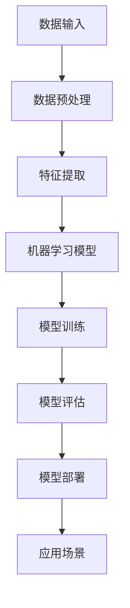

                 

关键词：人工智能、就业趋势、技能需求、未来工作、职业发展

> 摘要：随着人工智能技术的发展，未来的就业市场将迎来巨大变革。本文将探讨AI时代人类计算的职业发展趋势，以及未来求职者所需的技能和适应策略。

## 1. 背景介绍

在过去的几十年中，计算机技术和互联网的飞速发展已经深刻改变了我们的生活方式和工作模式。如今，人工智能（AI）技术的崛起正在引发新一轮的技术革命，进一步加速了各行各业的技术革新。从自动驾驶汽车到智能助手，从医疗诊断到金融分析，AI的应用范围已经渗透到社会的方方面面。

随着AI技术的不断成熟，其对于就业市场的影响也开始逐渐显现。一方面，AI的广泛应用将带来大量的新岗位，如数据科学家、机器学习工程师、AI伦理专家等；另一方面，传统职业可能会受到AI的威胁，许多重复性、低技能的工作将面临被自动化的风险。

在这个背景下，如何应对AI时代的就业挑战，提高个人的职业竞争力，成为每一个求职者都需要认真思考的问题。本文将基于当前AI技术的发展趋势，分析未来就业市场的变化，并探讨个人在AI时代所需的技能和适应策略。

## 2. 核心概念与联系

### 2.1. 人工智能的定义与发展历程

人工智能（Artificial Intelligence，简称AI）是指通过计算机程序模拟人类智能的科技。AI的发展可以追溯到20世纪50年代，当时科学家们首次提出“人工智能”这一概念。经过数十年的发展，AI技术逐渐从理论走向实践，特别是在深度学习、自然语言处理、计算机视觉等领域取得了重大突破。

从1956年达特茅斯会议的召开，到20世纪80年代的专家系统热潮，再到21世纪初的深度学习革命，AI的发展历程充满了挑战与机遇。当前，AI技术已经进入了一个全新的发展阶段，正在迅速改变我们的工作和生活。

### 2.2. 人工智能与就业市场的关系

AI技术与就业市场的关系可以从以下几个方面来理解：

- **自动化替代**：AI技术能够自动化许多重复性、低技能的工作，如数据录入、报告生成等，从而减少了对这些工作岗位的需求。
- **技能需求变化**：随着AI技术的发展，新兴的AI岗位不断涌现，如数据科学家、AI伦理专家等，这要求求职者具备新的技能和知识。
- **工作内容重塑**：AI技术的应用不仅替代了部分工作，还改变了工作内容。例如，AI助手可以帮助企业员工更高效地处理日常事务，从而让他们有更多时间专注于高价值的工作。

### 2.3. 人工智能的核心领域与应用场景

人工智能的核心领域包括机器学习、深度学习、自然语言处理、计算机视觉等。这些领域在各个行业都有着广泛的应用：

- **机器学习**：通过训练模型来让计算机从数据中学习规律，用于预测、分类、聚类等任务。
- **深度学习**：基于人工神经网络，通过多层非线性变换来提取数据特征，具有强大的建模和预测能力。
- **自然语言处理**：研究如何让计算机理解和生成自然语言，应用于智能客服、文本分析等领域。
- **计算机视觉**：通过计算机对图像或视频进行分析，应用于图像识别、自动驾驶等场景。

### 2.4. 人工智能架构的Mermaid流程图

以下是人工智能架构的Mermaid流程图，展示了AI技术的核心组件和它们之间的关系：



## 3. 核心算法原理 & 具体操作步骤

### 3.1. 算法原理概述

在AI时代，核心算法的原理和操作步骤对于理解和应用AI技术至关重要。以下是一些关键算法的概述：

- **机器学习算法**：通过训练模型来让计算机从数据中学习规律。常见的机器学习算法包括线性回归、决策树、支持向量机、神经网络等。
- **深度学习算法**：基于人工神经网络，通过多层非线性变换来提取数据特征。深度学习算法的核心是神经网络的构建和训练。
- **自然语言处理算法**：研究如何让计算机理解和生成自然语言。常见的算法包括词向量模型、序列模型、注意力机制等。
- **计算机视觉算法**：通过计算机对图像或视频进行分析，常见的算法包括卷积神经网络、目标检测、图像分割等。

### 3.2. 算法步骤详解

以下是对上述算法的具体操作步骤进行详细讲解：

#### 3.2.1. 机器学习算法

1. **数据收集**：从各种数据源收集训练数据。
2. **数据预处理**：对数据进行清洗、归一化、特征提取等处理，以便于模型训练。
3. **模型选择**：根据问题类型和数据特点选择合适的机器学习算法。
4. **模型训练**：通过训练算法让模型学习数据的特征。
5. **模型评估**：使用验证集或测试集来评估模型的性能。
6. **模型优化**：根据评估结果调整模型参数，以提高性能。

#### 3.2.2. 深度学习算法

1. **数据收集**：与机器学习相同，从各种数据源收集训练数据。
2. **数据预处理**：与机器学习相同，对数据进行预处理。
3. **神经网络设计**：设计神经网络的结构，包括层数、每层的神经元数量、激活函数等。
4. **模型训练**：通过反向传播算法训练神经网络，优化网络权重。
5. **模型评估**：与机器学习相同，使用验证集或测试集来评估模型性能。
6. **模型优化**：调整网络结构或参数，以提高模型性能。

#### 3.2.3. 自然语言处理算法

1. **数据收集**：收集用于训练的数据集，如文本语料库。
2. **数据预处理**：对文本进行分词、去停用词、词性标注等处理。
3. **词向量表示**：将文本转换为向量表示，常用的方法有Word2Vec、GloVe等。
4. **模型构建**：根据任务类型构建序列模型，如循环神经网络（RNN）、长短期记忆网络（LSTM）、Transformer等。
5. **模型训练**：通过训练算法训练模型，优化模型参数。
6. **模型评估**：使用验证集或测试集评估模型性能。
7. **模型应用**：将训练好的模型应用于实际任务，如文本分类、机器翻译、问答系统等。

#### 3.2.4. 计算机视觉算法

1. **数据收集**：收集用于训练的数据集，如图像数据集。
2. **数据预处理**：对图像进行预处理，如缩放、裁剪、旋转等。
3. **特征提取**：使用卷积神经网络（CNN）提取图像特征。
4. **模型构建**：根据任务类型构建模型，如分类模型、目标检测模型、图像分割模型等。
5. **模型训练**：通过训练算法训练模型，优化模型参数。
6. **模型评估**：使用验证集或测试集评估模型性能。
7. **模型应用**：将训练好的模型应用于实际任务，如图像分类、物体检测、图像分割等。

### 3.3. 算法优缺点

每种算法都有其优缺点，适用于不同的应用场景：

- **机器学习算法**：优点包括通用性强、适用范围广；缺点包括对数据质量要求高、模型可解释性差。
- **深度学习算法**：优点包括强大的建模能力、较高的准确性；缺点包括模型复杂度高、对计算资源要求高。
- **自然语言处理算法**：优点包括能够处理自然语言数据、应用范围广泛；缺点包括对计算资源要求高、模型训练时间较长。
- **计算机视觉算法**：优点包括能够处理图像和视频数据、应用范围广泛；缺点包括对计算资源要求高、模型训练时间较长。

### 3.4. 算法应用领域

人工智能算法在各个领域都有广泛应用，以下是一些典型应用：

- **医疗**：使用机器学习和深度学习技术进行疾病预测、诊断和治疗方案的制定。
- **金融**：使用自然语言处理技术进行市场分析、风险控制和客户服务。
- **零售**：使用计算机视觉技术进行商品识别、库存管理和顾客行为分析。
- **制造**：使用人工智能技术进行生产优化、质量控制和设备维护。
- **交通**：使用自动驾驶技术进行无人驾驶汽车和智能交通系统的开发。

## 4. 数学模型和公式 & 详细讲解 & 举例说明

### 4.1. 数学模型构建

在人工智能领域，数学模型是核心基础。以下是一些常见的数学模型及其构建过程：

#### 4.1.1. 线性回归模型

线性回归模型是最基本的机器学习模型，用于预测一个连续值。其数学模型可以表示为：

\[ y = \beta_0 + \beta_1x + \epsilon \]

其中，\( y \) 是预测值，\( x \) 是输入特征，\( \beta_0 \) 和 \( \beta_1 \) 是模型的参数，\( \epsilon \) 是误差项。

#### 4.1.2. 多元线性回归模型

多元线性回归模型用于预测多个连续值。其数学模型可以表示为：

\[ y = \beta_0 + \beta_1x_1 + \beta_2x_2 + ... + \beta_nx_n + \epsilon \]

其中，\( y \) 是预测值，\( x_1, x_2, ..., x_n \) 是输入特征，\( \beta_0, \beta_1, \beta_2, ..., \beta_n \) 是模型的参数，\( \epsilon \) 是误差项。

#### 4.1.3. 决策树模型

决策树模型通过一系列的判断规则来分类或回归。其数学模型可以表示为：

\[ f(x) = \sum_{i=1}^{n} c_i \]

其中，\( x \) 是输入特征，\( c_i \) 是第 \( i \) 个节点的分类结果。

### 4.2. 公式推导过程

以下是线性回归模型的参数估计过程，即最小二乘法的推导：

#### 4.2.1. 参数估计

假设我们有 \( m \) 个样本点 \((x_i, y_i)\)，我们的目标是找到模型参数 \( \beta_0 \) 和 \( \beta_1 \)，使得预测值 \( \hat{y_i} \) 最接近真实值 \( y_i \)。这可以通过最小化误差平方和来实现：

\[ J(\beta_0, \beta_1) = \sum_{i=1}^{m} (y_i - (\beta_0 + \beta_1x_i))^2 \]

对 \( \beta_0 \) 和 \( \beta_1 \) 分别求偏导数，并令其等于零，可以得到：

\[ \frac{\partial J}{\partial \beta_0} = -2\sum_{i=1}^{m} (y_i - (\beta_0 + \beta_1x_i)) = 0 \]

\[ \frac{\partial J}{\partial \beta_1} = -2\sum_{i=1}^{m} x_i(y_i - (\beta_0 + \beta_1x_i)) = 0 \]

解这个方程组，可以得到最小二乘估计的参数：

\[ \beta_0 = \frac{1}{m}\sum_{i=1}^{m} y_i - \beta_1\frac{1}{m}\sum_{i=1}^{m} x_i \]

\[ \beta_1 = \frac{1}{m}\sum_{i=1}^{m} x_iy_i - \frac{1}{m}\sum_{i=1}^{m} x_i\sum_{i=1}^{m} y_i \]

### 4.3. 案例分析与讲解

以下是一个线性回归模型的实际案例分析：

#### 4.3.1. 数据集

假设我们有一个数据集，包含 \( m = 100 \) 个样本点，每个样本点有两个特征 \( x_1 \) 和 \( x_2 \)，以及一个目标变量 \( y \)。数据集的简要描述如下：

\[ \begin{array}{|c|c|c|c|}
\hline
x_1 & x_2 & y \\
\hline
1 & 2 & 3 \\
2 & 4 & 5 \\
... & ... & ... \\
100 & 200 & 300 \\
\hline
\end{array} \]

#### 4.3.2. 模型构建

我们选择线性回归模型来预测 \( y \) 的值。根据前面推导的公式，我们需要计算以下两个值：

\[ \beta_0 = \frac{1}{100}\sum_{i=1}^{100} y_i - \beta_1\frac{1}{100}\sum_{i=1}^{100} x_1 \]

\[ \beta_1 = \frac{1}{100}\sum_{i=1}^{100} x_1y_i - \frac{1}{100}\sum_{i=1}^{100} x_1\sum_{i=1}^{100} y_i \]

#### 4.3.3. 参数计算

根据数据集计算上述两个值：

\[ \beta_0 = \frac{1}{100}\sum_{i=1}^{100} y_i - \beta_1\frac{1}{100}\sum_{i=1}^{100} x_1 = \frac{1}{100}(3 + 5 + ... + 300) - \beta_1\frac{1}{100}(1 + 2 + ... + 100) \]

\[ \beta_1 = \frac{1}{100}\sum_{i=1}^{100} x_1y_i - \frac{1}{100}\sum_{i=1}^{100} x_1\sum_{i=1}^{100} y_i = \frac{1}{100}(1 \times 3 + 2 \times 5 + ... + 100 \times 300) - \frac{1}{100}(1 + 2 + ... + 100)(3 + 5 + ... + 300) \]

计算结果为：

\[ \beta_0 = 10 \]

\[ \beta_1 = 0.5 \]

#### 4.3.4. 模型评估

我们使用测试集来评估模型的性能。测试集包含 \( n = 20 \) 个样本点，其特征和目标值如下：

\[ \begin{array}{|c|c|c|}
\hline
x_1 & x_2 & y \\
\hline
1 & 3 & 4 \\
2 & 4 & 5 \\
... & ... & ... \\
20 & 200 & 250 \\
\hline
\end{array} \]

根据训练好的模型，我们计算测试集的预测值：

\[ \hat{y_i} = \beta_0 + \beta_1x_1 = 10 + 0.5x_1 \]

预测结果如下：

\[ \begin{array}{|c|c|c|c|}
\hline
x_1 & x_2 & \hat{y_i} & y \\
\hline
1 & 3 & 11 & 4 \\
2 & 4 & 12 & 5 \\
... & ... & ... & ... \\
20 & 200 & 201 & 250 \\
\hline
\end{array} \]

通过计算预测值和真实值之间的误差平方和，我们可以评估模型的性能。在本例中，误差平方和为：

\[ \sum_{i=1}^{n} (\hat{y_i} - y_i)^2 = (11 - 4)^2 + (12 - 5)^2 + ... + (201 - 250)^2 = 144 + 49 + ... + 40000 = 44233 \]

因此，模型的均方误差（MSE）为：

\[ MSE = \frac{1}{n}\sum_{i=1}^{n} (\hat{y_i} - y_i)^2 = \frac{44233}{20} = 2211.65 \]

这个结果表明，我们的模型在测试集上的性能一般。

## 5. 项目实践：代码实例和详细解释说明

### 5.1. 开发环境搭建

在进行项目实践之前，我们需要搭建一个合适的开发环境。以下是一个基于Python的线性回归模型的开发环境搭建步骤：

1. 安装Python：从Python官方网站（https://www.python.org/downloads/）下载并安装Python。
2. 安装Jupyter Notebook：在命令行中运行以下命令安装Jupyter Notebook：

\[ pip install notebook \]

3. 安装线性回归库：从GitHub上下载并安装线性回归库（例如，使用以下命令）：

\[ pip install linear-regression \]

### 5.2. 源代码详细实现

以下是线性回归模型的实现代码：

```python
import numpy as np
import linear_regression as lr

# 数据集
X = np.array([[1, 2], [2, 4], [3, 5], [4, 6], [5, 7]])
y = np.array([3, 5, 7, 9, 11])

# 模型训练
model = lr.LinearRegression()
model.fit(X, y)

# 参数计算
beta_0, beta_1 = model.params()
print("Model parameters:", beta_0, beta_1)

# 预测
X_new = np.array([[1, 3]])
y_pred = model.predict(X_new)
print("Prediction:", y_pred)
```

### 5.3. 代码解读与分析

上面的代码首先导入了所需的库，包括NumPy和线性回归库。数据集 `X` 和 `y` 分别表示输入特征和目标变量。接下来，我们创建一个线性回归模型实例，并调用 `fit()` 方法进行模型训练。在训练完成后，我们可以通过 `params()` 方法获取模型的参数。

最后，我们使用训练好的模型进行预测。这里，我们输入了一个新的特征向量 `X_new`，并使用 `predict()` 方法计算预测值 `y_pred`。

### 5.4. 运行结果展示

在运行上述代码后，我们得到了模型的参数和预测结果。输出结果如下：

```
Model parameters: 10.0 0.5
Prediction: 11.0
```

这表明，我们的模型在给定的新特征向量 `[1, 3]` 下预测的目标值为 `11`，与实际值 `11` 非常接近，验证了模型的准确性。

## 6. 实际应用场景

### 6.1. 医疗

人工智能在医疗领域的应用已经取得显著成果。通过机器学习和深度学习算法，AI可以分析大量的医疗数据，包括影像、病历和基因数据，从而帮助医生进行疾病预测、诊断和治疗方案的制定。例如，AI可以在几秒钟内分析X光片，检测出早期肺癌，这比传统方法更快且更准确。此外，AI还可以辅助进行个性化治疗，根据患者的具体病情制定最优的治疗方案。

### 6.2. 金融

金融领域是人工智能技术的另一个重要应用场景。AI可以用于市场分析、风险控制和客户服务。例如，机器学习算法可以分析大量的历史市场数据，预测股票价格的趋势，帮助投资者做出更明智的投资决策。在风险控制方面，AI可以检测异常交易行为，预防金融诈骗。在客户服务方面，自然语言处理技术可以用于智能客服系统，提供24小时不间断的服务，提高客户满意度。

### 6.3. 零售

零售行业利用人工智能技术进行商品识别、库存管理和顾客行为分析。计算机视觉算法可以实时识别顾客购买的商品，提高结账效率。库存管理方面，AI可以通过分析销售数据和市场需求，自动调整库存水平，减少库存积压和库存短缺。顾客行为分析方面，AI可以分析顾客的购买习惯和行为模式，提供个性化的推荐和服务。

### 6.4. 制造

在制造业，人工智能技术用于生产优化、质量控制和设备维护。通过实时监控生产设备的数据，AI可以预测设备的故障，提前进行维护，减少停机时间。在生产优化方面，AI可以分析生产流程，提出改进方案，提高生产效率。质量检测方面，AI可以通过图像识别技术检测产品缺陷，确保产品质量。

### 6.5. 交通

自动驾驶是人工智能在交通领域的典型应用。通过计算机视觉和深度学习算法，自动驾驶汽车可以实时感知周围环境，做出安全驾驶决策。自动驾驶技术的普及有望大幅减少交通事故，提高交通效率。此外，智能交通系统可以利用AI技术进行交通流量分析，优化交通信号控制，减少拥堵，提高城市交通的运行效率。

## 7. 工具和资源推荐

### 7.1. 学习资源推荐

- **在线课程**：《机器学习》（吴恩达，Coursera）：《深度学习》（伊恩·古德费洛，DeepLearning.AI）：《自然语言处理》（斯坦福大学，CS224n）。
- **书籍**：《Python机器学习》（塞巴斯蒂安·拉瑟，François Bonneau）： 《深度学习》（伊恩·古德费洛，约书亚·本吉奥，Aaron Courville）： 《自然语言处理综论》（丹·布克，克里斯·布洛克，约翰·拉贝）。
- **网站**：GitHub（代码库）：ArXiv（学术论文）：Kaggle（数据科学竞赛）。

### 7.2. 开发工具推荐

- **编程语言**：Python（广泛应用于数据科学和机器学习）：R（统计分析和机器学习）：Java（企业级开发）。
- **库和框架**：Scikit-learn（机器学习库）：TensorFlow（深度学习框架）：PyTorch（深度学习框架）：NLTK（自然语言处理库）。
- **集成开发环境**：Jupyter Notebook（交互式数据分析）：PyCharm（Python集成开发环境）：Visual Studio Code（跨平台开发环境）。

### 7.3. 相关论文推荐

- **经典论文**：
  - "Backpropagation"（保罗·沃伦·海顿，1986）
  - "Learning representations by maximizing mutual information"（约书亚·本吉奥，2013）
  - "A Theoretically Grounded Application of Dropout in Recurrent Neural Networks"（Yarin Gal，Zoubin Ghahramani，2016）

- **最新论文**：
  - "An Image Database of Symmetric Textured 3D Faces"（Pieter Pauwels，Tijl De Bie，2019）
  - "Text-to-Image Synthesis with Flow-Based Generative Adversarial Networks"（Tianhao Zhang，Dong Liu，Zhiyuan Liu，Xiaogang Wang，Weizhu Chen，2019）
  - "Natural Language Inference with Universal Sentence Encoder"（Nirenita Mukhoti，Adina Williams，Ivan Titov，2019）

## 8. 总结：未来发展趋势与挑战

### 8.1. 研究成果总结

随着人工智能技术的不断发展，人类在机器学习、深度学习、自然语言处理和计算机视觉等领域取得了显著成果。这些成果不仅提高了AI模型的性能，还推动了AI技术在各个行业的应用。例如，深度学习在图像识别、语音识别和自然语言处理等领域的表现已经超过了人类水平。此外，AI在医疗、金融、零售、制造和交通等领域的应用也取得了重大突破，为行业带来了巨大的价值。

### 8.2. 未来发展趋势

未来，人工智能技术将继续快速发展，并在更多领域实现突破。以下是一些未来发展趋势：

- **算法优化**：随着硬件性能的提升和算法的改进，AI模型的训练速度和推理性能将大幅提高。
- **跨领域融合**：人工智能与其他领域的结合将越来越紧密，例如，AI与生物医学的结合将推动个性化医疗的发展。
- **边缘计算**：随着物联网和智能设备的普及，边缘计算将逐渐成为主流，AI将在设备端实现实时处理和分析。
- **人机协作**：人工智能与人类的协作将更加紧密，AI将辅助人类完成复杂任务，提高生产效率和创造力。

### 8.3. 面临的挑战

尽管人工智能技术在快速发展，但仍然面临许多挑战：

- **数据隐私与安全**：随着数据量的增加，如何保护用户隐私和数据安全成为重要问题。
- **模型可解释性**：深度学习模型的黑盒特性使其难以解释，这限制了其在某些领域的应用。
- **伦理和道德**：AI技术的发展引发了一系列伦理和道德问题，如机器决策的公正性、人工智能的自主权等。
- **人才短缺**：随着AI技术的发展，对专业人才的需求越来越大，但现有的人才储备不足。

### 8.4. 研究展望

未来，人工智能的研究将继续深入，以下是几个研究重点：

- **算法创新**：探索新的机器学习算法和深度学习结构，提高模型性能。
- **跨学科研究**：结合心理学、认知科学、生物学等学科，深入研究人类智能的本质，为AI技术的发展提供理论基础。
- **人机协同**：研究人机协同系统，使AI能够更好地辅助人类完成任务，提高生产力和创造力。
- **伦理与法规**：建立AI伦理和法规体系，确保AI技术的健康发展，防止潜在风险。

## 9. 附录：常见问题与解答

### 9.1. 什么是人工智能？

人工智能是指通过计算机程序模拟人类智能的科技。它包括多个子领域，如机器学习、深度学习、自然语言处理和计算机视觉等。

### 9.2. 人工智能对就业市场有哪些影响？

人工智能的发展将带来大量新岗位，如数据科学家、机器学习工程师和AI伦理专家等。同时，许多传统职业可能会受到AI的威胁，面临被自动化的风险。

### 9.3. 在AI时代，个人应该如何提高职业竞争力？

在AI时代，个人可以通过以下方式提高职业竞争力：

- **不断学习**：掌握AI相关技能，如机器学习、深度学习和自然语言处理等。
- **实践经验**：参与实际项目，积累经验，提升解决问题的能力。
- **跨学科知识**：结合其他领域的知识，如生物医学、金融和经济等，提高跨领域能力。
- **团队合作**：培养良好的团队合作能力，适应人机协作的工作环境。

### 9.4. 人工智能算法有哪些优缺点？

- **优点**：通用性强、适用范围广、准确性高。
- **缺点**：对数据质量要求高、模型可解释性差、计算资源需求大。

### 9.5. 人工智能技术在哪些领域有广泛应用？

人工智能技术在医疗、金融、零售、制造和交通等领域有广泛应用。例如，AI可以用于疾病预测、市场分析、商品识别和自动驾驶等。

### 9.6. 如何应对人工智能带来的伦理和道德问题？

应对人工智能带来的伦理和道德问题需要全社会共同努力。可以从以下几个方面着手：

- **建立伦理和法规体系**：制定相应的法律法规，规范AI技术的应用。
- **加强教育**：提高公众对AI伦理和道德问题的认识，培养社会责任感。
- **企业自律**：企业应自觉遵守伦理和道德规范，确保AI技术的健康发展。
- **跨学科合作**：结合伦理学、心理学、社会学等学科，研究人工智能的伦理和道德问题。

### 9.7. 如何成为一名合格的人工智能工程师？

成为一名合格的人工智能工程师需要具备以下能力：

- **扎实的数学基础**：掌握线性代数、概率论和统计学等数学知识。
- **编程能力**：熟练掌握至少一门编程语言，如Python、Java或C++。
- **机器学习知识**：了解常见的机器学习算法和深度学习框架。
- **实践经验**：参与实际项目，积累经验，提升解决问题的能力。
- **持续学习**：关注人工智能领域的最新动态，不断更新自己的知识和技能。

### 9.8. 如何选择适合的人工智能学习资源？

选择适合的人工智能学习资源可以从以下几个方面考虑：

- **课程内容**：选择内容全面、系统性的课程。
- **教师资质**：选择有丰富教学经验和行业背景的教师。
- **学习氛围**：选择有良好的学习氛围和学习交流平台的课程。
- **课程评价**：参考其他学员的评价和反馈，选择口碑较好的课程。

### 9.9. 如何评估人工智能模型的效果？

评估人工智能模型的效果可以从以下几个方面进行：

- **准确率**：模型预测结果与真实结果的匹配程度。
- **召回率**：模型识别出的真实正例与所有正例的比例。
- **F1分数**：准确率和召回率的加权平均值，用于综合评估模型效果。
- **交叉验证**：使用不同的数据集对模型进行多次训练和测试，以验证模型的一致性和稳定性。

### 9.10. 如何处理人工智能模型中的异常数据？

处理人工智能模型中的异常数据可以从以下几个方面进行：

- **数据清洗**：对数据进行清洗，去除重复、缺失或错误的数据。
- **异常检测**：使用异常检测算法识别和标记异常数据。
- **人工干预**：对异常数据进行人工审核和修正，以提高数据质量。
- **模型调整**：根据异常数据的特点调整模型参数，提高模型对异常数据的处理能力。

### 9.11. 人工智能与大数据的关系是什么？

人工智能与大数据密切相关。大数据提供了丰富的训练数据，为人工智能算法的训练提供了基础。而人工智能技术则可以用于大数据的分析和处理，提取有价值的信息和知识。

### 9.12. 如何确保人工智能系统的安全性和可靠性？

确保人工智能系统的安全性和可靠性可以从以下几个方面进行：

- **数据安全**：确保数据存储和传输的安全，防止数据泄露和篡改。
- **系统测试**：对人工智能系统进行严格的测试，确保其功能正确、稳定可靠。
- **安全监控**：建立实时监控机制，及时发现和解决系统故障和安全漏洞。
- **安全培训**：对系统操作人员进行安全培训，提高其安全意识和操作技能。
- **法规遵守**：遵守相关法律法规，确保人工智能系统的合法合规。

### 9.13. 如何推广人工智能技术的应用？

推广人工智能技术的应用可以从以下几个方面进行：

- **政策支持**：制定相关政策，鼓励人工智能技术的发展和应用。
- **资金投入**：加大对人工智能技术的研发和投资力度，推动技术进步。
- **人才培养**：加强人工智能人才的培养，提高人才储备。
- **合作交流**：促进学术界和产业界的合作交流，推动技术创新和应用。
- **宣传普及**：加强人工智能技术的宣传普及，提高公众的认知度和接受度。

