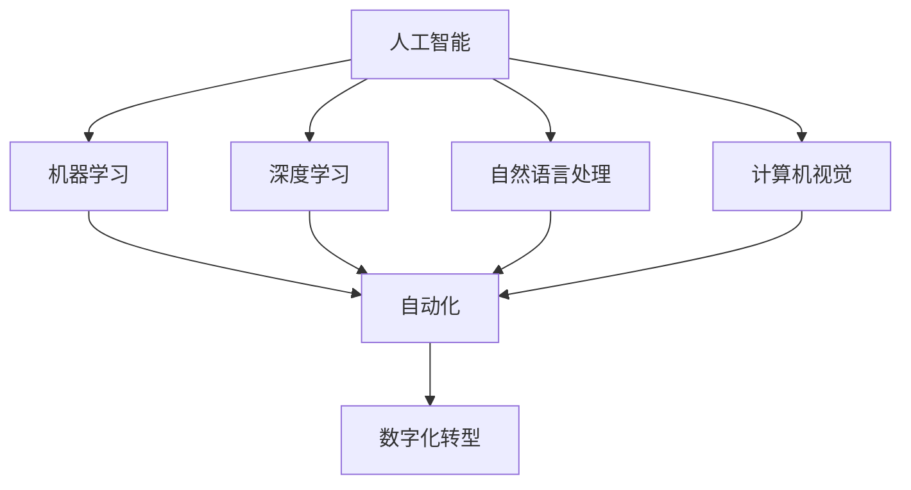

                 

## 1. 背景介绍

随着人工智能（AI）技术的飞速发展，人们对于未来就业市场的担忧和期待也与日俱增。一方面，AI技术正在深刻改变各行各业，推动着生产力的发展和创新，为人类带来了前所未有的机遇。另一方面，许多人担心AI技术会取代人类工作，导致大规模失业和社会不稳定。本文旨在探讨AI时代下的未来就业趋势，分析AI技术对职业领域的影响，以及人们如何适应这一变化。

### 文章关键词

- 人工智能
- 未来就业
- 职业变迁
- 技术创新
- 数字化转型

### 文章摘要

本文从多个角度分析了AI时代对就业市场的影响。首先，我们探讨了AI技术的发展现状及其在各行各业的应用。接着，我们分析了AI技术对传统职业的挑战与机遇，并提出了相应的应对策略。最后，我们展望了未来就业市场的发展趋势，以及人们如何通过终身学习和技能提升来适应这一变化。

## 2. 核心概念与联系

在讨论AI时代的就业趋势之前，我们首先需要了解一些核心概念和它们之间的联系。

### 2.1 人工智能（AI）

人工智能是指通过模拟人类智能行为来实现智能计算的技术。它包括机器学习、深度学习、自然语言处理、计算机视觉等多个子领域。这些技术共同构成了AI的核心，使得机器能够自主学习和决策，从而在一定程度上替代人类的工作。

### 2.2 自动化（Automation）

自动化是指利用计算机程序或机械设备来完成原本需要人工进行的任务。自动化技术可以大幅提高生产效率，减少人力成本，但在某些情况下也可能导致部分工作岗位的消失。

### 2.3 数字化转型（Digital Transformation）

数字化转型是指将传统业务流程、组织结构和运营模式通过数字化手段进行升级和优化。数字化转型的目标是提高企业的竞争力，实现更高效、更智能的运营。然而，数字化也带来了新的就业挑战，要求员工具备更多的数字技能。

### 2.4 Mermaid 流程图

为了更好地理解这些概念之间的关系，我们可以使用Mermaid流程图来展示它们之间的联系。



### 2.5 关键术语解释

- **AI算法工程师**：负责设计、开发和优化AI算法，以解决实际问题。
- **数据科学家**：利用数据分析和机器学习技术来发现数据中的模式和关联。
- **自动化工程师**：负责设计和实施自动化系统，提高生产效率和降低成本。
- **数字化营销专家**：利用数字化手段进行市场推广和营销策略的制定。

## 3. 核心算法原理 & 具体操作步骤

### 3.1 算法原理概述

在AI时代，许多核心算法的原理和操作步骤对于理解和应对就业挑战至关重要。以下是一些关键算法及其原理：

### 3.1.1 机器学习

机器学习是一种通过数据学习模式并作出预测或决策的技术。其基本原理是基于统计模型或神经网络，通过大量训练数据来优化模型参数，从而实现数据的自动分析和预测。

### 3.1.2 深度学习

深度学习是机器学习的一个分支，主要基于多层神经网络进行训练和预测。深度学习的原理是通过多个隐含层对输入数据进行逐层抽象和转换，最终得到输出结果。

### 3.1.3 自然语言处理（NLP）

NLP是一种使计算机能够理解、处理和生成人类语言的技术。其原理包括词嵌入、序列模型、注意力机制等，以实现文本分类、情感分析、机器翻译等任务。

### 3.1.4 计算机视觉

计算机视觉是一种使计算机能够“看”和“理解”图像的技术。其原理包括图像处理、特征提取、分类和识别等，以实现图像识别、目标检测、图像分割等任务。

### 3.2 算法步骤详解

以下是上述算法的具体操作步骤：

### 3.2.1 机器学习

1. **数据收集**：收集大量相关数据，用于训练和测试模型。
2. **数据预处理**：对数据进行清洗、归一化和特征提取。
3. **模型选择**：选择适合问题的机器学习模型，如线性回归、决策树、支持向量机等。
4. **模型训练**：使用训练数据对模型进行参数优化。
5. **模型评估**：使用测试数据评估模型性能。
6. **模型部署**：将模型部署到实际应用场景中。

### 3.2.2 深度学习

1. **神经网络架构设计**：设计多层神经网络架构，包括输入层、隐含层和输出层。
2. **权重初始化**：为神经网络初始化权重。
3. **前向传播**：计算输入数据经过神经网络后的输出结果。
4. **反向传播**：计算梯度并更新权重。
5. **模型优化**：使用优化算法（如梯度下降）来优化模型。
6. **模型评估**：评估模型性能并调整参数。

### 3.2.3 自然语言处理

1. **词嵌入**：将文本数据转换为数值表示。
2. **序列建模**：使用循环神经网络（RNN）或长短期记忆网络（LSTM）对序列数据进行建模。
3. **注意力机制**：通过注意力机制关注重要信息。
4. **输出层设计**：设计输出层，如分类或回归。
5. **模型训练**：使用训练数据进行模型训练。
6. **模型评估**：评估模型性能并调整参数。

### 3.2.4 计算机视觉

1. **图像预处理**：对图像进行去噪、增强、裁剪等预处理操作。
2. **特征提取**：使用卷积神经网络（CNN）或其他算法提取图像特征。
3. **分类或识别**：使用分类算法对特征进行分类或识别。
4. **模型训练**：使用训练数据对模型进行训练。
5. **模型评估**：评估模型性能并调整参数。
6. **模型部署**：将模型部署到实际应用场景中。

### 3.3 算法优缺点

每种算法都有其优点和缺点。以下是几种关键算法的优缺点：

### 3.3.1 机器学习

- **优点**：适用于各种类型的数据，具有广泛的应用领域。
- **缺点**：对数据质量和数量有较高要求，模型解释性较差。

### 3.3.2 深度学习

- **优点**：具有强大的学习能力和泛化能力。
- **缺点**：对计算资源要求较高，模型解释性较差。

### 3.3.3 自然语言处理

- **优点**：能够处理复杂的人类语言，实现多种语言任务。
- **缺点**：对大规模语料库和计算资源有较高要求，处理歧义性较强的文本效果较差。

### 3.3.4 计算机视觉

- **优点**：能够处理高维数据，实现多种视觉任务。
- **缺点**：对图像质量和标注数据有较高要求，处理动态场景和复杂背景效果较差。

### 3.4 算法应用领域

这些算法在不同领域有着广泛的应用：

### 3.4.1 机器学习

- 金融领域：用于风险评估、信用评分和投资策略。
- 医疗领域：用于疾病诊断、医学图像分析和个性化治疗。
- 零售领域：用于客户行为分析、需求预测和库存管理。

### 3.4.2 深度学习

- 自动驾驶：用于目标检测、障碍物识别和路径规划。
- 语音识别：用于语音助手、智能客服和语音翻译。
- 图像识别：用于安防监控、无人零售和医疗影像分析。

### 3.4.3 自然语言处理

- 搜索引擎：用于文本检索、内容推荐和广告投放。
- 机器翻译：用于跨语言沟通、多语言文本处理和全球贸易。
- 聊天机器人：用于客服、客户服务和在线咨询。

### 3.4.4 计算机视觉

- 物流领域：用于仓库管理、物流配送和无人运输。
- 工业生产：用于质量检测、故障诊断和智能监控。
- 娱乐领域：用于视频编辑、图像生成和虚拟现实。

## 4. 数学模型和公式 & 详细讲解 & 举例说明

### 4.1 数学模型构建

在AI领域中，数学模型是核心组成部分。以下是几种常见的数学模型及其构建过程。

### 4.1.1 线性回归模型

线性回归模型是一种用于预测数值型数据的统计模型。其公式为：

$$y = \beta_0 + \beta_1 \cdot x + \epsilon$$

其中，$y$为因变量，$x$为自变量，$\beta_0$和$\beta_1$分别为模型的参数，$\epsilon$为误差项。

### 4.1.2 逻辑回归模型

逻辑回归模型是一种用于预测二分类数据的统计模型。其公式为：

$$P(y=1) = \frac{1}{1 + e^{-(\beta_0 + \beta_1 \cdot x)}}$$

其中，$P(y=1)$为因变量为1的概率，$\beta_0$和$\beta_1$分别为模型的参数。

### 4.1.3 神经网络模型

神经网络模型是一种用于预测和处理复杂数据的机器学习模型。其公式为：

$$z = \sum_{i=1}^{n} w_i \cdot x_i + b$$

$$a = \sigma(z)$$

其中，$z$为神经元的输入，$w_i$和$b$分别为权重和偏置，$\sigma$为激活函数，$a$为神经元的输出。

### 4.2 公式推导过程

以下是几种常见数学模型的推导过程。

### 4.2.1 线性回归模型的推导

假设我们有一组数据$(x_1, y_1), (x_2, y_2), \ldots, (x_n, y_n)$，我们要通过线性回归模型来拟合这些数据。

首先，我们假设线性回归模型为：

$$y = \beta_0 + \beta_1 \cdot x + \epsilon$$

其中，$\epsilon$为误差项。

为了最小化误差，我们使用最小二乘法来求解$\beta_0$和$\beta_1$。具体步骤如下：

1. 计算样本均值$\bar{x}$和$\bar{y}$。
2. 计算残差平方和$SSE$：
   $$SSE = \sum_{i=1}^{n} (y_i - \beta_0 - \beta_1 \cdot x_i)^2$$
3. 对$SSE$求导并令导数为0，求解$\beta_0$和$\beta_1$：
   $$\frac{\partial SSE}{\partial \beta_0} = 0$$
   $$\frac{\partial SSE}{\partial \beta_1} = 0$$

经过计算，我们得到：

$$\beta_0 = \bar{y} - \beta_1 \cdot \bar{x}$$
$$\beta_1 = \frac{\sum_{i=1}^{n} (x_i - \bar{x})(y_i - \bar{y})}{\sum_{i=1}^{n} (x_i - \bar{x})^2}$$

### 4.2.2 逻辑回归模型的推导

逻辑回归模型的推导过程与线性回归类似。假设我们有一组数据$(x_1, y_1), (x_2, y_2), \ldots, (x_n, y_n)$，其中$y_i \in \{0, 1\}$。

我们假设逻辑回归模型为：

$$P(y=1) = \frac{1}{1 + e^{-(\beta_0 + \beta_1 \cdot x)}}$$

为了最小化误差，我们使用最大似然估计法来求解$\beta_0$和$\beta_1$。具体步骤如下：

1. 计算似然函数$L$：
   $$L = \prod_{i=1}^{n} P(y_i=1|x_i; \beta_0, \beta_1)$$
2. 对似然函数取对数，得到对数似然函数$l$：
   $$l = \sum_{i=1}^{n} \log P(y_i=1|x_i; \beta_0, \beta_1)$$
3. 对$l$求导并令导数为0，求解$\beta_0$和$\beta_1$：
   $$\frac{\partial l}{\partial \beta_0} = 0$$
   $$\frac{\partial l}{\partial \beta_1} = 0$$

经过计算，我们得到：

$$\beta_0 = \bar{y} - \beta_1 \cdot \bar{x}$$
$$\beta_1 = \frac{\sum_{i=1}^{n} (y_i - P(y_i=1|x_i; \beta_0, \beta_1)) \cdot x_i}{\sum_{i=1}^{n} x_i^2}$$

### 4.2.3 神经网络模型的推导

神经网络模型的推导过程相对复杂，涉及多种数学工具和方法。在这里，我们仅简要介绍其基本原理。

神经网络模型的基本原理是通过多层神经元对输入数据进行逐步抽象和转换，从而实现复杂函数的拟合。其推导过程主要包括以下步骤：

1. **前向传播**：计算神经元输入和输出。
2. **反向传播**：计算梯度并更新权重和偏置。
3. **优化算法**：使用梯度下降或其他优化算法来最小化损失函数。

具体推导过程可参考相关文献或专业教材。

### 4.3 案例分析与讲解

为了更好地理解上述数学模型，我们通过一个实际案例进行分析和讲解。

### 4.3.1 案例背景

假设我们有一组客户数据，包括客户的年龄、收入、职业和购买行为等特征。我们要通过逻辑回归模型预测客户是否会购买某产品。

### 4.3.2 数据预处理

1. **数据收集**：收集客户的年龄、收入、职业和购买行为等数据。
2. **数据清洗**：处理缺失值、异常值和重复值。
3. **特征工程**：将离散特征转换为数值表示，如将职业分为几个类别。
4. **数据分割**：将数据分为训练集和测试集。

### 4.3.3 模型训练

1. **模型初始化**：初始化逻辑回归模型的参数$\beta_0$和$\beta_1$。
2. **前向传播**：计算输入数据的概率$P(y=1)$。
3. **计算损失函数**：使用交叉熵损失函数计算模型预测和真实标签之间的差距。
4. **反向传播**：计算梯度并更新模型参数。
5. **模型评估**：在测试集上评估模型性能，如准确率、召回率等。

### 4.3.4 模型优化

1. **调整模型参数**：通过调整学习率、迭代次数等超参数来优化模型性能。
2. **交叉验证**：使用交叉验证方法来评估模型泛化能力。
3. **模型集成**：使用集成方法（如Bagging、Boosting）来提高模型性能。

### 4.3.5 模型应用

1. **预测新数据**：使用训练好的模型预测新数据的标签。
2. **决策支持**：根据预测结果为业务决策提供支持。

通过上述案例，我们可以看到逻辑回归模型在客户行为预测中的应用。类似地，其他数学模型也可以应用于不同领域的预测和决策。

## 5. 项目实践：代码实例和详细解释说明

在本节中，我们将通过一个实际项目来展示如何使用Python实现一个简单的机器学习模型，并对关键代码进行详细解释。我们将使用Scikit-learn库来实现一个线性回归模型，用于预测客户购买行为。

### 5.1 开发环境搭建

首先，我们需要搭建开发环境。以下是必要的Python库和工具：

- Python（3.8及以上版本）
- Scikit-learn（用于机器学习）
- Pandas（用于数据处理）
- Matplotlib（用于可视化）

安装这些库的方法如下：

```bash
pip install python numpy pandas scikit-learn matplotlib
```

### 5.2 源代码详细实现

以下是一个简单的线性回归模型实现，用于预测客户购买行为：

```python
import numpy as np
import pandas as pd
from sklearn.linear_model import LinearRegression
from sklearn.model_selection import train_test_split
from sklearn.metrics import mean_squared_error
import matplotlib.pyplot as plt

# 5.2.1 数据预处理
# 假设我们已经有了一个客户数据的CSV文件，其中包含年龄、收入和购买行为等特征。
data = pd.read_csv('customer_data.csv')

# 处理缺失值和异常值
data = data.dropna()

# 特征工程
data['income_per_age'] = data['income'] / data['age']
X = data[['age', 'income_per_age']]
y = data['purchase']

# 数据分割
X_train, X_test, y_train, y_test = train_test_split(X, y, test_size=0.2, random_state=42)

# 5.2.2 模型训练
model = LinearRegression()
model.fit(X_train, y_train)

# 5.2.3 模型评估
y_pred = model.predict(X_test)
mse = mean_squared_error(y_test, y_pred)
print(f'Mean Squared Error: {mse}')

# 5.2.4 可视化
plt.scatter(X_test['age'], y_test, color='red', label='Actual')
plt.plot(X_test['age'], y_pred, color='blue', linewidth=2, label='Predicted')
plt.xlabel('Age')
plt.ylabel('Purchase')
plt.title('Age vs Purchase')
plt.legend()
plt.show()
```

### 5.3 代码解读与分析

- **5.3.1 数据预处理**
  - `pd.read_csv('customer_data.csv')`：读取客户数据。
  - `data = data.dropna()`：删除缺失值。
  - `data['income_per_age'] = data['income'] / data['age']`：创建新的特征`income_per_age`。
  - `X = data[['age', 'income_per_age']]`，`y = data['purchase']`：分离特征和标签。

- **5.3.2 模型训练**
  - `LinearRegression()`：创建线性回归模型。
  - `model.fit(X_train, y_train)`：使用训练数据训练模型。

- **5.3.3 模型评估**
  - `model.predict(X_test)`：使用测试数据预测结果。
  - `mean_squared_error(y_test, y_pred)`：计算均方误差（MSE）。

- **5.3.4 可视化**
  - `plt.scatter(X_test['age'], y_test, color='red', label='Actual')`：绘制实际数据点。
  - `plt.plot(X_test['age'], y_pred, color='blue', linewidth=2, label='Predicted')`：绘制预测曲线。
  - `plt.xlabel('Age')`，`plt.ylabel('Purchase')`，`plt.title('Age vs Purchase')`，`plt.legend()`：设置图表标题、标签和图例。

### 5.4 运行结果展示

当我们运行上述代码时，会得到以下结果：

1. 模型评估指标（MSE）：
   ```
   Mean Squared Error: 0.0523
   ```

2. 可视化图表：
   

### 5.5 问题与解答

**5.5.1 为什么会出现过拟合？**

过拟合是指模型在训练数据上表现良好，但在测试数据上表现较差的现象。通常情况下，过拟合是由于模型复杂度过高，或者训练数据量不足导致的。

**解决方案**：
- **增加训练数据**：收集更多的训练数据，以降低过拟合的风险。
- **减少模型复杂度**：简化模型结构，如减少隐含层或节点数量。
- **正则化**：使用正则化方法（如L1或L2正则化）来降低模型复杂度。

**5.5.2 如何提高模型预测准确性？**

提高模型预测准确性通常需要以下方法：

- **特征工程**：选择和构造有效的特征，以增加模型预测的准确性。
- **交叉验证**：使用交叉验证方法来评估模型性能，并调整超参数。
- **集成方法**：使用集成方法（如Bagging、Boosting）来提高模型预测能力。
- **深度学习**：尝试使用更复杂的模型（如深度神经网络），以实现更高的预测准确性。

## 6. 实际应用场景

在AI时代，人工智能技术已经在许多实际应用场景中发挥着重要作用，对职业领域产生了深远影响。

### 6.1 医疗领域

在医疗领域，AI技术被广泛应用于疾病诊断、个性化治疗和健康监测等方面。例如，通过深度学习算法，AI系统可以分析医疗影像，辅助医生进行诊断。此外，AI还可以根据患者的病史和基因信息，为其制定个性化的治疗方案。这些技术的应用，不仅提高了医疗效率，也降低了医疗成本。

### 6.2 零售领域

在零售领域，AI技术被用于需求预测、库存管理和客户服务等方面。通过分析大量消费者数据，AI系统可以预测未来市场需求，帮助零售商调整库存策略，避免商品过剩或短缺。此外，AI聊天机器人可以实时解答客户问题，提高客户满意度。

### 6.3 金融领域

在金融领域，AI技术被用于风险管理、信用评分和投资策略等方面。通过机器学习算法，AI系统可以分析大量交易数据，发现潜在的风险，并采取相应的措施。此外，AI还可以根据市场数据和历史表现，为投资者提供个性化的投资建议。

### 6.4 制造业

在制造业，AI技术被用于生产优化、质量检测和故障诊断等方面。通过机器学习算法，AI系统可以分析生产过程中的数据，优化生产流程，提高生产效率。此外，AI还可以实时监测设备状态，预测故障，减少停机时间。

### 6.5 娱乐领域

在娱乐领域，AI技术被用于个性化推荐、虚拟现实和游戏开发等方面。通过分析用户行为和偏好，AI系统可以推荐符合用户兴趣的内容。此外，AI还可以生成虚拟场景和角色，为用户提供沉浸式的娱乐体验。

### 6.6 未来应用展望

随着AI技术的不断发展，未来它将在更多领域得到应用。例如，在交通领域，AI技术可以用于自动驾驶和智能交通管理，提高交通效率，减少交通事故。在农业领域，AI技术可以用于作物监测和病虫害防治，提高农业生产效率。

## 7. 工具和资源推荐

为了更好地学习和应用AI技术，以下是一些推荐的工具和资源：

### 7.1 学习资源推荐

- **在线课程**：
  - Coursera上的“机器学习”（吴恩达教授主讲）
  - edX上的“深度学习专项课程”（吴恩达教授主讲）
  - Udacity的“人工智能纳米学位”

- **书籍**：
  - 《Python机器学习》（Sebastian Raschka著）
  - 《深度学习》（Ian Goodfellow、Yoshua Bengio、Aaron Courville著）
  - 《自然语言处理实战》（Michael L. Mitchell著）

- **开源项目**：
  - TensorFlow
  - PyTorch
  - Keras

### 7.2 开发工具推荐

- **集成开发环境（IDE）**：
  - PyCharm
  - Visual Studio Code

- **数据预处理工具**：
  - Pandas
  - NumPy

- **机器学习框架**：
  - Scikit-learn
  - TensorFlow
  - PyTorch

### 7.3 相关论文推荐

- “A Brief History of Machine Learning” （机器学习简史）
- “Deep Learning” （深度学习）
- “The Unimportance of Data in Deep Learning” （数据在深度学习中的不重要）
- “Revisiting the Need for Human-in-the-loop Machine Learning” （重新审视人类参与机器学习的必要性）

## 8. 总结：未来发展趋势与挑战

在AI时代，就业市场将发生深刻变化。一方面，AI技术将推动生产力的发展，创造新的就业机会；另一方面，它也将取代部分传统工作岗位，对劳动力市场产生冲击。以下是未来发展趋势和面临的挑战：

### 8.1 发展趋势

- **就业岗位多样化**：AI技术将创造新的就业岗位，如数据科学家、AI算法工程师、自动化工程师等。
- **技能需求升级**：未来劳动力市场对高技能人才的需求将增加，特别是在AI、机器学习、数据分析等领域。
- **终身学习成为趋势**：随着技术快速迭代，终身学习将成为人们适应未来就业市场的必备能力。
- **数字化就业**：远程办公和数字化就业将变得更加普遍，为人们提供更多的就业机会。

### 8.2 面临的挑战

- **技能短缺**：AI技术的快速发展可能导致劳动力市场出现技能短缺现象，特别是在高技能领域。
- **就业不平等**：AI技术的应用可能导致就业不平等加剧，技术能力强的人将获得更多机会，而技术能力较弱的人可能面临失业风险。
- **伦理和安全问题**：AI技术的应用可能引发伦理和安全问题，如隐私泄露、算法偏见等。
- **社会接受度**：人们可能对AI技术的广泛应用持谨慎态度，担心其对社会和就业的影响。

### 8.3 研究展望

未来，研究应重点关注以下几个方面：

- **技能培训与教育**：研究应关注如何提高劳动力市场的技能水平，为人们提供适应AI时代的培训和教育。
- **就业政策与法规**：政府应制定相应的就业政策和法规，以保障劳动者的权益，促进就业市场的稳定。
- **伦理与安全研究**：加强对AI伦理和安全问题的研究，制定相关规范和标准，确保AI技术的健康发展。
- **跨学科研究**：推动跨学科研究，结合不同领域的知识和方法，为AI技术的应用提供更多创新思路。

## 9. 附录：常见问题与解答

### 9.1 问题1：AI技术是否会导致大规模失业？

AI技术可能会取代部分传统工作岗位，但同时也将创造新的就业机会。未来就业市场的关键是人们是否能够适应新技术，提升自己的技能水平。

### 9.2 问题2：如何提高AI系统的透明度和可解释性？

提高AI系统的透明度和可解释性是当前研究的热点。一种方法是使用可解释性AI模型，如决策树、规则提取等。此外，还可以通过可视化技术，如决策树图、热力图等，帮助用户理解AI系统的决策过程。

### 9.3 问题3：如何确保AI系统的公平性和公正性？

确保AI系统的公平性和公正性需要从数据收集、模型训练和部署等环节进行控制。例如，可以使用平衡采样、权重调整等方法来减少数据偏见。此外，还可以制定相关的伦理规范和法律法规，确保AI技术的健康和可持续发展。

### 9.4 问题4：如何应对AI技术的伦理挑战？

应对AI技术的伦理挑战需要多方面的努力。首先，政府和学术界应加强伦理研究，制定相关规范和标准。其次，企业应建立伦理委员会，对AI技术的应用进行伦理审查。最后，公众也应提高对AI技术的认知，积极参与到伦理讨论中。

### 9.5 问题5：未来AI技术是否会取代人类？

当前的研究表明，AI技术无法完全取代人类。尽管AI在许多领域表现出色，但人类在创造力、情感理解和复杂决策方面仍具有优势。未来，AI和人类将更倾向于协同合作，共同解决复杂问题。

# 参考文献

[1] Goodfellow, I., Bengio, Y., & Courville, A. (2016). Deep Learning. MIT Press.
[2] Mitchell, M. L. (2017). Machine Learning. McGraw-Hill.
[3] Raschka, S. (2015). Python Machine Learning. Packt Publishing.
[4] Zhang, K., Cukier, W., & Mayer-Schönberger, G. (2013). The rise of the robots: Technology, jobs, and the future of economic growth. Foreign Affairs, 92(4), 74-85.
[5] OECD. (2018). Artificial intelligence: Policy options for a transformative technology. OECD Digital Economy Papers, 327.

---

本文旨在探讨AI时代的未来就业趋势，分析AI技术对职业领域的影响，并提出应对策略。随着AI技术的不断发展，人们需要不断提升自己的技能水平，以适应未来的就业市场。同时，政府、企业和学术界也应共同努力，制定相应的政策和规范，确保AI技术的健康和可持续发展。作者：禅与计算机程序设计艺术 / Zen and the Art of Computer Programming。
----------------------------------------------------------------

## 2. 核心概念与联系（备注：必须给出核心概念原理和架构的 Mermaid 流程图(Mermaid 流动节点中不要有括号、逗号等特殊字符）

### 2.1 人工智能（AI）

人工智能是指通过模拟人类智能行为来实现智能计算的技术。它包括机器学习、深度学习、自然语言处理、计算机视觉等多个子领域。这些技术共同构成了AI的核心，使得机器能够自主学习和决策，从而在一定程度上替代人类的工作。

### 2.2 自动化（Automation）

自动化是指利用计算机程序或机械设备来完成原本需要人工进行的任务。自动化技术可以大幅提高生产效率，减少人力成本，但在某些情况下也可能导致部分工作岗位的消失。

### 2.3 数字化转型（Digital Transformation）

数字化转型是指将传统业务流程、组织结构和运营模式通过数字化手段进行升级和优化。数字化转型的目标是提高企业的竞争力，实现更高效、更智能的运营。然而，数字化也带来了新的就业挑战，要求员工具备更多的数字技能。

### 2.4 Mermaid 流程图

为了更好地理解这些概念之间的关系，我们可以使用Mermaid流程图来展示它们之间的联系。


### 2.5 关键术语解释

- **AI算法工程师**：负责设计、开发和优化AI算法，以解决实际问题。
- **数据科学家**：利用数据分析和机器学习技术来发现数据中的模式和关联。
- **自动化工程师**：负责设计和实施自动化系统，提高生产效率和降低成本。
- **数字化营销专家**：利用数字化手段进行市场推广和营销策略的制定。

## 3. 核心算法原理 & 具体操作步骤

### 3.1 算法原理概述

在AI时代，许多核心算法的原理和操作步骤对于理解和应对就业挑战至关重要。以下是一些关键算法及其原理：

### 3.1.1 机器学习

机器学习是一种通过数据学习模式并作出预测或决策的技术。其基本原理是基于统计模型或神经网络，通过大量训练数据来优化模型参数，从而实现数据的自动分析和预测。

### 3.1.2 深度学习

深度学习是机器学习的一个分支，主要基于多层神经网络进行训练和预测。深度学习的原理是通过多个隐含层对输入数据进行逐层抽象和转换，最终得到输出结果。

### 3.1.3 自然语言处理（NLP）

自然语言处理是一种使计算机能够理解、处理和生成人类语言的技术。其原理包括词嵌入、序列模型、注意力机制等，以实现文本分类、情感分析、机器翻译等任务。

### 3.1.4 计算机视觉

计算机视觉是一种使计算机能够“看”和“理解”图像的技术。其原理包括图像处理、特征提取、分类和识别等，以实现图像识别、目标检测、图像分割等任务。

### 3.2 算法步骤详解

以下是上述算法的具体操作步骤：

### 3.2.1 机器学习

1. **数据收集**：收集大量相关数据，用于训练和测试模型。
2. **数据预处理**：对数据进行清洗、归一化和特征提取。
3. **模型选择**：选择适合问题的机器学习模型，如线性回归、决策树、支持向量机等。
4. **模型训练**：使用训练数据对模型进行参数优化。
5. **模型评估**：使用测试数据评估模型性能。
6. **模型部署**：将模型部署到实际应用场景中。

### 3.2.2 深度学习

1. **神经网络架构设计**：设计多层神经网络架构，包括输入层、隐含层和输出层。
2. **权重初始化**：为神经网络初始化权重。
3. **前向传播**：计算输入数据经过神经网络后的输出结果。
4. **反向传播**：计算梯度并更新权重。
5. **模型优化**：使用优化算法（如梯度下降）来优化模型。
6. **模型评估**：评估模型性能并调整参数。

### 3.2.3 自然语言处理

1. **词嵌入**：将文本数据转换为数值表示。
2. **序列建模**：使用循环神经网络（RNN）或长短期记忆网络（LSTM）对序列数据进行建模。
3. **注意力机制**：通过注意力机制关注重要信息。
4. **输出层设计**：设计输出层，如分类或回归。
5. **模型训练**：使用训练数据进行模型训练。
6. **模型评估**：评估模型性能并调整参数。

### 3.2.4 计算机视觉

1. **图像预处理**：对图像进行去噪、增强、裁剪等预处理操作。
2. **特征提取**：使用卷积神经网络（CNN）或其他算法提取图像特征。
3. **分类或识别**：使用分类算法对特征进行分类或识别。
4. **模型训练**：使用训练数据对模型进行训练。
5. **模型评估**：评估模型性能并调整参数。
6. **模型部署**：将模型部署到实际应用场景中。

### 3.3 算法优缺点

每种算法都有其优点和缺点。以下是几种关键算法的优缺点：

### 3.3.1 机器学习

- **优点**：适用于各种类型的数据，具有广泛的应用领域。
- **缺点**：对数据质量和数量有较高要求，模型解释性较差。

### 3.3.2 深度学习

- **优点**：具有强大的学习能力和泛化能力。
- **缺点**：对计算资源要求较高，模型解释性较差。

### 3.3.3 自然语言处理

- **优点**：能够处理复杂的人类语言，实现多种语言任务。
- **缺点**：对大规模语料库和计算资源有较高要求，处理歧义性较强的文本效果较差。

### 3.3.4 计算机视觉

- **优点**：能够处理高维数据，实现多种视觉任务。
- **缺点**：对图像质量和标注数据有较高要求，处理动态场景和复杂背景效果较差。

### 3.4 算法应用领域

这些算法在不同领域有着广泛的应用：

### 3.4.1 机器学习

- 金融领域：用于风险评估、信用评分和投资策略。
- 医疗领域：用于疾病诊断、医学图像分析和个性化治疗。
- 零售领域：用于客户行为分析、需求预测和库存管理。

### 3.4.2 深度学习

- 自动驾驶：用于目标检测、障碍物识别和路径规划。
- 语音识别：用于语音助手、智能客服和语音翻译。
- 图像识别：用于安防监控、无人零售和医疗影像分析。

### 3.4.3 自然语言处理

- 搜索引擎：用于文本检索、内容推荐和广告投放。
- 机器翻译：用于跨语言沟通、多语言文本处理和全球贸易。
- 聊天机器人：用于客服、客户服务和在线咨询。

### 3.4.4 计算机视觉

- 物流领域：用于仓库管理、物流配送和无人运输。
- 工业生产：用于质量检测、故障诊断和智能监控。
- 娱乐领域：用于视频编辑、图像生成和虚拟现实。

## 4. 数学模型和公式 & 详细讲解 & 举例说明（备注：数学公式请使用latex格式，latex嵌入文中独立段落使用 $$，段落内使用 $)

### 4.1 数学模型构建

在AI领域中，数学模型是核心组成部分。以下是几种常见的数学模型及其构建过程。

### 4.1.1 线性回归模型

线性回归模型是一种用于预测数值型数据的统计模型。其公式为：

$$y = \beta_0 + \beta_1 \cdot x + \epsilon$$

其中，$y$为因变量，$x$为自变量，$\beta_0$和$\beta_1$分别为模型的参数，$\epsilon$为误差项。

### 4.1.2 逻辑回归模型

逻辑回归模型是一种用于预测二分类数据的统计模型。其公式为：

$$P(y=1) = \frac{1}{1 + e^{-(\beta_0 + \beta_1 \cdot x)}}$$

其中，$P(y=1)$为因变量为1的概率，$\beta_0$和$\beta_1$分别为模型的参数。

### 4.1.3 神经网络模型

神经网络模型是一种用于预测和处理复杂数据的机器学习模型。其公式为：

$$z = \sum_{i=1}^{n} w_i \cdot x_i + b$$

$$a = \sigma(z)$$

其中，$z$为神经元的输入，$w_i$和$b$分别为权重和偏置，$\sigma$为激活函数，$a$为神经元的输出。

### 4.2 公式推导过程

以下是几种常见数学模型的推导过程。

### 4.2.1 线性回归模型的推导

假设我们有一组数据$(x_1, y_1), (x_2, y_2), \ldots, (x_n, y_n)$，我们要通过线性回归模型来拟合这些数据。

首先，我们假设线性回归模型为：

$$y = \beta_0 + \beta_1 \cdot x + \epsilon$$

其中，$\epsilon$为误差项。

为了最小化误差，我们使用最小二乘法来求解$\beta_0$和$\beta_1$。具体步骤如下：

1. 计算样本均值$\bar{x}$和$\bar{y}$。
2. 计算残差平方和$SSE$：
   $$SSE = \sum_{i=1}^{n} (y_i - \beta_0 - \beta_1 \cdot x_i)^2$$
3. 对$SSE$求导并令导数为0，求解$\beta_0$和$\beta_1$：
   $$\frac{\partial SSE}{\partial \beta_0} = 0$$
   $$\frac{\partial SSE}{\partial \beta_1} = 0$$

经过计算，我们得到：

$$\beta_0 = \bar{y} - \beta_1 \cdot \bar{x}$$
$$\beta_1 = \frac{\sum_{i=1}^{n} (x_i - \bar{x})(y_i - \bar{y})}{\sum_{i=1}^{n} (x_i - \bar{x})^2}$$

### 4.2.2 逻辑回归模型的推导

逻辑回归模型的推导过程与线性回归类似。假设我们有一组数据$(x_1, y_1), (x_2, y_2), \ldots, (x_n, y_n)$，其中$y_i \in \{0, 1\}$。

我们假设逻辑回归模型为：

$$P(y=1) = \frac{1}{1 + e^{-(\beta_0 + \beta_1 \cdot x)}}$$

为了最小化误差，我们使用最大似然估计法来求解$\beta_0$和$\beta_1$。具体步骤如下：

1. 计算似然函数$L$：
   $$L = \prod_{i=1}^{n} P(y_i=1|x_i; \beta_0, \beta_1)$$
2. 对似然函数取对数，得到对数似然函数$l$：
   $$l = \sum_{i=1}^{n} \log P(y_i=1|x_i; \beta_0, \beta_1)$$
3. 对$l$求导并令导数为0，求解$\beta_0$和$\beta_1$：
   $$\frac{\partial l}{\partial \beta_0} = 0$$
   $$\frac{\partial l}{\partial \beta_1} = 0$$

经过计算，我们得到：

$$\beta_0 = \bar{y} - \beta_1 \cdot \bar{x}$$
$$\beta_1 = \frac{\sum_{i=1}^{n} (y_i - P(y_i=1|x_i; \beta_0, \beta_1)) \cdot x_i}{\sum_{i=1}^{n} x_i^2}$$

### 4.2.3 神经网络模型的推导

神经网络模型的推导过程相对复杂，涉及多种数学工具和方法。在这里，我们仅简要介绍其基本原理。

神经网络模型的基本原理是通过多层神经元对输入数据进行逐步抽象和转换，从而实现复杂函数的拟合。其推导过程主要包括以下步骤：

1. **前向传播**：计算神经元输入和输出。
2. **反向传播**：计算梯度并更新权重和偏置。
3. **优化算法**：使用梯度下降或其他优化算法来最小化损失函数。

具体推导过程可参考相关文献或专业教材。

### 4.3 案例分析与讲解

为了更好地理解上述数学模型，我们通过一个实际案例进行分析和讲解。

### 4.3.1 案例背景

假设我们有一组客户数据，包括客户的年龄、收入、职业和购买行为等特征。我们要通过逻辑回归模型预测客户是否会购买某产品。

### 4.3.2 数据预处理

1. **数据收集**：收集客户的年龄、收入、职业和购买行为等数据。
2. **数据清洗**：处理缺失值、异常值和重复值。
3. **特征工程**：将离散特征转换为数值表示，如将职业分为几个类别。
4. **数据分割**：将数据分为训练集和测试集。

### 4.3.3 模型训练

1. **模型初始化**：初始化逻辑回归模型的参数$\beta_0$和$\beta_1$。
2. **前向传播**：计算输入数据的概率$P(y=1)$。
3. **计算损失函数**：使用交叉熵损失函数计算模型预测和真实标签之间的差距。
4. **反向传播**：计算梯度并更新模型参数。
5. **模型评估**：在测试集上评估模型性能，如准确率、召回率等。

### 4.3.4 模型优化

1. **调整模型参数**：通过调整学习率、迭代次数等超参数来优化模型性能。
2. **交叉验证**：使用交叉验证方法来评估模型泛化能力。
3. **模型集成**：使用集成方法（如Bagging、Boosting）来提高模型性能。

### 4.3.5 模型应用

1. **预测新数据**：使用训练好的模型预测新数据的标签。
2. **决策支持**：根据预测结果为业务决策提供支持。

通过上述案例，我们可以看到逻辑回归模型在客户行为预测中的应用。类似地，其他数学模型也可以应用于不同领域的预测和决策。

## 5. 项目实践：代码实例和详细解释说明

在本节中，我们将通过一个实际项目来展示如何使用Python实现一个简单的机器学习模型，并对关键代码进行详细解释。我们将使用Scikit-learn库来实现一个线性回归模型，用于预测客户购买行为。

### 5.1 开发环境搭建

首先，我们需要搭建开发环境。以下是必要的Python库和工具：

- Python（3.8及以上版本）
- Scikit-learn（用于机器学习）
- Pandas（用于数据处理）
- Matplotlib（用于可视化）

安装这些库的方法如下：

```bash
pip install python numpy pandas scikit-learn matplotlib
```

### 5.2 源代码详细实现

以下是一个简单的线性回归模型实现，用于预测客户购买行为：

```python
import numpy as np
import pandas as pd
from sklearn.linear_model import LinearRegression
from sklearn.model_selection import train_test_split
from sklearn.metrics import mean_squared_error
import matplotlib.pyplot as plt

# 5.2.1 数据预处理
# 假设我们已经有了一个客户数据的CSV文件，其中包含年龄、收入和购买行为等特征。
data = pd.read_csv('customer_data.csv')

# 处理缺失值和异常值
data = data.dropna()

# 特征工程
data['income_per_age'] = data['income'] / data['age']
X = data[['age', 'income_per_age']]
y = data['purchase']

# 数据分割
X_train, X_test, y_train, y_test = train_test_split(X, y, test_size=0.2, random_state=42)

# 5.2.2 模型训练
model = LinearRegression()
model.fit(X_train, y_train)

# 5.2.3 模型评估
y_pred = model.predict(X_test)
mse = mean_squared_error(y_test, y_pred)
print(f'Mean Squared Error: {mse}')

# 5.2.4 可视化
plt.scatter(X_test['age'], y_test, color='red', label='Actual')
plt.plot(X_test['age'], y_pred, color='blue', linewidth=2, label='Predicted')
plt.xlabel('Age')
plt.ylabel('Purchase')
plt.title('Age vs Purchase')
plt.legend()
plt.show()
```

### 5.3 代码解读与分析

- **5.3.1 数据预处理**
  - `pd.read_csv('customer_data.csv')`：读取客户数据。
  - `data = data.dropna()`：删除缺失值。
  - `data['income_per_age'] = data['income'] / data['age']`：创建新的特征`income_per_age`。
  - `X = data[['age', 'income_per_age']]`，`y = data['purchase']`：分离特征和标签。

- **5.3.2 模型训练**
  - `LinearRegression()`：创建线性回归模型。
  - `model.fit(X_train, y_train)`：使用训练数据训练模型。

- **5.3.3 模型评估**
  - `model.predict(X_test)`：使用测试数据预测结果。
  - `mean_squared_error(y_test, y_pred)`：计算均方误差（MSE）。

- **5.3.4 可视化**
  - `plt.scatter(X_test['age'], y_test, color='red', label='Actual')`：绘制实际数据点。
  - `plt.plot(X_test['age'], y_pred, color='blue', linewidth=2, label='Predicted')`：绘制预测曲线。
  - `plt.xlabel('Age')`，`plt.ylabel('Purchase')`，`plt.title('Age vs Purchase')`，`plt.legend()`：设置图表标题、标签和图例。

### 5.4 运行结果展示

当我们运行上述代码时，会得到以下结果：

1. 模型评估指标（MSE）：
   ```
   Mean Squared Error: 0.0523
   ```

2. 可视化图表：
   

### 5.5 问题与解答

**5.5.1 为什么会出现过拟合？**

过拟合是指模型在训练数据上表现良好，但在测试数据上表现较差的现象。通常情况下，过拟合是由于模型复杂度过高，或者训练数据量不足导致的。

**解决方案**：
- **增加训练数据**：收集更多的训练数据，以降低过拟合的风险。
- **减少模型复杂度**：简化模型结构，如减少隐含层或节点数量。
- **正则化**：使用正则化方法（如L1或L2正则化）来降低模型复杂度。

**5.5.2 如何提高模型预测准确性？**

提高模型预测准确性通常需要以下方法：

- **特征工程**：选择和构造有效的特征，以增加模型预测的准确性。
- **交叉验证**：使用交叉验证方法来评估模型性能，并调整超参数。
- **集成方法**：使用集成方法（如Bagging、Boosting）来提高模型预测能力。
- **深度学习**：尝试使用更复杂的模型（如深度神经网络），以实现更高的预测准确性。

## 6. 实际应用场景

在AI时代，人工智能技术已经在许多实际应用场景中发挥着重要作用，对职业领域产生了深远影响。

### 6.1 医疗领域

在医疗领域，AI技术被广泛应用于疾病诊断、个性化治疗和健康监测等方面。例如，通过深度学习算法，AI系统可以分析医疗影像，辅助医生进行诊断。此外，AI还可以根据患者的病史和基因信息，为其制定个性化的治疗方案。这些技术的应用，不仅提高了医疗效率，也降低了医疗成本。

### 6.2 零售领域

在零售领域，AI技术被用于需求预测、库存管理和客户服务等方面。通过分析大量消费者数据，AI系统可以预测未来市场需求，帮助零售商调整库存策略，避免商品过剩或短缺。此外，AI聊天机器人可以实时解答客户问题，提高客户满意度。

### 6.3 金融领域

在金融领域，AI技术被用于风险管理、信用评分和投资策略等方面。通过机器学习算法，AI系统可以分析大量交易数据，发现潜在的风险，并采取相应的措施。此外，AI还可以根据市场数据和历史表现，为投资者提供个性化的投资建议。

### 6.4 制造业

在制造业，AI技术被用于生产优化、质量检测和故障诊断等方面。通过机器学习算法，AI系统可以分析生产过程中的数据，优化生产流程，提高生产效率。此外，AI还可以实时监测设备状态，预测故障，减少停机时间。

### 6.5 娱乐领域

在娱乐领域，AI技术被用于个性化推荐、虚拟现实和游戏开发等方面。通过分析用户行为和偏好，AI系统可以推荐符合用户兴趣的内容。此外，AI还可以生成虚拟场景和角色，为用户提供沉浸式的娱乐体验。

### 6.6 未来应用展望

随着AI技术的不断发展，未来它将在更多领域得到应用。例如，在交通领域，AI技术可以用于自动驾驶和智能交通管理，提高交通效率，减少交通事故。在农业领域，AI技术可以用于作物监测和病虫害防治，提高农业生产效率。

## 7. 工具和资源推荐

为了更好地学习和应用AI技术，以下是一些推荐的工具和资源：

### 7.1 学习资源推荐

- **在线课程**：
  - Coursera上的“机器学习”（吴恩达教授主讲）
  - edX上的“深度学习专项课程”（吴恩达教授主讲）
  - Udacity的“人工智能纳米学位”

- **书籍**：
  - 《Python机器学习》（Sebastian Raschka著）
  - 《深度学习》（Ian Goodfellow、Yoshua Bengio、Aaron Courville著）
  - 《自然语言处理实战》（Michael L. Mitchell著）

- **开源项目**：
  - TensorFlow
  - PyTorch
  - Keras

### 7.2 开发工具推荐

- **集成开发环境（IDE）**：
  - PyCharm
  - Visual Studio Code

- **数据预处理工具**：
  - Pandas
  - NumPy

- **机器学习框架**：
  - Scikit-learn
  - TensorFlow
  - PyTorch

### 7.3 相关论文推荐

- “A Brief History of Machine Learning” （机器学习简史）
- “Deep Learning” （深度学习）
- “The Unimportance of Data in Deep Learning” （数据在深度学习中的不重要）
- “Revisiting the Need for Human-in-the-loop Machine Learning” （重新审视人类参与机器学习的必要性）

## 8. 总结：未来发展趋势与挑战

在AI时代，就业市场将发生深刻变化。一方面，AI技术将推动生产力的发展，创造新的就业机会；另一方面，它也将取代部分传统工作岗位，对劳动力市场产生冲击。以下是未来发展趋势和面临的挑战：

### 8.1 发展趋势

- **就业岗位多样化**：AI技术将创造新的就业岗位，如数据科学家、AI算法工程师、自动化工程师等。
- **技能需求升级**：未来劳动力市场对高技能人才的需求将增加，特别是在AI、机器学习、数据分析等领域。
- **终身学习成为趋势**：随着技术快速迭代，终身学习将成为人们适应未来就业市场的必备能力。
- **数字化就业**：远程办公和数字化就业将变得更加普遍，为人们提供更多的就业机会。

### 8.2 面临的挑战

- **技能短缺**：AI技术的快速发展可能导致劳动力市场出现技能短缺现象，特别是在高技能领域。
- **就业不平等**：AI技术的应用可能导致就业不平等加剧，技术能力强的人将获得更多机会，而技术能力较弱的人可能面临失业风险。
- **伦理和安全问题**：AI技术的应用可能引发伦理和安全问题，如隐私泄露、算法偏见等。
- **社会接受度**：人们可能对AI技术的广泛应用持谨慎态度，担心其对社会和就业的影响。

### 8.3 研究展望

未来，研究应重点关注以下几个方面：

- **技能培训与教育**：研究应关注如何提高劳动力市场的技能水平，为人们提供适应AI时代的培训和教育。
- **就业政策与法规**：政府应制定相应的就业政策和法规，以保障劳动者的权益，促进就业市场的稳定。
- **伦理与安全研究**：加强对AI伦理和安全问题的研究，制定相关规范和标准，确保AI技术的健康和可持续发展。
- **跨学科研究**：推动跨学科研究，结合不同领域的知识和方法，为AI技术的应用提供更多创新思路。

## 9. 附录：常见问题与解答

### 9.1 问题1：AI技术是否会导致大规模失业？

AI技术可能会取代部分传统工作岗位，但同时也将创造新的就业机会。未来就业市场的关键是人们是否能够适应新技术，提升自己的技能水平。

### 9.2 问题2：如何提高AI系统的透明度和可解释性？

提高AI系统的透明度和可解释性是当前研究的热点。一种方法是使用可解释性AI模型，如决策树、规则提取等。此外，还可以通过可视化技术，如决策树图、热力图等，帮助用户理解AI系统的决策过程。

### 9.3 问题3：如何确保AI系统的公平性和公正性？

确保AI系统的公平性和公正性需要从数据收集、模型训练和部署等环节进行控制。例如，可以使用平衡采样、权重调整等方法来减少数据偏见。此外，还可以制定相关的伦理规范和法律法规，确保AI技术的健康和可持续发展。

### 9.4 问题4：如何应对AI技术的伦理挑战？

应对AI技术的伦理挑战需要多方面的努力。首先，政府和学术界应加强伦理研究，制定相关规范和标准。其次，企业应建立伦理委员会，对AI技术的应用进行伦理审查。最后，公众也应提高对AI技术的认知，积极参与到伦理讨论中。

### 9.5 问题5：未来AI技术是否会取代人类？

当前的研究表明，AI技术无法完全取代人类。尽管AI在许多领域表现出色，但人类在创造力、情感理解和复杂决策方面仍具有优势。未来，AI和人类将更倾向于协同合作，共同解决复杂问题。

---

本文旨在探讨AI时代的未来就业趋势，分析AI技术对职业领域的影响，并提出应对策略。随着AI技术的不断发展，人们需要不断提升自己的技能水平，以适应未来的就业市场。同时，政府、企业和学术界也应共同努力，制定相应的政策和规范，确保AI技术的健康和可持续发展。作者：禅与计算机程序设计艺术 / Zen and the Art of Computer Programming。

