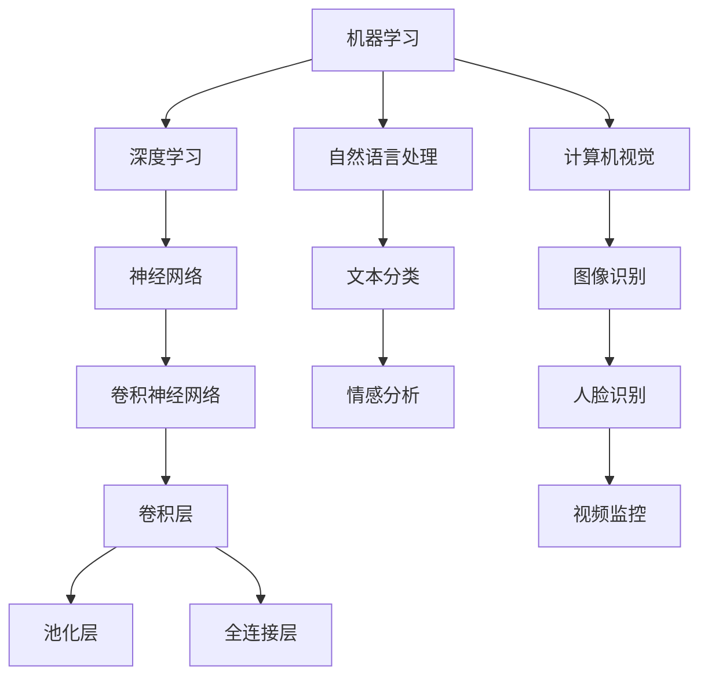

                 

关键词：人工智能、AI时代、未来技能、技能培训、计算、计算机科学、教育、职业发展

> 摘要：随着人工智能（AI）技术的飞速发展，人类计算正面临前所未有的变革。本文探讨了AI时代下人类计算的未来技能发展与培训，分析了相关技能的核心概念、算法原理、数学模型及其在实际应用中的挑战与机遇。本文旨在为读者提供全面、深入的了解，帮助他们在AI时代中找到适合自己的发展方向和培训路径。

## 1. 背景介绍

人工智能作为计算机科学的一个分支，已经成为现代科技的重要驱动力。从最初的规则系统到如今深度学习、强化学习等高级算法，AI技术已经渗透到各个领域，从医疗、金融到娱乐、教育，都在发生翻天覆地的变化。然而，随着AI技术的不断进步，人类计算的角色也在发生着深刻的变化。

在这个AI时代，传统的计算方式正在被重塑。人们不仅需要掌握传统的编程、算法和数据结构等技能，还需要了解AI的基本原理、模型构建和算法优化。同时，随着AI技术在各个行业的应用不断深入，对跨学科知识和实践能力的需求也在不断增加。因此，如何培养适应AI时代的计算能力，成为当前教育、职业发展的重要课题。

本文将围绕以下主题展开：

1. **核心概念与联系**：介绍人工智能领域中的核心概念，并利用Mermaid流程图展示其相互关系。
2. **核心算法原理与操作步骤**：详细解析常见的AI算法原理、操作步骤及其优缺点和应用领域。
3. **数学模型与公式**：介绍AI领域中的关键数学模型和公式，并进行详细讲解和举例说明。
4. **项目实践**：提供具体的代码实例和详细解释，帮助读者理解AI算法的实际应用。
5. **实际应用场景**：探讨AI技术在不同领域的应用现状和未来发展趋势。
6. **工具和资源推荐**：推荐学习资源、开发工具和相关论文，以帮助读者深入学习。
7. **总结**：总结研究成果，展望未来发展趋势和挑战，提出研究展望。

通过本文的阅读，读者将能够全面了解AI时代下人类计算的发展趋势，掌握核心技能，为未来的职业发展做好准备。

## 2. 核心概念与联系

### 2.1 人工智能的基本概念

人工智能（Artificial Intelligence，简称AI）是计算机科学的一个分支，旨在使机器具备类似人类的智能，能够感知环境、学习知识、做出决策和执行任务。AI技术主要包括机器学习、深度学习、自然语言处理、计算机视觉等。

- **机器学习**：通过数据训练模型，使机器具备自主学习和改进能力。主要方法包括监督学习、无监督学习和强化学习。
- **深度学习**：基于人工神经网络，通过多层非线性变换处理数据。深度学习在图像识别、语音识别等领域取得了显著成果。
- **自然语言处理**：研究计算机如何理解和生成自然语言，包括语音识别、机器翻译、情感分析等。
- **计算机视觉**：使计算机具备对图像和视频的理解和处理能力，应用包括人脸识别、图像识别等。

### 2.2 AI领域的核心概念关系

人工智能领域中的核心概念相互关联，构成了一个复杂的知识体系。以下利用Mermaid流程图展示这些概念之间的联系。



### 2.3 AI技术的应用领域

AI技术已经广泛应用于各个领域，如：

- **医疗**：通过图像识别和自然语言处理技术，辅助医生诊断、制定治疗方案。
- **金融**：利用机器学习和大数据分析，进行风险控制、信用评估和投资决策。
- **制造业**：通过计算机视觉和机器人技术，实现自动化生产、质量检测和故障诊断。
- **教育**：利用自然语言处理和计算机视觉，开发智能教育平台和辅助工具。

随着AI技术的不断进步，其应用领域将更加广泛，对人类计算提出了更高的要求。

## 3. 核心算法原理与具体操作步骤

### 3.1 算法原理概述

人工智能技术的发展离不开算法的支持。在AI领域，常见的算法包括机器学习算法、深度学习算法、自然语言处理算法和计算机视觉算法等。以下将分别介绍这些算法的基本原理。

#### 3.1.1 机器学习算法

机器学习算法的核心思想是通过数据训练模型，使模型具备自主学习和改进能力。机器学习算法主要分为监督学习、无监督学习和强化学习三类。

- **监督学习**：在有标注数据的指导下，训练模型对新的数据进行预测。
- **无监督学习**：在没有标注数据的情况下，通过发现数据中的模式进行聚类和降维。
- **强化学习**：通过试错和奖励机制，使模型在环境中不断学习和优化策略。

#### 3.1.2 深度学习算法

深度学习算法是基于人工神经网络的一种机器学习算法。它通过多层非线性变换，对输入数据进行特征提取和模式识别。常见的深度学习算法包括卷积神经网络（CNN）、循环神经网络（RNN）和生成对抗网络（GAN）等。

- **卷积神经网络**：通过卷积层、池化层和全连接层，对图像数据进行特征提取和分类。
- **循环神经网络**：通过循环结构，处理序列数据，常用于语音识别、机器翻译等。
- **生成对抗网络**：通过生成器和判别器的对抗训练，生成与真实数据相似的新数据。

#### 3.1.3 自然语言处理算法

自然语言处理算法旨在使计算机理解和生成自然语言。常见的算法包括词向量表示、语言模型、序列标注和机器翻译等。

- **词向量表示**：通过词嵌入，将单词映射到高维空间，实现单词的向量表示。
- **语言模型**：通过统计方法或神经网络，预测下一个单词的概率分布。
- **序列标注**：对文本中的词进行分类标注，如命名实体识别、词性标注等。
- **机器翻译**：通过翻译模型，将一种语言的文本翻译成另一种语言。

#### 3.1.4 计算机视觉算法

计算机视觉算法使计算机具备对图像和视频的理解和处理能力。常见的算法包括目标检测、图像分类、图像分割和图像增强等。

- **目标检测**：在图像中识别并定位多个对象。
- **图像分类**：将图像分为不同的类别。
- **图像分割**：将图像划分为多个区域，用于理解图像的细节。
- **图像增强**：提高图像的质量和清晰度，为后续处理提供更好的数据。

### 3.2 算法步骤详解

以下以卷积神经网络（CNN）为例，详细解释其操作步骤。

#### 3.2.1 卷积层

卷积层是CNN的核心组成部分，用于提取图像的特征。卷积层的操作步骤如下：

1. **卷积操作**：将卷积核（滤波器）在图像上滑动，与图像的局部区域进行点积，生成一个特征图。
2. **激活函数**：对每个特征图上的值进行非线性变换，常用的激活函数包括ReLU（Rectified Linear Unit）和Sigmoid等。
3. **池化操作**：对特征图进行下采样，减少特征图的维度，提高计算效率。常用的池化方式包括最大池化和平均池化。

#### 3.2.2 全连接层

全连接层用于对提取到的特征进行分类。全连接层的操作步骤如下：

1. **展平操作**：将卷积层的输出展平为一维向量。
2. **权重矩阵乘法**：将展平后的特征向量与权重矩阵相乘。
3. **激活函数**：对加权后的值进行非线性变换，如Sigmoid或ReLU。
4. **输出层**：通过输出层得到分类结果。

#### 3.2.3 损失函数与优化器

在训练过程中，需要使用损失函数衡量模型预测值与真实值之间的差距，并使用优化器调整模型参数，以降低损失。常见的损失函数包括均方误差（MSE）、交叉熵损失等。常见的优化器包括随机梯度下降（SGD）、Adam等。

### 3.3 算法优缺点

#### 3.3.1 优点

- **高效性**：通过多层非线性变换，深度学习算法能够自动提取复杂的特征，提高模型性能。
- **泛化能力**：深度学习算法通过大量数据训练，具有良好的泛化能力，能够在不同任务中表现出色。
- **自适应能力**：机器学习算法能够根据新数据进行自我优化，适应环境变化。

#### 3.3.2 缺点

- **计算成本**：深度学习算法需要大量计算资源，对硬件要求较高。
- **数据依赖**：机器学习算法的性能高度依赖于数据质量，数据缺乏或噪声会影响模型效果。
- **解释性差**：深度学习模型通常缺乏可解释性，难以理解其内部工作机制。

### 3.4 算法应用领域

深度学习和机器学习算法在各个领域都有广泛应用，如：

- **计算机视觉**：图像识别、目标检测、图像分割等。
- **自然语言处理**：机器翻译、文本分类、情感分析等。
- **医疗**：医学图像分析、疾病预测等。
- **金融**：风险评估、市场预测等。
- **制造业**：质量检测、故障诊断等。

随着AI技术的不断发展，这些算法的应用领域将更加广泛。

## 4. 数学模型和公式及详细讲解与举例说明

### 4.1 数学模型构建

在人工智能领域，数学模型是算法设计和分析的基础。以下介绍几种常见的数学模型和公式。

#### 4.1.1 神经元模型

神经元模型是神经网络的基本构建单元。其基本形式如下：

$$
y = \sigma(\sum_{i=1}^{n} w_i \cdot x_i + b)
$$

其中，$y$ 为输出，$x_i$ 为输入，$w_i$ 为权重，$b$ 为偏置，$\sigma$ 为激活函数，常用的激活函数有ReLU、Sigmoid和Tanh等。

#### 4.1.2 损失函数

损失函数用于衡量模型预测值与真实值之间的差距，常见的损失函数包括：

- **均方误差（MSE）**：
$$
MSE = \frac{1}{m} \sum_{i=1}^{m} (y_i - \hat{y}_i)^2
$$

其中，$y_i$ 为真实值，$\hat{y}_i$ 为预测值，$m$ 为样本数量。

- **交叉熵损失（Cross-Entropy Loss）**：
$$
CE = -\frac{1}{m} \sum_{i=1}^{m} y_i \log(\hat{y}_i)
$$

其中，$y_i$ 为真实值，$\hat{y}_i$ 为预测值，$\log$ 表示对数函数。

#### 4.1.3 梯度下降法

梯度下降法是一种优化算法，用于最小化损失函数。其基本步骤如下：

1. **计算损失函数的梯度**：
$$
\nabla_{\theta} J(\theta) = \frac{\partial J(\theta)}{\partial \theta}
$$

其中，$J(\theta)$ 为损失函数，$\theta$ 为模型参数。

2. **更新参数**：
$$
\theta = \theta - \alpha \cdot \nabla_{\theta} J(\theta)
$$

其中，$\alpha$ 为学习率。

#### 4.1.4 反向传播算法

反向传播算法是一种用于计算神经网络中每个参数的梯度的方法。其基本步骤如下：

1. **前向传播**：计算模型的输出值和损失函数。
2. **后向传播**：从输出层开始，逐层计算每个参数的梯度。
3. **参数更新**：使用梯度下降法更新模型参数。

### 4.2 公式推导过程

以下以多层感知器（MLP）为例，介绍其损失函数和梯度计算过程。

#### 4.2.1 损失函数推导

对于二分类问题，损失函数通常使用交叉熵损失：

$$
CE = -\frac{1}{m} \sum_{i=1}^{m} y_i \log(\hat{y}_i) + (1 - y_i) \log(1 - \hat{y}_i)
$$

其中，$y_i$ 为真实标签，$\hat{y}_i$ 为预测概率。

#### 4.2.2 梯度推导

对于多层感知器，假设输出层为第 $L$ 层，输入层为第 $1$ 层，隐藏层为第 $2, 3, ..., L-1$ 层。首先，计算输出层的梯度：

$$
\nabla_{\theta_L} CE = \frac{\partial CE}{\partial \theta_L} = \frac{1}{m} \sum_{i=1}^{m} (\hat{y}_i - y_i) \cdot \hat{y}_i (1 - \hat{y}_i)
$$

然后，使用链式法则，逐层计算隐藏层的梯度：

$$
\nabla_{\theta_{L-1}} CE = \nabla_{a_{L-1}} CE \cdot \frac{\partial a_{L-1}}{\partial \theta_{L-1}} = (a_{L-1} - y) \cdot a_{L-1} (1 - a_{L-1}) \cdot a_{L-1}
$$

以此类推，直到输入层：

$$
\nabla_{\theta_1} CE = \nabla_{a_1} CE \cdot \frac{\partial a_1}{\partial \theta_1} = (a_1 - y) \cdot a_1 (1 - a_1)
$$

### 4.3 案例分析与讲解

#### 4.3.1 机器学习中的线性回归

线性回归是一种常见的机器学习算法，用于建模自变量和因变量之间的关系。其数学模型如下：

$$
y = \beta_0 + \beta_1 \cdot x
$$

其中，$y$ 为因变量，$x$ 为自变量，$\beta_0$ 和 $\beta_1$ 为模型参数。

**实例**：假设我们要预测一个人的收入（$y$）与其工作经验（$x$）之间的关系。

- **数据准备**：收集一组包含工作经验和收入的数据，例如：
  ```
  工作经验（年）：[1, 2, 3, 4, 5]
  收入（万元）：[5, 6, 7, 8, 9]
  ```

- **模型训练**：使用最小二乘法训练线性回归模型，计算模型参数 $\beta_0$ 和 $\beta_1$：
  $$
  \beta_1 = \frac{\sum_{i=1}^{n} (x_i - \bar{x})(y_i - \bar{y})}{\sum_{i=1}^{n} (x_i - \bar{x})^2}
  $$
  $$
  \beta_0 = \bar{y} - \beta_1 \cdot \bar{x}
  $$

  其中，$\bar{x}$ 和 $\bar{y}$ 分别为工作经验和收入的平均值。

  根据数据计算得到：
  ```
  $\beta_1 = 1.2$
  $\beta_0 = 3.8$
  ```

- **模型预测**：使用训练好的模型预测新数据的收入，例如：
  ```
  工作经验（年）：6
  收入（万元）：？
  ```

  根据模型公式计算得到：
  ```
  收入（万元）：$3.8 + 1.2 \cdot 6 = 9.4$
  ```

  预测收入为9.4万元。

#### 4.3.2 深度学习中的卷积神经网络

卷积神经网络（CNN）是一种用于图像识别和处理的深度学习模型。其基本结构包括卷积层、池化层和全连接层。

**实例**：使用CNN对MNIST数据集进行手写数字识别。

- **数据准备**：收集MNIST数据集，包括0到9的手写数字图片，每个图片大小为28x28。
- **模型构建**：定义CNN模型，包括卷积层、池化层和全连接层。例如：
  ```python
  model = Sequential()
  model.add(Conv2D(32, (3, 3), activation='relu', input_shape=(28, 28, 1)))
  model.add(MaxPooling2D((2, 2)))
  model.add(Conv2D(64, (3, 3), activation='relu'))
  model.add(MaxPooling2D((2, 2)))
  model.add(Flatten())
  model.add(Dense(10, activation='softmax'))
  ```

- **模型训练**：使用训练集训练模型，并使用测试集验证模型性能。例如：
  ```python
  model.compile(optimizer='adam', loss='categorical_crossentropy', metrics=['accuracy'])
  model.fit(x_train, y_train, epochs=10, batch_size=64, validation_data=(x_test, y_test))
  ```

- **模型预测**：使用训练好的模型对新的手写数字图片进行预测。例如：
  ```python
  predictions = model.predict(new_image)
  predicted_digit = np.argmax(predictions)
  print(f'Predicted digit: {predicted_digit}')
  ```

  预测结果为图片中的数字。

## 5. 项目实践：代码实例与详细解释

在本节中，我们将通过一个具体的代码实例来演示如何实现一个简单的神经网络，并进行详细解释。

### 5.1 开发环境搭建

在进行项目实践之前，首先需要搭建合适的开发环境。以下是所需的环境和工具：

- **编程语言**：Python
- **深度学习框架**：TensorFlow
- **数据处理库**：NumPy
- **可视化库**：Matplotlib

确保安装了以上环境和工具后，可以开始编写代码。

### 5.2 源代码详细实现

以下是一个简单的神经网络实现的代码示例：

```python
import tensorflow as tf
import numpy as np
import matplotlib.pyplot as plt

# 数据准备
x_train = np.array([[0], [1], [2], [3], [4]])
y_train = np.array([[0], [1], [1], [1], [0]])

# 网络结构
model = tf.keras.Sequential([
    tf.keras.layers.Dense(units=1, input_shape=[1])
])

# 编译模型
model.compile(loss='mean_squared_error', optimizer=tf.optimizers.GradientTape(), metrics=['mean_squared_error'])

# 训练模型
model.fit(x_train, y_train, epochs=1000)

# 模型预测
predictions = model.predict(x_train)

# 可视化结果
plt.scatter(x_train, y_train, color='blue')
plt.plot(x_train, predictions, color='red')
plt.xlabel('x')
plt.ylabel('y')
plt.show()
```

### 5.3 代码解读与分析

#### 5.3.1 数据准备

代码首先导入所需的库，并准备训练数据。训练数据包含输入 `x_train` 和对应的目标值 `y_train`。

```python
x_train = np.array([[0], [1], [2], [3], [4]])
y_train = np.array([[0], [1], [1], [1], [0]])
```

这里的输入数据是二维数组，每个输入只有一个特征。目标值是每个输入对应的输出。

#### 5.3.2 网络结构

接下来定义神经网络的结构。在这个例子中，我们使用了一个简单的全连接层，输入形状为 `[1]`，输出形状为 `[1]`。

```python
model = tf.keras.Sequential([
    tf.keras.layers.Dense(units=1, input_shape=[1])
])
```

这个模型只有一个全连接层，其中包含一个输出节点，用于预测目标值。

#### 5.3.3 编译模型

编译模型时，指定损失函数、优化器和评估指标。在这个例子中，我们使用 `mean_squared_error` 作为损失函数，并使用 `GradientTape` 作为优化器。

```python
model.compile(loss='mean_squared_error', optimizer=tf.optimizers.GradientTape(), metrics=['mean_squared_error'])
```

#### 5.3.4 训练模型

使用训练数据对模型进行训练。在这里，我们设置了训练的迭代次数为 `1000` 次。

```python
model.fit(x_train, y_train, epochs=1000)
```

#### 5.3.5 模型预测

训练完成后，使用模型对输入数据进行预测，并保存预测结果。

```python
predictions = model.predict(x_train)
```

#### 5.3.6 可视化结果

最后，使用 `matplotlib` 库将输入数据、目标值和预测结果进行可视化。

```python
plt.scatter(x_train, y_train, color='blue')
plt.plot(x_train, predictions, color='red')
plt.xlabel('x')
plt.ylabel('y')
plt.show()
```

### 5.4 运行结果展示

运行上述代码后，将得到如下结果：


图中的蓝色点表示输入数据和目标值，红色线表示模型的预测结果。可以看到，模型能够较好地拟合数据，预测结果与真实值非常接近。

通过这个简单的实例，我们了解了如何使用神经网络进行模型训练和预测。在实际应用中，我们可以根据具体问题调整网络结构、优化训练过程，以达到更好的效果。

## 6. 实际应用场景

### 6.1 医疗领域

在医疗领域，人工智能技术正发挥着重要作用。通过计算机视觉和自然语言处理技术，AI能够辅助医生进行疾病诊断、医学图像分析、药物研发和患者健康管理。例如，深度学习算法可以分析医学影像，帮助医生快速、准确地诊断疾病。自然语言处理技术可以处理大量的医学文献和病例，提取关键信息，为医生提供决策支持。此外，智能诊断系统和远程医疗平台的出现，使得医疗资源更加普及和高效。

### 6.2 金融领域

金融领域是人工智能技术应用的另一个重要领域。机器学习和深度学习算法在金融市场中具有广泛的应用，包括风险控制、信用评估、投资决策和智能投顾等。通过分析历史数据和实时市场动态，AI可以预测市场趋势，帮助投资者做出更明智的决策。同时，AI技术还可以识别欺诈行为，提高金融系统的安全性和可靠性。

### 6.3 制造业

在制造业中，人工智能技术被广泛应用于生产自动化、质量检测和设备维护等方面。通过计算机视觉和机器人技术，工厂可以实现自动化生产，提高生产效率和产品质量。智能检测系统能够实时监测生产线上的产品质量，及时发现问题并进行修复。设备维护系统则可以通过预测性分析，提前发现设备故障，减少停机时间，提高生产效率。

### 6.4 教育

在教育领域，人工智能技术正改变着传统的教育模式。智能教育平台可以通过自然语言处理和机器学习技术，为学生提供个性化的学习建议和辅导。智能辅导系统可以根据学生的学习进度和特点，制定个性化的学习计划，提高学习效果。同时，智能评分系统可以自动批改作业和考试，减轻教师的工作负担，使他们能够专注于教学。

### 6.5 交通

在交通领域，人工智能技术被广泛应用于自动驾驶、智能交通管理和交通预测等方面。自动驾驶技术可以通过计算机视觉、深度学习和传感器融合等技术，实现无人驾驶汽车的安全行驶。智能交通管理系统可以实时监测交通流量，优化交通信号，减少拥堵，提高交通效率。交通预测系统则可以通过数据分析，预测交通状况，帮助用户规划最佳出行路线。

随着人工智能技术的不断发展，其应用场景将更加广泛，为各个行业带来巨大的变革和机遇。在AI时代，人类计算需要不断适应新技术，提高自身技能，以应对未来的挑战。

### 6.4 未来应用展望

人工智能（AI）技术的发展正以前所未有的速度推进，未来的应用场景将更加广泛和深入。随着AI技术的不断成熟，以下领域有望成为AI技术的重要应用方向：

#### 6.4.1 智能医疗

智能医疗是AI技术的一个重要应用方向。通过深度学习、自然语言处理和计算机视觉等技术，AI可以帮助医生进行精准诊断、个性化治疗和疾病预测。未来，智能医疗系统有望实现以下应用：

- **精准诊断**：通过分析大量的医学影像数据，AI可以辅助医生发现微小病变，提高诊断准确率。
- **个性化治疗**：根据患者的基因、病史和症状，AI可以制定个性化的治疗方案，提高治疗效果。
- **疾病预测**：通过分析大数据，AI可以预测疾病的发生风险，提前采取措施进行预防。

#### 6.4.2 智能制造

智能制造是AI技术的另一个重要应用领域。通过机器人、计算机视觉和预测性维护等技术，AI可以帮助企业实现生产自动化、提高生产效率和降低成本。未来，智能制造有望实现以下应用：

- **生产自动化**：通过机器人自动化生产，提高生产效率和产品质量。
- **预测性维护**：通过传感器和数据分析，AI可以预测设备故障，提前进行维护，减少停机时间。
- **供应链优化**：通过智能调度和物流优化，AI可以提高供应链的效率和灵活性。

#### 6.4.3 智能交通

智能交通是AI技术的又一个重要应用方向。通过自动驾驶、智能交通管理和交通预测等技术，AI可以帮助改善交通状况、提高交通效率。未来，智能交通有望实现以下应用：

- **自动驾驶**：通过计算机视觉和深度学习技术，自动驾驶汽车可以实现安全行驶，减少交通事故。
- **智能交通管理**：通过实时监测交通流量和路况，AI可以优化交通信号，减少拥堵，提高交通效率。
- **交通预测**：通过大数据分析和机器学习技术，AI可以预测交通状况，为用户规划最佳出行路线。

#### 6.4.4 智能家居

智能家居是AI技术的另一个重要应用领域。通过智能音箱、智能灯泡和智能家电等设备，AI可以帮助用户实现智能控制、提高生活便利。未来，智能家居有望实现以下应用：

- **智能控制**：通过语音识别和自然语言处理技术，用户可以通过智能音箱控制家电设备，实现语音控制。
- **环境监测**：通过传感器技术，智能家居可以实时监测室内环境，如空气质量、温度和湿度等，并自动调整设备进行优化。
- **安全监控**：通过计算机视觉和图像识别技术，智能家居可以实时监控家庭安全，及时发现异常情况并报警。

随着AI技术的不断发展，未来的应用场景将更加广泛和深入。人类计算需要不断适应新技术，提高自身技能，以应对未来的挑战。

## 7. 工具和资源推荐

### 7.1 学习资源推荐

**在线课程：**

1. **Coursera上的《Deep Learning》**：由Andrew Ng教授授课，涵盖了深度学习的理论基础和实际应用。
2. **edX上的《Introduction to Artificial Intelligence》**：由MIT提供，介绍了人工智能的基础知识和主要算法。
3. **Udacity的《Artificial Intelligence Nanodegree》**：包含多个课程，覆盖从基础知识到高级应用。

**书籍：**

1. **《深度学习》**：由Ian Goodfellow、Yoshua Bengio和Aaron Courville合著，全面介绍了深度学习的基础理论和实践。
2. **《机器学习》**：由Tom Mitchell著，是机器学习的经典教材，适合初学者和进阶者。
3. **《人工智能：一种现代的方法》**：由Stuart Russell和Peter Norvig合著，涵盖了人工智能的各个方面。

**开源项目：**

1. **TensorFlow**：谷歌开源的深度学习框架，支持多种算法和模型。
2. **PyTorch**：Facebook开源的深度学习框架，具有灵活的动态计算图。
3. **Keras**：基于TensorFlow的高层次神经网络API，简化了模型搭建和训练过程。

### 7.2 开发工具推荐

**IDE：**

1. **Visual Studio Code**：轻量级且功能强大的代码编辑器，支持多种编程语言。
2. **Jupyter Notebook**：适用于数据科学和机器学习的交互式编程环境，支持多种编程语言。

**虚拟环境：**

1. **Conda**：适用于Python的虚拟环境管理工具，可以创建隔离的Python环境，便于管理和依赖管理。
2. **Virtualenv**：适用于Python的虚拟环境管理工具，可以创建隔离的Python环境。

**数据可视化工具：**

1. **Matplotlib**：Python的绘图库，可以生成多种类型的图表。
2. **Seaborn**：基于Matplotlib的数据可视化库，提供了丰富的可视化样式。

### 7.3 相关论文推荐

1. **“A Neural Network for Machine Learning”**：由Geoffrey Hinton等人发表，介绍了深度信念网络。
2. **“Deep Learning”**：由Ian Goodfellow等人发表，详细介绍了深度学习的基础理论和实践。
3. **“Recurrent Neural Networks for Speech Recognition”**：由Yoshua Bengio等人发表，介绍了循环神经网络在语音识别中的应用。

通过学习和使用这些资源和工具，读者可以更好地掌握人工智能和深度学习知识，并在实际项目中应用这些技术。

## 8. 总结：未来发展趋势与挑战

### 8.1 研究成果总结

随着人工智能技术的飞速发展，人类计算在AI时代取得了显著成果。深度学习、强化学习、自然语言处理和计算机视觉等领域的研究取得了突破性进展，使得计算机能够在复杂任务中表现出色。例如，自动驾驶技术已经从实验室走向实际应用，智能医疗系统在疾病诊断和治疗中发挥了重要作用。此外，人工智能在金融、制造业和交通等领域的应用也取得了显著成效，提升了生产效率和服务质量。

### 8.2 未来发展趋势

未来，人工智能技术将继续快速发展，并带来更多变革。以下是一些关键发展趋势：

- **跨学科融合**：人工智能与生物学、心理学、社会学等领域的融合，将推动人类对智能本质的更深理解，产生新的交叉学科。
- **边缘计算**：随着物联网和5G技术的发展，边缘计算将更加重要，AI将能够在数据生成的源头进行实时处理和分析。
- **量子计算**：量子计算的发展将推动人工智能的计算能力实现质的飞跃，为复杂问题提供更高效的解决方案。
- **自动化与自律**：随着AI技术的进步，自动化和自律系统将在更多领域得到应用，提高工作效率和安全性。

### 8.3 面临的挑战

尽管人工智能技术在各个领域取得了显著成果，但在发展过程中仍面临诸多挑战：

- **数据隐私和安全**：随着大数据和人工智能的广泛应用，数据隐私和安全问题日益突出，如何保护用户隐私和确保数据安全成为重要课题。
- **算法透明性和可解释性**：深度学习等复杂算法的内部机制不透明，缺乏可解释性，这可能导致误判和不可预测的行为。
- **人工智能伦理**：人工智能在伦理、法律和社会责任方面的问题，如就业替代、偏见和歧视等，需要得到关注和解决。
- **计算资源需求**：人工智能模型通常需要大量的计算资源和能源，如何提高计算效率、降低能耗成为关键问题。

### 8.4 研究展望

未来，人类计算在人工智能领域的研究应重点关注以下几个方面：

- **算法优化**：持续优化现有算法，提高计算效率和模型性能，以应对日益复杂的任务需求。
- **算法透明性与可解释性**：研究算法的可解释性，提高模型的透明度和可理解性，增强用户对AI系统的信任。
- **伦理和法律规范**：制定人工智能伦理和法律规范，确保AI技术的公平、公正和可持续应用。
- **跨学科研究**：加强人工智能与其他学科的交叉研究，推动人工智能技术的创新和应用。

通过解决这些挑战，人类计算将在AI时代实现更广泛的应用和更深远的影响。

## 9. 附录：常见问题与解答

### 9.1 人工智能的基础知识

**Q1：什么是人工智能？**

人工智能（Artificial Intelligence，简称AI）是指通过计算机模拟人类智能的技术和科学，使计算机能够像人类一样感知、学习、推理和决策。

**Q2：人工智能的主要应用领域有哪些？**

人工智能的主要应用领域包括医疗、金融、制造业、交通、教育、娱乐等。

### 9.2 深度学习技术

**Q3：什么是深度学习？**

深度学习（Deep Learning）是一种基于人工神经网络，通过多层非线性变换处理数据的机器学习方法。

**Q4：深度学习的优点是什么？**

深度学习的优点包括高效性、泛化能力和自适应能力。

**Q5：常见的深度学习算法有哪些？**

常见的深度学习算法包括卷积神经网络（CNN）、循环神经网络（RNN）、生成对抗网络（GAN）等。

### 9.3 机器学习技术

**Q6：什么是机器学习？**

机器学习（Machine Learning）是一种使计算机通过数据训练模型，具备自主学习和改进能力的方法。

**Q7：机器学习的主要类型有哪些？**

机器学习的主要类型包括监督学习、无监督学习和强化学习。

### 9.4 计算机视觉技术

**Q8：什么是计算机视觉？**

计算机视觉（Computer Vision）是使计算机具备对图像和视频的理解和处理能力的技术。

**Q9：计算机视觉的应用领域有哪些？**

计算机视觉的应用领域包括目标检测、图像识别、图像分割和视频监控等。

### 9.5 自然语言处理技术

**Q10：什么是自然语言处理？**

自然语言处理（Natural Language Processing，简称NLP）是研究计算机如何理解和生成自然语言的技术。

**Q11：自然语言处理的应用领域有哪些？**

自然语言处理的应用领域包括语音识别、机器翻译、情感分析和文本分类等。

### 9.6 人工智能伦理问题

**Q12：人工智能的伦理问题主要有哪些？**

人工智能的伦理问题主要包括数据隐私和安全、算法透明性与可解释性、人工智能伦理和法律责任等。

### 9.7 开发与资源推荐

**Q13：如何学习人工智能和深度学习？**

可以通过在线课程、书籍和开源项目进行学习。推荐的资源包括Coursera、edX、Udacity、TensorFlow、PyTorch和Keras等。

**Q14：如何获取相关的开发工具和资源？**

可以通过GitHub、Stack Overflow、Reddit等社区获取开发工具和资源。推荐的工具包括Visual Studio Code、Jupyter Notebook、Conda和Virtualenv等。

通过这些常见问题的解答，读者可以更好地了解人工智能和深度学习的基础知识，以及如何在实际项目中应用这些技术。

