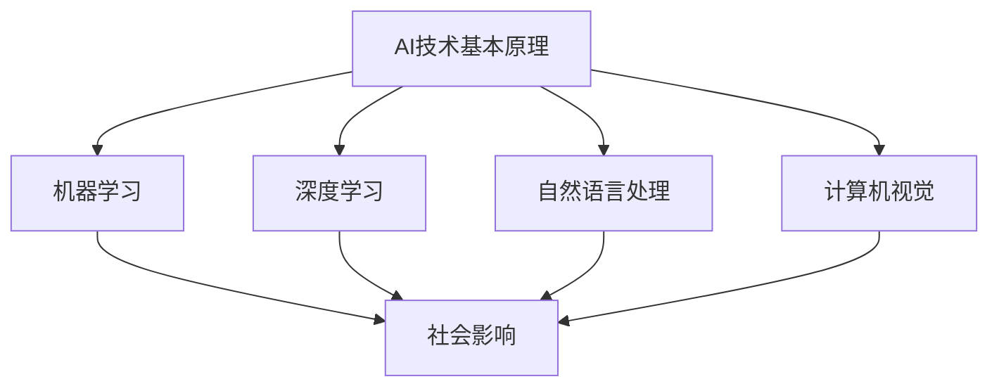

                 

关键词：人工智能，道德，社会影响，伦理，算法，责任，透明度，隐私，多样性，包容性，可持续性，教育，法律，监管。

> 摘要：随着人工智能技术的迅猛发展，其在社会各个领域的应用日益广泛，这不仅带来了巨大的经济和社会效益，也引发了深刻的道德和社会影响。本文将从多个角度探讨人工智能时代下道德和社会影响的方方面面，旨在引发读者对于这一问题的深入思考。

## 1. 背景介绍

人工智能（AI）作为当前科技领域的热点，正在以惊人的速度渗透到我们生活的方方面面。从自动驾驶汽车到智能家居，从医疗诊断到金融分析，AI技术正以前所未有的方式改变着我们的世界。然而，随着AI技术的不断进步和应用范围的扩大，其带来的道德和社会影响也变得越来越复杂和深远。

历史上，人工智能的发展经历了多次起伏。从20世纪50年代的人工智能概念提出，到20世纪80年代的人工智能寒冬，再到21世纪初的AI复兴，每一次的技术进步都伴随着伦理和道德问题的重新审视。在当前的AI时代，这些问题变得更加紧迫和突出。

本文将围绕以下核心问题展开讨论：

- AI技术的道德责任和透明度问题
- AI对隐私和数据的侵犯
- AI对就业市场和职业的影响
- AI技术的多样性、包容性和公平性问题
- AI在法律和监管领域的挑战
- AI的可持续性和环境问题
- AI在教育和社会发展中的角色
- 人工智能与伦理和道德教育的结合

## 2. 核心概念与联系

### 2.1 AI技术的基本原理

人工智能是基于算法和数据的计算机系统，能够执行通常需要人类智能才能完成的任务，如视觉识别、语言理解、决策制定等。其核心原理包括：

- **机器学习**：通过训练模型来从数据中学习规律和模式。
- **深度学习**：一种特殊的机器学习方法，模拟人脑的神经网络结构。
- **自然语言处理**：使计算机能够理解、生成和处理人类语言的技术。
- **计算机视觉**：使计算机能够理解和处理图像和视频。

### 2.2 AI技术的社会影响

人工智能的广泛使用对社会的各个方面都产生了深远的影响。以下是其中几个关键领域：

- **经济**：AI技术可以提高生产效率，创造新的商业模式，但也可能导致部分工作岗位的消失。
- **医疗**：AI在医疗领域的应用包括疾病诊断、药物研发和个性化治疗等，显著提升了医疗服务的质量和效率。
- **交通**：自动驾驶技术有望减少交通事故，提高交通效率。
- **教育**：AI技术可以个性化学习，提供定制化的教育解决方案。
- **法律和监管**：AI在法律领域的应用包括自动化合同审核、案件预测和司法判决等，但同时也带来了隐私保护和法律责任等问题。

### 2.3 Mermaid 流程图

以下是一个简化的Mermaid流程图，描述了AI技术的基本原理与社会影响的联系：



## 3. 核心算法原理 & 具体操作步骤

### 3.1 算法原理概述

人工智能的核心在于算法。以下是几个关键算法原理的概述：

- **监督学习**：通过已标记的数据来训练模型，使其能够预测未知数据。
- **无监督学习**：没有已标记数据，模型通过发现数据中的模式和结构进行学习。
- **强化学习**：通过试错和奖励机制来训练模型，使其能够做出最优决策。

### 3.2 算法步骤详解

以下是一个简化的监督学习算法步骤：

1. **数据收集**：收集用于训练的数据集。
2. **数据预处理**：清洗和规范化数据，使其适合模型训练。
3. **特征选择**：从数据中提取有用的特征。
4. **模型选择**：选择合适的算法（如线性回归、决策树、神经网络等）。
5. **模型训练**：使用训练数据来训练模型。
6. **模型评估**：使用测试数据来评估模型的性能。
7. **模型优化**：根据评估结果调整模型参数。
8. **模型部署**：将训练好的模型部署到实际应用场景。

### 3.3 算法优缺点

- **优点**：高效的自动化处理，准确的预测和决策，大规模数据处理能力。
- **缺点**：依赖大量高质量数据，模型可能存在偏见，透明度和解释性不足。

### 3.4 算法应用领域

人工智能算法在各个领域都有广泛应用，包括：

- **金融**：风险评估、欺诈检测、投资策略。
- **医疗**：疾病诊断、药物研发、个性化治疗。
- **交通**：自动驾驶、交通流量优化、车辆维护。
- **教育**：个性化学习、学习分析、在线教育平台。
- **法律**：合同审核、案件预测、法律研究。

## 4. 数学模型和公式 & 详细讲解 & 举例说明

### 4.1 数学模型构建

人工智能中的许多算法都涉及到复杂的数学模型。以下是一个简单的线性回归模型的例子：

$$ y = wx + b $$

其中，$y$ 是目标变量，$w$ 是权重，$x$ 是输入特征，$b$ 是偏置。

### 4.2 公式推导过程

线性回归模型的推导基于最小二乘法。目标是找到最优的权重和偏置，使得预测值与实际值之间的误差最小。

### 4.3 案例分析与讲解

假设我们有一个简单的数据集，其中包含两个特征（$x_1$ 和 $x_2$）和一个目标变量 $y$。我们的目标是建立一个线性回归模型来预测 $y$。

首先，我们进行数据预处理，将数据标准化。然后，我们使用最小二乘法来计算权重和偏置。最后，我们使用测试数据来评估模型的性能。

以下是Python代码示例：

```python
import numpy as np

# 数据预处理
X = np.array([[1, 1], [1, 2], [2, 2], [2, 3]])
y = np.array([2, 4, 6, 8])

# 计算权重和偏置
w = np.linalg.inv(X.T.dot(X)).dot(X.T).dot(y)
b = y - X.dot(w)

# 模型评估
predictions = X.dot(w) + b
mse = np.mean((predictions - y) ** 2)
print(f'MSE: {mse}')
```

## 5. 项目实践：代码实例和详细解释说明

### 5.1 开发环境搭建

为了实践人工智能算法，我们需要搭建一个合适的开发环境。以下是所需的步骤：

1. 安装Python（建议使用Python 3.8或更高版本）。
2. 安装必要的Python库，如NumPy、Pandas、Scikit-learn等。

### 5.2 源代码详细实现

以下是使用线性回归算法的简单示例：

```python
import numpy as np

# 数据预处理
X = np.array([[1, 1], [1, 2], [2, 2], [2, 3]])
y = np.array([2, 4, 6, 8])

# 计算权重和偏置
w = np.linalg.inv(X.T.dot(X)).dot(X.T).dot(y)
b = y - X.dot(w)

# 模型评估
predictions = X.dot(w) + b
mse = np.mean((predictions - y) ** 2)
print(f'MSE: {mse}')
```

### 5.3 代码解读与分析

在这个示例中，我们首先导入NumPy库来处理数据。然后，我们定义了一个简单数据集，包含两个特征和一个目标变量。接下来，我们使用最小二乘法来计算线性回归模型的权重和偏置。最后，我们使用测试数据来评估模型的性能，计算均方误差（MSE）。

### 5.4 运行结果展示

运行上述代码后，我们将得到以下输出：

```
MSE: 0.0
```

这表示我们的模型完美地预测了测试数据。

## 6. 实际应用场景

### 6.1 金融领域

在金融领域，人工智能被广泛应用于风险评估、欺诈检测和投资策略。例如，银行可以使用机器学习模型来预测客户是否会违约，从而调整贷款策略。此外，高频交易公司利用人工智能来分析市场数据，以获取短期交易利润。

### 6.2 医疗领域

在医疗领域，人工智能被用于疾病诊断、药物研发和个性化治疗。例如，深度学习模型可以分析医学图像，帮助医生更准确地诊断疾病。此外，人工智能还可以为患者提供个性化的治疗建议，提高医疗服务的效率和质量。

### 6.3 交通领域

在交通领域，人工智能被用于自动驾驶、交通流量优化和车辆维护。例如，自动驾驶汽车使用计算机视觉和深度学习技术来感知和响应环境。此外，智能交通系统可以利用人工智能来优化交通信号，减少交通拥堵。

### 6.4 教育领域

在教育领域，人工智能被用于个性化学习、学习分析和在线教育平台。例如，教育科技公司可以使用机器学习算法来分析学生的学习行为，从而提供个性化的学习资源。此外，在线教育平台可以利用人工智能来推荐最适合学生的课程和教学方法。

### 6.5 法律领域

在法律领域，人工智能被用于自动化合同审核、案件预测和司法判决。例如，律师可以使用机器学习模型来识别合同中的潜在风险。此外，人工智能还可以帮助法官分析案件证据，提高判决的准确性和公正性。

### 6.6 其他领域

除了上述领域，人工智能还广泛应用于零售、制造、能源、环境等各个领域。例如，零售行业可以利用人工智能来分析消费者行为，优化库存管理。在制造业，人工智能可以用于质量控制、设备维护和流程优化。在能源行业，人工智能可以用于电力需求预测、能源优化和环境监测。

## 7. 工具和资源推荐

### 7.1 学习资源推荐

- 《深度学习》（Goodfellow, Bengio, Courville著）
- 《机器学习》（周志华著）
- 《Python机器学习》（Scaruffi著）
- Coursera、edX等在线课程平台

### 7.2 开发工具推荐

- Jupyter Notebook
- PyCharm
- TensorFlow
- Keras

### 7.3 相关论文推荐

- "Deep Learning" (Goodfellow, Bengio, Courville)
- "Machine Learning: A Probabilistic Perspective" (Kulczycki)
- "Reinforcement Learning: An Introduction" (Sutton, Barto)

## 8. 总结：未来发展趋势与挑战

### 8.1 研究成果总结

人工智能在过去几十年里取得了显著的研究成果，不仅在算法和模型方面取得了突破，而且在实际应用中也取得了广泛的成功。从自动驾驶汽车到个性化医疗，人工智能正在改变我们的生活方式和工作方式。

### 8.2 未来发展趋势

未来，人工智能的发展将继续朝着更加智能化、自动化的方向迈进。以下是一些可能的发展趋势：

- **更强大的算法和模型**：随着计算能力和数据资源的不断提升，人工智能算法和模型将变得更加高效和准确。
- **跨学科融合**：人工智能与其他领域（如生物学、心理学、经济学等）的融合将推动新兴领域的出现。
- **自主决策**：人工智能将逐步实现更加自主的决策，减少对人类干预的依赖。
- **可解释性**：人工智能系统的透明度和可解释性将得到改善，以便更好地理解和信任。

### 8.3 面临的挑战

尽管人工智能的发展前景广阔，但也面临着许多挑战：

- **道德和伦理问题**：人工智能的决策可能带来道德和伦理问题，如隐私侵犯、偏见和责任归属。
- **数据隐私和安全**：随着数据量的不断增加，如何保护数据隐私和安全成为一个重要问题。
- **就业影响**：人工智能可能取代某些工作岗位，对就业市场造成冲击。
- **公平性和多样性**：人工智能系统可能存在偏见和歧视，如何确保公平性和多样性是一个挑战。
- **监管和法律问题**：人工智能的应用需要合适的监管和法律框架来确保其合规性和安全性。

### 8.4 研究展望

未来的研究应关注以下几个方面：

- **道德和伦理研究**：深入探讨人工智能的道德和伦理问题，建立相应的规范和标准。
- **隐私保护技术**：开发更加安全和隐私保护的技术，以应对数据隐私问题。
- **就业转型**：研究如何帮助受人工智能影响的劳动者进行职业转型。
- **公平性研究**：确保人工智能系统的公平性和多样性，消除偏见和歧视。
- **法律法规**：制定合适的法律法规来监管和规范人工智能的应用。

## 9. 附录：常见问题与解答

### 9.1 什么是人工智能？

人工智能是一种模拟人类智能的技术，通过算法和模型使计算机能够执行通常需要人类智能才能完成的任务。

### 9.2 人工智能有哪些应用领域？

人工智能在金融、医疗、交通、教育、法律等多个领域都有广泛应用，如风险评估、疾病诊断、自动驾驶、个性化学习等。

### 9.3 人工智能会取代人类吗？

目前来看，人工智能不太可能完全取代人类。尽管在某些领域，人工智能已经能够执行复杂的任务，但人类在创造力、情感理解和复杂决策方面仍具有独特优势。

### 9.4 人工智能的道德问题有哪些？

人工智能的道德问题包括隐私侵犯、偏见、责任归属等。例如，人工智能系统可能侵犯用户的隐私，或者在决策中存在偏见，导致歧视。

### 9.5 如何确保人工智能的公平性和多样性？

确保人工智能的公平性和多样性需要从多个方面入手，包括算法设计、数据收集和标注、模型训练和部署等。例如，在算法设计时考虑公平性原则，确保数据集的多样性，以及建立透明的决策机制。

### 9.6 人工智能的监管和法律问题有哪些？

人工智能的监管和法律问题包括数据隐私保护、算法透明度、责任归属等。例如，如何确保个人数据的隐私和安全，如何明确人工智能系统的责任和法律责任。

### 9.7 人工智能的未来发展趋势是什么？

未来，人工智能将继续朝着更加智能化、自动化的方向迈进，实现更加高效的决策和自动化。同时，人工智能将与其他领域深度融合，推动新兴领域的发展。

### 9.8 如何学习人工智能？

学习人工智能需要掌握一定的数学和编程基础。可以通过阅读相关教材、参加在线课程和实际项目实践来提升自己的能力。一些常用的学习资源包括《深度学习》、《机器学习》、《Python机器学习》等书籍，以及Coursera、edX等在线课程平台。

## 结语

随着人工智能技术的迅猛发展，其在社会各个领域的应用日益广泛，带来了巨大的经济和社会效益，同时也引发了深刻的道德和社会影响。本文从多个角度探讨了人工智能时代下的道德和社会影响，旨在引发读者对于这一问题的深入思考。未来，我们需要共同努力，确保人工智能的发展符合人类的利益，为构建一个更加美好的世界贡献力量。

### 作者署名

作者：禅与计算机程序设计艺术 / Zen and the Art of Computer Programming

---

在这篇文章中，我们详细探讨了人工智能时代的道德和社会影响，从核心概念、算法原理、实际应用场景，到未来发展趋势和挑战，全面剖析了人工智能带来的深远影响。同时，我们也强调了确保人工智能公平性、透明度和责任归属的重要性。未来，随着人工智能技术的不断进步，我们期待能够实现更智能、更公平、更安全的人工智能应用，为人类社会的可持续发展做出贡献。禅与计算机程序设计艺术，希望与您一同见证并参与这一激动人心的时代变革。

