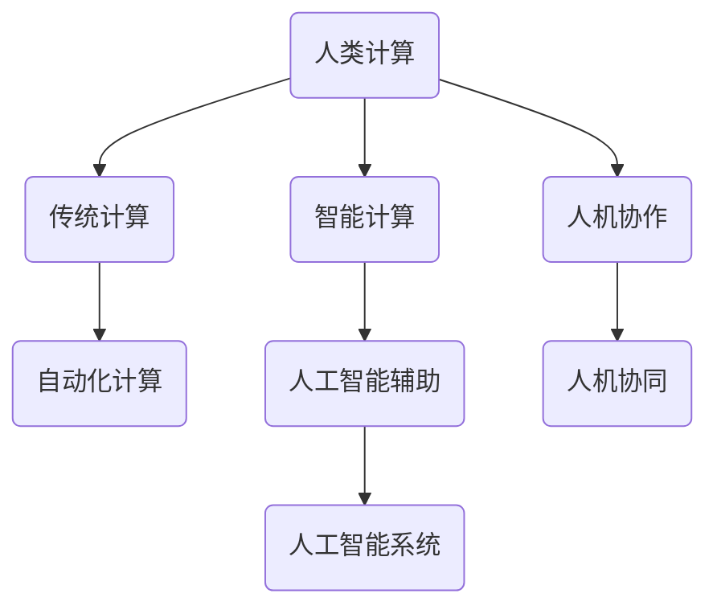

                 

关键词：人工智能、道德责任、社会责任、AI伦理、技术治理、可持续发展

> 摘要：随着人工智能技术的迅猛发展，其对社会各个方面的影响日益深远。本文旨在探讨人工智能时代的道德和社会责任，分析人工智能技术对人类计算带来的挑战，并提出相应的应对策略，以促进人工智能技术的健康发展，保障社会的和谐与进步。

## 1. 背景介绍

### 人工智能的崛起

人工智能（Artificial Intelligence，AI）作为计算机科学的一个分支，经过几十年的发展，已经取得了显著的成果。从最初的规则系统到基于机器学习的复杂算法，人工智能技术不断突破，推动了计算机视觉、自然语言处理、自动驾驶等领域的革命性进展。

### 人类计算的变革

随着人工智能的崛起，人类计算的方式也发生了巨大的变革。传统的手工处理数据、执行任务的模式逐渐被自动化、智能化的计算所取代。人类从繁琐的劳动中解放出来，更多地参与到决策、创新和管理的角色中，从而提高了生产效率，推动了社会的发展。

### AI时代的到来

当前，人工智能技术正在加速融入各个行业，从医疗、金融到教育、零售，无不受到其深刻影响。AI时代的到来，不仅带来了技术进步，也对社会的伦理、道德和责任提出了新的挑战。

## 2. 核心概念与联系

### 人工智能的基本概念

- **人工智能**：模拟人类智能的计算机系统，包括感知、学习、推理、决策等能力。
- **机器学习**：一种让计算机通过数据学习并改进自身性能的方法，包括监督学习、无监督学习和强化学习。
- **深度学习**：一种基于人工神经网络的机器学习方法，通过多层神经网络模拟人类大脑的思维方式。

### 人类计算与AI的关系

- **人类计算**：人类在处理信息和解决问题时进行的计算过程。
- **AI辅助计算**：利用人工智能技术辅助人类计算，提高效率和准确性。
- **人机协作**：人类与人工智能系统共同完成任务，发挥各自优势。

### Mermaid 流程图



## 3. 核心算法原理 & 具体操作步骤

### 3.1 算法原理概述

人工智能算法主要分为监督学习、无监督学习和强化学习三类。其中，监督学习通过已有的标注数据训练模型，无监督学习通过未标注的数据发现模式，强化学习通过不断试错学习最优策略。

### 3.2 算法步骤详解

- **监督学习**：收集标注数据，初始化模型，通过梯度下降等方法迭代更新模型参数，直到模型性能达到预设阈值。
- **无监督学习**：收集未标注数据，初始化模型，通过聚类、降维等方法提取数据特征，分析数据分布。
- **强化学习**：定义状态、动作、奖励函数，初始化模型，通过试错学习策略，不断调整动作以最大化累积奖励。

### 3.3 算法优缺点

- **监督学习**：需要大量标注数据，模型泛化能力强。
- **无监督学习**：无需标注数据，但模型泛化能力较弱。
- **强化学习**：需要大量计算资源，但能够解决复杂决策问题。

### 3.4 算法应用领域

人工智能算法广泛应用于计算机视觉、自然语言处理、语音识别、自动驾驶等领域，推动了技术的进步和社会的发展。

## 4. 数学模型和公式 & 详细讲解 & 举例说明

### 4.1 数学模型构建

人工智能中的数学模型主要包括概率模型、统计模型、优化模型等。其中，概率模型用于描述不确定性，统计模型用于分析数据分布，优化模型用于求解最优解。

### 4.2 公式推导过程

以线性回归为例，假设我们有 n 个数据点 (x1, y1), (x2, y2), ..., (xn, yn)，目标是找到一条直线 y = wx + b，使得所有数据点到直线的距离之和最小。

- **损失函数**：L(w, b) = (y - wx - b)^2
- **梯度下降**：对 w 和 b 求偏导，得到梯度 G(w, b) = (-2/n) * Σ[(yi - wxi - b)] * (xi, yi)

### 4.3 案例分析与讲解

以图像分类为例，使用卷积神经网络（CNN）进行图像分类。首先，通过卷积层提取图像特征，然后通过池化层减少特征维度，最后通过全连接层进行分类。具体步骤如下：

1. **输入层**：接受图像数据。
2. **卷积层**：使用卷积核提取图像特征。
3. **池化层**：减少特征图的维度。
4. **全连接层**：将特征图转化为分类结果。

## 5. 项目实践：代码实例和详细解释说明

### 5.1 开发环境搭建

在 Python 环境下，使用 TensorFlow 和 Keras 库搭建深度学习环境。具体步骤如下：

1. 安装 Python 和 TensorFlow：
   ```bash
   pip install python tensorflow
   ```

2. 导入所需库：
   ```python
   import numpy as np
   import tensorflow as tf
   from tensorflow import keras
   ```

### 5.2 源代码详细实现

以下是一个简单的线性回归模型的实现：

```python
# 导入库
import numpy as np
import tensorflow as tf

# 模拟数据
X = np.random.rand(100, 1)
y = 2 * X + 1 + np.random.randn(100, 1)

# 模型定义
model = tf.keras.Sequential([
    tf.keras.layers.Dense(units=1, input_shape=(1,))
])

# 编译模型
model.compile(optimizer='sgd', loss='mean_squared_error')

# 训练模型
model.fit(X, y, epochs=1000)

# 测试模型
print(model.predict([0.5]))
```

### 5.3 代码解读与分析

1. **模拟数据**：生成 X 和 y，模拟线性回归问题。
2. **模型定义**：使用 Keras 创建一个只有一个神经元的线性模型。
3. **编译模型**：指定优化器和损失函数。
4. **训练模型**：通过梯度下降优化模型参数。
5. **测试模型**：预测新数据的值。

## 6. 实际应用场景

### 6.1 医疗领域

人工智能在医疗领域的应用包括疾病诊断、药物研发、手术规划等。例如，通过深度学习算法对医疗图像进行分析，可以帮助医生更准确地诊断疾病，提高医疗服务的效率和质量。

### 6.2 金融领域

人工智能在金融领域的应用包括风险控制、信用评估、投资决策等。例如，通过机器学习算法对大量金融数据进行分析，可以帮助金融机构更好地评估风险，制定合理的投资策略。

### 6.3 教育领域

人工智能在教育领域的应用包括个性化教学、智能评估、学习资源推荐等。例如，通过智能算法对学生的学习行为进行分析，可以帮助教师更好地了解学生的学习情况，提供个性化的教学方案。

## 7. 未来应用展望

随着人工智能技术的不断进步，未来其在各个领域的应用将会更加广泛和深入。以下是一些可能的应用方向：

- **智能制造**：通过人工智能技术，实现生产过程的自动化和智能化，提高生产效率和质量。
- **智慧城市**：利用人工智能技术，实现城市管理的智能化和精细化，提高城市运行效率和生活品质。
- **生物科技**：通过人工智能技术，加速新药研发、基因编辑等生物科技的发展。

## 8. 工具和资源推荐

### 8.1 学习资源推荐

- 《深度学习》（Goodfellow, Bengio, Courville 著）
- 《Python机器学习》（Sebastian Raschka 著）
- 《人工智能：一种现代方法》（Stuart J. Russell & Peter Norvig 著）

### 8.2 开发工具推荐

- TensorFlow：一个开源的深度学习框架，支持多种机器学习算法。
- Keras：一个基于 TensorFlow 的开源神经网络库，简化了深度学习模型的搭建和训练。
- PyTorch：一个开源的深度学习框架，提供灵活的动态计算图和丰富的神经网络组件。

### 8.3 相关论文推荐

- "Deep Learning"（Ian Goodfellow, Yann LeCun, and Yoshua Bengio）
- "Learning to Represent Knowledge with a Memory-Evolent Neural Network"（T. Lin et al.）
- "Recurrent Neural Networks for Language Modeling"（T. Mikolov et al.）

## 9. 总结：未来发展趋势与挑战

### 9.1 研究成果总结

人工智能技术在各个领域取得了显著的成果，推动了社会的进步和发展。深度学习、自然语言处理、计算机视觉等技术的快速发展，为人工智能的应用提供了强大的支持。

### 9.2 未来发展趋势

随着人工智能技术的不断进步，未来其在各个领域的应用将会更加广泛和深入。特别是随着硬件性能的提升和算法的创新，人工智能有望在更多的领域实现突破。

### 9.3 面临的挑战

- **数据隐私和安全**：随着人工智能技术的应用，数据隐私和安全问题日益突出，需要建立完善的法律和制度保障。
- **伦理和社会责任**：人工智能技术的应用带来了一系列伦理和社会责任问题，需要全社会共同努力解决。
- **技术普及和人才培养**：人工智能技术的普及和人才培养是人工智能健康发展的重要保障，需要政府、企业和教育机构的共同努力。

### 9.4 研究展望

未来，人工智能技术将继续快速发展，并在各个领域实现突破。同时，需要关注人工智能技术的伦理和社会责任，推动人工智能技术的可持续发展。

## 10. 附录：常见问题与解答

### 10.1 什么是人工智能？

人工智能（Artificial Intelligence，简称 AI）是指通过计算机系统模拟人类智能的过程，包括感知、学习、推理、决策等能力。

### 10.2 人工智能有哪些应用领域？

人工智能的应用领域非常广泛，包括医疗、金融、教育、智能制造、智慧城市、生物科技等。

### 10.3 人工智能的伦理问题有哪些？

人工智能的伦理问题主要包括数据隐私、算法公平性、失业风险、责任归属等。

### 10.4 人工智能对社会的影响是什么？

人工智能对社会的影响是深远和复杂的，包括提高生产效率、改善生活质量、促进科技创新等，同时也带来了伦理、道德和社会责任等问题。

作者：禅与计算机程序设计艺术 / Zen and the Art of Computer Programming
```markdown
# 人类计算：AI时代的道德和社会责任

关键词：人工智能、道德责任、社会责任、AI伦理、技术治理、可持续发展

摘要：随着人工智能技术的迅猛发展，其对社会各个方面的影响日益深远。本文旨在探讨人工智能时代的道德和社会责任，分析人工智能技术对人类计算带来的挑战，并提出相应的应对策略，以促进人工智能技术的健康发展，保障社会的和谐与进步。

## 1. 背景介绍

### 人工智能的崛起

人工智能（Artificial Intelligence，AI）作为计算机科学的一个分支，经过几十年的发展，已经取得了显著的成果。从最初的规则系统到基于机器学习的复杂算法，人工智能技术不断突破，推动了计算机视觉、自然语言处理、自动驾驶等领域的革命性进展。

### 人类计算的变革

随着人工智能的崛起，人类计算的方式也发生了巨大的变革。传统的手工处理数据、执行任务的模式逐渐被自动化、智能化的计算所取代。人类从繁琐的劳动中解放出来，更多地参与到决策、创新和管理的角色中，从而提高了生产效率，推动了社会的发展。

### AI时代的到来

当前，人工智能技术正在加速融入各个行业，从医疗、金融到教育、零售，无不受到其深刻影响。AI时代的到来，不仅带来了技术进步，也对社会的伦理、道德和责任提出了新的挑战。

## 2. 核心概念与联系

### 人工智能的基本概念

- **人工智能**：模拟人类智能的计算机系统，包括感知、学习、推理、决策等能力。
- **机器学习**：一种让计算机通过数据学习并改进自身性能的方法，包括监督学习、无监督学习和强化学习。
- **深度学习**：一种基于人工神经网络的机器学习方法，通过多层神经网络模拟人类大脑的思维方式。

### 人类计算与AI的关系

- **人类计算**：人类在处理信息和解决问题时进行的计算过程。
- **AI辅助计算**：利用人工智能技术辅助人类计算，提高效率和准确性。
- **人机协作**：人类与人工智能系统共同完成任务，发挥各自优势。

### Mermaid 流程图


## 3. 核心算法原理 & 具体操作步骤

### 3.1 算法原理概述

人工智能算法主要分为监督学习、无监督学习和强化学习三类。其中，监督学习通过已有的标注数据训练模型，无监督学习通过未标注的数据发现模式，强化学习通过不断试错学习最优策略。

### 3.2 算法步骤详解

- **监督学习**：收集标注数据，初始化模型，通过梯度下降等方法迭代更新模型参数，直到模型性能达到预设阈值。
- **无监督学习**：收集未标注数据，初始化模型，通过聚类、降维等方法提取数据特征，分析数据分布。
- **强化学习**：定义状态、动作、奖励函数，初始化模型，通过试错学习策略，不断调整动作以最大化累积奖励。

### 3.3 算法优缺点

- **监督学习**：需要大量标注数据，模型泛化能力强。
- **无监督学习**：无需标注数据，但模型泛化能力较弱。
- **强化学习**：需要大量计算资源，但能够解决复杂决策问题。

### 3.4 算法应用领域

人工智能算法广泛应用于计算机视觉、自然语言处理、语音识别、自动驾驶等领域，推动了技术的进步和社会的发展。

## 4. 数学模型和公式 & 详细讲解 & 举例说明

### 4.1 数学模型构建

人工智能中的数学模型主要包括概率模型、统计模型、优化模型等。其中，概率模型用于描述不确定性，统计模型用于分析数据分布，优化模型用于求解最优解。

### 4.2 公式推导过程

以线性回归为例，假设我们有 n 个数据点 (x1, y1), (x2, y2), ..., (xn, yn)，目标是找到一条直线 y = wx + b，使得所有数据点到直线的距离之和最小。

- **损失函数**：L(w, b) = (y - wx - b)^2
- **梯度下降**：对 w 和 b 求偏导，得到梯度 G(w, b) = (-2/n) * Σ[(yi - wxi - b)] * (xi, yi)

### 4.3 案例分析与讲解

以图像分类为例，使用卷积神经网络（CNN）进行图像分类。首先，通过卷积层提取图像特征，然后通过池化层减少特征维度，最后通过全连接层进行分类。具体步骤如下：

1. **输入层**：接受图像数据。
2. **卷积层**：使用卷积核提取图像特征。
3. **池化层**：减少特征图的维度。
4. **全连接层**：将特征图转化为分类结果。

## 5. 项目实践：代码实例和详细解释说明

### 5.1 开发环境搭建

在 Python 环境下，使用 TensorFlow 和 Keras 库搭建深度学习环境。具体步骤如下：

1. 安装 Python 和 TensorFlow：
   ```bash
   pip install python tensorflow
   ```

2. 导入所需库：
   ```python
   import numpy as np
   import tensorflow as tf
   from tensorflow import keras
   ```

### 5.2 源代码详细实现

以下是一个简单的线性回归模型的实现：

```python
# 导入库
import numpy as np
import tensorflow as tf

# 模拟数据
X = np.random.rand(100, 1)
y = 2 * X + 1 + np.random.randn(100, 1)

# 模型定义
model = tf.keras.Sequential([
    tf.keras.layers.Dense(units=1, input_shape=(1,))
])

# 编译模型
model.compile(optimizer='sgd', loss='mean_squared_error')

# 训练模型
model.fit(X, y, epochs=1000)

# 测试模型
print(model.predict([0.5]))
```

### 5.3 代码解读与分析

1. **模拟数据**：生成 X 和 y，模拟线性回归问题。
2. **模型定义**：使用 Keras 创建一个只有一个神经元的线性模型。
3. **编译模型**：指定优化器和损失函数。
4. **训练模型**：通过梯度下降优化模型参数。
5. **测试模型**：预测新数据的值。

## 6. 实际应用场景

### 6.1 医疗领域

人工智能在医疗领域的应用包括疾病诊断、药物研发、手术规划等。例如，通过深度学习算法对医疗图像进行分析，可以帮助医生更准确地诊断疾病，提高医疗服务的效率和质量。

### 6.2 金融领域

人工智能在金融领域的应用包括风险控制、信用评估、投资决策等。例如，通过机器学习算法对大量金融数据进行分析，可以帮助金融机构更好地评估风险，制定合理的投资策略。

### 6.3 教育领域

人工智能在教育领域的应用包括个性化教学、智能评估、学习资源推荐等。例如，通过智能算法对学生的学习行为进行分析，可以帮助教师更好地了解学生的学习情况，提供个性化的教学方案。

## 7. 未来应用展望

随着人工智能技术的不断进步，未来其在各个领域的应用将会更加广泛和深入。以下是一些可能的应用方向：

- **智能制造**：通过人工智能技术，实现生产过程的自动化和智能化，提高生产效率和质量。
- **智慧城市**：利用人工智能技术，实现城市管理的智能化和精细化，提高城市运行效率和生活品质。
- **生物科技**：通过人工智能技术，加速新药研发、基因编辑等生物科技的发展。

## 8. 工具和资源推荐

### 8.1 学习资源推荐

- 《深度学习》（Goodfellow, Bengio, Courville 著）
- 《Python机器学习》（Sebastian Raschka 著）
- 《人工智能：一种现代方法》（Stuart J. Russell & Peter Norvig 著）

### 8.2 开发工具推荐

- TensorFlow：一个开源的深度学习框架，支持多种机器学习算法。
- Keras：一个基于 TensorFlow 的开源神经网络库，简化了深度学习模型的搭建和训练。
- PyTorch：一个开源的深度学习框架，提供灵活的动态计算图和丰富的神经网络组件。

### 8.3 相关论文推荐

- "Deep Learning"（Ian Goodfellow, Yann LeCun, and Yoshua Bengio）
- "Learning to Represent Knowledge with a Memory-Evolent Neural Network"（T. Lin et al.）
- "Recurrent Neural Networks for Language Modeling"（T. Mikolov et al.）

## 9. 总结：未来发展趋势与挑战

### 9.1 研究成果总结

人工智能技术在各个领域取得了显著的成果，推动了社会的进步和发展。深度学习、自然语言处理、计算机视觉等技术的快速发展，为人工智能的应用提供了强大的支持。

### 9.2 未来发展趋势

随着人工智能技术的不断进步，未来其在各个领域的应用将会更加广泛和深入。特别是随着硬件性能的提升和算法的创新，人工智能有望在更多的领域实现突破。

### 9.3 面临的挑战

- **数据隐私和安全**：随着人工智能技术的应用，数据隐私和安全问题日益突出，需要建立完善的法律和制度保障。
- **伦理和社会责任**：人工智能技术的应用带来了一系列伦理和社会责任问题，需要全社会共同努力解决。
- **技术普及和人才培养**：人工智能技术的普及和人才培养是人工智能健康发展的重要保障，需要政府、企业和教育机构的共同努力。

### 9.4 研究展望

未来，人工智能技术将继续快速发展，并在各个领域实现突破。同时，需要关注人工智能技术的伦理和社会责任，推动人工智能技术的可持续发展。

## 10. 附录：常见问题与解答

### 10.1 什么是人工智能？

人工智能（Artificial Intelligence，简称 AI）是指通过计算机系统模拟人类智能的过程，包括感知、学习、推理、决策等能力。

### 10.2 人工智能有哪些应用领域？

人工智能的应用领域非常广泛，包括医疗、金融、教育、智能制造、智慧城市、生物科技等。

### 10.3 人工智能的伦理问题有哪些？

人工智能的伦理问题主要包括数据隐私、算法公平性、失业风险、责任归属等。

### 10.4 人工智能对社会的影响是什么？

人工智能对社会的影响是深远和复杂的，包括提高生产效率、改善生活质量、促进科技创新等，同时也带来了伦理、道德和社会责任等问题。

作者：禅与计算机程序设计艺术 / Zen and the Art of Computer Programming
```

