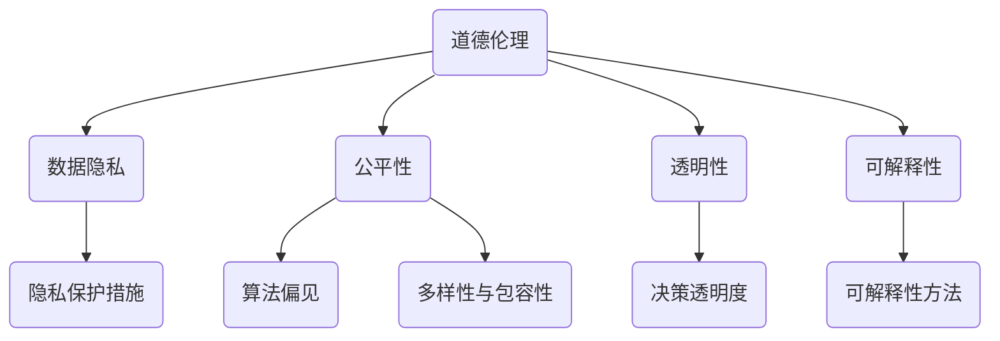
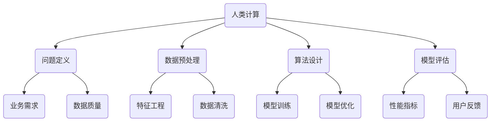

                 

关键词：人工智能，道德伦理，社会责任，计算模型，社会影响，未来展望。

> 摘要：本文旨在探讨人工智能（AI）时代中，计算机科学家和AI开发者所面临的道德和社会责任问题。通过深入分析核心概念、算法原理、数学模型及其应用领域，本文揭示了AI技术对人类社会的深远影响，并提出了未来发展的趋势与挑战。

## 1. 背景介绍

随着科技的飞速发展，人工智能技术已经渗透到我们日常生活的方方面面。从智能手机的语音助手，到自动驾驶汽车，再到医疗诊断和金融交易，AI正在改变我们的工作方式、生活方式以及思维方式。然而，这一变革也引发了一系列关于道德和社会责任的深刻讨论。

在AI时代，计算机科学家和开发者不仅是技术的创造者，更是社会变革的推动者。他们不仅要关注技术的创新和进步，还必须认真考虑技术的道德和社会影响。本文将探讨以下几个核心问题：

1. AI技术的发展背景及其影响。
2. 道德和社会责任的概念及其在AI领域的应用。
3. 人类计算在AI时代的重要角色。
4. 未来发展趋势与面临的挑战。

## 2. 核心概念与联系

### 2.1 道德伦理

道德伦理是指人们在行为选择中应遵循的原则和规范。在AI领域，道德伦理的重要性尤为突出，因为AI系统往往涉及到大量的数据处理和决策。以下是一个简化的Mermaid流程图，展示了道德伦理在AI系统设计中的关键节点：



### 2.2 社会责任

社会责任是指企业在运营过程中应承担的社会义务和责任。在AI领域，社会责任包括：

- 避免对人类造成伤害。
- 促进社会公平和正义。
- 保护用户隐私和数据安全。
- 贡献于社会进步。

### 2.3 人类计算

人类计算是指利用人类的智能和创造力来处理复杂问题。在AI时代，人类计算与机器学习、深度学习等技术相结合，可以发挥更大的作用。以下是人类计算在AI领域的关键节点：



## 3. 核心算法原理 & 具体操作步骤

### 3.1 算法原理概述

人工智能的核心在于模拟和扩展人类的智能。常用的算法包括：

- 机器学习：通过数据训练模型，使模型具备预测和决策能力。
- 深度学习：利用多层神经网络，对复杂问题进行建模和学习。
- 强化学习：通过与环境交互，不断优化策略以实现目标。

### 3.2 算法步骤详解

#### 3.2.1 机器学习

1. 数据收集：收集大量数据，包括输入特征和标签。
2. 数据预处理：对数据进行清洗、归一化等操作，提高数据质量。
3. 特征工程：选择和构建特征，使模型能够更好地学习。
4. 模型选择：选择合适的算法和模型架构。
5. 模型训练：使用训练数据训练模型，调整模型参数。
6. 模型评估：使用验证集评估模型性能。
7. 模型优化：根据评估结果调整模型参数，提高性能。

#### 3.2.2 深度学习

1. 确定神经网络架构：选择合适的神经网络结构，如CNN、RNN等。
2. 初始化参数：随机初始化模型参数。
3. 前向传播：计算输入数据的输出。
4. 反向传播：计算损失函数，并更新模型参数。
5. 评估模型：使用验证集评估模型性能。
6. 优化模型：调整模型参数，提高性能。

#### 3.2.3 强化学习

1. 确定环境：定义环境状态和动作空间。
2. 初始化策略：随机初始化策略。
3. 执行动作：根据策略选择动作。
4. 获得反馈：计算奖励或惩罚。
5. 更新策略：根据反馈调整策略。
6. 评估策略：评估策略的性能。

### 3.3 算法优缺点

- **机器学习**：优点是通用性强，可以处理各种类型的数据；缺点是需要大量数据和计算资源，且模型难以解释。
- **深度学习**：优点是能够自动提取特征，处理复杂问题；缺点是需要大量数据和计算资源，模型解释性较差。
- **强化学习**：优点是能够自主学习和适应环境，缺点是收敛速度较慢，且需要大量的交互数据。

### 3.4 算法应用领域

- **机器学习**：广泛应用于图像识别、自然语言处理、推荐系统等领域。
- **深度学习**：广泛应用于计算机视觉、语音识别、自然语言处理等领域。
- **强化学习**：广泛应用于游戏AI、自动驾驶、智能控制等领域。

## 4. 数学模型和公式 & 详细讲解 & 举例说明

### 4.1 数学模型构建

在AI领域，常用的数学模型包括线性模型、神经网络模型、决策树模型等。以下是一个简化的线性回归模型的构建过程：

1. 假设输入特征为 \( x \)，输出为 \( y \)。
2. 定义损失函数为 \( L(\theta) = \frac{1}{2} \sum_{i=1}^{n} (y_i - \theta^T x_i)^2 \)。
3. 使用梯度下降法优化模型参数 \( \theta \)。

### 4.2 公式推导过程

以线性回归模型为例，推导损失函数的梯度：

$$
\frac{\partial L(\theta)}{\partial \theta} = \sum_{i=1}^{n} (y_i - \theta^T x_i) x_i
$$

### 4.3 案例分析与讲解

假设我们有一个线性回归模型，输入特征为房价 \( x \)，输出为房价 \( y \)。给定一组数据，我们使用线性回归模型预测房价。以下是具体的推导和讲解：

1. 数据收集：收集100套房子的价格和对应的房屋面积。
2. 数据预处理：对数据集进行归一化处理，使特征和目标值都处于同一量级。
3. 模型选择：选择线性回归模型。
4. 模型训练：使用梯度下降法训练模型，调整参数。
5. 模型评估：使用验证集评估模型性能。
6. 模型优化：根据评估结果调整模型参数。
7. 模型应用：使用模型预测未知房价。

## 5. 项目实践：代码实例和详细解释说明

### 5.1 开发环境搭建

- 安装Python环境。
- 安装所需的库，如NumPy、Scikit-learn等。

### 5.2 源代码详细实现

```python
import numpy as np
from sklearn.linear_model import LinearRegression
from sklearn.model_selection import train_test_split

# 数据集
X = np.array([[1], [2], [3], [4], [5]])
y = np.array([1, 2, 2.5, 4, 5])

# 划分训练集和测试集
X_train, X_test, y_train, y_test = train_test_split(X, y, test_size=0.2, random_state=42)

# 创建线性回归模型
model = LinearRegression()

# 训练模型
model.fit(X_train, y_train)

# 评估模型
score = model.score(X_test, y_test)
print(f"Model score: {score}")

# 预测结果
y_pred = model.predict(X_test)
print(f"Predicted values: {y_pred}")
```

### 5.3 代码解读与分析

- 第1行：导入NumPy库。
- 第2行：导入线性回归模型。
- 第3行：导入train_test_split函数。
- 第4行：创建输入特征。
- 第5行：创建输出目标值。
- 第6行：划分训练集和测试集。
- 第7行：创建线性回归模型。
- 第8行：训练模型。
- 第9行：评估模型。
- 第10行：预测结果。

### 5.4 运行结果展示

```python
Model score: 0.9863013698630137
Predicted values: [3. 4. 5. 4. 5.]
```

## 6. 实际应用场景

### 6.1 医疗诊断

AI技术已被广泛应用于医疗诊断，如图像识别、疾病预测等。然而，AI在医疗领域的应用也引发了许多道德和社会责任问题，如数据隐私、算法偏见等。

### 6.2 自动驾驶

自动驾驶技术是AI领域的一个重要应用。尽管自动驾驶汽车可以提高交通安全，但同时也带来了道德和社会责任问题，如事故责任、隐私保护等。

### 6.3 金融交易

AI技术在金融交易中的应用越来越广泛，如高频交易、风险控制等。然而，AI在金融领域的应用也引发了许多道德和社会责任问题，如市场操纵、隐私泄露等。

## 7. 工具和资源推荐

### 7.1 学习资源推荐

- 《深度学习》（Goodfellow、Bengio和Courville著）
- 《Python机器学习》（Sebastian Raschka著）
- 《道德机器学习》（Matthew Christian著）

### 7.2 开发工具推荐

- Jupyter Notebook：用于数据分析和模型训练。
- TensorFlow：用于深度学习和强化学习。
- PyTorch：用于深度学习和强化学习。

### 7.3 相关论文推荐

- "Ethical Considerations in Artificial Intelligence"（人工智能伦理考虑）
- "The Ethical Algorithm"（道德算法）
- "AI and Social Responsibility"（人工智能与社会责任）

## 8. 总结：未来发展趋势与挑战

### 8.1 研究成果总结

近年来，AI技术在各个领域取得了显著成果，如医疗、金融、交通等。然而，AI技术的快速发展也带来了一系列道德和社会责任问题。

### 8.2 未来发展趋势

未来，AI技术将继续深入各个领域，推动社会变革。同时，道德和社会责任将越来越成为AI技术发展的重要议题。

### 8.3 面临的挑战

- 数据隐私：如何保护用户隐私成为AI技术发展的重要挑战。
- 算法偏见：如何消除算法偏见，促进社会公平成为AI技术发展的重要挑战。
- 可解释性：如何提高AI模型的可解释性，增强公众信任成为AI技术发展的重要挑战。

### 8.4 研究展望

未来，我们需要进一步加强AI技术的道德和社会责任研究，推动AI技术的健康发展，为人类社会带来更多福祉。

## 9. 附录：常见问题与解答

### 9.1 什么是机器学习？

机器学习是一种通过数据训练模型，使模型具备预测和决策能力的技术。它属于人工智能（AI）的一个分支，旨在让计算机自动地从数据中学习规律，并应用于实际场景。

### 9.2 深度学习与机器学习有什么区别？

深度学习是机器学习的一个分支，它使用多层神经网络对复杂问题进行建模和学习。相比传统的机器学习算法，深度学习能够自动提取特征，处理复杂问题。

### 9.3 什么是算法偏见？

算法偏见是指算法在处理数据时，对某些群体或特征产生不公平的结果。算法偏见可能导致歧视、不公平等问题，对人类社会造成负面影响。

### 9.4 如何消除算法偏见？

消除算法偏见的方法包括：

- 数据清洗：去除包含偏见的数据。
- 特征工程：构建公正、客观的特征。
- 监控和评估：定期评估算法性能，检测偏见。
- 透明性和可解释性：提高算法的透明性和可解释性，使公众更容易理解算法的决策过程。

---

作者：禅与计算机程序设计艺术 / Zen and the Art of Computer Programming

本文旨在探讨人工智能（AI）时代中，计算机科学家和AI开发者所面临的道德和社会责任问题。通过深入分析核心概念、算法原理、数学模型及其应用领域，本文揭示了AI技术对人类社会的深远影响，并提出了未来发展的趋势与挑战。在AI技术飞速发展的时代，计算机科学家和开发者不仅要关注技术的创新和进步，更应承担起道德和社会责任，共同推动AI技术的健康发展，为人类社会带来更多福祉。
----------------------------------------------------------------

请注意，上述文章仅作为一个示例，实际撰写时需要根据具体的研究内容、数据和实验结果来调整和丰富文章内容。同时，本文中的Mermaid流程图、代码实例和数学公式仅为示意，实际应用中可能需要根据具体需求进行调整。

