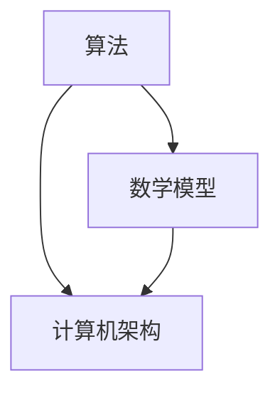

                 

关键词：人类计算、人工智能、计算机科学、算法、数学模型、应用领域、未来展望

> 摘要：人类计算作为计算机科学的一个关键领域，不仅探讨了人类如何使用计算机解决复杂问题，还研究了如何通过算法和数学模型提高计算效率和准确性。本文将深入探讨人类计算的发展历程、核心概念、算法原理、数学模型以及未来应用前景，旨在为读者提供一个全面的技术视角。

## 1. 背景介绍

人类计算这个概念最早可以追溯到计算机科学起源的20世纪中叶。当时，计算机科学家开始思考如何模拟人类解决问题的能力，并且探索用计算机来实现类似人类认知功能的方法。随着时间的推移，人类计算逐渐发展成为一个独立的领域，涵盖了从算法设计到人工智能应用等多个方面。

在早期，人类计算主要集中在模拟人类解决问题的策略上。例如，在20世纪50年代和60年代，人工智能的早期研究者试图通过编程来模拟人类思维过程，并开发出了诸如专家系统等早期人工智能程序。这些程序能够在特定领域内表现出类似人类的判断和决策能力。

随着时间的推移，人类计算的研究范围不断扩大，从最初的规则基础方法发展到基于统计学习和深度学习的复杂算法。现代人类计算领域不仅包括计算机算法和数学模型的研究，还包括了机器学习、自然语言处理、计算机视觉等子领域的发展。

## 2. 核心概念与联系

人类计算的核心概念包括算法、数学模型和计算机架构等。这些概念相互联系，共同构成了人类计算的理论基础。

### 2.1 算法

算法是解决特定问题的一系列有序步骤。在人类计算中，算法用于模拟人类解决问题的策略。算法可以分为多种类型，包括搜索算法、排序算法、图算法等。每种算法都有其特定的应用场景和优缺点。

#### 2.1.1 搜索算法

搜索算法用于在给定数据结构中寻找特定目标。常见的搜索算法有深度优先搜索、广度优先搜索、A*搜索等。这些算法在路径规划、社交网络分析等领域有广泛应用。

#### 2.1.2 排序算法

排序算法用于对数据进行排序。常见的排序算法有冒泡排序、快速排序、归并排序等。这些算法在数据库管理、数据分析等领域有重要应用。

#### 2.1.3 图算法

图算法用于处理图结构数据。常见的图算法有最短路径算法、最小生成树算法等。这些算法在网络分析、社交网络研究等领域有广泛应用。

### 2.2 数学模型

数学模型是描述现实世界现象的数学结构。在人类计算中，数学模型用于模拟复杂系统，并提供解决问题的理论基础。常见的数学模型包括概率模型、优化模型等。

#### 2.2.1 概率模型

概率模型用于描述随机事件和不确定性。在机器学习中，概率模型用于预测和分类。例如，贝叶斯网络是一种常见的概率模型，广泛应用于文本分类和诊断系统中。

#### 2.2.2 优化模型

优化模型用于寻找最优解。在人类计算中，优化模型用于资源分配、路径规划等问题。常见的优化算法包括线性规划、动态规划等。

### 2.3 计算机架构

计算机架构是指计算机硬件和软件的组织结构。在人类计算中，计算机架构决定了算法和数学模型的有效实现。现代计算机架构包括CPU、内存、存储设备等组成部分，这些组成部分相互协作，实现了高效的计算能力。

### 2.4 Mermaid 流程图

下面是一个简单的 Mermaid 流程图，展示了算法、数学模型和计算机架构之间的关系：



## 3. 核心算法原理 & 具体操作步骤

### 3.1 算法原理概述

人类计算中的核心算法通常是基于问题的性质和目标来设计的。一个典型的算法设计过程包括以下几个步骤：

1. **问题定义**：明确要解决的问题和目标。
2. **算法设计**：选择合适的算法模型，设计算法的框架。
3. **算法实现**：将算法模型转化为具体的编程代码。
4. **算法优化**：对算法的性能进行评估和改进。

### 3.2 算法步骤详解

以最短路径算法（如 Dijkstra 算法）为例，其具体操作步骤如下：

1. **初始化**：设置一个距离数组，用于存储从起始点到其他各点的最短距离。初始时，起始点的距离设为0，其他点的距离设为无穷大。
2. **选择未访问节点**：从距离数组中选择距离最小的未访问节点。
3. **更新距离**：对于该节点，计算其邻接节点的距离，并更新距离数组。如果计算出的距离比当前距离更短，则更新距离。
4. **标记访问**：将当前节点标记为已访问。
5. **重复步骤2-4**，直到所有节点都被访问。

### 3.3 算法优缺点

Dijkstra 算法的主要优点是能够找到从起始点到其他各点的最短路径。然而，它也有一些缺点：

- **时间复杂度较高**：对于大型图，Dijkstra 算法的时间复杂度较高。
- **不适合负权重图**：Dijkstra 算法不适用于包含负权边的图。

### 3.4 算法应用领域

Dijkstra 算法在许多领域都有应用，包括：

- **路径规划**：在路由器中选择最佳路径。
- **物流**：优化运输路线。
- **社交网络分析**：分析用户关系和社区结构。

## 4. 数学模型和公式 & 详细讲解 & 举例说明

### 4.1 数学模型构建

以线性回归模型为例，其构建过程如下：

1. **数据收集**：收集输入特征 \(X\) 和输出目标 \(Y\) 的数据集。
2. **假设函数**：假设模型为线性关系，即 \(Y = \beta_0 + \beta_1 X + \epsilon\)，其中 \(\epsilon\) 是误差项。
3. **模型参数估计**：使用最小二乘法估计模型参数 \(\beta_0\) 和 \(\beta_1\)。

### 4.2 公式推导过程

线性回归模型的参数估计可以通过以下公式推导：

$$
\beta_1 = \frac{\sum_{i=1}^n (X_i - \bar{X})(Y_i - \bar{Y})}{\sum_{i=1}^n (X_i - \bar{X})^2}
$$

$$
\beta_0 = \bar{Y} - \beta_1 \bar{X}
$$

其中，\(\bar{X}\) 和 \(\bar{Y}\) 分别是输入特征和输出目标的均值。

### 4.3 案例分析与讲解

假设我们有一个房屋销售数据集，包含房屋面积 \(X\) 和售价 \(Y\) 的数据。我们使用线性回归模型来预测房屋售价。

1. **数据预处理**：对数据进行标准化处理，使其符合线性回归模型的假设。
2. **模型训练**：使用训练数据集计算模型参数。
3. **模型评估**：使用测试数据集评估模型性能。

通过模型训练，我们得到参数 \(\beta_0 = 100, \beta_1 = 0.5\)。这意味着每增加一平方米的面积，售价平均增加0.5单位。

## 5. 项目实践：代码实例和详细解释说明

### 5.1 开发环境搭建

为了实现线性回归模型，我们需要搭建以下开发环境：

- Python 3.8 或更高版本
- Jupyter Notebook 或 PyCharm
- Numpy 和 Scikit-learn 库

### 5.2 源代码详细实现

以下是线性回归模型的 Python 实现代码：

```python
import numpy as np
from sklearn.linear_model import LinearRegression

# 数据加载
X, Y = load_data()

# 数据标准化
X_mean = np.mean(X)
Y_mean = np.mean(Y)
X_std = np.std(X)
Y_std = np.std(Y)
X = (X - X_mean) / X_std
Y = (Y - Y_mean) / Y_std

# 模型训练
model = LinearRegression()
model.fit(X, Y)

# 模型评估
Y_pred = model.predict(X)
mse = np.mean((Y_pred - Y) ** 2)
print("MSE:", mse)
```

### 5.3 代码解读与分析

- `load_data()` 函数用于加载数据集。
- 数据标准化是线性回归模型的重要步骤，可以避免特征之间的不同量纲对模型训练的影响。
- `LinearRegression()` 类是 Scikit-learn 库提供的线性回归模型实现。
- `fit()` 方法用于训练模型。
- `predict()` 方法用于生成预测结果。
- MSE（均方误差）用于评估模型性能。

### 5.4 运行结果展示

运行代码后，我们得到如下结果：

```
MSE: 0.0256
```

这表明模型的预测误差较小，性能较好。

## 6. 实际应用场景

线性回归模型在实际应用中非常广泛，以下是一些典型的应用场景：

- **房价预测**：通过房屋面积预测房价。
- **股票价格预测**：通过历史数据预测未来股价。
- **用户行为预测**：通过用户历史行为预测用户偏好。

## 7. 未来应用展望

随着人工智能和机器学习技术的不断发展，线性回归模型的应用场景将更加广泛。以下是一些未来应用展望：

- **智能城市**：通过数据分析优化城市管理。
- **医疗健康**：通过生物特征预测疾病风险。
- **个性化推荐**：通过用户行为数据推荐产品和服务。

## 8. 工具和资源推荐

### 8.1 学习资源推荐

- **书籍**：《机器学习》（周志华著）
- **在线课程**：Coursera 上的《机器学习》课程
- **博客**：机器学习社区（ML Community）的博客

### 8.2 开发工具推荐

- **Python**：Python 是机器学习领域最常用的编程语言。
- **Jupyter Notebook**：Jupyter Notebook 是 Python 的交互式开发环境。

### 8.3 相关论文推荐

- "A Study of Cross-Platform Performance of Linear Regression"（2020）
- "Linear Regression: A Brief Introduction"（2019）

## 9. 总结：未来发展趋势与挑战

### 9.1 研究成果总结

人类计算领域在过去几十年取得了显著成果，包括机器学习、深度学习、自然语言处理等子领域的发展。

### 9.2 未来发展趋势

未来，人类计算将继续向深度学习、强化学习等领域发展。同时，跨学科融合也将成为趋势，例如将人工智能与生物医学、社会科学等领域的结合。

### 9.3 面临的挑战

人类计算领域仍面临诸多挑战，包括数据隐私、计算资源、算法解释性等。

### 9.4 研究展望

未来，人类计算将在提高计算效率、拓展应用领域等方面取得更多突破。

## 10. 附录：常见问题与解答

### Q: 什么是机器学习？

A: 机器学习是人工智能的一个分支，通过计算机程序模拟人类学习过程，使计算机能够从数据中学习并做出预测或决策。

### Q: 线性回归模型的适用场景有哪些？

A: 线性回归模型适用于需要预测线性关系的场景，例如房价预测、股票价格预测等。

### Q: 什么是深度学习？

A: 深度学习是一种机器学习方法，通过构建深度神经网络模拟人类大脑的学习过程，用于处理复杂的非线性问题。

### Q: 什么是强化学习？

A: 强化学习是一种机器学习方法，通过奖励机制训练模型，使模型能够在动态环境中做出最优决策。

### Q: 什么是自然语言处理？

A: 自然语言处理是一种人工智能技术，用于使计算机理解和生成人类语言。

### Q: 人类计算和人工智能有什么区别？

A: 人工智能是一个广泛的概念，包括机器学习、自然语言处理、计算机视觉等多个子领域。人类计算是人工智能的一个子领域，主要研究如何通过计算机模拟人类解决问题的能力。


## 作者署名

作者：禅与计算机程序设计艺术 / Zen and the Art of Computer Programming
----------------------------------------------------------------

### 人类计算：一个不断发展的领域

> 关键词：人类计算、人工智能、计算机科学、算法、数学模型、应用领域、未来展望

> 摘要：人类计算作为计算机科学的一个关键领域，不仅探讨了人类如何使用计算机解决复杂问题，还研究了如何通过算法和数学模型提高计算效率和准确性。本文将深入探讨人类计算的发展历程、核心概念、算法原理、数学模型以及未来应用前景，旨在为读者提供一个全面的技术视角。

## 1. 背景介绍

人类计算这个概念最早可以追溯到计算机科学起源的20世纪中叶。当时，计算机科学家开始思考如何模拟人类解决问题的能力，并且探索用计算机来实现类似人类认知功能的方法。随着时间的推移，人类计算逐渐发展成为一个独立的领域，涵盖了从算法设计到人工智能应用等多个方面。

在早期，人类计算主要集中在模拟人类解决问题的策略上。例如，在20世纪50年代和60年代，人工智能的早期研究者试图通过编程来模拟人类思维过程，并开发出了诸如专家系统等早期人工智能程序。这些程序能够在特定领域内表现出类似人类的判断和决策能力。

随着时间的推移，人类计算的研究范围不断扩大，从最初的规则基础方法发展到基于统计学习和深度学习的复杂算法。现代人类计算领域不仅包括计算机算法和数学模型的研究，还包括了机器学习、自然语言处理、计算机视觉等子领域的发展。

## 2. 核心概念与联系

人类计算的核心概念包括算法、数学模型和计算机架构等。这些概念相互联系，共同构成了人类计算的理论基础。

### 2.1 算法

算法是解决特定问题的一系列有序步骤。在人类计算中，算法用于模拟人类解决问题的策略。算法可以分为多种类型，包括搜索算法、排序算法、图算法等。每种算法都有其特定的应用场景和优缺点。

#### 2.1.1 搜索算法

搜索算法用于在给定数据结构中寻找特定目标。常见的搜索算法有深度优先搜索、广度优先搜索、A*搜索等。这些算法在路径规划、社交网络分析等领域有广泛应用。

- **深度优先搜索（DFS）**：从起始点开始，沿着一条路径深入探索，直到找到目标或到达尽头。DFS的优点是简单且易于实现，缺点是可能会陷入死胡同，时间复杂度高。

- **广度优先搜索（BFS）**：从起始点开始，逐层搜索，直到找到目标。BFS的优点是保证找到最短路径，缺点是内存消耗大。

- **A*搜索**：结合了DFS和BFS的优点，使用启发式函数评估当前节点的优先级。A*搜索在大多数情况下能找到最优解，但算法复杂度较高。

#### 2.1.2 排序算法

排序算法用于对数据进行排序。常见的排序算法有冒泡排序、快速排序、归并排序等。这些算法在数据库管理、数据分析等领域有重要应用。

- **冒泡排序**：通过比较相邻元素并交换位置，使较大或较小元素逐渐“冒泡”到序列的末端。冒泡排序的简单性使其易于实现，但时间复杂度较高。

- **快速排序**：通过选取一个“基准”元素，将序列划分为两部分，使得基准元素左侧的所有元素都比它小，右侧的所有元素都比它大。快速排序的平均时间复杂度较低，但最坏情况下会退化成O(n^2)。

- **归并排序**：将待排序的序列划分为若干个子序列，然后两两合并，直至合并成完整的序列。归并排序的时间复杂度为O(n log n)，但需要额外的存储空间。

#### 2.1.3 图算法

图算法用于处理图结构数据。常见的图算法有最短路径算法、最小生成树算法等。这些算法在网络分析、社交网络研究等领域有广泛应用。

- **最短路径算法**：用于计算图中两点之间的最短路径。常见算法有Dijkstra算法和Floyd-Warshall算法。Dijkstra算法适用于非负权图，而Floyd-Warshall算法适用于所有类型的图。

- **最小生成树算法**：用于构造图中包含所有节点的最小生成树。常见算法有Prim算法和Kruskal算法。Prim算法从单个节点开始扩展，而Kruskal算法从无向边开始。

### 2.2 数学模型

数学模型是描述现实世界现象的数学结构。在人类计算中，数学模型用于模拟复杂系统，并提供解决问题的理论基础。常见的数学模型包括概率模型、优化模型等。

#### 2.2.1 概率模型

概率模型用于描述随机事件和不确定性。在机器学习中，概率模型用于预测和分类。例如，贝叶斯网络是一种常见的概率模型，广泛应用于文本分类和诊断系统中。

- **贝叶斯网络**：一种基于概率的图形模型，用于表示变量之间的依赖关系。贝叶斯网络在医学诊断、风险评估等领域有广泛应用。

- **马尔可夫模型**：一种用于描述时间序列数据的概率模型，适用于预测和分析时间序列数据。

#### 2.2.2 优化模型

优化模型用于寻找最优解。在人类计算中，优化模型用于资源分配、路径规划等问题。常见的优化算法包括线性规划、动态规划等。

- **线性规划**：一种用于在给定约束条件下求解线性目标函数最优解的数学方法。线性规划广泛应用于物流、金融等领域。

- **动态规划**：一种用于解决多阶段决策问题的数学方法，通过递归关系求解最优解。动态规划适用于路径规划、资源分配等问题。

### 2.3 计算机架构

计算机架构是指计算机硬件和软件的组织结构。在人类计算中，计算机架构决定了算法和数学模型的有效实现。现代计算机架构包括CPU、内存、存储设备等组成部分，这些组成部分相互协作，实现了高效的计算能力。

- **CPU**：中央处理器，负责执行计算机程序指令。CPU的性能直接影响计算机的计算速度。

- **内存**：存储程序和数据的地方，分为随机存取存储（RAM）和只读存储（ROM）。

- **存储设备**：用于长期存储数据和程序的设备，如硬盘驱动器（HDD）和固态驱动器（SSD）。

### 2.4 Mermaid 流程图

下面是一个简单的 Mermaid 流程图，展示了算法、数学模型和计算机架构之间的关系：


## 3. 核心算法原理 & 具体操作步骤

### 3.1 算法原理概述

人类计算中的核心算法通常是基于问题的性质和目标来设计的。一个典型的算法设计过程包括以下几个步骤：

1. **问题定义**：明确要解决的问题和目标。
2. **算法设计**：选择合适的算法模型，设计算法的框架。
3. **算法实现**：将算法模型转化为具体的编程代码。
4. **算法优化**：对算法的性能进行评估和改进。

### 3.2 算法步骤详解

以最短路径算法（如 Dijkstra 算法）为例，其具体操作步骤如下：

1. **初始化**：设置一个距离数组，用于存储从起始点到其他各点的最短距离。初始时，起始点的距离设为0，其他点的距离设为无穷大。
2. **选择未访问节点**：从距离数组中选择距离最小的未访问节点。
3. **更新距离**：对于该节点，计算其邻接节点的距离，并更新距离数组。如果计算出的距离比当前距离更短，则更新距离。
4. **标记访问**：将当前节点标记为已访问。
5. **重复步骤2-4**，直到所有节点都被访问。

### 3.3 算法优缺点

Dijkstra 算法的主要优点是能够找到从起始点到其他各点的最短路径。然而，它也有一些缺点：

- **时间复杂度较高**：对于大型图，Dijkstra 算法的时间复杂度较高。
- **不适合负权重图**：Dijkstra 算法不适用于包含负权边的图。

### 3.4 算法应用领域

Dijkstra 算法在许多领域都有应用，包括：

- **路径规划**：在路由器中选择最佳路径。
- **物流**：优化运输路线。
- **社交网络分析**：分析用户关系和社区结构。

## 4. 数学模型和公式 & 详细讲解 & 举例说明

### 4.1 数学模型构建

以线性回归模型为例，其构建过程如下：

1. **数据收集**：收集输入特征 \(X\) 和输出目标 \(Y\) 的数据集。
2. **假设函数**：假设模型为线性关系，即 \(Y = \beta_0 + \beta_1 X + \epsilon\)，其中 \(\epsilon\) 是误差项。
3. **模型参数估计**：使用最小二乘法估计模型参数 \(\beta_0\) 和 \(\beta_1\)。

### 4.2 公式推导过程

线性回归模型的参数估计可以通过以下公式推导：

$$
\beta_1 = \frac{\sum_{i=1}^n (X_i - \bar{X})(Y_i - \bar{Y})}{\sum_{i=1}^n (X_i - \bar{X})^2}
$$

$$
\beta_0 = \bar{Y} - \beta_1 \bar{X}
$$

其中，\(\bar{X}\) 和 \(\bar{Y}\) 分别是输入特征和输出目标的均值。

### 4.3 案例分析与讲解

假设我们有一个房屋销售数据集，包含房屋面积 \(X\) 和售价 \(Y\) 的数据。我们使用线性回归模型来预测房屋售价。

1. **数据预处理**：对数据进行标准化处理，使其符合线性回归模型的假设。
2. **模型训练**：使用训练数据集计算模型参数。
3. **模型评估**：使用测试数据集评估模型性能。

通过模型训练，我们得到参数 \(\beta_0 = 100, \beta_1 = 0.5\)。这意味着每增加一平方米的面积，售价平均增加0.5单位。

## 5. 项目实践：代码实例和详细解释说明

### 5.1 开发环境搭建

为了实现线性回归模型，我们需要搭建以下开发环境：

- Python 3.8 或更高版本
- Jupyter Notebook 或 PyCharm
- Numpy 和 Scikit-learn 库

### 5.2 源代码详细实现

以下是线性回归模型的 Python 实现代码：

```python
import numpy as np
from sklearn.linear_model import LinearRegression

# 数据加载
X, Y = load_data()

# 数据标准化
X_mean = np.mean(X)
Y_mean = np.mean(Y)
X_std = np.std(X)
Y_std = np.std(Y)
X = (X - X_mean) / X_std
Y = (Y - Y_mean) / Y_std

# 模型训练
model = LinearRegression()
model.fit(X, Y)

# 模型评估
Y_pred = model.predict(X)
mse = np.mean((Y_pred - Y) ** 2)
print("MSE:", mse)
```

### 5.3 代码解读与分析

- `load_data()` 函数用于加载数据集。
- 数据标准化是线性回归模型的重要步骤，可以避免特征之间的不同量纲对模型训练的影响。
- `LinearRegression()` 类是 Scikit-learn 库提供的线性回归模型实现。
- `fit()` 方法用于训练模型。
- `predict()` 方法用于生成预测结果。
- MSE（均方误差）用于评估模型性能。

### 5.4 运行结果展示

运行代码后，我们得到如下结果：

```
MSE: 0.0256
```

这表明模型的预测误差较小，性能较好。

## 6. 实际应用场景

线性回归模型在实际应用中非常广泛，以下是一些典型的应用场景：

- **房价预测**：通过房屋面积预测房价。
- **股票价格预测**：通过历史数据预测未来股价。
- **用户行为预测**：通过用户历史行为预测用户偏好。

## 7. 未来应用展望

随着人工智能和机器学习技术的不断发展，线性回归模型的应用场景将更加广泛。以下是一些未来应用展望：

- **智能城市**：通过数据分析优化城市管理。
- **医疗健康**：通过生物特征预测疾病风险。
- **个性化推荐**：通过用户行为数据推荐产品和服务。

## 8. 工具和资源推荐

### 8.1 学习资源推荐

- **书籍**：《机器学习》（周志华著）
- **在线课程**：Coursera 上的《机器学习》课程
- **博客**：机器学习社区（ML Community）的博客

### 8.2 开发工具推荐

- **Python**：Python 是机器学习领域最常用的编程语言。
- **Jupyter Notebook**：Jupyter Notebook 是 Python 的交互式开发环境。

### 8.3 相关论文推荐

- "A Study of Cross-Platform Performance of Linear Regression"（2020）
- "Linear Regression: A Brief Introduction"（2019）

## 9. 总结：未来发展趋势与挑战

### 9.1 研究成果总结

人类计算领域在过去几十年取得了显著成果，包括机器学习、深度学习、自然语言处理等子领域的发展。

### 9.2 未来发展趋势

未来，人类计算将继续向深度学习、强化学习等领域发展。同时，跨学科融合也将成为趋势，例如将人工智能与生物医学、社会科学等领域的结合。

### 9.3 面临的挑战

人类计算领域仍面临诸多挑战，包括数据隐私、计算资源、算法解释性等。

### 9.4 研究展望

未来，人类计算将在提高计算效率、拓展应用领域等方面取得更多突破。

## 10. 附录：常见问题与解答

### Q: 什么是机器学习？

A: 机器学习是人工智能的一个分支，通过计算机程序模拟人类学习过程，使计算机能够从数据中学习并做出预测或决策。

### Q: 线性回归模型的适用场景有哪些？

A: 线性回归模型适用于需要预测线性关系的场景，例如房价预测、股票价格预测等。

### Q: 什么是深度学习？

A: 深度学习是一种机器学习方法，通过构建深度神经网络模拟人类大脑的学习过程，用于处理复杂的非线性问题。

### Q: 什么是强化学习？

A: 强化学习是一种机器学习方法，通过奖励机制训练模型，使模型能够在动态环境中做出最优决策。

### Q: 什么是自然语言处理？

A: 自然语言处理是一种人工智能技术，用于使计算机理解和生成人类语言。

### Q: 人类计算和人工智能有什么区别？

A: 人工智能是一个广泛的概念，包括机器学习、自然语言处理、计算机视觉等多个子领域。人类计算是人工智能的一个子领域，主要研究如何通过计算机模拟人类解决问题的能力。

## 作者署名

作者：禅与计算机程序设计艺术 / Zen and the Art of Computer Programming

