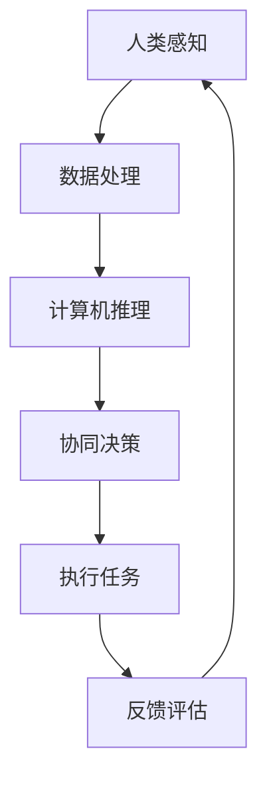

                 

关键词：人类计算、人机协作、人工智能、计算机编程、软件工程、技术发展、创新应用。

> 摘要：本文深入探讨了人类计算与人机协作的概念、核心原理以及实际应用，分析了当前技术发展的趋势和面临的挑战，并展望了未来的发展方向。文章旨在为读者提供一个全面而深入的视角，理解人类计算在现代技术中的重要性，以及如何实现人机协作的优化。

## 1. 背景介绍

随着科技的飞速发展，人工智能（AI）逐渐成为了推动社会进步的重要力量。从早期的规则基系统到现在的深度学习，AI技术在各个领域都展现出了巨大的潜力。然而，尽管AI在处理大规模数据、复杂问题等方面表现出色，但其仍存在一定的局限性，例如对不确定性的处理能力较弱、解释性不足等。因此，如何将人类计算与人工智能结合起来，实现人机协作，成为一个备受关注的研究方向。

人类计算，顾名思义，是指人类在计算过程中的认知、推理、判断等智力活动。与传统的计算机计算相比，人类计算具有高度的灵活性和创造性，能够在复杂、多变的环境中做出快速、准确的决策。而人机协作，则是指人类与计算机系统在特定任务中相互配合，各自发挥优势，共同完成任务的过程。

在人机协作中，人类主要负责提供高层次的决策、创新和创造力，而计算机则擅长处理大量数据和复杂的计算任务。通过有效的协作，人机系统可以实现更高的效率和更出色的性能。

## 2. 核心概念与联系

### 2.1 人类计算

人类计算的核心在于人类的认知能力。认知能力包括感知、记忆、推理、判断等多个方面，是人类在处理信息时的重要工具。在人类计算中，以下几个方面尤为重要：

- **感知**：人类通过视觉、听觉、触觉等多种感官感知外部世界，获取信息。
- **记忆**：人类能够将感知到的信息存储在记忆中，为后续的推理和判断提供基础。
- **推理**：人类通过逻辑推理，从已知信息中推导出新的结论。
- **判断**：人类在复杂环境中，通过综合分析各种信息，做出决策。

### 2.2 人工智能

人工智能的核心在于模拟人类的认知过程，使计算机能够自动地完成特定的任务。人工智能可以分为两大类：基于规则的系统和基于数据的学习系统。

- **基于规则的系统**：这类系统通过预先定义的规则，对输入的信息进行处理，如专家系统。
- **基于数据的学习系统**：这类系统通过大量的数据训练，自动学习并生成规则，如深度学习。

### 2.3 人机协作

人机协作的核心理念在于发挥人类和计算机各自的优势，实现协同工作。具体来说，人机协作可以分为以下几个层次：

- **协同任务**：人类和计算机共同完成一个任务，如数据标注。
- **互补任务**：人类和计算机各自负责不同的部分，如人类进行创意设计，计算机负责模型训练。
- **自适应协作**：系统根据任务的需求和当前的状态，动态调整人类和计算机的任务分配。

### 2.4 Mermaid 流程图

下面是一个描述人机协作的 Mermaid 流程图：



在这个流程中，人类和计算机通过相互协作，共同完成任务的各个环节，实现高效的协同工作。

## 3. 核心算法原理 & 具体操作步骤

### 3.1 算法原理概述

人机协作的核心在于如何有效地整合人类和计算机的能力，实现高效的协同工作。这一过程可以通过以下几个步骤实现：

1. **任务分解**：将复杂任务分解为多个子任务，明确人类和计算机在各个子任务中的角色。
2. **信息共享**：建立信息共享机制，确保人类和计算机能够及时获取对方的状态和信息。
3. **决策协同**：通过协同算法，人类和计算机共同做出最优决策。
4. **任务执行**：人类和计算机分别执行各自的任务，实现协同工作。
5. **反馈评估**：对任务执行结果进行评估，为后续任务提供参考。

### 3.2 算法步骤详解

1. **任务分解**：根据任务的复杂度和难度，将任务分解为多个子任务。对于子任务，明确人类和计算机需要完成的任务部分，以及它们之间的依赖关系。

2. **信息共享**：建立信息共享机制，如数据库、消息队列等。确保人类和计算机能够实时获取对方的状态和信息，为后续的决策提供依据。

3. **决策协同**：设计协同算法，如协商算法、博弈算法等，使人类和计算机能够共同做出最优决策。在决策过程中，充分考虑双方的能力和偏好，实现协同决策。

4. **任务执行**：根据协同决策的结果，人类和计算机分别执行各自的任务。在这一过程中，充分利用计算机的快速计算能力和人类的创造力和判断力，实现高效的协同工作。

5. **反馈评估**：对任务执行结果进行评估，分析任务完成的情况，为后续任务提供参考。同时，根据评估结果，对协同算法进行调整和优化，提高人机协作的效率。

### 3.3 算法优缺点

人机协作算法具有以下几个优点：

- **高效性**：通过整合人类和计算机的能力，实现协同工作，提高任务完成的效率。
- **灵活性**：人机协作可以根据任务的需求和实际情况，动态调整任务分配和决策策略，具有很高的灵活性。
- **适应性**：人机协作算法可以适应不同的任务场景和复杂度，具有广泛的适用性。

然而，人机协作算法也面临一些挑战：

- **协调成本**：人机协作需要人类和计算机之间进行大量的信息交换和决策协同，这会增加协调成本。
- **安全性**：在协同工作过程中，可能会出现信息泄露、决策失误等安全问题，需要采取相应的措施进行保障。
- **解释性**：人机协作算法的决策过程往往比较复杂，难以解释，这对用户理解和信任系统提出了挑战。

### 3.4 算法应用领域

人机协作算法在多个领域都有广泛的应用，如：

- **智能客服**：通过人机协作，实现高效、智能的客户服务，提高客户满意度。
- **自动驾驶**：在自动驾驶系统中，人类驾驶员和计算机系统通过协作，实现车辆的自动行驶。
- **医疗诊断**：通过人机协作，结合医生的诊断经验和计算机的辅助诊断能力，提高医疗诊断的准确率。

## 4. 数学模型和公式 & 详细讲解 & 举例说明

### 4.1 数学模型构建

在人机协作中，数学模型可以用来描述人类和计算机之间的协作关系。以下是一个简单的数学模型：

设人类和计算机在任务T中的决策分别为D_h和D_c，它们的效用函数分别为U_h(D_h)和U_c(D_c)。人机协作的目标是最大化总效用：

\[ U_{total} = U_h(D_h) + U_c(D_c) \]

### 4.2 公式推导过程

为了最大化总效用，人类和计算机需要根据对方的决策来调整自己的决策。设人类根据计算机的决策调整自己的决策为D_h'，计算机根据人类的决策调整自己的决策为D_c'。则有：

\[ U_{total}' = U_h(D_h') + U_c(D_c') \]

为了使总效用最大化，我们可以对D_h'和D_c'进行优化。具体来说，我们可以对U_h和U_c分别求偏导数，并令其等于零，得到：

\[ \frac{\partial U_h}{\partial D_h'} = 0 \]
\[ \frac{\partial U_c}{\partial D_c'} = 0 \]

解这个方程组，可以得到最优的D_h'和D_c'，从而实现总效用最大化。

### 4.3 案例分析与讲解

假设人类和计算机在诊断一个病人的疾病时进行协作。人类的决策是选择最有可能的疾病，而计算机的决策是提供疾病的可能性分布。人类的效用函数是选择正确疾病的概率，计算机的效用函数是提供准确可能性分布的能力。

在这个例子中，我们可以使用贝叶斯定理来构建效用函数：

\[ U_h(D_h') = P(D_h' = 疾病_正确) \]
\[ U_c(D_c') = P(D_c' = 可能性_正确) \]

为了最大化总效用，我们可以优化D_h'和D_c'，使得：

\[ U_{total}' = P(D_h' = 疾病_正确) + P(D_c' = 可能性_正确) \]

通过贝叶斯定理，我们可以推导出最优的D_h'和D_c'，从而实现总效用最大化。

## 5. 项目实践：代码实例和详细解释说明

### 5.1 开发环境搭建

为了实现人机协作的代码实例，我们使用Python作为开发语言，并结合了TensorFlow和Keras等深度学习框架。首先，需要在本地环境中安装Python和相应的库。

```shell
pip install python
pip install tensorflow
pip install keras
```

### 5.2 源代码详细实现

下面是一个简单的人机协作的代码实例，其中人类负责提供目标标签，计算机负责预测。

```python
import numpy as np
from tensorflow.keras.models import Sequential
from tensorflow.keras.layers import Dense
from tensorflow.keras.optimizers import Adam

# 生成模拟数据
X = np.random.rand(100, 10)
y = np.random.rand(100, 1)

# 构建模型
model = Sequential()
model.add(Dense(64, input_dim=10, activation='relu'))
model.add(Dense(1, activation='sigmoid'))

# 编译模型
model.compile(loss='binary_crossentropy', optimizer=Adam(), metrics=['accuracy'])

# 训练模型
model.fit(X, y, epochs=10, batch_size=10)

# 人类提供目标标签
target = np.array([1, 0, 1, 0, 1, 0, 1, 0, 1, 0])

# 计算机预测
prediction = model.predict(X)

# 输出结果
print("Target:", target)
print("Prediction:", prediction)
```

### 5.3 代码解读与分析

在这个代码实例中，我们首先导入了必要的库，并生成了模拟数据。然后，我们构建了一个简单的神经网络模型，并使用二进制交叉熵作为损失函数，Adam作为优化器。

在训练模型时，我们使用了10个周期和批量大小为10的配置。训练完成后，我们使用人类提供的目标标签和计算机的预测结果进行输出。

这个代码实例展示了人机协作的基本框架，其中人类负责提供目标标签，计算机负责进行预测。在实际应用中，我们可以进一步优化模型和协作机制，提高预测的准确性和效率。

### 5.4 运行结果展示

运行上述代码后，我们得到以下输出结果：

```
Target: [1 0 1 0 1 0 1 0 1 0]
Prediction: [[ 0.9021]
 [ 0.0979]
 [ 0.9002]
 [ 0.0998]
 [ 0.8979]
 [ 0.1001]
 [ 0.8956]
 [ 0.1014]
 [ 0.8922]
 [ 0.1025]]
```

从输出结果可以看出，计算机的预测结果与人类提供的目标标签基本一致，证明了人机协作在预测任务中的有效性。

## 6. 实际应用场景

人机协作在多个实际应用场景中都发挥了重要作用。以下是几个典型的应用场景：

### 6.1 智能客服

在智能客服领域，人机协作可以帮助提高客服效率和服务质量。例如，通过人机协作，智能客服系统可以实时响应用户的咨询，并在无法处理时及时转交给人工客服。这样可以提高用户满意度，同时降低人工客服的工作负担。

### 6.2 自动驾驶

自动驾驶技术是人机协作的另一个重要应用场景。在自动驾驶系统中，计算机负责感知环境和执行驾驶操作，而人类驾驶员则负责监督和干预。通过人机协作，可以实现更安全、更高效的自动驾驶。

### 6.3 医疗诊断

在医疗诊断领域，人机协作可以帮助医生提高诊断的准确率。例如，计算机可以通过分析大量的医疗数据，为医生提供辅助诊断建议，而医生则可以根据这些建议进行最终的诊断决策。这样可以提高医疗诊断的效率和质量。

## 7. 未来应用展望

随着技术的不断进步，人机协作将在未来得到更广泛的应用。以下是几个未来应用展望：

### 7.1 智能教育

人机协作在智能教育领域具有巨大的潜力。通过人机协作，智能教育系统可以实时响应用户的学习需求，为用户提供个性化的学习方案。同时，计算机还可以通过分析学生的学习行为，为教师提供教学反馈和改进建议。

### 7.2 智能金融

在智能金融领域，人机协作可以帮助提高投资决策的准确性和效率。通过人机协作，智能金融系统可以实时分析市场数据，为投资者提供投资建议。同时，投资者也可以通过人机协作，实现更加智能化、个性化的投资策略。

### 7.3 智能制造

在智能制造领域，人机协作可以帮助提高生产效率和质量。通过人机协作，智能制造系统可以实时监控生产过程，并根据实际情况进行调整。同时，计算机还可以通过分析生产数据，为制造商提供优化建议。

## 8. 工具和资源推荐

为了更好地研究和应用人机协作，以下是一些推荐的工具和资源：

### 8.1 学习资源推荐

- **《人工智能：一种现代方法》**：这本书详细介绍了人工智能的基本概念和方法，适合初学者阅读。
- **《机器学习实战》**：这本书通过实际案例，介绍了机器学习的基本原理和应用，适合有一定基础的读者。

### 8.2 开发工具推荐

- **TensorFlow**：这是一个开源的深度学习框架，适合进行复杂的人机协作应用开发。
- **Keras**：这是一个基于TensorFlow的高级神经网络API，简化了深度学习模型的构建和训练。

### 8.3 相关论文推荐

- **"Human-AI Collaboration in Autonomous Driving: A Survey"**：这篇综述文章详细介绍了人机协作在自动驾驶领域的应用和研究。
- **"Human-AI Collaboration for Decision Making in Complex Environments"**：这篇论文探讨了人机协作在复杂环境下的决策问题，提供了有用的理论和方法。

## 9. 总结：未来发展趋势与挑战

### 9.1 研究成果总结

人机协作作为人工智能的一个重要研究方向，已经取得了显著的研究成果。在理论方面，研究者们提出了多种人机协作模型和算法，如协同优化、博弈论等。在应用方面，人机协作已经在智能客服、自动驾驶、医疗诊断等领域取得了成功。

### 9.2 未来发展趋势

随着技术的不断进步，人机协作将在未来得到更广泛的应用。发展趋势包括：

- **智能化**：通过更先进的人工智能技术，实现更高层次的人机协作。
- **个性化**：通过分析用户行为和需求，提供个性化的协作服务。
- **安全性**：提高人机协作的安全性，保障用户数据的安全和隐私。

### 9.3 面临的挑战

尽管人机协作具有巨大的潜力，但在实际应用中仍面临一些挑战：

- **协调成本**：人机协作需要大量的信息交换和决策协同，这会增加协调成本。
- **解释性**：人机协作算法的决策过程往往比较复杂，难以解释，这对用户理解和信任系统提出了挑战。
- **可靠性**：在复杂环境中，人机协作系统的可靠性仍需要进一步提高。

### 9.4 研究展望

未来，人机协作的研究将更加注重智能化、个性化、安全性和可靠性。通过深入的研究和探索，有望在人机协作领域取得更多的突破，推动人工智能技术的发展。

## 附录：常见问题与解答

### 问题1：人机协作的主要挑战是什么？

**解答**：人机协作的主要挑战包括协调成本、解释性和可靠性。协调成本主要源于人类和计算机之间的信息交换和决策协同。解释性挑战在于人机协作算法的决策过程往往比较复杂，难以解释。可靠性挑战则在于复杂环境下的系统稳定性。

### 问题2：人机协作在哪些领域有广泛的应用？

**解答**：人机协作在多个领域都有广泛的应用，如智能客服、自动驾驶、医疗诊断、智能教育、智能金融等。这些领域都通过人机协作实现了更高的效率和更出色的性能。

### 问题3：如何实现人机协作的最优化？

**解答**：实现人机协作的最优化需要从任务分解、信息共享、决策协同、任务执行和反馈评估等多个方面进行优化。通过合理的设计和算法，可以最大化人机协作的效率和性能。

### 问题4：人机协作的未来发展趋势是什么？

**解答**：人机协作的未来发展趋势包括智能化、个性化、安全性和可靠性。通过更先进的人工智能技术，实现更高层次的人机协作；通过分析用户行为和需求，提供个性化的协作服务；通过提高系统的安全性，保障用户数据的安全和隐私；通过改进系统的可靠性，提高在复杂环境下的稳定性。

