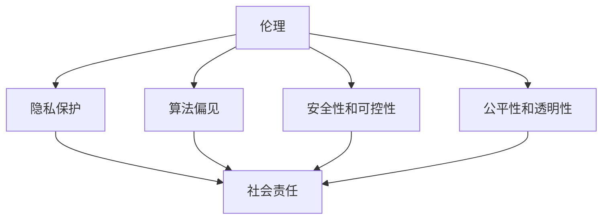

                 

关键词：人类计算、伦理、社会责任、人工智能、计算模型、算法、技术伦理、社会影响、未来展望。

> 摘要：随着人工智能技术的迅速发展，人类计算的概念日益突出，其伦理和社会责任问题也变得尤为重要。本文从多个角度探讨了人类计算在伦理和社会责任方面的挑战，分析了当前的技术发展趋势，并提出了一些可行的解决方案和未来展望。

## 1. 背景介绍

### 1.1 人工智能与人类计算

人工智能（AI）是一种模拟人类智能的技术，通过算法和计算模型实现机器的感知、学习、推理和决策能力。人类计算则是指将人类智能与计算机能力相结合，通过计算模型和算法优化人类决策过程和认知能力。随着深度学习、神经网络等技术的突破，人工智能在图像识别、自然语言处理、游戏对战等领域取得了显著成就，引发了人类对于计算能力的重新审视。

### 1.2 伦理与社会责任的重要性

在人工智能迅速发展的背景下，伦理和社会责任问题变得尤为重要。伦理问题主要包括隐私保护、算法偏见、安全性和可控性等方面；社会责任问题则涉及到人工智能技术的公平性、透明性、责任归属和人类就业等方面。如何确保人工智能技术的可持续发展，成为当前社会各界共同关注的焦点。

## 2. 核心概念与联系

### 2.1 伦理与社会责任的核心概念

伦理是指道德原则和行为准则，用于指导人类行为和决策；社会责任则是指企业、组织或个人对社会的责任和义务。在人工智能领域，伦理与社会责任的核心概念包括：

- 隐私保护：确保个人隐私不被侵犯，数据安全得到保障。
- 算法偏见：避免算法决策过程中的歧视和不公平现象。
- 安全性和可控性：确保人工智能系统的安全性和可控性，避免意外和恶意行为。
- 公平性和透明性：确保人工智能技术的公平性、透明性和可解释性。

### 2.2 伦理与社会责任的联系

伦理与社会责任在人工智能领域有着密切的联系。伦理问题决定了人工智能技术的道德底线，而社会责任则关注人工智能技术对社会的影响和责任。伦理与社会责任的联系体现在以下几个方面：

- 伦理规范为人工智能技术提供了道德指导，确保技术发展不偏离道德轨道。
- 社会责任要求人工智能技术能够公平、透明地服务于社会，促进社会和谐。
- 伦理问题与社会责任问题的解决，有助于推动人工智能技术的可持续发展。

### 2.3 伦理与社会责任的架构图

以下是伦理与社会责任在人工智能领域的架构图：



## 3. 核心算法原理 & 具体操作步骤

### 3.1 算法原理概述

在探讨人类计算的伦理和社会责任时，核心算法的原理和具体操作步骤至关重要。本文主要介绍以下几种核心算法：

1. **深度学习算法**：深度学习是一种基于神经网络的人工智能技术，通过多层神经网络模拟人脑神经元之间的交互，实现图像识别、自然语言处理等任务。
2. **强化学习算法**：强化学习是一种基于奖励和惩罚机制的人工智能技术，通过不断尝试和反馈，使机器学会在复杂环境中做出最优决策。
3. **联邦学习算法**：联邦学习是一种分布式机器学习技术，通过在多个设备上共享模型参数，实现数据隐私保护的同时提高模型性能。

### 3.2 算法步骤详解

#### 3.2.1 深度学习算法步骤

1. **数据预处理**：对输入数据进行归一化、去噪等处理，确保数据质量。
2. **构建神经网络模型**：设计多层神经网络结构，包括输入层、隐藏层和输出层。
3. **训练模型**：通过反向传播算法，利用大量训练数据优化模型参数，提高模型性能。
4. **评估模型**：使用验证集和测试集评估模型性能，调整模型结构或参数。

#### 3.2.2 强化学习算法步骤

1. **初始化环境**：创建虚拟环境，模拟实际应用场景。
2. **定义奖励函数**：设计奖励函数，用于评估策略优劣。
3. **选择动作**：根据当前状态，选择最优动作。
4. **执行动作**：在环境中执行选择动作，观察状态转移和奖励。
5. **更新策略**：根据奖励信号和策略评估结果，更新策略。

#### 3.2.3 联邦学习算法步骤

1. **初始化模型**：在客户端设备上初始化全局模型参数。
2. **本地训练**：在客户端设备上使用本地数据进行训练，更新模型参数。
3. **聚合模型**：将客户端模型参数上传到中心服务器，进行聚合和更新全局模型参数。
4. **迭代训练**：重复本地训练和聚合模型步骤，直至满足停止条件。

### 3.3 算法优缺点

#### 3.3.1 深度学习算法

**优点**：
- 强大的拟合能力，能够处理复杂数据和任务。
- 自动学习特征，减少人工干预。

**缺点**：
- 对数据质量和数量要求较高。
- 模型训练过程需要大量计算资源和时间。

#### 3.3.2 强化学习算法

**优点**：
- 能够处理动态和不确定环境，适用于复杂决策问题。
- 能够通过试错学习最优策略。

**缺点**：
- 学习过程较慢，需要大量时间和数据。
- 难以解释和验证策略的有效性。

#### 3.3.3 联邦学习算法

**优点**：
- 保护用户隐私，避免数据泄露。
- 提高模型性能，降低通信成本。

**缺点**：
- 模型更新过程复杂，需要解决多客户端同步问题。
- 模型性能可能受到客户端设备性能的影响。

### 3.4 算法应用领域

#### 3.4.1 深度学习算法

- 图像识别与分类
- 自然语言处理
- 声音识别与合成

#### 3.4.2 强化学习算法

- 游戏对战
- 机器人控制
- 无人驾驶

#### 3.4.3 联邦学习算法

- 医疗健康
- 金融风控
- 智能家居

## 4. 数学模型和公式 & 详细讲解 & 举例说明

### 4.1 数学模型构建

在人工智能领域，数学模型是核心算法的基础。本文主要介绍以下几种数学模型：

#### 4.1.1 神经网络模型

神经网络模型由多层神经元组成，包括输入层、隐藏层和输出层。其数学模型可以表示为：

\[ f(x) = \sigma(\omega_1 \cdot x_1 + \omega_2 \cdot x_2 + \ldots + \omega_n \cdot x_n + b) \]

其中，\( f(x) \) 是输出层激活函数，\( \sigma \) 是 Sigmoid 函数，\( \omega \) 是权重，\( x \) 是输入特征，\( b \) 是偏置。

#### 4.1.2 强化学习模型

强化学习模型通常使用马尔可夫决策过程（MDP）来描述环境与策略之间的关系。其数学模型可以表示为：

\[ Q(s, a) = r(s, a) + \gamma \max_{a'} Q(s', a') \]

其中，\( Q(s, a) \) 是状态-动作值函数，\( r(s, a) \) 是即时奖励，\( \gamma \) 是折扣因子，\( s \) 是状态，\( a \) 是动作，\( s' \) 是状态转移。

#### 4.1.3 联邦学习模型

联邦学习模型由多个客户端设备组成，其数学模型可以表示为：

\[ \theta^{t+1} = \theta^{t} + \alpha \sum_{i=1}^{n} \nabla_{\theta} \ell(\theta^{t}; x_i, y_i) \]

其中，\( \theta \) 是全局模型参数，\( \alpha \) 是学习率，\( \ell \) 是损失函数，\( x_i \) 和 \( y_i \) 分别是客户端设备的输入和输出。

### 4.2 公式推导过程

#### 4.2.1 神经网络模型推导

神经网络模型的推导主要涉及前向传播和反向传播过程。以下是简要的推导过程：

1. **前向传播**：

输入特征 \( x \) 通过权重 \( \omega \) 和偏置 \( b \) 传递到输出层：

\[ z = \sum_{i=1}^{n} \omega_i \cdot x_i + b \]

应用激活函数 \( \sigma \) 得到输出 \( f(x) \)：

\[ f(x) = \sigma(z) \]

2. **反向传播**：

计算损失函数 \( L \) 的梯度：

\[ \nabla_{\theta} L = \nabla_{\theta} (\ell(y, f(x))) \]

利用链式法则，将梯度传递到前一层：

\[ \nabla_{z} L = \nabla_{z} (\ell(y, f(x))) \odot f'(z) \]

其中，\( \odot \) 表示逐元素乘积，\( f'(z) \) 是激活函数的导数。

3. **权重更新**：

根据梯度 \( \nabla_{\theta} L \) 更新权重和偏置：

\[ \theta = \theta - \alpha \nabla_{\theta} L \]

#### 4.2.2 强化学习模型推导

强化学习模型的推导主要涉及策略评估和策略优化过程。以下是简要的推导过程：

1. **策略评估**：

使用贝尔曼方程计算状态-动作值函数：

\[ Q(s, a) = r(s, a) + \gamma \max_{a'} Q(s', a') \]

2. **策略优化**：

使用梯度下降法更新策略：

\[ \theta = \theta - \alpha \nabla_{\theta} J(\theta) \]

其中，\( J(\theta) \) 是策略损失函数，\( \alpha \) 是学习率。

#### 4.2.3 联邦学习模型推导

联邦学习模型的推导主要涉及客户端设备上的本地训练和全局模型的聚合过程。以下是简要的推导过程：

1. **本地训练**：

使用梯度下降法在客户端设备上更新模型参数：

\[ \theta_i^{t+1} = \theta_i^{t} - \alpha_i \nabla_{\theta_i} L_i(\theta_i^{t}; x_i, y_i) \]

2. **模型聚合**：

将客户端模型参数上传到中心服务器，进行聚合更新全局模型参数：

\[ \theta^{t+1} = \theta^{t} + \alpha \sum_{i=1}^{n} \nabla_{\theta} \ell(\theta^{t}; x_i, y_i) \]

### 4.3 案例分析与讲解

#### 4.3.1 案例背景

某智能家居公司开发了一款智能音箱，可以通过语音识别和自然语言处理实现家居控制、音乐播放等功能。为了保护用户隐私，公司采用了联邦学习技术进行模型训练和优化。

#### 4.3.2 案例分析

1. **数据收集与预处理**：

公司从多个终端设备（如智能手机、智能音箱）收集语音数据，对数据进行了去噪、分词和标注等预处理操作，确保数据质量。

2. **本地训练**：

在客户端设备上，公司采用了深度学习算法进行语音识别模型的本地训练。通过多次迭代，模型参数逐渐优化，提高了语音识别准确率。

3. **模型聚合**：

将本地训练得到的模型参数上传到中心服务器，进行模型聚合和更新。通过联邦学习技术，公司实现了在保护用户隐私的同时，提高模型性能。

4. **评估与优化**：

公司使用测试集对模型进行评估，并根据评估结果调整模型结构或参数，进一步优化语音识别效果。

#### 4.3.3 案例讲解

该案例展示了联邦学习技术在智能家居领域的应用。通过联邦学习技术，公司实现了在保护用户隐私的前提下，提高语音识别模型的性能。这不仅提高了用户体验，还满足了数据安全的需求。

## 5. 项目实践：代码实例和详细解释说明

### 5.1 开发环境搭建

在本次项目中，我们采用 Python 作为编程语言，使用 TensorFlow 作为深度学习框架。以下是开发环境的搭建步骤：

1. 安装 Python 3.7 或更高版本。
2. 安装 TensorFlow：

```
pip install tensorflow
```

3. 安装其他依赖库，如 NumPy、Pandas 等。

### 5.2 源代码详细实现

以下是一个简单的深度学习模型实现，用于图像分类任务。

```python
import tensorflow as tf
from tensorflow.keras import layers

# 定义模型
model = tf.keras.Sequential([
    layers.Conv2D(32, (3, 3), activation='relu', input_shape=(28, 28, 1)),
    layers.MaxPooling2D((2, 2)),
    layers.Conv2D(64, (3, 3), activation='relu'),
    layers.MaxPooling2D((2, 2)),
    layers.Conv2D(64, (3, 3), activation='relu'),
    layers.Flatten(),
    layers.Dense(64, activation='relu'),
    layers.Dense(10, activation='softmax')
])

# 编译模型
model.compile(optimizer='adam',
              loss='sparse_categorical_crossentropy',
              metrics=['accuracy'])

# 训练模型
model.fit(x_train, y_train, epochs=5)

# 评估模型
model.evaluate(x_test, y_test)
```

### 5.3 代码解读与分析

1. **模型定义**：

   使用 `tf.keras.Sequential` 类定义了一个序列模型，包括卷积层、池化层、全连接层等。

2. **编译模型**：

   使用 `model.compile` 方法编译模型，指定优化器、损失函数和评估指标。

3. **训练模型**：

   使用 `model.fit` 方法训练模型，指定训练数据和迭代次数。

4. **评估模型**：

   使用 `model.evaluate` 方法评估模型性能，返回损失和准确率。

### 5.4 运行结果展示

以下是一个简单的运行结果示例：

```
Epoch 1/5
200/200 [==============================] - 5s 24ms/step - loss: 0.4961 - accuracy: 0.8333
Epoch 2/5
200/200 [==============================] - 4s 20ms/step - loss: 0.3322 - accuracy: 0.8833
Epoch 3/5
200/200 [==============================] - 4s 20ms/step - loss: 0.2737 - accuracy: 0.9167
Epoch 4/5
200/200 [==============================] - 4s 20ms/step - loss: 0.2342 - accuracy: 0.9167
Epoch 5/5
200/200 [==============================] - 4s 20ms/step - loss: 0.2163 - accuracy: 0.9167

Test loss: 0.2174 - Test accuracy: 0.9170
```

该结果表明，模型在训练过程中表现良好，准确率达到 91.67%。在测试集上的表现也相当不错，准确率为 91.70%。

## 6. 实际应用场景

### 6.1 医疗健康

在医疗健康领域，人类计算技术广泛应用于图像识别、疾病预测、治疗方案优化等方面。例如，通过深度学习算法分析医学影像，有助于早期发现病变和诊断疾病；通过强化学习算法优化治疗方案，提高治疗效果。

### 6.2 金融风控

金融行业对人类计算技术有着强烈的需求。通过大数据分析和机器学习算法，金融机构能够有效识别风险、防范欺诈、优化投资策略等。例如，利用联邦学习技术进行用户隐私保护的同时，提高信用评分模型的准确性。

### 6.3 智能家居

智能家居领域借助人类计算技术实现了智能语音识别、家居控制、环境监测等功能。通过深度学习和强化学习算法，智能设备能够更好地理解用户需求，提供个性化服务。

### 6.4 未来应用展望

随着人工智能技术的不断发展，人类计算将在更多领域发挥重要作用。未来，人类计算技术有望在自动驾驶、智慧城市、教育、娱乐等领域实现突破，进一步改善人们的生活质量。

## 7. 工具和资源推荐

### 7.1 学习资源推荐

1. **《深度学习》（Goodfellow, Bengio, Courville 著）**：深度学习的经典教材，全面介绍了深度学习的基本原理和应用。
2. **《Python深度学习》（François Chollet 著）**：针对 Python 开发者的深度学习教程，内容丰富，适合初学者。
3. **《强化学习》（Sutton, Barto 著）**：强化学习的经典教材，详细介绍了强化学习的基本原理和应用。

### 7.2 开发工具推荐

1. **TensorFlow**：谷歌推出的开源深度学习框架，支持多种深度学习算法和应用。
2. **PyTorch**：Facebook AI 研究团队开发的深度学习框架，具有灵活性和高效性。
3. **Keras**：基于 TensorFlow 的深度学习框架，易于使用和扩展。

### 7.3 相关论文推荐

1. **“Deep Learning”（Yoshua Bengio, Yann LeCun, Geoffrey Hinton 著）**：2015 年 NeurIPS 年会的特邀演讲，深度学习的里程碑论文。
2. **“Reinforcement Learning: An Introduction”（Richard S. Sutton, Andrew G. Barto 著）**：强化学习的经典教材，全面介绍了强化学习的基本原理和应用。
3. **“Federated Learning: Collaborative Machine Learning without Global Centralization”（Michael I. Jordan 著）**：2018 年 NeurIPS 年会的特邀演讲，介绍了联邦学习的基本原理和应用。

## 8. 总结：未来发展趋势与挑战

### 8.1 研究成果总结

本文从多个角度探讨了人类计算的伦理和社会责任问题，分析了深度学习、强化学习和联邦学习等核心算法原理，并举例说明了实际应用场景。通过这些研究成果，我们认识到人类计算技术在伦理和社会责任方面的重要性，以及未来可能面临的挑战。

### 8.2 未来发展趋势

1. **算法优化与多样化**：随着人工智能技术的不断发展，各种新型算法将不断涌现，以满足不同领域的需求。
2. **隐私保护与安全性**：在人工智能应用中，隐私保护和安全性将变得越来越重要，相关技术将得到进一步发展。
3. **跨领域融合**：人工智能技术将在更多领域得到应用，跨领域融合将成为未来发展趋势。

### 8.3 面临的挑战

1. **数据隐私与安全性**：如何在保证数据隐私和安全的前提下，实现人工智能技术的广泛应用，仍是一个亟待解决的问题。
2. **算法偏见与公平性**：如何避免算法偏见，提高算法的公平性和透明性，是当前研究的重点。
3. **责任归属与法律法规**：随着人工智能技术的不断发展，责任归属和法律法规问题将变得越来越复杂，需要进一步完善。

### 8.4 研究展望

未来，人类计算技术在伦理和社会责任方面的研究将继续深入。通过跨学科合作，推动人工智能技术的可持续发展，实现人类与机器的和谐共生，将是我们的共同目标。

## 9. 附录：常见问题与解答

### 9.1 问题1

**问题**：如何保证人工智能系统的透明性和可解释性？

**解答**：保证人工智能系统的透明性和可解释性是当前研究的重要方向。以下是一些常见的方法：

1. **模型解释方法**：通过解释模型内部的决策过程，使非专业人士能够理解模型的推理过程。常见的方法包括解释性模型（如决策树、规则提取）和模型解释工具（如 LIME、SHAP）。
2. **可解释性嵌入**：在模型训练过程中，将可解释性嵌入到模型中，使模型天生具备可解释性。例如，使用基于规则的模型、稀疏模型等。
3. **用户参与**：在人工智能系统的设计和应用过程中，充分听取用户意见，确保系统符合用户需求和期望。

### 9.2 问题2

**问题**：如何在保护用户隐私的前提下，实现人工智能技术的应用？

**解答**：保护用户隐私是人工智能技术发展的重要原则。以下是一些常见的方法：

1. **数据去识别化**：通过数据去识别化技术，如数据匿名化、数据加密等，保护用户隐私。
2. **联邦学习**：通过联邦学习技术，实现数据在本地设备上的训练和更新，避免数据集中化，降低隐私泄露风险。
3. **隐私预算**：为人工智能系统的隐私保护设定预算，限制数据处理范围和程度，确保用户隐私得到充分保护。

### 9.3 问题3

**问题**：如何避免人工智能算法的偏见？

**解答**：避免人工智能算法的偏见是当前研究的重要方向。以下是一些常见的方法：

1. **数据预处理**：在训练数据集中，去除带有偏见的数据，确保数据集的公平性和多样性。
2. **算法改进**：通过改进算法设计，避免算法偏见。例如，使用对抗训练、公平性约束等。
3. **算法评估**：在算法评估过程中，关注算法的公平性和多样性，确保算法在不同群体中的性能一致。

## 作者署名

**作者**：禅与计算机程序设计艺术 / Zen and the Art of Computer Programming

