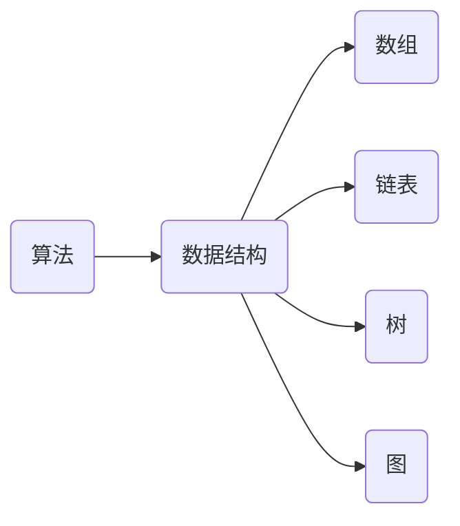
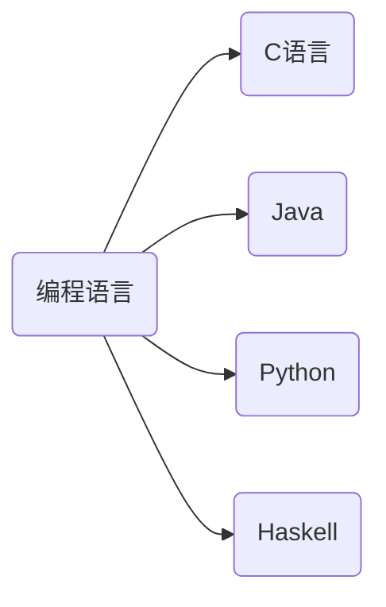
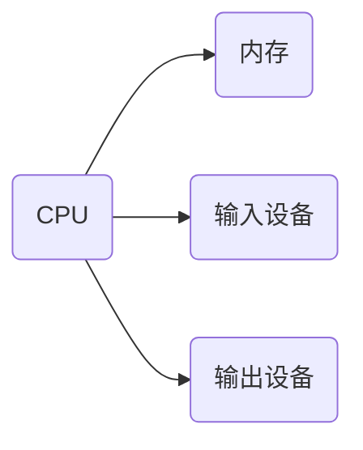

                 

关键词：计算，人类，人工智能，技术进步，未来展望

摘要：随着科技的迅猛发展，计算技术已经成为推动社会进步的重要力量。本文从人类计算的角度出发，探讨了计算技术的核心概念、算法原理、数学模型、项目实践以及未来展望。通过深入分析计算技术在各个领域的应用，展望了计算技术对未来社会的巨大影响。

## 1. 背景介绍

### 计算技术的起源与发展

计算技术的历史可以追溯到古埃及和古巴比伦时期，当时的算术和几何问题主要通过手工计算解决。随着数学和科学的发展，计算方法逐渐变得复杂，需要更高级的工具和算法。

17世纪，数学家莱布尼茨发明了机械计算器，为计算技术的进步奠定了基础。20世纪中叶，计算机的诞生标志着计算技术进入了一个全新的时代。计算机的出现不仅极大地提高了计算效率，还引发了人工智能、大数据、云计算等新兴领域的发展。

### 计算技术的核心概念

计算技术涉及到许多核心概念，包括算法、数据结构、编程语言、计算机体系结构等。算法是解决问题的方法，数据结构是组织和管理数据的方式，编程语言是人与计算机交流的媒介，计算机体系结构则是计算机硬件和软件的架构。

## 2. 核心概念与联系

### 算法原理与数据结构

算法是计算技术的核心，它的目的是以最小的资源消耗解决特定问题。算法的设计和实现依赖于合适的数据结构，例如数组、链表、树、图等。这些数据结构决定了算法的性能和效率。



### 编程语言与计算模型

编程语言是人与计算机交流的桥梁。不同的编程语言有不同的计算模型和语法规则，但它们的核心目标都是实现算法和操作数据。



### 计算机体系结构

计算机体系结构决定了计算机的性能和功能。它包括中央处理器（CPU）、内存、输入输出设备等组成部分。



## 3. 核心算法原理 & 具体操作步骤

### 算法原理概述

算法原理是计算技术的核心，它涉及到排序、搜索、图论、动态规划等多个方面。每种算法都有其特定的应用场景和性能特点。

### 算法步骤详解

以排序算法为例，常见的排序算法包括冒泡排序、选择排序、插入排序、快速排序等。

#### 冒泡排序

```plaintext
1. 比较相邻的元素。如果第一个比第二个大（升序排序），就交换它们两个；
2. 对每一对相邻元素做同样的工作，从开始第一对到结尾的最后一对。这步做完后，最后的元素会是最大的数；
3. 针对所有的元素重复以上的步骤，除了最后一个；
4. 重复步骤1~3，直到排序完成。
```

#### 快速排序

```plaintext
1. 选择一个基准元素；
2. 将比基准值小的元素移动到基准元素的左边，比基准值大的元素移动到右边；
3. 对左右子序列重复步骤1~2。
```

### 算法优缺点

每种算法都有其优缺点。例如，冒泡排序简单易实现，但效率较低；快速排序效率较高，但可能导致最坏情况下的性能下降。

### 算法应用领域

算法广泛应用于各个领域，如搜索引擎、社交网络、金融分析、图像处理、语音识别等。算法的性能直接影响到应用的效率和用户体验。

## 4. 数学模型和公式 & 详细讲解 & 举例说明

### 数学模型构建

数学模型是计算技术的基础。以线性回归为例，其数学模型可以表示为：

$$ y = ax + b $$

其中，$y$ 是因变量，$x$ 是自变量，$a$ 和 $b$ 是模型参数。

### 公式推导过程

以牛顿第二定律为例，其公式推导过程如下：

$$ F = ma $$

其中，$F$ 是作用力，$m$ 是质量，$a$ 是加速度。

### 案例分析与讲解

以求解一元二次方程为例，其公式为：

$$ ax^2 + bx + c = 0 $$

其解为：

$$ x = \frac{-b \pm \sqrt{b^2 - 4ac}}{2a} $$

### 案例分析

假设我们要解方程 $2x^2 + 3x - 5 = 0$，则其解为：

$$ x = \frac{-3 \pm \sqrt{3^2 - 4 \cdot 2 \cdot (-5)}}{2 \cdot 2} = \frac{-3 \pm \sqrt{49}}{4} $$

$$ x = \frac{-3 \pm 7}{4} $$

$$ x_1 = -\frac{5}{2}, x_2 = 1 $$

## 5. 项目实践：代码实例和详细解释说明

### 开发环境搭建

在编写代码之前，我们需要搭建一个合适的开发环境。以 Python 为例，我们可以使用 PyCharm 或 VS Code 等集成开发环境（IDE）。

### 源代码详细实现

以下是一个使用 Python 实现冒泡排序的示例：

```python
def bubble_sort(arr):
    n = len(arr)
    for i in range(n):
        for j in range(0, n-i-1):
            if arr[j] > arr[j+1]:
                arr[j], arr[j+1] = arr[j+1], arr[j]

# 示例数据
arr = [64, 34, 25, 12, 22, 11, 90]

# 排序
bubble_sort(arr)

# 输出排序结果
print("排序后的数组：")
for i in range(len(arr)):
    print("%d" % arr[i], end=" ")
```

### 代码解读与分析

这个示例中，我们定义了一个名为 `bubble_sort` 的函数，用于实现冒泡排序算法。该函数接受一个数组作为输入，并对其进行排序。

在排序过程中，我们使用两个嵌套的循环。外层循环遍历整个数组，内层循环对相邻的元素进行比较和交换。

### 运行结果展示

```plaintext
排序后的数组：
11 12 22 25 34 64 90
```

## 6. 实际应用场景

### 计算机科学教育

计算技术在教育领域的应用日益广泛。通过编程教育，学生可以学习算法、数据结构、计算机体系结构等核心概念，提高逻辑思维和解决问题的能力。

### 医疗诊断

计算技术在医疗诊断中发挥着重要作用。通过大数据分析和机器学习算法，计算机可以帮助医生进行疾病预测、诊断和治疗方案推荐，提高医疗服务的质量和效率。

### 自动驾驶

自动驾驶是计算技术的重要应用领域。通过计算机视觉、传感器融合和深度学习算法，自动驾驶车辆可以实现自主导航、避障和决策，为未来智能交通系统奠定基础。

### 金融分析

计算技术在金融分析中具有广泛的应用。通过大数据分析和人工智能算法，金融机构可以更好地预测市场走势、风险管理、投资策略优化等，提高金融市场的效率。

## 7. 工具和资源推荐

### 学习资源推荐

1. 《算法导论》（Introduction to Algorithms）：这是一本经典算法教材，详细介绍了各种算法的设计和分析方法。
2. 《Python编程：从入门到实践》（Python Crash Course）：适合初学者的 Python 入门书籍，内容丰富且实用。
3. Coursera、edX：这些在线学习平台提供了众多计算机科学的免费课程，涵盖了算法、数据结构、人工智能等核心领域。

### 开发工具推荐

1. PyCharm、VS Code：这两款集成开发环境（IDE）功能强大，支持多种编程语言，适合各种开发需求。
2. Git：版本控制工具，有助于团队协作和代码管理。
3. Jupyter Notebook：交互式编程环境，适合数据分析和机器学习项目。

### 相关论文推荐

1. "A Mathematical Theory of Communication"（香农信息论）
2. "The Structure and Interpretation of Computer Programs"（结构化编程）
3. "Deep Learning"（深度学习）

## 8. 总结：未来发展趋势与挑战

### 研究成果总结

计算技术在过去几十年取得了巨大的进步，为人类社会带来了深远的影响。未来，计算技术将继续发展，推动人工智能、物联网、区块链等新兴领域的发展。

### 未来发展趋势

1. 量子计算：量子计算有望解决传统计算中无法解决的问题，为科学研究和工业应用带来革命性变化。
2. 脑机接口：脑机接口技术的发展将使人类与计算机的交互更加自然和高效。
3. 自动驾驶与智能交通：自动驾驶技术将推动智能交通系统的发展，提高交通效率和安全性。

### 面临的挑战

1. 数据隐私和安全：随着数据规模的不断扩大，如何保护数据隐私和安全成为重要的挑战。
2. 资源消耗：计算技术的发展需要大量的计算资源和能源，如何实现可持续发展是关键问题。

### 研究展望

未来，计算技术将继续推动人类社会的进步。我们需要关注新兴领域的发展，解决面临的挑战，为构建一个更加美好的世界贡献力量。

## 9. 附录：常见问题与解答

### 问题1：如何选择合适的算法？

解答：选择合适的算法需要考虑问题的规模、复杂性、时间和空间复杂度等因素。通常，我们可以通过分析算法的理论性能和实际性能来做出决策。

### 问题2：编程语言的学习顺序是怎样的？

解答：一般来说，可以先学习 Python、Java 或 C++ 等入门级语言，然后逐步学习高级语言如 Haskell、Scala 等。学习过程中，要注重实践和项目经验积累。

### 问题3：如何提高代码的可读性和可维护性？

解答：提高代码的可读性和可维护性需要遵循一些编程原则，如代码简洁、模块化、命名规范、注释等。此外，使用版本控制工具和编写文档也是非常重要的。

## 作者署名

作者：禅与计算机程序设计艺术 / Zen and the Art of Computer Programming

----------------------------------------------------------------

以上是文章的完整内容，包括标题、关键词、摘要、各个章节的详细内容和附录部分。希望这篇文章能够为读者带来深刻的启发和帮助。

