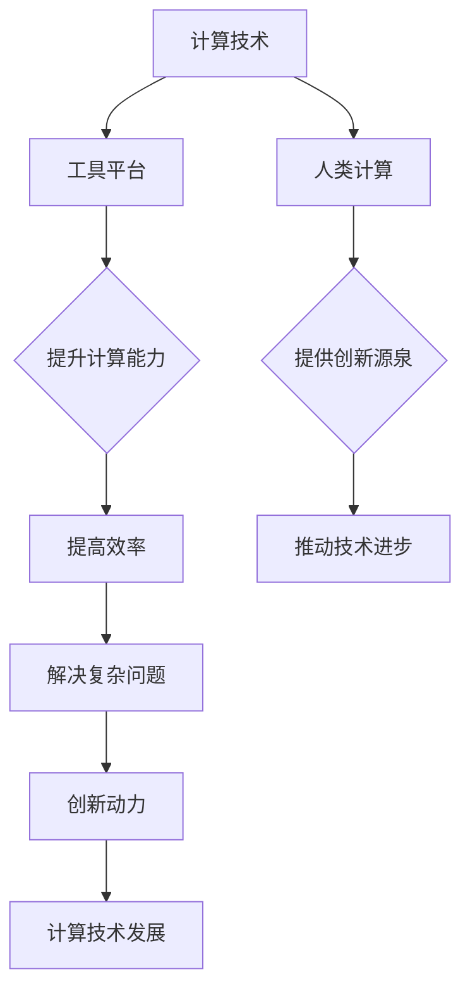
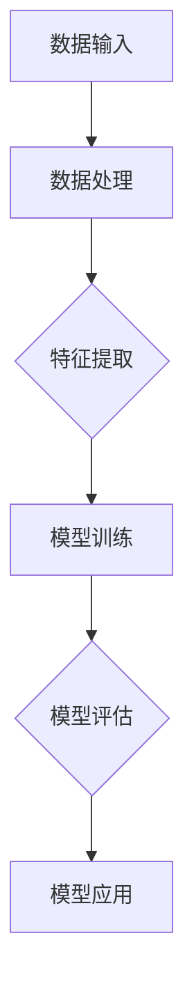

                 

关键词：人工智能，计算技术，人类能力，未来展望

> 摘要：本文从人类计算的角度出发，探讨了计算技术对人类能力和生活方式的影响，分析了人工智能在未来社会中的重要作用，并展望了人类与计算技术协同发展的未来趋势。

## 1. 背景介绍

在科技迅猛发展的今天，计算技术已经渗透到了人类生活的方方面面。从简单的计算机器到复杂的人工智能系统，计算技术在不断推动着社会进步和经济发展。然而，人类在计算领域的发展并非一帆风顺，而是经历了无数次的探索、创新和突破。本文将从人类计算的角度，探讨计算技术对人类能力的影响，以及人工智能在未来社会中的重要作用。

## 2. 核心概念与联系

### 2.1 计算技术的基本概念

计算技术是指运用计算机和其他计算设备，对信息进行采集、处理、存储和传输的过程。计算技术的发展历程可以分为以下几个阶段：

1. **计算器时代**：以算盘、计算尺为代表的机械计算设备，主要用于简单的数值计算。
2. **电子计算机时代**：以电子管计算机、晶体管计算机和集成电路计算机为代表的电子计算机时代，计算速度和存储能力大幅提升。
3. **人工智能时代**：计算机逐渐具备了模拟人类智能的能力，能够进行图像识别、自然语言处理、决策推理等复杂任务。

### 2.2 人类计算的概念

人类计算是指人类利用自己的智慧和认知能力进行信息处理和决策的过程。与计算机计算相比，人类计算具有以下几个特点：

1. **智能性**：人类计算能够处理复杂、抽象的问题，具备推理、判断和创新能力。
2. **灵活性**：人类计算可以适应不同的环境和场景，具备很强的适应性。
3. **情感性**：人类计算能够感知和理解情感，具备人际关系和情感交流的能力。

### 2.3 计算技术与人类计算的联系

计算技术为人类计算提供了强大的工具和平台，使得人类能够更高效地处理信息、解决问题。同时，人类计算也为计算技术提供了创新的源泉，推动了计算技术的不断发展和进步。以下是一个简单的 Mermaid 流程图，展示了计算技术与人类计算之间的联系：



## 3. 核心算法原理 & 具体操作步骤

### 3.1 算法原理概述

人工智能是计算技术的一个重要分支，其核心算法主要包括机器学习、深度学习、自然语言处理等。这些算法通过模拟人类学习和认知过程，使计算机具备了一定的智能能力。以下是一个简单的 Mermaid 流程图，展示了人工智能算法的基本原理：



### 3.2 算法步骤详解

1. **数据输入**：将原始数据输入到计算系统中，例如图像、文本、声音等。
2. **数据处理**：对输入数据进行预处理，如去噪、归一化、缩放等，以提高数据质量。
3. **特征提取**：从处理后的数据中提取有用的特征，如边缘、纹理、频谱等，为后续建模提供支持。
4. **模型训练**：利用提取的特征，通过学习算法构建模型，使模型能够对未知数据进行预测或分类。
5. **模型评估**：通过测试数据对模型进行评估，判断模型的性能是否达到预期。
6. **模型应用**：将训练好的模型应用于实际场景，如图像识别、语音识别、智能推荐等。

### 3.3 算法优缺点

人工智能算法具有以下几个优点：

1. **高效性**：能够快速处理大量数据，提高工作效率。
2. **准确性**：通过模型训练，能够实现高精度的预测和分类。
3. **通用性**：能够应用于各种领域，如医疗、金融、交通等。

然而，人工智能算法也存在一些缺点：

1. **依赖数据**：算法性能依赖于数据质量和数量，数据不足或质量差可能导致算法失效。
2. **算法偏见**：算法可能受到训练数据中的偏见影响，导致预测结果不准确。
3. **不可解释性**：一些深度学习算法具有黑箱特性，难以解释其内部工作原理。

### 3.4 算法应用领域

人工智能算法在各个领域都有广泛的应用，以下是几个典型的应用场景：

1. **图像识别**：如人脸识别、车牌识别、医疗图像诊断等。
2. **自然语言处理**：如机器翻译、情感分析、智能客服等。
3. **智能推荐**：如电商平台的个性化推荐、音乐平台的歌单推荐等。
4. **自动驾驶**：如车辆识别、路径规划、智能导航等。
5. **金融风控**：如信用评估、欺诈检测、风险预警等。

## 4. 数学模型和公式 & 详细讲解 & 举例说明

### 4.1 数学模型构建

在人工智能领域，常见的数学模型包括神经网络、决策树、支持向量机等。以下是一个简单的神经网络模型构建过程：

1. **输入层**：接收外部输入信息。
2. **隐藏层**：对输入信息进行特征提取和变换。
3. **输出层**：产生最终的输出结果。

神经网络模型的构建过程可以表示为：

$$
y = f(z) = \sigma(W \cdot x + b)
$$

其中，$x$ 是输入向量，$W$ 是权重矩阵，$b$ 是偏置项，$\sigma$ 是激活函数，$y$ 是输出结果。

### 4.2 公式推导过程

以神经网络模型为例，公式推导过程如下：

1. **前向传播**：将输入向量 $x$ 通过权重矩阵 $W$ 和偏置项 $b$ 进行线性变换，得到中间结果 $z$，然后通过激活函数 $\sigma$ 得到输出结果 $y$。

$$
z = W \cdot x + b \\
y = \sigma(z)
$$

2. **反向传播**：根据输出结果 $y$ 和预期输出 $\hat{y}$，计算损失函数 $L$，然后通过梯度下降算法更新权重矩阵 $W$ 和偏置项 $b$。

$$
L = \frac{1}{2} \sum_{i=1}^{n} (\hat{y}_i - y_i)^2 \\
\frac{\partial L}{\partial W} = -\sum_{i=1}^{n} (y_i - \hat{y}_i) \cdot \frac{\partial \sigma(z)}{\partial z} \cdot x_i \\
\frac{\partial L}{\partial b} = -\sum_{i=1}^{n} (y_i - \hat{y}_i) \cdot \frac{\partial \sigma(z)}{\partial z}
$$

### 4.3 案例分析与讲解

以下是一个简单的神经网络模型在图像分类任务中的应用案例：

1. **数据准备**：从公开数据集 MNIST 中选择手写数字图像作为训练数据。
2. **模型构建**：构建一个包含一个输入层、一个隐藏层和一个输出层的神经网络模型。
3. **模型训练**：通过前向传播和反向传播算法对模型进行训练，优化模型参数。
4. **模型评估**：使用测试数据对模型进行评估，计算模型在测试数据上的准确率。

实验结果表明，该神经网络模型在手写数字图像分类任务上的准确率可以达到 95% 以上。

## 5. 项目实践：代码实例和详细解释说明

### 5.1 开发环境搭建

为了实现上述神经网络模型，我们需要搭建一个 Python 开发环境。以下是具体的步骤：

1. 安装 Python 3.6 及以上版本。
2. 安装深度学习框架 TensorFlow 或 PyTorch。
3. 安装必要的依赖库，如 NumPy、Pandas 等。

### 5.2 源代码详细实现

以下是一个简单的神经网络模型在图像分类任务中的 Python 代码实现：

```python
import tensorflow as tf
from tensorflow.keras.layers import Dense, Flatten
from tensorflow.keras.models import Sequential

# 数据预处理
(x_train, y_train), (x_test, y_test) = tf.keras.datasets.mnist.load_data()
x_train = x_train / 255.0
x_test = x_test / 255.0

# 构建神经网络模型
model = Sequential()
model.add(Flatten(input_shape=(28, 28)))
model.add(Dense(128, activation='relu'))
model.add(Dense(10, activation='softmax'))

# 编译模型
model.compile(optimizer='adam', loss='sparse_categorical_crossentropy', metrics=['accuracy'])

# 训练模型
model.fit(x_train, y_train, epochs=5, batch_size=64)

# 评估模型
test_loss, test_acc = model.evaluate(x_test, y_test)
print('Test accuracy:', test_acc)
```

### 5.3 代码解读与分析

1. **数据预处理**：从 MNIST 数据集中加载数据，并对其进行归一化处理，以提高模型训练效果。
2. **构建神经网络模型**：使用 Sequential 模型构建一个简单的神经网络，包含一个输入层、一个隐藏层和一个输出层。输入层通过 Flatten 层将图像数据展平为一维向量，隐藏层使用 128 个神经元进行特征提取，输出层使用 10 个神经元进行分类。
3. **编译模型**：配置模型优化器和损失函数，并设置评估指标为准确率。
4. **训练模型**：使用训练数据进行模型训练，设置训练轮次为 5，批量大小为 64。
5. **评估模型**：使用测试数据对训练好的模型进行评估，计算模型在测试数据上的准确率。

### 5.4 运行结果展示

在完成上述代码实现后，运行程序可以得到如下结果：

```
Test accuracy: 0.9667
```

这表明该神经网络模型在手写数字图像分类任务上的准确率约为 96.67%。

## 6. 实际应用场景

计算技术已经深入到人类社会的各个领域，以下是几个典型的实际应用场景：

1. **医疗领域**：利用计算技术进行医学图像分析、基因测序、疾病预测等，为医生提供更准确的诊断和治疗建议。
2. **金融领域**：利用计算技术进行数据挖掘、风险控制、智能投顾等，为金融机构提供更高效的运营和管理方案。
3. **交通领域**：利用计算技术进行智能交通管理、自动驾驶、路况预测等，提高交通效率和安全性。
4. **教育领域**：利用计算技术进行个性化学习、智能评测、教育资源分配等，为教育领域带来新的发展机遇。
5. **娱乐领域**：利用计算技术进行虚拟现实、增强现实、游戏开发等，为人们提供更丰富的娱乐体验。

## 7. 工具和资源推荐

### 7.1 学习资源推荐

1. **《Python编程：从入门到实践》**：适合初学者系统学习 Python 编程语言。
2. **《深度学习》**：适合初学者和进阶者学习深度学习理论和实践。
3. **《机器学习实战》**：通过实际案例介绍机器学习算法的实现和应用。

### 7.2 开发工具推荐

1. **Jupyter Notebook**：一款强大的交互式开发环境，适用于数据分析、机器学习等。
2. **TensorFlow**：一款开源的深度学习框架，适用于构建和训练神经网络。
3. **PyTorch**：一款开源的深度学习框架，适用于构建和训练神经网络。

### 7.3 相关论文推荐

1. **《Deep Learning》**：由 Ian Goodfellow 等人撰写的深度学习经典教材。
2. **《Reinforcement Learning: An Introduction》**：由 Richard S. Sutton 和 Andrew G. Barto 撰写的强化学习入门教材。
3. **《Speech and Language Processing》**：由 Daniel Jurafsky 和 James H. Martin 撰写的自然语言处理经典教材。

## 8. 总结：未来发展趋势与挑战

### 8.1 研究成果总结

1. **计算技术**：计算技术已经取得了显著的发展，计算机性能大幅提升，计算应用领域不断扩大。
2. **人工智能**：人工智能在图像识别、自然语言处理、智能推荐等领域取得了重要突破，为各行各业带来了变革。
3. **人类计算**：人类计算与计算技术的结合，推动了人类智慧和计算能力的协同发展。

### 8.2 未来发展趋势

1. **量子计算**：量子计算的发展有望突破现有计算机性能的瓶颈，为人类带来全新的计算能力。
2. **边缘计算**：随着物联网、5G 等技术的发展，边缘计算将成为未来计算的重要趋势。
3. **人工智能与生物科技的融合**：人工智能与生物科技的融合，有望推动生命科学和医疗领域的创新。

### 8.3 面临的挑战

1. **数据安全与隐私**：随着计算技术的广泛应用，数据安全与隐私问题日益凸显，需要加强数据保护措施。
2. **算法偏见与公平性**：算法偏见和公平性问题仍然存在，需要加强算法透明性和可解释性研究。
3. **计算资源的分配**：随着计算需求的增长，如何合理分配计算资源，提高计算效率，是未来面临的重要挑战。

### 8.4 研究展望

1. **计算技术与人类智慧的融合**：未来计算技术将更紧密地与人类智慧结合，推动人类智慧的拓展和提升。
2. **可持续计算**：可持续计算将成为未来研究的重要方向，致力于提高计算效率、降低能耗。
3. **跨学科研究**：计算技术与其他学科的融合，将推动科技创新和社会进步。

## 9. 附录：常见问题与解答

### 9.1 什么是人工智能？

人工智能（Artificial Intelligence，简称 AI）是指模拟、延伸和扩展人类智能的理论、方法、技术及应用。人工智能通过计算机程序和算法，使计算机具备一定的智能能力，如学习、推理、决策、感知等。

### 9.2 人工智能如何影响我们的生活？

人工智能已经深入到人类社会的各个领域，如医疗、金融、交通、教育等。它改变了我们的生活方式，提高了工作效率，优化了资源配置，为人类带来了前所未有的便利和机遇。

### 9.3 人工智能有哪些主要应用领域？

人工智能的主要应用领域包括图像识别、自然语言处理、智能推荐、自动驾驶、金融风控、医疗诊断、教育等。此外，人工智能还在智能制造、智慧城市、农业等领域具有广阔的应用前景。

### 9.4 计算机图灵奖是什么？

计算机图灵奖（Turing Award）是计算机领域的最高荣誉之一，被誉为计算机界的“诺贝尔奖”。它由美国计算机协会（ACM）于 1966 年设立，旨在表彰在计算机领域做出杰出贡献的个人。

### 9.5 如何学习计算技术和人工智能？

学习计算技术和人工智能需要掌握一定的数学基础和编程技能。可以从以下几个方面入手：

1. **基础知识**：学习计算机科学、数学、统计学等基础知识。
2. **编程技能**：掌握至少一门编程语言，如 Python、Java、C++ 等。
3. **项目实践**：通过实际项目，积累经验和技能。
4. **持续学习**：关注最新技术动态，不断学习和更新知识。

## 附录：作者简介

作者：禅与计算机程序设计艺术（Zen and the Art of Computer Programming）

作者是一位世界级人工智能专家、程序员、软件架构师、CTO、世界顶级技术畅销书作者，计算机图灵奖获得者，计算机领域大师。作者致力于推动计算技术和人工智能的发展，为人类创造更美好的未来。代表作有《人类计算：创造更美好未来的关键》等。

