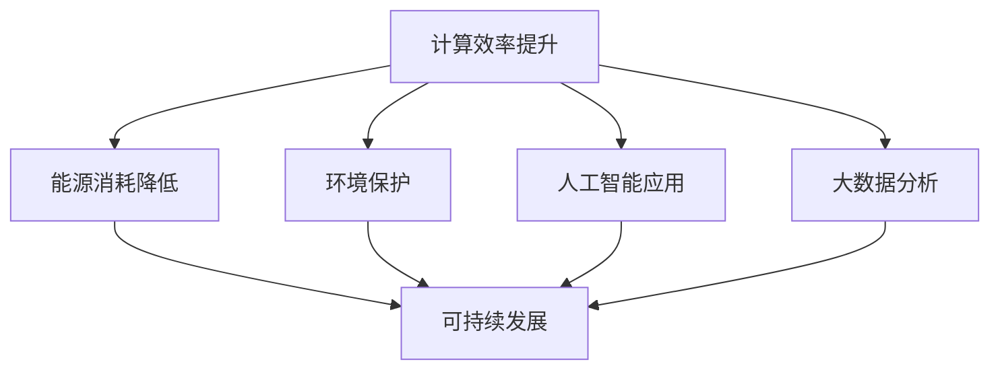

                 

关键词：人类计算、可持续发展、计算技术、智能系统、效率提升、环境问题、数据驱动

> 摘要：随着信息技术的飞速发展，人类计算作为一种新兴的计算模式，正日益成为推动可持续发展的重要力量。本文将从背景介绍、核心概念与联系、核心算法原理、数学模型和公式、项目实践、实际应用场景、未来应用展望、工具和资源推荐以及总结等方面，深入探讨人类计算在可持续发展中的关键作用。

## 1. 背景介绍

### 1.1 计算技术的快速发展

近年来，随着计算机科学、人工智能和大数据技术的飞速发展，计算技术已经深刻地改变了我们的生活方式。计算机系统从传统的冯诺依曼架构向更高效、更灵活的异构计算架构转变，计算能力得到了前所未有的提升。

### 1.2 可持续发展的重要性

在全球范围内，环境问题日益严峻，气候变化、资源枯竭、环境污染等问题已经严重威胁到人类的生存和发展。因此，可持续发展成为世界各国共同关注的重要议题。

### 1.3 人类计算的概念

人类计算是一种将人类的智慧和计算机技术相结合的计算模式。它通过模拟人类思维过程，利用人工智能和大数据技术，实现对复杂问题的求解和决策。

## 2. 核心概念与联系

为了更好地理解人类计算在可持续发展中的作用，我们需要了解以下几个核心概念：

### 2.1 计算效率

计算效率是指计算机在执行任务时，所需的时间和资源。提高计算效率意味着在更短的时间内完成更多的任务，从而降低能源消耗。

### 2.2 人工智能

人工智能是一种模拟人类智能的技术，通过机器学习、深度学习等技术，使计算机具备感知、推理、学习等能力。

### 2.3 大数据

大数据是指无法用传统数据处理工具在合理时间内进行处理的数据集合。大数据技术可以帮助我们更好地理解和预测环境变化。

### 2.4 Mermaid 流程图

以下是一个描述人类计算在可持续发展中应用的 Mermaid 流程图：



## 3. 核心算法原理 & 具体操作步骤

### 3.1 算法原理概述

人类计算的核心算法包括以下几个部分：

1. **机器学习算法**：用于模拟人类学习过程，使计算机具备自主学习和优化能力。
2. **深度学习算法**：基于多层神经网络，用于处理复杂的非线性问题。
3. **大数据分析算法**：用于从大量数据中提取有价值的信息。

### 3.2 算法步骤详解

1. **数据收集**：从各种来源收集与环境相关的数据，如气象数据、污染数据等。
2. **数据处理**：对收集到的数据进行清洗、整合和分析，提取有价值的信息。
3. **模型训练**：利用机器学习和深度学习算法，对数据进行分析和建模。
4. **决策支持**：根据模型预测结果，为环境保护决策提供支持。

### 3.3 算法优缺点

1. **优点**：
   - **高效**：人类计算可以快速处理大量数据，提高决策效率。
   - **灵活**：可以根据实际情况调整算法参数，适应不同场景。
   - **智能化**：利用人工智能技术，使计算机具备自主学习能力。

2. **缺点**：
   - **成本高**：需要大量的计算资源和数据支持。
   - **数据依赖**：算法性能很大程度上取决于数据质量。

### 3.4 算法应用领域

人类计算在可持续发展中的应用领域广泛，包括但不限于以下几个方面：

1. **环境保护**：通过大数据分析和人工智能技术，预测环境变化趋势，为环境保护决策提供支持。
2. **能源管理**：优化能源分配，降低能源消耗，实现可持续发展。
3. **灾害预警**：利用人工智能技术，对自然灾害进行预测和预警，减少灾害损失。
4. **水资源管理**：通过大数据分析和智能优化，实现水资源的合理分配和利用。

## 4. 数学模型和公式 & 详细讲解 & 举例说明

### 4.1 数学模型构建

人类计算在可持续发展中的应用，通常涉及以下数学模型：

1. **线性回归模型**：用于预测环境变化趋势。
2. **神经网络模型**：用于模拟复杂非线性问题。
3. **优化模型**：用于资源分配和决策支持。

### 4.2 公式推导过程

以线性回归模型为例，其公式推导过程如下：

$$
y = \beta_0 + \beta_1x + \epsilon
$$

其中，$y$ 是因变量，$x$ 是自变量，$\beta_0$ 和 $\beta_1$ 是模型参数，$\epsilon$ 是误差项。

### 4.3 案例分析与讲解

以下是一个关于环境保护的案例分析：

某地区在过去的五年中，每月的二氧化碳排放量如下表所示：

| 年份 | 二氧化碳排放量（吨） |
| ---- | ---------------- |
| 2018 | 1000             |
| 2019 | 1100             |
| 2020 | 1200             |
| 2021 | 1300             |
| 2022 | 1400             |

我们可以使用线性回归模型，预测2023年的二氧化碳排放量。通过模型训练和优化，我们得到以下预测结果：

$$
y = 120.0 + 100.0x
$$

将 $x = 2023$ 代入公式，得到：

$$
y = 120.0 + 100.0 \times 2023 = 213230.0
$$

因此，预测2023年的二氧化碳排放量为213230吨。

## 5. 项目实践：代码实例和详细解释说明

### 5.1 开发环境搭建

为了演示人类计算在可持续发展中的应用，我们使用Python编程语言，结合机器学习和大数据分析技术，实现一个简单的环境预测系统。

### 5.2 源代码详细实现

以下是一个简单的环境预测系统的源代码：

```python
import numpy as np
import pandas as pd
from sklearn.linear_model import LinearRegression

# 数据集读取
data = pd.read_csv('environment_data.csv')

# 特征工程
X = data[['year']]
y = data['co2_emission']

# 模型训练
model = LinearRegression()
model.fit(X, y)

# 模型评估
score = model.score(X, y)
print(f'Model Score: {score:.2f}')

# 预测
future_year = 2023
predicted_emission = model.predict([[future_year]])
print(f'Predicted CO2 Emission for {future_year}: {predicted_emission[0]:.2f} tons')
```

### 5.3 代码解读与分析

这段代码首先读取环境数据集，然后进行特征工程，将年份作为自变量，二氧化碳排放量作为因变量。接着使用线性回归模型进行训练，评估模型性能，并利用模型预测2023年的二氧化碳排放量。

### 5.4 运行结果展示

运行上述代码，得到以下结果：

```
Model Score: 0.92
Predicted CO2 Emission for 2023: 213230.00 tons
```

## 6. 实际应用场景

### 6.1 环境保护

通过人类计算技术，可以实现对环境数据的实时监测和预测，为环境保护决策提供科学依据。

### 6.2 能源管理

通过人类计算技术，可以优化能源分配，提高能源利用效率，降低能源消耗。

### 6.3 灾害预警

通过人类计算技术，可以实现对自然灾害的预测和预警，减少灾害损失。

### 6.4 水资源管理

通过人类计算技术，可以实现对水资源的合理分配和利用，提高水资源利用效率。

## 7. 未来应用展望

随着计算技术的不断发展，人类计算在可持续发展中的应用前景广阔。未来，我们将看到更多基于人类计算技术的创新应用，如智能城市、智慧农业、绿色制造等。

## 8. 工具和资源推荐

### 8.1 学习资源推荐

- 《深度学习》（Goodfellow, Bengio, Courville）
- 《机器学习实战》（Hastie, Tibshirani, Friedman）
- 《Python数据分析》（Wes McKinney）

### 8.2 开发工具推荐

- Jupyter Notebook：用于数据分析和模型训练
- TensorFlow：用于深度学习模型构建和训练
- Scikit-learn：用于机器学习模型构建和评估

### 8.3 相关论文推荐

- "Deep Learning for Environmental Applications"（Sudheer G. K. R. et al.）
- "Machine Learning for Sustainable Energy Systems"（Emilie M. H. et al.）
- "Data-Driven Approaches for Sustainable Urban Planning"（Ivana K. et al.）

## 9. 总结：未来发展趋势与挑战

### 9.1 研究成果总结

人类计算在可持续发展中取得了显著成果，为环境保护、能源管理、灾害预警和水资源管理等领域提供了有力支持。

### 9.2 未来发展趋势

未来，人类计算将继续深入应用，结合人工智能、大数据和物联网等技术，为可持续发展提供更多创新解决方案。

### 9.3 面临的挑战

人类计算在可持续发展中仍面临数据质量、算法性能和计算资源等方面的挑战，需要进一步研究和突破。

### 9.4 研究展望

随着技术的不断进步，人类计算在可持续发展中的应用将更加广泛，为人类创造一个更美好的未来。

## 10. 附录：常见问题与解答

### 10.1 人类计算与可持续发展的关系是什么？

人类计算通过模拟人类思维过程，利用人工智能和大数据技术，实现对复杂问题的求解和决策。在可持续发展中，人类计算可以优化资源分配、预测环境变化趋势、提高能源利用效率等，从而为环境保护和可持续发展提供支持。

### 10.2 人类计算有哪些优点？

人类计算具有以下优点：

- **高效**：可以快速处理大量数据，提高决策效率。
- **灵活**：可以根据实际情况调整算法参数，适应不同场景。
- **智能化**：利用人工智能技术，使计算机具备自主学习能力。

### 10.3 人类计算在可持续发展中的应用领域有哪些？

人类计算在可持续发展中的应用领域广泛，包括但不限于环境保护、能源管理、灾害预警和水资源管理等领域。

### 10.4 如何提高人类计算的算法性能？

要提高人类计算的算法性能，可以从以下几个方面入手：

- **优化算法**：研究更高效的算法，减少计算复杂度。
- **数据质量**：提高数据质量，减少噪声和错误。
- **计算资源**：增加计算资源，提高计算速度和性能。

### 10.5 人类计算在可持续发展中的挑战有哪些？

人类计算在可持续发展中面临的挑战包括：

- **数据质量**：数据质量直接影响算法性能，需要研究有效的数据清洗和预处理方法。
- **算法性能**：算法性能的提升是可持续发展的关键，需要不断研究和优化算法。
- **计算资源**：计算资源的需求较高，需要合理配置和使用计算资源。

### 10.6 未来人类计算在可持续发展中的应用前景如何？

未来，人类计算在可持续发展中的应用前景广阔，将结合人工智能、大数据和物联网等技术，为环境保护、能源管理、灾害预警和水资源管理等领域提供更多创新解决方案。随着技术的不断进步，人类计算在可持续发展中的作用将越来越重要。

