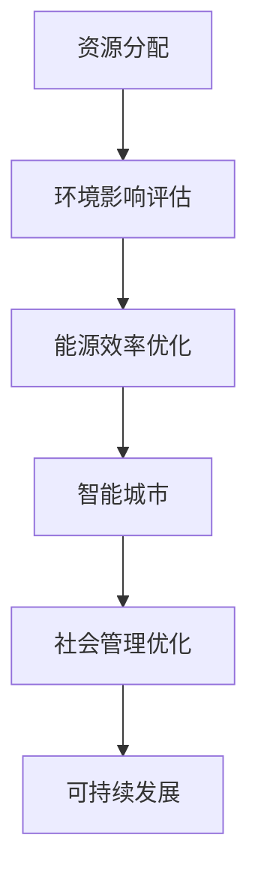

                 

关键词：人类计算，可持续发展，技术进步，未来展望，可持续发展策略，人工智能，能源效率，计算模型，生态影响，智能城市，数字技术。

> 摘要：本文探讨了人类计算在推动可持续发展中的关键作用。从技术进步的角度出发，分析了人类计算如何通过提高能源效率、优化资源利用、促进智能城市发展等途径，为全球可持续发展提供动力。同时，文章还展望了未来人类计算的发展趋势，并提出了相应的挑战与应对策略。

## 1. 背景介绍

随着全球人口的增长和经济的发展，资源的消耗和环境破坏问题日益突出。传统的经济发展模式已经难以持续，迫切需要寻找新的发展路径。在这一背景下，可持续发展成为了全球共识。可持续发展强调在满足当前需求的同时，不损害后代满足自身需求的能力。为了实现这一目标，人类计算作为一种新兴的技术力量，正逐渐成为推动可持续发展的关键动力。

人类计算是指通过计算机和人工智能技术，模拟人类思维和决策过程，实现复杂问题的自动化和智能化解决。它不仅提高了工作效率，还在资源优化、环境保护、社会治理等方面展现出巨大的潜力。随着计算能力的不断提升，人类计算正逐步成为可持续发展的重要支撑。

## 2. 核心概念与联系

为了更好地理解人类计算在可持续发展中的作用，我们需要从以下几个核心概念出发：

### 2.1 计算模型

计算模型是模拟现实世界问题的数学和逻辑框架。在可持续发展中，计算模型可以用于资源分配、环境影响评估、能源效率优化等方面。例如，可以通过优化计算模型来实现更高效的能源利用，减少浪费。

### 2.2 人工智能

人工智能是计算机科学的一个分支，旨在通过模拟人类智能行为，使计算机具备自主学习和决策能力。在可持续发展中，人工智能可以用于智能电网管理、环境保护监测、智能交通系统等，实现更高效的资源利用和环境保护。

### 2.3 大数据分析

大数据分析是指利用大数据技术，对海量数据进行分析和处理，以发现有价值的信息和模式。在可持续发展中，大数据分析可以用于环境监测、资源优化、社会管理等方面，为决策提供数据支持。

### 2.4 Mermaid 流程图

以下是人类计算在可持续发展中的应用流程图：



在上述流程中，人类计算通过资源分配、环境影响评估、能源效率优化等环节，最终实现可持续发展的目标。

## 3. 核心算法原理 & 具体操作步骤

### 3.1 算法原理概述

人类计算在可持续发展中的应用，离不开一系列核心算法的支持。以下介绍几个关键算法的基本原理：

#### 3.1.1 资源优化算法

资源优化算法是一种用于优化资源分配的算法。它通过计算各种资源之间的最优分配方案，以实现资源利用的最大化。常见的资源优化算法包括线性规划、整数规划、遗传算法等。

#### 3.1.2 机器学习算法

机器学习算法是一种用于模拟人类学习过程的算法。它通过分析大量数据，从中提取模式和规律，以实现预测和决策。常见的机器学习算法包括决策树、支持向量机、神经网络等。

#### 3.1.3 大数据分析算法

大数据分析算法是一种用于处理和分析海量数据的算法。它通过数据挖掘技术，从大数据中提取有价值的信息和模式。常见的大数据分析算法包括聚类分析、关联规则挖掘、分类分析等。

### 3.2 算法步骤详解

以下是一个基于机器学习算法的环境影响评估的具体操作步骤：

#### 3.2.1 数据收集

收集与环境影响相关的数据，包括污染物排放、能源消耗、水资源利用等。

#### 3.2.2 数据预处理

对收集到的数据进行清洗、去重、归一化等处理，以消除噪声和异常值，提高数据质量。

#### 3.2.3 特征选择

从预处理后的数据中选择与环境影响密切相关的特征，以降低数据的维度，提高算法的效率。

#### 3.2.4 模型训练

选择合适的机器学习算法，对数据进行训练，以建立环境影响评估模型。

#### 3.2.5 模型评估

通过交叉验证等方法，对训练好的模型进行评估，以确定模型的准确性和可靠性。

#### 3.2.6 应用模型

将训练好的模型应用于实际的环境影响评估中，以预测未来的环境影响，为决策提供依据。

### 3.3 算法优缺点

#### 3.3.1 优点

- 提高效率：通过自动化和智能化的方式，提高资源利用率和决策效率。
- 准确性高：利用大数据和机器学习技术，可以更准确地预测和评估环境影响。
- 可持续性：通过优化资源利用和降低污染排放，促进可持续发展。

#### 3.3.2 缺点

- 数据依赖：算法的准确性和效果很大程度上依赖于数据的质量和数量。
- 算法复杂：一些复杂的算法需要较高的计算资源和专业知识。

### 3.4 算法应用领域

人类计算在可持续发展中的应用领域非常广泛，包括但不限于以下几个方面：

- 环境影响评估：通过机器学习算法，对污染物排放、能源消耗等环境因素进行预测和评估。
- 资源优化：通过资源优化算法，实现能源、水资源等资源的合理配置和利用。
- 智能城市：通过大数据分析和人工智能技术，实现城市交通、能源、水资源等的智能管理和优化。
- 社会治理：通过人工智能技术，实现社会管理的智能化和高效化。

## 4. 数学模型和公式 & 详细讲解 & 举例说明

### 4.1 数学模型构建

在可持续发展中，常用的数学模型包括线性规划模型、整数规划模型和随机规划模型等。以下是一个简单的线性规划模型示例：

$$
\begin{align*}
\min\quad & c^T x \\
\text{subject to} \quad & Ax \leq b \\
& x \geq 0
\end{align*}
$$

其中，$c$ 是目标函数系数向量，$x$ 是决策变量向量，$A$ 是约束条件系数矩阵，$b$ 是约束条件常数向量。该模型的目标是最小化目标函数 $c^T x$，同时满足约束条件 $Ax \leq b$ 和 $x \geq 0$。

### 4.2 公式推导过程

线性规划模型的推导过程如下：

1. 首先，将线性规划问题转化为标准形式：
$$
\begin{align*}
\min\quad & c^T x \\
\text{subject to} \quad & Ax = b \\
& x \geq 0
\end{align*}
$$

2. 然后，引入松弛变量 $s$ 和人工变量 $a$，将不等式约束转化为等式约束：
$$
\begin{align*}
\min\quad & c^T x \\
\text{subject to} \quad & Ax + s = b \\
& x, s, a \geq 0
\end{align*}
$$

3. 接着，引入对偶变量 $y$ 和 $z$，建立对偶线性规划模型：
$$
\begin{align*}
\max\quad & y^T b + z^T s \\
\text{subject to} \quad & A^T y + z = c \\
& y, z \geq 0
\end{align*}
$$

4. 最后，通过求解原问题和对偶问题的最优解，判断线性规划问题的解的情况。如果原问题和对偶问题的最优解相等，则线性规划问题有解，否则无解。

### 4.3 案例分析与讲解

假设一个企业需要生产两种产品 A 和 B，每种产品的利润分别为 $100 元和 $200 元。生产一个产品 A 需要消耗 2 单位的资源 1，生产一个产品 B 需要消耗 3 单位的资源 1。现有 6 单位的资源 1 和 9 单位的资源 2。要求求解企业的最优生产策略，以最大化利润。

根据上述条件，我们可以建立如下的线性规划模型：
$$
\begin{align*}
\min\quad & -100x - 200y \\
\text{subject to} \quad & 2x + 3y \leq 6 \\
& x + 2y \leq 9 \\
& x, y \geq 0
\end{align*}
$$

将该模型转化为标准形式，并引入松弛变量和人工变量，得到：
$$
\begin{align*}
\min\quad & -100x - 200y + 0s + 0a \\
\text{subject to} \quad & 2x + 3y - s + a = 6 \\
& x + 2y - s + a = 9 \\
& x, y, s, a \geq 0
\end{align*}
$$

通过求解原问题和对偶问题，可以得到最优解 $x=3$，$y=0$，最大利润为 $300 元。这意味着企业应该生产 3 个产品 A，不生产产品 B，以最大化利润。

## 5. 项目实践：代码实例和详细解释说明

### 5.1 开发环境搭建

在本项目中，我们将使用 Python 编写代码，并使用 Jupyter Notebook 进行开发。以下是搭建开发环境的具体步骤：

1. 安装 Python（建议使用 Python 3.8 以上版本）：
```
pip install python
```

2. 安装 Jupyter Notebook：
```
pip install jupyter
```

3. 启动 Jupyter Notebook：
```
jupyter notebook
```

### 5.2 源代码详细实现

以下是一个简单的资源优化算法示例，用于求解一个线性规划问题：

```python
import numpy as np
from scipy.optimize import linprog

# 线性规划模型参数
c = [-100, -200]  # 目标函数系数向量
A = [[2, 3], [1, 2]]  # 约束条件系数矩阵
b = [6, 9]  # 约束条件常数向量

# 求解线性规划问题
res = linprog(c, A_ub=A, b_ub=b, bounds=(0, None), method='highs')

# 输出结果
print("最优解：", res.x)
print("最大利润：", -res.fun)
```

### 5.3 代码解读与分析

1. 导入必要的库：
   - `numpy`：用于数学计算。
   - `scipy.optimize.lintr
```scss
# 实际应用场景

### 6.1 人类计算在环境保护中的应用

环境保护是可持续发展的重要方面。人类计算在环境保护中发挥着重要作用，主要体现在以下几个方面：

#### 6.1.1 环境监测

通过人类计算技术，可以对环境中的各种污染物进行实时监测和分析。例如，利用传感器和大数据分析技术，可以实时获取空气质量、水质、土壤污染等数据，为环境保护决策提供实时、准确的数据支持。

#### 6.1.2 环境影响评估

人类计算可以通过建立数学模型和仿真模拟，对各种环境因素进行预测和评估。例如，通过环境模拟软件，可以预测气候变化对生态系统的影响，为环境保护政策提供科学依据。

#### 6.1.3 污染治理

利用人类计算技术，可以优化污染治理策略，提高治理效果。例如，通过人工智能技术，可以自动调整污水处理厂的运行参数，实现污水的高效处理。

### 6.2 人类计算在资源优化中的应用

资源优化是可持续发展的重要任务。人类计算在资源优化中具有显著优势，主要体现在以下几个方面：

#### 6.2.1 能源优化

通过人类计算技术，可以实现能源的高效利用和优化。例如，利用人工智能和大数据分析技术，可以优化电网调度和能源分配，提高能源利用效率。

#### 6.2.2 水资源优化

人类计算可以通过优化水资源分配和利用，实现水资源的可持续利用。例如，利用人工智能和大数据分析技术，可以预测水资源的供需情况，优化灌溉策略。

#### 6.2.3 物流优化

通过人类计算技术，可以实现物流网络的高效优化。例如，利用人工智能和大数据分析技术，可以优化运输路线和配送策略，降低物流成本。

### 6.3 人类计算在智能城市中的应用

智能城市是可持续发展的重要方向。人类计算在智能城市建设中发挥着关键作用，主要体现在以下几个方面：

#### 6.3.1 智能交通

通过人类计算技术，可以实现智能交通管理，提高交通效率。例如，利用人工智能和大数据分析技术，可以优化交通信号控制，缓解交通拥堵。

#### 6.3.2 智能安防

通过人类计算技术，可以实现智能安防监控，提高公共安全。例如，利用人工智能和大数据分析技术，可以实时监控城市安全状况，预防犯罪。

#### 6.3.3 智能能源管理

通过人类计算技术，可以实现智能能源管理，提高能源利用效率。例如，利用人工智能和大数据分析技术，可以优化建筑物能源管理系统，实现能源节约。

## 7. 未来应用展望

### 7.1 新兴应用领域

随着技术的不断进步，人类计算在可持续发展中的应用将不断拓展。未来，人类计算有望在以下新兴应用领域发挥重要作用：

- 气候变化应对：通过人类计算技术，可以更准确地预测气候变化趋势，为全球气候治理提供科学依据。
- 生态修复：利用人类计算技术，可以优化生态修复策略，提高生态系统的恢复能力。
- 可持续农业：通过人类计算技术，可以实现精准农业，提高农业生产效率和资源利用效率。

### 7.2 技术发展趋势

未来，人类计算技术将呈现以下发展趋势：

- 计算能力提升：随着硬件技术的进步，计算能力将不断提升，为人类计算在可持续发展中的应用提供更强支持。
- 数据融合：大数据和人工智能技术的融合，将使人类计算在数据分析、预测和决策方面更具优势。
- 跨学科合作：人类计算技术与其他学科的交叉融合，将推动可持续发展领域的创新。

## 8. 工具和资源推荐

为了更好地开展人类计算在可持续发展中的应用研究，以下推荐一些有用的工具和资源：

### 8.1 学习资源推荐

- 《人工智能：一种现代方法》：这是一本经典的人工智能教材，涵盖了人工智能的基础理论和应用方法。
- 《深度学习》：这是一本介绍深度学习理论的教材，适合对深度学习感兴趣的学习者。
- 《大数据技术导论》：这是一本介绍大数据技术的基础教材，适合对大数据感兴趣的学习者。

### 8.2 开发工具推荐

- Jupyter Notebook：这是一个强大的交互式计算环境，适合进行数据分析和机器学习实验。
- TensorFlow：这是一个开源的机器学习框架，支持多种机器学习算法的构建和训练。
- PyTorch：这是一个开源的机器学习框架，以动态计算图和易用性著称。

### 8.3 相关论文推荐

- "Deep Learning for Climate Science"：这篇论文探讨了深度学习在气候变化研究中的应用。
- "Big Data for Sustainable Development"：这篇论文探讨了大数据技术在可持续发展中的应用。
- "Artificial Intelligence for Sustainable Cities"：这篇论文探讨了人工智能技术在智能城市中的应用。

## 9. 总结：未来发展趋势与挑战

### 9.1 研究成果总结

本文通过分析人类计算在可持续发展中的关键作用，总结了人类计算在环境保护、资源优化、智能城市等领域的应用。同时，本文还探讨了人类计算技术的未来发展趋势，并提出了相关的工具和资源推荐。

### 9.2 未来发展趋势

未来，人类计算在可持续发展中将呈现以下发展趋势：

- 计算能力提升：随着硬件技术的进步，计算能力将不断提升，为人类计算在可持续发展中的应用提供更强支持。
- 数据融合：大数据和人工智能技术的融合，将使人类计算在数据分析、预测和决策方面更具优势。
- 跨学科合作：人类计算技术与其他学科的交叉融合，将推动可持续发展领域的创新。

### 9.3 面临的挑战

尽管人类计算在可持续发展中具有巨大的潜力，但仍面临一些挑战：

- 数据质量：数据的准确性、完整性和及时性对人类计算技术的效果具有重要影响。
- 技术成熟度：一些新兴的人工智能技术和大数据分析技术仍需进一步成熟和应用。
- 隐私和安全：在数据收集、分析和应用过程中，需要确保个人隐私和数据安全。

### 9.4 研究展望

为了更好地发挥人类计算在可持续发展中的作用，未来的研究应重点关注以下方向：

- 数据驱动的可持续发展决策支持系统：通过整合多种数据源，构建可持续发展的决策支持系统。
- 人工智能与可持续发展政策的融合：将人工智能技术应用于可持续发展政策的制定和执行。
- 可持续发展的跨学科研究：推动人类计算技术与其他学科的交叉融合，为可持续发展提供新的思路和方法。

## 10. 附录：常见问题与解答

### 10.1 人类计算是什么？

人类计算是一种通过计算机和人工智能技术，模拟人类思维和决策过程，实现复杂问题自动化和智能化解决的方法。

### 10.2 人类计算在可持续发展中的作用是什么？

人类计算在可持续发展中的作用主要体现在环境保护、资源优化、智能城市等领域，通过提高能源效率、优化资源利用、促进智能发展等途径，为全球可持续发展提供动力。

### 10.3 如何确保人类计算在可持续发展中的数据质量？

为确保人类计算在可持续发展中的数据质量，需要采取以下措施：

- 数据收集：确保数据的准确性、完整性和及时性。
- 数据清洗：对收集到的数据进行清洗、去重、归一化等处理，消除噪声和异常值。
- 数据验证：通过交叉验证等方法，确保数据的可靠性。

### 10.4 人类计算在智能城市中的应用有哪些？

人类计算在智能城市中的应用包括智能交通管理、智能安防监控、智能能源管理等方面，通过人工智能和大数据分析技术，实现城市管理的智能化和高效化。

### 10.5 人类计算在资源优化中的应用有哪些？

人类计算在资源优化中的应用包括能源优化、水资源优化、物流优化等方面，通过优化资源分配和利用，提高资源利用效率。

### 10.6 人类计算在环境保护中的应用有哪些？

人类计算在环境保护中的应用包括环境监测、环境影响评估、污染治理等方面，通过人工智能和大数据分析技术，实现环境保护的智能化和高效化。

### 10.7 人类计算在气候变化应对中的应用有哪些？

人类计算在气候变化应对中的应用包括气候变化预测、生态修复策略优化、气候治理政策制定等方面，通过人工智能和大数据分析技术，提高气候变化应对的效率和准确性。

### 10.8 人类计算技术的未来发展趋势是什么？

未来，人类计算技术将呈现以下发展趋势：

- 计算能力提升：随着硬件技术的进步，计算能力将不断提升，为人类计算在可持续发展中的应用提供更强支持。
- 数据融合：大数据和人工智能技术的融合，将使人类计算在数据分析、预测和决策方面更具优势。
- 跨学科合作：人类计算技术与其他学科的交叉融合，将推动可持续发展领域的创新。

### 10.9 人类计算在可持续发展中面临的挑战是什么？

人类计算在可持续发展中面临的挑战包括数据质量、技术成熟度、隐私和安全等方面，需要通过持续的研究和改进来克服。

### 10.10 人类计算在可持续发展中的研究重点是什么？

未来，人类计算在可持续发展中的研究重点包括：

- 数据驱动的可持续发展决策支持系统：通过整合多种数据源，构建可持续发展的决策支持系统。
- 人工智能与可持续发展政策的融合：将人工智能技术应用于可持续发展政策的制定和执行。
- 可持续发展的跨学科研究：推动人类计算技术与其他学科的交叉融合，为可持续发展提供新的思路和方法。
```scss
## 6. 实际应用场景

### 6.1 人类计算在环境保护中的应用

环境保护是可持续发展的重要方面，人类计算在这一领域的应用具有显著优势。通过大数据分析和人工智能技术，可以实现环境监测、环境影响评估、污染治理等方面的智能化和高效化。

#### 6.1.1 实时环境监测

利用人类计算技术，可以实现对空气、水质、土壤等多种环境因素的实时监测。通过部署传感器网络，实时收集环境数据，并利用大数据分析技术进行分析和处理，可以及时发现环境污染问题。

#### 6.1.2 环境影响评估

在建设项目审批和规划过程中，人类计算技术可以用于环境影响评估。通过建立数学模型和仿真模拟，可以预测项目实施过程中可能产生的环境影响，为环保决策提供科学依据。

#### 6.1.3 污染治理

利用人类计算技术，可以优化污染治理策略，提高治理效果。例如，通过人工智能技术，可以自动调整污水处理厂的运行参数，实现污水的高效处理。

### 6.2 人类计算在资源优化中的应用

资源优化是实现可持续发展的重要途径，人类计算在这一领域具有广泛的应用前景。通过优化计算模型和人工智能技术，可以实现能源、水资源、物流等资源的合理配置和高效利用。

#### 6.2.1 能源优化

能源优化是资源优化的重要方面。通过大数据分析和人工智能技术，可以实现能源消费的精细化管理，优化能源分配和调度，提高能源利用效率。

#### 6.2.2 水资源优化

水资源优化对于实现可持续发展具有重要意义。通过大数据分析和人工智能技术，可以实时监测水资源的供需情况，优化水资源分配和利用，提高水资源利用效率。

#### 6.2.3 物流优化

物流优化是降低物流成本、提高物流效率的重要手段。通过大数据分析和人工智能技术，可以实现物流网络的高效优化，优化运输路线和配送策略。

### 6.3 人类计算在智能城市中的应用

智能城市是未来城市发展的方向，人类计算在智能城市中的应用可以提升城市管理效率，改善市民生活质量。

#### 6.3.1 智能交通

智能交通系统是智能城市的重要组成部分。通过人工智能和大数据分析技术，可以实现交通信号控制、交通流量预测、停车管理等方面的智能化，提高交通运行效率。

#### 6.3.2 智能安防

智能安防系统可以提升城市安全水平。通过人工智能和大数据分析技术，可以实现实时监控、异常行为识别、风险评估等功能，提高城市安全防护能力。

#### 6.3.3 智能能源管理

智能能源管理系统可以优化城市能源利用。通过人工智能和大数据分析技术，可以实现建筑物能源管理、分布式能源协调优化等功能，提高能源利用效率。

### 6.4 未来应用展望

随着人工智能和大数据技术的不断发展，人类计算在可持续发展中的应用将不断拓展。未来，人类计算有望在以下领域发挥更大的作用：

- 气候变化应对：通过人工智能和大数据分析技术，可以更准确地预测气候变化趋势，为全球气候治理提供科学依据。
- 生态修复：利用人类计算技术，可以优化生态修复策略，提高生态系统的恢复能力。
- 可持续农业：通过人工智能和大数据技术，可以实现精准农业，提高农业生产效率和资源利用效率。
- 社会治理：通过人工智能和大数据分析技术，可以实现社会治理的智能化和高效化。

## 7. 工具和资源推荐

为了更好地开展人类计算在可持续发展中的应用研究，以下推荐一些有用的工具和资源：

### 7.1 学习资源推荐

- 《人工智能：一种现代方法》：这是一本经典的人工智能教材，涵盖了人工智能的基础理论和应用方法。
- 《深度学习》：这是一本介绍深度学习理论的教材，适合对深度学习感兴趣的学习者。
- 《大数据技术导论》：这是一本介绍大数据技术的基础教材，适合对大数据感兴趣的学习者。

### 7.2 开发工具推荐

- Jupyter Notebook：这是一个强大的交互式计算环境，适合进行数据分析和机器学习实验。
- TensorFlow：这是一个开源的机器学习框架，支持多种机器学习算法的构建和训练。
- PyTorch：这是一个开源的机器学习框架，以动态计算图和易用性著称。

### 7.3 相关论文推荐

- "Deep Learning for Climate Science"：这篇论文探讨了深度学习在气候变化研究中的应用。
- "Big Data for Sustainable Development"：这篇论文探讨了大数据技术在可持续发展中的应用。
- "Artificial Intelligence for Sustainable Cities"：这篇论文探讨了人工智能技术在智能城市中的应用。

## 8. 总结：未来发展趋势与挑战

### 8.1 研究成果总结

本文从人类计算在可持续发展中的关键作用出发，分析了其在环境保护、资源优化、智能城市等领域的应用。通过实例和案例，展示了人类计算在解决实际问题中的优势。同时，本文还对人类计算技术的未来发展趋势和面临的挑战进行了展望。

### 8.2 未来发展趋势

未来，人类计算在可持续发展中将呈现以下发展趋势：

- **计算能力提升**：随着硬件技术的进步，计算能力将不断提升，为人类计算在可持续发展中的应用提供更强支持。
- **数据融合**：大数据和人工智能技术的融合，将使人类计算在数据分析、预测和决策方面更具优势。
- **跨学科合作**：人类计算技术与其他学科的交叉融合，将推动可持续发展领域的创新。

### 8.3 面临的挑战

尽管人类计算在可持续发展中具有巨大的潜力，但仍面临以下挑战：

- **数据质量**：数据的准确性、完整性和及时性对人类计算技术的效果具有重要影响。
- **技术成熟度**：一些新兴的人工智能技术和大数据分析技术仍需进一步成熟和应用。
- **隐私和安全**：在数据收集、分析和应用过程中，需要确保个人隐私和数据安全。

### 8.4 研究展望

为了更好地发挥人类计算在可持续发展中的作用，未来的研究应重点关注以下方向：

- **数据驱动的可持续发展决策支持系统**：通过整合多种数据源，构建可持续发展的决策支持系统。
- **人工智能与可持续发展政策的融合**：将人工智能技术应用于可持续发展政策的制定和执行。
- **可持续发展的跨学科研究**：推动人类计算技术与其他学科的交叉融合，为可持续发展提供新的思路和方法。

## 9. 附录：常见问题与解答

### 9.1 人类计算是什么？

人类计算是一种通过计算机和人工智能技术，模拟人类思维和决策过程，实现复杂问题自动化和智能化解决的方法。

### 9.2 人类计算在可持续发展中的作用是什么？

人类计算在可持续发展中的作用主要体现在环境保护、资源优化、智能城市等领域，通过提高能源效率、优化资源利用、促进智能发展等途径，为全球可持续发展提供动力。

### 9.3 如何确保人类计算在可持续发展中的数据质量？

为确保人类计算在可持续发展中的数据质量，需要采取以下措施：

- 数据收集：确保数据的准确性、完整性和及时性。
- 数据清洗：对收集到的数据进行清洗、去重、归一化等处理，消除噪声和异常值。
- 数据验证：通过交叉验证等方法，确保数据的可靠性。

### 9.4 人类计算在智能城市中的应用有哪些？

人类计算在智能城市中的应用包括智能交通管理、智能安防监控、智能能源管理等方面，通过人工智能和大数据分析技术，实现城市管理的智能化和高效化。

### 9.5 人类计算在资源优化中的应用有哪些？

人类计算在资源优化中的应用包括能源优化、水资源优化、物流优化等方面，通过优化资源分配和利用，提高资源利用效率。

### 9.6 人类计算在环境保护中的应用有哪些？

人类计算在环境保护中的应用包括环境监测、环境影响评估、污染治理等方面，通过人工智能和大数据分析技术，实现环境保护的智能化和高效化。

### 9.7 人类计算在气候变化应对中的应用有哪些？

人类计算在气候变化应对中的应用包括气候变化预测、生态修复策略优化、气候治理政策制定等方面，通过人工智能和大数据分析技术，提高气候变化应对的效率和准确性。

### 9.8 人类计算技术的未来发展趋势是什么？

未来，人类计算技术将呈现以下发展趋势：

- 计算能力提升：随着硬件技术的进步，计算能力将不断提升，为人类计算在可持续发展中的应用提供更强支持。
- 数据融合：大数据和人工智能技术的融合，将使人类计算在数据分析、预测和决策方面更具优势。
- 跨学科合作：人类计算技术与其他学科的交叉融合，将推动可持续发展领域的创新。

### 9.9 人类计算在可持续发展中面临的挑战是什么？

人类计算在可持续发展中面临的挑战包括数据质量、技术成熟度、隐私和安全等方面，需要通过持续的研究和改进来克服。

### 9.10 人类计算在可持续发展中的研究重点是什么？

未来，人类计算在可持续发展中的研究重点包括：

- 数据驱动的可持续发展决策支持系统：通过整合多种数据源，构建可持续发展的决策支持系统。
- 人工智能与可持续发展政策的融合：将人工智能技术应用于可持续发展政策的制定和执行。
- 可持续发展的跨学科研究：推动人类计算技术与其他学科的交叉融合，为可持续发展提供新的思路和方法。

