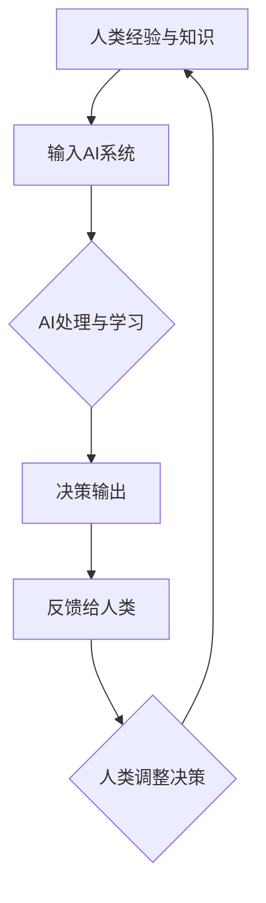

                 

关键词：人工智能、人类计算、决策增强、计算架构、数学模型

摘要：在人工智能（AI）日益普及的今天，人类计算的作用变得更加重要。本文旨在探讨如何利用人类计算来增强AI决策，从核心概念、算法原理、数学模型到实际应用场景，全面解析人类计算在AI时代的重要性与潜力。

## 1. 背景介绍

人工智能的发展经历了数个阶段，从早期的符号逻辑到现代的深度学习，AI的应用已经渗透到生活的方方面面。然而，尽管AI在处理大规模数据和复杂问题方面表现出色，但在某些方面仍存在局限。例如，AI系统在处理模糊性、直觉判断以及价值观等方面仍无法完全替代人类。

### 1.1 人类计算的重要性

人类计算，作为一种基于人类经验和直觉的决策方法，能够在AI无法胜任的领域发挥独特的作用。例如，在医疗诊断中，医生的经验和直觉往往能够帮助识别出AI系统难以检测到的细微症状。因此，如何将人类计算与AI相结合，形成一种互补的关系，是当前研究的热点。

### 1.2 AI与人类计算的协同

AI和人类计算并非对立关系，而是可以相互补充。通过将人类计算引入AI系统，可以增强AI的决策能力，使其更加智能和灵活。这种协同效应在复杂决策问题中尤为重要，如金融投资、城市规划等。

## 2. 核心概念与联系

为了更好地理解人类计算与AI的协同作用，我们需要了解一些核心概念和联系。

### 2.1 人类计算的概念

人类计算指的是人类基于经验、直觉和知识进行决策的过程。这种计算过程是非线性的、动态的，并且依赖于人类的认知和情感。

### 2.2 AI的概念

AI是指计算机系统通过模拟人类智能行为，实现自动化决策和执行的能力。AI系统通常基于算法和数学模型，通过训练和学习来提高其性能。

### 2.3 人类计算与AI的联系

人类计算和AI之间的联系主要体现在以下几个方面：

- **知识共享**：人类可以通过向AI系统输入经验和知识，帮助AI更好地理解和处理问题。
- **反馈循环**：AI系统可以基于其决策结果向人类提供反馈，帮助人类调整和优化决策过程。
- **协同工作**：人类和AI可以共同参与决策，利用各自的优势来提高决策的准确性和效率。

### 2.4 Mermaid 流程图

以下是一个简化的Mermaid流程图，展示了人类计算与AI协同工作的基本流程。



## 3. 核心算法原理 & 具体操作步骤

为了实现人类计算与AI的协同，我们需要一些核心算法来支持这一过程。

### 3.1 算法原理概述

核心算法主要包括以下几种：

- **增强学习**：通过不断尝试和反馈，使AI系统能够自我学习和优化。
- **多代理系统**：多个AI代理共同协作，以提高决策的效率和准确性。
- **混合推理**：结合符号逻辑和概率模型，实现更加灵活和可靠的决策。

### 3.2 算法步骤详解

以下是这些算法的具体步骤：

#### 增强学习

1. **初始化**：设定初始参数和目标。
2. **探索**：AI系统根据当前状态进行探索，以获得更多信息。
3. **反馈**：基于反馈调整决策策略。
4. **更新**：根据调整后的策略更新模型参数。

#### 多代理系统

1. **初始化**：设定每个代理的初始状态和目标。
2. **通信**：代理之间进行信息交换。
3. **决策**：每个代理根据自身状态和通信信息进行决策。
4. **协作**：代理之间协同执行决策。

#### 混合推理

1. **符号化**：将问题转化为符号形式。
2. **推理**：利用符号逻辑进行推理。
3. **概率化**：将推理结果转化为概率模型。
4. **决策**：根据概率模型进行决策。

### 3.3 算法优缺点

- **增强学习**：优点是能够自适应环境变化，缺点是需要大量数据和时间。
- **多代理系统**：优点是能够提高决策效率和准确性，缺点是通信复杂度高。
- **混合推理**：优点是能够结合符号逻辑和概率模型的优点，缺点是计算复杂度高。

### 3.4 算法应用领域

这些算法可以应用于多个领域，如：

- **医疗诊断**：利用增强学习进行疾病预测和诊断。
- **金融投资**：利用多代理系统进行市场分析和投资决策。
- **城市规划**：利用混合推理进行交通流量预测和城市规划。

## 4. 数学模型和公式 & 详细讲解 & 举例说明

为了更深入地理解核心算法，我们需要介绍相关的数学模型和公式。

### 4.1 数学模型构建

以下是几个常用的数学模型：

- **马尔可夫决策过程（MDP）**：用于描述具有不确定性环境的决策问题。
- **贝尔曼方程**：用于求解MDP的最优策略。
- **马尔可夫链**：用于描述状态转移概率。

### 4.2 公式推导过程

以下是贝尔曼方程的推导过程：

$$
V^*(s) = \max_{a} \{r(s, a) + \gamma \sum_{s'} P(s' | s, a) V^*(s')\}
$$

其中，$V^*(s)$ 表示在状态 $s$ 下采取最优策略的期望回报，$r(s, a)$ 表示在状态 $s$ 下采取行动 $a$ 的即时回报，$P(s' | s, a)$ 表示在状态 $s$ 下采取行动 $a$ 后转移到状态 $s'$ 的概率，$\gamma$ 是折扣因子。

### 4.3 案例分析与讲解

以下是一个简单的MDP案例，用于说明贝尔曼方程的应用。

假设我们有一个简单的游戏，有两个状态：赢和输。在每个状态中，我们可以选择采取行动 A 或行动 B。每个行动都有一定的概率导致状态转移和回报。

| 状态 | 行动 | 转移概率 | 回报 |
| ---- | ---- | ---- | ---- |
| 赢   | A   | 0.7  | 1    |
| 赢   | B   | 0.3  | 0    |
| 输   | A   | 0.4  | -1   |
| 输   | B   | 0.6  | 0    |

根据贝尔曼方程，我们可以计算出每个状态的最优回报：

$$
V^*(赢) = \max \{1 + 0.7 \times V^*(赢) + 0.3 \times 0, -1 + 0.4 \times V^*(赢) + 0.6 \times 0\}
$$

$$
V^*(输) = \max \{0 + 0.7 \times V^*(输), 0 + 0.4 \times V^*(输) + 0.6 \times 0\}
$$

通过迭代求解，我们可以得到最优策略：在状态赢时选择行动 A，在状态输时选择行动 A。

## 5. 项目实践：代码实例和详细解释说明

为了更好地理解人类计算与AI协同的原理，我们提供了一个简单的Python代码实例，用于实现一个基于增强学习的决策系统。

### 5.1 开发环境搭建

确保安装了Python 3.6及以上版本，以及以下依赖库：

```bash
pip install numpy matplotlib
```

### 5.2 源代码详细实现

以下是一个简单的增强学习代码实例：

```python
import numpy as np
import matplotlib.pyplot as plt

# 增强学习参数
alpha = 0.1
gamma = 0.9
epsilon = 0.1

# 状态空间
S = ['win', 'lose']

# 行动空间
A = ['A', 'B']

# 状态转移概率和回报
P = {
    'win': {'A': {'win': 0.7, 'lose': 0.3}, 'B': {'win': 0.3, 'lose': 0.7}},
    'lose': {'A': {'win': 0.4, 'lose': 0.6}, 'B': {'win': 0.6, 'lose': 0.4}}
}
R = {
    'win': {'A': 1, 'B': 0},
    'lose': {'A': -1, 'B': 0}
}

# 初始化策略和价值函数
policy = {state: action for state, action in zip(S, A)}
V = {state: 0 for state in S}

# 增强学习迭代
for episode in range(1000):
    state = np.random.choice(S)
    done = False
    while not done:
        action = np.random.choice(A, p=[epsilon, 1-epsilon])
        next_state = np.random.choice(S, p=P[state][action])
        reward = R[state][action]
        value = V[state]
        next_value = V[next_state]
        V[state] = V[state] + alpha * (reward + gamma * next_value - value)
        state = next_state
        if state == 'lose':
            done = True

# 可视化价值函数
plt.bar(S, list(V.values()))
plt.xlabel('State')
plt.ylabel('Value')
plt.title('Value Function')
plt.show()
```

### 5.3 代码解读与分析

这段代码实现了一个简单的增强学习决策系统，用于在两个状态（赢和输）之间进行选择。我们通过迭代更新策略和价值函数，以最大化期望回报。

- **参数设置**：alpha 是学习率，gamma 是折扣因子，epsilon 是探索率。
- **状态空间和行动空间**：定义了两个状态和两个行动。
- **状态转移概率和回报**：定义了每个状态和行动的转移概率和回报。
- **初始化策略和价值函数**：初始化策略和价值函数，并使用随机策略进行初始探索。
- **增强学习迭代**：在每个迭代中，根据当前状态和行动选择下一个状态，并更新策略和价值函数。
- **可视化价值函数**：使用条形图可视化最终的价值函数。

通过这个实例，我们可以看到如何将人类计算（经验、直觉）与AI（增强学习）相结合，以实现更智能的决策。

## 6. 实际应用场景

人类计算在AI时代有着广泛的应用场景，以下是一些典型的例子：

### 6.1 医疗诊断

在医疗诊断中，医生的经验和直觉对于确诊疾病至关重要。通过将AI系统与医生的经验相结合，可以显著提高诊断的准确性和效率。

### 6.2 金融投资

金融投资领域需要处理大量的数据和信息，通过人类计算与AI的协同，可以更好地识别市场趋势和风险，从而提高投资决策的准确性。

### 6.3 城市规划

城市规划需要综合考虑人口、环境、经济等多方面因素，通过人类计算与AI的协同，可以更有效地制定城市规划方案，提高城市运行效率。

### 6.4 教育辅导

在教育辅导中，教师的经验和判断对于学生的成长至关重要。通过将AI系统与教师的经验相结合，可以提供更加个性化的教育服务。

## 7. 工具和资源推荐

为了更好地研究和应用人类计算与AI的协同，以下是一些建议的工具和资源：

### 7.1 学习资源推荐

- 《强化学习：原理与Python实践》
- 《深度学习：原理及实践》
- 《人工智能：一种现代的方法》

### 7.2 开发工具推荐

- TensorFlow：用于构建和训练深度学习模型。
- PyTorch：用于构建和训练深度学习模型。
- Scikit-learn：用于机器学习算法的实现和应用。

### 7.3 相关论文推荐

- "Deep Reinforcement Learning for Navigation in High-Dimensional Environments"（高维度环境下的深度强化学习导航）
- "Multi-Agent Reinforcement Learning in the Patient Game"（患者游戏中的多代理强化学习）
- "Learning to Learn from Demonstrations"（从示范中学习）

## 8. 总结：未来发展趋势与挑战

在AI时代，人类计算的重要性日益凸显。未来，人类计算与AI的协同将朝着更加智能化、个性化的方向发展。然而，这一过程中也面临着一些挑战：

### 8.1 研究成果总结

- 人类计算与AI的协同能够显著提高决策的准确性和效率。
- 增强学习、多代理系统和混合推理等核心算法在协同中发挥了重要作用。
- 数学模型和公式为理解和应用这些算法提供了理论支持。

### 8.2 未来发展趋势

- 人类计算与AI的协同将进一步深入各个领域，推动社会进步。
- 算法将更加智能化和自适应，能够更好地应对复杂和动态的环境。

### 8.3 面临的挑战

- 如何在保证准确性的同时提高计算效率和可解释性。
- 如何处理大量的数据和复杂的模型，确保系统的稳定性和安全性。

### 8.4 研究展望

- 未来研究将重点关注算法的创新和应用，探索更有效的协同方法。
- 将人类计算与AI相结合，构建更加智能和高效的决策系统。

## 9. 附录：常见问题与解答

### 9.1 人类计算与AI的协同是如何实现的？

通过将人类经验和知识转化为算法模型，并与AI系统相结合，可以实现人类计算与AI的协同。具体方法包括增强学习、多代理系统和混合推理等。

### 9.2 人类计算在AI时代的重要性是什么？

人类计算能够弥补AI系统在处理模糊性、直觉判断和价值观等方面的不足，与AI协同工作，提高决策的准确性和效率。

### 9.3 人类计算与AI协同有哪些应用场景？

人类计算与AI协同在医疗诊断、金融投资、城市规划和教育辅导等领域有广泛的应用。这些应用能够提高决策的准确性和效率，推动社会进步。

---

在AI时代，人类计算与AI的协同是提升决策质量和效率的关键。通过理解核心概念、算法原理、数学模型，以及实践中的应用案例，我们可以更好地把握这一趋势，迎接未来的挑战。让我们共同探索人类计算与AI的协同之路，共创更加智能和高效的未来。作者：禅与计算机程序设计艺术 / Zen and the Art of Computer Programming。

