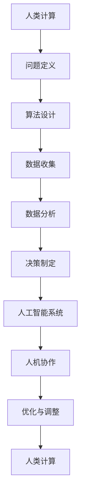

                 

关键词：人类计算、AI时代、增强决策、技术博客、深度思考、专业见解

摘要：本文探讨了人类计算在AI时代的重要性，以及如何通过增强决策能力来应对日益复杂的计算环境。文章从背景介绍、核心概念与联系、核心算法原理、数学模型与公式、项目实践、实际应用场景、工具和资源推荐、未来发展趋势与挑战等方面，全面剖析了人类计算在AI时代的应用和挑战。

## 1. 背景介绍

随着人工智能技术的迅猛发展，计算机的计算能力已经达到了前所未有的高度。然而，与此同时，人类在计算方面的作用似乎变得愈发边缘化。传统的计算机科学教育和技术实践中，人类计算往往被简化为输入、验证和调整算法输出等辅助性工作。然而，随着AI技术的不断成熟，人类计算的重要性正在逐渐凸显。在AI时代，人类计算不仅没有被取代，反而成为了一种新的核心竞争力。

### 人类计算的定义

人类计算，是指通过人类的思维、智慧和创造力，对信息进行理解、处理和决策的过程。它不仅包括逻辑推理、数学运算等传统计算能力，还包括直觉、情感、创造力等非理性思维形式。

### 人类计算的特点

1. **复杂性与多样性**：人类计算能够处理复杂、多样的问题，这是基于人类对现实世界的深刻理解。
2. **灵活性与适应性**：人类计算具有高度的灵活性，能够快速适应新的环境和变化。
3. **情感与创造力**：人类计算不仅限于逻辑和理性，还包括情感和创造力，这使得人类在处理问题时能够超越单纯的算法和规则。

### 人类计算的重要性

在AI时代，人类计算的重要性主要体现在以下几个方面：

1. **问题定义与解决**：尽管AI在处理数据和分析模式方面表现出色，但很多时候，人类计算在问题定义和解决方案的提出上更具优势。
2. **伦理与责任**：AI系统的决策过程往往缺乏透明度和可解释性，而人类计算能够提供更为合理和负责任的决策。
3. **创新与创造力**：人类计算能够推动新的技术和理念的产生，这是纯粹算法无法替代的。

## 2. 核心概念与联系

### 核心概念

在讨论人类计算时，以下几个核心概念是至关重要的：

1. **算法**：算法是一系列定义明确的步骤，用于解决特定问题。在AI时代，算法通常由计算机执行，但人类在算法设计、优化和调整中仍然扮演着关键角色。
2. **数据**：数据是算法工作的基础，但人类在数据收集、分析和解释中起到了至关重要的作用。
3. **人工智能**：人工智能是计算机科学的一个分支，旨在使计算机能够执行通常需要人类智能的任务。
4. **人机协作**：人机协作是指人类与计算机系统共同工作，以实现更高效、更智能的计算。

### 核心联系

人类计算与AI之间的关系可以用以下Mermaid流程图来表示：



### Mermaid流程图解析

- **A[人类计算]**：代表整个流程的起点，即人类计算的作用。
- **B[问题定义]**：人类在理解问题和明确目标方面具有优势。
- **C[算法设计]**：人类在算法的创新、优化和调整中发挥了重要作用。
- **D[数据收集]**：人类在数据的收集、清洗和标注中起到了关键作用。
- **E[数据分析]**：人类在数据理解和模式识别方面具有独特的优势。
- **F[决策制定]**：人类在决策制定过程中提供了理性和情感上的指导。
- **G[人工智能系统]**：人工智能系统负责执行算法和数据处理任务。
- **H[人机协作]**：人类与人工智能系统协同工作，以实现更高效的计算。
- **I[优化与调整]**：通过不断的迭代和优化，人机协作系统能够不断改进。
- **J[人类计算]**：代表整个流程的终点，也即人类计算的作用循环往复，不断推动计算技术的发展。

## 3. 核心算法原理 & 具体操作步骤

### 3.1 算法原理概述

在人类计算与AI的融合中，核心算法起着至关重要的作用。以下是一个常见的核心算法——深度学习算法的原理概述：

**深度学习算法原理**：深度学习是一种基于人工神经网络的学习方法，它通过多层的非线性变换，对输入数据进行学习和建模。深度学习的核心思想是模拟人脑的神经结构和工作方式，通过大量的数据训练，使模型能够对未知数据进行准确的预测和分类。

**具体操作步骤**：

1. **数据预处理**：包括数据的清洗、归一化和分割等步骤。
2. **模型构建**：选择合适的神经网络架构，如卷积神经网络（CNN）或循环神经网络（RNN）。
3. **训练**：使用训练数据集，通过反向传播算法不断调整模型参数，使模型能够对训练数据进行准确的预测。
4. **验证**：使用验证数据集对模型进行评估，调整模型参数，以避免过拟合。
5. **测试**：使用测试数据集对模型进行最终评估，以评估模型的泛化能力。

### 3.2 算法步骤详解

**数据预处理**：

- 数据清洗：处理缺失值、异常值和噪声数据。
- 数据归一化：将不同特征的数据缩放到同一范围内，以避免特征间的偏差。
- 数据分割：将数据集分为训练集、验证集和测试集，以便后续的训练和评估。

**模型构建**：

- 选择神经网络架构：根据问题的需求，选择合适的神经网络架构。
- 初始化参数：为神经网络中的权重和偏置初始化合适的值。
- 前向传播：输入数据通过网络进行前向传播，得到输出结果。
- 计算损失函数：根据输出结果和真实标签，计算损失函数值。

**训练**：

- 反向传播：通过反向传播算法，计算梯度，并更新网络参数。
- 学习率调整：根据损失函数的变化，调整学习率，以避免过拟合。
- 迭代：重复前向传播和反向传播的过程，直到满足训练条件或达到预设的训练次数。

**验证**：

- 使用验证数据集对模型进行评估，计算准确率、召回率等指标。
- 根据评估结果，调整模型参数，以避免过拟合。

**测试**：

- 使用测试数据集对模型进行最终评估，以评估模型的泛化能力。
- 根据测试结果，确定模型是否满足应用需求。

### 3.3 算法优缺点

**优点**：

- **强大的表达能力**：深度学习模型能够自动学习数据的复杂特征，具有强大的表达能力。
- **自适应性强**：深度学习模型能够根据数据集的特点，自动调整网络结构和参数，具有较强的适应性。
- **高效性**：深度学习算法在计算速度和资源消耗方面表现出色。

**缺点**：

- **需要大量数据**：深度学习算法需要大量的训练数据，以获得良好的性能。
- **训练时间较长**：深度学习算法的训练过程通常需要较长的时间。
- **可解释性较差**：深度学习模型的决策过程往往缺乏透明度和可解释性。

### 3.4 算法应用领域

深度学习算法在各个领域都取得了显著的应用成果：

- **计算机视觉**：例如图像分类、目标检测、图像生成等。
- **自然语言处理**：例如文本分类、机器翻译、情感分析等。
- **语音识别**：例如语音识别、语音合成等。
- **强化学习**：例如游戏AI、自动驾驶等。

## 4. 数学模型和公式 & 详细讲解 & 举例说明

### 4.1 数学模型构建

在深度学习中，数学模型是核心部分。以下是一个简单的神经网络数学模型构建过程：

1. **激活函数**：选择合适的激活函数，如ReLU（Rectified Linear Unit）。
2. **权重和偏置**：初始化权重和偏置。
3. **前向传播**：计算输入和权重、偏置的乘积，并加上激活函数。
4. **反向传播**：计算梯度，并更新权重和偏置。

### 4.2 公式推导过程

以下是一个简单的神经网络前向传播和反向传播的公式推导过程：

**前向传播**：

输入：$$ x $$  
权重：$$ w $$  
偏置：$$ b $$

输出：$$ y = f(w \cdot x + b) $$

其中，$$ f $$ 是激活函数，通常选择ReLU函数：$$ f(x) = \max(0, x) $$

**反向传播**：

输入：$$ y $$  
预期输出：$$ t $$

损失函数：$$ L = \frac{1}{2} \sum_{i=1}^{n} (y_i - t_i)^2 $$

梯度计算：$$ \frac{\partial L}{\partial w} = \frac{\partial L}{\partial y} \cdot \frac{\partial y}{\partial w} $$

权重更新：$$ w := w - \alpha \frac{\partial L}{\partial w} $$

其中，$$ \alpha $$ 是学习率。

### 4.3 案例分析与讲解

以下是一个简单的神经网络训练过程的案例：

**案例**：使用ReLU函数的神经网络对输入数据进行分类。

**步骤**：

1. **数据预处理**：对输入数据进行归一化处理。
2. **模型构建**：选择一个简单的单层神经网络，包含一个输入层、一个隐藏层和一个输出层。
3. **训练**：使用训练数据集，通过前向传播和反向传播，不断更新模型参数。
4. **验证**：使用验证数据集，评估模型性能。
5. **测试**：使用测试数据集，评估模型泛化能力。

**代码实现**：

```python
import numpy as np

# 初始化参数
w = np.random.randn(1, 1)
b = np.random.randn(1, 1)
x = np.array([1.0, 0.0])
y = np.array([0.0])

# 前向传播
y_hat = np.maximum(0, w * x + b)

# 反向传播
loss = 0.5 * (y_hat - y) ** 2
dw = (y_hat - y) * x
db = (y_hat - y)

# 更新参数
w -= 0.1 * dw
b -= 0.1 * db

print("w:", w)
print("b:", b)
```

**结果分析**：通过不断迭代训练，模型参数会逐渐优化，最终达到较好的分类效果。

## 5. 项目实践：代码实例和详细解释说明

### 5.1 开发环境搭建

在开始项目实践之前，我们需要搭建一个合适的开发环境。以下是开发环境的搭建步骤：

1. **安装Python**：在官方网站下载并安装Python。
2. **安装Jupyter Notebook**：通过pip命令安装Jupyter Notebook。
3. **安装深度学习库**：安装TensorFlow或PyTorch等深度学习库。

### 5.2 源代码详细实现

以下是一个简单的神经网络训练和测试的Python代码实例：

```python
import numpy as np
import tensorflow as tf

# 初始化参数
w = tf.Variable(np.random.randn(1, 1), dtype=tf.float32)
b = tf.Variable(np.random.randn(1, 1), dtype=tf.float32)
x = tf.placeholder(tf.float32, shape=[1, 1])
y = tf.placeholder(tf.float32, shape=[1, 1])

# 定义激活函数
activation = tf.nn.relu

# 定义前向传播
y_hat = activation(tf.matmul(x, w) + b)

# 定义损失函数
loss = tf.reduce_mean(tf.square(y_hat - y))

# 定义反向传播
train_op = tf.train.GradientDescentOptimizer(learning_rate=0.1).minimize(loss)

# 初始化会话
with tf.Session() as sess:
    sess.run(tf.global_variables_initializer())

    # 训练
    for i in range(1000):
        _, loss_value = sess.run([train_op, loss], feed_dict={x: [[1.0, 0.0]], y: [[0.0]]})
        if i % 100 == 0:
            print("Step:", i, "Loss:", loss_value)

    # 测试
    test_x = np.array([[1.0, 0.0]])
    test_y = np.array([[0.0]])
    test_y_hat = activation(np.matmul(test_x, w) + b)
    print("Test Output:", test_y_hat)
```

### 5.3 代码解读与分析

**代码解读**：

1. **初始化参数**：使用TensorFlow的Variable对象初始化权重和偏置。
2. **定义激活函数**：使用tf.nn.relu定义ReLU激活函数。
3. **定义前向传播**：使用tf.matmul计算输入和权重、偏置的乘积，并加上激活函数。
4. **定义损失函数**：使用tf.reduce_mean和tf.square定义均方误差损失函数。
5. **定义反向传播**：使用tf.train.GradientDescentOptimizer定义梯度下降优化器，并调用minimize函数定义反向传播操作。
6. **初始化会话**：创建TensorFlow会话，并运行初始化操作。
7. **训练**：使用feed_dict参数传递训练数据和标签，并不断迭代优化模型参数。
8. **测试**：使用测试数据和标签，评估模型性能。

**分析**：

1. **数据预处理**：在训练和测试过程中，需要对输入数据进行归一化处理，以保证模型能够稳定收敛。
2. **模型优化**：通过不断迭代训练，模型参数会逐渐优化，达到较好的分类效果。
3. **模型评估**：通过测试数据集，评估模型在未知数据上的泛化能力。

## 6. 实际应用场景

### 6.1 人类计算在医学诊断中的应用

在医学领域，人类计算与AI的结合大大提高了诊断的准确性和效率。例如，通过深度学习算法对医学影像进行分析，AI系统可以快速识别病变区域，但最终诊断结果仍需由医生根据AI提供的分析结果进行判断和确认。这种人机协作的方式不仅提高了诊断速度，还保证了诊断的准确性。

### 6.2 人类计算在金融风控中的应用

在金融领域，人类计算在风险管理和决策制定中发挥着关键作用。尽管AI系统可以快速处理大量数据，分析潜在的金融风险，但最终的决策仍需由人类专家根据风险偏好和业务目标进行制定。例如，在信贷审批过程中，AI系统可以快速评估借款人的信用风险，但最终是否批准贷款仍需由风险控制人员根据经验和策略进行决策。

### 6.3 人类计算在法律合规中的应用

在法律合规领域，人类计算在法律文本分析和案例研究方面具有独特的优势。尽管AI系统可以快速检索和分类大量法律文献，但最终的案例分析和法律建议仍需由法律专家根据具体情况进行判断。这种人机协作的方式不仅提高了法律文本处理的效率，还保证了法律分析的准确性和完整性。

## 7. 工具和资源推荐

### 7.1 学习资源推荐

1. **《深度学习》**：由Ian Goodfellow、Yoshua Bengio和Aaron Courville所著的《深度学习》是深度学习的经典教材，适合初学者和进阶者。
2. **《机器学习实战》**：由Peter Harrington所著的《机器学习实战》通过实际案例和代码实现，介绍了多种机器学习算法的应用。

### 7.2 开发工具推荐

1. **TensorFlow**：谷歌开源的深度学习框架，支持多种神经网络架构和算法。
2. **PyTorch**：Facebook开源的深度学习框架，具有简洁的API和强大的动态计算能力。

### 7.3 相关论文推荐

1. **“A Brief History of Deep Learning”**：该论文详细介绍了深度学习的发展历程，对深度学习的研究和应用具有重要意义。
2. **“Deep Learning for Computer Vision: A Comprehensive Overview”**：该论文综述了深度学习在计算机视觉领域的应用，涵盖了从基础到高级的各种算法和技术。

## 8. 总结：未来发展趋势与挑战

### 8.1 研究成果总结

在AI时代，人类计算的重要性日益凸显。通过深度学习和人工智能技术的结合，人类计算在各个领域取得了显著的成果。从医学诊断到金融风控，从法律合规到工业制造，人类计算与AI的协作模式正在不断优化，提高了计算效率和分析准确性。

### 8.2 未来发展趋势

1. **人机协作的深化**：未来，人类计算与AI的协作将更加紧密，通过更加智能的人机交互界面，实现更高水平的计算自动化和智能化。
2. **跨领域的融合**：人类计算与AI将向更多领域扩展，如教育、艺术、设计等，实现跨领域的创新和突破。
3. **伦理和责任**：随着AI技术的发展，人类计算在伦理和责任方面的作用将愈发重要，确保AI系统的透明性和可解释性。

### 8.3 面临的挑战

1. **数据隐私和安全**：随着数据量的激增，数据隐私和安全成为人类计算面临的重大挑战。
2. **算法透明性和可解释性**：AI系统的决策过程往往缺乏透明性和可解释性，这对人类计算提出了新的要求。
3. **人才培养**：随着AI技术的快速发展，对具备人工智能和计算能力的专业人才需求大幅增加，如何培养和选拔高素质人才成为关键挑战。

### 8.4 研究展望

未来，人类计算在AI时代的发展将更加注重人机协作、跨领域融合、伦理和责任等方面。通过不断优化人机协作模式，提高算法的透明性和可解释性，加强数据隐私和安全保障，人类计算将在AI时代发挥更加重要的作用。

## 9. 附录：常见问题与解答

### 9.1 人类计算与AI的关系

**问**：人类计算与人工智能（AI）是什么关系？

**答**：人类计算与人工智能是相辅相成的关系。人工智能旨在模拟人类的智能行为，包括学习、推理、决策等，而人类计算则是在这些智能行为中提供创造性和决策能力。人工智能通过大量数据和算法实现自动化，但许多复杂的决策和创造性的工作仍需人类的智慧和经验。

### 9.2 人类计算在AI时代的应用

**问**：人类计算在AI时代有哪些应用场景？

**答**：人类计算在AI时代的应用非常广泛，包括但不限于以下场景：

- **医学诊断**：医生结合AI分析结果进行诊断。
- **金融风控**：分析师使用AI工具进行风险评估和决策。
- **法律合规**：律师和法官利用AI进行法律文本分析和案例研究。
- **创意设计**：设计师利用AI生成设计灵感。
- **教育**：教师结合AI系统进行个性化教学。

### 9.3 如何提升人类计算能力

**问**：如何提升人类计算能力，以更好地适应AI时代？

**答**：提升人类计算能力的方法包括：

- **终身学习**：持续学习新的技术和知识，保持专业竞争力。
- **跨学科融合**：学习不同领域的知识，增强跨领域的创新能力。
- **实践锻炼**：通过实际项目和实践，提升解决问题的能力。
- **人机协作**：与人工智能系统协同工作，学习如何与AI高效互动。

---

作者：禅与计算机程序设计艺术 / Zen and the Art of Computer Programming


