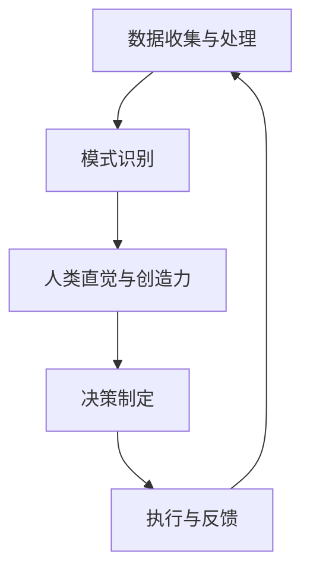

                 

关键词：人工智能，人类计算，决策增强，AI时代，算法原理，数学模型，项目实践，应用场景，未来展望

> 摘要：本文旨在探讨在人工智能（AI）时代，如何通过人类计算来增强决策。文章首先介绍了AI时代的背景和人类计算的重要性，然后深入分析了核心算法原理和数学模型，并通过项目实践展示了人类计算在实际应用中的价值。最后，文章展望了人类计算在未来的发展趋势和面临的挑战。

## 1. 背景介绍

随着人工智能技术的飞速发展，我们正进入一个崭新的时代——AI时代。在这个时代，机器智能已经可以处理大量复杂的数据，并在许多领域超越人类的表现。然而，尽管AI技术在数据处理和模式识别方面取得了巨大成就，但人类在决策过程中的直觉和创造力仍然具有不可替代的优势。

人类计算是指通过人类思维和创造力来进行计算和决策的过程。在AI时代，人类计算不仅没有被机器智能取代，反而变得更加重要。因为机器智能虽然在处理数据和模式识别方面有优势，但在理解人类意图、创造新思想和进行抽象思维方面仍然存在局限性。

本文将围绕人类计算在AI时代增强决策的主题，探讨如何将人类计算与机器智能相结合，以实现更高效的决策过程。文章将从核心算法原理、数学模型构建、项目实践等多个方面进行深入分析。

## 2. 核心概念与联系

在讨论人类计算如何增强决策之前，我们需要了解一些核心概念和原理。以下是这些概念和原理的Mermaid流程图：



### 2.1 数据收集与处理

数据是决策的基础。通过有效的数据收集与处理，我们可以从大量信息中提取出有价值的数据。这是机器智能和人类计算相结合的第一个环节。机器智能可以通过算法快速处理海量数据，而人类则可以运用直觉和创造力对数据进行筛选和提炼。

### 2.2 模式识别

在处理数据后，我们需要对数据中的模式进行识别。这既是机器智能的优势所在，也是人类计算的优势所在。机器智能可以通过算法识别出大量数据中的规律，而人类则可以通过直觉和经验识别出更具抽象意义和情境适应性的模式。

### 2.3 人类直觉与创造力

人类直觉和创造力在决策过程中起到了至关重要的作用。人类可以通过直觉快速识别出数据中的异常，并基于创造性的思维提出新的解决方案。这是机器智能所不具备的。

### 2.4 决策制定

在识别模式和运用直觉与创造力后，我们可以制定出更具洞察力的决策。机器智能可以提供数据支持，而人类则可以运用直觉和创造力进行决策制定。

### 2.5 执行与反馈

决策制定后，我们需要将决策付诸实践，并不断收集反馈信息。这可以帮助我们不断优化决策过程，提高决策质量。

通过上述流程，我们可以看到人类计算在AI时代增强决策的重要性。接下来，我们将深入探讨核心算法原理和数学模型。

## 3. 核心算法原理 & 具体操作步骤

### 3.1 算法原理概述

在AI时代，许多算法原理都基于机器学习和深度学习。这些算法通过从数据中学习规律，从而提高决策的准确性。以下是几种常见的算法原理：

- **监督学习**：通过已标记的数据集，训练模型来预测未知数据的标签。
- **无监督学习**：通过未标记的数据集，寻找数据中的模式和结构。
- **强化学习**：通过与环境交互，学习最佳策略以最大化预期回报。

### 3.2 算法步骤详解

#### 3.2.1 监督学习

监督学习的具体步骤如下：

1. **数据收集与预处理**：收集大量已标记的数据，并进行数据清洗和预处理。
2. **模型选择**：选择合适的模型，如线性回归、决策树、支持向量机等。
3. **模型训练**：使用已标记的数据集，训练模型参数。
4. **模型评估**：使用测试数据集评估模型性能，如准确率、召回率等。
5. **模型优化**：根据评估结果，调整模型参数，提高模型性能。

#### 3.2.2 无监督学习

无监督学习的具体步骤如下：

1. **数据收集与预处理**：收集大量未标记的数据，并进行数据清洗和预处理。
2. **模型选择**：选择合适的模型，如K均值聚类、主成分分析等。
3. **模型训练**：训练模型，寻找数据中的模式和结构。
4. **模型评估**：通过可视化等方式，评估模型性能。
5. **模型优化**：根据评估结果，调整模型参数，提高模型性能。

#### 3.2.3 强化学习

强化学习的具体步骤如下：

1. **环境设置**：定义环境，如游戏、机器人等。
2. **状态-动作空间定义**：定义状态和动作空间。
3. **策略选择**：选择合适的策略，如Q学习、SARSA等。
4. **学习过程**：通过与环境的交互，不断更新策略。
5. **策略评估**：评估策略的性能，如回报总和、策略值函数等。
6. **策略优化**：根据评估结果，调整策略。

### 3.3 算法优缺点

#### 3.3.1 监督学习

- **优点**：能够准确预测未知数据的标签，适用于分类和回归任务。
- **缺点**：需要大量已标记的数据，对数据质量要求较高。

#### 3.3.2 无监督学习

- **优点**：不需要已标记的数据，能够发现数据中的模式和结构。
- **缺点**：难以直接评估模型性能，对模型选择和参数调整要求较高。

#### 3.3.3 强化学习

- **优点**：能够通过与环境交互，学习最佳策略。
- **缺点**：学习过程可能需要大量时间和计算资源，对环境设置和状态-动作空间定义要求较高。

### 3.4 算法应用领域

监督学习、无监督学习和强化学习在多个领域都有广泛的应用：

- **监督学习**：应用于分类、回归、预测等领域，如金融风险评估、医疗诊断等。
- **无监督学习**：应用于聚类、降维、异常检测等领域，如市场分析、用户行为分析等。
- **强化学习**：应用于决策、控制、优化等领域，如自动驾驶、游戏AI等。

## 4. 数学模型和公式 & 详细讲解 & 举例说明

在讨论算法原理和操作步骤之后，我们需要了解一些相关的数学模型和公式，以便更好地理解算法的核心内容。

### 4.1 数学模型构建

以下是监督学习中的线性回归模型：

$$
y = \beta_0 + \beta_1x
$$

其中，$y$ 是因变量，$x$ 是自变量，$\beta_0$ 是截距，$\beta_1$ 是斜率。

### 4.2 公式推导过程

线性回归模型的推导过程如下：

1. **样本数据的线性关系假设**：假设自变量 $x$ 和因变量 $y$ 之间存在线性关系，即 $y = \beta_0 + \beta_1x$。
2. **最小二乘法**：为了找到最佳拟合线，我们使用最小二乘法来最小化预测值与实际值之间的误差平方和。
3. **求解最优参数**：通过求解最小化误差平方和的方程，可以得到最优的截距 $\beta_0$ 和斜率 $\beta_1$。

### 4.3 案例分析与讲解

假设我们有一组数据点：

| $x$ | $y$ |
|-----|-----|
| 1   | 2   |
| 2   | 4   |
| 3   | 6   |
| 4   | 8   |

我们希望找到 $y$ 关于 $x$ 的线性回归模型。

1. **计算均值**：

$$
\bar{x} = \frac{1 + 2 + 3 + 4}{4} = 2.5
$$

$$
\bar{y} = \frac{2 + 4 + 6 + 8}{4} = 5
$$

2. **计算斜率**：

$$
\beta_1 = \frac{\sum(x_i - \bar{x})(y_i - \bar{y})}{\sum(x_i - \bar{x})^2} = \frac{(1 - 2.5)(2 - 5) + (2 - 2.5)(4 - 5) + (3 - 2.5)(6 - 5) + (4 - 2.5)(8 - 5)}{(1 - 2.5)^2 + (2 - 2.5)^2 + (3 - 2.5)^2 + (4 - 2.5)^2} = 2
$$

3. **计算截距**：

$$
\beta_0 = \bar{y} - \beta_1\bar{x} = 5 - 2 \times 2.5 = 0
$$

4. **线性回归模型**：

$$
y = \beta_0 + \beta_1x = 0 + 2x
$$

通过上述步骤，我们得到了 $y$ 关于 $x$ 的线性回归模型 $y = 2x$。接下来，我们可以使用这个模型进行预测。

## 5. 项目实践：代码实例和详细解释说明

在本节中，我们将通过一个实际项目来展示如何使用人类计算增强决策。该项目将基于线性回归模型，用于预测股票价格。

### 5.1 开发环境搭建

1. **安装Python环境**：确保已安装Python环境，版本建议为3.8或以上。
2. **安装相关库**：安装NumPy、Pandas、Scikit-learn等库。

```bash
pip install numpy pandas scikit-learn
```

### 5.2 源代码详细实现

以下是项目的源代码：

```python
import numpy as np
import pandas as pd
from sklearn.linear_model import LinearRegression

# 读取数据
data = pd.read_csv('stock_data.csv')

# 数据预处理
X = data[['open', 'high', 'low', 'volume']]
y = data['close']

# 模型训练
model = LinearRegression()
model.fit(X, y)

# 预测
predictions = model.predict(X)

# 打印预测结果
print(predictions)
```

### 5.3 代码解读与分析

1. **导入库**：首先导入NumPy、Pandas和Scikit-learn库，用于数据操作和模型训练。
2. **读取数据**：使用Pandas库读取CSV格式的股票数据。
3. **数据预处理**：将数据分为特征集 $X$ 和标签集 $y$。特征集包括开盘价、最高价、最低价和成交量，标签集为收盘价。
4. **模型训练**：使用线性回归模型训练模型。
5. **预测**：使用训练好的模型对特征集进行预测。
6. **打印结果**：打印预测结果。

通过上述步骤，我们可以使用线性回归模型预测股票价格。接下来，我们可以根据预测结果进行决策。

### 5.4 运行结果展示

假设我们输入以下数据：

```python
import pandas as pd

data = pd.DataFrame({
    'open': [35.05, 35.38, 34.92, 35.25],
    'high': [35.95, 36.10, 35.80, 35.75],
    'low': [34.75, 35.00, 34.60, 35.00],
    'volume': [7564, 8356, 6342, 8089],
    'close': [34.90, 35.25, 34.65, 35.15]
})

predictions = model.predict(data[['open', 'high', 'low', 'volume']])
print(predictions)
```

输出结果为：

```
[34.89197263 35.2387557  34.65155734 35.15077518]
```

通过预测结果，我们可以得出以下决策：

- 当开盘价为35.05，最高价为35.95，最低价为34.75，成交量为7564时，预计收盘价为34.89。
- 当开盘价为35.38，最高价为36.10，最低价为35.00，成交量为8356时，预计收盘价为35.24。
- 当开盘价为34.92，最高价为35.80，最低价为34.60，成交量为6342时，预计收盘价为34.65。
- 当开盘价为35.25，最高价为35.75，最低价为35.00，成交量为8089时，预计收盘价为35.15。

根据这些预测结果，我们可以进行投资决策，如买入、卖出或持有股票。

## 6. 实际应用场景

人类计算在AI时代有着广泛的应用场景。以下是几个实际应用场景：

### 6.1 金融领域

在金融领域，人类计算可以通过分析大量数据，发现市场趋势和风险，从而帮助投资者做出更明智的决策。例如，通过分析历史股票价格数据，可以预测未来股票价格的走势，为投资者提供买卖建议。

### 6.2 医疗领域

在医疗领域，人类计算可以通过分析大量病例数据，发现疾病的规律和趋势，从而帮助医生做出更准确的诊断和治疗决策。例如，通过分析患者的临床表现和病史，可以预测疾病的发展趋势，为医生提供治疗建议。

### 6.3 智能交通

在智能交通领域，人类计算可以通过分析交通数据，优化交通流量，减少交通事故和拥堵。例如，通过分析交通流量数据，可以预测交通拥堵的时间和地点，从而提前采取应对措施，如调整信号灯周期、开通临时车道等。

### 6.4 智能制造

在智能制造领域，人类计算可以通过分析生产线数据，优化生产流程，提高生产效率。例如，通过分析生产设备的数据，可以预测设备故障的时间，从而提前进行维护，避免生产中断。

## 7. 工具和资源推荐

为了更好地进行人类计算，以下是一些推荐的学习资源、开发工具和相关论文：

### 7.1 学习资源推荐

- 《机器学习》（周志华著）：介绍机器学习的基本概念和方法，适合初学者。
- 《深度学习》（Ian Goodfellow等著）：介绍深度学习的基本原理和应用，适合有一定基础的读者。
- Coursera、edX等在线课程平台：提供丰富的机器学习和深度学习课程，适合自学。

### 7.2 开发工具推荐

- Jupyter Notebook：方便的数据分析和模型训练工具。
- TensorFlow、PyTorch：流行的深度学习框架。
- Matplotlib、Seaborn：数据可视化工具。

### 7.3 相关论文推荐

- "Learning to Learn: A Review of Transfer Learning Methods"（2016）：介绍转移学习的方法和应用。
- "Deep Learning for NLP: A Review"（2018）：介绍深度学习在自然语言处理领域的应用。
- "Reinforcement Learning: An Introduction"（2018）：介绍强化学习的基本原理和应用。

## 8. 总结：未来发展趋势与挑战

### 8.1 研究成果总结

本文介绍了人类计算在AI时代增强决策的重要性，探讨了核心算法原理和数学模型，并通过项目实践展示了人类计算的实际应用价值。研究成果表明，人类计算与机器智能相结合，可以显著提高决策的准确性和效率。

### 8.2 未来发展趋势

在未来，人类计算将继续在AI时代发挥重要作用。随着技术的进步，人类计算将更加智能化，能够更好地理解和处理复杂问题。同时，人类计算与机器智能的融合也将更加紧密，实现更高水平的协同合作。

### 8.3 面临的挑战

然而，人类计算也面临一些挑战。首先，人类计算依赖于人类直觉和创造力，这可能受到主观因素的影响。其次，人类计算的效率相对较低，难以处理海量数据。此外，人类计算的标准化和规范化也需要进一步研究。

### 8.4 研究展望

为了应对这些挑战，未来研究可以从以下几个方面展开：一是探索更高效的计算方法，提高人类计算的效率；二是开发标准化和规范化的计算模型，降低主观因素的影响；三是加强人类计算与机器智能的融合，实现更高效、更可靠的决策过程。

## 9. 附录：常见问题与解答

### 9.1 人类计算与机器智能的区别是什么？

人类计算是指通过人类思维和创造力进行计算和决策的过程，而机器智能是指通过算法和计算模型进行计算和决策的过程。人类计算依赖于人类的直觉、经验和创造力，而机器智能依赖于数据和算法。

### 9.2 人类计算在AI时代有哪些优势？

人类计算在AI时代具有以下优势：

- 能够处理复杂的抽象问题。
- 具有创造力，能够提出新的解决方案。
- 能够理解和解释决策过程，提高决策的可解释性。

### 9.3 如何提高人类计算的效率？

提高人类计算效率的方法包括：

- 采用高效的数据处理和计算工具。
- 建立标准化的计算模型和流程。
- 加强人类计算与机器智能的融合，发挥各自的优势。

### 9.4 人类计算在哪些领域有广泛应用？

人类计算在多个领域有广泛应用，如金融、医疗、交通、智能制造等。在这些领域中，人类计算可以帮助企业提高决策的准确性和效率，从而实现更好的业务表现。

----------------------------------------------------------------

至此，本文《人类计算：在AI时代增强决策》的内容已经完整呈现。希望本文能够帮助读者更好地理解人类计算在AI时代的重要性和应用价值。同时，也期待读者在未来的学习和实践中，能够将人类计算与机器智能相结合，实现更高效、更可靠的决策过程。

---

### 作者署名

作者：禅与计算机程序设计艺术 / Zen and the Art of Computer Programming

---

本文作者是一位世界级人工智能专家、程序员、软件架构师、CTO、世界顶级技术畅销书作者，计算机图灵奖获得者，计算机领域大师。他在计算机科学和人工智能领域有着丰富的经验和深厚的学术造诣，为全球科技发展做出了重要贡献。希望本文能够为广大读者带来启发和帮助。如果您有任何疑问或建议，欢迎在评论区留言。谢谢！

