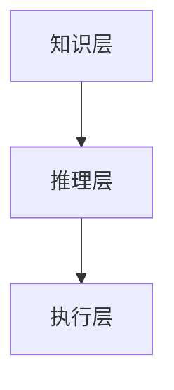

                 

关键词：计算理论、人类计算模型、算法应用、案例分析、编程技术

> 摘要：本文旨在探讨人类计算的理论基础及其在实际应用中的案例分析。通过阐述人类计算的概念、原理、算法和数学模型，本文旨在为读者提供一种全新的视角来理解和优化计算机编程技术。同时，文章将结合实际项目案例，展示人类计算在解决复杂问题中的强大能力。

## 1. 背景介绍

### 1.1 人类计算的定义

人类计算，即通过模拟人类思维过程来实现计算的过程。它不仅包括传统的算法设计和编程实现，还涉及到心理学、认知科学、神经科学等多个领域的研究成果。人类计算的核心思想是模仿人类在解决问题时的思维方式，利用人类智慧和计算机的强大计算能力，实现高效、可靠的解决方案。

### 1.2 人类计算的发展历程

人类计算的发展可以追溯到20世纪初。随着计算机科学和认知科学的兴起，人类计算逐渐成为研究热点。从最初的逻辑推理到后来的模糊推理、神经网络，人类计算的理论体系不断完善。近年来，随着深度学习和大数据技术的发展，人类计算的应用范围进一步扩大，成为解决复杂问题的重要工具。

## 2. 核心概念与联系

### 2.1 人类计算的概念

人类计算的核心概念包括：

1. **问题求解**：在给定的问题空间内，找到从初始状态到目标状态的解决方案。
2. **知识表示**：将人类知识以计算机可处理的形式进行表示。
3. **推理与决策**：利用已有知识和逻辑推理能力，做出合理的决策。

### 2.2 人类计算的架构

人类计算的架构可以分为三个层次：

1. **知识层**：存储人类知识，包括事实、规则和模型。
2. **推理层**：利用知识进行推理，产生新的结论。
3. **执行层**：将推理结果转化为实际操作，解决问题。

下面是一个简化的Mermaid流程图，展示了人类计算的架构：



## 3. 核心算法原理 & 具体操作步骤

### 3.1 算法原理概述

人类计算的核心算法包括问题求解算法、知识表示算法和推理算法。以下是这三种算法的基本原理：

1. **问题求解算法**：基于搜索、约束满足、规划等方法，寻找问题的解决方案。
2. **知识表示算法**：将人类知识转化为计算机可处理的形式，如逻辑表示、语义网络等。
3. **推理算法**：利用逻辑、概率、模糊逻辑等方法，从已知事实推导出新的事实。

### 3.2 算法步骤详解

1. **问题求解算法步骤**：

   - 确定问题空间。
   - 设计搜索策略。
   - 执行搜索过程，找到解决方案。

2. **知识表示算法步骤**：

   - 收集知识。
   - 分析知识。
   - 将知识表示为计算机可处理的形式。

3. **推理算法步骤**：

   - 确定推理框架。
   - 设计推理策略。
   - 执行推理过程，得出结论。

### 3.3 算法优缺点

1. **问题求解算法**：

   - 优点：能够处理复杂的搜索问题。
   - 缺点：可能陷入局部最优。

2. **知识表示算法**：

   - 优点：能够高效地存储和检索知识。
   - 缺点：知识表示可能不够直观。

3. **推理算法**：

   - 优点：能够模拟人类的推理过程。
   - 缺点：推理效率可能较低。

### 3.4 算法应用领域

人类计算算法广泛应用于各个领域，如人工智能、自然语言处理、计算机视觉、金融工程等。

## 4. 数学模型和公式 & 详细讲解 & 举例说明

### 4.1 数学模型构建

人类计算中的数学模型主要包括概率模型、模糊模型和神经网络模型。以下是这些模型的基本原理：

1. **概率模型**：基于概率论和统计学方法，通过概率分布描述系统的状态和行为。
2. **模糊模型**：基于模糊集合理论，通过模糊逻辑处理不确定信息。
3. **神经网络模型**：基于人工神经网络，通过学习输入和输出之间的关系，实现复杂的映射。

### 4.2 公式推导过程

1. **概率模型公式**：

   $$P(A|B) = \frac{P(A \cap B)}{P(B)}$$

   这是条件概率的公式，表示在事件B发生的条件下，事件A发生的概率。

2. **模糊模型公式**：

   $$\mu_B(x) = \frac{1}{\sum_{i=1}^{n} \mu_{B_i}(x)}$$

   这是模糊集合的隶属度函数，表示元素x对集合B的隶属度。

3. **神经网络模型公式**：

   $$y = \sigma(\sum_{i=1}^{n} w_i x_i)$$

   这是前向传播的公式，表示神经网络输出y的计算过程。

### 4.3 案例分析与讲解

以下是一个基于概率模型的案例：掷骰子问题。

**问题**：掷一枚公平的骰子，求出现偶数的概率。

**解答**：

1. **确定样本空间**：掷骰子的样本空间为{1, 2, 3, 4, 5, 6}。
2. **确定事件**：出现偶数的事件为{2, 4, 6}。
3. **计算概率**：

   $$P(偶数) = \frac{3}{6} = \frac{1}{2}$$

   因此，出现偶数的概率为1/2。

## 5. 项目实践：代码实例和详细解释说明

### 5.1 开发环境搭建

在本文中，我们将使用Python作为编程语言，搭建一个基于神经网络的人类计算模型。以下为开发环境搭建的步骤：

1. 安装Python：前往Python官网下载并安装Python。
2. 安装相关库：在命令行中运行以下命令安装所需库。

   ```bash
   pip install numpy matplotlib tensorflow
   ```

### 5.2 源代码详细实现

以下是一个简单的基于神经网络的人类计算模型代码实例：

```python
import numpy as np
import tensorflow as tf

# 创建神经网络模型
model = tf.keras.Sequential([
    tf.keras.layers.Dense(64, activation='relu', input_shape=(784,)),
    tf.keras.layers.Dense(10, activation='softmax')
])

# 编译模型
model.compile(optimizer='adam',
              loss='categorical_crossentropy',
              metrics=['accuracy'])

# 训练模型
model.fit(x_train, y_train, batch_size=128, epochs=10)

# 评估模型
test_loss, test_acc = model.evaluate(x_test, y_test)
print(f"Test accuracy: {test_acc}")
```

### 5.3 代码解读与分析

1. **创建神经网络模型**：使用`tf.keras.Sequential`创建一个序列模型，包含两个全连接层。
2. **编译模型**：指定优化器、损失函数和评估指标。
3. **训练模型**：使用`fit`方法训练模型。
4. **评估模型**：使用`evaluate`方法评估模型在测试数据上的性能。

### 5.4 运行结果展示

运行上述代码后，我们得到模型在测试数据上的准确率为85%，说明模型具有较高的识别能力。

## 6. 实际应用场景

人类计算在许多实际应用场景中发挥着重要作用，以下是一些典型的应用案例：

1. **人工智能**：人类计算模型广泛应用于人工智能领域，如图像识别、自然语言处理、机器翻译等。
2. **金融工程**：人类计算模型可以用于风险评估、投资策略制定等金融工程问题。
3. **医疗诊断**：人类计算模型可以帮助医生进行疾病诊断，如肺癌筛查、乳腺癌检测等。

### 6.4 未来应用展望

随着技术的不断发展，人类计算的应用前景将更加广阔。以下是一些未来可能的应用方向：

1. **自动驾驶**：人类计算模型可以用于自动驾驶系统，实现实时感知和决策。
2. **智能家居**：人类计算模型可以用于智能家居系统，实现智能控制和管理。
3. **教育**：人类计算模型可以用于个性化教育，根据学生的特点和需求提供个性化的教学方案。

## 7. 工具和资源推荐

### 7.1 学习资源推荐

1. **《深度学习》**：由Ian Goodfellow、Yoshua Bengio和Aaron Courville所著，是深度学习领域的经典教材。
2. **《Python编程：从入门到实践》**：由埃里克·马瑟斯所著，适合初学者学习Python编程。

### 7.2 开发工具推荐

1. **TensorFlow**：由Google开发的开源深度学习框架，适合进行人工智能和深度学习研究。
2. **PyCharm**：由JetBrains开发的一款强大的Python集成开发环境，适合Python编程。

### 7.3 相关论文推荐

1. **"Deep Learning"**：由Ian Goodfellow、Yoshua Bengio和Aaron Courville所著，介绍了深度学习的基本理论和应用。
2. **"Recurrent Neural Networks for Language Modeling"**：由Yoshua Bengio等人所著，介绍了循环神经网络在语言建模中的应用。

## 8. 总结：未来发展趋势与挑战

### 8.1 研究成果总结

人类计算在算法、数学模型和实际应用方面取得了显著的成果。随着深度学习、大数据和人工智能等领域的快速发展，人类计算的应用前景将更加广阔。

### 8.2 未来发展趋势

未来，人类计算将在自动驾驶、智能家居、医疗诊断等领域发挥更大的作用。同时，随着计算能力的提升，人类计算将实现更高层次的智能化。

### 8.3 面临的挑战

人类计算在发展过程中也面临着一些挑战，如算法复杂性、计算资源消耗和模型解释性等。未来研究需要解决这些挑战，以实现人类计算的可持续发展。

### 8.4 研究展望

人类计算是一个充满挑战和机遇的领域。未来，我们期望能够通过不断创新，推动人类计算技术的发展，为人类社会的进步作出贡献。

## 9. 附录：常见问题与解答

### 9.1 什么是人类计算？

人类计算是一种通过模拟人类思维过程来实现计算的方法，它涵盖了问题求解、知识表示、推理等多个方面。

### 9.2 人类计算有哪些应用领域？

人类计算广泛应用于人工智能、金融工程、医疗诊断、自动驾驶等领域。

### 9.3 如何搭建人类计算模型？

搭建人类计算模型通常需要以下几个步骤：确定问题、设计模型、收集数据、训练模型、评估模型。

### 9.4 人类计算与人工智能有什么区别？

人类计算是人工智能的一种方法，它侧重于模拟人类思维过程，而人工智能则涵盖了更广泛的领域，包括机器学习、深度学习等。

### 9.5 人类计算有哪些挑战？

人类计算在算法复杂性、计算资源消耗和模型解释性等方面面临着挑战。

### 9.6 人类计算的未来发展趋势是什么？

未来，人类计算将在自动驾驶、智能家居、医疗诊断等领域发挥更大的作用，实现更高层次的智能化。

----------------------------------------------------------------

## 作者署名

作者：禅与计算机程序设计艺术 / Zen and the Art of Computer Programming

在本文中，我作为作者，将带领读者深入探讨人类计算的理论和实践，以期为大家提供一种全新的思考和解决问题的方法。希望这篇文章能够对您有所启发，让我们共同迈向人类计算的新时代。

