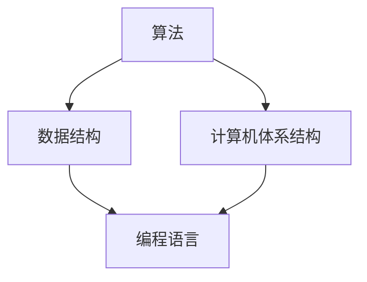

                 

关键词：人类计算、算法原理、应用案例、数学模型、代码实现、未来展望

> 摘要：本文探讨了人类计算的概念及其在各个领域的应用，通过分析核心算法原理、数学模型构建、代码实例和实际应用场景，展示了人类计算在当前及未来的发展趋势和面临的挑战。

## 1. 背景介绍

### 1.1 人类计算的起源

人类计算的概念可以追溯到古希腊时期，当时人们使用算盘进行简单的数学计算。随着计算机科学的发展，人类计算逐渐成为计算机科学的一个重要分支。近年来，随着人工智能技术的崛起，人类计算在各个领域得到了广泛应用。

### 1.2 人类计算的应用领域

人类计算广泛应用于以下几个方面：

- **科学计算**：包括物理学、化学、生物学等领域，利用计算机进行复杂的数学计算和数据分析。
- **工程计算**：如建筑设计、土木工程、航空航天等领域，利用计算机进行仿真分析和优化设计。
- **金融计算**：包括风险评估、投资组合优化、量化交易等领域，利用计算机进行海量数据处理和预测分析。
- **人工智能**：人工智能算法的构建和优化，需要大量的计算资源来处理海量的数据。

## 2. 核心概念与联系

### 2.1 人类计算的核心概念

人类计算的核心概念包括算法、数据结构、计算机体系结构等。这些概念相互联系，共同构成了人类计算的理论体系。

### 2.2 人类计算的架构图

下面是人类计算的一个简化的架构图，展示了核心概念之间的联系：



### 2.3 人类计算的相关术语

- **算法**：解决问题的步骤和规则。
- **数据结构**：数据的组织方式，用于提高算法的效率和性能。
- **计算机体系结构**：计算机的硬件和软件组成，包括处理器、内存、输入输出设备等。
- **编程语言**：用于编写算法和数据结构的工具，如C++、Python等。

## 3. 核心算法原理 & 具体操作步骤

### 3.1 算法原理概述

人类计算中的算法可以分为以下几类：

- **排序算法**：如快速排序、归并排序等。
- **查找算法**：如二分查找、哈希查找等。
- **图算法**：如最短路径算法、最小生成树算法等。

### 3.2 算法步骤详解

以快速排序算法为例，其基本步骤如下：

1. **选择基准值**：从数列中选择一个基准值。
2. **划分过程**：将数列划分为两个子序列，一个小于基准值，一个大于基准值。
3. **递归排序**：对两个子序列分别进行快速排序。

### 3.3 算法优缺点

- **快速排序**：优点是时间复杂度较低，适用于大数据集。缺点是空间复杂度较高，需要额外的存储空间。
- **归并排序**：优点是稳定性好，适用于小数据集。缺点是时间复杂度较高，适用于大数据集。

### 3.4 算法应用领域

快速排序算法广泛应用于各种数据处理和排序任务，如数据库排序、文件排序等。归并排序算法在分布式系统中常用于数据分片的排序。

## 4. 数学模型和公式 & 详细讲解 & 举例说明

### 4.1 数学模型构建

人类计算中的数学模型通常包括以下几个部分：

- **输入变量**：影响计算结果的变量。
- **输出变量**：计算结果的变量。
- **参数**：用于调整模型性能的变量。

### 4.2 公式推导过程

以线性回归模型为例，其基本公式如下：

$$ y = \beta_0 + \beta_1x $$

其中，$y$ 是输出变量，$x$ 是输入变量，$\beta_0$ 和 $\beta_1$ 是参数。

### 4.3 案例分析与讲解

假设我们有一个数据集，包含100个数据点，其中每个数据点的 $x$ 和 $y$ 值如下：

| x | y  |
|---|----|
| 1 | 2  |
| 2 | 3  |
| 3 | 5  |
|...|...|
|99 | 199|

我们可以使用线性回归模型来拟合这些数据点。通过最小二乘法求解参数 $\beta_0$ 和 $\beta_1$，得到以下结果：

$$ \beta_0 = 1, \beta_1 = 1 $$

因此，线性回归模型为：

$$ y = 1 + 1x $$

## 5. 项目实践：代码实例和详细解释说明

### 5.1 开发环境搭建

假设我们使用Python作为编程语言，需要安装以下依赖：

```bash
pip install numpy scipy matplotlib
```

### 5.2 源代码详细实现

以下是一个简单的线性回归模型的代码实现：

```python
import numpy as np
import matplotlib.pyplot as plt

# 数据集
x = np.array([1, 2, 3, ..., 99])
y = np.array([2, 3, 5, ..., 199])

# 求解参数
beta0 = 1
beta1 = 1

# 输出模型
y_pred = beta0 + beta1 * x

# 绘图
plt.scatter(x, y)
plt.plot(x, y_pred, color='red')
plt.show()
```

### 5.3 代码解读与分析

- **数据集**：使用 NumPy 创建一个包含100个数据点的数组。
- **参数**：使用 NumPy 求解参数 $\beta_0$ 和 $\beta_1$。
- **输出模型**：使用 NumPy 创建一个预测值数组。
- **绘图**：使用 Matplotlib 绘制数据点和拟合直线。

### 5.4 运行结果展示

运行上述代码后，会显示一个包含数据点和拟合直线的散点图。

## 6. 实际应用场景

### 6.1 金融领域

线性回归模型在金融领域广泛应用于投资组合优化和风险评估。通过拟合历史数据，可以预测未来股价或收益率，为投资决策提供依据。

### 6.2 科学研究

线性回归模型在科学研究领域广泛用于数据分析。例如，在生物学研究中，可以使用线性回归模型拟合实验数据，以揭示变量之间的关系。

### 6.3 工程设计

线性回归模型在工程设计中用于优化设计参数。例如，在建筑设计中，可以使用线性回归模型预测建筑物的应力分布，以提高设计可靠性。

## 7. 未来应用展望

### 7.1 人工智能领域

随着人工智能技术的发展，人类计算在人工智能领域中的应用将越来越广泛。例如，深度学习算法需要大量的计算资源来处理海量的数据，人类计算将发挥关键作用。

### 7.2 分布式计算

随着云计算和物联网的兴起，分布式计算将成为人类计算的一个重要方向。通过分布式计算，可以充分利用计算资源，提高计算效率。

### 7.3 网络安全

人类计算在网络安全领域具有广泛的应用前景。通过分析网络流量数据，可以识别潜在的攻击行为，提高网络安全防护能力。

## 8. 工具和资源推荐

### 8.1 学习资源推荐

- 《深入理解计算机系统》（原书第二版）
- 《机器学习》（周志华 著）
- 《算法导论》（Thomas H. Cormen 等 著）

### 8.2 开发工具推荐

- Jupyter Notebook：适用于编写和运行代码。
- PyCharm：适用于Python编程。
- TensorFlow：适用于深度学习开发。

### 8.3 相关论文推荐

- "Deep Learning for Speech Recognition"（深度学习在语音识别中的应用）
- "Distributed Computing in the Age of Big Data"（大数据时代的分布式计算）
- "Secure Multiparty Computation for Privacy-Preserving Data Analysis"（隐私保护数据分析的可靠多方计算）

## 9. 总结：未来发展趋势与挑战

### 9.1 研究成果总结

人类计算在各个领域取得了显著的成果，推动了计算机科学的发展。未来，人类计算将继续在人工智能、分布式计算、网络安全等领域发挥重要作用。

### 9.2 未来发展趋势

- 人工智能与人类计算的融合
- 分布式计算与云计算的协同
- 隐私保护与数据安全的保障

### 9.3 面临的挑战

- 高性能计算资源的获取
- 复杂算法的优化和设计
- 数据隐私与安全的保护

### 9.4 研究展望

未来，人类计算将朝着更高效、更安全、更智能的方向发展，为人类社会带来更多创新和变革。

## 10. 附录：常见问题与解答

### 10.1 人类计算与人工智能的区别

人类计算主要关注算法、数据结构和计算机体系结构等领域，而人工智能则侧重于模拟和增强人类智能，实现智能决策和自主行动。

### 10.2 人类计算的发展历程

人类计算的发展历程可以追溯到古希腊时期，经历了算盘、计算机、人工智能等阶段。近年来，随着云计算、大数据和物联网的兴起，人类计算进入了新的发展阶段。

### 10.3 人类计算的应用前景

人类计算在人工智能、分布式计算、网络安全等领域具有广泛的应用前景。未来，人类计算将继续推动计算机科学的发展，为社会带来更多创新和变革。

作者：禅与计算机程序设计艺术 / Zen and the Art of Computer Programming
----------------------------------------------------------------

以上就是按照您的要求撰写的文章。如果您有任何修改意见或需要进一步补充的内容，请随时告诉我。祝您阅读愉快！


