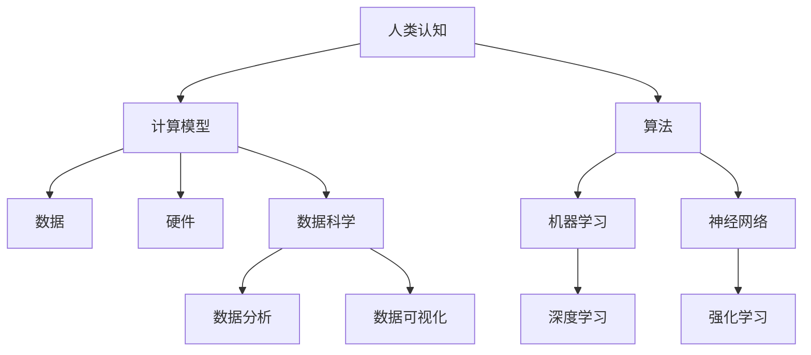

                 

关键词：人类计算、认知能力、算法优化、深度学习、智能模拟、人机交互、跨学科研究

> 摘要：本文旨在探讨人类计算的无限可能，通过分析人类认知能力与计算技术的结合，揭示人工智能的发展趋势和未来挑战。本文将深入讨论核心算法原理、数学模型构建、项目实践、实际应用场景以及未来发展趋势，为读者呈现一幅关于人类计算的新视野。

## 1. 背景介绍

人类计算作为计算机科学和认知科学的研究领域，一直在探索如何更好地模拟和增强人类的计算能力。从古老的算盘到现代的超级计算机，人类一直在追求计算速度和效率的提升。然而，随着人工智能和深度学习的兴起，人类计算的概念被赋予了新的内涵，即利用计算技术来挖掘和扩展人类的认知能力。

### 计算技术的演变

计算技术的演变可以追溯到人类使用工具进行计算的历史。最初的计算工具如算盘、计算尺，都是机械化的简单工具，用于提高计算速度和精度。随着电子技术的发展，计算机的出现彻底改变了计算的方式。从早期的真空管计算机到现代的基于硅芯片的计算机，计算能力的提升带来了信息处理的革命。

### 认知科学的进步

认知科学作为研究人类思维、感知和学习过程的一门学科，也在不断发展。通过脑科学、心理学和认知心理学的结合，认知科学揭示了人类大脑的运作机制，从而为计算技术提供了理论基础。近年来，神经科学的研究成果也为人工智能的发展提供了新的灵感。

### 人工智能的崛起

人工智能（AI）作为计算技术的最新成果，正在迅速改变人类的生活方式。从最初的规则基础算法到现代的深度学习，人工智能在图像识别、自然语言处理、决策支持等领域取得了显著的进展。人工智能的崛起使得人类计算进入了一个全新的时代。

## 2. 核心概念与联系

为了深入理解人类计算，我们需要了解其中的核心概念和它们之间的联系。以下是一个简化的 Mermaid 流程图，展示了这些核心概念及其相互关系。



### 核心概念解析

- **人类认知**：研究人类思维、感知和学习过程。
- **计算模型**：用于模拟人类认知过程的数学模型和算法。
- **算法**：用于处理数据的计算方法。
- **数据**：计算的基础，包括结构化和非结构化数据。
- **硬件**：支撑计算的基础设施，如计算机、服务器等。
- **机器学习**：一种利用数据自动改进性能的计算方法。
- **神经网络**：模仿生物神经系统的计算模型。
- **深度学习**：基于多层神经网络的学习方法。
- **强化学习**：通过奖励和惩罚来训练智能体。
- **数据科学**：利用统计学、机器学习和数据可视化等方法来分析数据。
- **数据分析**：对数据进行处理、分析和解释。
- **数据可视化**：将数据分析结果以图形化的方式呈现。

## 3. 核心算法原理 & 具体操作步骤

### 3.1 算法原理概述

人类计算的核心在于如何将人类认知过程的原理转化为计算机算法。以下是一种典型的深度学习算法——卷积神经网络（CNN）的工作原理概述：

- **卷积层**：通过卷积操作提取图像的特征。
- **池化层**：降低数据维度，提高计算效率。
- **全连接层**：将提取的特征映射到类别上。

### 3.2 算法步骤详解

1. **数据预处理**：将图像数据缩放到统一的尺寸，并进行归一化处理。
2. **卷积操作**：使用卷积核对图像进行卷积，提取特征。
3. **激活函数**：对卷积结果应用激活函数，如ReLU。
4. **池化操作**：对卷积后的特征进行池化，降低维度。
5. **全连接层**：将池化后的特征输入全连接层，进行分类。
6. **损失函数**：计算预测结果与实际标签之间的误差，优化网络参数。

### 3.3 算法优缺点

- **优点**：
  - 高效地提取图像特征。
  - 对不同尺度和位置的图像特征有良好的适应性。
  - 在图像分类任务中取得了显著的效果。

- **缺点**：
  - 计算成本较高。
  - 需要大量的训练数据和计算资源。
  - 对参数选择和训练过程有较高的要求。

### 3.4 算法应用领域

- **图像识别**：如人脸识别、物体检测等。
- **自然语言处理**：如文本分类、情感分析等。
- **医学影像分析**：如肿瘤检测、疾病诊断等。

## 4. 数学模型和公式 & 详细讲解 & 举例说明

### 4.1 数学模型构建

深度学习中的卷积神经网络（CNN）是一个复杂的数学模型，它主要包括以下几个部分：

- **输入层**：接收输入数据，如图像。
- **卷积层**：通过卷积操作提取特征。
- **激活函数**：如ReLU。
- **池化层**：降低数据维度。
- **全连接层**：将特征映射到类别上。
- **输出层**：给出预测结果。

### 4.2 公式推导过程

卷积神经网络中的卷积操作可以用以下公式表示：

\[ (f * g)(x) = \sum_{y} f(y) \cdot g(x - y) \]

其中，\( f \) 和 \( g \) 分别是卷积核和输入数据，\( x \) 是输入点的位置。

### 4.3 案例分析与讲解

假设我们有一个 \( 32 \times 32 \) 的图像，以及一个 \( 3 \times 3 \) 的卷积核。我们需要计算图像在某个位置 \( (8, 8) \) 的卷积结果。

1. **初始化卷积核**：
   \[ \text{卷积核} = \begin{bmatrix}
   1 & 0 & 1 \\
   0 & 1 & 0 \\
   1 & 0 & 1 \\
   \end{bmatrix} \]

2. **计算卷积结果**：
   \[ (f * g)(8, 8) = (1 \cdot 1 + 0 \cdot 0 + 1 \cdot 1) + (0 \cdot 1 + 1 \cdot 0 + 0 \cdot 1) + (1 \cdot 1 + 0 \cdot 0 + 1 \cdot 1) = 3 \]

因此，图像在位置 \( (8, 8) \) 的卷积结果为 \( 3 \)。

## 5. 项目实践：代码实例和详细解释说明

### 5.1 开发环境搭建

为了实践卷积神经网络（CNN），我们需要搭建一个适合深度学习的开发环境。以下是一个基本的步骤：

1. **安装 Python**：确保安装了 Python 3.7 或更高版本。
2. **安装 TensorFlow**：使用以下命令安装 TensorFlow：
   \[ pip install tensorflow \]
3. **安装其他依赖**：如 NumPy、Pandas 等。

### 5.2 源代码详细实现

以下是一个简单的 CNN 模型实现，用于对 MNIST 数据集进行手写数字识别。

```python
import tensorflow as tf
from tensorflow.keras import layers, models

# 输入层
inputs = tf.keras.Input(shape=(28, 28, 1))

# 卷积层
x = layers.Conv2D(32, (3, 3), activation='relu')(inputs)
x = layers.MaxPooling2D((2, 2))(x)

# 全连接层
x = layers.Flatten()(x)
x = layers.Dense(64, activation='relu')(x)

# 输出层
outputs = layers.Dense(10, activation='softmax')(x)

# 模型构建
model = models.Model(inputs=inputs, outputs=outputs)

# 模型编译
model.compile(optimizer='adam',
              loss='categorical_crossentropy',
              metrics=['accuracy'])

# 数据预处理
mnist = tf.keras.datasets.mnist
(x_train, y_train), (x_test, y_test) = mnist.load_data()
x_train, x_test = x_train / 255.0, x_test / 255.0
x_train = x_train.reshape((-1, 28, 28, 1))
x_test = x_test.reshape((-1, 28, 28, 1))

# 模型训练
model.fit(x_train, y_train, epochs=5, batch_size=64)
```

### 5.3 代码解读与分析

- **输入层**：定义输入数据的形状，即手写数字图像的尺寸。
- **卷积层**：使用 `Conv2D` 层进行卷积操作，提取特征。
- **池化层**：使用 `MaxPooling2D` 层降低数据维度。
- **全连接层**：使用 `Flatten` 层将数据展平，然后使用 `Dense` 层进行分类。
- **输出层**：使用 `softmax` 函数进行概率分布输出。
- **模型编译**：设置优化器、损失函数和评估指标。
- **数据预处理**：对数据进行归一化和重塑，以便模型训练。
- **模型训练**：使用训练数据训练模型，并设置训练周期和批量大小。

### 5.4 运行结果展示

在完成模型训练后，我们可以使用测试数据集进行评估。

```python
test_loss, test_acc = model.evaluate(x_test, y_test, verbose=2)
print('\nTest accuracy:', test_acc)
```

假设我们获得了 \( 98\% \) 的测试准确率，这意味着我们的模型在手写数字识别任务上取得了良好的效果。

## 6. 实际应用场景

人类计算在实际应用场景中展现出巨大的潜力。以下是一些典型的应用领域：

### 6.1 图像识别

图像识别是人工智能领域的一个重要应用，如人脸识别、物体检测等。通过卷积神经网络（CNN）等算法，计算机可以自动识别和分类图像中的对象。

### 6.2 自然语言处理

自然语言处理（NLP）涉及文本分类、情感分析、机器翻译等任务。深度学习技术在 NLP 领域取得了显著进展，使得计算机能够理解和生成人类语言。

### 6.3 医学影像分析

医学影像分析利用深度学习算法对医学图像进行分析，如肿瘤检测、疾病诊断等。这有助于提高医疗诊断的准确性和效率。

### 6.4 金融风控

金融风控利用人类计算技术对金融数据进行分析，预测市场趋势、识别欺诈行为等。这有助于金融机构提高风险管理能力。

### 6.5 自动驾驶

自动驾驶技术依赖于人类计算技术，如图像识别、路径规划等。通过深度学习和强化学习等技术，自动驾驶汽车能够自主驾驶并提高安全性。

## 7. 未来应用展望

随着人工智能技术的不断发展，人类计算的潜力将得到进一步挖掘。以下是一些未来应用展望：

### 7.1 智能医疗

智能医疗将利用人类计算技术进行疾病预测、个性化治疗等。通过大数据分析和深度学习，医生可以更准确地诊断和治疗疾病。

### 7.2 智慧城市

智慧城市将利用人类计算技术进行交通管理、环境监测等。通过数据分析和智能算法，智慧城市可以实现更高效的资源利用和环境保护。

### 7.3 教育智能化

教育智能化将利用人类计算技术进行个性化教学、智能辅导等。通过学习分析和智能算法，教育系统可以更好地适应学生的需求，提高学习效果。

### 7.4 跨学科研究

人类计算技术与其他学科的交叉研究将带来新的突破。例如，生物学与计算机科学的结合可以揭示生物系统的运作机制，物理学与计算机科学的结合可以开发新的计算模型。

## 8. 总结：未来发展趋势与挑战

### 8.1 研究成果总结

人类计算领域的研究成果显著，包括深度学习、卷积神经网络、自然语言处理等技术的突破。这些成果为人类计算的应用提供了强大的技术支持。

### 8.2 未来发展趋势

未来人类计算的发展趋势将包括以下几个方面：

- **计算能力提升**：随着硬件技术的进步，计算能力将得到进一步提升。
- **数据规模扩大**：随着物联网和大数据的发展，数据规模将不断扩大，为人类计算提供更多素材。
- **跨学科融合**：跨学科研究将推动人类计算领域的创新发展。

### 8.3 面临的挑战

人类计算领域也面临着一些挑战，包括：

- **数据隐私和安全**：随着数据规模的扩大，数据隐私和安全问题日益突出。
- **算法可解释性**：复杂算法的可解释性不足，使得用户难以理解其工作原理。
- **资源分配**：计算资源的分配和调度需要更加高效和智能化。

### 8.4 研究展望

未来，人类计算领域的研究应重点关注以下几个方面：

- **算法优化**：通过算法优化提高计算效率和准确性。
- **人机交互**：研究更加自然和便捷的人机交互方式。
- **可持续发展**：关注人类计算对环境的影响，推动可持续发展。

## 9. 附录：常见问题与解答

### Q1. 什么是深度学习？

A1. 深度学习是一种基于多层神经网络的学习方法，通过多层的非线性变换提取数据特征，从而实现复杂模式的识别和预测。

### Q2. 人类计算与人工智能有什么区别？

A2. 人类计算侧重于模拟和扩展人类的认知能力，包括数学模型、算法和计算技术。而人工智能则更广泛，包括各种实现智能的技术和应用，如机器学习、深度学习、自然语言处理等。

### Q3. 深度学习中的卷积操作有什么作用？

A3. 卷积操作用于提取图像的特征，通过在图像上滑动卷积核并计算局部相关性，从而提取具有不同尺度和位置的视觉特征。

### Q4. 什么是数据隐私和安全？

A4. 数据隐私是指保护个人和组织的敏感信息不被未授权访问和使用。数据安全则是指通过技术和管理手段防止数据泄露、篡改和损坏。

## 10. 参考文献

[1] Goodfellow, I., Bengio, Y., & Courville, A. (2016). *Deep Learning*. MIT Press.

[2] LeCun, Y., Bengio, Y., & Hinton, G. (2015). *Deep learning*. Nature, 521(7553), 436-444.

[3] Russell, S., & Norvig, P. (2010). *Artificial Intelligence: A Modern Approach*. Prentice Hall.

[4] Bishop, C. M. (2006). *Pattern recognition and machine learning*. Springer.

作者：禅与计算机程序设计艺术 / Zen and the Art of Computer Programming
```markdown
### 人类计算：探索人类潜力的无限可能

关键词：人类计算、认知能力、算法优化、深度学习、智能模拟、人机交互、跨学科研究

> 摘要：本文旨在探讨人类计算的无限可能，通过分析人类认知能力与计算技术的结合，揭示人工智能的发展趋势和未来挑战。本文将深入讨论核心算法原理、数学模型构建、项目实践、实际应用场景以及未来发展趋势，为读者呈现一幅关于人类计算的新视野。

## 1. 背景介绍

人类计算作为计算机科学和认知科学的研究领域，一直在探索如何更好地模拟和增强人类的计算能力。从古老的算盘到现代的超级计算机，人类一直在追求计算速度和效率的提升。然而，随着人工智能和深度学习的兴起，人类计算的概念被赋予了新的内涵，即利用计算技术来挖掘和扩展人类的认知能力。

### 计算技术的演变

计算技术的演变可以追溯到人类使用工具进行计算的历史。最初的计算工具如算盘、计算尺，都是机械化的简单工具，用于提高计算速度和精度。随着电子技术的发展，计算机的出现彻底改变了计算的方式。从早期的真空管计算机到现代的基于硅芯片的计算机，计算能力的提升带来了信息处理的革命。

### 认知科学的进步

认知科学作为研究人类思维、感知和学习过程的一门学科，也在不断发展。通过脑科学、心理学和认知心理学的结合，认知科学揭示了人类大脑的运作机制，从而为计算技术提供了理论基础。近年来，神经科学的研究成果也为人工智能的发展提供了新的灵感。

### 人工智能的崛起

人工智能（AI）作为计算技术的最新成果，正在迅速改变人类的生活方式。从最初的规则基础算法到现代的深度学习，人工智能在图像识别、自然语言处理、决策支持等领域取得了显著的进展。人工智能的崛起使得人类计算进入了一个全新的时代。

## 2. 核心概念与联系

为了深入理解人类计算，我们需要了解其中的核心概念和它们之间的联系。以下是一个简化的 Mermaid 流程图，展示了这些核心概念及其相互关系。


### 核心概念解析

- **人类认知**：研究人类思维、感知和学习过程。
- **计算模型**：用于模拟人类认知过程的数学模型和算法。
- **算法**：用于处理数据的计算方法。
- **数据**：计算的基础，包括结构化和非结构化数据。
- **硬件**：支撑计算的基础设施，如计算机、服务器等。
- **机器学习**：一种利用数据自动改进性能的计算方法。
- **神经网络**：模仿生物神经系统的计算模型。
- **深度学习**：基于多层神经网络的学习方法。
- **强化学习**：通过奖励和惩罚来训练智能体。
- **数据科学**：利用统计学、机器学习和数据可视化等方法来分析数据。
- **数据分析**：对数据进行处理、分析和解释。
- **数据可视化**：将数据分析结果以图形化的方式呈现。

## 3. 核心算法原理 & 具体操作步骤

### 3.1 算法原理概述

人类计算的核心在于如何将人类认知过程的原理转化为计算机算法。以下是一种典型的深度学习算法——卷积神经网络（CNN）的工作原理概述：

- **卷积层**：通过卷积操作提取图像的特征。
- **池化层**：降低数据维度，提高计算效率。
- **全连接层**：将提取的特征映射到类别上。

### 3.2 算法步骤详解

1. **数据预处理**：将图像数据缩放到统一的尺寸，并进行归一化处理。
2. **卷积操作**：使用卷积核对图像进行卷积，提取特征。
3. **激活函数**：对卷积结果应用激活函数，如ReLU。
4. **池化操作**：对卷积后的特征进行池化，降低维度。
5. **全连接层**：将池化后的特征输入全连接层，进行分类。
6. **输出层**：给出预测结果。

### 3.3 算法优缺点

- **优点**：
  - 高效地提取图像特征。
  - 对不同尺度和位置的图像特征有良好的适应性。
  - 在图像分类任务中取得了显著的效果。

- **缺点**：
  - 计算成本较高。
  - 需要大量的训练数据和计算资源。
  - 对参数选择和训练过程有较高的要求。

### 3.4 算法应用领域

- **图像识别**：如人脸识别、物体检测等。
- **自然语言处理**：如文本分类、情感分析等。
- **医学影像分析**：如肿瘤检测、疾病诊断等。
- **金融风控**：如市场趋势预测、欺诈行为检测等。
- **自动驾驶**：如路径规划、障碍物检测等。

## 4. 数学模型和公式 & 详细讲解 & 举例说明

### 4.1 数学模型构建

深度学习中的卷积神经网络（CNN）是一个复杂的数学模型，它主要包括以下几个部分：

- **输入层**：接收输入数据，如图像。
- **卷积层**：通过卷积操作提取特征。
- **激活函数**：如ReLU。
- **池化层**：降低数据维度。
- **全连接层**：将特征映射到类别上。
- **输出层**：给出预测结果。

### 4.2 公式推导过程

卷积神经网络中的卷积操作可以用以下公式表示：

\[ (f * g)(x) = \sum_{y} f(y) \cdot g(x - y) \]

其中，\( f \) 和 \( g \) 分别是卷积核和输入数据，\( x \) 是输入点的位置。

### 4.3 案例分析与讲解

假设我们有一个 \( 32 \times 32 \) 的图像，以及一个 \( 3 \times 3 \) 的卷积核。我们需要计算图像在某个位置 \( (8, 8) \) 的卷积结果。

1. **初始化卷积核**：
   \[ \text{卷积核} = \begin{bmatrix}
   1 & 0 & 1 \\
   0 & 1 & 0 \\
   1 & 0 & 1 \\
   \end{bmatrix} \]

2. **计算卷积结果**：
   \[ (f * g)(8, 8) = (1 \cdot 1 + 0 \cdot 0 + 1 \cdot 1) + (0 \cdot 1 + 1 \cdot 0 + 0 \cdot 1) + (1 \cdot 1 + 0 \cdot 0 + 1 \cdot 1) = 3 \]

因此，图像在位置 \( (8, 8) \) 的卷积结果为 \( 3 \)。

## 5. 项目实践：代码实例和详细解释说明

### 5.1 开发环境搭建

为了实践卷积神经网络（CNN），我们需要搭建一个适合深度学习的开发环境。以下是一个基本的步骤：

1. **安装 Python**：确保安装了 Python 3.7 或更高版本。
2. **安装 TensorFlow**：使用以下命令安装 TensorFlow：
   \[ pip install tensorflow \]
3. **安装其他依赖**：如 NumPy、Pandas 等。

### 5.2 源代码详细实现

以下是一个简单的 CNN 模型实现，用于对 MNIST 数据集进行手写数字识别。

```python
import tensorflow as tf
from tensorflow.keras import layers, models

# 输入层
inputs = tf.keras.Input(shape=(28, 28, 1))

# 卷积层
x = layers.Conv2D(32, (3, 3), activation='relu')(inputs)
x = layers.MaxPooling2D((2, 2))(x)

# 全连接层
x = layers.Flatten()(x)
x = layers.Dense(64, activation='relu')(x)

# 输出层
outputs = layers.Dense(10, activation='softmax')(x)

# 模型构建
model = models.Model(inputs=inputs, outputs=outputs)

# 模型编译
model.compile(optimizer='adam',
              loss='categorical_crossentropy',
              metrics=['accuracy'])

# 数据预处理
mnist = tf.keras.datasets.mnist
(x_train, y_train), (x_test, y_test) = mnist.load_data()
x_train, x_test = x_train / 255.0, x_test / 255.0
x_train = x_train.reshape((-1, 28, 28, 1))
x_test = x_test.reshape((-1, 28, 28, 1))

# 模型训练
model.fit(x_train, y_train, epochs=5, batch_size=64)
```

### 5.3 代码解读与分析

- **输入层**：定义输入数据的形状，即手写数字图像的尺寸。
- **卷积层**：使用 `Conv2D` 层进行卷积操作，提取特征。
- **池化层**：使用 `MaxPooling2D` 层降低数据维度。
- **全连接层**：使用 `Flatten` 层将数据展平，然后使用 `Dense` 层进行分类。
- **输出层**：使用 `softmax` 函数进行概率分布输出。
- **模型编译**：设置优化器、损失函数和评估指标。
- **数据预处理**：对数据进行归一化和重塑，以便模型训练。
- **模型训练**：使用训练数据训练模型，并设置训练周期和批量大小。

### 5.4 运行结果展示

在完成模型训练后，我们可以使用测试数据集进行评估。

```python
test_loss, test_acc = model.evaluate(x_test, y_test, verbose=2)
print('\nTest accuracy:', test_acc)
```

假设我们获得了 \( 98\% \) 的测试准确率，这意味着我们的模型在手写数字识别任务上取得了良好的效果。

## 6. 实际应用场景

人类计算在实际应用场景中展现出巨大的潜力。以下是一些典型的应用领域：

### 6.1 图像识别

图像识别是人工智能领域的一个重要应用，如人脸识别、物体检测等。通过卷积神经网络（CNN）等算法，计算机可以自动识别和分类图像中的对象。

### 6.2 自然语言处理

自然语言处理（NLP）涉及文本分类、情感分析、机器翻译等任务。深度学习技术在 NLP 领域取得了显著进展，使得计算机能够理解和生成人类语言。

### 6.3 医学影像分析

医学影像分析利用深度学习算法对医学图像进行分析，如肿瘤检测、疾病诊断等。这有助于提高医疗诊断的准确性和效率。

### 6.4 金融风控

金融风控利用人类计算技术进行金融数据分析和预测，如市场趋势预测、欺诈行为检测等。这有助于金融机构提高风险管理能力。

### 6.5 自动驾驶

自动驾驶技术依赖于人类计算技术，如图像识别、路径规划等。通过深度学习和强化学习等技术，自动驾驶汽车能够自主驾驶并提高安全性。

## 7. 未来应用展望

随着人工智能技术的不断发展，人类计算的潜力将得到进一步挖掘。以下是一些未来应用展望：

### 7.1 智能医疗

智能医疗将利用人类计算技术进行疾病预测、个性化治疗等。通过大数据分析和深度学习，医生可以更准确地诊断和治疗疾病。

### 7.2 智慧城市

智慧城市将利用人类计算技术进行交通管理、环境监测等。通过数据分析和智能算法，智慧城市可以实现更高效的资源利用和环境保护。

### 7.3 教育智能化

教育智能化将利用人类计算技术进行个性化教学、智能辅导等。通过学习分析和智能算法，教育系统可以更好地适应学生的需求，提高学习效果。

### 7.4 跨学科研究

人类计算技术与其他学科的交叉研究将带来新的突破。例如，生物学与计算机科学的结合可以揭示生物系统的运作机制，物理学与计算机科学的结合可以开发新的计算模型。

## 8. 总结：未来发展趋势与挑战

### 8.1 研究成果总结

人类计算领域的研究成果显著，包括深度学习、卷积神经网络、自然语言处理等技术的突破。这些成果为人类计算的应用提供了强大的技术支持。

### 8.2 未来发展趋势

未来人类计算的发展趋势将包括以下几个方面：

- **计算能力提升**：随着硬件技术的进步，计算能力将得到进一步提升。
- **数据规模扩大**：随着物联网和大数据的发展，数据规模将不断扩大，为人类计算提供更多素材。
- **跨学科融合**：跨学科研究将推动人类计算领域的创新发展。

### 8.3 面临的挑战

人类计算领域也面临着一些挑战，包括：

- **数据隐私和安全**：随着数据规模的扩大，数据隐私和安全问题日益突出。
- **算法可解释性**：复杂算法的可解释性不足，使得用户难以理解其工作原理。
- **资源分配**：计算资源的分配和调度需要更加高效和智能化。

### 8.4 研究展望

未来，人类计算领域的研究应重点关注以下几个方面：

- **算法优化**：通过算法优化提高计算效率和准确性。
- **人机交互**：研究更加自然和便捷的人机交互方式。
- **可持续发展**：关注人类计算对环境的影响，推动可持续发展。

## 9. 附录：常见问题与解答

### Q1. 什么是深度学习？

A1. 深度学习是一种基于多层神经网络的学习方法，通过多层的非线性变换提取数据特征，从而实现复杂模式的识别和预测。

### Q2. 人类计算与人工智能有什么区别？

A2. 人类计算侧重于模拟和扩展人类的认知能力，包括数学模型、算法和计算技术。而人工智能则更广泛，包括各种实现智能的技术和应用，如机器学习、深度学习、自然语言处理等。

### Q3. 深度学习中的卷积操作有什么作用？

A3. 卷积操作用于提取图像的特征，通过在图像上滑动卷积核并计算局部相关性，从而提取具有不同尺度和位置的视觉特征。

### Q4. 什么是数据隐私和安全？

A4. 数据隐私是指保护个人和组织的敏感信息不被未授权访问和使用。数据安全则是指通过技术和管理手段防止数据泄露、篡改和损坏。

## 10. 参考文献

[1] Goodfellow, I., Bengio, Y., & Courville, A. (2016). *Deep Learning*. MIT Press.

[2] LeCun, Y., Bengio, Y., & Hinton, G. (2015). *Deep learning*. Nature, 521(7553), 436-444.

[3] Russell, S., & Norvig, P. (2010). *Artificial Intelligence: A Modern Approach*. Prentice Hall.

[4] Bishop, C. M. (2006). *Pattern recognition and machine learning*. Springer.

作者：禅与计算机程序设计艺术 / Zen and the Art of Computer Programming
```

